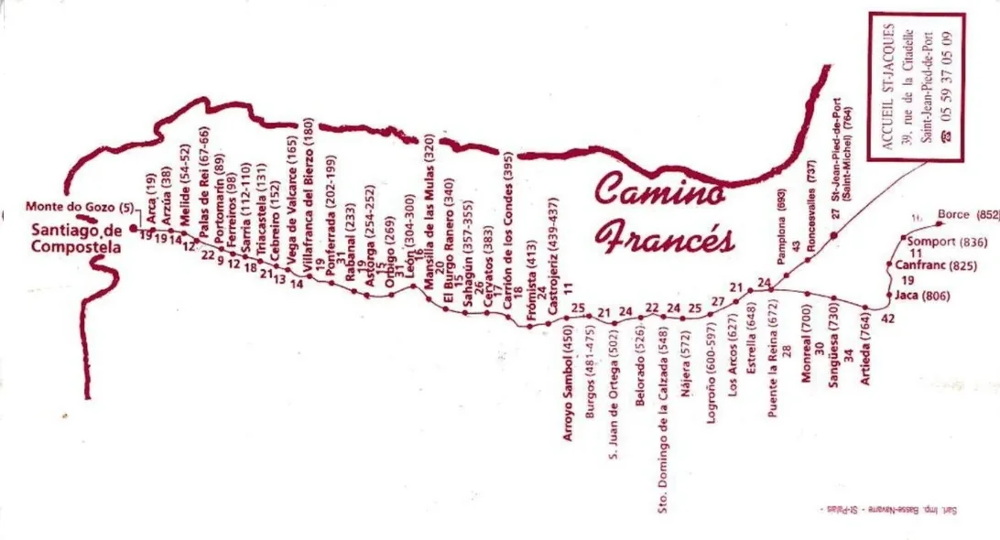

**←** 🔁 [ Os Caminhos](https://github.com/GomesDeSa-JA/Camino-del-Salvador_2023-2025/blob/main/Os_Caminhos.md)

---
## Camino Francés 2012

### As Etapas:   →  
**04 de Maio  –  06 de Junho 2012**

---
#### [Etapa-00_Bayonne_Saint-Jean-Pied-de-Port](Etapa-00_Bayonne_Saint-Jean-Pied-de-Port.md)
04 de Maio de 2012

---
#### [Etapa-01_Saint-Jean-Pied-de-Port_Roncesvalles](Etapa-01_Saint-Jean-Pied-de-Port_Roncesvalles.md)
05 de Maio de 2012

---
####
06 de Maio de 2012

---
#### 
07 de Maio de 2012

Link-Einfügung wurde von "git status" nicht als  Änderung wahrgenommen.

---
####
08 de Maio de 2012

---
####
09 de Maio de 2012

---
#### 
10 de Maio de 2012

---
#### 
11 de Maio de 2012

---
#### 
12 de Maio de 2012

---
#### 
13 de Maio de 2012

---
#### 
14 de Maio de 2012

---
#### 
15 de Maio de 2012

---
#### 
16 de Maio de 2012

---
#### 
17 de Maio de 2012

---
#### 
18 de Maio de 2012

---

#### 
19 de Maio de 2012

---

#### 
DD de MMMM de 20xx

---

  

🇵🇹
🇩🇪
🇬🇧
🇪🇸

---

**↪** [Historical-inventory-of-accommodation](Historical-inventory-of-accommodation.md)

**↪** [Camino-Frances_Credencial-del-Peregrino](Camino-Frances_Credencial-del-Peregrino.md)

**↪** 

🔁 

 ...→
