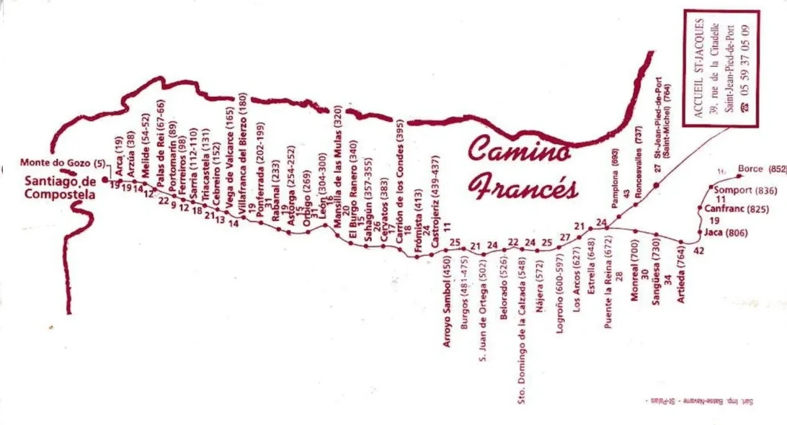

**←** 🔁 [ Os Caminhos](https://github.com/GomesDeSa-JA/Camino-del-Salvador_2023-2025/blob/main/Os_Caminhos.md)

---
## Camino Francés 2012

### As Etapas:   →  
**04 de Maio  –  06 de Junho 2012**

---
#### [Etapa-00_Bayonne_Saint-Jean-Pied-de-Port](Etapa-00_Bayonne_Saint-Jean-Pied-de-Port.md)
04 de Maio de 2012

---
#### [Etapa-01_Saint-Jean-Pied-de-Port_Roncesvalles](Etapa-01_Saint-Jean-Pied-de-Port_Roncesvalles.md)
05 de Maio de 2012

---
#### [Etapa-02_Roncesvalles_Larrasoana](Etapa-02_Roncesvalles_Larrasoana.md)
06 de Maio de 2012

---
#### [Etapa-03_Larrasoana_Pamplona](Etapa-03_Larrasoana_Pamplona.md)
07 de Maio de 2012

Link-Einfügung wurde von "git status" nicht als  Änderung wahrgenommen.

---
#### [Etapa-04_Pamplona_Puente-la-Reina](Etapa-04_Pamplona_Puente-la-Reina.md)
08 de Maio de 2012

---
#### [Etapa-05_Puente-la-Reina_ Villamayor-de-Monjardín.Los-Arcos12km2](Etapa-05_Puente-la-Reina_%20Villamayor-de-Monjardín.Los-Arcos12km2.md)
09 de Maio de 2012

---
#### [Etapa-06_Los-Arcos_Logrono](Etapa-06_Los-Arcos_Logrono.md)
10 de Maio de 2012

---
#### [Etapa-07_Logrono_Najera](Etapa-07_Logrono_Najera.md)
11 de Maio de 2012

---
#### [Etapa-08_Najera_Santo-Domingo-de-la-Calzada](Etapa-08_Najera_Santo-Domingo-de-la-Calzada.md)
12 de Maio de 2012

---
#### [Etapa-09_Santo-Domingo-de-la-Calzada_Tosantos](Etapa-09_Santo-Domingo-de-la-Calzada_Tosantos.md)
13 de Maio de 2012

---
#### [Etapa-10_Tosantos_Atapuerca](Etapa-10_Tosantos_Atapuerca.md)
14 de Maio de 2012

---
#### [Etapa-11_Atapuerca_Villalbilla-de-Burgos](Etapa-11_Atapuerca_Villalbilla-de-Burgos.md)
15 de Maio de 2012

---
#### [Etapa-12_Villalbilla-de-Burgos_Itero-de-la-Vega](Etapa-12_Villalbilla-de-Burgos_Itero-de-la-Vega.md)
16 de Maio de 2012

---
#### [Etapa-13_Itero-del-la-Vega_Carrion-de-los-Condes](Etapa-13_Itero-del-la-Vega_Carrion-de-los-Condes.md)
17 de Maio de 2012

---
#### [Etapa-14_Carrion-de-los-Condes_Terradillos-de-los-Templarios](Etapa-14_Carrion-de-los-Condes_Terradillos-de-los-Templarios.md)
18 de Maio de 2012

---
#### [Etapa-15_Terradillos-de-los-Templarios_Reliegos](Etapa-15_Terradillos-de-los-Templarios_Reliegos.md)
19 de Maio de 2012

---
#### [Etapa-16_Reliegos_Leon](Etapa-16_Reliegos_Leon.md)
20 de Maio de 2012

---
#### [Etapa-17_Leon_Hospital-de-Orbigo](Etapa-17_Leon_Hospital-de-Orbigo.md)
21 de Maio de 2012

---
#### [Etapa-18_Hospital-de-Orbigo_Santa-Catalina-de-Somoza](Etapa-18_Hospital-de-Orbigo_Santa-Catalina-de-Somoza.md)
22 de Maio de 2012

---
#### [Etapa-19_Santa-Catalina-de-Somoza_El-Acebo-de-San-Miguel](Etapa-19_Santa-Catalina-de-Somoza_El-Acebo-de-San-Miguel.md)
23 de Maio de 2012

---

#### [Etapa-20_El-Acebo-de-San-Miguel_Cacabelos](Etapa-20_El-Acebo-de-San-Miguel_Cacabelos.md)
24 de Maio de 2012

---

#### [Etapa-21_Cacabelos_Trabedelo](Etapa-21_Cacabelos_Trabedelo.md)
25 de Maio de 2012

---

#### [Etapa-22_Trabadelo_Sarria](Etapa-22_Trabadelo_Sarria.md)
26 de Maio de 2012

---

#### [Etapa-23_Sarria_Gonzar](Etapa-23_Sarria_Gonzar.md)
27 de Maio de 2012

---
#### [Etapa-24_Gonzar_Melide](Etapa-24_Gonzar_Melide.md)
28 de Maio de 2012

---
#### [Etapa-25_Melide_San-Lazaro](Etapa-25_Melide_San-Lazaro.md)
29 de Maio de 2012

---
#### [Etapa-26_San-Lazaro_Santiago-de-Compostela](Etapa-26_San-Lazaro_Santiago-de-Compostela.md)
30 de Maio de 2012

---
#### [Etapa-27](Etapa-27.md)
31 de Maio de 2012

---
#### [Etapa-28](Etapa-28.md)
01 de junho de 2012

---

#### [Etapa-29](Etapa-29.md)
02 de junho de 2012

---
#### [Etapa-30](Etapa-30.md)
03 de junho de 2012

---
#### [Etapa-31](Etapa-31.md)
04 de junho de 2012

---
#### [Etapa-32](Etapa-32.md)
05 de junho de 2012

---

#### [Etapa-33](Etapa-33.md)
06 de junho de 2012

---
#### [Etapa-34](Etapa-34.md)
06 de junho de 2012

---

#### 
DD de MMMM de 20xx

---

  

🇵🇹
🇩🇪
🇬🇧
🇪🇸

---

**↪** [Historical-inventory-of-accommodation](Historical-inventory-of-accommodation.md)

**↪** [Camino-Frances_Credencial-del-Peregrino](Camino-Frances_Credencial-del-Peregrino.md)

🔁 

 ...→
