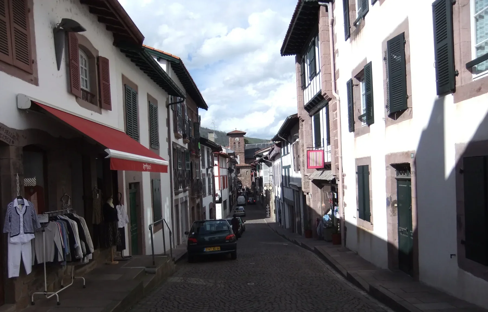
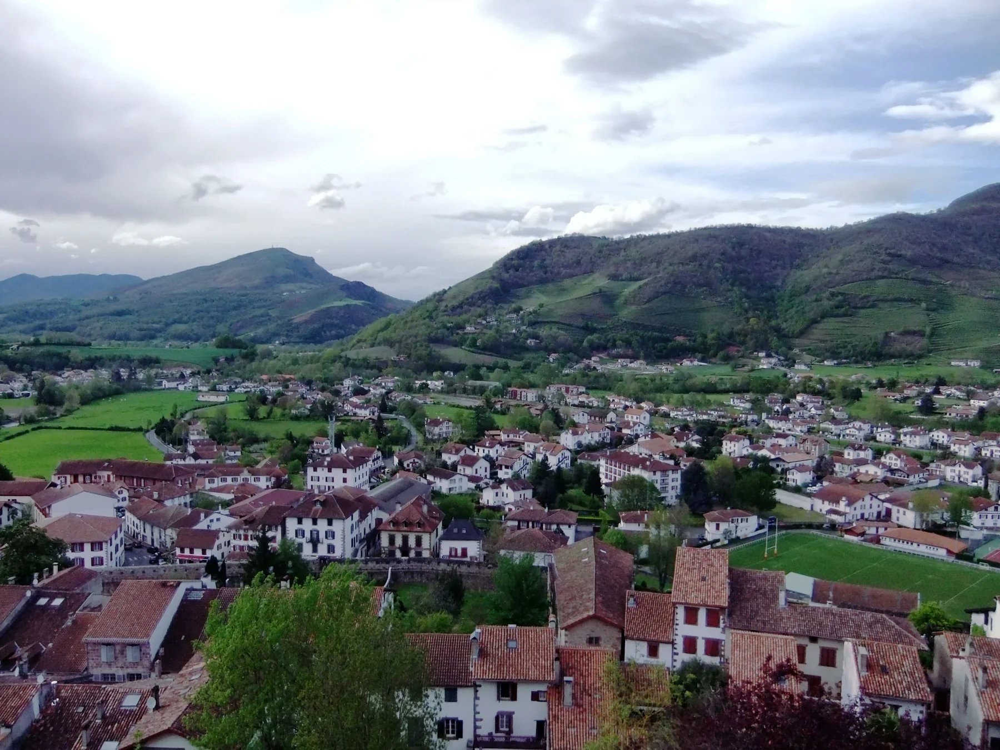
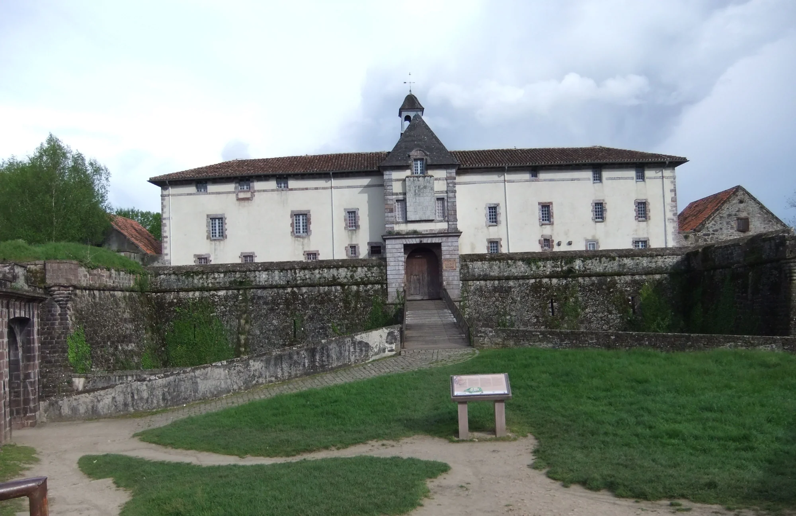
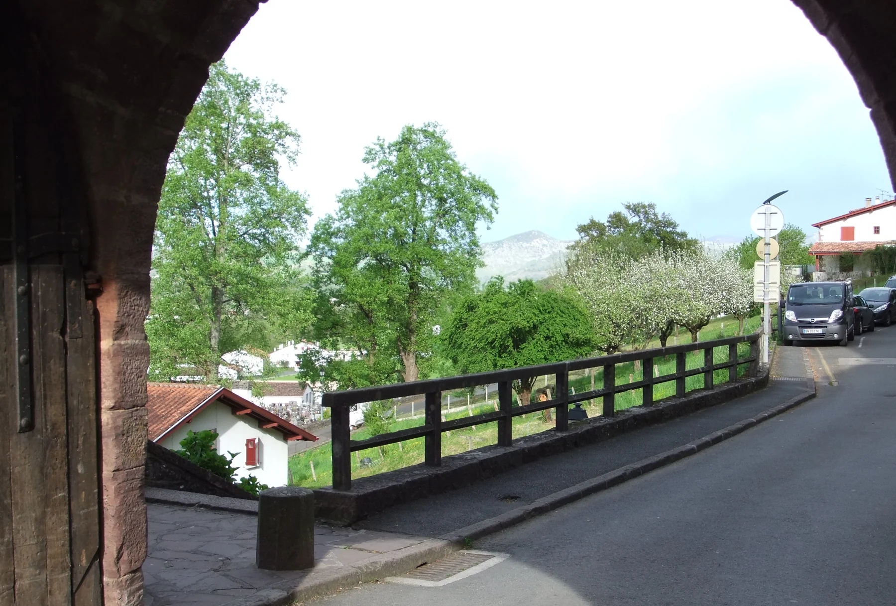
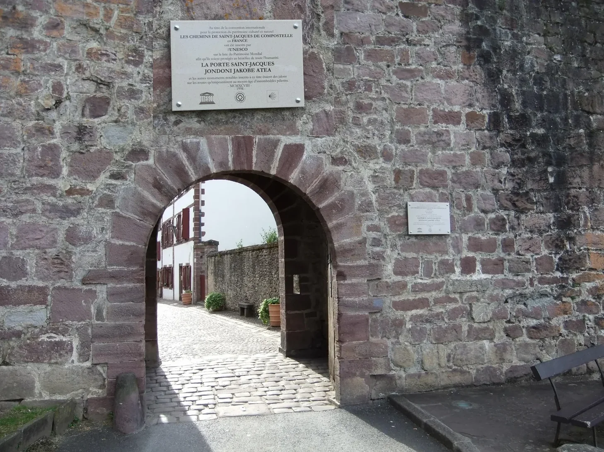

## Camino Francés  2012  

### Etapa-00: Bayonne → Saint-Jean-Pied-de-Port ca. 55 Km + ca. 2 Km)
04 de Mai 2012

 🇩🇪 Etapa-00 

#### Abschnitt 1: Von Bayonne nach Saint-Jean-Pied-de-Port

- Distanz: ca. 55 km (Bahnstrecke)
- Dauer: ca. 1 Stunde

Meinen allerersten Jakobsweg – den Camino Francés im Jahr 2012 – 

Damals fuhr ich mit dem Zug von Bayonne nach Saint-Jean-Pied-de-Port. Obwohl ich nur Fotos vom Abend des 4. Mai 2012 besitze, ist mir die Erinnerung an diese Zugfahrt noch vollkommen lebendig vor Augen.

Es war eine der landschaftlich schönsten Strecken, die ich in den letzten Jahren erlebt habe, und der Ort, an dem ich meinen ersten Mitpilgern begegnete. Diese eine Stunde hat mich wunderbar auf das vorbereitet, was mich auf dem Camino Francés erwarten sollte. Es war eine regelrecht babylonische Zugfahrt, bei der Menschen jeden Alters und aus den verschiedensten Ländern zusammenkamen. Besonders im Gedächtnis geblieben sind mir zwei junge Pilgerinnen. Sprachlich ordnete ich sie Skandinavien zu, sie könnten aber auch aus dem Baltikum stammen. 

Niederländisch, Polnisch und Russisch kann ich relativ gut unterscheiden, aber da ich zuvor nie Kontakt zu Menschen aus nordischen Ländern hatte, fiel mir die genaue Zuordnung schwer. 

Eine der beiden jungen Frauen war bereits im fünften Monat oder noch weiter schwanger. Das war die erste von vielen Überraschungen darüber, unter welchen Lebensumständen Menschen den Weg auf sich nehmen. Später traf ich sogar Ehepaare mit ein- bis zweijährigen Babys. Die Kleinen verhielten sich nachmittags wie nachts absolut vorbildlich und ließen uns erholsam schlafen.

#### Abschnitt 2: Ankunft und der erste Abend in Saint-Jean-Pied-de-Port

- Distanz: ca. 2 km (Spaziergang im Ort)
- Dauer: ca. 5 bis 6 Stunden (Ankunft bis Nachtruhe)

Nach der Ankunft in Saint-Jean-Pied-de-Port erhielten wir im Pilgerbüro großartige Unterstützung. Als wir unseren Pilgerausweis (_Credencial_) abholten, kümmerten sie sich auch um unsere Unterkunft und riefen verschiedene Unterkünfte an, bis sie ein freies Bett für uns gefunden hatten.

Nach diesem aufregenden und zugleich entspannten Auftakt machten wir einen gemütlichen Abendspaziergang. Dabei erfuhr ich überhaupt erst, dass es neben dem Camino Francés auch den Camino del Norte gibt – bis zu diesem Zeitpunkt war mein Wissen über die Jakobswege sehr begrenzt. Ich lernte dies im Gespräch mit einer Schweizer Pilgerin, die ihren Weg bereits in der Schweiz begonnen hatte. Als wir über die Etappe des nächsten Tages sprachen, erzählte sie mir, dass sie nicht den Francés laufen, sondern auf den Camino del Norte ausweichen wolle. Deshalb würde sie am nächsten Morgen nach Irun weiterreisen.

Die Pilgerherberge, in der ich schließlich übernachtete, war den Pilgern einst von einer Dame testamentarisch vermacht worden. Das dort lebende Hospitalero-Ehepaar führte die Herberge ganz im Sinne dieses Vermächtnisses und kümmerte sich um die Pilger. Sie organisierten ein gemeinsames Abendessen, bei dem die Mithilfe der Pilger ausdrücklich erwünscht war. Es wurde ein wunderbarer Abend und ein rundum gelungener erster Tag. Damit wir am nächsten Morgen fit waren, schickte man uns pünktlich um 22:00 Uhr ins Bett. Wie der Hausherr treffend sagte: „Die Pyrenäen warten auf euch, und es wird ein langer Weg bis Roncesvalles. Ihr müsst ausgeschlafen sein und früh aufbrechen.“ Das war mein erster Tag – noch keinen einzigen Kilometer gelaufen, aber schon voller unvergesslicher Eindrücke.

---

 🇪🇸 Etapa-00 

#### Tramo 1: De Bayona a Saint-Jean-Pied-de-Port

- Distancia: aprox. 55 km (en tren)
- Duración: aprox. 1 hora

Mi primer Camino de Santiago: el Camino Francés en 2012.
En aquel entonces, viajé en tren desde Bayona hasta Saint-Jean-Pied-de-Port. Aunque solo conservo fotos de la tarde del 4 de mayo de 2012, el recuerdo de aquel viaje en tren sigue completamente vivo en mi mente.

Fue uno de los trayectos paisajísticos más hermosos que he visto en los últimos años y el lugar donde conocí a mis primeros compañeros de ruta. Esa hora de viaje me preparó de maravilla para lo que me esperaba en el Camino Francés. Era un tren casi babilonio, donde se mezclaban personas de todas las edades y de los países más diversos. Recuerdo especialmente a dos jóvenes peregrinas cuyo idioma me sonó a escandinavo, aunque también báltico. Sé distinguir relativamente bien el neerlandés, el polaco y el ruso, pero al no haber tratado nunca con gente de países nórdicos, me costó identificarlo. Una de ellas estaba embarazada de cinco meses o más, lo que supuso mi primera sorpresa sobre las distintas circunstancias bajo las cuales la gente se anima a hacer el Camino. No sería la única; más adelante también coincidí con parejas que viajaban con bebés de uno o dos años. Los pequeños se portaron de manera absolutamente ejemplar tanto por la tarde como por la noche y nos permitieron dormir plácidamente.

#### Tramo 2: Llegada y primera noche en Saint-Jean-Pied-de-Port

- Distancia: aprox. 2 km (paseo por el pueblo)
- Duración: aprox. 5 a 6 horas (desde la llegada hasta la hora de dormir)

Al llegar a Saint-Jean-Pied-de-Port, recibimos una ayuda fantástica en la oficina de (turismo)  atención al peregrino. Cuando fuimos a recoger nuestra credencial de peregrino, también se encargaron de buscarnos alojamiento y llamaron a varios sitios hasta que encontraron una cama libre para nosotros.

Tras este primer día, tan emocionante como relajado, salimos a dar un agradable paseo nocturno. Fue entonces cuando descubrí que no solo existía el Camino Francés, sino también el Camino del Norte; hasta ese momento, mis conocimientos sobre las rutas jacobeas eran nulos. Me enteré al conversar sobre la etapa del día siguiente con una peregrina suiza que había iniciado su viaje en su propio país. Me contó que no haría el Camino Francés, sino que se desviaría hacia el Camino del Norte, por lo que a la mañana siguiente viajaría en dirección a Irún.

El albergue donde pasé la noche había sido legado a los peregrinos en el testamento de una señora. La pareja que lo gestionaba (y que creo que vivía allí) lo dirigía fielmente según sus deseos, cuidando dos peregrinos. Organizaron una cena comunitaria en la que se esperaba que los peregrinos ayudáramos, lo que dio pie a una velada hermosa. Para asegurarse de que no nos quedáramos dormidos, nos mandaron a la cama puntualmente a las 22:00 horas. Como bien dijo el hospitalero: "Los Pirineos os esperan y será una jornada larga hasta Roncesvalles; debéis descansar bien y salir temprano". Así fue mi primer día: sin haber caminado aún ni un solo kilómetro, ya estaba lleno de vivencias.

---

 🇬🇧 Etapa-00 

#### Section 1: From Bayonne to Saint-Jean-Pied-de-Port

- Distance: approx. 55 km (by train)
- Duration: approx. 1 hour

My very first Camino de Santiago—the Camino Francés in 2012. 

At the time, I took the train from Bayonne to Saint-Jean-Pied-de-Port. Even though I only have photos from the evening of May 4th, 2012, my memory of that train ride remains incredibly vivid.

It was one of the most scenic routes I have experienced in recent years, and the exact place where I met my first fellow pilgrims. That single hour prepared me beautifully for the kinds of people I would encounter on the Camino Francés. The train felt like a modern-day Babel, filled with people of all ages from every corner of the world. Two young female pilgrims stood out in my mind. Based on their language, I guessed they were Scandinavian, though they could just as easily have been from the Baltic states. I can tell Dutch, Polish, and Russian apart fairly well, but since I had never interacted with people from other Nordic countries, it was hard to pinpoint. One of these young women was at least five months pregnant, which was the first of many surprises regarding the diverse circumstances under which people walk the Camino. Later on, I even met couples traveling with one- or two-year-old babies. The little ones behaved absolutely impeccably, both in the afternoons and at night, and let us get a good night’s sleep.

#### Section 2: Arrival and the First Evening in Saint-Jean-Pied-de-Port

- Distance: approx. 2 km (walking around the town)
- Duration: approx. 5 to 6 hours (from arrival to bedtime)

When we arrived in Saint-Jean-Pied-de-Port, we received wonderful support from (Tourist Office) the pilgrim information office. When we went to collect our pilgrim’s pass, they also arranged accommodation for us and rang round several places until they found a spare bed for us.

After this exciting yet relaxing start, we went for a leisurely evening stroll. It was during this walk that I first learned the Camino Francés wasn't the only route, but that the Camino del Norte existed as well—before that moment, my knowledge of the Camino paths was virtually non-existent. I found this out while chatting about the next day's stage with a pilgrim from Switzerland who had started walking from her home country. She told me she wouldn't be walking the Francés, but was switching to the Camino del Norte instead, which meant she would be heading toward Irun the next morning.

The pilgrim hostel where I stayed had been left to future pilgrims in the will of a local lady. The couple managing it, who I believe lived in the house, ran the hostel in strict accordance with her wishes and took care of piligrims. They organized a communal dinner, which everyone was expected to help prepare. It turned into a beautiful meal and wrapped up a perfectly relaxed first day. To ensure we didn't oversleep, they sent us to bed promptly at 10:00 PM. As the host rightly put it: "The Pyrenees are waiting for you, and it will be a long day until Roncesvalles, so you need to be well-rested and start early." That was my first day—not a single kilometer walked yet, but already overflowing with impressions.

---

 🇵🇹 Etapa-00 

#### Trecho 1: De Baiona a Saint-Jean-Pied-de-Port

- Distância: aprox. 55 km (de comboio/trem)
- Duração: aprox. 1 hora

O meu primeiro Caminho de Santiago — o Caminho Francês em 2012. 
Na altura, viajei de comboio de Baiona para Saint-Jean-Pied-de-Port. Embora só tenha fotografias da tarde de 4 de maio de 2012, a memória daquela viagem de comboio continua totalmente viva na minha mente.

Foi um dos trajetos panorâmicos mais bonitos que vivenciei nos últimos anos e o lugar onde conheci os meus primeiros companheiros de peregrinação. Aquela hora de viagem preparou-me perfeitamente para o tipo de pessoas que me esperavam no Caminho Francês. Era uma carruagem verdadeiramente babilónica, onde se cruzavam pessoas de todas as idades e dos mais diversos países. Lembro-me particularmente de duas jovens peregrinas cujo idioma associei à Escandinávia, embora pudessem ser dos países bálticos. Consigo distinguir relativamente bem o holandês, o polaco e o russo, mas como nunca tinha lidado com pessoas de países nórdicos, foi difícil identificar a origem exata. Uma das jovens estava grávida de cinco meses ou mais, o que foi a primeira de muitas surpresas sobre as diferentes circunstâncias de vida sob as quais as pessoas decidem fazer o Caminho. Mais tarde, também encontrei casais com bebés de um ou dois anos. Os pequenos comportaram-se de forma absolutamente exemplar, tanto à tarde como à noite, e permitiram-nos dormir tranquilamente.

#### Trecho 2: Chegada e a primeira noite em Saint-Jean-Pied-de-Port

- Distância: aprox. 2 km (passeio pela vila)
- Duração: aprox. 5 a 6 horas (da chegada até à hora de dormir)

Ao chegarmos a Saint-Jean-Pied-de-Port, recebemos um apoio fantástico no gabinete de (Turismo) informação ao peregrino. Quando fomos buscar a "Credencial de Peregrinos", também se encarregaram de nos arranjar alojamento e ligaram para vários sítios até encontrarem uma cama disponível para nós.

Depois deste primeiro dia, tão emocionante quanto relaxante, fomos dar um agradável passeio noturno. Foi durante esta caminhada que descobri que não existia apenas o Caminho Francês, mas também o Caminho do Norte — até àquele momento, o meu conhecimento sobre as rotas jacobeias era nulo. Soube disso ao conversar sobre a etapa do dia seguinte com uma peregrina suíça que tinha iniciado a sua caminhada na própria Suíça. Ela contou-me que não iria fazer o Francês, mas sim desviar-se para o Caminho del Norte, pelo que na manhã seguinte seguiria para Irún.

O albergue onde pernoitei tinha sido deixado aos peregrinos em testamento por uma senhora. O casal que o geria (e que creio que também vivia na casa) cuidava do espaço respeitando fielmente a sua última vontade, acolhendo os peregrinos. Organizaram um jantar comunitário no qual se esperava a entreajuda de todos, resultando num belo convívio e num primeiro dia muito tranquilo. Para garantir que não adormecíamos, mandaram-nos para a cama pontualmente às 22:00 horas. Como bem disse o hospitaleiro: "Os Pirenéus esperam por vocês e será um longo dia até Roncesvalles; devem estar descansados e partir cedo". Assim foi o meu primeiro dia: sem ter caminhado ainda um único quilómetro, mas já repleto de grandes emoções.

---

---

  

🇬🇧
🇪🇸
🇵🇹
🇩🇪

---

**↪** 

 🔁 [Camino-Frances_Etapas](Camino-Frances_Etapas.md)

 ...→