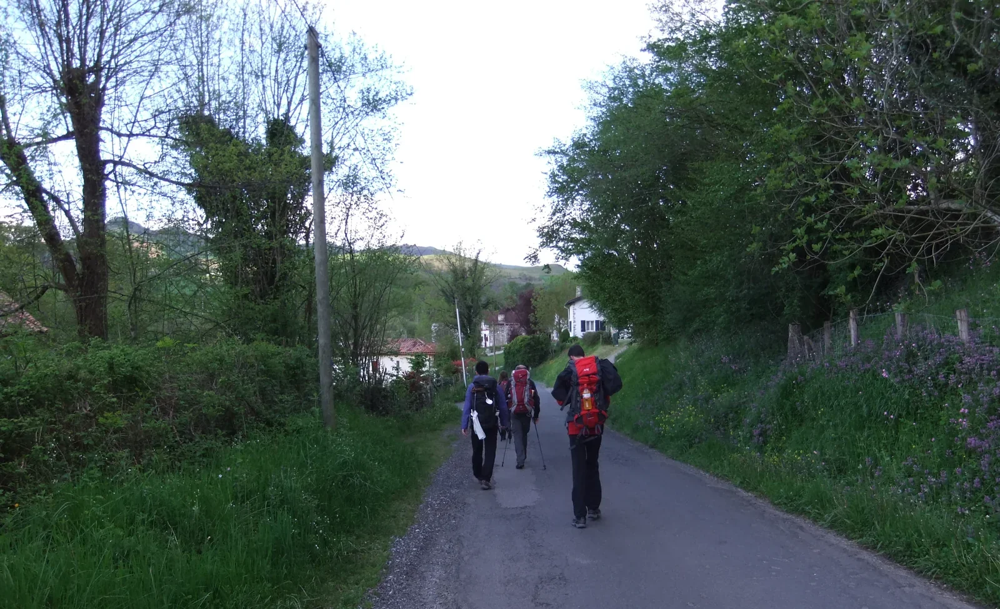
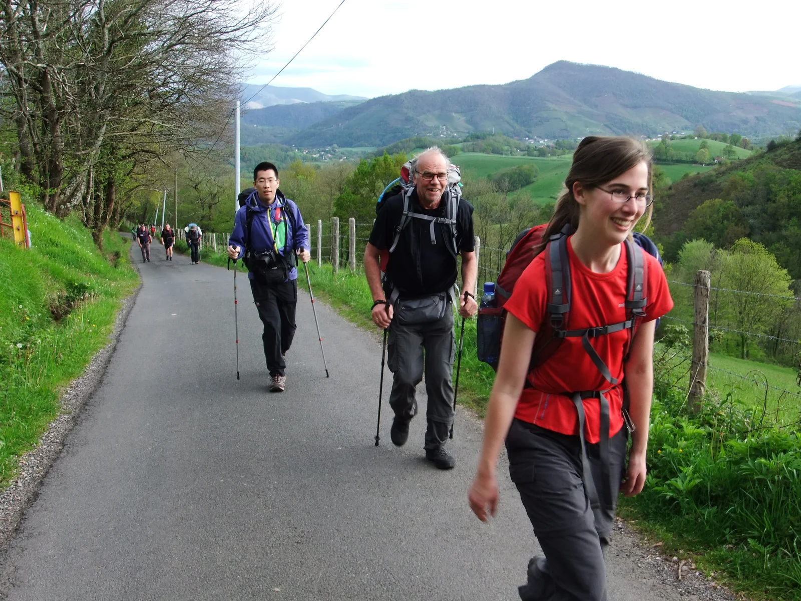
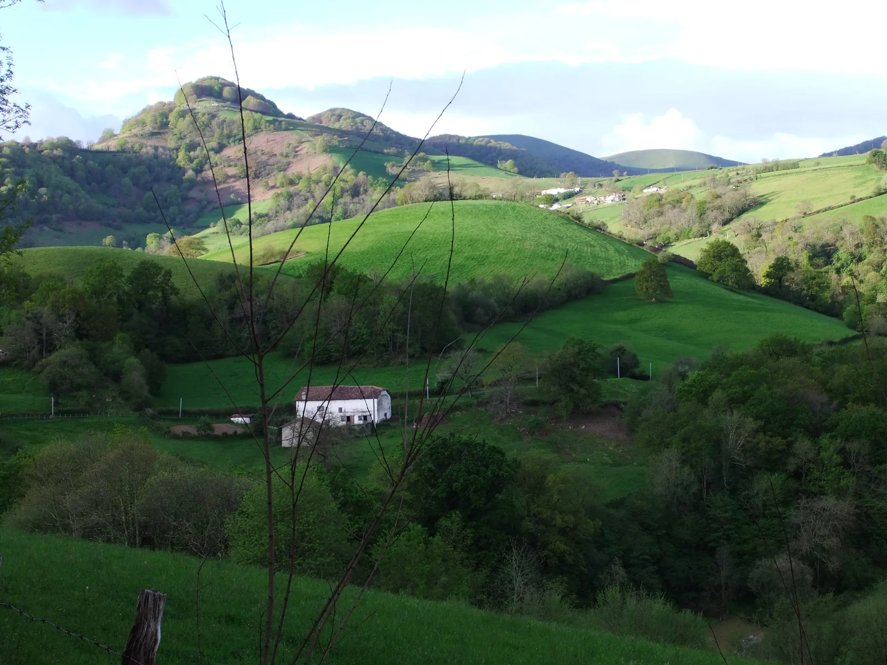
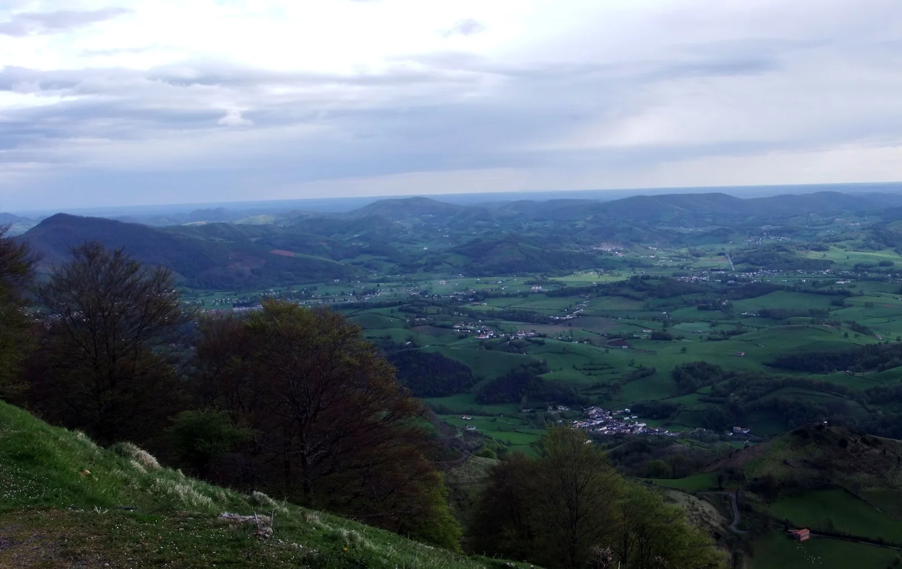
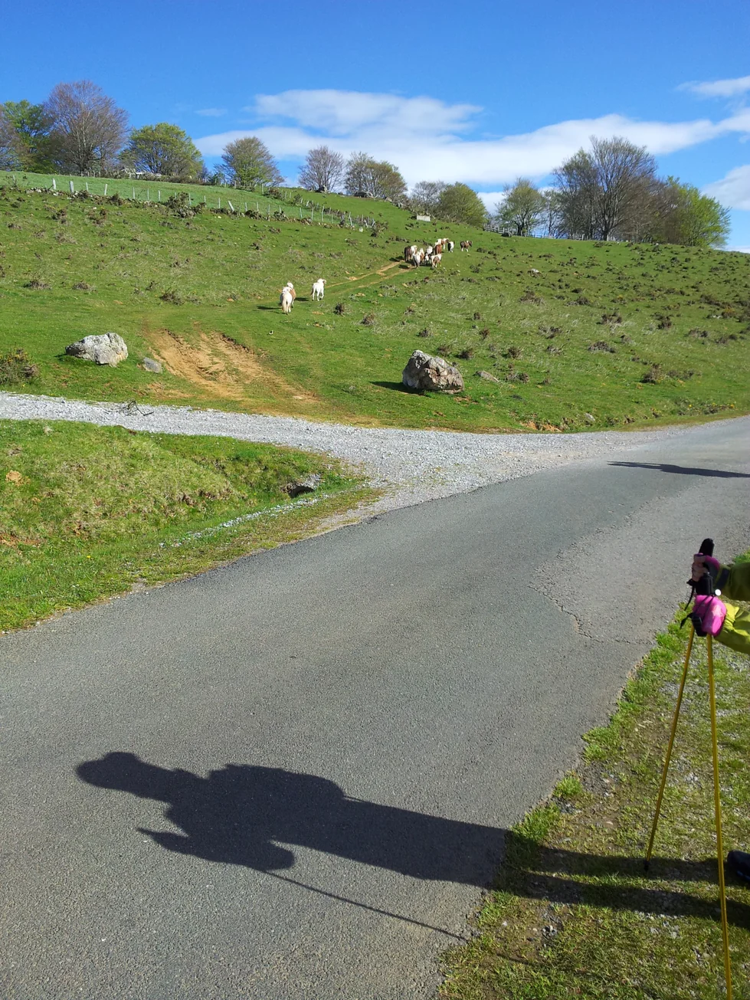
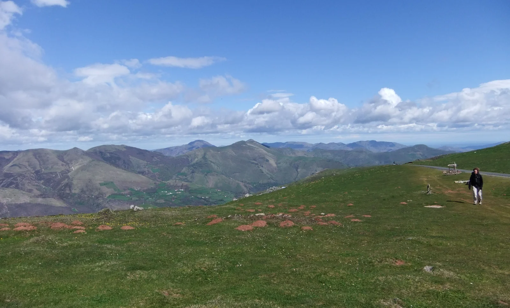
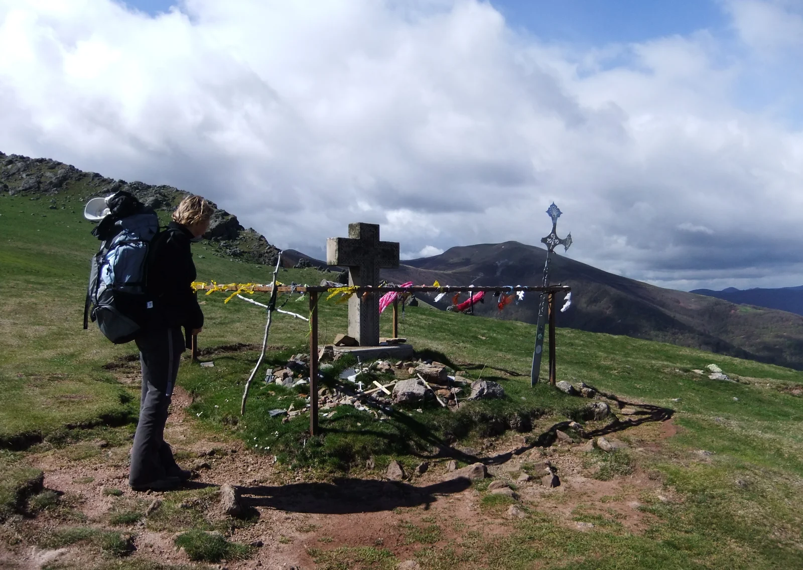

## Camino Francés  2012  

### Etapa-01: Saint Jean Pied de Port → Roncesvalles (24,2 Km)
05 de Mai 2012

🇬🇧 A good cup of coffee   

#### The First Truly Awake Moment of the Day

Right on time, we were awakened by the rhythm of the Camino. Then came the first sip of coffee — and nothing could have surprised me more than that taste, a taste I had believed, since the late 1970s, had disappeared forever.

I still remember the taste of the first and, almost at the same time, the last sip of that coffee on Rua 25 de Abril in Ferreira de Aves. Back then, in the early 1980s, a new kind of coffee began appearing in the small supermarkets and corner shops: instant coffee. And no one shed a tear for that old kind of coffee as a cherished tradition.

But here, the hospitaleros had brought that tradition back to life.

Although I wasn't expecting particularly good coffee — and certainly not my preferred German filter coffee — I had been looking forward to a „Café au Lait“. But when I took the first sip, I was startled by the taste: so unfamiliar and yet, at the same time, so strangely familiar. That single sip was enough to wake me up completely.

That was one of the lessons I learned on the very first day: we have to be grateful for whatever the Camino gives us. Otherwise, we might as well stay at home.

---

 🇩🇪 Eine gute Tasse Kaffee 

#### Der erste wache Moment des Tages

Pünktlich wurden wir von der Dynamik des Weges geweckt. Dann kam der erste Schluck Kaffee – und nichts hätte mich mehr überraschen können als dieser Geschmack, von dem ich seit Ende der siebziger Jahre geglaubt hatte, er sei längst ausgestorben.

Ich erinnere mich noch gut an den Geschmack des ersten und beinahe zugleich auch letzten Schluckes dieses Kaffees in der Rua 25 de Abril in Ferreira de Aves. Obwohl Portugal schon seit rund 500 Jahren mit Kaffee verbunden ist, kannten die Menschen im Landesinneren lange Zeit kaum den Kaffee, der in den fernen Länder angebaut wurde. Dort trank man stattdessen einen Kaffeeersatz aus geröstetem Getreide.

Eine ganz ähnliche Erfahrung machte ich 2016 in abgelegenen Dörfern der Anden. Obwohl Kaffee dort teilweise nur wenige hundert Kilometer entfernt angebaut wurde, fand er seinen Weg nicht über die unzugänglichen Bergpfade zu den Menschen, die dort lebten. Die Entfernung war auf der Landkarte vielleicht gering – in Wirklichkeit konnte sie eine Welt bedeuten.

Damals, zu Beginn der achtziger Jahre, hielt schließlich eine neue Art von Kaffee Einzug in die kleinen Supermärkte und Tante-Emma-Läden: löslicher Kaffee. Und niemand weinte dieser alten Kaffeesorte als guter, alter Tradition auch nur eine Träne nach.

Doch hier hatten die Hospitaleros diese Tradition wieder zu Ehren gebracht.

Obwohl ich eigentlich nicht meinen bevorzugten deutschen Filterkaffee erwartet hatte, hatte ich mich auf einen „Café au Lait“ gefreut. Doch als ich den ersten Schluck nahm, erschrak ich über diesen Geschmack – so fremd und zugleich so vertraut. Allein dieser erste Schluck reichte aus, um mich endgültig wachzurütteln.

>Das war eine der Lektionen, die ich bereits am ersten Tag gelernt habe: Man muss dankbar sein für das, was uns der Weg gibt. Sonst können wir genauso gut zu Hause bleiben.

---

🇪🇸 Una buena taza de café  

### El primer momento de lucidez del día

Puntualmente, nos despertó la propia dinámica del Camino. Después llegó el primer sorbo de café, y nada podría haberme sorprendido más que aquel sabor que, desde finales de los años setenta, yo creía desaparecido para siempre.

Todavía recuerdo bien el sabor del primer sorbo y, casi al mismo tiempo, del último de aquel café en la Rua 25 de Abril, en Ferreira de Aves.  Aunque Portugal lleva vinculado al café desde hace unos 500 años, durante mucho tiempo la gente del interior del país casi no conocía el café que se cultivaba en países lejanos.. En su lugar, se bebía una especie de sucedáneo de café elaborado con cereales tostados.

Una experiencia muy parecida tuve en 2016, en aldeas remotas de los Andes. Aunque el café se cultivaba a tan solo unos cientos de kilómetros de distancia, no conseguía llegar a las personas que vivían allí a través de los caminos de montaña, prácticamente inaccesibles. Sobre el mapa, la distancia podía parecer pequeña; en realidad, podía significar todo un mundo.

Por aquel entonces, a comienzos de los años ochenta, empezó a aparecer un nuevo tipo de café en los pequeños supermercados y en las tiendas de barrio: el café soluble. Y nadie derramó una lágrima por aquel viejo tipo de café, que dejó de ser considerado una buena y vieja tradición.

Pero aquí, los hospitaleros habían vuelto a poner aquella tradición en valor.

Aunque no esperaba mi habitual café de filtro alemán—, tenía ganas de tomar un „Café au Lait“. Sin embargo, cuando di el primer sorbo, me sorprendió aquel sabor: tan extraño y, al mismo tiempo, tan familiar. Aquel primer sorbo, por sí solo, fue suficiente para despertarme por completo.

>Esta fue una de las lecciones que aprendí ya el primer día: hay que estar agradecido por lo que el Camino nos ofrece. De lo contrario, también podríamos quedarnos en casa.

---

 🇵🇹 Uma boa chávena de café 

### O primeiro momento de lucidez do dia

Pontualmente, fomos despertados pela dinâmica do Caminho. Depois veio o primeiro gole de café — e nada me poderia ter surpreendido mais do que aquele sabor que, desde o final dos anos setenta, eu julgava ter desaparecido para sempre.

Ainda me lembro bem do sabor do primeiro e, quase ao mesmo tempo, do último gole daquele café na Rua 25 de Abril, em Ferreira de Aves. Embora Portugal esteja ligado ao café há cerca de 500 anos, durante muito tempo as pessoas do interior do país mal conheciam o café que era cultivado em países longínquos. Em seu lugar, bebia-se uma espécie de sucedâneo de café feito a partir de cereais torrados.

Uma experiência muito semelhante tive em 2016, em aldeias remotas dos Andes. Embora o café fosse cultivado a apenas algumas centenas de quilómetros de distância, não conseguia chegar às pessoas que viviam nessas regiões através dos caminhos montanhosos, quase inacessíveis. No mapa, a distância podia parecer pequena — na realidade, podia significar um mundo inteiro.

Naquela época, no início dos anos oitenta, um novo tipo de café começou finalmente a entrar nos pequenos supermercados e nas mercearias de bairro: o café solúvel. E ninguém derramou uma lágrima por aquele velho tipo de café, que deixou de ser visto como uma boa e velha tradição.

Mas aqui, os hospitaleros tinham voltado a dar vida a essa tradição.

Embora eu não esperasse o meu habitual café de filtro alemão —, tinha ficado à espera de um „Café au Lait“. Mas, quando dei o primeiro gole, assustei-me com aquele sabor: tão estranho e, ao mesmo tempo, tão familiar. Só aquele primeiro gole foi suficiente para me despertar completamente.

>Esta foi uma das lições que aprendi logo no primeiro dia: é preciso agradecer aquilo que o Caminho nos oferece. Caso contrário, mais vale ficarmos em casa.

 🇩🇪 Ein wunderbarer Tag 

#### Der Aufstieg

Schon am ersten Tag hatten wir einen wunderbaren Tag. Es war so schön, die Landschaft zu genießen, dass wir die Anstrengungen des Aufstiegs ganz vergaßen. Dann kam Wind auf, begleitet von ein paar Regentropfen und einigen kleinen Hagelkörnern. Es war nichts Besonderes, nur ein kleiner Schreck, aber es gab uns einen kleinen Vorgeschmack auf das Wetter, das uns in den Pyrenäen erwartet.

#### Der Abstieg

Kurz bevor wir Roncesvalles erreichten, begann es zu regnen. Es war nicht viel, aber genug, um meine neuen Wanderschuhe mit dem Schlamm des Jakobswegs zu taufen.

#### Die Ankunft

Als ich im Albergue von Roncesvalles ankam, war ich beeindruckt von der großen Zahl an Pilgern, die sich an einem einzigen Ort versammelt hatten, und von der beinahe militärischen Disziplin bei der Anmeldung. Danach wurde uns gezeigt, wo wir unsere Wanderstöcke und Schuhe abstellen und wo wir schlafen sollten.

Diese Maßnahmen sind notwendig. Denn wenn jeder selbst seinen Schlafplatz suchen müsste, würden viele von uns – müde von der Etappe – mit ihren schlammigen Schuhen in die Schlafsäle gehen und erst später bemerken, welchen Fehler wir gemacht hätten. Deshalb taten die Hospitaleros alles, um solche Fehler zu verhindern.

Diese beinahe militärische Disziplin begegnete mir auch in vielen anderen großen Herbergen.

Eine Sache, die ich bereits kannte, war die Pünktlichkeit beim Ausschalten des Lichts. Ich habe drei Jahre an der Akademie Klausenhof und sieben Monate im Wohnheim in Wuppertal-Vohwinkel gelebt und kannte diese Regeln daher schon. Der Unterschied war allerdings, dass wir in unseren Zimmern noch lernen, leise Musik hören oder uns in gedämpftem Ton unterhalten konnten.

Hier war das anders. Wir waren etwa 60 Pilger im selben Schlafsaal, und wenn wir ins Bad gingen, wurde absolute Ruhe verlangt. Das war nicht immer einfach, denn in den ersten Tagen mussten wir uns erst an den neuen Rhythmus gewöhnen und noch halb verschlafen daran denken, die Ruhe zu bewahren, bevor wir überhaupt aufstanden.

Mehr als die Kilometer, die noch vor mir lagen, brauchte dieser Teil der Pilgerreise Zeit, um mich daran zu gewöhnen.

>Das waren also meine ersten Eindrücke von meiner ersten Etappe – Eindrücke, die sich mit Fotos allein nicht vermitteln lassen.

---

 🇪🇸 Un día maravilloso 

#### La subida 

Ya desde el primer día, disfrutamos de un día maravilloso. Fue tan agradable contemplar el paisaje que nos olvidamos del esfuerzo de la subida. Después, sopló un viento acompañado de unas gotas de lluvia y algunos pequeños granizos. No fue nada del otro mundo, solo un pequeño susto, pero nos dio una pequeña idea del tiempo que nos espera en los Pirineos.

#### El descenso

Poco antes de llegar a Roncesvalles, empezó a llover. No fue mucha lluvia, pero sí la suficiente para bautizar mis nuevas botas de senderismo con el barro del Camino de Santiago.

#### La llegada

Cuando llegué al albergue de Roncesvalles, me impresionó la cantidad de peregrinos concentrados en un solo lugar y la disciplina casi militar durante el momento del registro. Poco después, nos indicaron dónde debíamos dejar los bastones, las botas y dónde íbamos a dormir.

Estas medidas son necesarias, porque, si cada uno tuviera que buscar por su cuenta un lugar para dormir, muchos de nosotros, cansados después de la etapa, entraríamos en los dormitorios con las botas llenas de barro y solo después nos daríamos cuenta del error que habíamos cometido. Por eso, los hospitaleros hacían todo lo posible para evitar que cometiéramos esos errores.

Y esa disciplina casi militar también la encontré en muchos otros albergues grandes.

Una de las cosas que ya conocía era la puntualidad a la hora de apagar las luces. Viví tres años en la Akademie Klausenhof y siete meses en la residencia de estudiantes de Wuppertal-Vohwinkel, así que ya conocía esas reglas. La diferencia era que en nuestras habitaciones todavía podíamos estudiar, escuchar música a un volumen bajo o conversar en voz baja.

Aquí no. Éramos unos 60 peregrinos en el mismo dormitorio y, cuando íbamos al baño, se exigía un silencio absoluto. Eso no siempre era fácil, porque durante los primeros días todavía teníamos que acostumbrarnos al nuevo ritmo y, medio dormidos, recordar que debíamos guardar silencio incluso antes de levantarnos.

Más que los kilómetros que tenía por delante, fue esta parte de la peregrinación la que más tiempo me llevó a la hora de adaptarme.

>Y estas fueron mis primeras impresiones de la primera etapa: impresiones que, por mucho que lo intentemos, no se pueden transmitir únicamente con fotografías.

---

 🇬🇧 A wonderful day 

 #### The climb

Right from the very first day, we had a wonderful day. It was so lovely to take in the scenery that we forgot all about the effort of the climb. Then a wind picked up, accompanied by a few drops of rain and some small hailstones. It was nothing to worry about – just a bit of a scare – but it gave us a little taste of the weather that awaits us in the Pyrenees.

#### The Descent

Shortly before we reached Roncesvalles, it started to rain. It wasn't much, but it was enough to baptize my new hiking boots with the mud of the Camino de Santiago.

#### The Arrival

When I arrived at the Albergue in Roncesvalles, I was impressed by the large number of pilgrims gathered in one place and by the almost military discipline during registration. Shortly afterwards, we were shown where to leave our walking sticks and boots and where we would sleep.

These measures are necessary. Otherwise, if everyone had to look for their own place to sleep, many of us, tired after the day's walk, would enter the dormitories with muddy boots and only later realize the mistake we had made. That is why the hospitaleros did everything they could to prevent us from making such mistakes.

And I encountered this almost military discipline in many other large pilgrim hostels as well.

One thing I was already familiar with was the punctuality when it came to turning off the lights. I lived for three years at Akademie Klausenhof and for seven months in a residence in Wuppertal-Vohwinkel, so I already knew these rules. The difference was that in our rooms we could still study, listen to music quietly or have a conversation in a low voice.

Not here. There were around 60 pilgrims in the same dormitory, and whenever someone went for a bath, absolute silence was expected. That was not always easy, because during the first few days we still had to get used to the new routine and, half asleep, remember to keep quiet even before getting out of bed.

More than the kilometres that lay ahead of me, it was this part of the pilgrimage that took me the longest to adapt to.

>And these were my first impressions of the first stage — impressions that, no matter how hard we try, cannot be conveyed through photographs alone.

---

 🇵🇹 Um dia maravilhoso 

#### A subida 

Logo no primeiro dia, tivemos um dia maravilhoso. Foi tão agradável apreciar a paisagem que nos esquecemos do esforço da subida. Depois, soprou um vento acompanhado de algumas gotas de chuva e alguns pequenos grãos de granizo. Não foi nada de mais, foi apenas um pequeno susto, mas deu-nos uma pequena ideia do tempo que nos espera nos Pirenéus.

### A descida

Pouco antes de chegarmos a Roncesvalles, começou a chover. Não foi muita chuva, mas foi suficiente para batizar as minhas novas botas de caminhada com a lama do Caminho de Santiago.

#### A chegada

Quando cheguei ao Albergue de Roncesvalles, fiquei impressionado com a multidão de peregrinos concentrada num só lugar e com a disciplina quase militar no momento do registo. Logo depois, indicaram-nos onde deveríamos colocar os bastões, as botas e onde iríamos dormir.

Estas medidas são necessárias, porque, se cada um procurasse sozinho o seu lugar para dormir, muitos de nós, já cansados, entraríamos nos dormitórios com as botas cheias de lama e só depois perceberíamos o erro que tínhamos cometido. Por isso, os hospitaleros faziam tudo para evitar que cometêssemos esses erros.

E essa disciplina quase militar encontrei também em muitos outros albergues grandes.

Uma das coisas que eu já conhecia era a pontualidade com que se apagavam as luzes. Vivi três anos na Akademie Klausenhof e sete meses no Wohnheim em Wuppertal-Vohwinkel, por isso já conhecia essas regras. A diferença é que, nos nossos quartos, ainda podíamos estudar, ouvir música em volume baixo ou conversar discretamente.

Ali não. Éramos cerca de 60 peregrinos no mesmo dormitório e, **quando íamos aos banhos**, era exigido um silêncio absoluto. Isso nem sempre era fácil, porque, nos primeiros dias, ainda tínhamos de nos habituar à rotina e, meio sonolentos, lembrar-nos de manter o silêncio antes mesmo de nos levantarmos.

Mais do que os quilómetros que ainda tinha pela frente, foi esta parte da peregrinação que me levou mais tempo a adaptar-me.

>E foram estas as minhas primeiras impressões da primeira etapa — impressões que, por mais que tentemos, não se conseguem transmitir através de fotografias.

---
---

ChatGPT-Version 

**- §1)** 
- - Das macht man direkt nach der Ankunft
- - This is what you do straight after arriving
- - Isto faz-se logo após a chegada
- - Esto es lo que hay que hacer nada más llegar

#### 🇵🇹 Português

#### A descida

Pouco antes de chegarmos a Roncesvalles, começou a chover. Não era uma chuva forte, mas foi suficiente para batizar as minhas botas novas de caminhada com a primeira lama do Caminho de Santiago.

#### A chegada

Quando finalmente cheguei ao Albergue de Roncesvalles, uma das primeiras coisas que me impressionou foi a quantidade de peregrinos reunidos num só lugar. Depois de horas a caminhar, encontrar tanta gente ali dava quase a sensação de termos chegado a uma pequena cidade de peregrinos.

O momento do registo surpreendeu-me também pela disciplina, quase militar, com que tudo era organizado. Mal terminávamos a inscrição, já nos indicavam onde colocar os bastões, onde deixar as botas e onde iríamos dormir.

À primeira vista, tudo aquilo podia parecer excessivamente organizado. Mas, depois de algum tempo, comecei a perceber a razão.

Se cada peregrino tivesse de procurar sozinho o seu lugar, muitos de nós, cansados da caminhada, entraríamos nos dormitórios com as botas ainda cobertas de lama. Só mais tarde perceberíamos o erro. Os hospitaleros, portanto, não estavam apenas a impor regras: estavam a tentar evitar que nós próprios criássemos problemas.

Essa disciplina, quase militar, voltaria a aparecer em muitos outros albergues grandes ao longo do Caminho.

Outra coisa que me era familiar era a pontualidade com que as luzes eram apagadas. Vivi três anos na Akademie Klausenhof e sete meses num Wohnheim em Wuppertal-Vohwinkel, por isso já conhecia bem esse tipo de regras.

A diferença é que, nos nossos quartos, ainda podíamos estudar, ouvir música baixinho ou conversar em voz baixa. No albergue era diferente.

Éramos cerca de sessenta peregrinos no mesmo dormitório. **Quando se ia ao banho** **§1**, esperava-se um silêncio absoluto. E isso nem sempre era fácil. Nos primeiros dias, ainda estávamos a aprender o ritmo do Caminho. Muitas vezes, meio sonolentos, tínhamos primeiro de nos lembrar de manter o silêncio antes mesmo de nos levantarmos.

Curiosamente, mais do que os quilómetros que ainda tinha pela frente, foi esta nova forma de viver com outras pessoas que me exigiu mais tempo de adaptação.

O Caminho não nos pede apenas pernas e resistência. Também nos pede paciência, respeito pelo outro e a capacidade de adaptar os nossos próprios hábitos aos de dezenas de pessoas que, até há pouco tempo, eram completamente desconhecidas.

>E foram estas as minhas primeiras impressões da primeira etapa — impressões que uma fotografia nunca conseguirá transmitir por completo.

---

#### 🇩🇪 Deutsch

### Der Abstieg

Kurz bevor wir Roncesvalles erreichten, begann es zu regnen. Es war kein starker Regen, aber genug, um meine neuen Wanderschuhe mit dem ersten Schlamm des Jakobswegs zu taufen.

### Die Ankunft

Als ich schließlich im Albergue von Roncesvalles ankam, beeindruckte mich zunächst die große Zahl der Pilger, die sich an einem einzigen Ort versammelt hatten. Nach den Stunden des Wanderns hatte man fast das Gefühl, in einer kleinen Stadt der Pilger angekommen zu sein.

Auch die Organisation bei der Anmeldung fiel mir auf. Alles lief mit einer beinahe militärischen Disziplin ab. Kaum hatten wir uns registriert, wurde uns schon gezeigt, wo wir unsere Wanderstöcke abstellen, die Schuhe ausziehen und wo wir schlafen sollten.

Auf den ersten Blick konnte diese strenge Organisation etwas übertrieben wirken. Doch nach einiger Zeit begann ich, den Sinn dahinter zu verstehen.

Wenn jeder Pilger selbst seinen Schlafplatz hätte suchen müssen, wären viele von uns – müde von der Etappe – mit ihren noch schlammverschmierten Schuhen in die Schlafsäle gegangen. Erst später hätten wir bemerkt, welchen Fehler wir gemacht hatten. Die Hospitaleros wollten also nicht einfach nur Regeln durchsetzen. Sie versuchten vielmehr, uns davor zu bewahren, selbst Probleme zu verursachen.

Diese beinahe militärische Disziplin begegnete mir auch in vielen anderen großen Herbergen entlang des Weges.

Eine Sache, die mir bereits vertraut war, war die Pünktlichkeit, mit der abends die Lichter ausgeschaltet wurden. Ich habe drei Jahre an der Akademie Klausenhof und sieben Monate in einem Wohnheim in Wuppertal-Vohwinkel gelebt und kannte solche Regeln daher schon.

Der Unterschied war allerdings, dass wir in unseren Zimmern noch lernen, leise Musik hören oder uns in gedämpftem Ton unterhalten konnten. Im Albergue war das anders.

Wir waren ungefähr sechzig Pilger im selben Schlafsaal. Wenn es **Zeit zum Duschen** **§1** war, wurde absolute Ruhe erwartet. Und das war nicht immer einfach. In den ersten Tagen mussten wir uns erst an den neuen Rhythmus gewöhnen. Oft waren wir noch halb verschlafen und mussten uns zunächst daran erinnern, leise zu sein – noch bevor wir überhaupt aufgestanden waren.

Interessanterweise waren es nicht die vielen Kilometer, die noch vor mir lagen, die mir die größte Umstellung abverlangten. Es war vielmehr diese neue Art des Zusammenlebens mit so vielen Menschen.

Der Jakobsweg verlangt nicht nur Kraft und Ausdauer. Er verlangt auch Geduld, Rücksichtnahme und die Bereitschaft, die eigenen Gewohnheiten an die Gewohnheiten von Menschen anzupassen, die bis vor kurzem noch völlig fremd waren.

>Das waren meine ersten Eindrücke von der ersten Etappe – Eindrücke, die sich durch ein Foto niemals vollständig vermitteln lassen.

---

#### 🇪🇸 Español

### El descenso

Poco antes de llegar a Roncesvalles, empezó a llover. No era una lluvia fuerte, pero sí suficiente para bautizar mis nuevas botas de senderismo con el primer barro del Camino de Santiago.

### La llegada

Cuando finalmente llegué al albergue de Roncesvalles, una de las primeras cosas que me impresionó fue la cantidad de peregrinos reunidos en un mismo lugar. Después de tantas horas caminando, casi daba la sensación de haber llegado a una pequeña ciudad de peregrinos.

También me llamó la atención la disciplina, casi militar, con la que estaba organizado el registro. Apenas terminábamos de inscribirnos, ya nos indicaban dónde dejar los bastones, dónde quitarnos las botas y dónde íbamos a dormir.

A primera vista, aquella organización podía parecer un poco excesiva. Pero después de un rato empecé a comprender el motivo.

Si cada peregrino tuviera que buscar por su cuenta un lugar para dormir, muchos de nosotros, cansados después de la etapa, entraríamos en los dormitorios con las botas todavía llenas de barro. Solo más tarde nos daríamos cuenta del error. Los hospitaleros, por tanto, no estaban simplemente imponiendo reglas; intentaban evitar que nosotros mismos provocáramos problemas.

Esta disciplina, casi militar, volvería a aparecer en muchos otros albergues grandes a lo largo del Camino.

Otra cosa que ya me resultaba familiar era la puntualidad a la hora de apagar las luces. Viví tres años en la Akademie Klausenhof y siete meses en una residencia en Wuppertal-Vohwinkel, así que ya conocía este tipo de reglas.

La diferencia era que, en nuestras habitaciones, todavía podíamos estudiar, escuchar música a un volumen bajo o conversar en voz baja. En el albergue era diferente.

Éramos unos sesenta peregrinos en el mismo dormitorio. **Cuando llegaba la hora de ducharse §1,** se esperaba un silencio absoluto. Y eso no siempre era fácil. Durante los primeros días todavía teníamos que acostumbrarnos al nuevo ritmo del Camino. Muchas veces, medio dormidos, primero teníamos que acordarnos de guardar silencio antes incluso de levantarnos.

Curiosamente, más que los kilómetros que todavía tenía por delante, fue esta nueva forma de convivir con tantas personas la que más tiempo me llevó asimilar.

El Camino no nos pide solamente fuerza y resistencia. También nos pide paciencia, respeto por los demás y la capacidad de adaptar nuestros propios hábitos a los de personas que, hasta hacía muy poco, eran completamente desconocidas para nosotros.

>Y estas fueron mis primeras impresiones de la primera etapa: impresiones que ninguna fotografía podrá transmitir por completo.

---

#### 🇬🇧 English

### The Descent

Shortly before we reached Roncesvalles, it started to rain. It wasn't heavy rain, but it was enough to baptize my new hiking boots with the first mud of the Camino de Santiago.

### The Arrival

When I finally arrived at the Albergue in Roncesvalles, one of the first things that struck me was the sheer number of pilgrims gathered in one place. After so many hours of walking, it almost felt as though we had arrived in a small town inhabited entirely by pilgrims.

I was also struck by the almost military discipline with which the registration was organized. As soon as we had registered, we were shown where to leave our walking sticks, where to take off our boots and where we would sleep.

At first, all this organization could seem a little excessive. But after a while, I began to understand why it was necessary.

If every pilgrim had to find a sleeping place on their own, many of us, exhausted after the day's walk, would have entered the dormitories with our boots still covered in mud. Only later would we have realized our mistake. The hospitaleros, therefore, were not simply imposing rules. They were trying to prevent us from creating problems for ourselves.

I would encounter this almost military discipline in many other large pilgrim hostels along the way.

Another thing that was already familiar to me was the punctuality with which the lights were turned off in the evening. I lived for three years at Akademie Klausenhof and for seven months in a residence in Wuppertal-Vohwinkel, so I was already familiar with this kind of routine.

The difference was that in our rooms we could still study, listen to music quietly or have a conversation in a low voice. In the albergue, things were different.

There were around sixty pilgrims in the same dormitory. **When it was time to take a shower** **§1**,  absolute silence was expected. And that was not always easy. During those first few days, we were still getting used to the rhythm of the Camino. Often, half asleep, we first had to remind ourselves to keep quiet before we had even got out of bed.

Interestingly, it was not the kilometres still ahead of me that took the longest to adapt to. It was this new way of living together with so many people.

The Camino demands more than strength and endurance. It also demands patience, consideration for others and the willingness to adapt our own habits to those of people who, until very recently, were complete strangers.

And these were my first impressions of the first stage — impressions that no photograph can ever fully convey.

***Ich habe dabei bewusst **nicht zu stark ausgeschmückt**: Die zusätzlichen Gedanken über Geduld, Rücksichtnahme und das Zusammenleben ergeben sich direkt aus deiner ursprünglichen Beobachtung und geben dem Text etwas mehr Tiefe, ohne deine eigene Stimme zu verlieren.***

---

  

🇬🇧
🇪🇸
🇵🇹
🇩🇪

---

**↪** [Etapa-02_Roncesvalles_Larrasoana](Etapa-02_Roncesvalles_Larrasoana.md)

 🔁 [Camino-Frances_Etapas](Camino-Frances_Etapas.md)

 ...→