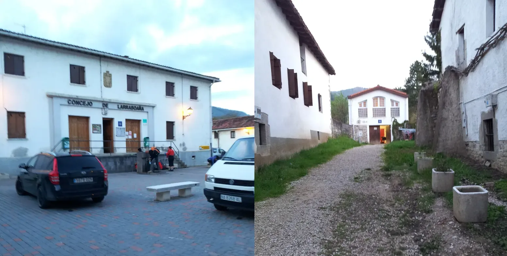

## Camino Francés  2012  

### Etapa-02: Roncesvalles → Larrasoaña ( 21,4 + 5,5 Km)
06 de Mai 2012

-  **Iruña** não é **Irun**.  -  **Iruña** ist nicht **Irun**. -  **Iruña** no es **Irun**. -  **Iruña** is not **Irun**.

- - Irun é um municipio no País Basco em Espanha na Provincia de Guipúscoa, da qual San Sebastian (Donostia) é a Capital 
-  Iruña  = Pamplona = Capital
- - Pamplona (em basco: Iruñea ou Iruña) é a capital da região autónoma de Navarra, em Espanha

Ich kämpfte immer noch gegen die (körperliche und geistige) Müdigkeit an – nicht zu vergessen, dass ich seit meiner Abreise aus Wuppertal (Wuppertal-Köln-Paris-Nord-Paris-Montparnasse-Bayonne-SJPdP) noch keine richtige Pause gehabt hatte und dass ich zwei Tage zuvor für eine Präsentation/Schulung in Süddeutschland gewesen war. Dadurch fehlte mir der Zeitpuffer, den ich eingeplant hatte (1 Woche) . Deshalb beschloss ich, die Etappen zu verlängern. In Zubiri setzte ich mich für 30 Minuten hin und rang mit mir selbst: dort bleiben oder noch ein paar Kilometer weitergehen.

I was still battling against the (physical and mental) fatigue – not to mention that I hadn’t had a proper break since leaving Wuppertal (Wuppertal–Cologne–Paris-Nord–Paris-Montparnasse–Bayonne–SJPdP) and that I’d been in southern Germany two days earlier for a presentation/training session. As a result, I didn’t have the time buffer I’d planned for (one week). So I decided to extend the stages. In Zubiri, I sat down for 30 minutes and wrestled with myself: should I stay there or carry on for a few more kilometres?

Seguía luchando contra el cansancio (físico y mental); sin olvidar que, desde mi salida de Wuppertal (Wuppertal-Colonia-París-Norte-París-Montparnasse-Bayona-SJPdP), aún no había tenido un descanso de verdad y que, dos días antes, había estado en el sur de Alemania para una presentación/formación. Por eso me faltaba el margen de tiempo que había previsto (una semana). Así que decidí alargar las etapas. En Zubiri me senté durante 30 minutos y luché conmigo mismo: quedarme allí o seguir unos kilómetros más.

Continuava a lutar contra o cansaço (físico e mental) – sem esquecer que, desde a minha partida de Wuppertal (Wuppertal-Colónia-Paris-Nord-Paris-Montparnasse-Bayonne-SJPdP), ainda não tinha tido uma pausa a sério e que, dois dias antes, tinha estado no sul da Alemanha para uma apresentação/formação. Por isso, não tinha a margem de tempo que tinha previsto (1 semana). Decidi, então, prolongar as etapas. Em Zubiri, sentei-me durante 30 minutos e debati-me comigo mesmo: ficar ali ou continuar mais alguns quilómetros.

Alles beginnt mit der Frage: Wo kann man hier in der Gegend etwas essen?

..., ... . Darauf werde ich später noch eingehen, denn dieser Tag hat mir viel Stoff zum Nachdenken gegeben, und es war nicht nur die 81-jährige Pilgerin, die mich dazu motiviert hat, nicht aufzugeben; es waren auch andere kleine Dinge, die mich mein ganzes Leben lang begleitet haben und die im alten Busbahnhof von Santiago besonders deutlich zutage traten. Ich werde fünf Geschichten erzählen, in denen die Ereignisse zwar unterschiedlich erscheinen, aber im Grunde denselben Kern haben.

1. Ereignis: La Rasoaña (ich, immer mal wieder hierhin und dorthin)

2. Ereignis: Logroño (ich (einmal) und die spanische Pilgerin, die sagte, sie spreche kein Englisch (mehrmals))

3. Ereignis: Tosantos (ich, mehrmals, aber der Hospitalero sagte: „sorge jetzt für dich “)
Hier war meine Rettung und ich wurde sagen, wenn ich nicht hier angehalten hätte, hätte ich es aufgegeben.

4. Gespräche: Auf dem Weg nach Negreira (Rafael oder Gabriel: Ich bin mir fast sicher, dass es Rafael war, ein pensionierter Zivilgardist.) *(Gabriel stammte aus Mallorca. Nach einem langen Berufsleben hatte er endlich Zeit, den Jakobsweg zu gehen, und seine Frau begleitete ihn auf dieser Reise. Mit Gabriel, seiner Frau, einem Pilger aus Ungarn, Sue aus Korea-Australien, einem weiteren koreanischen Pilger und ich bei einem der besten  Abendessen … dieser Abend ist mir noch sehr lebhaft in Erinnerung) *

5. Gespräche: Ehemaliger Busbahnhof von Santiago (Der Busfahrer und die Erwartungen der Menschen: mehrsprachig und multitaskingfähig)

Diese Ereignisse reichen über den gelebten Moment hinaus, daher werde ich überlegen, wie ich sie formulieren kann

Albergue (Reception)                                                                   Albergue (Dependence?)

---

  

🇬🇧
🇪🇸
🇵🇹
🇩🇪

---

**↪** [Etapa-03_Larrasoana_Pamplona](Etapa-03_Larrasoana_Pamplona.md)

 🔁 [Camino-Frances_Etapas](Camino-Frances_Etapas.md)

 ...→