## Camino Francés  2012  

### Etapa-02: Roncesvalles → Larrasoaña ( 21,4 + 5,5 Km)
06 de Mai 2012

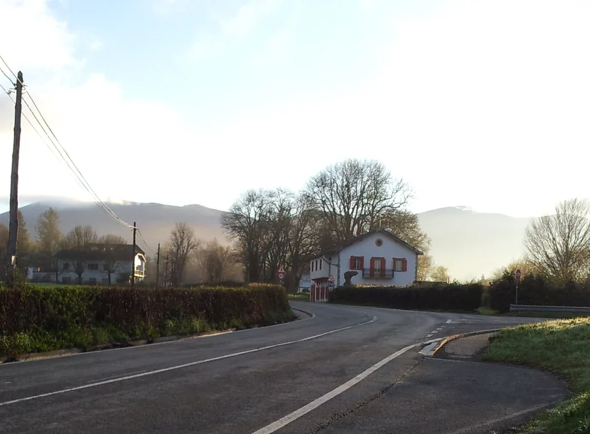

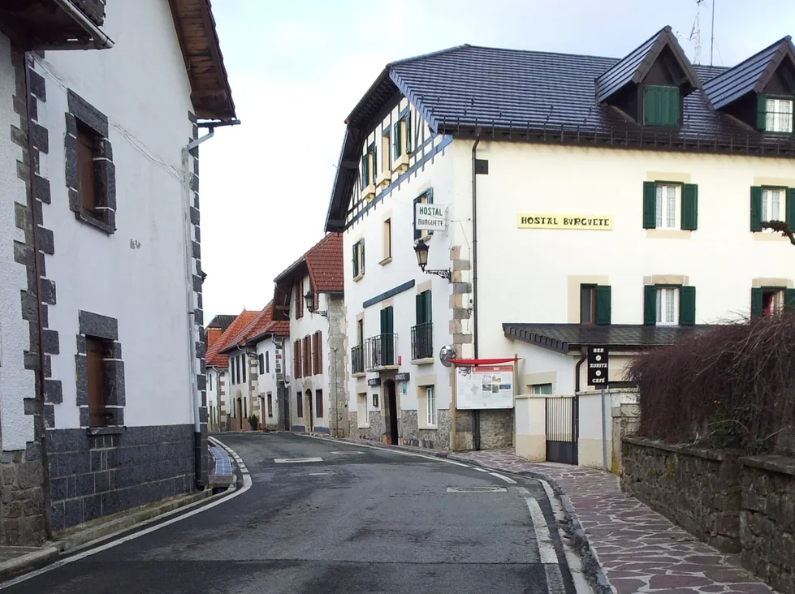

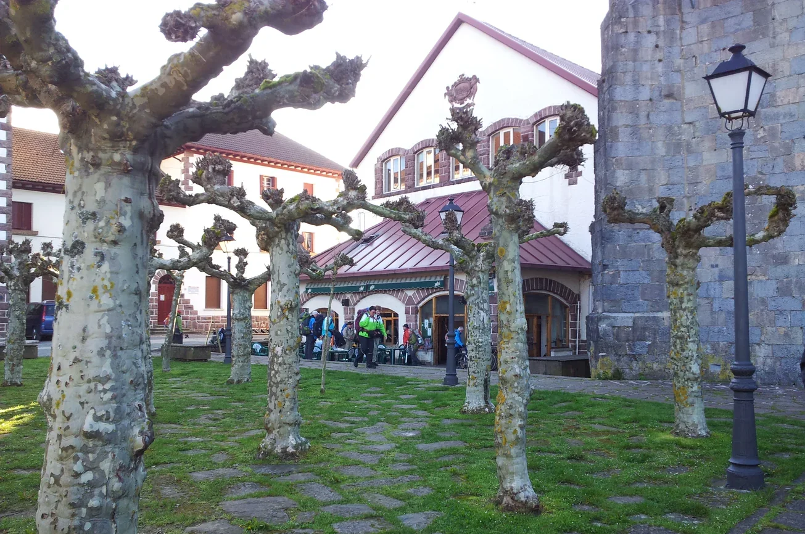

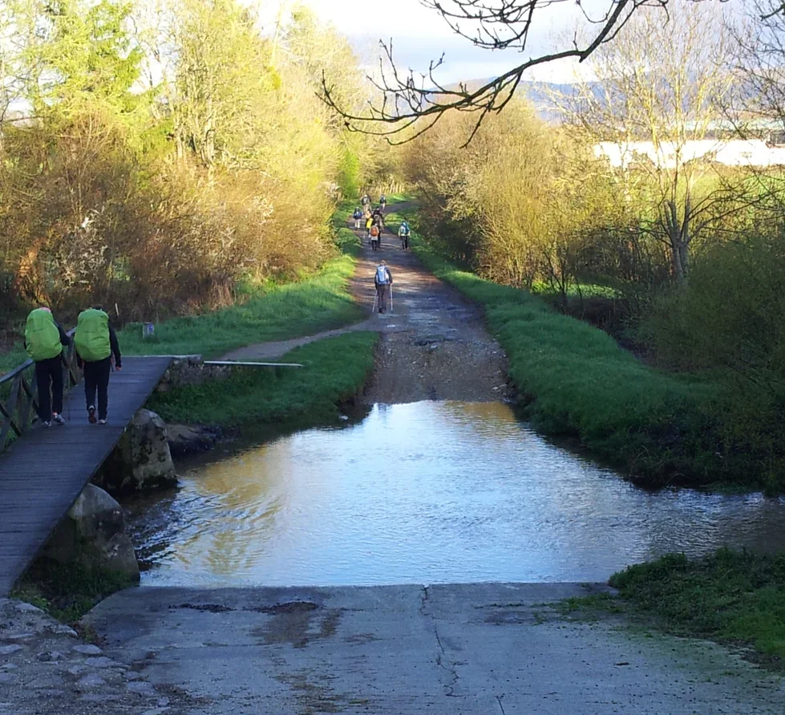

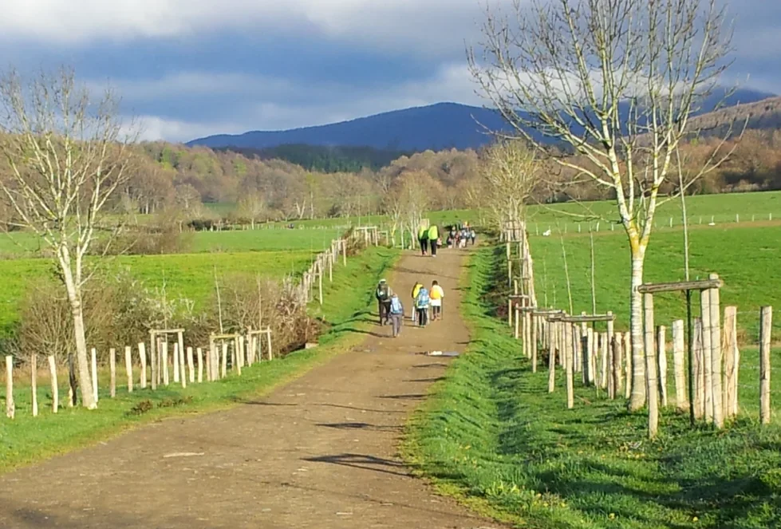

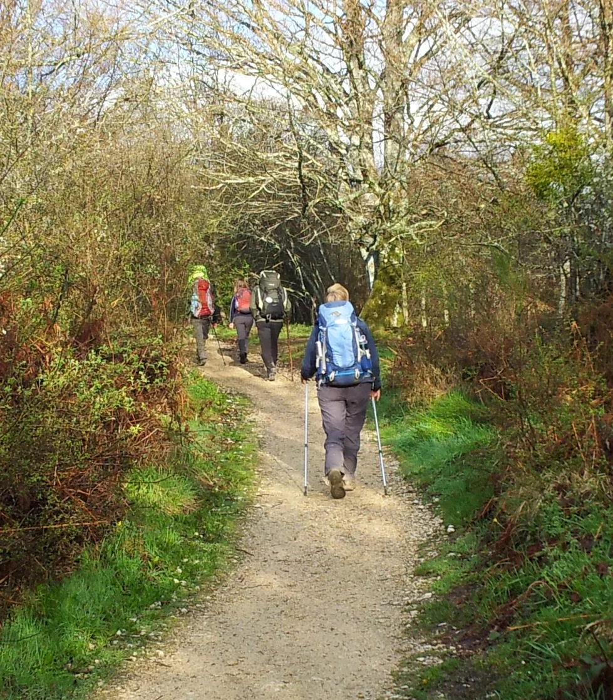

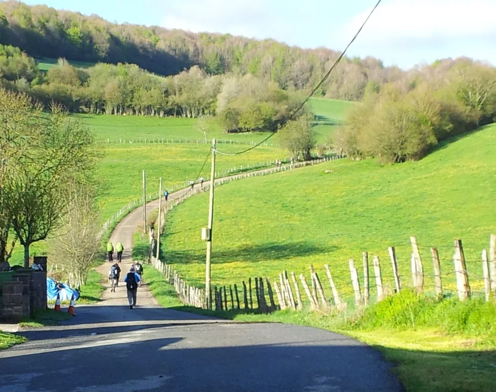

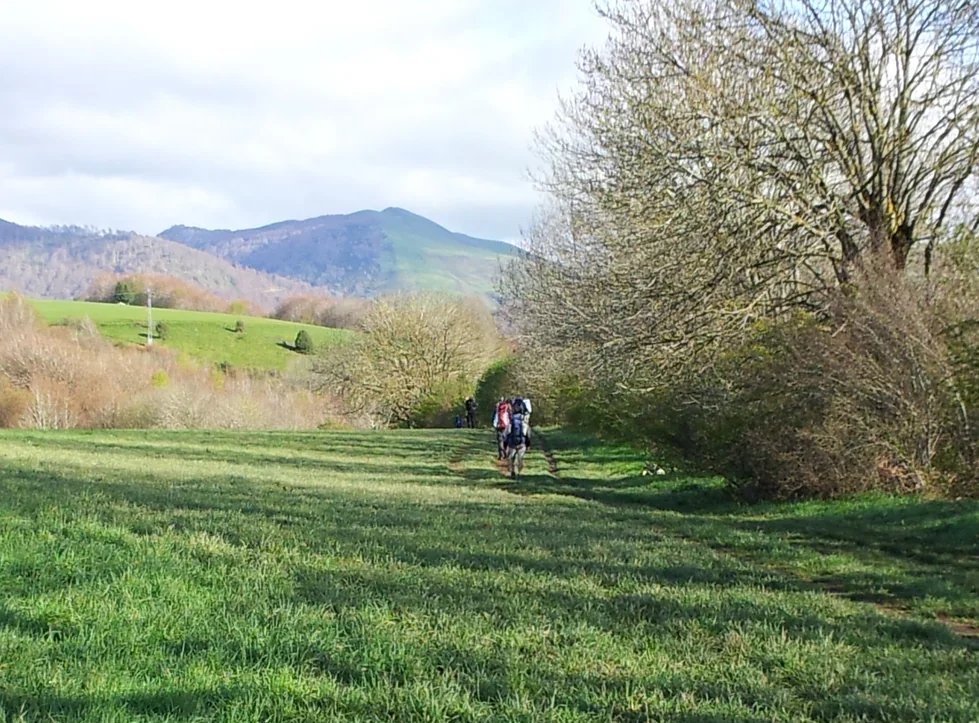

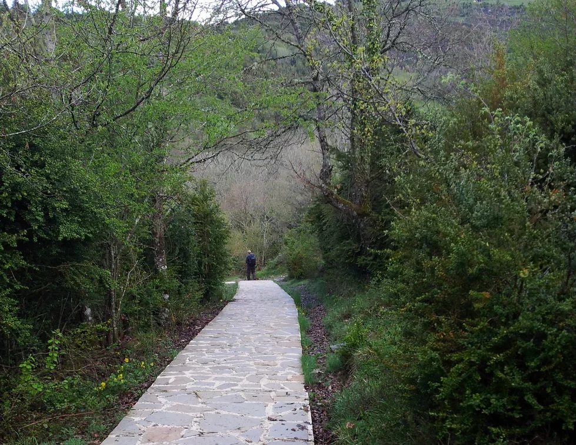

-  **Iruña** não é **Irun**. 
- - Irun é um municipio no País Basco em Espanha na Provincia de Guipúscoa, da qual San Sebastian (Donostia) é a Capital 
-  Iruña  = Pamplona = Capital
- - Pamplona (em basco: Iruñea ou Iruña) é a capital da região autónoma de Navarra, em Espanha

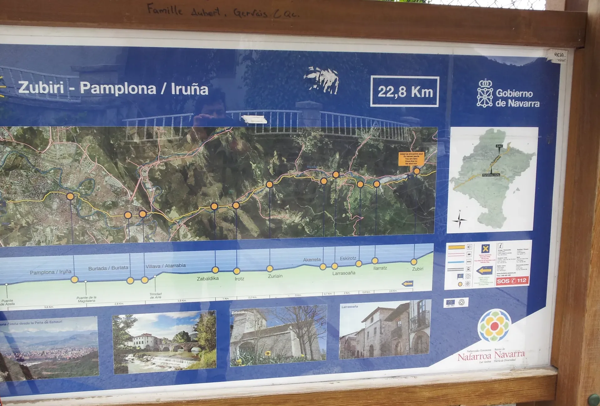

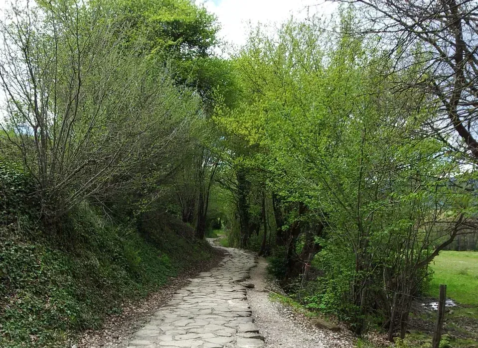

[Larrasoaña](https://www.gronze.com/navarra/larrasoana)

Albergue (Reception)                                                                   Albergue (Dependence?)

---

 🇵🇹  

---

 🇩🇪 

---

 🇪🇸  

---

 🇬🇧 

---

  

🇬🇧
🇪🇸
🇵🇹
🇩🇪

---

**↪** [Etapa-03](Etapa-03.md)

 🔁 [Camino-Frances_Etapas](Camino-Frances_Etapas.md)

 ...→