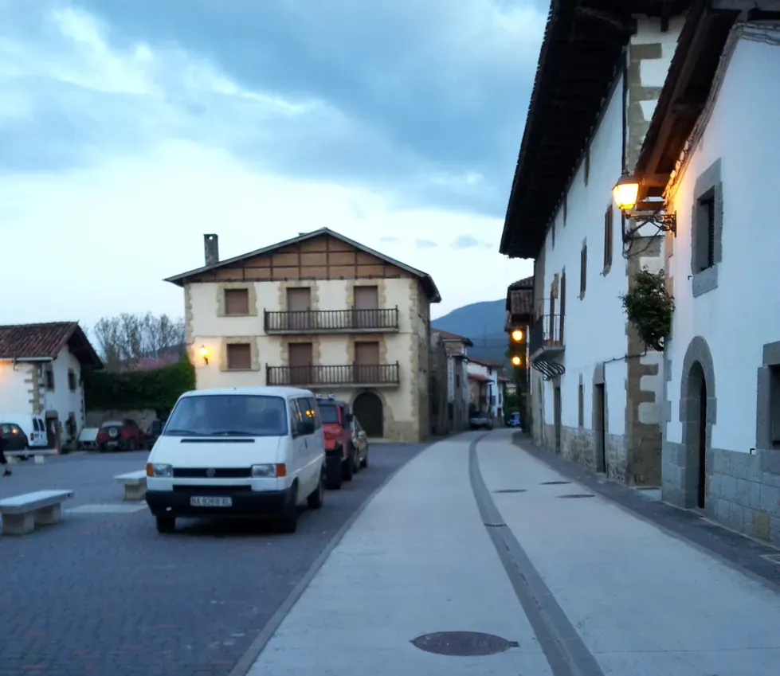
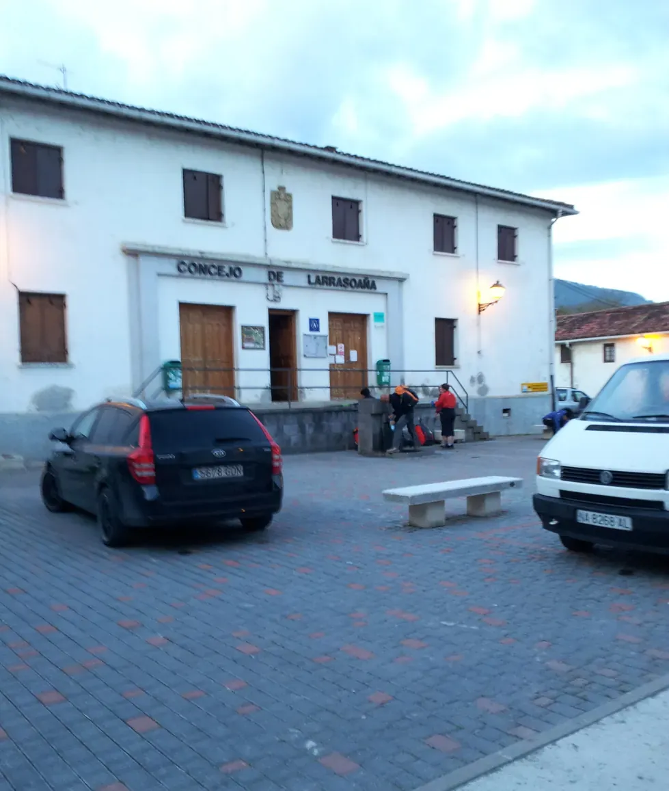
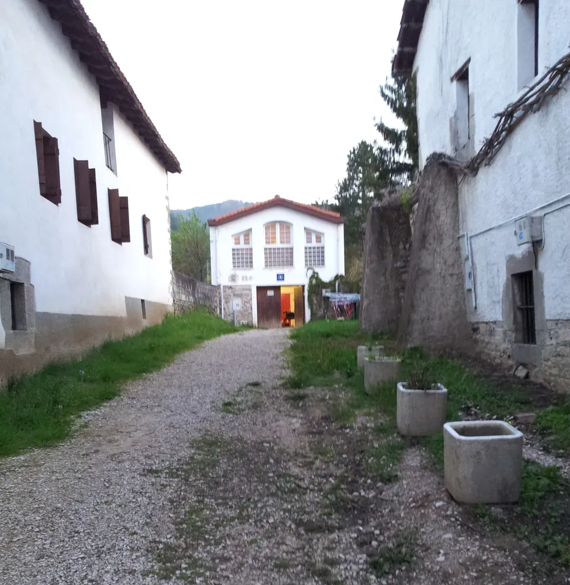
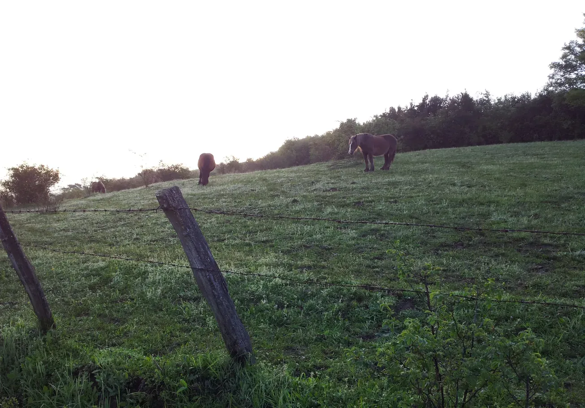
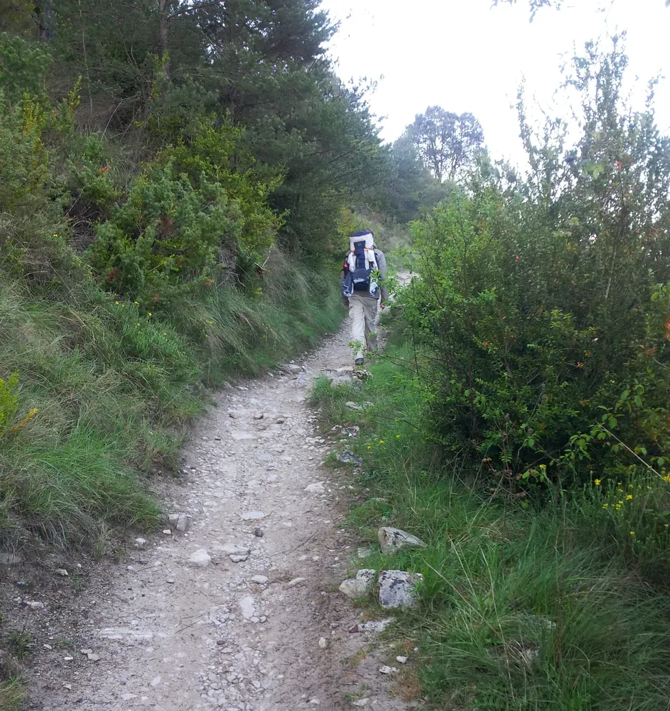
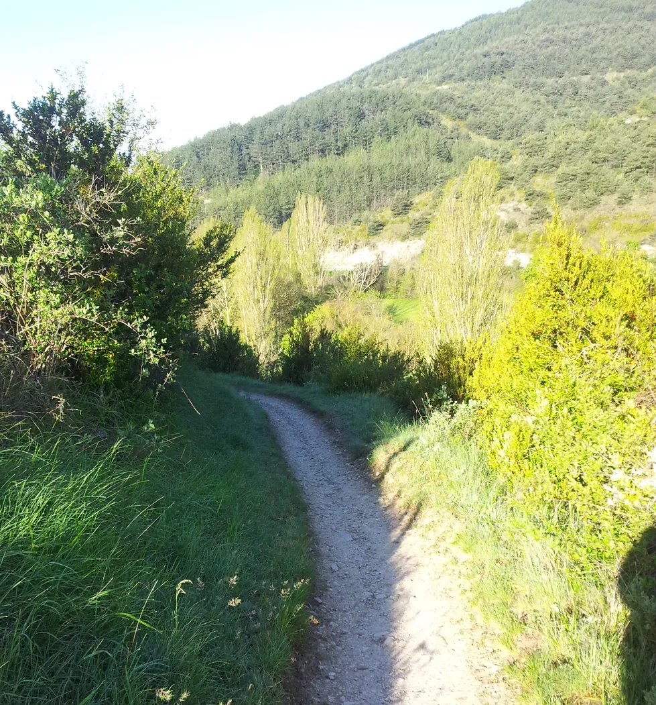
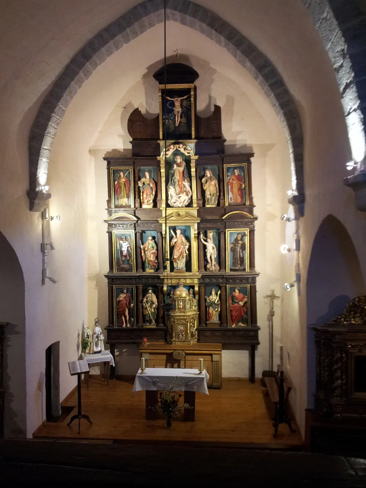

## Camino Francés  2012  

### Etapa-03:  →  ( Km)
07 de Mai 2012

Recuerdo ese día como si hubiera sido ayer

Ich erinnere mich an diesen Tag, als wäre es gestern gewesen

Vejo este dia, como se tivesse sido ontem

I can still picture that day as if it were yesterday

---

 

 🇩🇪 

---

 🇪🇸  

---

 🇬🇧 

---

 🇵🇹  

---

---

  

🇬🇧
🇪🇸
🇵🇹
🇩🇪

---

**↪** [Etapa-04](Etapa-04.md)

 🔁 [Camino-Frances_Etapas](Camino-Frances_Etapas.md)

 ...→