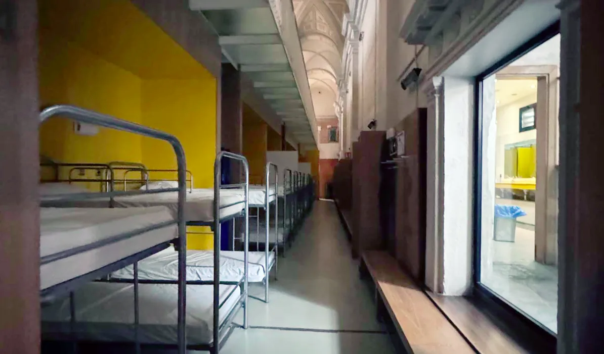

## Camino Francés  2012  

### Etapa-03:  Larrasoaña → Pamplona "Iruña"  (14,9 Km)
07 de Mai 2012

Recuerdo ese día como si hubiera sido ayer

Ich erinnere mich an diesen Tag, als wäre es gestern gewesen

Vejo este dia, como se tivesse sido ontem

I can still picture that day as if it were yesterday

- Albergue municipal Jesús y María

Google-Maps-Bild von „Caïna Verrin“ aus dem Jahr 2026

Imagem do Google Maps de „Caïna Verrin“, de 2026

Google Maps image by “Caïna Verrin” from 2026

🇩🇪 Die abgelehnte Hilfe 

Städtische Herberge „Jesús y María“  

Ich bin mir nicht mehr ganz sicher, ob dies der einzige Schlafsaal auf diesem Korridor ist. Aber in einem solchen habe ich 2012 geschlafen. Ich lag im oberen Bett eines Etagenbetts, direkt gegenüber stand der Schrank. Während ich mich auf dem Bett in den Buddha-Sitz setzte und Laken und Schlafsack zurechtzog, nahm eine Pilgerin aus Österreich auf der Bank neben dem Schrank Platz.

Sie war zugleich die erste Pilgerin, die ich sah, die vorsichtshalber Pflaster auf ihre Zehen geklebt hatte. Dieses Bild ist mir bis heute geblieben. Und wie so oft auf dem Weg kamen wir ins Gespräch – über die Etappe, die hinter uns lag, und über die, die noch vor uns lag.

Dabei erzählte sie mir, dass sie am Tag zuvor einen älteren Pilger ins Krankenhaus begleitet hatte. Er war wegen eines Kreislaufproblems auf dem Weg gestürzt. Im Krankenhaus hatte man ihm Medikamente verschrieben, doch er nahm sie nicht. Stattdessen trank er weiterhin Alkohol zu seinen Mahlzeiten.

Wenn er die Medikamente nicht einnimmt, ist das im Grunde dasselbe, wie Hilfe abzulehnen, sagte sie sinngemäß. Und so fragte sie, noch immer verärgert: „Warum habe ich meine Zeit verschwendet, wenn die Leute die Hilfe nicht annehmen wollen?“

Sie erzählte mir auch ein wenig von ihrem Sohn. Er war ihr etappenmäßig ein Stück voraus, und sie hatten geplant, sich an einem bestimmten Ort an einem bestimmten Tag zu treffen. Wegen dieses Vorfalls musste sie ihre Pläne jedoch ändern.

Diese letzte Erinnerung ist nicht mehr ganz so deutlich wie die erste. Aber die Szene mit der Pilgerin auf der Bank, dem Schrank gegenüber und den Pflastern auf ihren Zehen habe ich noch immer vor Augen.

🇵🇹 A ajuda recusada  

Albergue Municipal „Jesús y María“  

Já não tenho a certeza absoluta de que este seja o único dormitório no corredor. Mas foi num dormitório assim que dormi em 2012. Eu estava na cama de cima de um beliche, com o armário mesmo em frente. Enquanto me sentava na cama, em posição de Buda, e ajeitava o lençol e o saco-cama, uma peregrina austríaca sentou-se no banco ao lado do armário.

Foi também a primeira peregrina que vi que, por precaução, tinha colocado pensos nos dedos dos pés. Essa imagem ficou comigo até hoje. E, como tantas vezes acontecia no Caminho, começámos a conversar – sobre a etapa que tínhamos deixado para trás e sobre aquela que ainda tínhamos pela frente.

Foi então que ela me contou que, no dia anterior, tinha acompanhado um peregrino mais velho ao hospital. Ele tinha caído no caminho devido a um problema circulatório. No hospital, tinham-lhe receitado medicamentos, mas ele não os tomava. Em vez disso, continuava a beber álcool às refeições.

Se ele não toma os medicamentos, é praticamente o mesmo que recusar ajuda, disse ela, em essência. E, ainda irritada, perguntou: „Porque é que desperdicei o meu tempo, se as pessoas não querem aceitar ajuda?“

Falou-me também um pouco do filho. Ele estava algumas etapas à sua frente, e os dois tinham combinado encontrar-se num determinado lugar, num determinado dia. Por causa daquele incidente, porém, ela teve de alterar os seus planos.

Esta última lembrança já não é tão nítida como a primeira. Mas ainda consigo ver aquela cena: a peregrina sentada no banco, o armário à sua frente e os pensos nos dedos dos pés.

🇪🇸 La ayuda rechazada 

Albergue Municipal «Jesús y María»  

Ya no estoy del todo seguro de que este sea el único dormitorio de aquel pasillo. Pero en uno así dormí en 2012. Yo estaba en la cama de arriba de una litera, con el armario justo enfrente. Mientras me sentaba en la cama en posición de Buda y acomodaba la sábana y el saco de dormir, una peregrina austríaca se sentó en el banco junto al armario.

Fue también la primera peregrina que vi que, por precaución, se había puesto tiritas en los dedos de los pies. Esa imagen se me ha quedado grabada hasta hoy. Y, como tantas veces ocurría en el Camino, empezamos a hablar: de la etapa que habíamos dejado atrás y de la que todavía teníamos por delante.

Entonces me contó que el día anterior había acompañado al hospital a un peregrino mayor. Se había caído en el camino debido a un problema circulatorio. En el hospital le habían recetado medicamentos, pero él no los tomaba. En cambio, seguía bebiendo alcohol con las comidas.

Si no toma los medicamentos, en el fondo es como si rechazara la ayuda, dijo ella, en esencia. Y, todavía algo molesta, preguntó: «¿Por qué he perdido el tiempo si la gente no quiere aceptar la ayuda?»

También me habló un poco de su hijo. Él iba unas etapas por delante de ella y habían quedado en encontrarse en un lugar determinado, en un día concreto. Sin embargo, a causa de aquel incidente, tuvo que cambiar sus planes.

Este último recuerdo ya no es tan nítido como el primero. Pero todavía puedo ver aquella escena: la peregrina sentada en el banco, el armario enfrente y las tiritas en los dedos de sus pies.

🇬🇧 The help that was refused 

Municipal Hostel “Jesús y María”  

I’m no longer completely sure whether this is the only dormitory along that corridor. But I slept in one like it in 2012. I was in the upper bunk, with the wardrobe directly opposite. As I settled onto the bed in the Buddha position and adjusted the sheet and sleeping bag, an Austrian pilgrim sat down on the bench beside the wardrobe.

She was also the first pilgrim I had ever seen who, as a precaution, had put plasters on her toes. That image has stayed with me to this day. And, as so often happened on the Camino, we began to talk – about the stage we had just left behind and the one that still lay ahead.

She told me that the day before, she had accompanied an older pilgrim to the hospital. He had fallen on the trail because of a circulatory problem. At the hospital, he had been prescribed medication, but he wasn’t taking it. Instead, he continued to drink alcohol with his meals.

If he doesn’t take the medication, it is essentially the same as refusing help, she said, in so many words. And, still sounding irritated, she asked: “Why did I waste my time if people don’t want to accept help?”

She also told me a little about her son. He was a few stages ahead of her, and they had arranged to meet at a particular place on a particular day. Because of this incident, however, she had to change her plans.

This last memory is no longer quite as clear as the first. But I can still see the scene: the pilgrim sitting on the bench, the wardrobe opposite her, and the plasters on her toes.

Die letzte deutsche Fassung würde ich als **Grundfassung** für einen persönlichen Jakobsweg-Erinnerungstext nehmen. Sie bewahrt die etwas verschwommene Qualität einer Jahrzehnte zurückliegenden Erinnerung, statt aus ihr eine zu „perfekte“ Geschichte zu machen.

---

  

🇬🇧
🇪🇸
🇵🇹
🇩🇪

---

**↪** [Etapa-04_Pamplona_Puente-la-Reina](Etapa-04_Pamplona_Puente-la-Reina.md)

 🔁 [Camino-Frances_Etapas](Camino-Frances_Etapas.md)

 ...→