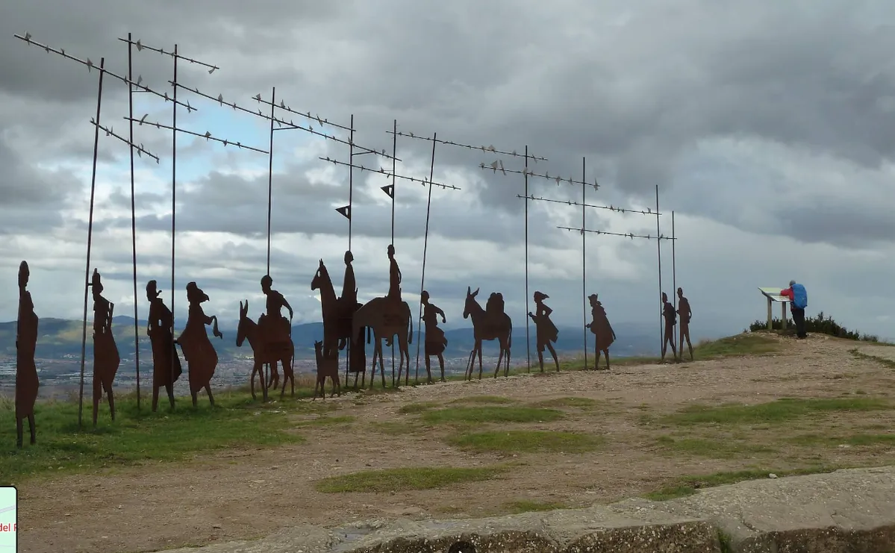

## Camino Francés  2012  

### Etapa-04: Pamplona → Puente la Reina  (23,9 Km)
08 de Mai 2012

**A photo of Alto del Pardon on Google Maps, by Mixel Paillot, from 2020:** 

---

 🇩🇪 Ich sehe ihn wieder 

#### Ich spüre den Tag, aber ich sehe ihn nicht.  

26.09.2026, 09:36 Uhr: Ich sehe ihn wieder.

Mein Erinnerungsanker ist ein Foto vom _Alto del Perdón_ auf Google Maps, aufgenommen von Mixel Paillot im Jahr 2020. Soweit ich mich erinnere, hielt im Jahr 2012, als wir Pilger dort vorbeikamen, niemand an, um Fotos zu machen.

Als ich die wenigen Bilder, die ich noch hatte, den einzelnen Etappen zuzuordnen versuchte, blieb mir rätselhaft, warum ich von diesem Tag nur ein einziges Foto besaß: das in der Kirche am Abend nach unserer Ankunft in _Puente la Reina_. Als ich dann das Foto der Brücke von _Puente la Reina_ sah – das ich dem Morgen der darauffolgenden Etappe zuordnete –, spürte ich diesen Tag ganz deutlich, ohne ihn jedoch vor Augen zu haben.

Erst als ich die Stempel auf meinem Pilgerausweis (_Credencial_) kontrollierte, um den Etappen Namen zu geben, und auf _Gronze.com_ die Kilometerangaben prüfte, fiel mir ein Name ins Auge: „Alto del Perdón“. In diesem Moment öffnete sich die _Camera Obscura_ meiner Erinnerung. Die Bilder wurden so lebendig und klar, als wäre es erst gestern gewesen.

Heute kann ich sagen: Dieser Tag war nicht gerade gnädig mit uns. Es passierten banale Dinge – Dinge, wie sie millionenfach auf der Welt geschehen –, die uns jedoch zwangen, Entscheidungen zu treffen und unsere Pläne komplett zu ändern.

Als wir den _Alto del Perdón_ passierten, regnete es leicht. Bestimmte Abschnitte des Pfades waren so rutschig, dass wir uns gegenseitig warnen und stützen mussten. Ich weiß es nicht mehr ganz genau, aber eine ungarische Pilgerin hatte sich stark erkältet und, so glaube ich, den Fuß verstaucht. Sie war mit ihrem Begleiter unterwegs, ebenfalls aus Ungarn, und konnte einfach nicht mehr weitergehen. Was macht man in so einem Moment? Ihr Begleiter ging seine normalen Etappen weiter, und ich begleitete ihn für ein paar Tage. Wir tranken Bier und genossen zusammen das _Menú del Peregrino_.

Genau in dieser Zeit erfuhr ich, wie es mit ihr weiterging. Sie hatte beschlossen, den Bus zu nehmen, um einige Etappen zu überspringen und sich Zeit zur Genesung zu geben. Der Plan war klug: Während sie sich erholte, lief er weiter, sodass er sich ihr wieder näherte. Sie wiederum wollte nicht untätig auf ihn warten, sondern um wieder in Form zu kommen, den Weg in kleineren Etappen fortsetzen. Während er seine 20 bis 30 Kilometer pro Tag zurücklegte, plante sie mit 10 bis 15 Kilometern. An einem bestimmten Tag wollten sie sich wiedertreffen, um gemeinsam nach Santiago zu laufen. Die letzte Nachricht, die ich mitbekam, war, dass sie an ihrem Etappenziel ankam und es dort geschneit hatte. Ich selbst erlebte ab diesem Zeitpunkt keine Regentage mehr und sah die verschneiten Berggipfel nur noch aus der Ferne auf Fotos.

Diese Erfahrung, die ich so nah miterleben durfte, sollte später dazu führen, dass ich einem australischen Pilger katalanisch-azorischer Abstammung einen entscheidenden Rat gab. Und kurz darauf stand ich in _Triacastela_ selbst vor der Frage: Ratschläge zu erteilen ist gut, aber wäre es nicht besser, den eigenen Ratschlägen auch zu folgen?

In den kommenden Etappenberichten werde ich das noch genauer erzählen.

---

 🇬🇧  I see it again!

####  I feel the day, but I cannot see it.  
26.09.2026, 09:36: I see it again.

My anchor of remembrance is a photo of _Alto del Perdón_ on Google Maps, taken by Mixel Paillot in 2020. As far as I can remember, back in 2012 when we pilgrims passed by, nobody stopped to take pictures.

When I tried to arrange the few photos I found into their respective stages, it was a mystery to me why I only had one single picture from that day: the one inside the church on the evening we arrived in _Puente la Reina_. When I later looked at the photo of the bridge of _Puente la Reina_—which I had filed under the morning of the following stage—I could deeply feel that day, even without seeing it.

It was only when I checked the stamps on my _Credencial del Peregrino_ to name the stages and verified the distances on _Gronze.com_ that a specific name caught my eye: "Alto del Perdón." In that exact moment, the _camera obscura_ of my memories opened up. The images became so vivid and clear, as if it had happened only yesterday.

Looking back, I can say that this day was not particularly kind to us. Banal things happened—the kind of things that happen a million times across the world—but they forced us to make difficult decisions and change our plans entirely.

As we passed _Alto del Perdón_, a fine rain was falling, and certain sections of the path were so slippery that we had to warn and support each other. I don't remember the exact details, but a Hungarian pilgrim caught a severe cold and, I believe, sprained her ankle. She was traveling with her companion, also from Hungary, and could no longer walk. What do you do in such a situation? Her companion decided to keep walking his regular stages, and I accompanied him for a few days. We shared a few beers and enjoyed the _Menú del Peregrino_ together.

It was during these moments that I learned what happened to her. She decided to take a bus to skip a few stages and take some time to recover. The plan was for him to keep moving so he could close the distance later, while she, rather than just waiting for him, would start walking shorter stages of 10 to 15 kilometers to get back into shape while he covered his usual 20 to 30 kilometers. They planned to reunite on a specific day and walk into Santiago together. The last update I heard was that she had reached a certain place, and it was snowing. From that day on, I didn't experience any more rain myself and only saw the snow-capped mountain peaks in photos.

This experience, which I witnessed firsthand, would later lead me to give a piece of advice to an Australian pilgrim of Catalan-Azorean descent. And later, in _Triacastela_, I found myself facing the ultimate test: giving advice is easy, but following your own advice is a different story.

I will explain this in more detail in the upcoming stages.

---

 🇪🇸 Lo veo otra vez! 

#### Siento el día, pero no lo veo.  
26.09.2026, 09:36: Lo veo otra vez.

Mi ancla de recuerdos es una foto del _Alto del Perdón_ en Google Maps, tomada por Mixel Paillot en 2020. Que yo recuerde, en aquel año 2012, cuando los peregrinos pasábamos por allí, nadie se detenía a hacer fotos.

Cuando intenté organizar las pocas fotos que encontré según las etapas, me resultaba un misterio por qué solo tenía una imagen de ese día: la que tomé en la iglesia por la tarde, tras llegar a _Puente la Reina_. Cuando luego vi la foto del puente de _Puente la Reina_ —la cual clasifiqué en la mañana de la siguiente etapa—, sentí ese día con fuerza, aunque no pudiera verlo en mi mente.

No fue hasta que revisé los sellos de mi _Credencial del Peregrino_ para ponerle nombre a las etapas y consulté las distancias en _Gronze.com_, que un nombre me llamó la atención: "Alto del Perdón". En ese preciso instante, se abrió la _cámara oscura_ de mis recuerdos. Las imágenes se volvieron tan vivas y claras como si hubiera sido ayer mismo.

Hoy puedo decir que este día no fue precisamente clemente con nosotros. Sucedieron cosas banales —de esas que pasan millones de veces en este mundo—, pero que nos obligaron a tomar decisiones y a planificar las cosas de otra manera.

Cuando pasamos por el _Alto del Perdón_, caía una fina lluvia y algunos tramos del sendero estaban tan resbaladizos que tuvimos que advertirnos y apoyarnos mutuamente. No lo recuerdo con total exactitud, pero una peregrina húngara se había resfriado fuertemente y creo que también se había torcido el tobillo. Caminaba junto a su compañero de ruta, también húngaro, y ya no podía seguir. ¿Qué se hace en un momento así? Su compañero continuó con sus etapas normales y yo lo acompañé durante un par de ellas. Disfrutamos juntos de unas cervezas y del _Menú del Peregrino_.

Fue precisamente en esos momentos cuando supe qué había pasado con ella. Decidió tomar el autobús para saltarse algunas etapas y tomarse un tiempo para recuperarse. El plan era que, mientras ella sanaba, él siguiera avanzando para luego encontrarse; ella, por su parte, no quería esperarlo sentada, sino que, para recuperar la forma, reemprendería el camino en etapas más cortas. Mientras él hacía sus etapas habituales de 20 a 30 kilómetros, ella haría de 10 a 15 kilómetros al día. Habían quedado en reunirse un día concreto para caminar juntos hasta Santiago. La última noticia que me llegó fue que ella había llegado a un lugar determinado y estaba nevando. A partir de ahí, yo personalmente no volví a tener días de lluvia y solo vi las cumbres nevadas a través de fotos.

Esta experiencia, que viví tan de cerca, me serviría más tarde para darle un consejo a un peregrino australiano de ascendencia catalana y azoriana. Y luego, en _Triacastela_, me encontré ante el dilema: dar consejos es fácil, pero seguir los propios consejos sería aún mejor.

Lo explicaré con más detalle en las próximas etapas.

---

 🇵🇹 Eu vejo-o outra vez! 

Sinto o dia, mas não o vejo.  
26.09.2026, 09:36: Eu vejo-o!

A minha âncora de memórias é uma foto do _Alto del Perdón_ no Google Maps, tirada por Mixel Paillot em 2020. Pelo que me lembro, em 2012, quando nós, peregrinos, passávamos por ali, ninguém parava para tirar fotos.

Quando tentei organizar as poucas fotos que encontrei de acordo com as etapas, era um mistério para mim por que razão só tinha uma única imagem daquele dia: a da igreja, à noite, após a chegada a _Puente la Reina_. Quando mais tarde vi a foto da ponte de _Puente la Reina_ —que classifiquei na manhã da etapa seguinte —, senti aquele dia claramente, mesmo sem o conseguir ver na minha mente.

Foi só quando verifiquei os carimbos na minha _Credencial del Peregrino_ para dar nome às etapas e consultei as distâncias no _Gronze.com_ que um nome me chamou a atenção: "Alto del Perdón". Nesse exato momento, a _câmara escura_ das minhas memórias abriu-se. As imagens tornaram-se tão vivas e nítidas como se tivesse sido ontem.

Hoje posso dizer que esse dia não foi propriamente clemente connosco. Aconteceram coisas banais — daquelas que acontecem milhões de vezes no mundo —, mas que nos obrigaram a tomar decisões e a planear as coisas de forma diferente.

Quando passámos pelo _Alto del Perdón_, caía uma chuva miúda e certos troços do caminho estavam tão escorregadios que tivemos de nos avisar e apoiar mutuamente. Já não me lembro com exatidão, mas uma peregrina húngara apanhou uma constipação forte e, creio eu, torceu o tornozelo. Ela caminhava com o seu companheiro, também húngaro, e não conseguia continuar. O que se faz numa situação destas? O companheiro dela continuou a fazer as suas etapas normais e eu acompanhei-o durante algumas etapas. Bebemos umas cervejas e desfrutámos juntos do _Menú del Peregrino_.

Foi precisamente nesses momentos que soube o que tinha acontecido com ela. Ela decidiu apanhar o autocarro para saltar algumas etapas e dar a si mesma tempo para recuperar. O plano era inteligente: enquanto ela recuperava, ele avançava para depois se aproximar dela; ela, por sua vez, não queria ficar à espera dele, mas sim caminhar em pequenas etapas para voltar a entrar em forma. Enquanto ele fazia os seus 20 a 30 km diários, ela faria 10 a 15 km por dia. O objetivo era reencontrarem-se num dia específico para caminharem juntos até Santiago. A última informação que recebi foi de que ela tinha chegado a um determinado local e estava a nevar. A partir daí, eu pessoalmente não apanhei mais dias de chuva e só vi os picos das montanhas cobertos de neve através de fotos.

Esta experiência, que vivenciei tão de perto, viria a fazer com que mais tarde desse um conselho a um peregrino australiano de ascendência catalã e açoriana. E depois, em _Triacastela_, vi-me confrontado com a questão: dar conselhos é bom, mas seguir os próprios conselhos seria ainda melhor.

Explicarei isto com mais detalhe nas próximas etapas. 

---

Nur ein einziges Foto von 17:40,  aber der Tag ist mir gefühlmäßig noch in den Knochen gespeichert, ..., ... diese Tag hat den folgenden Tag bestimmt ..., ... später mehr dazu..., ... .

Solo una foto de las 17:40, pero emocionalmente ese día todavía lo llevo grabado en lo más profundo de mi ser..., ... ese día marcó el día siguiente..., ... más adelante hablaré de ello..., ... .

---

  

🇬🇧
🇪🇸
🇵🇹
🇩🇪

---

**↪** [Etapa-05_Puente-la-Reina_ Villamayor-de-Monjardín.Los-Arcos12km2](Etapa-05_Puente-la-Reina_%20Villamayor-de-Monjardín.Los-Arcos12km2.md)

 🔁 [Camino-Frances_Etapas](Camino-Frances_Etapas.md)

 ...→