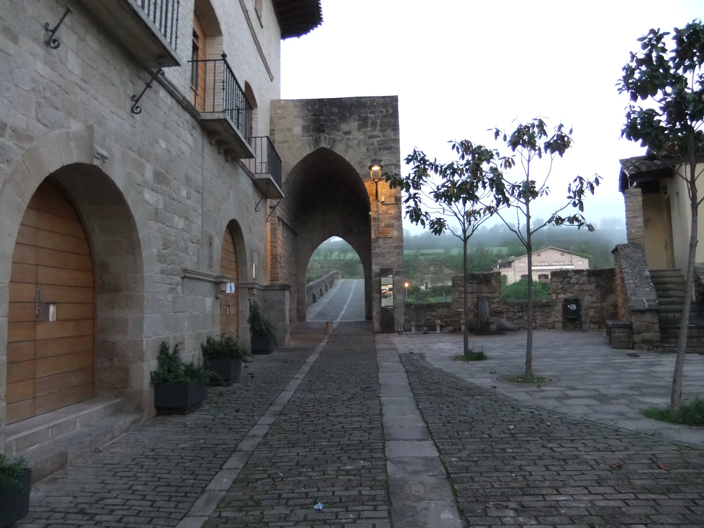
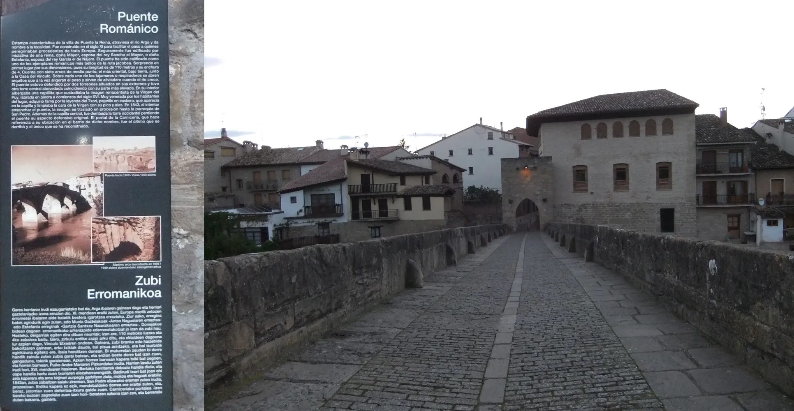
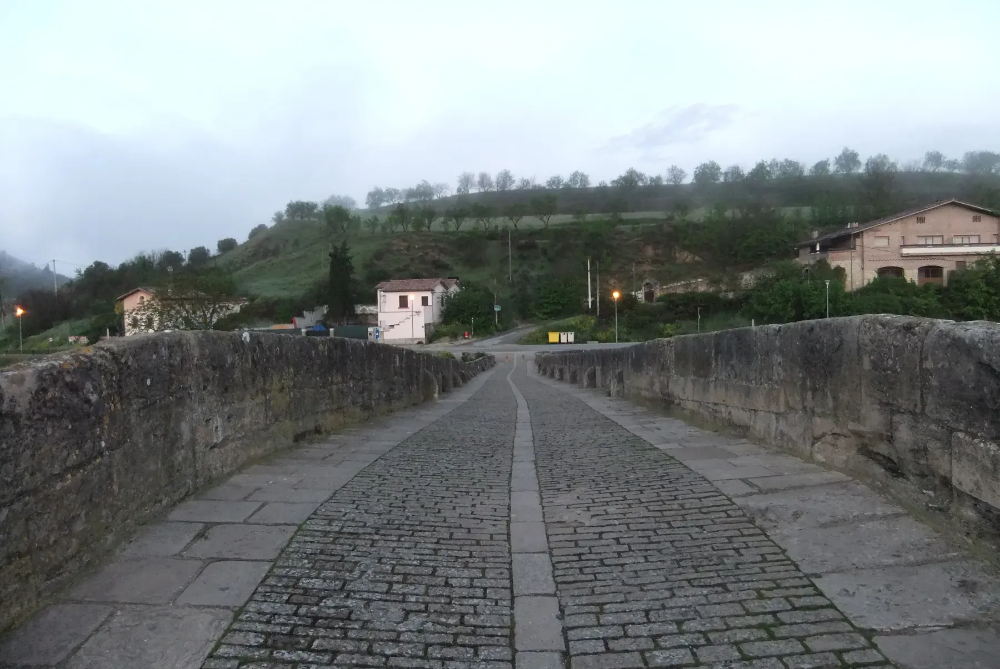
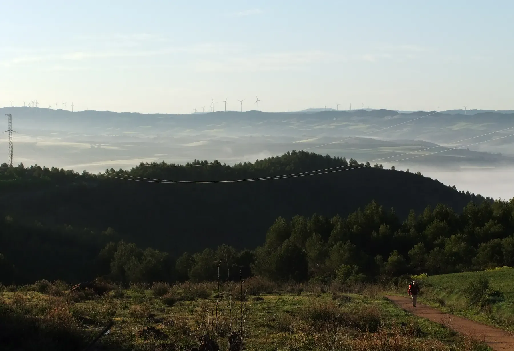
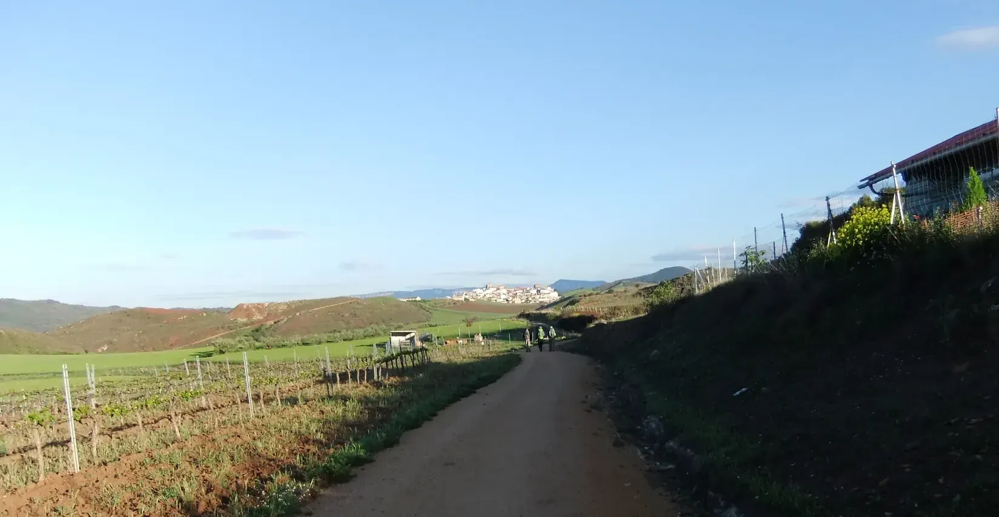
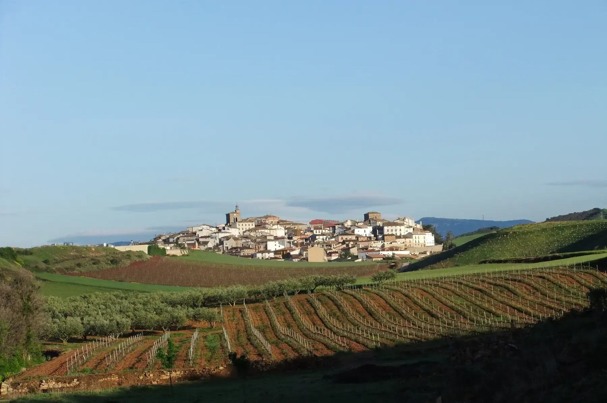
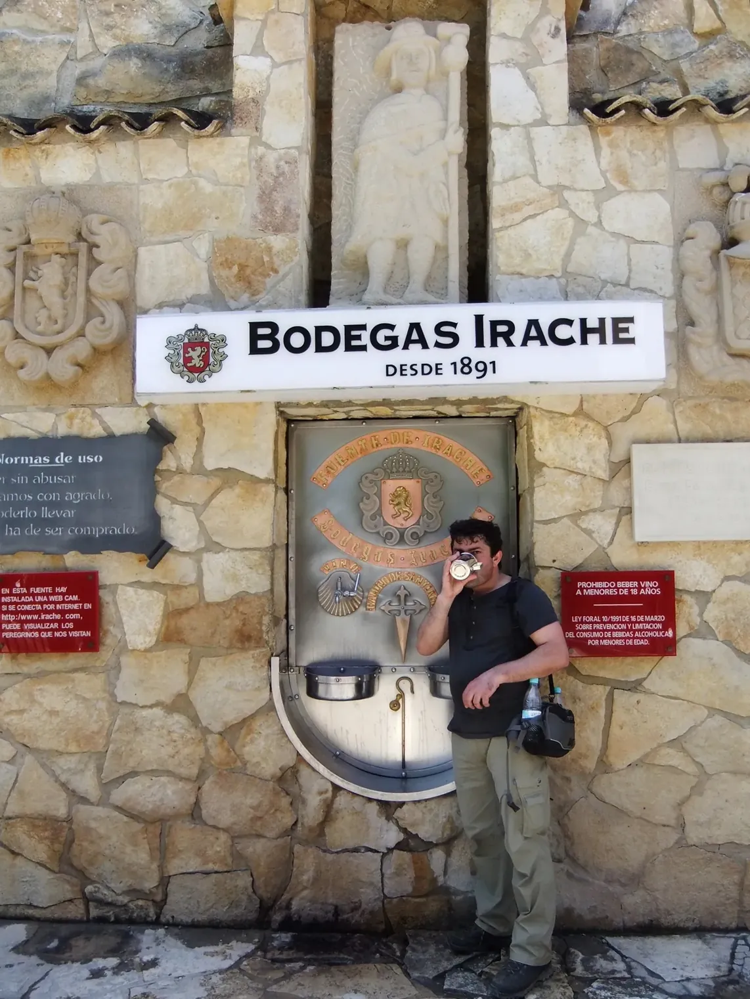
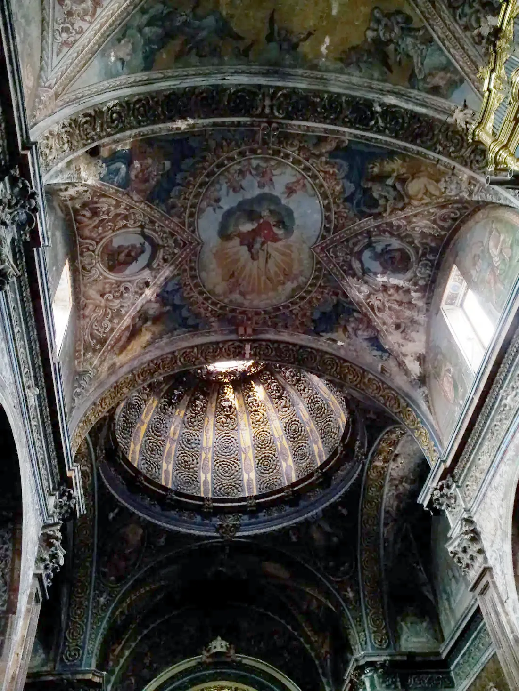

## Camino Francés  2012  

### Etapa-05: Puente la Reina → Villamayor de Monjardín (21,6 + 9,1Km) Los ₤ Arcos 🚕 12.2Km 
09 de Mai 2012 

 🇵🇹 Três portugueses, lá à frente, conversavam sobre o dia-a-dia e assuntos profissionais. Mantive a distância, porque aquilo não me dizia respeito. Muitas vezes, apresentava-me para que as pessoas soubessem quem vinha atrás delas. Mas, naquela manhã, queria ter o caminho só para mim.

🇩🇪 Drei Portugiesen, weiter vorne, unterhielten sich über den Alltag und berufliche Angelegenheiten. Ich hielt Abstand, denn das ging mich nichts an. Oft stellte ich mich vor, damit die Leute wussten, wer hinter ihnen herkam. Aber an diesem Morgen wollte ich den Weg ganz für mich allein haben.

🇪🇸 Tres portugueses, allí delante, hablaban sobre su día a día y asuntos profesionales. Me mantuve a distancia, porque aquello no me incumbía. A menudo me presentaba para que la gente supiera quién venía detrás de ellos. Pero aquella mañana quería tener el camino solo para mí.

🇬🇧  Three Portuguese men, up ahead, were chatting about everyday life and work matters. I kept my distance, as it was none of my business. I often introduced myself so that people would know who was coming up behind them. But that morning, I wanted to have the path all to myself.

---
- **12:57 — Bodegas Irache:**  Der Humoranteil in diesem von ChatGPT übersetzten Text liegt zwischen 10 % und 20 %

Sehr gerne. Ich habe den humorvollen Unterton von „Pflichtprogramm“ und die kleine Geschichte mit der Pilgerin beibehalten, aber die Formulierungen flüssiger und erzählerischer gestaltet.

🇵🇹 12:57 — Bodegas Irache 

#### O programa obrigatório

Primeiro, para matar a sede, bebi da „água da vida“ e, depois, ofereci-me uma boa Caneca de vinho.

Vi uma peregrina a passar e convidei-a para um copo de vinho, na esperança de que ela me tirasse uma fotografia para que eu pudesse guardar na câmara o cumprimento deste pequeno programa obrigatório.

Ela respondeu que teria todo o gosto em fazê-lo mais tarde, ao fim do dia, pois ainda era demasiado cedo e a etapa ainda não tinha terminado. E continuou o seu caminho.

Pouco depois, apareceu um casal de cerca de quarenta anos. Deles, infelizmente, só me consigo lembrar com alguma dor — talvez porque, nessa altura, as pernas já começavam a sentir os quilómetros.

Acabámos por tirar fotografias uns aos outros e, assim, também consegui registar na minha câmara mais um daqueles momentos que fazem parte do Caminho.

---

🇪🇸 12:57 — Bodegas Irache

 
#### El programa obligatorio

Primero, para quitarme la sed, bebí el „agua de la vida“ y, después, me permití disfrutar de una buena copa de vino.

Vi pasar a una peregrina y la invité a tomar una copa de vino, con la esperanza de que me hiciera una foto para poder dejar constancia con mi cámara de que había cumplido con aquel pequeño programa obligatorio.

Me respondió que estaría encantada de hacerlo más tarde, al final del día, porque todavía era demasiado temprano y la etapa aún no había terminado. Y siguió su camino.

Poco después apareció una pareja de unos cuarenta años. De ellos, por desgracia, solo consigo acordarme con cierto dolor —quizás porque, a esas alturas, las piernas ya empezaban a notar los kilómetros.

Al final nos hicimos fotos mutuamente y, de ese modo, también pude guardar en mi cámara otro de esos pequeños momentos que forman parte del Camino.

---

🇬🇧 12:57 — Bodegas Irache

#### The Mandatory Program

First, to quench my thirst, I drank from the „fountain of life“ and then treated myself to a good drop of wine.

I saw a female pilgrim walking past and invited her to have a mug of wine with me, hoping that she would take a photo of me so I could capture this little mandatory part of the Camino with my camera.

She said she would be happy to do it later in the evening, because it was still too early and the day's stage was not over yet. And she continued on her way.

A little later, a couple of about forty came along. Unfortunately, I can only remember them with a certain amount of pain — perhaps because, by that point, my legs were already beginning to feel the kilometres.

In the end, we took photos of one another, and so I was able to capture another one of those small moments that make up the experience of the Camino.

---

🇩🇪 12:57 Uhr — Bodegas Irache 

##### Das Pflichtprogramm

Zuerst löschte ich meinen Durst mit dem „Wasser des Lebens“ und gönnte mir anschließend noch einen guten Tropfen Wein.

Ich sah eine Pilgerin vorbeigehen und lud sie auf einen Becher Wein ein – in der Hoffnung, dass sie mir dafür ein Foto machen würde, damit ich dieses kleine Pflichtprogramm auch mit meiner Kamera festhalten konnte.

Sie sagte, sie würde das gerne später am Abend machen. Dafür sei es jetzt noch zu früh, und schließlich sei die Etappe noch nicht zu Ende. Dann ging sie weiter.

Kurz darauf kam ein etwa vierzigjähriges Paar vorbei. An die beiden kann ich mich allerdings nur noch schmerzhaft erinnern – vielleicht, weil meine Beine zu diesem Zeitpunkt die bereits zurückgelegten Kilometer deutlich zu spüren begannen.

Am Ende machten wir gegenseitig Fotos voneinander. So konnte auch dieser kleine Moment des „Pflichtprogramms“ auf meiner Kamera festgehalten werden.

---

 🇩🇪 Ich spüre den gestrigen Tag, aber ich sehe ihn nicht   

####  Puente la Reina – Villamayor de Monjardín (Los Arcos)

Ich kann mich nicht mehr genau an die Strecke des Vortags erinnern, aber ich weiß noch genau, wie ich mich fühlte, als ich in der Pilgerherberge von Puente la Reina ankam. Es war eine harte Etappe gewesen, kaum in Worte zu fassen. Es war ein durchwachsener Wettertag – das einzige Foto, das ich von diesem Tag habe, zeigt den Altar der Kirche, aufgenommen um 17:40 Uhr.

Ich war völlig erschöpft. Wegen des Regens suchten wir Zuflucht in der Herberge, die mir jedoch sehr beengt vorkam. Wir drängten uns alle dicht an dicht, und die Gemeinschaftsräume reichten bei weitem nicht für alle Pilger gleichzeitig aus.

In jener Nacht schlief ich unruhig und kämpfte mit meinen Gedanken. Ich stand schließlich sehr früh auf und weckte dabei versehentlich einen niederländischen Pilger, der verständlicherweise verärgert war. Als ich mich auf den Weg machte, trug ich noch feuchte Kleidung im Rucksack; wegen der klammen Nachtluft war sie einfach nicht getrocknet.

Ich erinnere mich, dass der Weg an endlosen Weinbergen vorbeiführte. Allerdings fand ich nirgends ein trockenes Plätzchen zum Ausruhen. Zudem waren die Reben frisch gespritzt worden, was meine ohnehin gedrückte Stimmung nicht gerade besserte. Ich glaube, auch der Schluck Wein, den ich am frühen Nachmittag bei den „Bodegas Irache“ trank, tat sein Übriges. Ich hatte an diesem Morgen nur etwas gegessen . 

Kurz vor Villamayor de Monjardín traf ich eine etwa 60-jährige niederländische Pilgerin. Wir gingen ein Stück gemeinsam. Plötzlich überholte uns mit großen Schritten der Niederländer, den ich am Morgen geweckt hatte. Im Vorbeigehen entschuldigte ich mich wortlos bei ihm. Er nickte mir zu und sagte in einem überraschend freundlichen Ton: „Buen Camino“. Er zog weiter und schaffte es tatsächlich, in Villamayor de Monjardín noch eines der letzten Betten zu ergattern.

Als ich dort ankam, musste ich feststellen, dass die städtische Herberge (die auf Spendenbasis lief) geschlossen war. Soweit ich mich erinnere, wirkte sie ohnehin eher wie ein Schuppen oder ein alter Tierstall. Da die andere Herberge im Ort von Niederländern geführt wurde, ging meine Begleiterin dorthin, um ihr Glück zu versuchen. Ich setzte mich derweil auf eine Terrasse und kam mit einer Amerikanerin und ihrem Partner, einem irischen Fotografen, ins Gespräch. Als die Niederländerin zurückkehrte und berichtete, dass alles ausgebucht sei, stand ich auf, um mein Bier zu bezahlen. Doch der irische Pilger winkte ab und sagte: „Das ist schon erledigt.“

Da saßen wir nun – eine Gruppe erschöpfter Pilger am Rande unserer Kräfte. Was sollten wir tun? Jemand ergriff die Initiative und rief ein Taxi. Ohne lange nachzudenken, stieg ich in den Großraum-Pkw. Er hatte etwa sechs bis acht Plätze, aber wir saßen so dicht gedrängt, dass man sie kaum zählen konnte. Die Amerikanerin und der Ire kamen nicht mit; ich weiß nicht, ob sie bereits eine Unterkunft hatten. Als ich die beiden am nächsten Tag wiedertraf, fragte er mich, ob ich den Namen der gelben Pflanzen wüsste, die den Feldern entlang des Weges so eine fröhliche Farbe verliehen. Ich musste passen – das englische Wort dafür fiel mir einfach nicht ein. (Raps)

- 26.09.2026 09:36: Ich sehe ihn wieder   

Mein Erinnerungsanker: **Foto vom Alto del Pardon auf Google Maps, von Mixel Paillot, aus dem Jahr 2020:** Soweit ich mich erinnere, hat zu der Zeit (2012), als wir Pilger hier vorbeikamen, niemand angehalten, um Fotos zu machen 

---

 🇵🇹 Sinto o dia de ontem, mas não o vejo 

#### Puente la Reina – Villamayor de Monjardín (Los Arcos)

Já não me lembro bem do percurso do dia anterior, mas recordo perfeitamente como me senti ao chegar ao albergue de peregrinos de Puente la Reina. Tinha sido uma etapa difícil, nem sei bem como descrevê-la. Foi um dia de tempo instável e cinzento — a única foto que tenho desse dia é do altar da igreja, tirada às 17h40.

Estava exausto e, como chovia, procurámos refúgio no albergue. Pareceu-me um espaço muito claustrofóbico, pois estávamos todos amontoados e as áreas comuns não chegavam para todos ao mesmo tempo.

Nessa noite, dormi mal e lutei com os meus pensamentos. Acabei por me levantar muito cedo e acabei por acordar um peregrino holandês, que ficou bastante irritado. Quando me fiz ao caminho, levava roupa húmida na mochila, que não tinha secado devido à humidade da noite.

Lembro-me de passar por vinhas e mais vinhas, mas não encontrava nenhum lugar para descansar. Além disso, as videiras tinham sido pulverizadas com produtos químicos, o que não ajudou a melhorar o meu humor. Acho que o golo de vinho que tomei ao início da tarde nas "Bodegas Irache" também contribuiu para isso. Tinha comido muito pouco de manhã: apenas um pão seco e simples.

Pouco antes de chegar a Villamayor de Monjardín, encontrei uma peregrina holandesa de cerca de 60 anos e seguimos juntos. A passo largo, o mesmo holandês que eu tinha incomodado de manhã ultrapassou-nos. Sem hesitar, pedi-lhe desculpa. Ele acenou com a cabeça e, num tom amigável, disse: "Buen Camino". Continuou a andar e ainda conseguiu encontrar uma vaga para dormir em Villamayor de Monjardín.

Quando cheguei, soube que o albergue municipal (que funcionava por donativos) estava fechado. Pelo que me lembro, parecia mais um celeiro ou um antigo estábulo. Como os gerentes do outro albergue eram holandeses, a peregrina que vinha comigo foi lá ver se ainda conseguia um lugar. Eu sentei-me numa esplanada e meti conversa com uma americana e o seu companheiro, um fotógrafo irlandês. Quando a holandesa regressou com a notícia de que também não havia vagas, levantei-me para pagar a minha cerveja, mas o peregrino irlandês disse: "Já está pago".

Ali estávamos nós — um grupo de peregrinos no limite das nossas forças. O que fazer? Alguém tomou uma decisão e chamou um táxi. Sem saber bem o que fazer, entrei na carrinha de caixa aberta/mini-bus. Tinha cerca de 6 a 8 lugares, mas estávamos tão apertados que nem dava para contar. A peregrina americana e o companheiro irlandês não vieram connosco; não sei se já tinham alojamento. Quando os reencontrei no dia seguinte, ele perguntou-me se eu sabia o nome daquelas plantas amarelas que davam uma cor tão alegre aos campos ao longo do caminho. Disse-lhe que não sabia o nome em inglês. (Colza)

- 26/09/2026 09:36: **Volto a vê-lo**
A minha âncora de memória: **foto do Alto del Pardon no Google Maps, de Mixel Paillot, de 2020:** tanto quanto me lembro, na altura (2012) em que nós, os peregrinos, passámos por aqui, ninguém parou para tirar fotos 

---

 🇪🇸 Siento lo que pasó ayer, pero no lo veo  

#### Puente la Reina – Villamayor de Monjardín (Los Arcos)

Ya no recuerdo el trayecto del día anterior, pero sí sé exactamente cómo me sentí al llegar al albergue de peregrinos de Puente la Reina. Había sido una etapa dura, difícil de describir. Fue un día de tiempo muy variable; de hecho, la única foto que tengo de ese día es del altar de la iglesia, tomada a las 17:40.

Estaba agotado y, como no paraba de llover, nos refugiamos en el albergue. Me pareció un lugar muy angosto, ya que estábamos todos amontonados y las zonas comunes no daban abasto para tanta gente a la vez.

Esa noche pasé una mala noche y apenas pude conciliar el sueño. Me levanté muy temprano y, al hacerlo, desperté a un peregrino holandés que se molestó bastante. Me puse en marcha con la ropa aún húmeda en la mochila, ya que no se había secado debido a la humedad de la noche.

Recuerdo que el camino transcurría entre interminables viñedos, pero no encontraba ningún sitio seco donde descansar. Para colmo, acababan de fumigar las vides, lo que terminó de estropearme el humor. Creo que el trago de vino que me tomé a primera hora de la tarde en las "Bodegas Irache" también influyó. Había desayunado muy poco esa mañana: solo un pan simple y seco.

Poco antes de llegar a Villamayor de Monjardín, me encontré con una peregrina holandesa de unos 60 años y seguimos juntos. A paso ligero, el mismo holandés al que había molestado por la mañana nos adelantó. Aproveché el momento para pedirle disculpas. Él asintió con la cabeza y, con tono amable, me deseó un "Buen Camino". Siguió adelante y, por lo visto, aún encontró una cama libre en Villamayor de Monjardín.

Al llegar, me enteré de que el albergue municipal (el que funcionaba con donativos) estaba cerrado. Por lo que recuerdo, tenía más el aspecto de un cobertizo o un antiguo establo. Como los hospitaleros del otro albergue eran holandeses, la peregrina que venía conmigo fue a ver si conseguía sitio. Mientras tanto, yo me senté en una terraza y entablé conversación con una estadounidense y su pareja, un fotógrafo irlandés. Cuando la holandesa regresó diciendo que no había plazas, me levanté para pagar mi cerveza, pero el peregrino irlandés me detuvo: "Ya está pagado".

Allí estábamos, un grupo de peregrinos al límite de nuestras fuerzas. ¿Qué podíamos hacer? Alguien tomó la iniciativa y llamó a un taxi. Sin saber muy bien qué hacer, me subí a la furgoneta/monovolumen. Tenía entre 6 y 8 plazas, pero íbamos tan apretados que era imposible contarlas. La estadounidense y el irlandés no subieron; no sé si ya tenían alojamiento. Al día siguiente me los volví a encontrar, y él me preguntó si sabía el nombre de esas plantas amarillas que daban un color tan alegre a los campos del camino. Le contesté que no sabía cómo se decían en inglés. (Colza)

---

- 26/09/2026 09:36: **Vuelvo a verlo**   

Mi punto de referencia: **foto del Alto del Perdón en Google Maps, de Mixel Paillot, de 2020:** por lo que recuerdo, cuando nosotros, los peregrinos, pasamos por aquí (2012), nadie se detuvo a hacer fotos 

---

 🇬🇧 I can sense the previous day, but I can’t see it  

#### Puente la Reina – Villamayor de Monjardín (Los Arcos)

I can no longer look back and remember the previous day's route, but I vividly recall how I felt upon arriving at the pilgrim hostel in Puente la Reina. It had been a grueling stage, hard to put into words. It was a day of mixed and unsettled weather—the only photo I have from that day is of the church altar, taken at 5:40 PM.

I was exhausted. Because of the weather, we all sought refuge in the hostel, which felt incredibly cramped. We were packed in tightly, and the common areas were far from large enough to accommodate everyone at once.

That night was a restless struggle. I got up very early, inadvertently waking a Dutch pilgrim who was understandably annoyed. When I set off, I had to pack damp clothes into my backpack; they simply hadn't dried due to the humid night air.

I remember walking past endless vineyards, yet I couldn't find a single dry spot to take a rest. To make matters worse, the vines had recently been sprayed, which did nothing to improve my mood. I suspect the sip of wine I had earlier that afternoon at "Bodegas Irache" didn't help either. I had eaten very little that morning—just a plain, dry bread roll.

Shortly before reaching Villamayor de Monjardín, I caught up with a Dutch pilgrim in her 60s, and we walked together. Suddenly, the Dutch man I had upset in the morning overtook us with long strides. As he passed, I offered a silent apology. He nodded and, in a surprisingly warm tone, said, "Buen Camino." He pressed on and actually managed to secure one of the last available beds in Villamayor de Monjardín.

When I arrived, I found out that the municipal donativo hostel was closed. As far as I can recall, it looked more like a shed or an old livestock barn anyway. Since the hosts at the other local hostel were Dutch, my walking companion went over to see if she could find a spot. Meanwhile, I sat down at an outdoor café and struck up a conversation with an American woman and her partner, a photographer from Ireland. When the Dutch woman returned to report that they were completely full, I stood up to pay for my beer, but the Irish pilgrim stopped me, saying, "It's already taken care of."

There we sat—a group of exhausted pilgrims at the end of our ropes. What were we to do? Someone took charge and called a taxi. Not knowing what else to do, I piled into the minivan. It had about six to eight seats, but we were squeezed in so tightly that it was impossible to count them. The American pilgrim and her Irish partner didn't join us; I wasn't sure if they had already found a place to stay. I ran into them again the next day, and he asked me if I knew the name of the bright yellow plants that added such a cheerful color to the fields along the trail. I told him I didn't know the English word for it. (Rapeseed)

- 26/09/2026 09:36: **I can see it again**   

My memory anchor: **a photo of Alto del Pardon on Google Maps, by Mixel Paillot, from 2020:** as far as I can remember, when we pilgrims passed through here (2012) , nobody stopped to take photos 

---

  

🇬🇧
🇪🇸
🇵🇹
🇩🇪

---

**↪** [Etapa-06](Etapa-06.md)

 🔁 [Camino-Frances_Etapas](Camino-Frances_Etapas.md)

 ...→