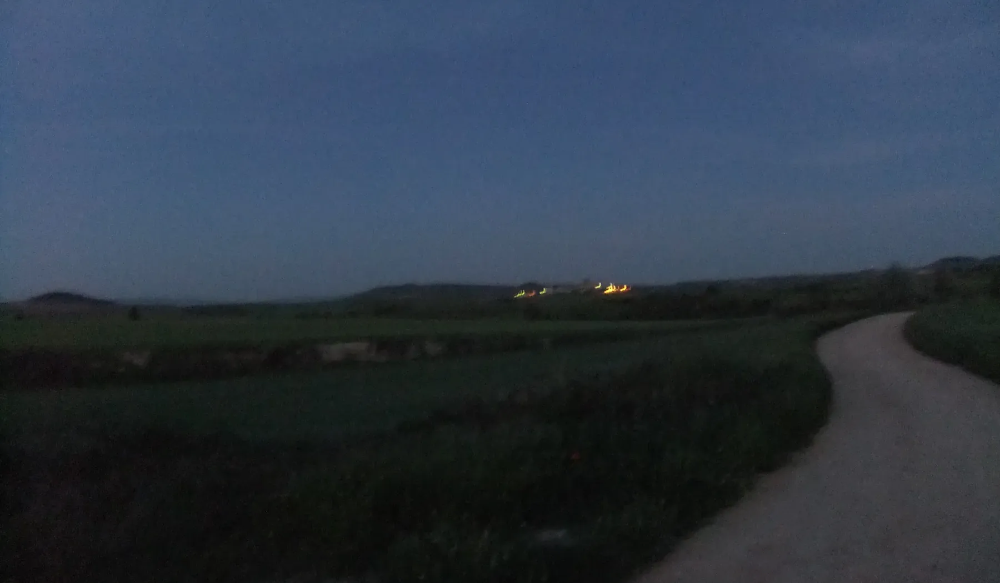
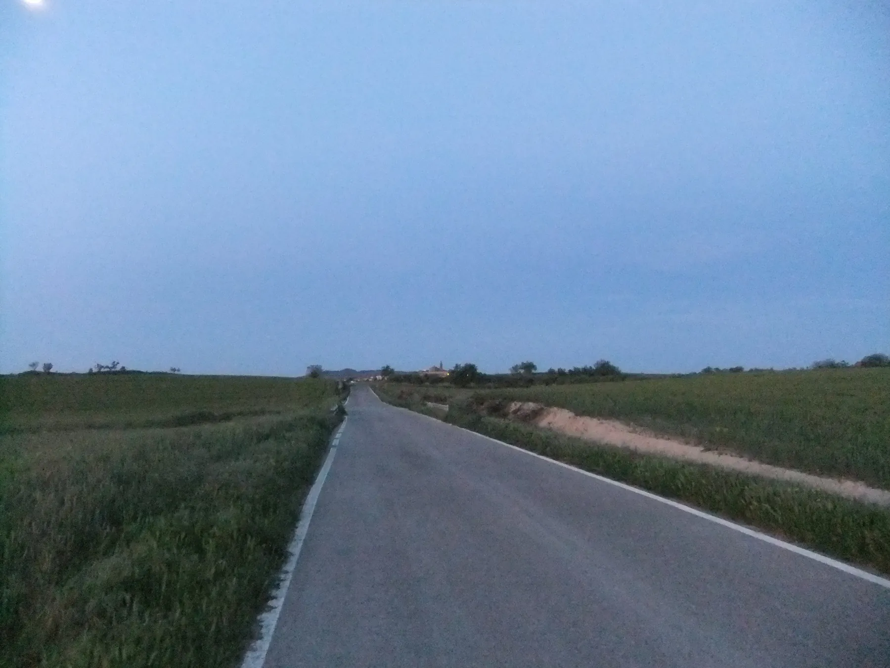
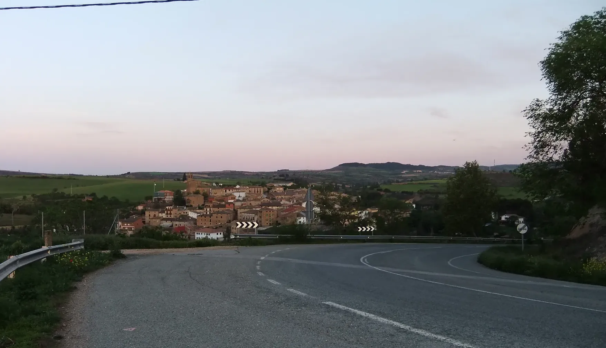
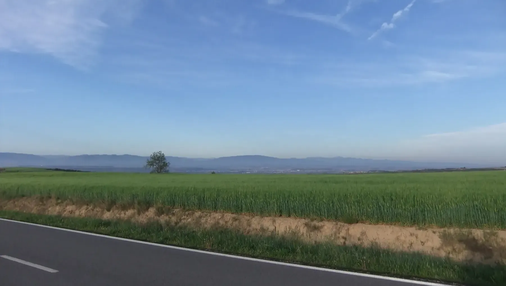
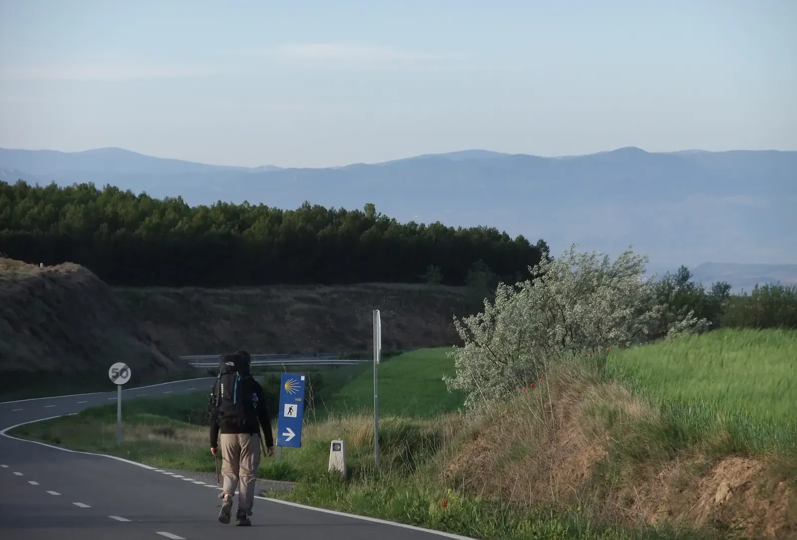
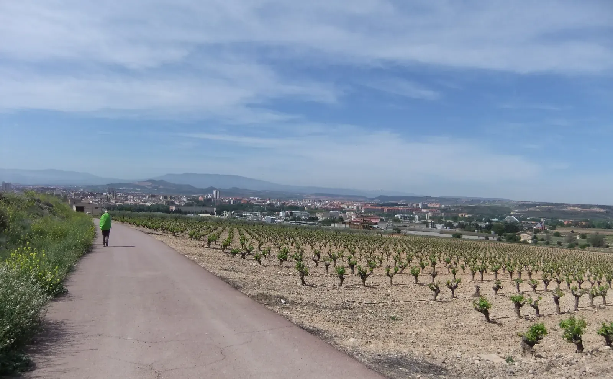
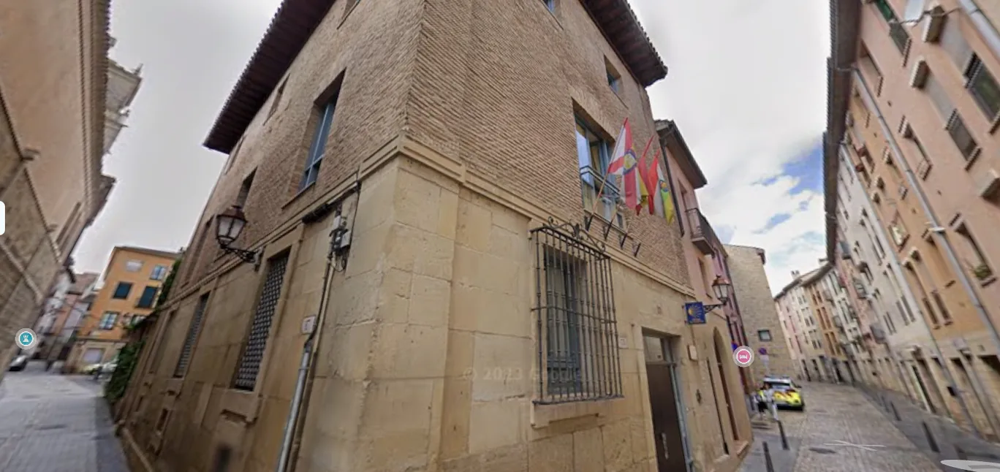
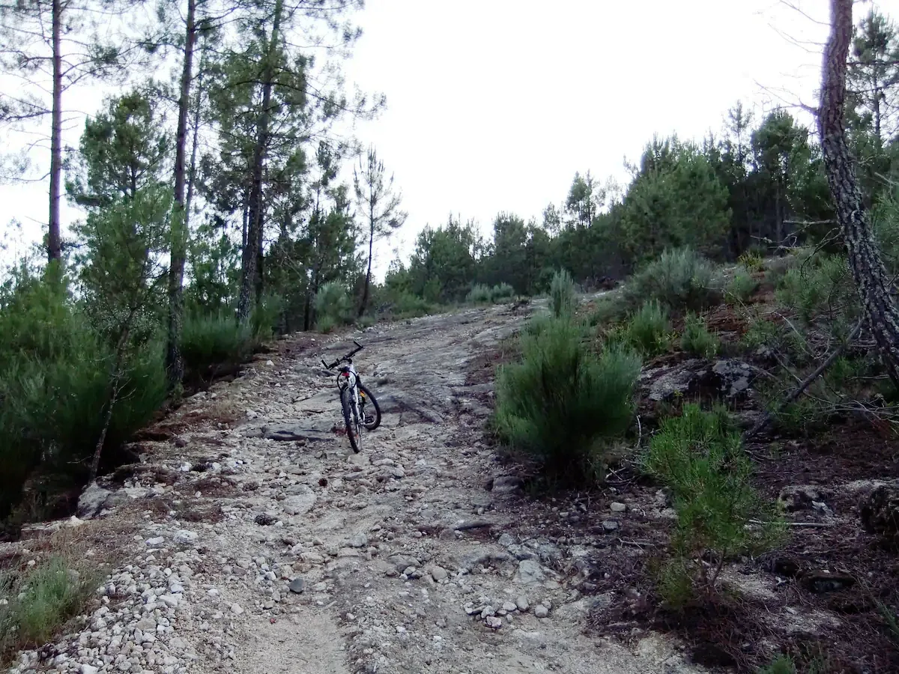

## Camino Francés  2012  

### Etapa-06: Los Arcos → Logroño  ( 27,6 km )
10 de Mai 2012

---

 🇩🇪 Die zwei japanischen Pilgerinnen 

#### Die zwei japanischen Pilgerinnen

> Sie gingen die ganze Zeit zusammen, doch dann ließ eine von ihnen einen Handschuh fallen. Sie kehrte ein paar Meter um, um ihn aufzuheben. Nachdem sie das getan hatte, lächelte sie erfreut, drehte sich um und eilte davon. Irgendetwas an diesem Bild, das mir auf dem Weg immer wieder begegnete, beschäftigte mich: Sie war plötzlich allein. Ich spähte in die Ferne, blickte zurück, doch von ihrer Begleiterin war weit und breit nichts zu sehen.

> Was war passiert? Ich wusste es nicht, aber ich machte mir meine Gedanken. Ich stellte mir vor, wie schwer es sein muss, die weite Reise aus Japan auf sich zu nehmen, um den Camino gemeinsam zu gehen – nur um den Weg nun allein fortzusetzen.

> Doch oft unterscheidet sich das Zusammenleben zu Hause grundlegend von dem auf dem Weg. Daheim verbringt man höchstens ein Drittel des Tages miteinander; hier auf dem Camino ist man bis zu 24 Stunden zusammen. Das sind Herausforderungen, derer sich viele Pilgergemeinschaften – ob zu zweit oder in der Gruppe – vorab nicht bewusst sind. Ob man die Reise am Ende voller Genuss und Freude abschließt, hängt meist von den kleinen, banalen Dingen des Alltags ab, an die man gewöhnt ist: vom eigenen Biorhythmus, den Plänen und den persönlichen Interessen.

> Die eine möchte vielleicht früher aufstehen und ohne Frühstück losziehen, um mehr Sehenswürdigkeiten zu besichtigen oder zeitig am Etappenziel anzukommen. Die andere möchte lieber 30 Minuten länger schlafen, in aller Ruhe eine Tasse Kaffee oder Tee trinken, unterwegs öfter verweilen und die Landschaft genießen, anstatt sich zu beeilen, nur um am Ende alle Kathedralen zu besichtigen – die man ohnehin auch mit dem Bus erreichen könnte. Zudem hat jeder seinen ganz eigenen, vielleicht langsameren Laufrhythmus; versucht man ständig, mit dem anderen Schritt zu halten, ist das auf Dauer zum Scheitern verurteilt. Sich genau in diesen Punkten zu synchronisieren, ist manchmal schwieriger als man denkt.

> Der Weg war breit und ich musste nicht einmal besonders darauf achten, wohin ich trat; man könnte sagen, auf dem Camino Francés kann man einen Großteil der Strecke im Schlaf zurücklegen. Und ehe ich mich versah, stand ich bereits in der langen Warteschlange vor der Rezeption der Pilgerherberge in Logroño. Da sah ich die eine japanische Pilgerin weit vor mir stehen, beide Handschuhe an und den Pilgerausweis in der Hand. Von der anderen war weit und breit nichts zu sehen. Erst nach einer Weile erblickte ich sie: Völlig erschöpft ließ sie sich auf eine Bank sinken, ohne die Kraft, sich in die Schlange einzureihen. Plötzlich kam die erste Japanerin zu ihr, nahm ihr sanft die Wanderstöcke ab und führte sie zu ihrem Schlafplatz.

> Ich bin mir sicher, dass sie überglücklich waren, als sie schließlich gemeinsam das Grab des heiligen Jakobus besuchten – und vielleicht sind sie am Ende sogar Seite an Seite bis an das Ende der Welt gelaufen.

---

 🇪🇸 Las dos peregrinas japonesas  

#### Las dos peregrinas japonesas

> Caminaban juntas todo el tiempo, pero de repente a una se le cayó un guante. Retrocedió unos metros para recogerlo y, tras hacerlo, sonrió complacida, se dio la vuelta y se marchó apresuradamente. Algo en esa imagen, que me había cruzado varias veces en el camino, me inquietó: estaba sola. Miré a lo lejos, miré hacia atrás, pero no vi a su compañera por ninguna parte.

> ¿Qué habría pasado? No lo sabía, pero no podía dejar de darle vueltas. Pensaba en lo difícil que debía de ser tomar un avión desde el lejano Japón para hacer el Camino juntos, para luego terminar caminando en soledad.

> Sin embargo, a menudo la convivencia en casa es muy distinta a la del camino. En el hogar compartes como mucho un tercio del día; aquí en el Camino estás junto al otro las 24 horas. Son desafíos que muchas comunidades de peregrinos, ya sea en pareja o en grupo, no prevén. Que una comunidad termine el viaje con alegría y disfrute depende casi siempre de los pequeños y banales detalles cotidianos a los que uno está acostumbrado, del propio biorritmo y de los intereses de cada cual.

> Uno prefiere madrugar y salir sin desayunar para ver más monumentos o llegar antes al final de la etapa. El otro prefiere dormir 30 minutos más, tomarse una taza de café o té con total tranquilidad, detenerse más a menudo por el camino y disfrutar del paisaje en lugar de ir corriendo solo para visitar catedrales al final de la jornada, a las que de todos modos se podría llegar en autobús. Además, cada uno tiene un ritmo de caminata completamente distinto y más lento, y si intenta mantener el paso del otro, está condenado al fracaso a largo plazo. Sincronizarse en estos aspectos es, a veces, más difícil de lo que parece.

> El sendero era ancho y ni siquiera tenía que fijarme mucho por dónde pisaba; se podría decir que en el Camino Francés se puede andar gran parte de las etapas casi dormido. Y antes de darme cuenta, ya estaba en la larga cola de la recepción del albergue de Logroño. Allí vi a la primera peregrina japonesa, mucho más adelante, con sus dos guantes puestos y la credencial en la mano. De la otra no había ni rastro. Solo después de un rato la vi llegar, completamente exhausta, dejándose caer en un banco sin fuerzas ni para ponerse en la cola. De repente, la otra japonesa se acercó a ella, le quitó con cuidado los bastones de senderismo y la guio hacia su lugar de descanso.

> Estoy seguro de que se sintieron inmensamente felices cuando visitaron juntas la tumba del apóstol Santiago, y tal vez incluso caminaron codo con codo hasta el fin del mundo.

---

 🇬🇧 The Two Japanese Pilgrims 

#### The Two Japanese Pilgrims

> They were walking together the entire time, but then one of them dropped a glove. She turned back a few meters to pick it up. After doing so, she smiled happily, turned around, and hurried off. Something about this image, which I kept encountering along the way, troubled me: she was alone. I peered into the distance, I looked back, but her companion was nowhere to be seen.

> What had happened? I didn't know, but I couldn't stop thinking about it. I thought about how difficult it must be to take a flight all the way from distant Japan to walk the Camino together, only to end up walking the path alone.

> Yet, living together at home is often completely different from being together on the trail. At home, you spend at most a third of the day together; here on the Camino, you are together up to 24 hours a day. These are challenges that many pilgrim communities—whether a duo or a group—are simply not aware of beforehand. Whether a community ends the journey with pleasure and joy mostly depends on the small, mundane things of daily life that one is used to, on one's own biorhythm, plans, and personal interests.

> One person wants to get up early and leave without breakfast to see more sights or to arrive earlier at the day's destination. The other prefers to sleep 30 minutes longer, drink a cup of coffee or tea in complete peace, linger more often along the way, and enjoy the scenery instead of rushing ahead just to visit all the cathedrals at the end of the stages—which one could easily reach by bus anyway. Furthermore, one might have a completely different and slower walking pace, and trying to keep up with the other is doomed to fail in the long run. Synchronizing these aspects is sometimes harder than one thinks.
 
> The path was wide and I didn't even have to watch where I was walking; you could say that on the Camino Francés, you can walk a large part of the distance in your sleep. And before I knew it, I was standing in the long queue at the reception of the pilgrim hostel in Logroño. There I saw the first Japanese pilgrim far ahead of me, both gloves on and her pilgrim credential in hand. Of the other pilgrim, there was no sign anywhere. Only after a while did I spot her, completely exhausted, sinking onto a bench without even the strength to join the queue. Suddenly, the other Japanese woman came over to her, gently took her walking sticks, and guided her to her sleeping quarters.

> I am certain they were overjoyed when they visited the tomb of Saint James together, and perhaps they even walked side by side all the way to the end of the world.

---

 🇵🇹 As duas peregrinas japonesas 

####  As duas peregrinas japonesas

> Elas caminhavam juntas o tempo todo, mas a certa altura uma delas deixou cair uma luva. Retrocedeu alguns metros para a apanhar e, depois de o fazer, sorriu satisfeita, virou-se e partiu apressadamente. Algo naquela imagem, com a qual me cruzei várias vezes ao longo do caminho, me incomodou: ela estava sozinha. Olhei para o horizonte, olhei para trás, mas não vi a sua companheira em lado nenhum.

> O que teria acontecido? Não sabia, mas não conseguia parar de pensar nisso. Pensava no quão difícil deve ser apanhar um avião do longínquo Japão para fazer o Caminho juntos, para depois acabar a caminhar na solidão.
 
> No entanto, muitas vezes a convivência em casa é completamente diferente daquela que se vive no caminho. Em casa, partilha-se no máximo um terço do dia; aqui no Caminho estamos juntos 24 horas por dia. São desafios para os quais muitas comunidades de peregrinos — seja em dupla ou em grupo — não estão preparadas. Se uma comunidade termina a viagem com prazer e alegria depende quase sempre dos pequenos e banais detalhes do dia a dia a que se está habituado, do próprio biorritmo, dos planos e dos interesses pessoais.
 
> Um prefere acordar cedo e sair sem pequeno-almoço para ver mais monumentos ou chegar mais cedo ao destino da etapa. O outro prefere dormir mais 30 minutos, tomar uma chávena de café ou chá com toda a calma, parar mais vezes pelo caminho e desfrutar da paisagem em vez de correr só para visitar as catedrais no final da jornada — que, de qualquer forma, poderiam ser alcançadas de autocarro. Além disso, cada um tem um ritmo de caminhada completamente diferente e mais lento; tentar acompanhar o passo do outro está condenado ao fracasso a longo prazo. Sincronizar-se nestes aspetos é, por vezes, mais difícil do que parece.

> O trilho era largo e eu nem precisava de prestar muita atenção por onde caminhava; podia dizer-se que, no Camino Francés, é possível fazer uma grande parte do percurso quase a dormir. E antes que me apercebesse, já estava na longa fila da receção do albergue de peregrinos de Logroño. Ali vi a primeira peregrina japonesa bem mais à frente, com as suas duas luvas calçadas e a credencial na mão. Da outra não havia nem sinal. Só passados alguns momentos a avistei: completamente exausta, deixou-se cair num banco, sem forças sequer para se colocar na fila. De repente, a outra japonesa aproximou-se dela, tirou-lhe gentilmente os bastões de caminhada e guiou-a até ao seu lugar de descanso.

> Tenho a certeza de que ficaram imensamente felizes quando visitaram juntas o túmulo de Santiago Maior — e talvez tenham até caminhado lado a lado até ao fim do mundo.

---

---

🇩🇪 In der Pilgerherberge von Logroño

#### Der deutsche Pilger mit dem Rückenproblem und seinem Drahtesel

Er war einer von vielen, die ihren Weg irgendwo in den Pyrenäen begannen. Doch dann passierte, was sich kein Pilger und kein Mensch wünscht: Er bekam Rückenprobleme. Da er aber nicht bereit war, sein Ziel aufzugeben, kaufte er sich kurzerhand einen alten Drahtesel – genauer gesagt, ein Hollandrad.

Die meisten Herbergen verfügen über keinen Stall für solche Drahtesel. Er hatte zwar eine Ecke gesehen, an der man es anbinden konnte, aber wie es sich gehört, bindet man seinen „Esel“ nicht einfach irgendwo an, ohne um Erlaubnis zu fragen. Aber wie stellt man das an, wenn man die Sprache nicht beherrscht? So stand er vor mir, entschuldigte sich für die Störung und fragte, ob ich ein wenig meiner Erholungszeit entbehren könnte, um ihm zu helfen. Dann schilderte er mir seine Situation.

Ich kämpfte damals selbst noch mit mir und war beeindruckt zu sehen, dass manche Menschen trotz aller Schwierigkeiten nicht aufgaben. Also half ich ihm gerne. So verbrachte sein Drahtesel die Nacht in einer sicheren Ecke, und der Pilger konnte beruhigt schlafen – in der Gewissheit, dass sein Esel nicht davonlaufen würde. Da ich mich mit dem Fahrrad auf unwegsamen Pfaden gut auskenne, gab ich ihm zu bedenken, dass er mit diesem Hollandrad auf den schmalen Ziegenpfaden Probleme bekommen würde. Er antwortete, dass er seinen treuen Helfer dort, wo es nötig sei, schieben und ansonsten aufsteigen würde, um schwierige Abschnitte zu umfahren.

Meine akrobatischen Kunststücke

### Meine akrobatischen Kunststücke auf dem Fahrrad

#### In Münsterland mit dem Hollandrad

**Welches Rad bin ich gefahren?**

Ich bin ein blaues 3-Gang-Hollandrad mit Rücktrittbremse gefahren.

Das grenzt die Suche perfekt ein! Ein blaues Hollandrad mit einer 3-Gang-Nabenschaltung war in dieser Zeit ein absoluter Kultklassiker, da es sich farblich vom damals dominierenden Schwarz abhob.

1. Gazelle (Modelle: Tour Populair oder Primeur)
    
2. Batavus (Modelle: Flying Dutchman oder Old Dutch)
    
3. Union (Modelle: Arizona oder San Remo)
    
Das Münsterland gilt als die Wiege der deutschen Hollandrad-Kultur, und genau in dieser Ära (1984–1990) erlebten die echten, schweren Hollandräder dort ihren absoluten Höhepunkt.

**Ich hatte die Hände frei und konnte die Straßenkarte lesen und telefonieren.**

** ⚠️ Scherz beiseite:** Hätte ich die Karte gelesen, wäre mir die Sicht versperrt gewesen, und ich wäre spätestens in der nächsten Kurve im Graben gelandet.

> Und wer konnte sich schon damals ein Mobiltelefon leisten? Höchstens J. R. Ewing! Und der Akku hätte den ganzen Platz im Einkaufskorb eingenommen. Für die Bierdosen wäre dann kein Platz mehr gewesen.

Dass Sie damit freihändig fahren konnten, **liegt übrigens nicht nur an Ihrem Geschick**, sondern auch an der genialen Geometrie der alten Hollandräder.

Danke für die Erklärung. Ich dachte, das Fahren ohne Hände sei einfach nur ein Ergebnis **meiner jugendlichen Fahrkünste** gewesen, denn als ich mir später ein Mountainbike zulegte, gelang mir dieses Kunststück nicht mehr.

Das ist ein großartiger Aha-Moment – und Sie können beruhigt sein: Ihre jugendliche Fahrkunst war absolut real, aber das Mountainbike hat Ihnen physikalisch einfach Steine in den Weg gelegt!

- Nas Terras do Alto Vouga - Ferreira de Aves

Dass es mit dem Mountainbike nicht mehr klappte, liegt an der völlig gegensätzlichen Bauweise. Während Ihr blaues Hollandrad mit seinem **weiten Nachlauf** und dem flachen Lenkwinkel wie auf Schienen stur geradeaus rollen wollte, ist ein Mountainbike für das genaue Gegenteil gebaut: Es muss extrem **wendig, agil und reaktionsschnell** sein, um im Gelände schnell um Steine oder Bäume herumzumanövrieren.

Der steilere Lenkwinkel und der kürzere Nachlauf führen dazu, dass das Fahrrad ohne Hände deutlich unruhiger wird und der Lenker leichter zu flattern oder auszubrechen beginnt.

Sie haben damals also unbewusst die perfekte Physik-Maschine für solche Kunststücke genutzt!

**Das bedeutet:** *Meine scheinbar schon fast akrobatischen Kunststücke habe ich also zu einem großen Teil dem Fahrrad zu verdanken. Trotzdem muss man sich erst einmal auf so einem dünnen „Drahtesel“ halten, ohne seitlich zu kippen oder im Graben zu landen. Das ist schon ein kleiner akrobatischer Meilenstein in der menschlichen Bewegungsentwicklung!*

---

Er hatte bereits einen klaren Plan. Ob er wohl auch daran gedacht hatte, dass er durch den Wechsel auf den Drahtesel viel zu früh vor seinem ursprünglichen Zeitplan in Santiago ankommen könnte? *Und dort stünde, ohne zu wissen, was er mit der restlichen Zeit anfangen soll?* 

**Fakt ist:** Kein Pilger verschwendet im Voraus auch nur einen Gedanken an so etwas.

Ich widmete mich danach wieder meiner eigenen Erholung und war froh, dass anderen Pilgern nicht das Gleiche passiert war. Stellt euch nur vor, mehreren Pilgern wäre dasselbe zugestoßen: Man hätte sich am nächsten Morgen erst einmal durch ein ganzes Rudel von Drahteseln kämpfen müssen, um überhaupt den Weg nach draußen zu finden!

---

🇪🇸 En el albergue de peregrinos de Logroño

#### El peregrino alemán con problemas de espalda y su "burro de hierro"

Era uno de tantos que comenzaron su camino en algún lugar de los Pirineos. Pero entonces ocurrió lo que ningún peregrino ni ninguna persona desea: empezó a sufrir de la espalda. Como no estaba dispuesto a renunciar a su meta, no se lo pensó dos veces y se compró un "burro de hierro" viejo, o mejor dicho, una Hollandrad.

La mayoría de los albergues no tienen un establo para este tipo de "burros". Él había visto un rincón donde podría amarrarla, pero, como es debido, uno no ata a su "animal" en cualquier sitio sin pedir permiso. ¿Pero cómo hacerlo si no se domina el idioma? Así que se plantó ante mí, me pidió disculpas por la molestia y me preguntó si podía robarle un momento a mi tiempo de descanso para ayudarle, explicándome su situación.

En ese momento yo también seguía luchando con mis propias dificultades, y me alegró ver que algunos, a pesar de los pesares, no se rendían. Así que le ayudé encantado. De este modo, su "burro de hierro" pasó la noche en un rincón seguro y él pudo dormir tranquilo, sabiendo que su compañero no saldría corriendo. 

Como conozco bien las rutas difíciles en bicicleta, le advertí que con esa bici holandesa tendría problemas para pasar por los senderos de cabras. Me contestó que, donde no se pudiera avanzar, llevaría a su ayudante de la mano y, donde no fuera posible, se subiría a él para rodear el obstáculo.

Mis hazañas acrobáticas 

###  Mis habilidades sobre la bicicleta en Münsterland

###  En Münsterland, con Hollandrad

**¿Qué bicicleta llevaba?**

Yo iba en una Hollandrad azul de tres velocidades y con freno contrapedal.

¡Eso reduce muchísimo la búsqueda! En aquella época, una bicicleta holandesa azul con cambio de tres velocidades en el buje era todo un clásico de culto, sobre todo porque su color destacaba frente al negro que predominaba por entonces.

1. Gazelle (modelos: Tour Populair o Primeur)
    
2. Batavus (modelos: Flying Dutchman o Old Dutch)
    
3. Union (modelos: Arizona o San Remo)
    
 Münsterland es considerada la cuna de la cultura alemana de la Hollandrad, y precisamente durante esa época (1984–1990), las auténticas bicicletas holandesas, pesadas y robustas, alcanzaron allí su máximo esplendor.

**Tenía las dos manos libres y podía leer el mapa de carreteras y hablar por teléfono.**

** ⚠️ Bromas aparte:** si hubiera estado leyendo el mapa, me habría tapado la vista y probablemente habría terminado en la cuneta en la primera curva.

> Y ¿quién podía permitirse un teléfono móvil en aquella época? ¡Como mucho, J. R. Ewing! Además, la batería habría ocupado prácticamente todo el espacio de la cesta de la compra. Ya no habría quedado sitio para las latas de cerveza.

Por cierto, que pudieras montar sin manos **no se debía únicamente a tu habilidad**, sino también a la genial geometría de aquellas antiguas bicicletas holandesas.

**Gracias por la explicación.** Yo pensaba que montar sin las manos era simplemente el resultado de mis habilidades de adolescente, porque cuando más tarde me compré una bicicleta de montaña, ya no conseguía hacer aquella proeza.

Este es un magnífico momento de revelación —y puedes estar tranquilo: tu habilidad juvenil era completamente real. Lo que ocurrió es que la bicicleta de montaña simplemente te puso algunos obstáculos físicos en el camino.

- Nas Terras do Alto Vouga - Ferreira de Aves

Que ya no funcionara con la bicicleta de montaña se debe a su construcción completamente diferente. Mientras que tu bicicleta holandesa azul, con su **gran avance** y su ángulo de dirección más abierto, quería avanzar recta como sobre raíles, una bicicleta de montaña está diseñada para todo lo contrario: tiene que ser extremadamente **ágil, manejable y reactiva** para poder esquivar rápidamente piedras y árboles en terrenos difíciles.

El ángulo de dirección más pronunciado y el menor avance hacen que la bicicleta sea mucho más inestable al conducir sin las manos, y el manillar tiende a volverse más inquieto o a desviarse con mayor facilidad.

Así que, sin saberlo, en aquella época estabas utilizando la máquina física perfecta para hacer ese tipo de acrobacias.

Eso significa que aquellas proezas que yo consideraba casi acrobáticas se las debo, en buena medida, a la bicicleta. Aun así, hay que ser capaz de mantenerse sobre semejante “burro de hierro” tan fino sin caer hacia un lado ni acabar en la cuneta. Eso ya es, por sí mismo, un pequeño hito acrobático en la evolución del movimiento humano.

---

Tenía un plan muy claro. No sé si pensó en que, debido a esto, podría llegar a Santiago mucho antes de lo previsto según su itinerario original, *quedándose allí sin saber qué más hacer.* 

**Lo cierto es** que ningún peregrino desperdicia un solo segundo pensando en esas cosas.

Después volví a lo mío, a descansar, y me alegré de que a ningún otro peregrino le hubiera pasado algo similar. ¡Imagínense si a varios les hubiera dado por lo mismo! A la mañana siguiente habríamos tenido que abrirnos paso entre una manada de "burros de hierro" solo para lograr salir del albergue.

---

🇬🇧 At the Logroño Pilgrims’ Hostel

#### The German pilgrim with a bad back and his iron steed

He was one of many who started their journey somewhere in the Pyrenees. But then, the very thing no pilgrim or human being wishes for happened: he developed severe back problems. Since he was not willing to give up on his goal, he didn't hesitate and bought himself an old  "iron steed"—or more precisely, a Hollandrad.

Most hostels don't have a stable for iron steeds. He had spotted a corner where he could tie it up, but as manners dictate, you don't just hitch your "donkey" anywhere without asking for permission. But how do you do that when you don't speak the language? So there he stood in front of me, apologizing for the interruption, asking if I could spare a bit of my rest time to help him, and explained his situation.

At the time, I was still struggling with my own challenges, and it cheered me up to see that some people refuse to give up despite the hardships. So I was happy to help. His iron steed spent the night in a cozy, secure corner, and he could sleep soundly, knowing his donkey wouldn't run away. Since I know my way around rough terrain on two wheels, I pointed out that he would have a hard time getting through narrow goat tracks with a Dutch bike. He replied that where the path got too rough, he would simply lead his helper by the hand, and awhere this was not possible, one would climb onto it to get round the obstacle.

My acrobatic feats 

#### My Cycling Skills in Münsterland

##### In Münsterland, with Hollandrad

**Which bicycle was I riding?**

I was riding a blue Hollandrad with three gears and a coaster brake.

That narrows the search down perfectly! At the time, a blue Dutch bicycle with a three-speed hub gear was a real cult classic, especially because its color stood out from the black that dominated the market back then.

1. Gazelle (models: Tour Populair or Primeur)
    
2. Batavus (models: Flying Dutchman or Old Dutch)
    
3. Union (models: Arizona or San Remo)
    
This was the ultimate test of skill in the flat Münsterland region! Münsterland is considered the birthplace of German Dutch-bike culture, and it was precisely during this era (1984–1990) that the genuine, heavy Dutch bicycles reached their absolute peak there.

**I had both hands free and could read the road map and make phone calls.**

**Joking aside, if I had actually been reading the map, it would have blocked my view, and I would probably have ended up in the ditch at the very next bend.**

> And who could afford a mobile phone back then? J. R. Ewing, at most! And the battery would have taken up practically the entire shopping basket. There would have been no room left for the cans of beer.

Incidentally, being able to ride without using your hands **was not only due to your skil**l, but also to the ingenious geometry of those old Dutch bicycles.

Thank you for the explanation. I thought that riding without my hands was simply the result of my youthful cycling skills, because when I later bought a mountain bike, I could no longer perform that trick.

That is a great aha moment — and you can rest assured: your youthful cycling skills were absolutely real. It was just that the mountain bike put a few physical obstacles in your way!

- Nas Terras do Alto Vouga - Ferreira de Aves

The reason it no longer worked with the mountain bike is its completely different design. While your blue Dutch bicycle, with its **long trail** and relatively relaxed steering angle, wanted to roll straight ahead as if it were on rails, a mountain bike is designed for exactly the opposite: it needs to be extremely **nimble, agile, and responsive** so that it can quickly maneuver around rocks and trees on rough terrain.

The steeper steering angle and shorter trail make the bike considerably less stable when ridden without hands, and the handlebars are more likely to become twitchy or start to wander off course.

So, without realizing it, you were using the perfect physics machine for performing such tricks!

That means the seemingly almost acrobatic tricks I thought I was performing were, to a large extent, thanks to the bicycle. Even so, you still have to be able to balance yourself on such a slender “ iron donkey” without tipping sideways or ending up in the ditch. That, in itself, is quite an acrobatic milestone in the evolution of human movement!.

---

He already had a clear plan. I wonder if he also considered that, by switching to a bike, he might arrive in Santiago way ahead of his original schedule, *standing there with no idea what to do next.* 

**The fact is,** no pilgrim wastes a single moment worrying about that.

I then went back to my own recovery, glad that nothing similar had happened to any other pilgrims. Just imagine if the same thing had happened to several people, and the next morning you had to fight your way through a whole herd of iron steeds just to find your way out!

---

🇵🇹 Albergue de Peregrinos de Logroño 

#### O peregrino alemão com problemas nas costas e a seu "burro de ferro"

Ele era um entre tantos que começaram o seu caminho algures nos Pirenéus. Mas então aconteceu o que nenhum peregrino ou ser humano deseja: começou a ter problemas nas costas. Como não estava disposto a desistir do seu objetivo, não hesitou e comprou um "burro de ferro" velho— ou melhor dizendo, uma Hollandrad.

A maioria dos albergues não tem um estábulo para este tipo de "animais". Ele tinha visto um canto onde a poderia prender, mas, como manda o bom senso, ninguém amarra o seu "burro" em qualquer lado sem pedir autorização. Mas como fazer isso quando não se domina a língua? Foi assim que ele apareceu à minha frente, pediu desculpa pela interrupção e perguntou-me se eu podia dispensar um pouco do meu tempo de descanso para o ajudar, explicando-me a sua situação.

Na altura, eu próprio ainda lutava com as minhas próprias dificuldades e fiquei contente por ver que alguns, apesar dos obstáculos, não se rendiam. Por isso, ajudei-o de boa vontade. Assim, o seu animal de ferro  passou a noite num canto seguro e ele pôde dormir descansado, com a certeza de que o seu "burro" não iria fugir. 

Como conheço bem os caminhos difíceis de bicicleta, avisei-o de que teria problemas em passar por trilhos de cabras com aquela bicicleta holandesa. Ele respondeu que, onde não desse para andar, levaria o seu companheiro de ajuda pela mão e, onde não  fosse possível, montaria nele para contornar o caminho.

 As minhas proezas acrobáticas 

#### As minhas habilidades com a bicicleta em Münsterland

##### Em Münsterland, com a Hollandrad

**Que bicicleta eu usava?**

Eu andava em uma Hollandrad azul, com três marchas e freio contrapedal.

Isso já restringe bastante a busca! Naquela época, uma bicicleta holandesa azul com câmbio de três marchas no cubo era um verdadeiro clássico cult, principalmente porque sua cor se destacava do preto que predominava na época.

1. Gazelle (modelos: Tour Populair ou Primeur)
    
2. Batavus (modelos: Flying Dutchman ou Old Dutch)
    
3. Union (modelos: Arizona ou San Remo)
    
A região de Münsterland é considerada o berço da cultura alemã da Hollandrad, e foi justamente nessa época (1984–1990) que as verdadeiras bicicletas holandesas, pesadas e robustas, atingiram seu auge.

**Eu tinha as duas mãos livres e  podia ler o mapa das ruas e telefonar.**

**⚠️ Brincadeira à parte:**  se eu tivesse lido o mapa, ele teria bloqueado minha visão e eu provavelmente teria acabado no barranco na primeira curva.

>E quem naquela época podia se dar ao luxo de ter um telefone celular? No máximo, J. R. Ewing! E a bateria teria ocupado praticamente todo o espaço da cesta de compras. Não sobraria espaço para as latas de cerveja.

Aliás, conseguir andar sem as mãos **não dependia apenas da sua habilidade**, mas também da geometria genial das antigas bicicletas holandesas.

**Obrigado pela explicação**. Eu achava que andar sem as mãos era simplesmente resultado das minhas habilidades de adolescente, porque, quando mais tarde comprei uma mountain bike, não consegui mais fazer aquela proeza.

Esse é um ótimo momento de descoberta — e você pode ficar tranquilo: sua habilidade juvenil era absolutamente real. Acontece que a mountain bike simplesmente colocou alguns obstáculos físicos no seu caminho!

- Nas Terras do Alto Vouga - Ferreira de Aves

O fato de não funcionar mais com a mountain bike se deve à construção completamente diferente. Enquanto sua bicicleta holandesa azul, com seu **grande avanço de direção** e ângulo de direção mais aberto, queria seguir em linha reta como se estivesse sobre trilhos, uma mountain bike é construída para exatamente o oposto: precisa ser extremamente **ágil, manobrável e responsiva** para desviar rapidamente de pedras e árvores no terreno.

O ângulo de direção mais fechado e o menor avanço fazem com que a bicicleta fique muito mais instável quando conduzida sem as mãos, e o guidão tende a ficar mais inquieto ou começar a sair da trajetória.

Naquela época, portanto, você estava usando, sem saber, a máquina física perfeita para fazer esse tipo de acrobacia!

Isso significa que minhas proezas, que eu considerava quase acrobáticas, devo em boa parte à bicicleta. Mesmo assim, é preciso conseguir se equilibrar sobre um “burro de ferro” tão fino sem tombar para o lado ou acabar no barranco. Isso já é, por si só, um pequeno marco acrobático na evolução dos movimentos humanos!

---

Ele já tinha um plano muito claro. Não sei se terá pensado que, por causa disso, poderia chegar a Santiago muito antes do previsto no seu plano original, *ficando lá sem saber o que fazer com o resto do tempo.* 

**O facto é** que nenhum peregrino perde um único segundo a pensar nessas coisas.

Depois disso, voltei a focar-me no meu descanso e fiquei feliz por ver que o mesmo não tinha acontecido a outros peregrinos. Imaginem só se o mesmo tivesse acontecido a vários: na manhã seguinte, teríamos de lutar contra uma manada de "burros de ferro" só para conseguir encontrar a saída!

---

#### 🇩🇪 Die Spanierin, die lautstark leugnet, Englisch zu sprechen.

> **Das Echo hallt durch die Räume.**  

> Ich bin ihr davor und danach noch einmal begegnet, und sie hat mir sogar ihren Namen genannt, aber ich habe ihn schließlich wieder vergessen.  
> Genau wie Petrus hat sie es geleugnet; sie wollte nur ein wenig Ruhe, um neue Kraft zu tanken, und sich um ihre Sachen kümmern,   damit sie es bis ans Ende der Welt schaffen konnte.  
> In Petrus’ Fall wäre der Preis viel höher gewesen; hätte er es nicht geleugnet, hätte er vielleicht nicht den ersten Stein gelegt.

---

#### 🇪🇸 La española que niega rotundamente hablar inglés.
 
> **El eco resuena por las habitaciones.**  

> Coincidí con ella antes y después, e incluso me dijo su nombre, pero al final lo olvidé.  
> Al igual que Pedro, ella lo negó; solo quería un poco de paz,  ocuparse de sus cosas y recuperar fuerzas para  poder llegar hasta el fin del mundo.  
> En el caso de Pedro, el precio habría sido mucho más alto; si no lo hubiera negado, tal vez no habría puesto la primera piedra.

---

#### 🇬🇧 The Spanish woman who loudly denies speaking English.

> **The echo resounds through the rooms**.  

> I met her once before and once after, and she even told me her name, but in the end, I forgot it again.  
> Just like Peter, she denied it; she only wanted look after their own thing,  a little peace to recharge her batteries so that she could make it to the end of the world.  
> In Peter's case, the price would have been much higher; had he not denied it, perhaps he would not have laid the first stone.

---

#### 🇵🇹 A espanhola que nega veementemente falar inglês.

> **O eco ressoa pelas salas.**  

> Cruzei-me com ela antes e depois, e ela até me disse o seu nome, mas acabei por esquecê-lo.  
> Tal como Pedro, ela negou-o; queria , apenas cuidar das suas coisas e um pouco de paz para recuperar forças e conseguir chegar ao fim do mundo.  
> No caso de Pedro, o preço teria sido muito mais alto; se não o tivesse negado, talvez não tivesse lançado (teria posto) a primeira pedra.

---

  

🇬🇧 🇪🇸 🇵🇹 🇩🇪

---

**↪** [Etapa-07_Logrono_Najera](Etapa-07_Logrono_Najera.md)

 🔁 [Camino-Frances_Etapas](Camino-Frances_Etapas.md)

 ...→