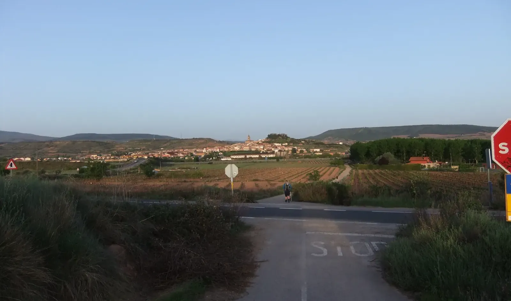
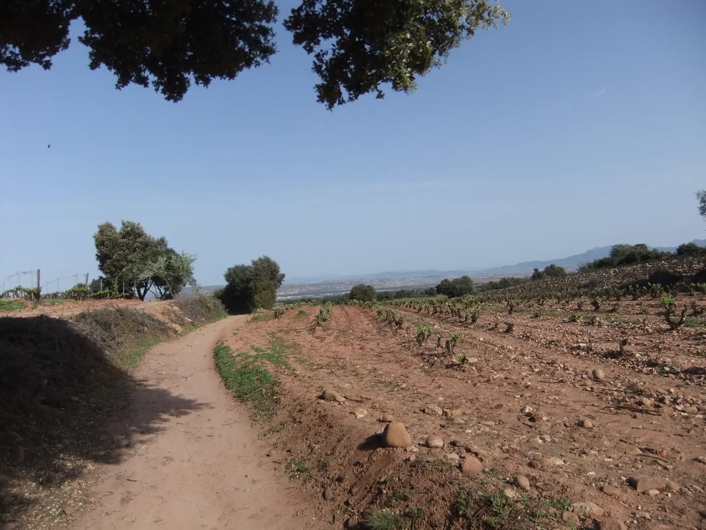
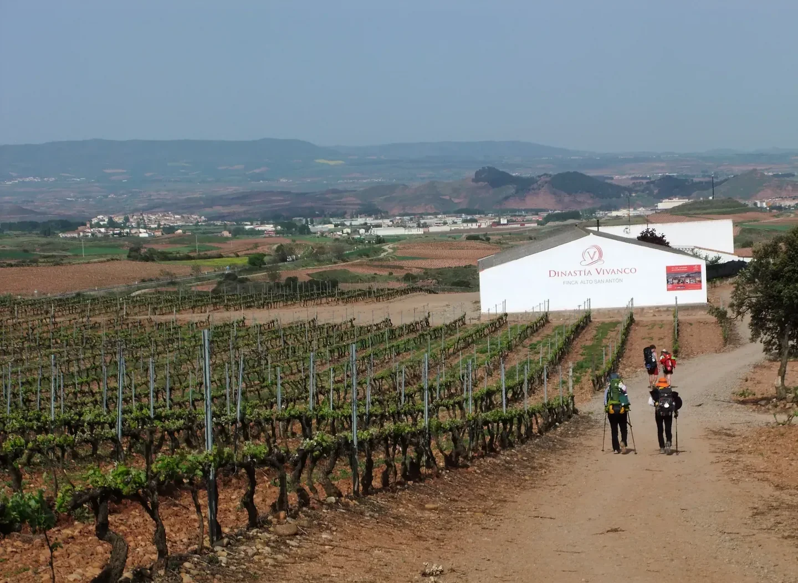
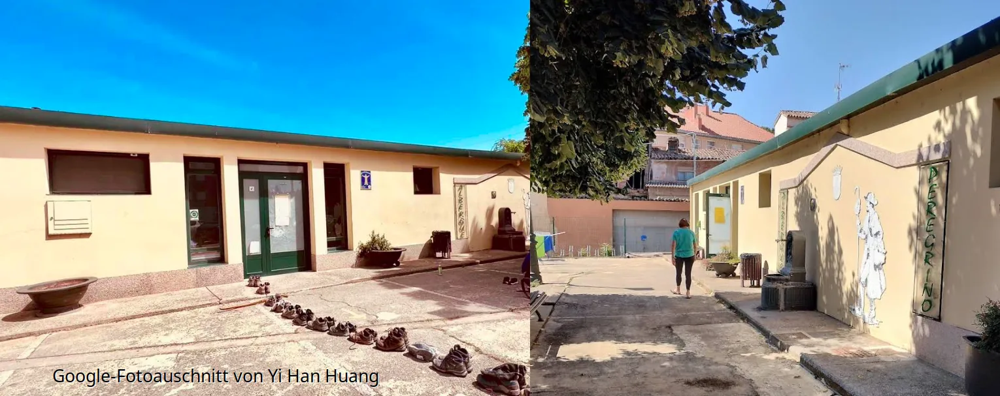
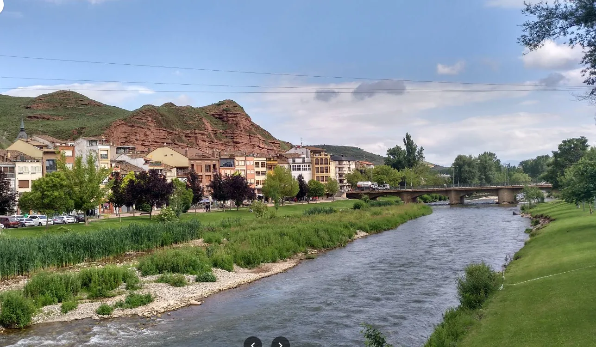

## Camino Francés  2012  

### Etapa-07: Logroño → Nájera ( 28,5 Km)
11 de Mai 2012

🇩🇪 In der Tat fließendes, klares, reines und kaltes Wasser!

### Nájera – Und ein wunderschöner Fluss

Diese kleine Stadt hat mir sehr gut gefallen, vor allem das fließende, klare, saubere und kalte Wasser des Flusses.

Ich habe mich den ganzen Weg über beeilt, und trotzdem waren schon unglaublich viele Pilger vor mir.

Das Postamt stand kurz vor dem Schließen. Da am nächsten Tag Samstag war, würde es geschlossen bleiben. Es musste also heute sein. Wenn ich den Druck auf meinem Rücken nicht verringerte, würde ich es nicht schaffen. Ich musste wirklich ein paar Kilo loswerden und nach  León (→ Santiago)  schicken.

Vor mir sah ich unzählige zurückgelassene Rucksäcke, die an der Wand aufgereiht waren. Es könnte also eine Weile dauern, bis ich an der Reihe wäre.

Als sich die Tür öffnete, erhob sich die Menge der Pilger, die nach der Methode von Knauf ihre Füße im kalten Wasser badeten. Ich sah sie, und noch bevor die zurückgelassenen Rucksäcke von ihren rechtmäßigen Besitzern wiedergefunden werden konnten, wartete ich nicht länger. Ich war der Zweite oder Dritte, der seinen Stempel bekam.

Da kam ein barfüßiger Pilger eilig über die Straße und sagte: „Ich war der Erste, der angekommen ist.“

Ich sagte, dass ich gerne mit ihm darüber diskutieren würde, aber in der Zwischenzeit würde die Post schließen.

Noch heute habe ich gemischte Gefühle hinsichtlich meines damaligen Verhaltens.

Und noch heute bleibt eine Frage ungeklärt: Kann ein zurückgelassener Rucksack seinen Besitzer ohne Vollmacht vertreten?

 Die Vollmacht  

Vielleicht befand sich in der Seitentasche des Rucksacks eine Vollmacht, verfasst in einer unverständlichen Rechtssprache, die niemand versteht – und wo findet man schon einen ehrlichen Anwalt, der offenbar Gefahr läuft, in einem Berg von Mandantenakten zu versinken, und der dennoch Zeit hat, so etwas in einer für den normalen Verbraucher verständlichen Sprache zu erklären?

An diesem Abend plagte mich mein schlechtes Gewissen nicht. Damals war einfach kein Raum für philosophische Auseinandersetzungen dieser Art. Nachdem mein Rucksack ein paar Kilo verloren hatte, badete ich meine Füße im Fluss, schloss die Augen und dachte an nichts.

---

🇵🇹  De facto, água corrente, límpida, pura e fria! 

#### Nájera – e um rio maravilhoso

Gostei muito desta pequena cidade, sobretudo da água corrente, límpida e fria do rio.

Apressei-me durante todo o caminho e, mesmo assim, já havia uma quantidade incrível de peregrinos à minha frente.

Os Correios estavam prestes a fechar. Como no dia seguinte seria sábado, estariam fechados; portanto, tinha de ser naquele dia. Se eu não aliviasse o peso nas minhas costas, não conseguiria continuar. Precisava mesmo de me livrar de alguns quilos e enviá-los para León (→ Santiago) .

À minha frente, vi inúmeros mochilas deixadas ali, enfileiradas junto à parede. Poderia demorar algum tempo até chegar a minha vez.

Quando a porta se abriu, a multidão de peregrinos que estava a banhar os pés na água fria, seguindo o método de Knauf, levantou-se. Eu vi aquilo e, antes mesmo que as mochilas abandonadas pudessem ser reencontradas pelos seus legítimos donos, não esperei mais. Fui o segundo ou terceiro a receber o carimbo.

Foi então que um peregrino descalço atravessou a rua apressadamente e disse: «Eu fui o primeiro a chegar.»

Disse-lhe que teria todo o gosto em discutir isso com ele, mas, entretanto, os Correios iriam fechar.

Ainda hoje tenho sentimentos contraditórios em relação ao meu comportamento naquela época.

E ainda hoje permanece uma questão sem resposta: poderá uma mochila abandonada representar o seu dono sem uma procuração?

 A procuração  

 ##### A procuração 

Talvez houvesse no bolso lateral da mochila uma procuração, redigida numa linguagem jurídica incompreensível que ninguém entende — e onde é que se encontra um advogado honesto, que aparentemente corre o risco de se afogar numa montanha de processos de clientes e que, mesmo assim, tenha tempo para explicar algo assim numa linguagem compreensível para o consumidor comum?

Naquela noite, a minha consciência não me incomodou. Naquele momento, simplesmente não havia espaço para discussões filosóficas desse género. Depois de a minha mochila ter perdido alguns quilos, mergulhei os pés no rio, fechei os olhos e não pensei em nada.

---

 🇪🇸 De hecho, agua corriente, cristalina, pura y fría! 

### Nájera –  Y un río maravilloso

Esta pequeña ciudad me gustó mucho, sobre todo el agua corriente, clara, limpia y fría del río.

Me apresuré durante todo el camino y, aun así, ya había una cantidad increíble de peregrinos delante de mí.

La oficina de correos estaba a punto de cerrar. Como al día siguiente era sábado, permanecería cerrada; así que tenía que ser ese mismo día. Si no aliviaba el peso de mi espalda, no lo conseguiría. Realmente necesitaba quitarme unos cuantos kilos de encima y enviarlos a  León (→ Santiago).

Delante de mí vi innumerables mochilas abandonadas, alineadas junto a la pared. Podía tardar un buen rato hasta que llegara mi turno.

Cuando se abrió la puerta, se levantó la multitud de peregrinos que estaba bañándose los pies en el agua fría, siguiendo el método de Knauf. Lo vi y, antes de que aquellas mochilas abandonadas pudieran ser reclamadas por sus legítimos dueños, no esperé más. Fui el segundo o tercero en recibir el sello.

Entonces, un peregrino descalzo cruzó apresuradamente la calle y dijo: «Yo fui el primero en llegar.»

Le dije que estaría encantado de discutirlo con él, pero mientras tanto la oficina de correos iba a cerrar.

Todavía hoy tengo sentimientos encontrados respecto a mi comportamiento de aquel entonces.

Y todavía hoy queda una pregunta sin resolver: ¿puede una mochila abandonada representar a su dueño sin un poder notarial?

El poder notarial   

 ##### El poder notarial

Quizá hubiera en el bolsillo lateral de la mochila un poder notarial, redactado en un lenguaje jurídico incomprensible que nadie entiende —¿y dónde se puede encontrar un abogado honesto que, aparentemente, corre el riesgo de ahogarse en una montaña de expedientes de clientes y que, aun así, tenga tiempo para explicar algo así en un lenguaje comprensible para el consumidor de a pie?

Aquella noche no me remordió la conciencia. En aquel momento, simplemente no había espacio para discusiones filosóficas de ese tipo. Después de que mi mochila perdiera unos cuantos kilos, metí los pies en el río, cerré los ojos y no pensé en nada.

---

🇬🇧 Indeed, running water – clear, pure and cold! 

#### Nájera – and a beautiful river

I really liked this little town, especially the flowing, clear, clean and cold water of the river.

I hurried the whole way, and yet there were already an incredible number of pilgrims ahead of me.

The post office was about to close. Since the next day was Saturday, it would remain closed, so it had to be done that day. If I didn’t lighten the weight on my back, I wouldn’t make it. I really needed to get rid of a few kilos and send them to León (→ Santiago) .

In front of me, I saw countless abandoned backpacks lined up along the wall. It might take quite a while before it was my turn.

When the door opened, the crowd of pilgrims who had been bathing their feet in the cold water, following the Knauf method, got up. I saw them and, before those abandoned backpacks could be reunited with their rightful owners, I didn’t wait any longer. I was the second or third person to get my stamp.

Then a barefoot pilgrim hurried across the street and said, “I was the first one to arrive.”

I told him I would be happy to discuss it with him, but in the meantime the post office was going to close.

Even today, I have mixed feelings about my behaviour back then.

And even today, one question remains unanswered: Can an abandoned backpack represent its owner without a power of attorney?

 The power of attorney  

 ##### The power of attorney

Perhaps there was a power of attorney in the side pocket of the rucksack, drafted in incomprehensible legal jargon that nobody understands — and where on earth can one find an honest solicitor who, seemingly at risk of drowning in a mountain of clients’ cases, still has the time to explain something like this in language that the average consumer can understand?

That evening, my conscience did not bother me. At the time, there simply wasn’t any room for philosophical discussions of that kind. After my backpack had lost a few kilos, I put my feet in the river, closed my eyes and thought of nothing.

---
---

 ChatGPT-Version 

####  🇩🇪  Nájera – ein Fluss, ein Rucksack und eine ungeklärte Rechtsfrage

**Nájera – und der wunderschöner Fluss**

Diese kleine Stadt hat mir sehr gut gefallen. Vor allem aber mochte ich den Fluss: klares, sauberes, kaltes Wasser, das einfach vor sich hinfloss – völlig unbeeindruckt von den Sorgen und Blasen der Pilger.

Ich hatte mich den ganzen Weg über beeilt und war trotzdem keineswegs der Erste. Im Gegenteil: Vor mir schien sich bereits eine halbe Pilgerwelt versammelt zu haben.

Das Postamt stand kurz vor dem Schließen. Und weil am nächsten Tag Samstag war, würde es geschlossen bleiben. Es musste also heute sein. Wenn ich den Druck auf meinem Rücken nicht endlich verringerte, würde ich den Camino nicht mehr schaffen. Ich musste ein paar Kilo loswerden – und zwar möglichst schnell.

Vor mir lagen beziehungsweise standen unzählige Rucksäcke, ordentlich an der Wand aufgereiht und offenbar auf der Suche nach ihren Besitzern. Das konnte dauern.

Als sich die Tür öffnete, erhob sich die Pilgermenge, die bis dahin nach der Methode Knauf ihre Füße im kalten Wasser gebadet hatte. Ich sah die Szene, erkannte meine Chance und wartete nicht lange. Noch bevor alle zurückgelassenen Rucksäcke wieder mit ihren rechtmäßigen Eigentümern vereint waren, hatte ich meinen Platz gefunden.

Ich war der Zweite oder Dritte, der seinen Stempel bekam.

Da kam ein barfüßiger Pilger eilig über die Straße und verkündete:  
„Ich war der Erste, der angekommen ist!“

Ich erklärte ihm, dass ich darüber durchaus gerne mit ihm diskutiert hätte. Aber leider hatte die Post andere Pläne: Sie wollte schließen.

Noch heute habe ich gemischte Gefühle, wenn ich an mein Verhalten von damals zurückdenke.

Und eine Frage ist bis heute ungeklärt: **Kann ein zurückgelassener Rucksack seinen Besitzer eigentlich rechtswirksam vertreten – auch ohne Vollmacht?**

An diesem Abend plagte mich mein schlechtes Gewissen jedenfalls nicht. Für philosophische Grundsatzfragen dieser Art war damals schlicht kein Platz.

Nachdem mein Rucksack ein paar Kilo leichter war, setzte ich mich an den Fluss, badete meine Füße im kalten Wasser, schloss die Augen – und dachte an nichts.

Vielleicht war das die eigentliche Lektion dieses Tages.

---

#### 🇵🇹 Nájera – um rio, uma mochila e uma questão jurídica por resolver

**Nájera – um rio maravilhoso**

Gostei muito desta pequena cidade. Mas, acima de tudo, gostei do rio: água corrente, límpida, limpa e fria, que seguia tranquilamente o seu caminho – completamente indiferente às preocupações e às bolhas dos peregrinos.

Apressei-me durante todo o caminho e, mesmo assim, estava longe de ser o primeiro. Pelo contrário: parecia que metade do mundo dos peregrinos já se tinha reunido à minha frente.

Os Correios estavam prestes a fechar. E, como no dia seguinte seria sábado, permaneceriam fechados. Tinha, portanto, de ser naquele dia. Se eu não aliviasse finalmente o peso nas costas, não conseguiria continuar o Caminho. Precisava de me livrar de alguns quilos – e rapidamente.

À minha frente havia inúmeras mochilas, alinhadas junto à parede, aparentemente à espera dos seus donos. Aquilo podia demorar.

Quando a porta se abriu, levantou-se a multidão de peregrinos que, até então, estava a banhar os pés na água fria, seguindo o método Knauf. Vi a cena, percebi a minha oportunidade e não esperei. Antes que todas aquelas mochilas abandonadas pudessem voltar para os seus legítimos proprietários, eu já tinha encontrado o meu lugar.

Fui o segundo ou terceiro a receber o carimbo.

Foi então que um peregrino descalço atravessou a rua apressadamente e anunciou:

«Eu fui o primeiro a chegar!»

Expliquei-lhe que teria todo o gosto em discutir a questão com ele. Mas os Correios tinham outros planos: queriam fechar.

Ainda hoje tenho sentimentos contraditórios quando penso no meu comportamento naquela altura.

E há uma questão que continua sem resposta: **poderá uma mochila abandonada representar legalmente o seu proprietário, mesmo sem uma procuração?**

Naquela noite, pelo menos, a minha consciência não me incomodou. Simplesmente não havia espaço para questões filosóficas tão profundas.

Depois de a minha mochila ter perdido alguns quilos, sentei-me junto ao rio, mergulhei os pés na água fria, fechei os olhos – e não pensei em nada.

Talvez essa tenha sido a verdadeira lição daquele dia.

---

#### 🇪🇸 Nájera – un río, una mochila y una cuestión jurídica sin resolver

**Nájera – un río maravilloso**

Esta pequeña ciudad me gustó mucho. Pero, sobre todo, me gustó el río: agua corriente, clara, limpia y fría, que seguía tranquilamente su curso, completamente indiferente a las preocupaciones y las ampollas de los peregrinos.

Me apresuré durante todo el camino y, aun así, estaba muy lejos de ser el primero. Al contrario: parecía que medio mundo de peregrinos se había reunido ya delante de mí.

La oficina de correos estaba a punto de cerrar. Y como al día siguiente era sábado, permanecería cerrada. Tenía que ser, por tanto, ese mismo día. Si no conseguía aliviar de una vez el peso de mi espalda, no iba a poder continuar el Camino. Necesitaba quitarme unos cuantos kilos de encima – y cuanto antes.

Delante de mí había innumerables mochilas, alineadas junto a la pared y, aparentemente, esperando a que aparecieran sus dueños. Aquello podía llevar un buen rato.

Cuando se abrió la puerta, se levantó la multitud de peregrinos que hasta entonces había estado bañándose los pies en el agua fría, siguiendo el método Knauf. Vi la escena, comprendí mi oportunidad y no esperé más. Antes de que aquellas mochilas abandonadas pudieran reunirse de nuevo con sus legítimos propietarios, yo ya había encontrado mi sitio.

Fui el segundo o tercero en recibir el sello.

Entonces, un peregrino descalzo cruzó rápidamente la calle y anunció:

«¡Yo fui el primero en llegar!»

Le expliqué que estaría encantado de discutir la cuestión con él. Pero la oficina de correos tenía otros planes: iba a cerrar.

Todavía hoy tengo sentimientos encontrados cuando recuerdo mi comportamiento de entonces.

Y hay una pregunta que sigue sin respuesta: **¿puede una mochila abandonada representar legalmente a su propietario sin un poder notarial?**

Aquella noche, al menos, mi conciencia no me molestó. Sencillamente, no había lugar para cuestiones filosóficas tan profundas.

Después de que mi mochila hubiera perdido unos cuantos kilos, me senté junto al río, metí los pies en el agua fría, cerré los ojos – y no pensé en nada.

Quizá esa fue la verdadera lección de aquel día.

---

#### 🇬🇧 Nájera – a river, a backpack, and an unresolved legal question

**Nájera – a beautiful river**

I really liked this little town. But above all, I liked the river: clear, clean, cold running water, quietly making its way downstream – completely indifferent to the worries and blisters of the pilgrims.

I had hurried all the way and was still nowhere near being the first. Quite the opposite: it seemed as if half the pilgrim world had already gathered ahead of me.

The post office was about to close. And since the next day was Saturday, it would remain closed. So it had to be done that day. If I didn’t finally reduce the weight on my back, I wasn’t going to make it along the Camino. I needed to get rid of a few kilos – and preferably as quickly as possible.

In front of me stood countless backpacks, neatly lined up against the wall, apparently waiting to be reunited with their owners. This could take a while.

When the door opened, the crowd of pilgrims who had been bathing their feet in the cold water, following the Knauf method, got to its feet. I saw the scene, recognised my opportunity and didn’t hesitate. Before all those abandoned backpacks could be reunited with their rightful owners, I had already found my place.

I was the second or third person to get my stamp.

Then a barefoot pilgrim hurried across the street and announced:

“I was the first one to arrive!”

I told him I would be more than happy to discuss the matter with him. Unfortunately, the post office had other plans: it was about to close.

Even today, I have mixed feelings when I think back to my behaviour that day.

And one question remains unresolved: **Can an abandoned backpack legally represent its owner without a power of attorney?**

That evening, at least, my conscience didn’t bother me. There simply wasn’t any room for philosophical questions of such depth.

After my backpack had lost a few kilos, I sat down by the river, put my feet in the cold water, closed my eyes – and thought of nothing.

Perhaps that was the real lesson of the day.

---

  

🇬🇧
🇪🇸
🇵🇹
🇩🇪

---

**↪** [Etapa-08_Najera_Santo-Domingo-de-la-Calzada](Etapa-08_Najera_Santo-Domingo-de-la-Calzada.md)

 🔁 [Camino-Frances_Etapas](Camino-Frances_Etapas.md)

 ...→