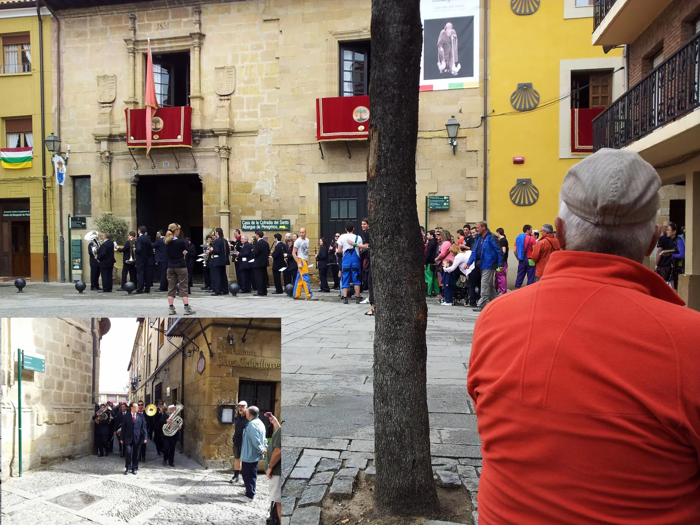
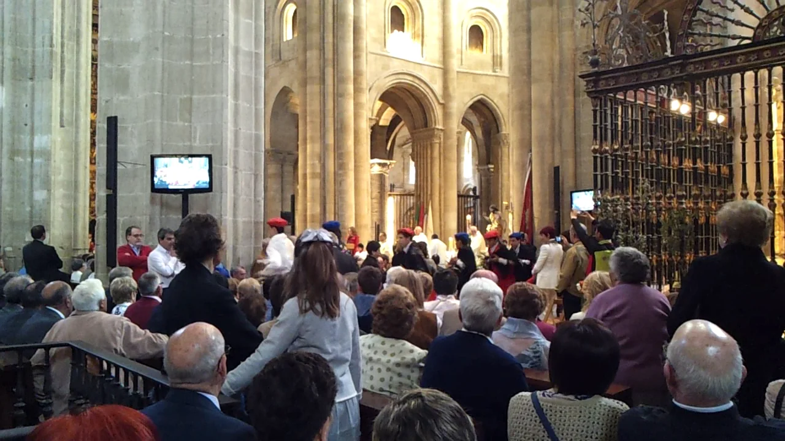

## Camino Francés  2012  

### Etapa-08: Nájera → Santo Domingo de la Calzada ( 20,7 Km)
12 de Mai 2012

---

🇩🇪 Der Pilger-Palast 

#### Der Pilger-Palast  

> „Auf dem Camino Francés gehört eine Übernachtung im Pilger-Palast von Santo Domingo de la Calzada fast schon zum Pflichtprogramm. Ich habe dort geschlafen und war von diesem Ort wirklich restlos begeistert. Wenn man die Tage zuvor in schlichten Pilgerherbergen verbracht hat, zögert man anfangs sogar, sich mit seinen verstaubten Klamotten in die wunderschönen Aufenthaltsräume zu setzen. Erst nach dem Duschen habe ich mich in die bequemen Sessel sinken lassen, die besondere Atmosphäre dieses historischen Gebäudes eingeatmet und die nächste Etappe geplant.

> Dann kam die Nacht. Wie es eben manchmal so ist, haben einige Pilger die Angewohnheit, mitten im Schlaf zu ‚musizieren‘. Wenn das mehrere gleichzeitig tun, erinnert die Philharmonie eher an eine Rockerbande mit Motorsägen. Was macht man also, wenn diese Klänge absolut nicht den eigenen Musikgeschmack treffen und einen erst recht nicht schlafen lassen? Ich dachte sofort an die schönen Aufenthaltsräume. Als ich dort ankam, musste ich jedoch feststellen, dass ich zu spät geschaltet hatte – andere waren schneller gewesen. So blieb mir nichts anderes übrig, als diesem kostenlosen Konzert bis zum Morgen beizuwohnen.“

 Ruhe  

####  Der Kontrast: Ruhe in Itero de la Vega  

> „Oft denke ich in diesem Zusammenhang an meinen Aufenthalt in Itero de la Vega. Dort war es genau umgekehrt: Das Gebäude war recht kühl, die sanitären Anlagen waren sehr spartanisch und es gab nur Gemeinschaftsbäder. Da alle anderen Pilger in den bekannteren Herbergen des Ortes untergekommen waren, hatte ich die Unterkunft ganz für mich allein. In dieser absoluten Stille und Abgeschiedenheit habe ich einfach wunderbar geschlafen.

> Manchmal fragt man sich, ob man zwei so unterschiedliche Orte überhaupt miteinander vergleichen kann. Aber genau das ist der Camino: Im prachtvollen Pilger-Palast von Santo Domingo bekommt man wegen eines unfreiwilligen ‚Konzerts‘ kein Auge zu, während man in einer spartanischen, einsamen Herberge in Itero de la Vega den tiefsten und friedlichsten Schlaf der ganzen Reise findet.“

---

🇪🇸  El Palacio del Peregrino 

#### El Palacio del Peregrino  

> „En el Camino Francés, pasar una noche en el Palacio del Peregrino de Santo Domingo de la Calzada es casi una parada obligatoria. Yo me alojé allí y quedé verdaderamente encantado con el lugar. Cuando uno viene de pasar los días anteriores en albergues muy sencillos, al principio te da hasta reparo sentarte en esos hermosos salones con la ropa llena de polvo. Solo después de ducharme me acomodé en los confortables sillones, respiré la atmósfera del histórico edificio y planifiqué la siguiente etapa.

> Pero luego llegó la noche. Como suele ocurrir a veces, algunos peregrinos tienen la costumbre de ‚hacer música‘ en pleno sueño. Y cuando son varios los que lo hacen a la vez, la filarmónica se parece más a una banda de rock armando jaleo con motosierras. ¿Qué se hace entonces cuando esos sonidos no coinciden precisamente con nuestros gustos musicales y, sobre todo, no nos dejan dormir? Pensé en los hermosos salones, pero al llegar me di cuenta de que había reaccionado demasiado tarde: otros habían sido más rápidos. Así que no me quedó más remedio que resignarme y asistir a aquel concierto gratuito.“

Paz

#### El contraste: Paz en Itero de la Vega  
> „A menudo pienso en este contexto en mi estancia en Itero de la Vega. Allí fue todo lo contrario: hacía bastante fresco, las instalaciones eran muy espartanas y solo había baños compartidos. Como todos los demás peregrinos se habían quedado en los albergues más conocidos del pueblo, tuve el lugar entero para mí solo. En medio de ese silencio absoluto y esa tranquilidad, dormí de maravilla.

> A veces uno se pregunta si se pueden comparar dos lugares tan diferentes. Pero el Camino es precisamente eso: en el magnífico Palacio del Peregrino de Santo Domingo no puedes pegar ojo por culpa de un ‚concierto‘ involuntario, mientras que en un albergue sencillo y solitario en Itero de la Vega encuentras el sueño más profundo y pacífico de todo el viaje.“

---

 🇬🇧 The Pilgrim Palace 

#### The Pilgrim Palace  

> "On the Camino Francés, staying overnight at the Pilgrim Palace in Santo Domingo de la Calzada is pretty much a must. I stayed there myself and was absolutely thrilled by the place. When you’ve spent the previous days in simple pilgrim hostels, you initially hesitate to even sit down in those beautiful lounges with your dusty clothes. Only after showering did I sink into the comfortable armchairs, take in the atmosphere of the historic building, and plan the next stage of my journey.

> Then came the night. As it sometimes happens, some pilgrims have a habit of making 'music' in the middle of their sleep. When several of them do it at the same time, the philharmonic orchestra sounds more like a biker gang with chainsaws. What do you do when these sounds don't exactly match your musical taste and certainly won't let you sleep? I thought of the beautiful lounges, but when I got there, I realized I had thought of it too late—others had been faster. So, I had no choice but to sit through that free concert."

Peace 

#### The Contrast: Peace in Itero de la Vega  
> "In this context, I often think back to my stay in Itero de la Vega. It was the exact opposite experience: the building was quite chilly, the facilities were very spartan, and there were only communal bathrooms. Since all the other pilgrims had chosen to stay in the town's more popular hostels, I had the entire place to myself. In that absolute silence and solitude, I slept wonderfully.

> Sometimes you wonder if you can even compare two such vastly different places. But that is exactly what the Camino is all about: in the magnificent Pilgrim Palace of Santo Domingo, you can’t catch a wink of sleep because of an involuntary 'concert,' while in a spartan, lonely hostel in Itero de la Vega, you find the deepest and most peaceful sleep of the entire journey."

---

🇵🇹  O Palácio do Peregrino  

#### O Palácio do Peregrino  

> „No Camino Francés, pernoitar no Palácio do Peregrino de Santo Domingo de la Calzada é quase obrigatório. Eu fiquei lá hospedado e fiquei verdadeiramente encantado com o lugar. Quando passamos os dias anteriores em albergues de peregrinos muito simples, ao início hesitamos até em sentarmo-nos naquelas belas salas de estar com as roupas cheias de pó. Só depois de tomar banho é que me acomodei nas poltronas confortáveis, respirei a atmosfera do edifício histórico e planeei a etapa seguinte.
> 
> Depois veio a noite. Como às vezes acontece, alguns peregrinos têm o hábito de ‚fazer música‘ a meio do sono. E quando vários o fazem ao mesmo tempo, a filarmónica assemelha-se mais a um bando de motoqueiros com motosserras. O que fazer quando estes sons não coincidem propriamente com o nosso gosto musical e, muito menos, nos deixam dormir? Pensei nas belas salas de estar, mas quando lá cheguei percebi que tinha pensado nisso tarde demais – outros tinham sido mais rápidos. Assim, não me restou outra alternativa senão assistir a esse concerto gratuito.“

 Paz  

#### O Contraste: Paz em Itero de la Vega

> „Neste contexto, penso frequentemente na minha estadia em Itero de la Vega. Lá foi exatamente o oposto: estava bastante fresco, as instalações eram muito espartanas e apenas havia casas de banho partilhadas. Como todos os outros peregrinos tinham ficado nos albergues mais conhecidos da aldeia, tive o espaço inteiro só para mim. No meio daquele silêncio absoluto e daquela tranquilidade, dormi maravilhosamente.

> Às vezes perguntamo-nos se podemos comparar dois lugares tão diferentes. Mas o Caminho é precisamente isso: no magnífico Palácio do Peregrino de Santo Domingo não conseguimos pregar olho por causa de um ‚concerto‘ involuntário, enquanto num albergue simples e solitário em Itero de la Vega encontramos o sono mais profundo e pacífico de toda a viagem.“

---

 🇩🇪 "Santo Domingo de la Calzada" vs "Barcelos" 

#### "Santo Domingo de la Calzada" vs "Barcelos"

>„Im Jahr 2012 habe ich während meiner Pilgerreise auf dem Camino Francés die Messe in der Kathedrale von Santo Domingo de la Calzada besucht, wo der Hahn in seinem Käfig an der Wand lebt. Man erlebt ihn dort sozusagen live während des Sonntagsgottesdienstes. Bei dieser Gelegenheit habe ich die Legende vom Hühnerwunder nach mehreren Jahrzehnten zum ersten Mal wieder gehört.

 >Im Jahr 2019 war ich dann zum ersten Mal in Barcelos, als ich von Ávila nach Santiago de Compostela und von dort weiter nach Fátima gelaufen bin.  Der berühmte Keramikhahn in den portugiesischen –*Nationalfarben Rot und Grün*– ist überall im Stadtbild präsent und wenn ich den Barcelos Hahn sehe, ist diese Geschichte immer in Hinterkopf.  

**Nach diesen Reisen frage ich mich, ob es wohl nur in diesen beiden Städten so war, dass der Hahn vor dem Richter floh, weil jemandem Unrecht widerfahren war.**

>Soweit ich weiß, konnten wir Pilger unseren Weg fortsetzen, ohne einen Richter stören zu müssen, während er sein Hähnchen genoss.   

---

 Die Unterschiede im Detail  

#### 🔍Die Unterschiede im Detail

- Der Auslöser: In Santo Domingo wird der junge Pilger (oft _Hugonell_ genannt) Opfer einer Intrige: Die Wirtstochter versteckt aus Rache für seine Zurückweisung einen Silberbecher in seiner Tasche. In Barcelos wird ein galicischer Pilger einfach deshalb verdächtigt, weil in der Stadt ein Verbrechen geschah und er ein Fremder war.
- Das Timing des Wunders: In Spanien wird der Junge zuerst gehängt, überlebt aber am Galgen, weil der heilige Dominikus (oder Jakobus) ihn stützt. Als die Eltern den Richter informieren, sagt dieser spöttisch: _„Euer Sohn ist so lebendig wie diese gebratenen Hühner auf meinem Teller“_. 

- In Portugal prophezeit der Pilger vor der Vollstreckung beim Richter am Esstisch: _„Wenn ich unschuldig bin, wird dieser Hahn krähen!“_. Als der Strick am Galgen angezogen wird, steht der Hahn auf und kräht. 
- Die Anzahl der Vögel: In Santo Domingo erwachen ein Hahn und eine Henne (daher das Hühnerpaar in der Kirche). In Barcelos ist es nur ein Hahn. 

#### 📖 Die Geschichte (Kurzfassung)

> „Ein unschuldiger Pilger auf dem Jakobsweg wird fälschlicherweise des Diebstahls beschuldigt und zum Tode durch den Galgen verurteilt. Am Tag der Hinrichtung bittet er darum, den Richter noch ein letztes Mal sprechen zu dürfen. 
> Der Richter sitzt gerade bei Tisch vor einem gebratenen Hahn. Als der Richter dem Pilger nicht glaubt, erklärt dieser, dass seine Unschuld dadurch bewiesen werde, dass der zubereitete Hahn vom Teller aufsteht und kräht. Genau im Moment der Vollstreckung geschieht das Wunder: Das gebratene Federvieh erwacht zum Leben, stellt sich auf und kräht lautstark. 
> **Der Pilger wird gerettet und zieht unversehrt weiter.“** 

---

 🇪🇸 "Santo Domingo de la Calzada" vs "Barcelos" 

####  "Santo Domingo de la Calzada" vs "Barcelos"

> „En 2012, mientras hacía el Camino Francés, asistí a misa en la catedral de Santo Domingo de la Calzada, donde el gallo vive en su jaula. Se puede decir que se vive la presencia del gallo en pleno domingo de misa. Fue allí donde volví a escuchar la leyenda del milagro del gallo después de varias décadas.

> En 2019 estuve por primera vez en Barcelos, durante mi peregrinación desde Ávila a Santiago y luego de Santiago a Fátima. El famoso gallo de cerámica con sus colores rojo y verde de Portugal está omnipresente en toda la ciudad y cada vez que veo el gallo de Barcelos, me viene a la mente esta historia.

**Tras estos viajes, me pregunto si será que solo en estas dos ciudades el gallo se escapó del juez porque alguien sufrió una injusticia.**

> Por lo que sé, nosotros, los peregrinos, pudimos continuar nuestro camino sin tener que molestar a un juez mientras este saboreaba su pollo.  

Diferencias en detalle 

####  🔍 Diferencias en detalle

- El motivo: En Santo Domingo, el joven peregrino es víctima de un despecho amoroso; la hija del posadero esconde una copa de plata en su equipaje porque él la rechazó. En Barcelos, el peregrino gallego es arrestado simplemente por ser un forastero en una ciudad donde se había cometido un crimen. 
- El momento del milagro: En España, el joven ya ha sido colgado en la horca, pero sobrevive porque Santo Domingo lo sostiene. Cuando los padres avisan al corregidor, este se burla diciendo: _«Su hijo está tan vivo como este gallo y esta gallina asados que me voy a comer»_. En Portugal, el milagro ocurre justo antes de la ejecución: el peregrino le dice al juez en su mesa que el gallo cantará si es inocente, y las aves reaccionan cuando la soga se aprieta. 
- El número de aves: En Santo Domingo resucitan un gallo y una gallina (por eso hay una pareja viva en la catedral). En Barcelos, es solo un gallo. 

#### 📖 La historia (Resumen)

> «Un peregrino inocente que viaja a Santiago de Compostela es acusado injustamente de robo y condenado a la horca. Antes de cumplirse la sentencia, pide ver al juez, quien se encuentra comiendo un gallo asado. Ante la incredulidad del magistrado, el condenado afirma que, como prueba de su inocencia, el ave cocinada se levantará del plato y cantará. Justo en el momento de la ejecución, el milagro ocurre: el gallo asado cobra vida, se pone en pie y cacarea con fuerza. El peregrino es salvado y puede continuar su camino sano y salvo.» 

---

🇬🇧 "Santo Domingo de la Calzada" vs "Barcelos" 

#### "Santo Domingo de la Calzada" vs "Barcelos"

> "In 2012, while walking the Camino Francés, I attended Mass at the cathedral in Santo Domingo de la Calzada, where the rooster is kept in a cage on the wall. You get to experience the rooster, so to speak, right during the Sunday service. That was where I heard the legend of the rooster again after several decades.
 
> I visited Barcelos for the first time in 2019, when I walked from Ávila to Santiago and then from Santiago onward to Fátima. The ceramic rooster with its Portuguese red and green colors is highly visible all over the city.  Every time I see the Barcelos rooster, this story springs to mind.

**After these journeys, I wonder whether it is only in these two cities that the cockerel fled from the judge because someone had suffered an injustice.**

>As far as I know, we pilgrims were able to continue on our way without having to disturb a judge whilst he was enjoying his chicken.   

---

 Differences in Detail 

####  🔍 Differences in Detail

- The Cause: In Santo Domingo, the young pilgrim is framed by an innkeeper's daughter who hides a silver cup in his bag after he rejects her advances. In Barcelos, a Galician pilgrim is arrested purely because a crime occurred in the town and he is a suspicious stranger.
- The Timing: In Spain, the boy is already hanged but survives on the gallows because Saint Dominic holds him up. When the parents tell the magistrate, he scoffs: _“Your son is as alive as these roasted birds on my plate”_. In Portugal, the pilgrim makes a prophecy before execution at the judge's dinner table: _“If I am innocent, this rooster will crow!”_. As the rope tightens, the rooster stands up and crows.
- The Number of Birds: In Santo Domingo, a rooster and a hen both revive (hence the live pair in the cathedral). In Barcelos, it is only a single rooster.

#### 📖 The Story (Short Version)

> "An innocent pilgrim on his way to Santiago is falsely accused of theft and sentenced to hang. On the day of his execution, he begs for a final audience with the judge, who is about to eat a roasted rooster. When the judge disbelieves his innocence, the pilgrim declares that the cooked bird will rise from the plate and crow to prove the truth. At the exact moment of the execution, the miracle occurs: the roasted poultry comes back to life, stands up, and crows loudly. The pilgrim is saved and allowed to continue his journey unharmed." 

---

🇵🇹 "Santo Domingo de la Calzada" vs "Barcelos"   

#### "Santo Domingo de la Calzada" vs "Barcelos"

> „Em 2012, enquanto fazia o Camino Francés, assisti à missa na catedral de Santo Domingo de la Calzada, onde o galo fica na sua gaiola. Pode-se dizer que vivemos a presença do galo em pleno culto de domingo. Foi ali que voltei a ouvir a lenda do milagre do galo após várias décadas.

> Em 2019 estive pela primeira vez em Barcelos, quando caminhei de Ávila até Santiago e, depois, de Santiago para Fátima. O famoso galo de cerâmica com as cores verde e vermelha de Portugal está omnipresente por toda a cidade. 
> Sempre que vejo o galo de Barcelos, lembro-me desta história.

**Depois destas viagens, pergunto-me se será que só nestas duas cidades é que o galo fugiu do juiz porque alguém sofreu uma injustiça.**

> Tanto quanto sei, nós, peregrinos, pudemos continuar o nosso caminho sem ter de incomodar um juiz enquanto ele saboreava o seu frango.     

---

 Diferenças em detalhe  

####  🔍 Diferenças em detalhe

- O Motivo: Em Santo Domingo, o jovem peregrino é vítima de uma armadilha amorosa; a filha do estalajadeiro esconde uma taça de prata na sua mala porque ele a rejeitou. Em Barcelos, o peregrino galego é preso simplesmente por ser um estranho na cidade onde tinha ocorrido um crime.
- O Momento do Milagre: Em Espanha, o jovem já foi enforcado, mas sobrevive na corda porque São Domingos o segura. Quando os pais avisam o juiz, este diz com desdém: _“O vosso filho está tão vivo como este galo e esta galinha assados no meu prato”_. Em Portugal, o milagre acontece antes da execução: o peregrino avisa o juiz à mesa que o galo cantará se for inocente, e o animal levanta-se quando a corda se aperta.
- O Número de Aves: Em Santo Domingo ressuscitam um galo e uma galinha (razão pela qual há um casal vivo na catedral). Em Barcelos, é apenas um galo.

#### 📖 A História (Resumo)

> „Um peregrino inocente a caminho de Santiago de Compostela é injustamente acusado de roubo e condenado à forca. Antes do cumprimento da sentença, pede para ver o juiz, que se encontra a comer um galo assado. Diante da incredulidade do magistrado, o condenado afirma que, como prova da sua inocência, a ave cozinhada se levantará do prato e cantará. No momento exato da execução, o milagre acontece: o galo assado ganha vida, põe-se de pé e canta ruidosamente. 
> **O peregrino é salvo e pode continuar o seu caminho são e salvo.“** 

---

  

- 🇬🇧 –*National colours: red and green*–
How deeply that first memory of the Galo de Barcelos has been etched into my mind.
- 🇪🇸 –*Colores nacionales: rojo y verde*–
Cómo se me quedó profundamente grabada en la mente esta primera recuerdo del Galo de Barcelos.
- 🇵🇹 –*Cores nacionais: vermelho e verde*–
Como esta primeira memória do Galo de Barcelos ficou profundamente gravada na minha mente.
- 🇩🇪 –*Nationalfarben: Rot und Grün*–
Wie sehr hat sich diese erste Erinnerung an den Galo de Barcelos doch tief in mein Gedächtnis eingegraben.

---

**↪** [Etapa-09_Santo-Domingo-de-la-Calzada_Tosantos](Etapa-09_Santo-Domingo-de-la-Calzada_Tosantos.md)

 🔁 [Camino-Frances_Etapas](Camino-Frances_Etapas.md)

 ...→