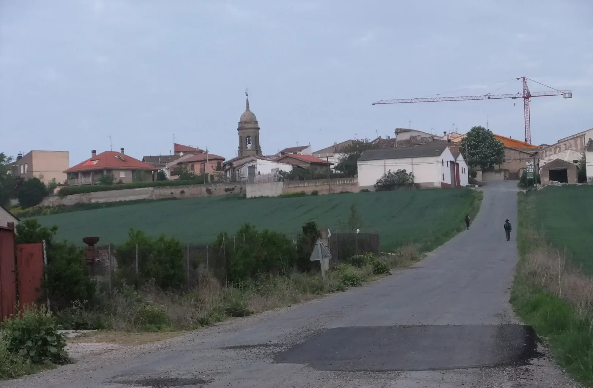
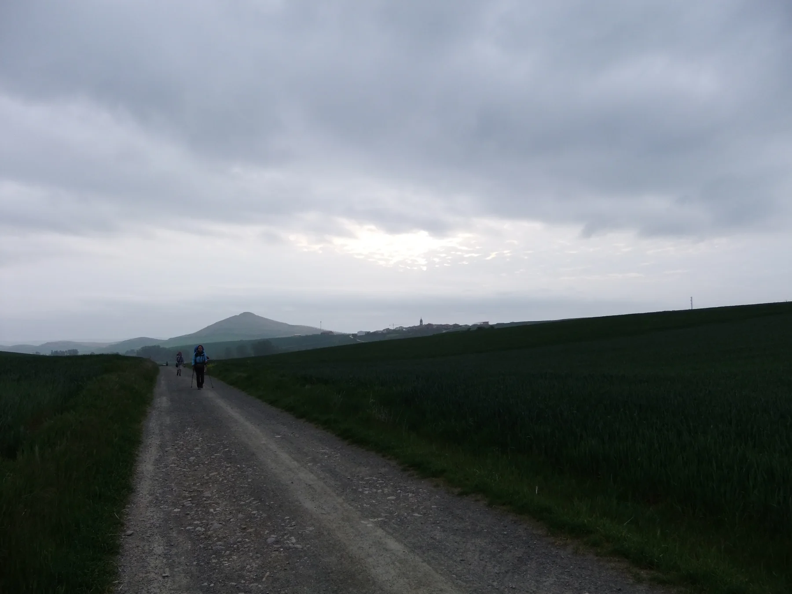
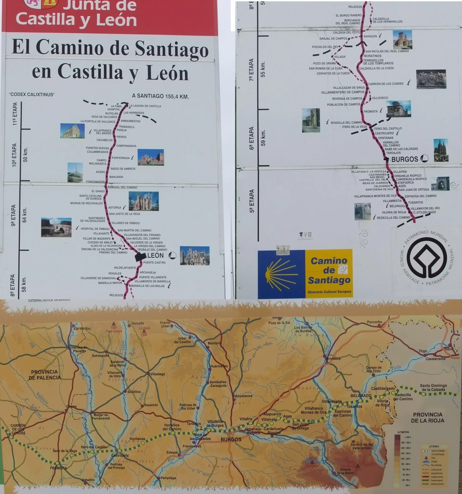
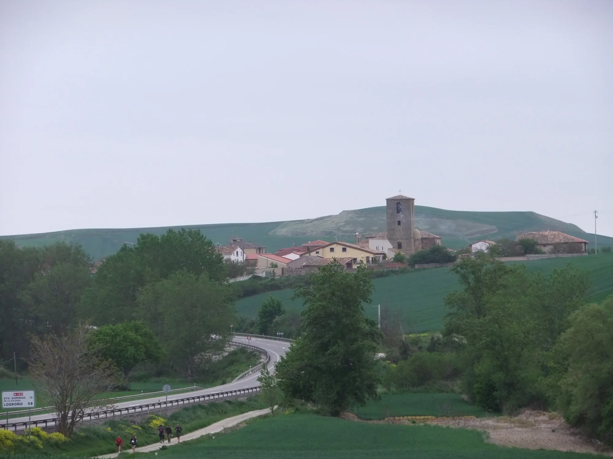
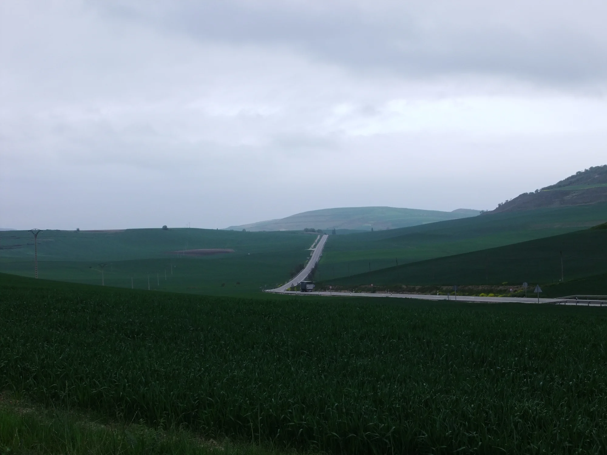
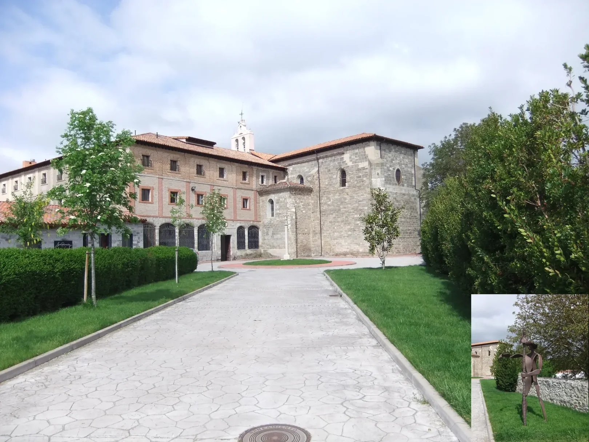
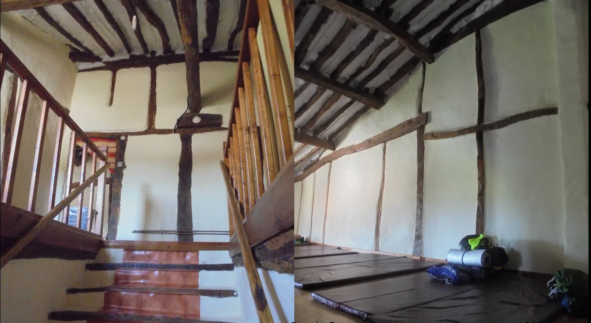
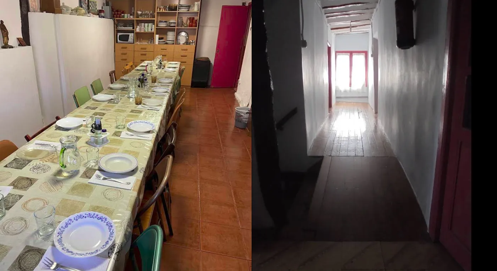

## Camino Francés  2012  

### Etapa-09: Santo Domingo de la Calzada → Tosantos ( 26,8 Km)
13 de Mai 2012

---

 🇩🇪  José Luis Antón – er gibt dem Weg Leben 

#### Die Lektion von Tosantos: Freiheit statt Etappenplan

> José Luis Antón steht seit rund 25 Jahren als Hospitalero an der Spitze der _Albergue Parroquial San Francisco de Asís_ in Tosantos. Im Jahr 2012 bekam er Unterstützung von einem italienischen Hospitalero, dessen Namen ich leider nicht mehr weiß.

> Als ich in Tosantos ankam, setzte ich mich auf die Bank vor der Herberge, ohne die Absicht zu haben, meine Tagesetappe dort schon zu beenden. Eine Weile verging, und während ich einfach nur dasaß, kamen viele Pilger vorbei und fragten, ob schon geöffnet sei. Ich verneinte und erklärte, dass es noch zu früh sei und ich mich nur ausruhe. So sah ich einen Pilger nach dem anderen an mir vorbeiziehen. Als schließlich jemand die Tür öffnete und ankündigte, gleich aufzumachen, erwiderte ich, dass ich gleich weitergehen würde – schließlich hatte ich mir vorgenommen, jeden Tag eisern 30 Kilometer zu schaffen. Er hielt die Tür offen und sagte: „Komm erst mal rein. Du sitzt schon eine Weile hier, und das hat einen Grund.“

> Also ging ich hinein. Er schloss die Tür, wir setzten uns, und er sagte sinngemäß: „Etwas hat dich hier aufgehalten, und es war nicht deine 30-Kilometer-Planung, sonst wärst du schon längst weitergelaufen.“ Dann gab er mir folgenden Rat: „Lasst euch die Etappen nicht von einem Pilgerführer, von scheinbar idealen Tageskilometern oder von einer starren Planung diktieren. Jeder Tag ist anders, jede Etappe ist anders. Wenn du das Gefühl hast, heute nur 20 Kilometer laufen zu können, dann lauf nur 20. Wenn du meinst, du schaffst 40 Kilometer, dann lauf die 40, aber halte dich nicht an starre Vorgaben. Hab keine Angst, keinen Schlafplatz zu finden – irgendjemand wird dem Pilger immer eine Tür öffnen und ihm eine Ecke zum Schlafen anbieten.“

> Diesen Ratschlag habe ich danach meistens befolgt, und seitdem ist ein großer Druck von mir abgefallen. Ganz gleich, ob ich danach sehr entspannte Etappen genoss oder extrem harte, lange Strecken bewältigte – ich habe mich auf dem Weg immer wohl und frei gefühlt.

> **Allerdings haben sich einige Dinge gravierend verändert, seit die Hospitaleros ihre ersten Pilgerreisen unternommen haben.** Die Gründe für das Pilgern sind heute so vielfältig wie die Herkunft der Menschen selbst. Die daraus resultierende Masse an internationalen Pilgern sowie deren Ansprüche an die Unterkunft – gepaart mit der Erwartung, dass eine ältere Dame im Dorf, die ihr Haus gegen eine kleine Spende öffnet, bitteschön alle Sprachen der Welt beherrschen soll – machen es den Menschen vor Ort immer schwerer, den modernen Pilgern gerecht zu werden. Verstärkt wird diese Entwicklung, besonders in Spanien, durch das zunehmende Sterben der Dörfer, wodurch auch spontane, freiwillige Hospitaleros fehlen.

> Da ich Deutsch und ein paar Brocken Englisch spreche – genug, um Pilgern Betten zuzuweisen oder einfache Fragen zu übersetzen –, betätigte ich mich an diesem Nachmittag als Dolmetscher und half den Hospitaleros. Als ich danach in der Küche mit anpacken wollte, bremste mich Luis und sagte, ich solle mich nun um meine eigenen Sachen kümmern, um später das Abendessen genießen zu können. Stattdessen bat er mich, ein paar Jugendliche der Generation Z oder X (ich bin kein Experte für Generationen-Klassifizierungen) hereinzurufen. Sie genossen draußen gerade die kühle Abendluft und berichteten der Welt via Social Media von diesem wunderbaren Ort. Er wollte wissen, ob sie bei der Zubereitung des gemeinsamen Mahls mithelfen würden.

> Der Moment, als ich die Küche betrat, ist mir noch so lebendig vor Augen, als wäre es gestern gewesen: Ich sehe die koreanischen Pilger, die tatkräftig Salat und Gemüse putzen, den italienischen Hospitalero, der sich um die Pasta kümmert, und Luis, der immer wieder nachfragt, ob jemand etwas braucht. 
> 
> Als dann die Zeit für das Abendessen kam und ich den Speisesaal betrat, traute ich meinen Augen nicht: Wo zum Teufel kamen all die Pilger her? Wo gab es hier bitteschön so viele Schlafplätze? Ich dachte es mir nur, sagte aber lieber nichts, um die schöne Stimmung nicht zu stören.

> Da ich mich vorher nicht über diese Herberge informiert hatte, wusste ich nicht, was uns nach dem Essen erwartete: Jeder Pilger sollte ein Lied in seiner Muttersprache singen! Da packte mich ein wenig die Panik. Obwohl uns Padre Albano, in der 5. Klasse das „Do-Re-Mi-Fa-So-La-Si-Do“ beigebracht hatte, reichten diese wenigen Musikstunden nicht aus, um aus mir einen Gesangskünstler zu machen. Luis bemerkte mein Unbehagen. Da er wusste, dass unter den Gästen ein Brasilianer war – und die sind künstlerisch meist begabter als wir Portugiesen –, bat Luis ihn, den portugiesischsprachigen „Chor“ zu bilden. Den inoffiziellen Gesangswettbewerb gewann allerdings eine große Gruppe niederländischer Pilger, die etwas später mit ihren Fahrrädern angekommen waren; sie hatten einfach die stärkste Präsenz. Der brasilianische Pilger, den ich mangels Talent nicht unterstützen konnte, hätte wohl wuchtige Musikboxen gebraucht, um gegen diese Übermacht anzukommen; allein hatte er keine Chance.

> An alles Weitere kann ich mich nicht mehr erinnern. Ich habe wunderbar geschlafen, aber diese Ratschläge begleiten mich bis heute und sind zum Motto meines Pilgerlebens geworden.

---

🇪🇸  José Luis Antón, él da vida al camino  

#### La lección de Tosantos: Libertad en lugar de un plan rígido

> José Luis Antón lleva unos 25 años al frente del _Albergue Parroquial San Francisco de Asís_ en Tosantos como hospitalero. En 2012, recibió la ayuda de un hospitalero italiano cuyo nombre lamentablemente ya no recuerdo.

> Cuando llegué a Tosantos, me senté en el banco frente al albergue sin ninguna intención de terminar allí mi etapa del día. Pasó un rato y yo seguía sentado; muchos peregrinos pasaban y preguntaban si ya estaba abierto. Yo les decía que no, que aún era pronto y que solo estaba descansando. Así vi pasar a un peregrino tras otro. Cuando finalmente alguien abrió la puerta y anunció que abriría enseguida, le respondí que yo continuaría mi camino de inmediato, ya que me había propuesto firmemente hacer 30 kilómetros al día. Él mantuvo la puerta abierta y me dijo: "Entra primero. Llevas un rato aquí sentado, y eso es por algo".

> Así que entré. Cerró la puerta, nos sentamos y me dijo, en esencia: "Algo te ha detenido aquí, y no ha sido tu planificación de 30 kilómetros, de lo contrario ya te habrías ido hace mucho tiempo". Luego me dio el siguiente consejo: "No dejes que las etapas te las dicte una guía del peregrino, ni los kilómetros diarios supuestamente ideales, ni una planificación rígida. Cada día es diferente, cada etapa es diferente. Si sientes que hoy solo puedes caminar 20 kilómetros, camina solo 20. Si crees que puedes hacer 40 kilómetros, haz los 40, pero no te ates a normas rígidas. No tengas miedo de no encontrar un lugar donde dormir, porque alguien siempre abrirá una puerta al peregrino y le ofrecerá un rincón para descansar".

> He seguido este consejo la mayoría de las veces desde entonces, y me quitó una gran presión de encima. No importa si después disfruté de etapas muy relajadas o si superé jornadas extremadamente duras y largas, siempre me sentí bien y libre en el camino.

> **Sin embargo, algunas cosas han cambiado drásticamente desde que los hospitaleros comenzaron sus primeras peregrinaciones.** Los motivos para peregrinar hoy en día son tan diversos como el origen de las personas mismas. La masa resultante de peregrinos internacionales y sus exigencias hacia el alojamiento —sumada a la expectativa de que una anciana del pueblo, que abre su casa a cambio de un pequeño donativo, deba dominar todos los idiomas del mundo— hace que para la gente local sea cada vez más difícil cumplir con las expectativas del peregrino moderno. Este fenómeno se ve agravado, especialmente en España, por la progresiva despoblación de los pueblos, lo que provoca la falta de hospitaleros voluntarios y espontáneos.

> Como hablo alemán y un poco de inglés —lo suficiente para asignar camas a los peregrinos o traducir preguntas sencillas—, esa tarde hice de intérprete y ayudé a los hospitaleros. Cuando quise arrimar el hombro en la cocina, Luis me frenó y me dijo que me ocupara de mis cosas para poder disfrutar de la cena más tarde. En su lugar, me pidió que llamara a unos jóvenes de la Generación Z o X (no soy experto en clasificaciones generacionales) que estaban fuera disfrutando del aire fresco de la tarde y contando al mundo a través de las redes sociales lo maravilloso que era este lugar. Quería saber si ayudarían a preparar la comida comunitaria.

> El momento en que entré a la cocina lo tengo tan vivo en la mente como si fuera ayer: veo a los peregrinos coreanos limpiando enérgicamente verduras y ensalada, al hospitalero italiano encargándose de la pasta, y a Luis preguntando constantemente si alguien necesitaba algo. 
> 
> Cuando llegó la hora de cenar y entré al comedor, no daba crédito a mis ojos: ¿De dónde demonios habían salido tantos peregrinos? ¿Dónde cabía tanta gente para dormir? Lo pensé, pero preferí no decirlo en voz alta para no romper el buen ambiente.

> Como no me había informado antes sobre este albergue, no sabía lo que nos esperaba después de cenar: ¡Cada peregrino debía cantar una canción en su lengua materna! En ese momento me entró un poco de pánico. Aunque el Padre Albano, nuestro profesor de música, nos había enseñado el "do-re-mi-fa-sol-la-si-do" en quinto de primaria, esas pocas clases de música no fueron suficientes para convertirme en un artista del canto. Luis notó mi incomodidad. Como sabía que entre los huéspedes había un brasileño —y ellos suelen tener más talento artístico que nosotros los portugueses—, Luis le pidió que formara el "coro" de habla portuguesa. Sin embargo, el concurso informal de canto lo ganó un grupo grande de peregrinos holandeses que habían llegado un poco más tarde en bicicleta; simplemente tenían la presencia más fuerte. El peregrino brasileño, a quien no pude apoyar debido a mi falta de talento, habría necesitado unos buenos altavoces para competir contra semejante fuerza; solo no tenía ninguna oportunidad.

> No recuerdo nada de lo que pasó después. Dormí de maravilla, pero esos consejos me acompañan hasta el día de hoy y se han convertido en el lema de mi vida como peregrino.

---

 🇵🇹 José Luis Antón, ele dá vida ao caminho  

#### A lição de Tosantos: Liberdade em vez de um plano rígido

> José Luis Antón está há cerca de 25 anos à frente do _Albergue Parroquial San Francisco de Asís_, em Tosantos, como hospitaleiro. Em 2012, recebeu o apoio de um hospitaleiro italiano cujo nome, infelizmente, já não recordo.

> Quando cheguei a Tosantos, sentei-me no banco em frente ao albergue sem qualquer intenção de terminar ali a minha etapa do dia. Passou um tempo e eu continuava ali sentado; muitos peregrinos passavam e perguntavam se já estava aberto. Eu dizia que não, que ainda era cedo e que estava apenas a descansar. Assim, vi passar um peregrino atrás do outro. Quando finalmente alguém abriu a porta e anunciou que abriria num instante, respondi que continuaria o meu caminho de imediato, pois tinha estabelecido a meta firme de fazer 30 quilómetros por dia. Ele manteve a porta aberta e disse-me: "Entra primeiro. Já estás aqui sentado há um tempo, e isso é por algum motivo."

> Então entrei. Ele fechou a porta, sentámo-nos e disse-me, em suma: "Algo te deteve aqui, e não foi o teu planeamento de 30 quilómetros, caso contrário já terias ido embora há muito tempo." Depois deu-me o seguinte conselho: "Não deixem que as etapas vos sejam ditadas por um guia de peregrinos, nem pelos quilómetros diários supostamente ideais, nem por um planeamento rígido. Cada dia é diferente, cada etapa é diferente. Se sentires que hoje só consegues caminhar 20 quilómetros, caminha apenas 20. Se achares que consegues fazer 40 quilómetros, faz os 40, mas não te prendas a regras rígidas. Não tenhas medo de não encontrar um lugar para dormir, porque alguém abrirá sempre uma porta ao peregrino e lhe oferecerá um canto para descansar."

> Segui este conselho a maioria das vezes desde então, e tirou-me uma grande pressão de cima. Não importa se depois desfrutei de etapas muito relaxantes ou se superei jornadas extremamente duras e longas, senti-me sempre bem e livre no caminho.

> **No entanto, algumas coisas mudaram drasticamente desde que os hospitaleiros iniciaram as suas primeiras peregrinações.** Os motivos para peregrinar hoje em dia são tão diversos como a origem das próprias pessoas. A massa resultante de peregrinos internacionais e as suas exigências em relação ao alojamento — somada à expectativa de que uma senhora idosa da aldeia, que abre a sua casa em troca de um pequeno donativo, deva dominar todas as línguas do mundo — torna cada vez mais difícil para as pessoas locais corresponderem às expectativas do peregrino moderno. Este fenómeno é agravado, especialmente em Espanha, pelo progressivo despovoamento das aldeias, o que provoca a falta de hospitaleiros voluntários e espontâneos.

> Como falo alemão e um pouco de inglês — o suficiente para atribuir camas aos peregrinos ou traduzir perguntas simples —, nessa tarde fiz de intérprete e ajudei os hospitaleiros. Quando quis dar uma ajuda na cozinha, o Luis travou-me e disse para me ocupar das minhas coisas para poder desfrutar do jantar mais tarde. Em vez disso, pediu-me para chamar uns jovens da Geração Z ou X (não sou especialista em classificações geracionais) que estavam lá fora a desfrutar do ar fresco da noite e a contar ao mundo, através das redes sociais, o quão maravilhoso era este lugar. Queria saber se ajudariam a preparar a refeição comunitária.

> O momento em que entrei na cozinha tenho-o tão vivo na mente como se fosse ontem: vejo os peregrinos coreanos a limpar energicamente legumes e salada, o hospitaleiro italiano a encarregar-se da massa, e o Luis a perguntar constantemente se alguém precisava de algo. 
> 
> Quando chegou a hora de jantar e entrei na sala de jantar, não queria acreditar no que via: de onde diabo tinham saído tantos peregrinos? Onde cabia tanta gente para dormir? Pensei nisso, mas preferi não dizer em voz alta para não quebrar o bom ambiente.

> Como não me tinha informado antes sobre este albergue, não sabia o que nos esperava depois do jantar: cada peregrino devia cantar uma canção na sua língua materna! Nesse momento entrei um pouco em pânico. Embora o Cónego Albano Martins de Sousa (Padre Albano), o nosso professor de música, nos tivesse ensinado o "dó-ré-mi-fá-sol-lá-si-dó" na quinta classe, essas poucas aulas de música não foram suficientes para fazer de mim um artista do canto. O Luis notou o meu desconforto. Como sabia que entre os hóspedes estava um brasileiro — e eles costumam ter mais talento artístico do que nós, os portugueses —, o Luis pediu-lhe para formar o "coro" de língua portuguesa. No entanto, o concurso informal de canto foi ganho por um grupo grande de peregrinos holandeses que tinham chegado um pouco mais tarde de bicicleta; eles tinham simplesmente a presença mais forte. O peregrino brasileiro, a quem não pude apoiar devido à minha falta de talento, teria precisado de umas boas colunas de som para competir contra semelhante força; sozinho não tinha qualquer hipótese.

> Não me recordo de mais nada do que aconteceu depois. Dormi maravilhosamente, mas esses conselhos acompanham-me até ao dia de hoje e tornaram-se o lema da minha vida de peregrino.

---

 🇬🇧  José Luis Antón – he brings the path to life 

#### 🇬🇧 The Lesson of Tosantos: Freedom Over a Rigid Schedule

> José Luis Antón has been serving as the hospitalero at the helm of the _Albergue Parroquial San Francisco de Asís_ in Tosantos for about 25 years. In 2012, he was supported by an Italian hospitalero whose name I unfortunately no longer remember.

> When I arrived in Tosantos, I sat down on the bench in front of the hostel, with no intention of ending my day's stage there. A while passed, and as I just sat there, many pilgrims came by and asked if it was already open. I shook my head and explained that it was still too early and I was just resting. So I watched one pilgrim after another pass me by. When someone finally opened the door and announced they would open up shortly, I replied that I would be moving on right away—after all, I had firmly resolved to complete 30 kilometers a day. He held the door open and said, "Come inside first. You’ve been sitting here for a while, and there’s a reason for that."

> So I went in. He closed the door, we sat down, and he said, in essence, "Something held you back here, and it wasn't your 30-kilometer plan, otherwise you would have walked on long ago." Then he gave me the following advice: "Don't let your stages be dictated by a pilgrim guide, by supposedly ideal daily kilometers, or by rigid planning. Every day is different, every stage is different. If you feel like you can only walk 20 kilometers today, then only walk 20. If you think you can do 40 kilometers, then walk the 40, but don't stick to rigid guidelines. Do not fear not finding a place to sleep, because someone will always open a door for a pilgrim and offer them a corner to rest."

> I have mostly followed this advice ever since, and a great weight was lifted from my shoulders. No matter whether I enjoyed very relaxed stages afterward or conquered extremely tough, long distances—I always felt comfortable and free on the path.

> **However, a few things have changed drastically since the hospitaleros undertook their first pilgrimages.** The reasons for pilgrimaging today are as diverse as the origins of the people themselves. The resulting mass of international pilgrims and their demands on accommodation—combined with the expectation that an elderly village lady opening her home for a small donation should speak every language in the world—makes it increasingly difficult for the locals to cater to the modern pilgrim. This development is worsened, particularly in Spain, by the increasing abandonment of villages, which leads to a lack of spontaneous, voluntary hospitaleros.

> Since I speak German and a few scraps of English—enough to assign beds to pilgrims or translate simple questions—I acted as a translator that afternoon and helped the hospitaleros. When I wanted to lend a hand in the kitchen afterward, Luis stopped me and said I should take care of my own things so I could enjoy dinner later. Instead, he asked me to call in some youths from Generation Z or X (I'm no expert on generational classifications) who were outside enjoying the cool evening air and telling the world about this wonderful place via social media. He wanted to know if they would help prepare the communal meal.

> The moment I entered the kitchen is still as vivid in my mind as if it were yesterday: I see the Korean pilgrims energetically prepping salad and vegetables, the Italian hospitalero taking care of the pasta, and Luis constantly checking if anyone needed anything. 
> 
> When it was time for dinner and I entered the dining hall, I couldn't believe my eyes: Where on earth did all these pilgrims come from? Where was there enough room for so many people to sleep? I only thought it to myself, but preferred not to say it out loud so as not to disturb the beautiful atmosphere.

> Since I hadn't looked up information about this hostel beforehand, I didn't know what awaited us after dinner: Every pilgrim was expected to sing a song in their native language! That’s when a bit of panic set it. Although Padre Albano, our music teacher, had taught us the "do-re-mi-fa-so-la-si-do" in the 5th grade, those few music lessons were not enough to turn me into a vocal artist. Luis noticed my discomfort. Since he knew there was a Brazilian among the guests—and they are usually more artistically gifted than we Portuguese—Luis asked him to form the Portuguese-speaking "choor." However, the unofficial singing contest was won by a large group of Dutch pilgrims who had arrived a little later on their bicycles; they simply had the strongest presence. The Brazilian pilgrim, whom I could not support due to my lack of talent, would have needed some powerful speakers to compete against such a force; alone he stood no chance.

> I can't remember anything after that. I slept wonderfully, but those pieces of advice stay with me to this day and have become the motto of my pilgrim life.
> 

---

Albergue der Peregrinos de Tosantos: Googlemaps-Fotos von Agnieszka Anna

- Als ich dort war, reichten diese wenigen Teller bei weitem nicht aus, damit alle zu Abend essen konnten.

- Quando lá estive, esses poucos pratos não foram, de longe, suficientes para que todos pudessem jantar.

- When I was there, those few plates were nowhere near enough for everyone to have dinner.
- Cuando estuve allí, esos pocos platos no bastaban ni de lejos para que todos pudieran cenar.

---

  

🇬🇧
🇪🇸
🇵🇹
🇩🇪

---

**↪** [Etapa-10_Tosantos_Atapuerca](Etapa-10_Tosantos_Atapuerca.md)

 🔁 [Camino-Frances_Etapas](Camino-Frances_Etapas.md)

 ...→