## Camino Francés  2012  

### Etapa-10: Tosantos →Atapuerca ( 25,2 Km)
14 de Mai 2012

- Despedida de Tosantos    ⁘   Abschiede von Tosantos   ⁘   Farewell to Tosantos  

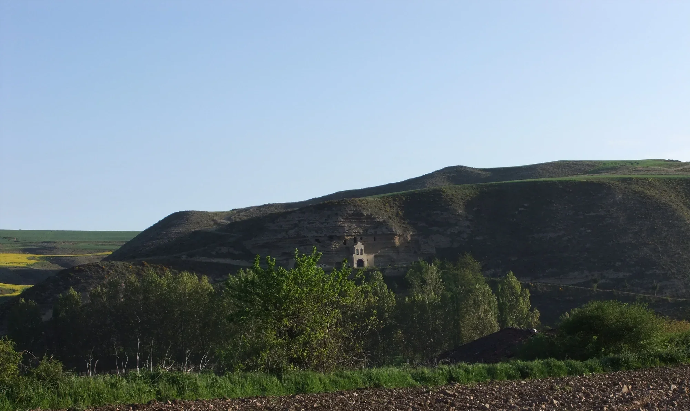

- 🇪🇸 Despedida de Tosantos y una última mirada a la «Ermita de la Virgen de la Peña»

Estuve allí y es un lugar bonito y tranquilo, ideal para meditar. Por una fracción de segundo, incluso pensé en lo bien que estaría que Luis también tuviera un alojamiento para peregrinos en las rocas junto a la «Ermita de la Virgen de la Peña». Pero está bien así, las cosas son como deben ser; de lo contrario, se habría perdido esta maravillosa paz meditativa

---

- 🇵🇹 Despedida de Tosantos e um último olhar para a «Ermita de la Virgen de la Peña»

Estive lá e é um local bonito e tranquilo, ideal para meditar. Por uma fração de segundo, ainda pensei como seria bom se o Luis também tivesse uma dependência do alojamento para peregrinos nas rochas ao lado da «Ermita de la Virgen de la Peña». Mas está bem assim, as coisas são como devem ser; caso contrário, esta paz maravilhosa e meditativa teria-se perdido.

---

- 🇩🇪 Abschied von Tosantos und ein letzter Blick auf die „Ermita de la Virgen de la Peña“

Ich war dort, und es ist ein schöner, ruhiger Ort, ideal zum Meditieren. Für den Bruchteil eines Augenblicks dachte ich noch, wie schön es wäre, wenn Luis auch eine Nebenstelle der Pilgerherberge in den Felsen neben der „Ermita de la Virgen de la Peña“ hätte. Aber es ist gut so, die Dinge sind, wie sie sein sollen; sonst wäre diese wunderbare, meditative Ruhe verloren gegangen.

---

- 🇬🇧 Farewell to Tosantos and a final glance at the ‘Ermita de la Virgen de la Peña’

I’ve been there and it’s a beautiful, peaceful spot, ideal for meditation. For a split second, I even thought how lovely it would be if Luis also had a room in the pilgrims’ hostel set amongst the rocks next to the ‘Ermita de la Virgen de la Peña’. But it’s fine as it is; things are as they should be; otherwise, this wonderful, meditative peace would have been lost.

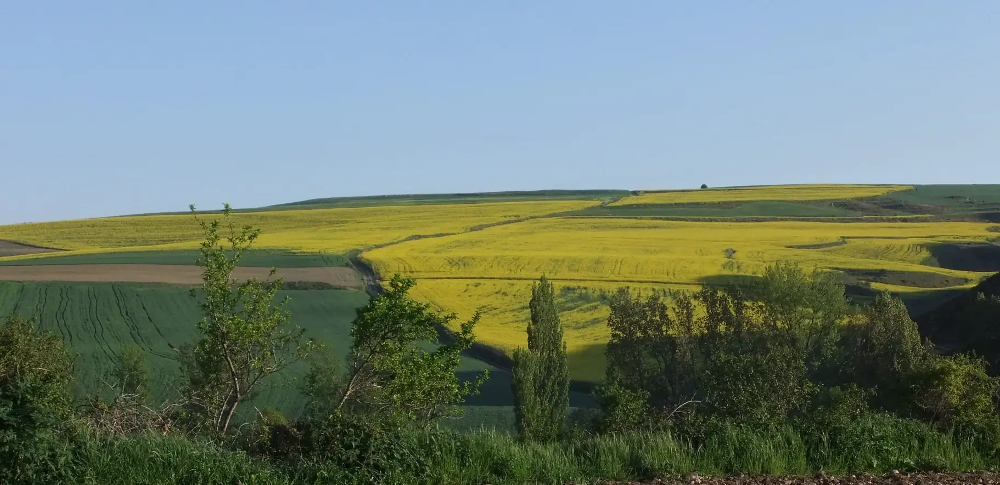

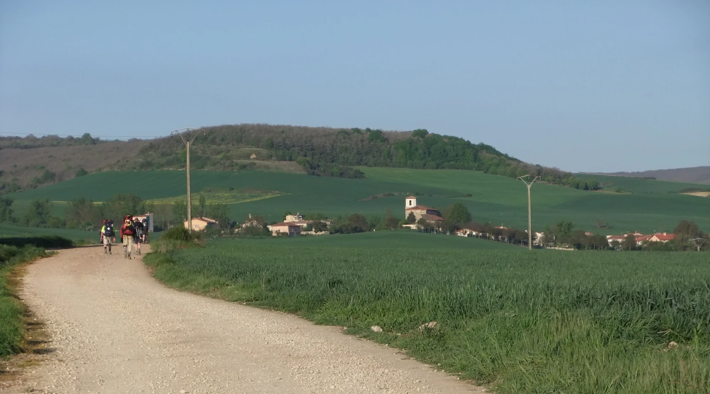

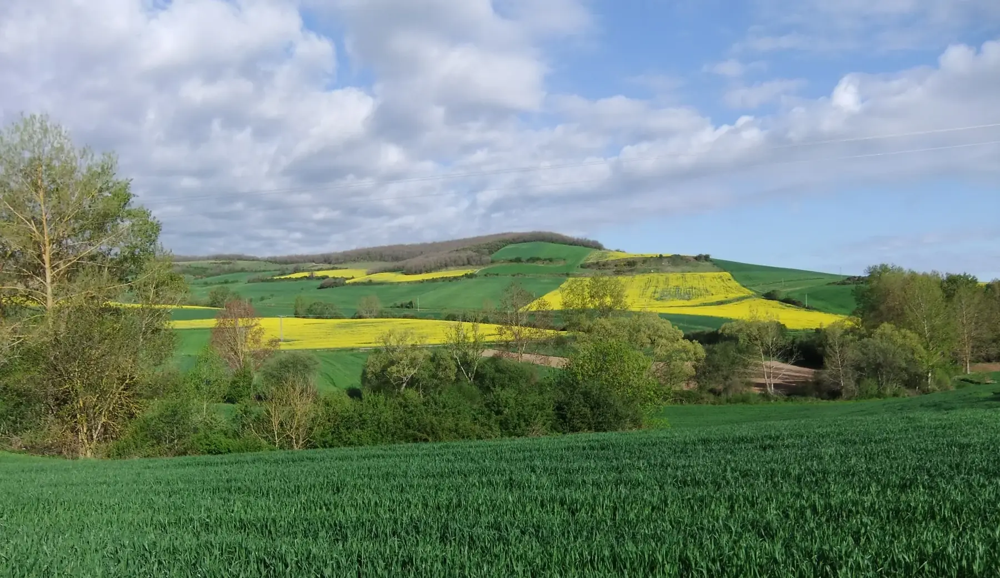

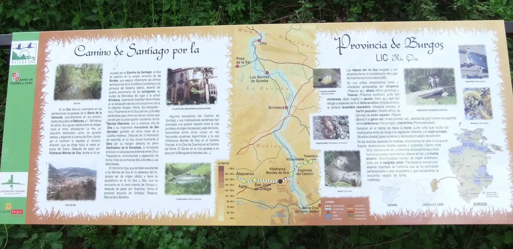

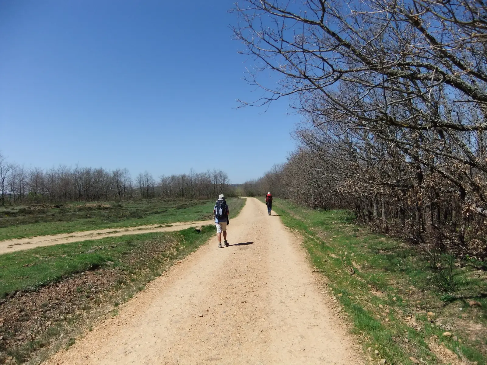
**A caminho de "San Juan de Ortega"  e  "Agés"** 
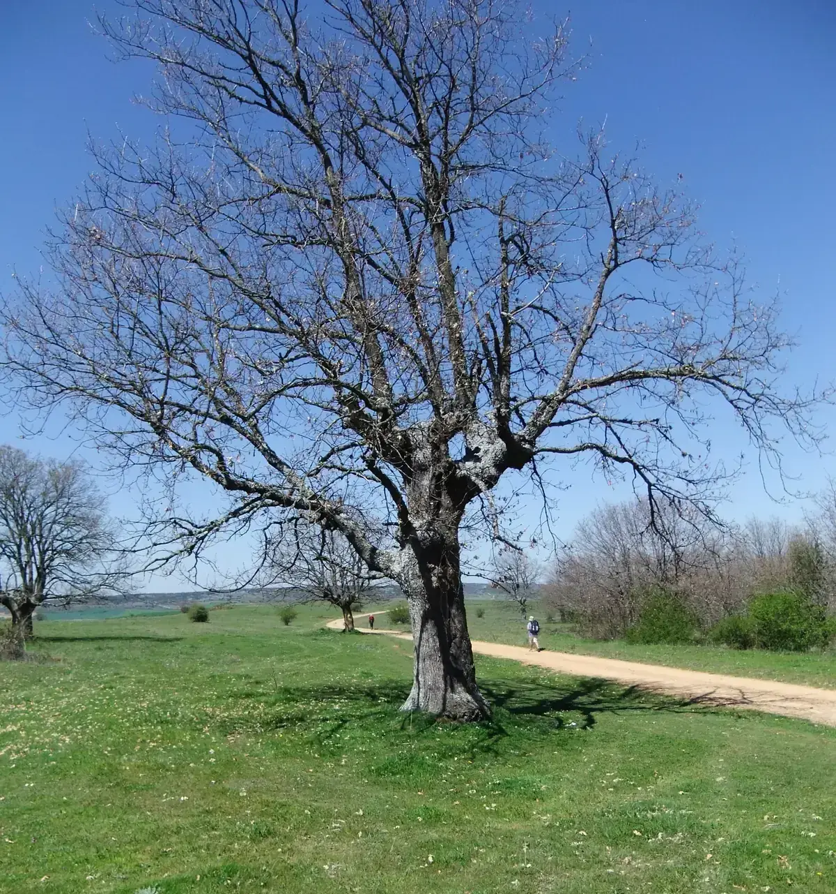

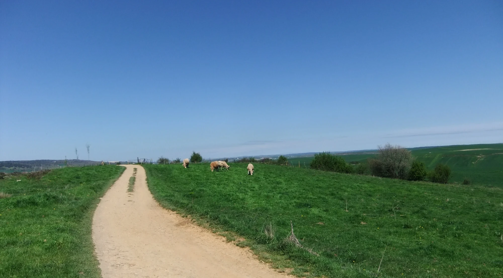

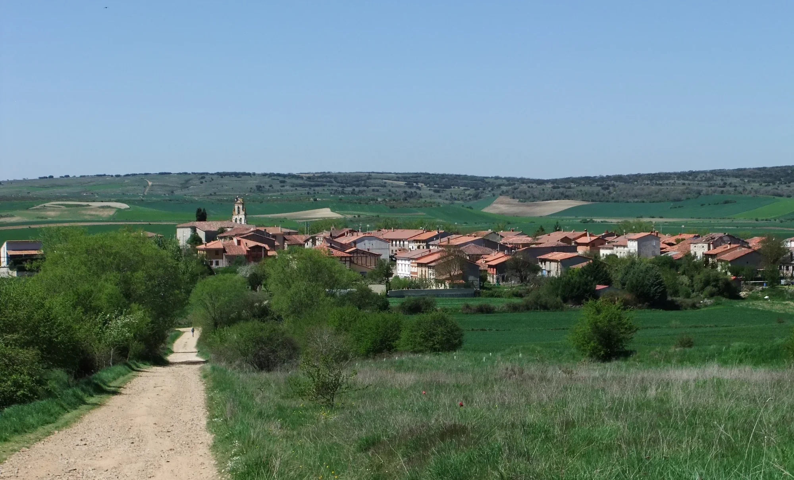

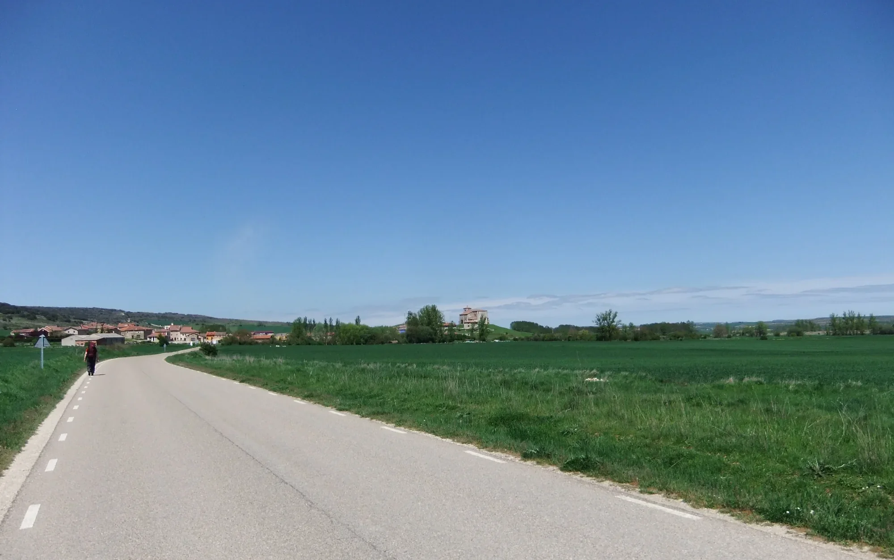

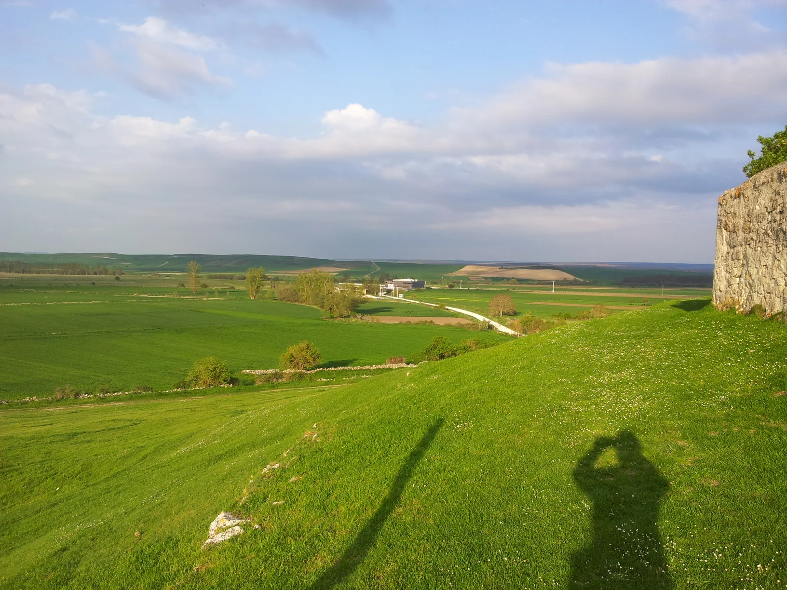

Atapuerca, such tranquillity: ‘I’m staying here; I’m not taking another step’ – that’s what the other pilgrim said to me a few years later in Serdio. That was exactly what I was thinking too when I saw the pilgrims’ hostel, with just one difference: I didn’t have to worry about whether there’d be a place to sleep.
..., ... .

---

Atapuerca, qué tranquilidad: «Me quedo aquí; no voy a dar ni un paso más», me dijo el otro peregrino unos años más tarde en Serdio. Eso mismo pensé yo también cuando vi el albergue, con una única diferencia: yo no tenía que preocuparme por si habría sitio para dormir.
..., ... .

---

**Atapuerca, was für eine Ruhe:** „Ich bleibe hier; ich mache keinen Schritt mehr“ – das sagte mir der andere Pilger einige Jahre später in Serdio. Genau das dachte ich auch, als ich die Pilgerherberge sah, mit einem einzigen Unterschied: Ich musste mir keine Sorgen machen, ob es einen Schlafplatz geben würde.
..., ... .

---
**Atapuerca, que tranquilidade:** «Vou ficar aqui; não dou mais nenhum passo» – foi o que me disse o outro peregrino alguns anos mais tarde, em Serdio. Foi exatamente isso que pensei quando vi o albergue de peregrinos, com uma única diferença: não precisava de me preocupar se haveria um lugar para dormir.
..., ... .

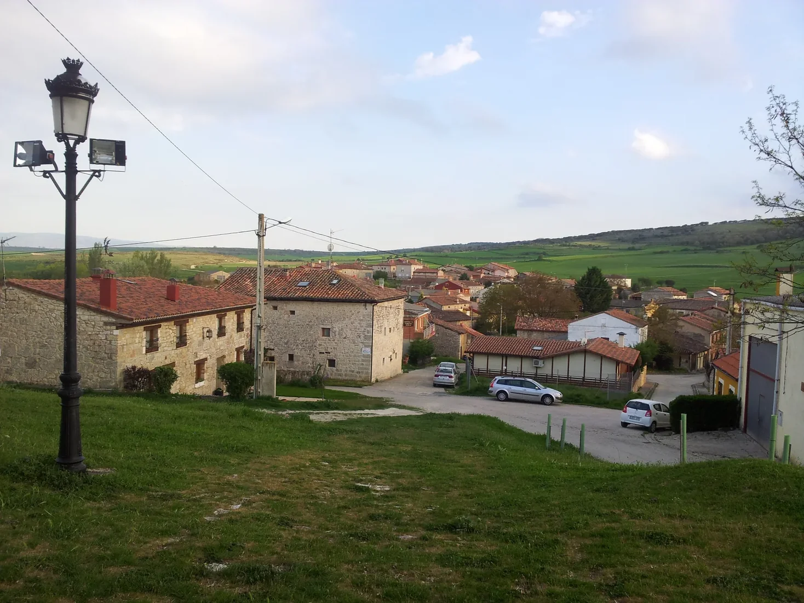

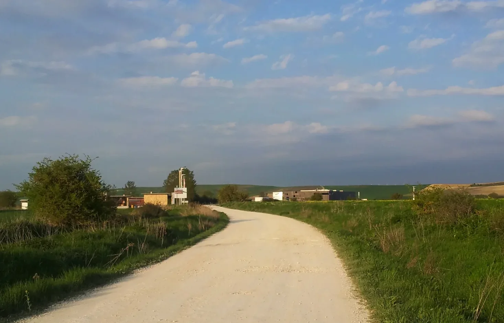

---

  

🇬🇧
🇪🇸
🇵🇹
🇩🇪

---

**↪** [Etapa-11](Etapa-11.md)

 🔁 [Camino-Frances_Etapas](Camino-Frances_Etapas.md)

 ...→