## Camino Francés  2012  

### Etapa-11: →  ( Km)
15 de Mai 2012

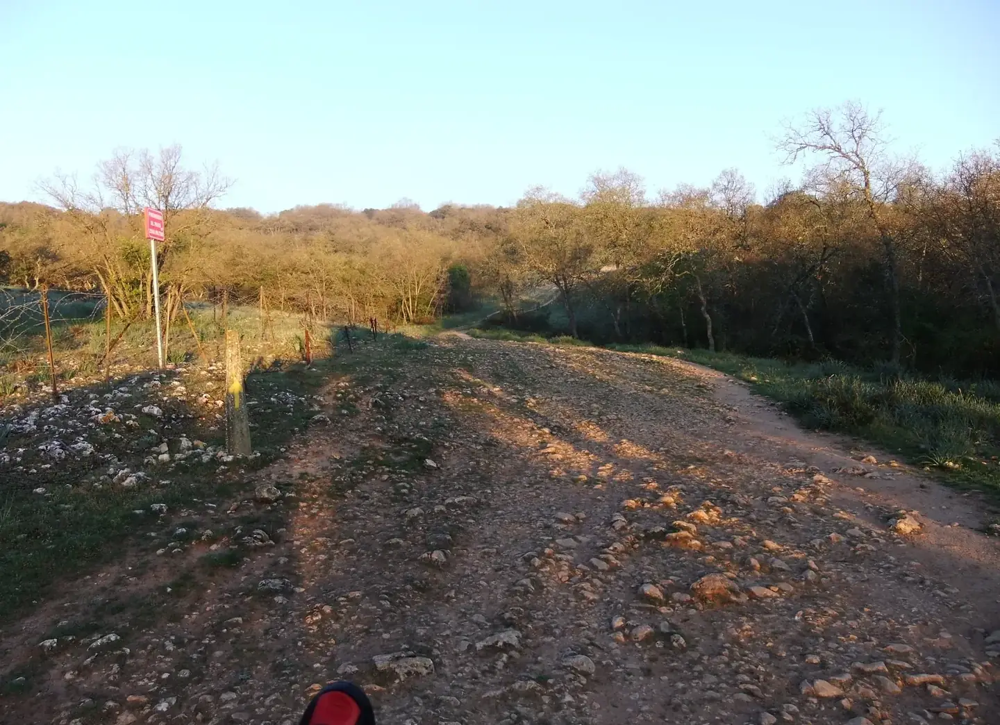

20120515-071740
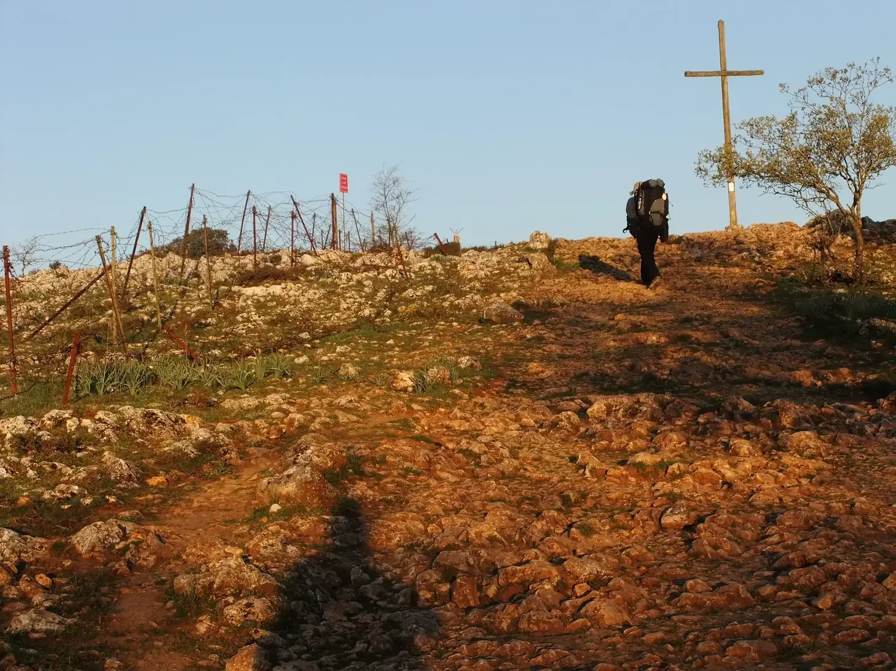

---

 🇩🇪 „My name is António from Portugal.“ 

#### **Kreuz von Atapuerca**

**Vorstellung: Ein Japaner mit perfektem brasilianischem Portugiesisch – und zweifellos besser als meines**

„Buen Camino!“  
„Buen Camino!“  
„My name is António from Portugal.“

Nachdem wir uns mit dem berühmten Gruß begrüßt hatten – der an manchen Tagen sogar ein wenig übertrieben wirkt – und ich meinen Namen und meine Herkunft mit dem englischen Satz genannt hatte, den ich auswendig gelernt hatte, nannte er mir seinen Namen (den ich natürlich schon wieder vergessen habe) in perfektem brasilianischem Portugiesisch.

Auch wenn ich kein Foto von meinem Gesichtsausdruck in diesem Moment habe, war ich noch überraschter, als ich es gewesen wäre, wenn er erwartet hätte, dass ich mit ihm Japanisch spreche.

Ich wohne in der Nähe von Düsseldorf und wusste daher, dass dort eine außergewöhnlich große japanische Gemeinschaft lebt. Düsseldorf gilt als einer der wichtigsten japanischen Standorte Europas; rund 7.000 Japanerinnen und Japaner leben heute in der Stadt, im Großraum sind es noch mehr. Das japanische Leben konzentriert sich besonders rund um die Immermannstraße, das berühmte „Little Tokyo am Rhein“. 

Aber an diesem Tag erfuhr ich etwas, das ich bis dahin nicht gewusst hatte: Brasilien besitzt die mit Abstand größte japanischstämmige Gemeinschaft außerhalb Japans. Rund 2,7 Millionen Menschen japanischer Abstammung leben dort, vor allem im Bundesstaat São Paulo. 

Und so stellte sich heraus, dass mein Gegenüber ein Brasilianer-Japaner war, der in Brasilien als Agraringenieur arbeitet, perfektes brasilianisches Portugiesisch spricht und sich – wie viele von uns – irgendwann in Spanien ein wenig verirrt hatte. Nun folgte auch er den gelben Pfeilen des Jakobswegs.

Wir fotografierten uns gegenseitig. Danach kreuzten sich unsere Wege – wie es auf dem Jakobsweg so oft geschieht – immer wieder, bis wir uns irgendwann erneut aus den Augen verloren.

---

 🇵🇹 „My name is António from Portugal.“ 

#### **Cruz de Atapuerca**

**Apresentação: Um japonês com um português brasileiro perfeito — e, sem dúvida, melhor do que o meu**

„Buen Camino!“  
„Buen Camino!“  
„My name is António from Portugal.“

Depois de nos cumprimentarmos com a famosa saudação — que, em alguns dias, chega até a parecer um pouco exagerada — e de eu dizer o meu nome e a minha origem com a frase em inglês que tinha decorado, ele disse-me o seu nome (que, naturalmente, já esqueci) num português brasileiro perfeito.

Embora eu não tenha uma fotografia da minha expressão naquele momento, fiquei ainda mais surpreendido do que teria ficado se ele esperasse que eu falasse japonês com ele.

Moro perto de Düsseldorf e, por isso, sabia que ali existe uma comunidade japonesa excepcionalmente grande. Düsseldorf é considerado um dos principais centros japoneses da Europa; cerca de 7.000 japoneses vivem atualmente na cidade, e ainda mais na região metropolitana. A vida japonesa concentra-se sobretudo em torno da Immermannstraße, o famoso „Little Tokyo am Rhein“.

Mas naquele dia descobri algo que até então não sabia: o Brasil possui, de longe, a maior comunidade de pessoas de ascendência japonesa fora do Japão. Cerca de 2,7 milhões de pessoas de origem japonesa vivem no país, sobretudo no estado de São Paulo.

E assim descobri que o meu interlocutor era um Brasileiro -Japonês que trabalha como engenheiro agrónomo no Brasil, fala um português brasileiro perfeito e que, como muitos de nós, acabara por se perder um pouco pela Espanha. Agora também seguia as setas amarelas do Caminho de Santiago.

Tirámos fotografias um ao outro. Depois, como acontece tantas vezes no Caminho, os nossos caminhos  cruzam-se de vez em quando, até que finalmente voltámos a perder-nos de vista.

---

🇬🇧 My name is António from Portugal 

#### **Cross of Atapuerca**

**Introduction: A Japanese man with perfect Brazilian Portuguese — and undoubtedly better than mine**

“Buen Camino!”  
“Buen Camino!”  
“My name is António from Portugal.”

After greeting each other with the famous expression — which, on some days, can even feel a little overused — I introduced myself and said where I was from using the English sentence I had memorized. He then told me his name (which, of course, I have already forgotten) in perfect Brazilian Portuguese.

Although I have no photograph of my expression at that moment, I was even more surprised than I would have been if he had expected me to speak Japanese with him.

I live near Düsseldorf, so I already knew that the city has an exceptionally large Japanese community. Düsseldorf is regarded as one of the most important Japanese centers in Europe; around 7,000 Japanese people currently live in the city, with even more in the surrounding region. Japanese life is particularly concentrated around Immermannstraße, the famous “Little Tokyo on the Rhine.”

But that day I learned something I had not known before: Brazil is home, by far, to the largest community of Japanese descent outside Japan. Around 2.7 million people of Japanese ancestry live there, particularly in the state of São Paulo. 
And so I discovered that my new acquaintance was a Brazilian-Japanese man working as an agricultural engineer in Brazil, speaking perfect Brazilian Portuguese, and, like many of us, somehow having ended up a little lost in Spain. Now he, too, was following the yellow arrows of the Camino de Santiago.

We took photographs of each other. Afterwards, as so often happens on the Camino, our paths continued to cross from time to time, until eventually we lost sight of each other again.

---

🇪🇸 My name is António from Portugal. 

#### **Cruz de Atapuerca**

**Presentación: Un japonés con un portugués brasileño perfecto — y, sin duda, mejor que el mío**

«¡Buen Camino!»  
«¡Buen Camino!»  
«My name is António from Portugal.»

Después de saludarnos con el famoso saludo — que algunos días incluso llega a parecer un poco exagerado —, dije mi nombre y de dónde era utilizando la frase en inglés que había memorizado. Entonces él me dijo su nombre (que, por supuesto, ya he olvidado) en un portugués brasileño perfecto.

Aunque no tengo una fotografía de mi expresión en aquel momento, me sorprendí aún más de lo que me habría sorprendido si hubiera esperado que yo hablara japonés con él.

Vivo cerca de Düsseldorf y, por eso, ya sabía que allí existe una comunidad japonesa excepcionalmente grande. Düsseldorf está considerado uno de los principales centros japoneses de Europa; actualmente viven allí unos 7.000 japoneses, y todavía más en la región metropolitana. La presencia japonesa se concentra especialmente alrededor de Immermannstraße, el famoso «Little Tokyo del Rin». {"fallbackMarkdown":
Pero aquel día descubrí algo que hasta entonces desconocía: Brasil alberga, con mucha diferencia, la mayor comunidad de personas de ascendencia japonesa fuera de Japón. Allí viven alrededor de 2,7 millones de personas de origen japonés, especialmente en el estado de São Paulo. {"fallbackMarkdown"

Y así descubrí que mi nuevo conocido era un Brasileño-Japonés que trabaja como ingeniero agrónomo en Brasil, habla un portugués brasileño perfecto y que, como muchos de nosotros, había acabado un poco perdido por España. Ahora también seguía las flechas amarillas del Camino de Santiago.

Nos hicimos fotos mutuamente. Después, como ocurre tantas veces en el Camino, nuestros caminos siguieron cruzándose de vez en cuando, hasta que finalmente volvimos a perdernos de vista.

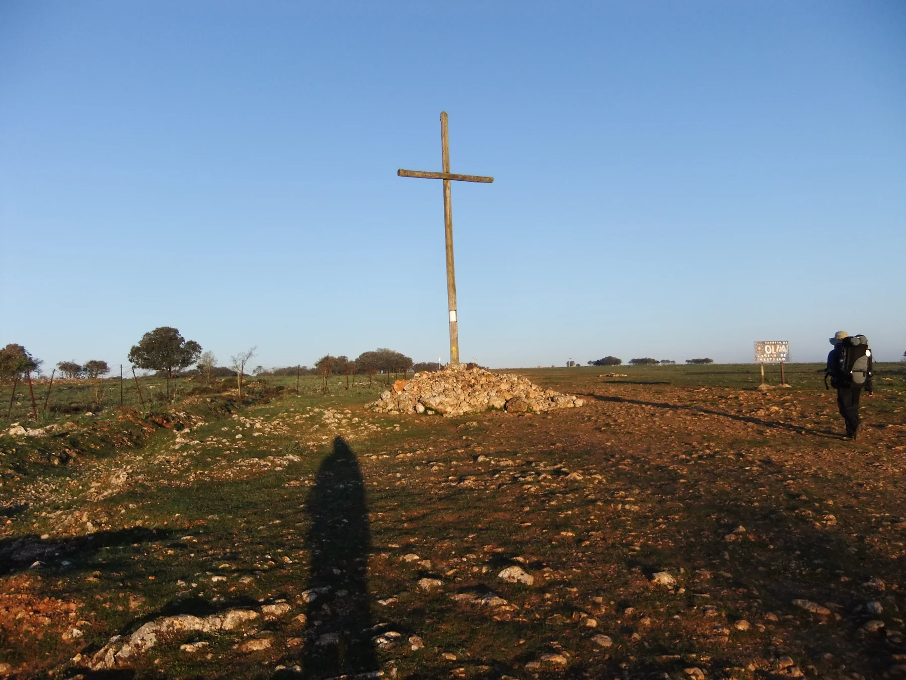
20120515-071907

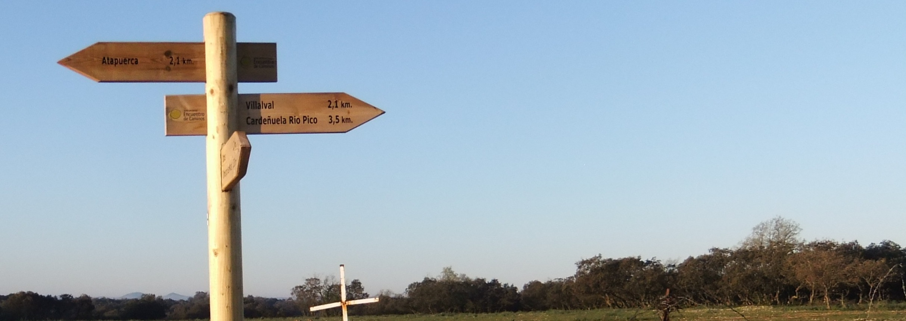

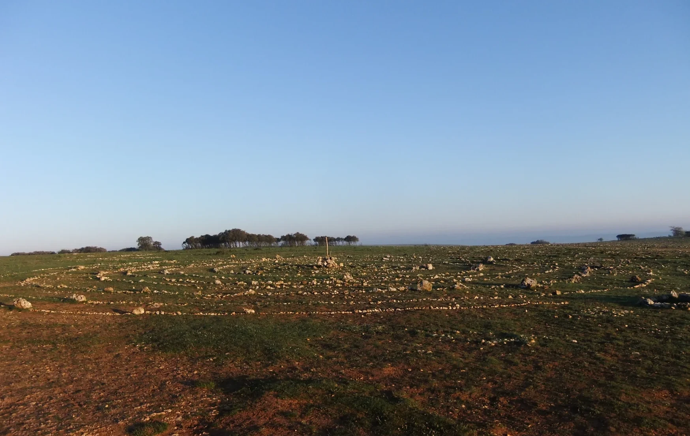

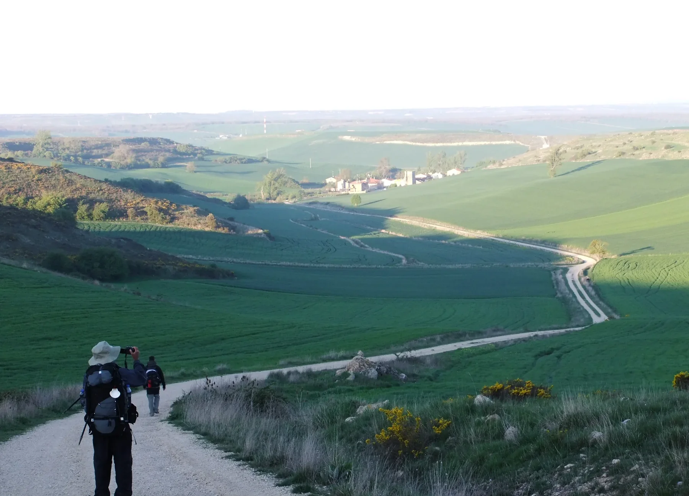

- Meistens glauben wir wären die Landschaft und beanspruchen den ganzen Raum in einen Foto,  aber wir sind nur Reisend für eine Bruchteil der  Zeit einer Landschaft.

- Most of the time, we think we are the landscape and take up the whole frame in a photograph, but we are merely travellers for a fraction of the time a landscape exists.

- Na maioria das vezes, pensamos que somos a paisagem e ocupamos todo o espaço numa fotografia, mas somos apenas viajantes durante uma fração do tempo de uma paisagem.

- La mayoría de las veces creemos que formamos parte del paisaje y ocupamos todo el espacio de una foto, pero solo somos viajeros durante una fracción del tiempo que existe un paisaje.

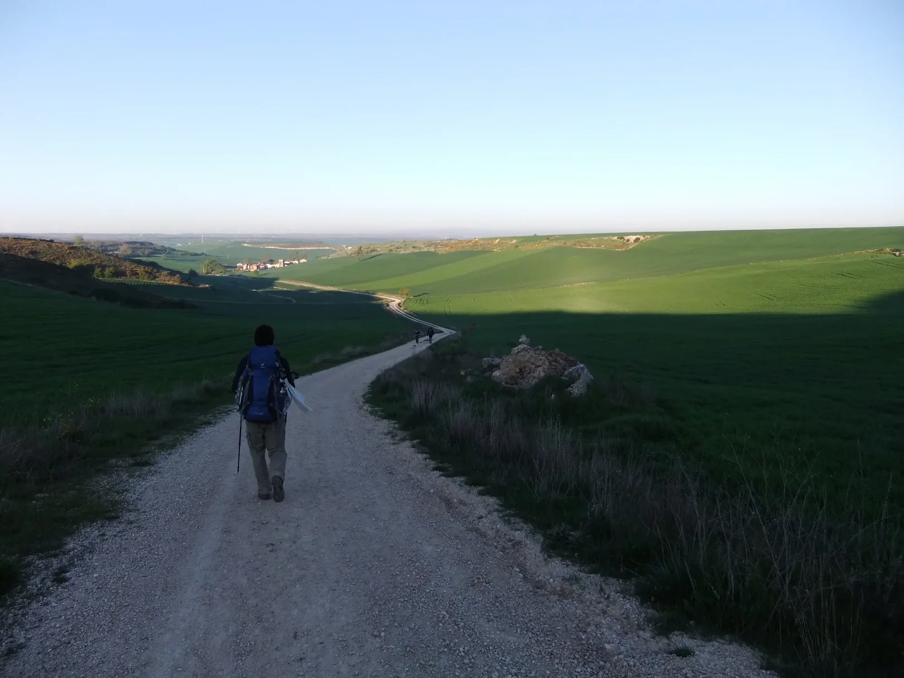
In ein paar Minuten werdet ihr mich hier nicht mehr antreffen.
In a few minutes, you won’t find me here any more.
Daqui a alguns minutos já não me encontrarão aqui.
Dentro de unos minutos ya no estaré aquí.

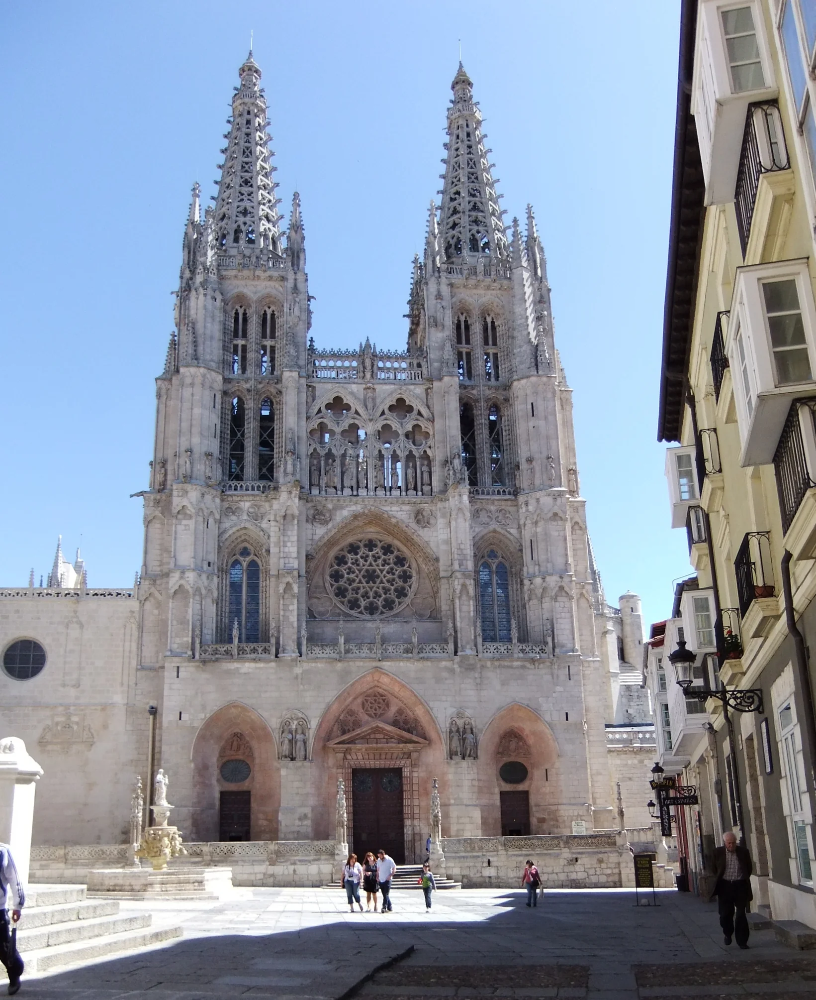

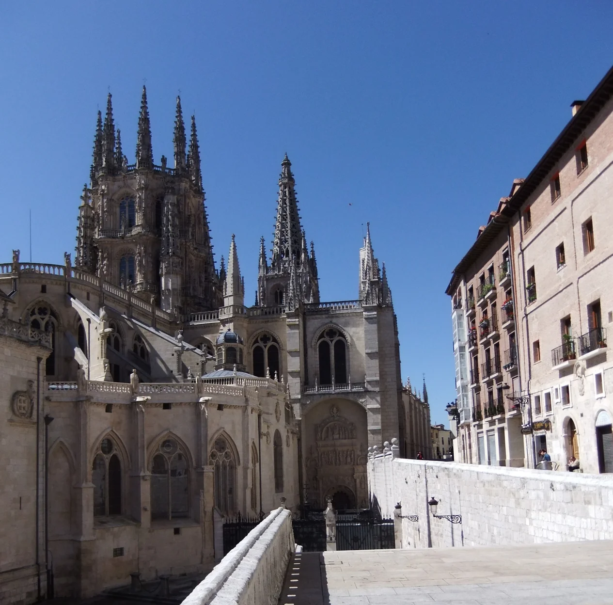

20120515-120131
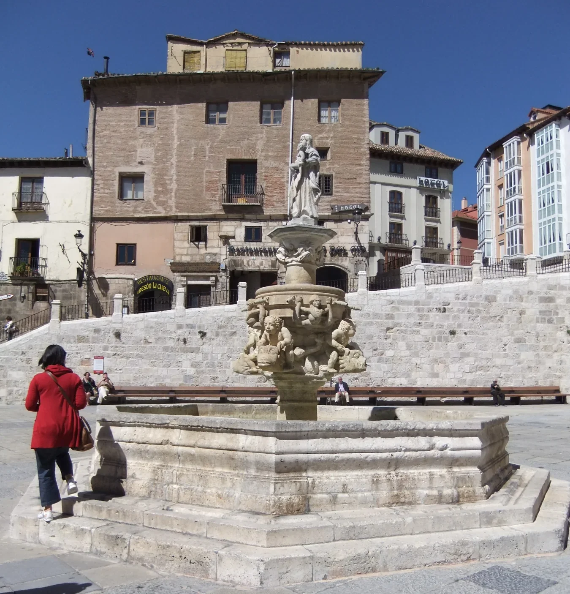

20120515-122806
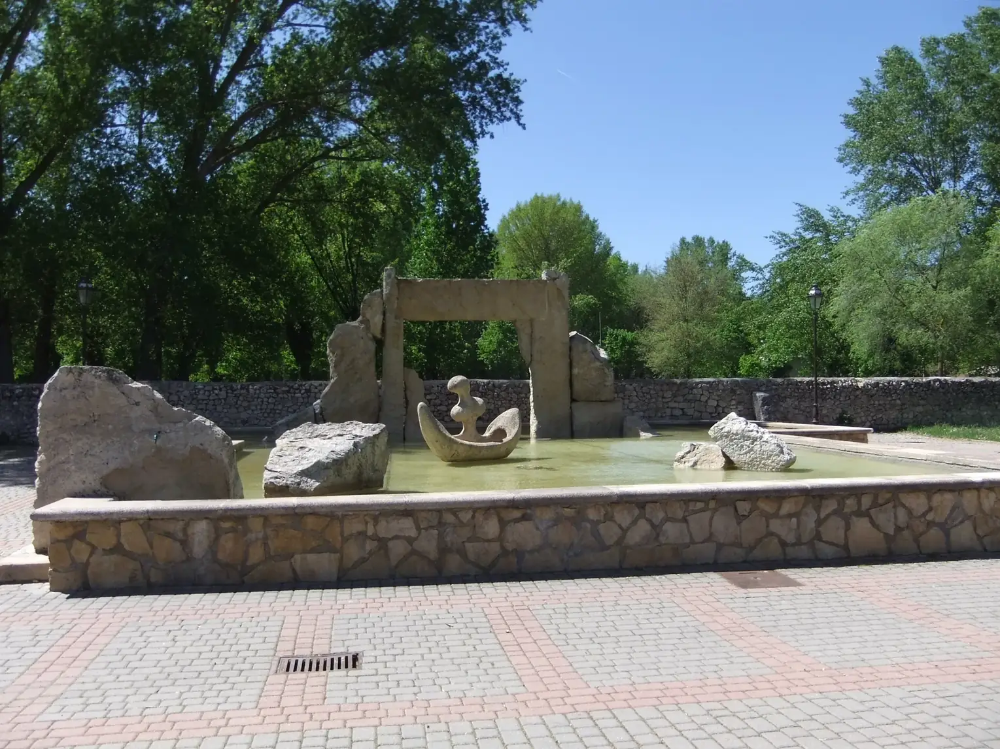

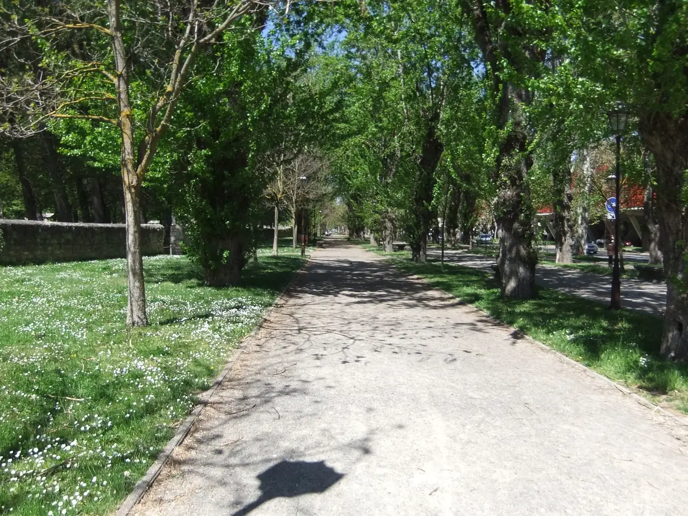

---

  

🇬🇧
🇪🇸
🇵🇹
🇩🇪

---

**↪** [Etapa-12](Etapa-12.md)

 🔁 [Camino-Frances_Etapas](Camino-Frances_Etapas.md)

 ...→