## Camino Francés  2012  

### Etapa-11: Atapuerca → Villalbilla de Burgos (25,x Km)
15 de Mai 2012

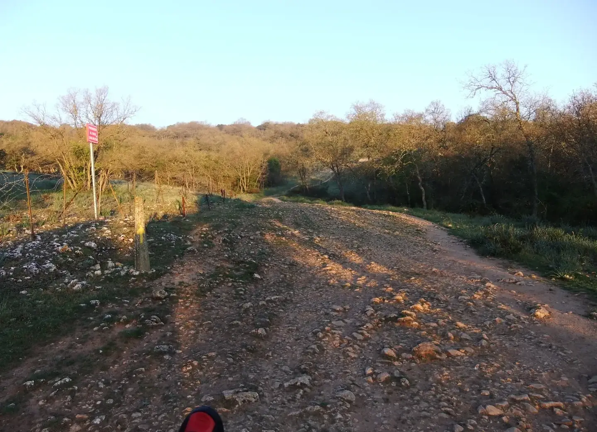

20120515-071740
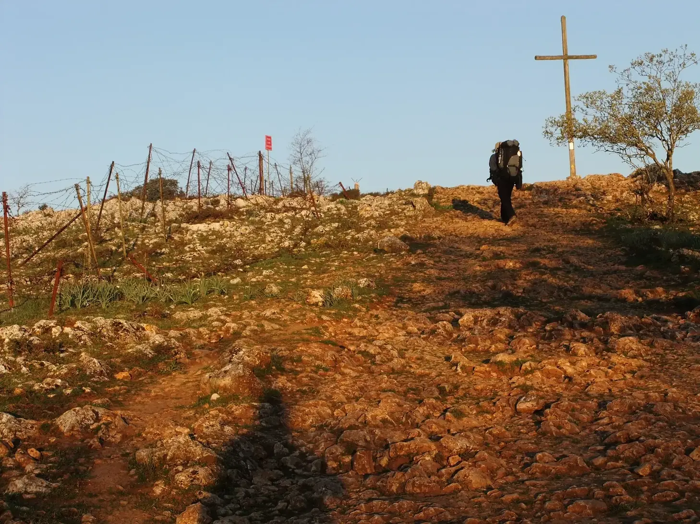

---

 🇩🇪 „My name is António from Portugal.“ 

#### **Kreuz von Atapuerca**

**Vorstellung: Ein Japaner mit perfektem brasilianischem Portugiesisch – und zweifellos besser als meines**

„Buen Camino!“  
„Buen Camino!“  
„My name is António from Portugal.“

Nachdem wir uns mit dem berühmten Gruß begrüßt hatten – der an manchen Tagen sogar ein wenig übertrieben wirkt – und ich meinen Namen und meine Herkunft mit dem englischen Satz genannt hatte, den ich auswendig gelernt hatte, nannte er mir seinen Namen (den ich natürlich schon wieder vergessen habe) in perfektem brasilianischem Portugiesisch.

Auch wenn ich kein Foto von meinem Gesichtsausdruck in diesem Moment habe, war ich noch überraschter, als ich es gewesen wäre, wenn er erwartet hätte, dass ich mit ihm Japanisch spreche.

Ich wohne in der Nähe von Düsseldorf und wusste daher, dass dort eine außergewöhnlich große japanische Gemeinschaft lebt. Düsseldorf gilt als einer der wichtigsten japanischen Standorte Europas; rund 7.000 Japanerinnen und Japaner leben heute in der Stadt, im Großraum sind es noch mehr. Das japanische Leben konzentriert sich besonders rund um die Immermannstraße, das berühmte „Little Tokyo am Rhein“. 

Aber an diesem Tag erfuhr ich etwas, das ich bis dahin nicht gewusst hatte: Brasilien besitzt die mit Abstand größte japanischstämmige Gemeinschaft außerhalb Japans. Rund 2,7 Millionen Menschen japanischer Abstammung leben dort, vor allem im Bundesstaat São Paulo. 

Und so stellte sich heraus, dass mein Gegenüber ein Brasilianer-Japaner war, der in Brasilien als Agraringenieur arbeitet, perfektes brasilianisches Portugiesisch spricht und sich – wie viele von uns – irgendwann in Spanien ein wenig verirrt hatte. Nun folgte auch er den gelben Pfeilen des Jakobswegs.

Wir fotografierten uns gegenseitig. Danach kreuzten sich unsere Wege – wie es auf dem Jakobsweg so oft geschieht – immer wieder, bis wir uns irgendwann erneut aus den Augen verloren.

---

 🇵🇹 „My name is António from Portugal.“ 

#### **Cruz de Atapuerca**

**Apresentação: Um japonês com um português brasileiro perfeito — e, sem dúvida, melhor do que o meu**

„Buen Camino!“  
„Buen Camino!“  
„My name is António from Portugal.“

Depois de nos cumprimentarmos com a famosa saudação — que, em alguns dias, chega até a parecer um pouco exagerada — e de eu dizer o meu nome e a minha origem com a frase em inglês que tinha decorado, ele disse-me o seu nome (que, naturalmente, já esqueci) num português brasileiro perfeito.

Embora eu não tenha uma fotografia da minha expressão naquele momento, fiquei ainda mais surpreendido do que teria ficado se ele esperasse que eu falasse japonês com ele.

Moro perto de Düsseldorf e, por isso, sabia que ali existe uma comunidade japonesa excepcionalmente grande. Düsseldorf é considerado um dos principais centros japoneses da Europa; cerca de 7.000 japoneses vivem atualmente na cidade, e ainda mais na região metropolitana. A vida japonesa concentra-se sobretudo em torno da Immermannstraße, o famoso „Little Tokyo am Rhein“.

Mas naquele dia descobri algo que até então não sabia: o Brasil possui, de longe, a maior comunidade de pessoas de ascendência japonesa fora do Japão. Cerca de 2,7 milhões de pessoas de origem japonesa vivem no país, sobretudo no estado de São Paulo.

E assim descobri que o meu interlocutor era um Brasileiro -Japonês que trabalha como engenheiro agrónomo no Brasil, fala um português brasileiro perfeito e que, como muitos de nós, acabara por se perder um pouco pela Espanha. Agora também seguia as setas amarelas do Caminho de Santiago.

Tirámos fotografias um ao outro. Depois, como acontece tantas vezes no Caminho, os nossos caminhos  cruzam-se de vez em quando, até que finalmente voltámos a perder-nos de vista.

---

🇬🇧 My name is António from Portugal 

#### **Cross of Atapuerca**

**Introduction: A Japanese man with perfect Brazilian Portuguese — and undoubtedly better than mine**

“Buen Camino!”  
“Buen Camino!”  
“My name is António from Portugal.”

After greeting each other with the famous expression — which, on some days, can even feel a little overused — I introduced myself and said where I was from using the English sentence I had memorized. He then told me his name (which, of course, I have already forgotten) in perfect Brazilian Portuguese.

Although I have no photograph of my expression at that moment, I was even more surprised than I would have been if he had expected me to speak Japanese with him.

I live near Düsseldorf, so I already knew that the city has an exceptionally large Japanese community. Düsseldorf is regarded as one of the most important Japanese centers in Europe; around 7,000 Japanese people currently live in the city, with even more in the surrounding region. Japanese life is particularly concentrated around Immermannstraße, the famous “Little Tokyo on the Rhine.”

But that day I learned something I had not known before: Brazil is home, by far, to the largest community of Japanese descent outside Japan. Around 2.7 million people of Japanese ancestry live there, particularly in the state of São Paulo. 
And so I discovered that my new acquaintance was a Brazilian-Japanese man working as an agricultural engineer in Brazil, speaking perfect Brazilian Portuguese, and, like many of us, somehow having ended up a little lost in Spain. Now he, too, was following the yellow arrows of the Camino de Santiago.

We took photographs of each other. Afterwards, as so often happens on the Camino, our paths continued to cross from time to time, until eventually we lost sight of each other again.

---

🇪🇸 My name is António from Portugal. 

#### **Cruz de Atapuerca**

**Presentación: Un japonés con un portugués brasileño perfecto — y, sin duda, mejor que el mío**

«¡Buen Camino!»  
«¡Buen Camino!»  
«My name is António from Portugal.»

Después de saludarnos con el famoso saludo — que algunos días incluso llega a parecer un poco exagerado —, dije mi nombre y de dónde era utilizando la frase en inglés que había memorizado. Entonces él me dijo su nombre (que, por supuesto, ya he olvidado) en un portugués brasileño perfecto.

Aunque no tengo una fotografía de mi expresión en aquel momento, me sorprendí aún más de lo que me habría sorprendido si hubiera esperado que yo hablara japonés con él.

Vivo cerca de Düsseldorf y, por eso, ya sabía que allí existe una comunidad japonesa excepcionalmente grande. Düsseldorf está considerado uno de los principales centros japoneses de Europa; actualmente viven allí unos 7.000 japoneses, y todavía más en la región metropolitana. La presencia japonesa se concentra especialmente alrededor de Immermannstraße, el famoso «Little Tokyo del Rin». {"fallbackMarkdown":
Pero aquel día descubrí algo que hasta entonces desconocía: Brasil alberga, con mucha diferencia, la mayor comunidad de personas de ascendencia japonesa fuera de Japón. Allí viven alrededor de 2,7 millones de personas de origen japonés, especialmente en el estado de São Paulo. {"fallbackMarkdown"

Y así descubrí que mi nuevo conocido era un Brasileño-Japonés que trabaja como ingeniero agrónomo en Brasil, habla un portugués brasileño perfecto y que, como muchos de nosotros, había acabado un poco perdido por España. Ahora también seguía las flechas amarillas del Camino de Santiago.

Nos hicimos fotos mutuamente. Después, como ocurre tantas veces en el Camino, nuestros caminos siguieron cruzándose de vez en cuando, hasta que finalmente volvimos a perdernos de vista.

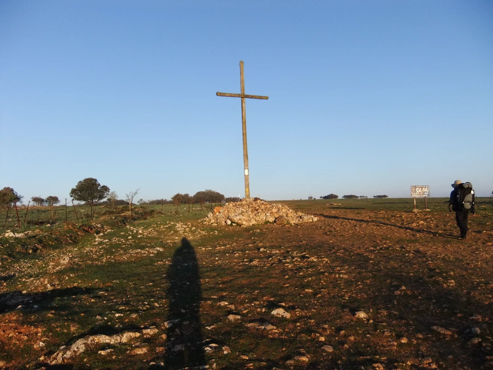
20120515-071907

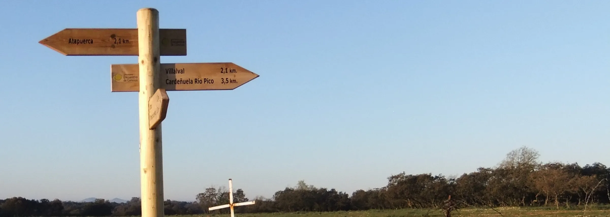

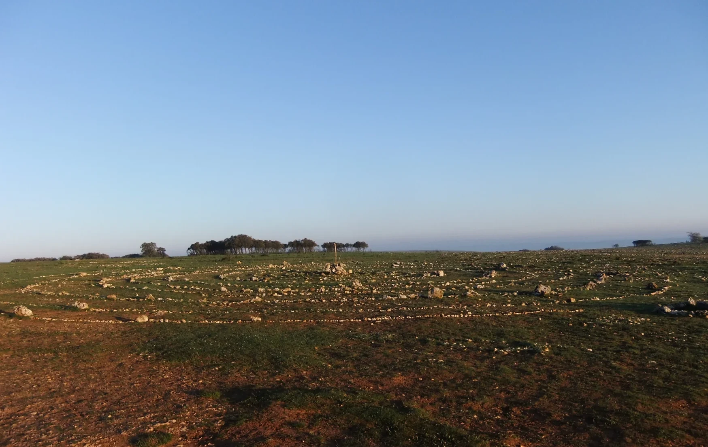

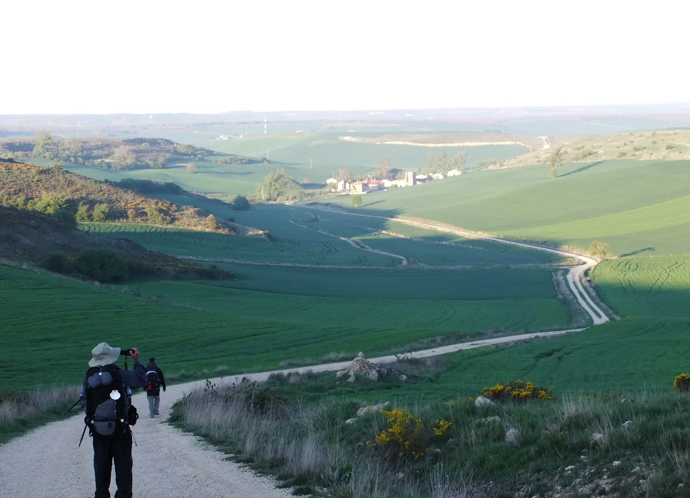

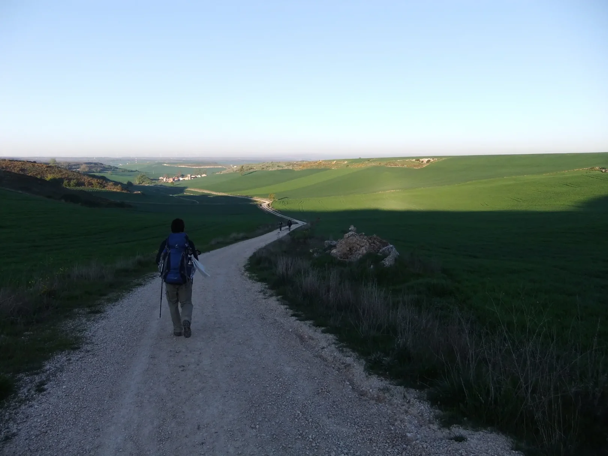

- Wir sind nicht die Landschaft, aber meistens nehmen wir das ganze Bild für uns ein.

Es ist schön, sich selbst beim Gehen zu beobachten.
Sein eigenes Spiegelbild  kann man  auch zu Hause vor dem Spiegel bewundern.

- Não somos a paisagem, mas, na maioria das vezes, ocupamos toda a imagem.

É bom observar-se a si próprio a andar. O seu próprio reflexo pode ser admirado em casa, diante do espelho.

---
#### Aber vorher – wo genau?

Wir waren drei oder vier Pilger, die relativ dicht beieinander unterwegs waren. Als wir ihn über ein Feld gehen sahen, bemerkten wir an den Fußspuren, dass diesen Weg vor uns offenbar kaum jemand genommen hatte. Aber er war ein spanischer Pilger, und wir vertrauten auf seinen Instinkt als Einheimischer. Also beschlossen wir, ihm zu folgen.

Als er bemerkte, dass wir hinter ihm hergingen, drehte er sich um und sagte uns, dass dies nicht der offizielle Weg sei **und dass er sich vielleicht irren könne**. Laut GPS würde er jedoch wieder auf den richtigen Weg gelangen. Wir überhörten großzügig das kleine Wort „irren“ und antworteten nur: „Na gut.“ Und so folgten wir ihm weiter.

>**dass er sich vielleicht irren könne:** Das war nicht genau die Formulierung, die er verwendet hat, sondern eher so etwas wie: dass es vielleicht keinen Durchgang oder Ausgang gäbe.

> *Später, am Ende des Französischen Jakobswegs und auch auf allen anderen Jakobswegen, bin ich noch ziemlich oft von den gelben Pfeilen abgewichen. Dann habe ich einfach dem GPS bis zur nächsten Kirche im nächsten Ort vertraut – und dort schließlich wieder die vertrauten gelben Pfeile gefunden.*

#### Mas antes disso – onde exatamente?

Éramos três ou quatro peregrinos que caminhávamos relativamente próximos uns dos outros. Quando o vimos atravessar um campo, percebemos pelas pegadas que, aparentemente, quase ninguém tinha seguido aquele caminho antes de nós. Mas ele era um peregrino espanhol, e confiámos no seu instinto de alguém da região. Por isso, decidimos segui-lo.

Quando percebeu que estávamos a segui-lo, virou-se e disse-nos que aquele não era o caminho oficial e que talvez pudesse estar enganado. Segundo o GPS, porém, acabaria por voltar a encontrar o caminho certo. Nós, generosamente, ignorámos a pequena palavra «enganado» e respondemos apenas: «Está bem.» E continuámos a segui-lo.

>**que ele talvez pudesse estar enganado:** Não foi exatamente essa a formulação que ele utilizou, mas sim algo do género: que talvez não houvesse nenhuma passagem ou saída.

> *Mais tarde, no final do Caminho Francês e também nos outros Caminhos de Santiago, desviei-me muitas vezes das setas amarelas. Nessas ocasiões, simplesmente confiei no GPS e segui-o até à igreja seguinte, na localidade seguinte – e, finalmente, voltava a encontrar as familiares setas amarelas.*

#### Pero antes de eso, ¿por dónde?

Éramos tres o cuatro peregrinos que caminábamos relativamente cerca unos de otros. Cuando lo vimos atravesar un campo, nos dimos cuenta por las huellas de que, aparentemente, casi nadie había pasado por allí antes que nosotros. Pero él era un peregrino español y confiamos en su instinto como alguien de la tierra. Así que decidimos seguirlo.

Cuando se dio cuenta de que íbamos detrás de él, se volvió y nos dijo que aquel no era el camino oficial y que quizá podía estar equivocado. Sin embargo, según el GPS, acabaría llegando de nuevo al camino correcto. Nosotros, generosamente, hicimos caso omiso de esa pequeña palabra, «equivocado», y simplemente respondimos: «Bueno, vale». Y seguimos caminando detrás de él.

>**que quizá podía estar equivocado:** Esa no fue exactamente la expresión que utilizó, sino más bien algo así como: que quizá no hubiera ningún pasadizo ni salida.

> *Más tarde, al final del Camino Francés y también en los demás Caminos de Santiago, me desvié bastantes veces de las flechas amarillas. En esas ocasiones, simplemente seguía el GPS hasta la siguiente iglesia, en el siguiente pueblo, y allí volvía a encontrar las conocidas flechas amarillas.*

#### But before that – where exactly?

There were three or four of us pilgrims walking relatively close together. When we saw him crossing a field, we noticed from the footprints that, apparently, hardly anyone had taken that route before us. But he was a Spanish pilgrim, and we trusted his instinct as a local. So we decided to follow him.

When he realized that we were following, he turned around and told us that this was not the official route and **that he might be mistaken.** According to the GPS, however, he would eventually find his way back to the right path. We generously ignored that little word, “mistaken,” and simply replied, “All right, then.” And we continued to follow him.

>**that he might be wrong:** That wasn’t exactly the wording he used, but rather something along the lines of: that there might not be a passageway or an exit.

> *Later, towards the end of the French Way, and also on all the other Camino routes, I found myself straying from the yellow arrows quite often. Whenever that happened, I simply trusted the GPS and followed it to the next church in the next village – and eventually found the familiar yellow arrows again.*

---
- **Pouco antes de Burgos**

Já não me lembro do nome do Bar-pensão, mas lembro-me do ambiente que ali se vivia. Parámos lá para tomar um café e trocávamos  informações sobre albergues. Como ele  se sentia bem ali e tinha onde passar a noite, decidiu ficar. E como ainda era cedo, decidi continuar a minha caminhada. Como procurava um local tranquilo para evitar os peregrinos, que, enquanto dormem, fazem soar a sua própria sinfonia, ele recomendou-me a «Pousada del Duque». Foi assim que acabei por caminhar até Villalbilla. 

---
- **Kurz vor Burgos**

Ich erinnere mich nicht mehr an den Namen des Bar-Gasthauses, aber ich erinnere mich an die Atmosphäre, die dort herrschte. Wir machten dort Halt, um einen Kaffee zu trinken, und tauschten häufig Informationen über Herbergen  aus. Da er sich dort wohlfühlte und eine Übernachtungsmöglichkeit hatte, beschloss er zu bleiben. Und da es noch früh war, beschloss ich, meine Wanderung fortzusetzen. Da ich nach einem ruhigen Ort suchte, um den Pilgern aus dem Weg zu gehen, die im Schlaf ihre ganz eigene Symphonie erklingen lassen, empfahl er mir die „Pousada del Duque“. So lief ich schließlich nach Villalbilla. 

---
- **Just before Burgos**

I can’t remember the name of the Bar-guesthouse, but I do remember the atmosphere there. We stopped there for a coffee and often exchanged information about Albergues. As he felt at home there and had somewhere to stay, he decided to stay on. And as it was still early, I decided to carry on with my walk. As I was looking for a quiet spot to get away from the pilgrims, who create their very own symphony whilst they sleep, he recommended the ‘Pousada del Duque’ to me.  So I ended up walking on to Villalbilla.

---
- **Poco antes de llegar a Burgos**

Ya no recuerdo el nombre de el Bar-pensión, pero sí recuerdo el ambiente que se respiraba allí. Paramos para tomar un café e intercambiamos información sobre albergues. Como se sentía a gusto allí y tenía un lugar donde pasar la noche, decidió quedarse. Y como aún era temprano, decidí continuar mi caminata. Como buscaba un lugar tranquilo para evitar a los peregrinos, que mientras duermen interpretan su propia sinfonía, me recomendó la «Pousada del Duque». Así que acabé caminando hasta Villalbilla.

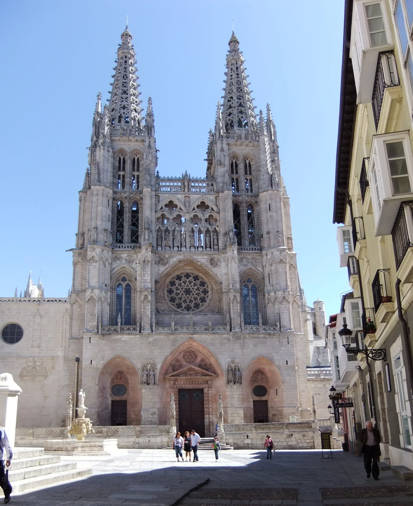

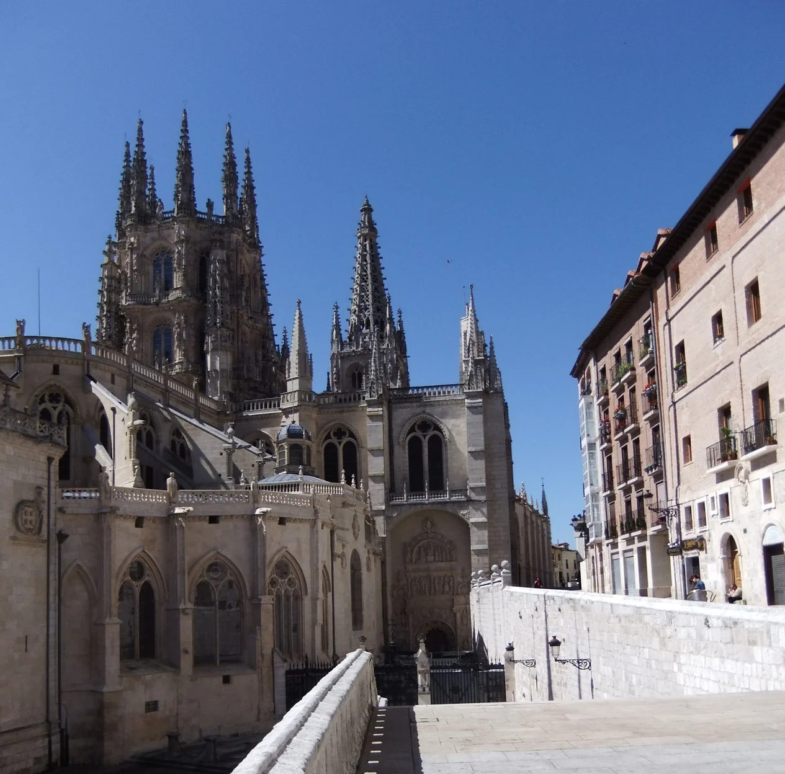

20120515-120131
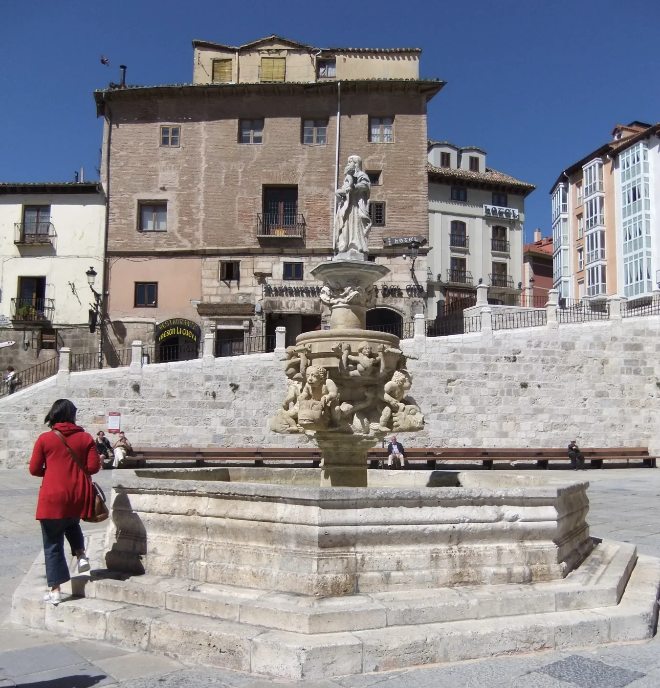

20120515-122806
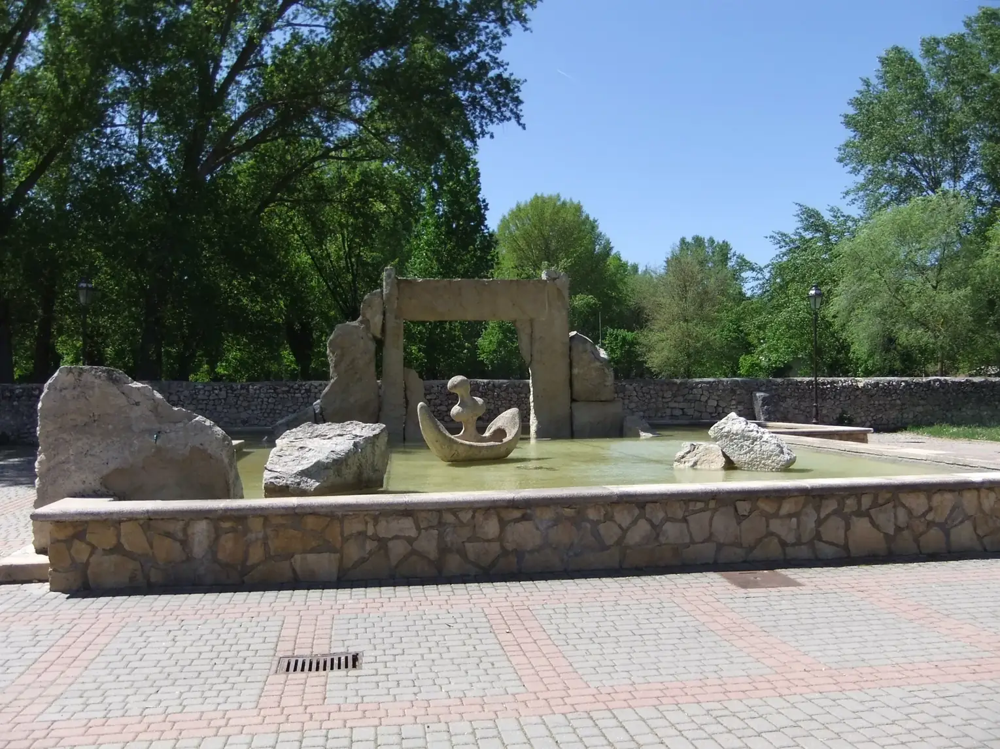

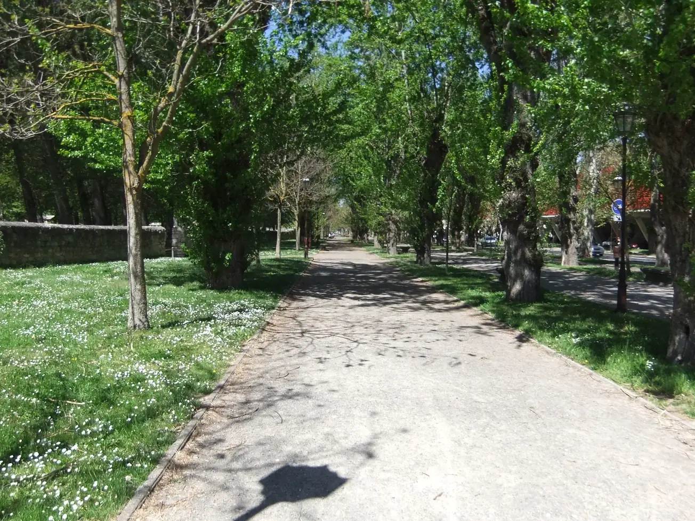

- **Villalbilla**
Quando perguntei por este local, utilizando várias variantes de pronúncia, acabei por desistir e escrevi o nome, e foi então que o senhor mais velho me compreendeu.

O que está escrito como _Villalbilla_ transforma-se muitas vezes rapidamente em algo como: **«Bijabija»** (esta não é a pronúncia correta)

---
- **Villalbilla**
Als ich nach diesem Ort fragte und dabei verschiedene Aussprachevarianten verwendete, gab ich schließlich auf und schrieb den Namen auf, woraufhin der ältere Herr mich verstand.

Was als _Villalbilla_ geschrieben steht, verwandelt sich oft schnell in etwas wie: **„Bijabija“** (Das ist nicht die korrekte Aussprache)

---
- **Villalbilla**
Cuando pregunté por este lugar y probé diferentes formas de pronunciarlo, al final me rendí y escribí el nombre, y entonces el señor mayor me entendió.

Lo que se escribe como _Villalbilla_ a menudo se convierte rápidamente en algo así como: **«Bijabija»** (esa no es la pronunciación correcta)

- **Villalbilla**
When I asked about this place, trying out different ways of pronouncing it, I finally gave up and wrote the name down, whereupon the elderly gentleman understood me.

What is written as _Villalbilla_ often quickly turns into something like: **“Bijabija”** (that is not the correct pronunciation)

---

  

🇬🇧
🇪🇸
🇵🇹
🇩🇪

---

**↪** [Etapa-12_Villalbilla-de-Burgos_Itero-de-la-Vega](Etapa-12_Villalbilla-de-Burgos_Itero-de-la-Vega.md)

 🔁 [Camino-Frances_Etapas](Camino-Frances_Etapas.md)

 ...→