## Camino Francés  2012  

### Etapa-14: →  ( Km)
16 de Mai 2012

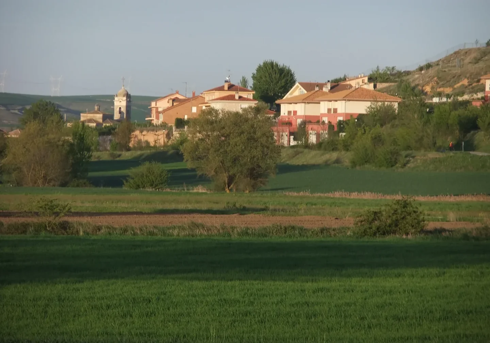

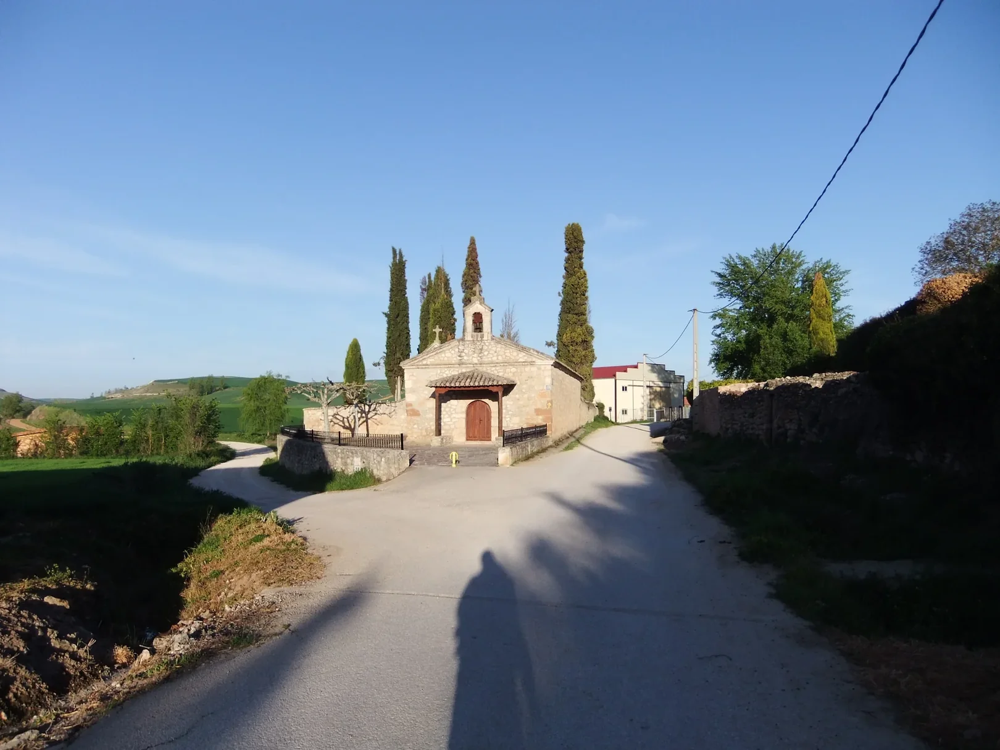

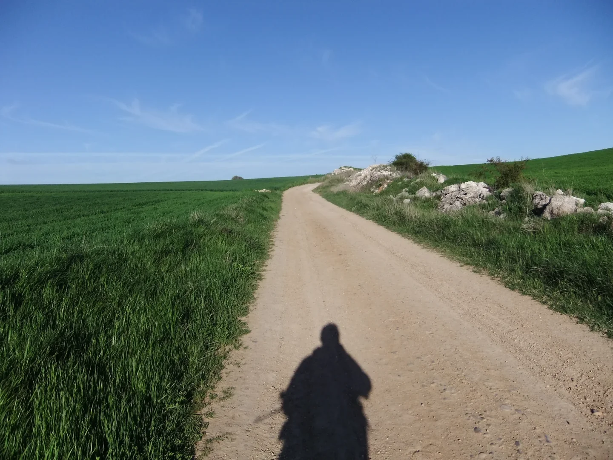

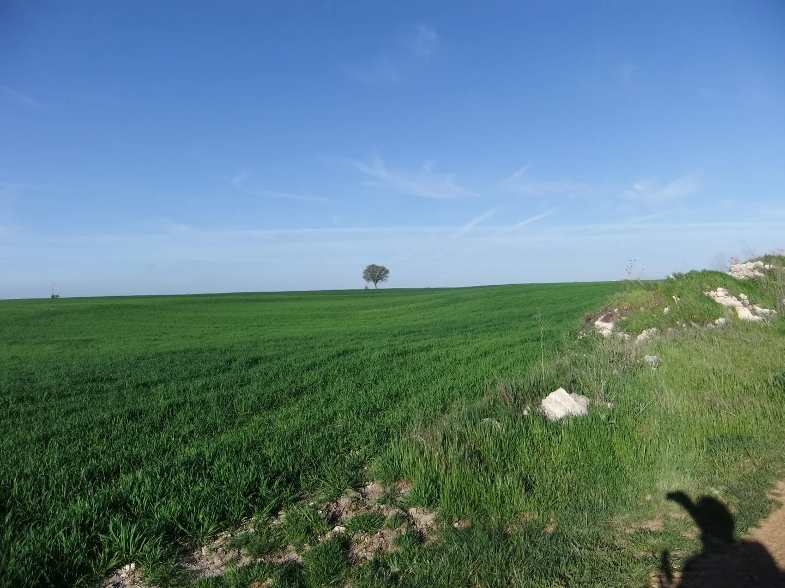

Cuando se recorre el «Camino Francés» a primera hora de la mañana, en el aire fresco de la mañana, uno sigue con placer su propia sombra; y al atardecer, con los pies cansados, la propia sombra se arrastra detrás de nosotros, más mal que bien.

Wenn man frühmorgens in der frischen Morgenluft den „Französischen Weg“ entlanggeht, folgt man gerne seinem eigenen Schatten; und bei Einbruch der Dunkelheit, mit müden Füßen, schleppt sich der eigene Schatten hinter uns her, mehr schlecht als recht.

Quando se percorre o «Caminho Francês» logo pela manhã, no ar fresco do amanhecer, segue-se com prazer a própria sombra; e ao anoitecer, com os pés cansados, a própria sombra arrasta-se atrás de nós, mais mal do que bem.

When you’re walking along the ‘Camino Francés’ early in the morning, in the crisp morning air, you happily follow your own shadow; and in the evening, with tired feet, your shadow drags itself along behind you, barely keeping up.

When you walk the ‘French Way’ first thing in the morning, in the cool air of dawn, you take pleasure in following your own shadow; and at dusk, with weary feet, your own shadow trails behind you, barely keeping up.

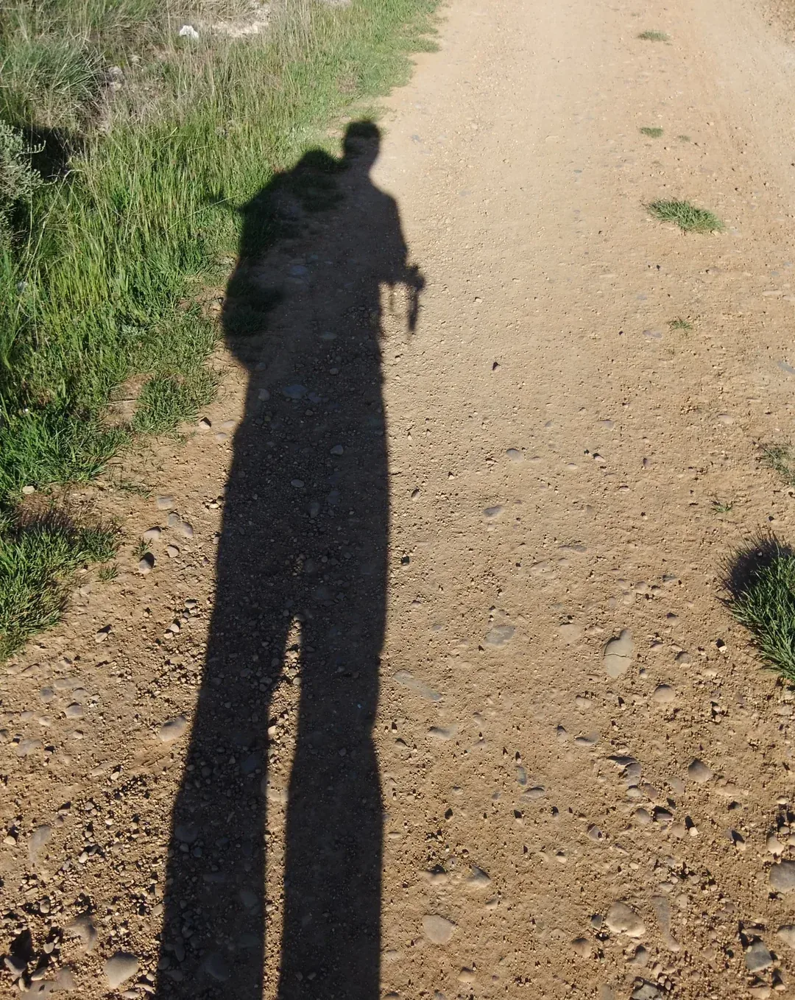

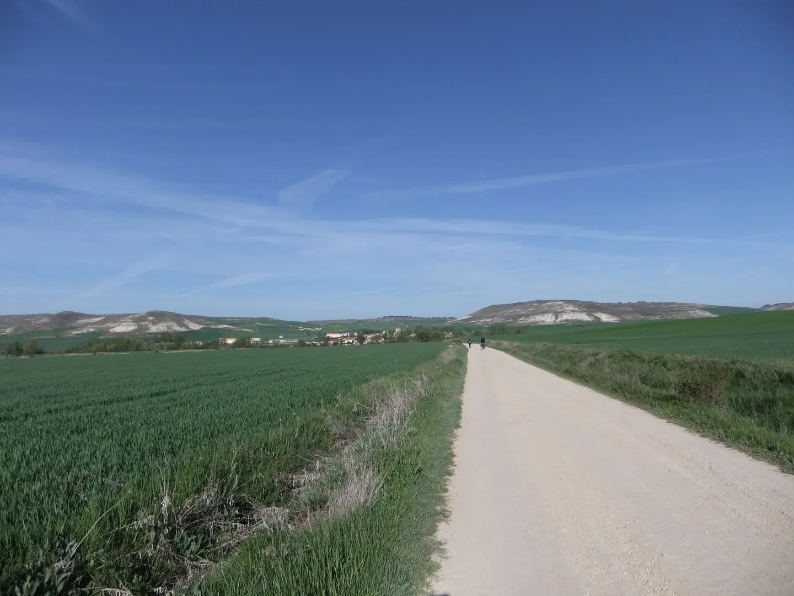

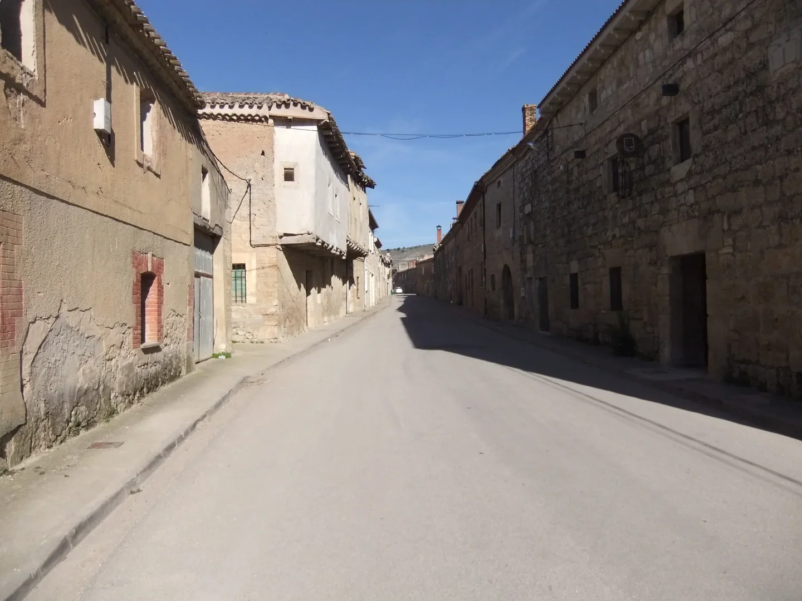

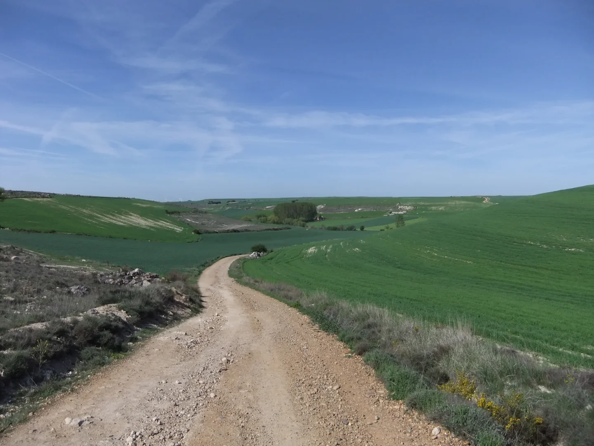

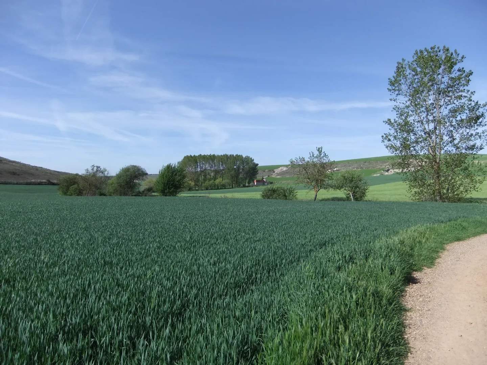

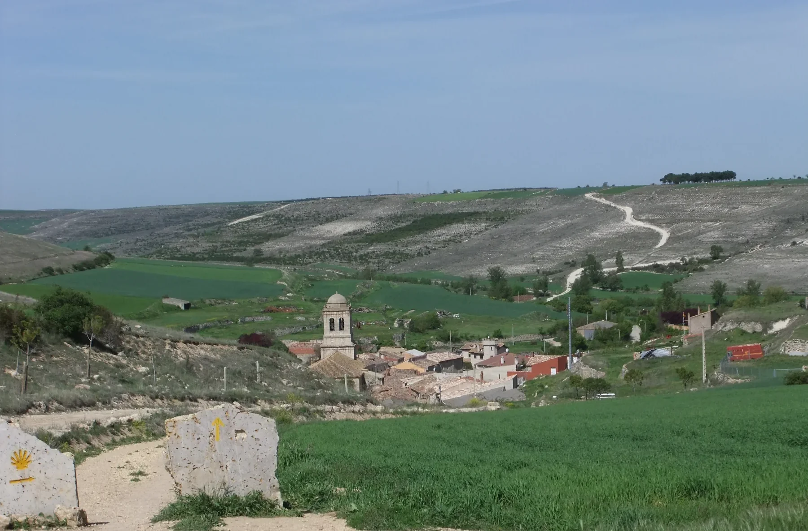

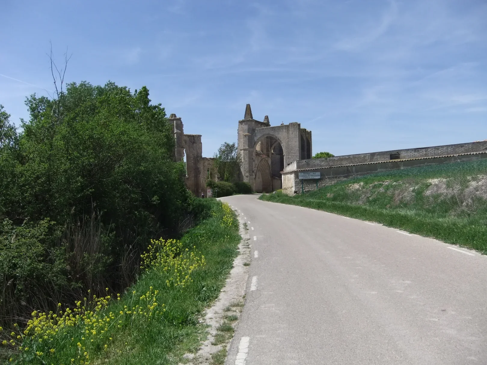

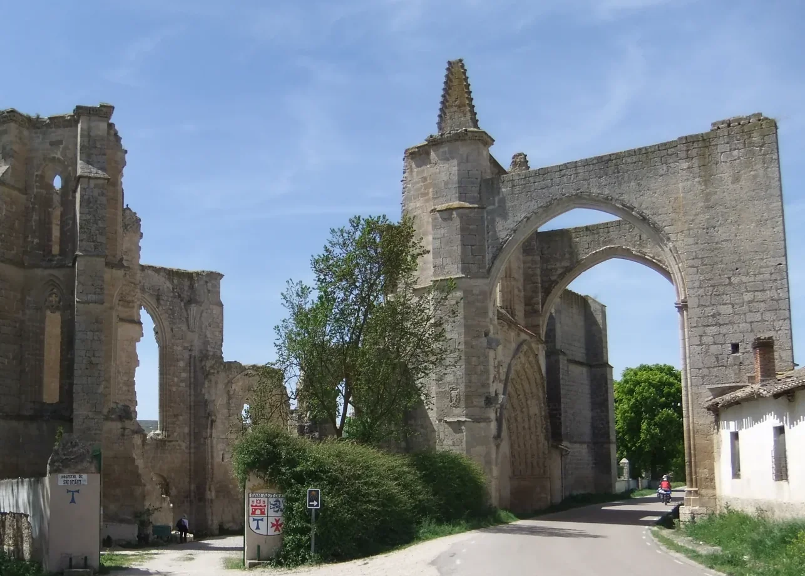

#### 🇩🇪 Albergue de Peregrinos:  Ruinas del Convento de San Antón

> Wenn ich das nur gewusst hätte!
> 
> Es hat mir hier so gut gefallen – ich wäre gerne geblieben. Die Herberge hat alles, was man braucht. Aber leider war schon alles belegt; ich kam einfach zu spät an. Vielleicht hätte ich vorab reservieren müssen? Ich bin mir allerdings nicht einmal sicher, ob diese Herberge im gelben Pilgerführer steht oder ob man sie überhaupt über Booking.com buchen kann. 
> 
> Um hier ein Bett zu ergattern, muss man entweder vor allen anderen ankommen oder am frühen Morgen – noch vor dem ersten Schritt – eine Brieftaube mit einer Nachricht losschicken. Und dann muss man hoffen, dass sich die Taube nicht auf dem Weg zur Unterkunft verirrt.
> 
> Wenn, wenn, wenn… so viele Wenns! Es bringt nichts, sich darüber den Kopf zu zerbrechen. Und Hand aufs Herz: Wer trägt schon eine Brieftaube im Rucksack mit sich herum?

#### 🇪🇸 Albergue de Peregrinos: Ruinas del Convento de San Antón

> ¡Si lo hubiera sabido!
> 
> Me gustó tanto que me habría quedado aquí. El albergue tiene todo lo que uno necesita, pero lamentablemente estaba completo; llegué demasiado tarde. Quizás debería haber reservado antes, aunque ni siquiera estoy seguro de si aparecía en la guía amarilla del peregrino o si se podía reservar a través de Booking.com. Para conseguir cama aquí, o llegas antes que el resto, o a primera hora de la mañana —antes de dar el primer paso— envías una paloma mensajera con la esperanza de que no se pierda buscando el albergue.
> 
> "Si hubiera...", "si hubiera..." ¡Tantos "si" condicionales! No sirve de nada darle vueltas. Además, ¿quién lleva una paloma mensajera en la mochila?

#### 🇬🇧 Albergue de Peregrinos: Ruinas del Convento de San Antón

> If only I had known!
> 
> I loved it here; I would have gladly stayed. The hostel has everything a pilgrim needs, but unfortunately, it was fully booked—I arrived too late. Maybe I should have reserved in advance? Though I’m not even sure if it was listed in the yellow pilgrim guidebook or if it's possible to book it via Booking.com. To secure a bed here, you either have to arrive before everyone else, or send out a carrier pigeon early in the morning before taking your very first step, hoping it doesn't get lost on its way to the hostel.
> 
> If, if, if... so many "ifs"! There is no use dwelling on it. And honestly, who carries a carrier pigeon around in their backpack anyway?

#### 🇵🇹 Albergue de Peregrinos: Ruinas del Convento de San Antón

> Se eu soubesse!
> 
> Gostei tanto daqui que teria ficado. O albergue tem tudo o que um peregrino precisa, mas infelizmente estava lotado; cheguei tarde demais. Talvez devesse ter reservado antes, mas nem tenho certeza se estava listado no guia amarelo do peregrino ou se era possível reservar pelo Booking.com. Para conseguir uma cama aqui, ou você chega antes de todo mundo, ou envia um pombo-correio de manhã cedo —antes de dar o primeiro passo— torcendo para que ele não se perca no caminho para o albergue.
> 
> Se, se, se... tantos "se"! Não adianta ficar remoendo isso. Além disso, quem é que carrega um pombo-correio na mochila?

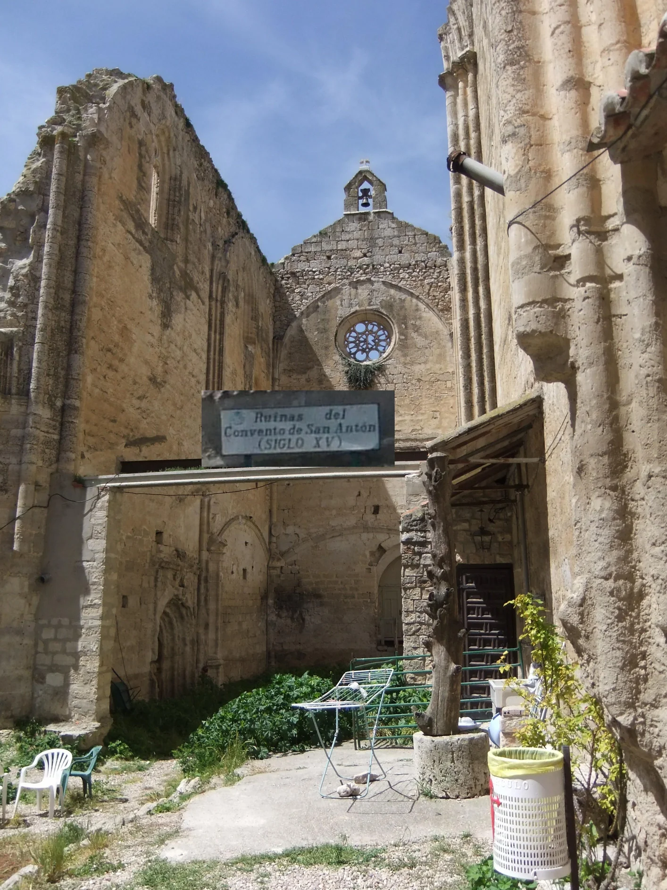

Die Bedeutung im „Siglo XV“ (15. Jahrhundert)

Obwohl das Kloster bereits im **12. Jahrhundert** (1146 durch König Alfons VII.) gegründet wurde, erlebte es im **14. und 15. Jahrhundert** seine architektonische und medizinische Blütezeit

**Architektur:** Die heute sichtbaren, majestätischen Ruinen im Stil der französischen Gotik stammen im Kern aus dem Umbau dieser Ära. Im 15. Jahrhundert wurde die Anlage unter der Schirmherrschaft der kastilischen Könige erheblich erweitert und verschönert, wovon noch heute die königlichen Wappensteine an den Gewölben zeugen.

**Der Antoniter-Orden:** Betrieben wurde die Anlage von den _Antonianos_ (Antonitern), einem französischen Spitalorden. Das Kloster diente im 15. Jahrhundert als das zentrale **Generalshospital des Ordens** auf der Iberischen Halbinsel.

Das „Heilige Feuer“ (Fuego de San Antón)

Das Hospital erlangte im Mittelalter weltweite Berühmtheit durch die Behandlung einer schrecklichen Krankheit: dem **Antoniusfeuer** (_ergotismo_)

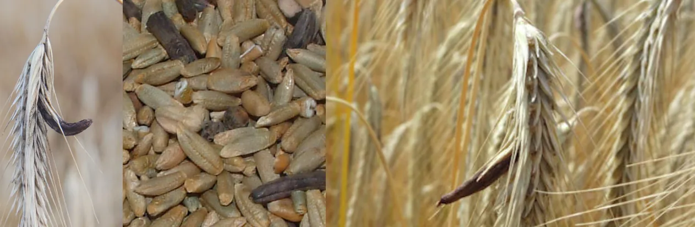

**Die Ursache:** Verursacht wurde die Krankheit durch den Verzehr von Getreide (vor allem Roggen), das mit dem giftigen Pilz **Mutterkorn** (_cornezuelo_) befallen war. Die Symptome waren grausam: Halluzinationen, schwere Nervenschäden und ein qualvolles Absterben (Brand) der Gliedmaßen

**Die Heilung:** Die Mönche besaßen im 15. Jahrhundert das Monopol auf die Pflege dieser Kranken. Die „Heilung“ im Hospital basierte vor allem auf zwei Dingen: einer radikalen Ernährungsumstellung (die Pilger bekamen reines, mutterkornfreies Weizenbrot) und der Pflege mit lindernden Kräutersalben

**Schutz- und Abwehrzauber:** Da man die biologische Ursache damals nicht verstand, galt die Heilung als göttliches Wunder. Die Mönche gaben den Pilgern das sogenannte **Tau-Kreuz** (ein T-förmiges Symbol) als Schutzamulett mit auf den Weg – ein Zeichen, das noch heute überall in den Ruinen zu sehen ist.

Vom Niedergang zum modernen Refugium

Mit dem Rückgang der Krankheit und der Auflösung des Ordens Ende des 18. Jahrhunderts begann der Verfall der Anlage. Nach der Desaueration (_Desamortización_) im 19. Jahrhundert stürzten die Dächer ein, und das Areal ging in Privatbesitz über

Heute beherbergen die geschützten Mauern ein sehr einfaches, **traditionelles Pilgerrefugium** (ohne Strom, bewirtschaftet durch freiwillige Hospitaleros), das die jahrhundertealte Tradition der Gastfreundschaft an diesem mystischen Ort von Mai bis Oktober fortführt

Die akute Gefahr durch Mutterkorn wurde ==**in der ersten Hälfte des 19. Jahrhunderts**== für die breite Bevölkerung gebannt. Dass heute in Ihrem Dorf kaum noch jemand darüber spricht, liegt daran, dass das Problem seit über 150 Jahren rein technisch und behördlich im Hintergrund gelöst wird

1. Die Entdeckung der Ursache (Spätes 17. Jahrhundert)

Obwohl das „Antoniusfeuer“ jahrhundertelang wütete, verstand man die Ursache lange nicht. Erst **1630 und 1695** wiesen Ärzte und Forscher wissenschaftlich nach, dass die dunklen, hornförmigen Auswüchse im Roggen kein „missgebildetes Korn“, sondern ein hochgiftiger Pilz (_Claviceps purpurea_) sind

2. Die Aufklärung und Reinigung (Frühes 19. Jahrhundert)

Ab den **1800er-Jahren** sickerte dieses Wissen von den Wissenschaftlern in die Landwirtschaft und die breite Bevölkerung durch. Es wurden staatliche Vorschriften zur **Reinigung des Saatguts** erlassen. Die Bauern lernten, das Mutterkorn vor dem Mahlen mechanisch auszusortieren (z. B. durch Siebe oder das sogenannte Flotationsverfahren in Salzwasser, bei dem das leichtere Mutterkorn oben schwimmt). Dadurch wurden große Massenvergiftungen in Mitteleuropa ab Mitte des 19. Jahrhunderts extrem selten. Einer der letzten größeren Ausbrüche in Deutschland ereignete sich **1879–1881**

3. Moderne Technik und Grenzwerte (20. Jahrhundert bis heute)
Heute ist die Gefahr für uns unsichtbar geworden, weil sie lückenlos überwacht wird.

- **Farbausleser (Optische Sortierer):** In modernen Mühlen scannen Hochgeschwindigkeitskameras jedes einzelne Korn. Da Mutterkorn fast schwarz ist, wird es vollautomatisch per Druckluftstrahl in Millisekunden aussort
**Strengste Gesetze:** Die Europäische Union überwacht akribisch. Mit aktuellen Verordnungen (wie der EU-Verordnung 2024/1808) wurden die Grenzwerte für unverarbeiteten Roggen und Mehle nochmals drastisch gesenkt, um absolut jedes Risiko für Verbraucher auszuschließen

### Convento San Anton History

#### 🇩🇪 Convento de San Antón (Castrojeriz) – Mehr als nur ein Pilgerhospital

> 
> Das Kloster, gelegen rund drei Kilometer vor Castrojeriz auf dem Camino Francés, war im Mittelalter und insbesondere im 15. Jahrhundert (Siglo XV) weit mehr als eine gewöhnliche Raststation für müde Wanderer. Es war das spirituelle, medizinische und administrative Zentrum des Antoniter-Ordens auf der Iberischen Halbinsel und genoss direkten königlichen Schutz.
> 
> - Das medizinische Zentrum gegen das „Antoniusfeuer“: Das Hospital war weltweit führend in der Behandlung des _Ergotismus_ (Mutterkornvergiftung). Die Mönche heilten die Erkrankten durch die Vergabe von reinem Weizenbrot (statt des kontaminierten Roggens) und der Pflege mit geheimen Kräutersalben.
> - Königliches Protektorat & Privilegien: Die Anlage stand unter dem direkten Schutz der kastilischen Krone. Die Mönche besaßen das exklusive Recht, die Schweine des Klosters frei durch die Dörfer und Städte laufen zu lassen (_Cerdos de San Antón_), um Futter und Spenden zu sammeln.
> - Der Schutz des Tau-Kreuzes (Crux Commissa): Das T-förmige Kreuz war das Symbol der Antoniter. Es galt als mächtiges Schutzamulett gegen Krankheiten und Dämonen. Pilger erhielten es hier als Segen für ihren weiteren Weg.
> - Die Architektur als Tor: Die Kirche wurde so über den Weg gebaut, dass die Pilger physisch unter den gotischen Bögen des Klosters hindurchschreiten mussten – ein symbolischer Akt der Reinigung und des Schutzes.

#### 🇪🇸 El Convento de San Antón (Castrojeriz) – Más que un simple hospital de peregrinos

> El Convento de San Antón, situado a unos tres kilómetros antes de Castrojeriz en el Camino Francés, fue durante la Edad Media y especialmente en el siglo XV, mucho más que un simple refugio para caminantes cansados. Era el centro espiritual, médico y administrativo de la Orden de los Antonianos en la Península Ibérica, gozando de la protección directa de la corona.
> 
> - El centro médico contra el "Fuego de San Antón": El hospital fue un referente mundial en el tratamiento del _ergotismo_ (envenenamiento por cornezuelo de centeno). Los monjes curaban a los enfermos dándoles pan de trigo puro y cuidándolos con bálsamos de hierbas secretos.
> - Protectorado real y privilegios: El recinto contaba con el amparo directo de la Corona de Castilla. Los monjes tenían el derecho exclusivo de dejar a los cerdos del convento (_los cerdos de San Antón_) sueltos por los pueblos para recoger alimento y limosnas.
> - La protección de la Cruz de Tau: La cruz en forma de T era el símbolo antoniano. Se consideraba un poderoso amuleto contra enfermedades y demonios, y los peregrinos la recibían aquí como bendición.
> - La arquitectura como portal: La iglesia fue construida sobre el propio Camino, obligando a los peregrinos a pasar físicamente bajo sus arcos góticos, un acto simbólico de purificación y protección.

#### 🇬🇧 The Convento de San Antón (Castrojeriz) – More than just a Pilgrim Hospital

> 
> The Convento de San Antón, located about three kilometers before Castrojeriz on the Camino Francés, was during the Middle Ages, and particularly in the 15th century (Siglo XV), far more than a basic rest stop for weary travelers. It served as the spiritual, medical, and administrative headquarters of the Antonine Order on the Iberian Peninsula, enjoying direct royal patronage.
> 
> - The Medical Epicenter for "St. Anthony's Fire": The hospital was a world-renowned center for treating _ergotism_ (ergot poisoning). The monks cured patients by feeding them pure wheat bread (replacing infected rye) and applying secret herbal ointments.
> - Royal Protection & Unique Privileges: Protected directly by the Crown of Castile, the monastery held exceptional rights. The monks could let their pigs (_Cerdos de San Antón_) roam freely through nearby towns to gather food and donations.
> - The Shield of the Tau Cross: The T-shaped cross was the emblem of the Antonines. Feared by disease and demons, it was given to pilgrims as a powerful protective amulet and blessing for their remaining journey.
> - Architecture as a Gateway: The church was uniquely designed spanning across the path itself, forcing pilgrims to physically walk beneath its grand Gothic arches—a symbolic passage of purification and protection.

#### 🇵🇹 O Convento de San Antón (Castrojeriz) – Mais do que um Hospital de Peregrinos

> 
> O Convento de San Antón, situado a cerca de três quilômetros antes de Castrojeriz no Caminho Francês, foi durante a Idade Média, e especialmente no século XV (Siglo XV), muito mais do que um simples abrigo. Era o centro espiritual, médico e administrativo da Ordem dos Antonianos na Península Ibérica, contando com o protetorado direto da coroa.
> 
> - O centro médico contra o "Fogo de Santo Antão": O hospital era uma referência mundial no tratamento do _ergotismo_ (envenenamento por esporão-de-centeio). Os monges curavam os enfermos oferecendo-lhes pão de trigo puro e tratando-os com bálsamos herbais secretos.
> - Protetorado real e privilégios: O complexo estava sob a proteção direta da Coroa de Castela. Os monges tinham o privilégio exclusivo de deixar os porcos do convento (_os porcos de San Antón_) soltos pelas vilas para recolher comida e esmolas.
> - A proteção da Cruz de Tau: A cruz em forma de T era o símbolo dos Antonianos. Considerada um poderoso amuleto contra doenças e demônios, os peregrinos a recebiam aqui como uma bênção para a jornada.
> - A arquitetura como portal: A igreja foi construída sobre o próprio Caminho, obrigando os peregrinos a passar fisicamente sob os seus arcos góticos, num ato simbólico de purificação e proteção.

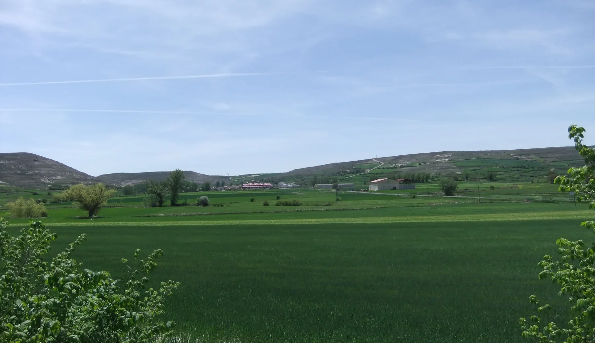

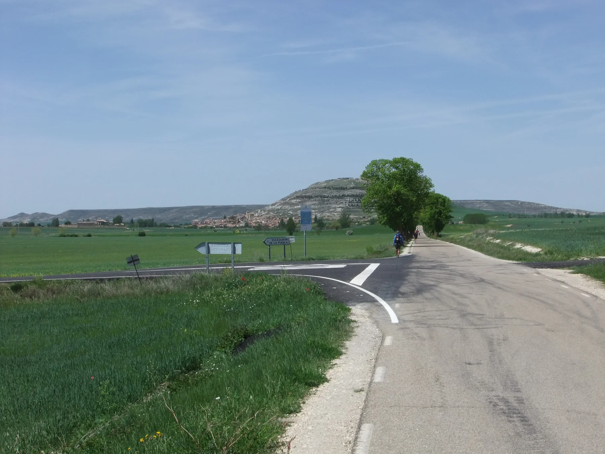

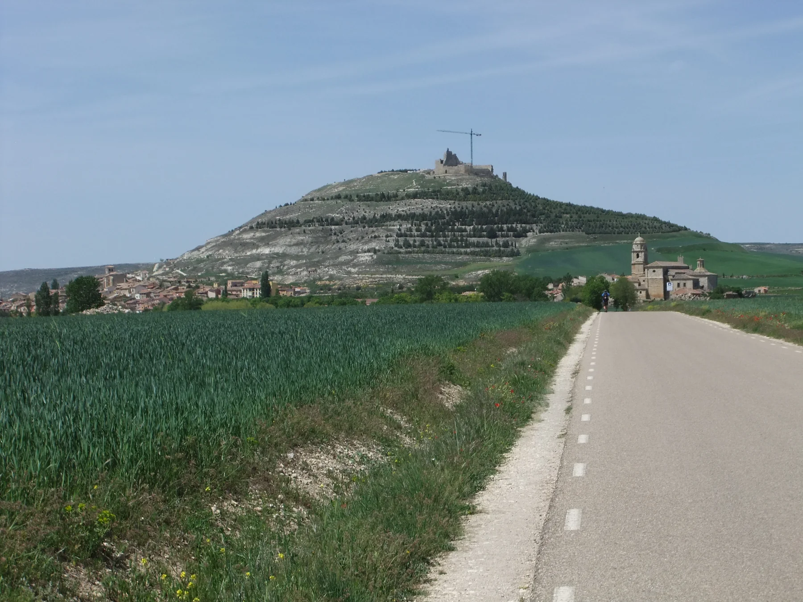

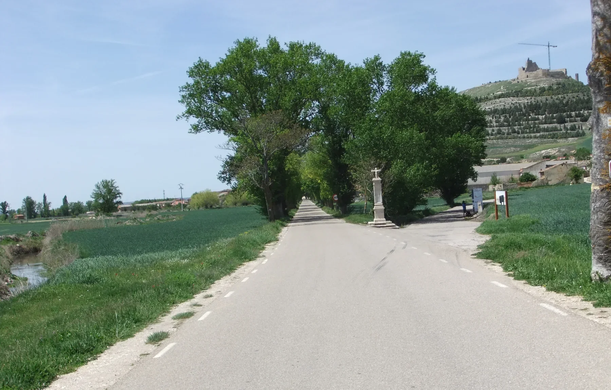

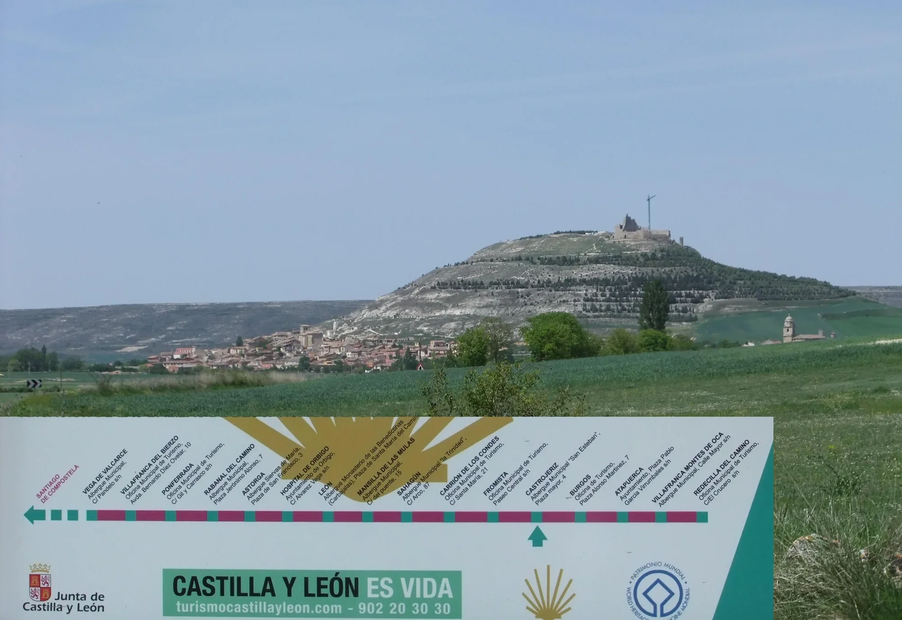

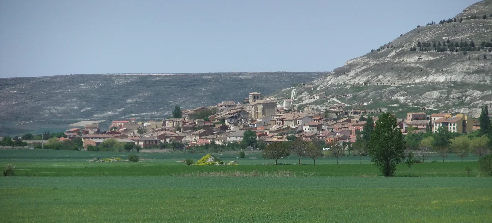

Wasser, eine Wasserquelle – was für eine wunderbare Sache! Du stillst deinen Durst, andere Pilger tun es dir gleich, und jemand sagt: „Ich gehe weiter, die Herbergen hier sind bestimmt überfüllt.“ Du schaust auf die Uhr, fühlst dich gut  und denkst: Noch eine kleine Anstrengung, dann schaffst du noch ein paar Kilometer. Du nimmst dein gelbes Buch zur Hand und siehst: „Itero de la Vega“, nur  10 km entfernt und mit Übernachtungsmöglichkeiten dort. Na dann, los geht’s!

---
Água, uma fonte de água – que coisa maravilhosa! Sacias a tua sede, outros peregrinos fazem o mesmo, e alguém diz: «Vou continuar, as pousadas por aqui devem estar lotadas.» Olhas para o relógio, sentes-te bem e pensas: «Mais um pequeno esforço e consegues percorrer mais alguns quilómetros.» Pegas no teu livro amarelo e vês: «Itero de la Vega», a apenas 10 km de distância e com alojamento disponível lá. Então, vamos lá!

---
Agua, un manantial… ¡qué maravilla! Sacias tu sed, otros peregrinos hacen lo mismo que tú, y alguien dice: «Yo sigo adelante, seguro que los albergues de por aquí están a rebosar». Miras el reloj, te sientes bien  y piensas: «Un pequeño esfuerzo más y podrás recorrer unos kilómetros más». Coges tu libreta amarilla y ves: «Itero de la Vega», a solo  10 km de distancia y con alojamiento allí. ¡Pues nada, allá vamos!

---
Water, a spring – what a marvellous thing! You quench your thirst, other pilgrims do the same, and someone says: ‘I’m carrying on; the hostels here are bound to be packed.’ You glance at your watch, feel good  and think: just a little more effort, and you’ll manage a few more kilometres. You pick up your yellow guidebook and see: ‘Itero de la Vega’, just  10 km away and with accommodation available there. Right then, let’s go!

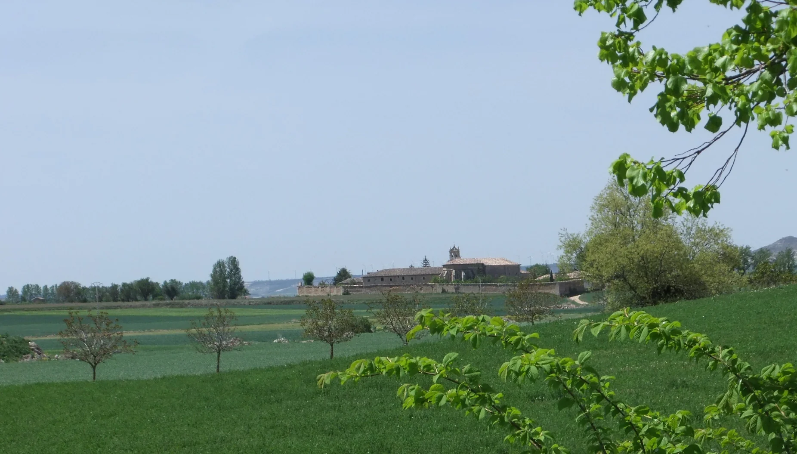

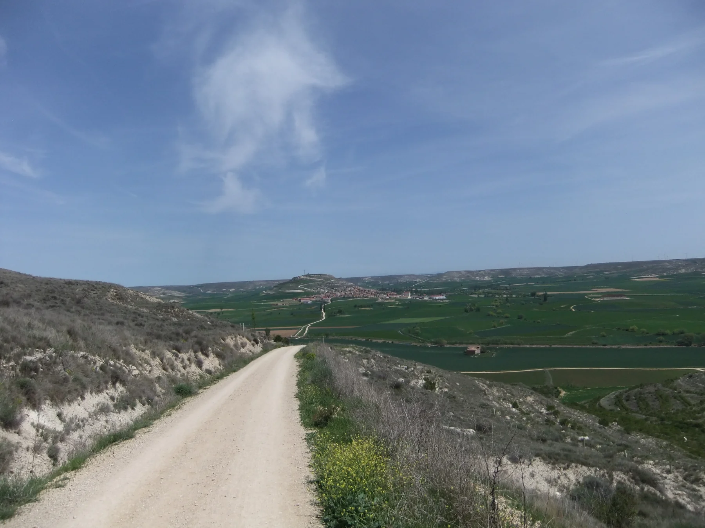

Ein Blick zurück auf Castrojeriz, Kurz vor Itero de la Vega

---

  

🇬🇧
🇪🇸
🇵🇹
🇩🇪

---

**↪** [Etapa-13](Etapa-13.md)

 🔁 [Camino-Frances_Etapas](Camino-Frances_Etapas.md)

 ...→