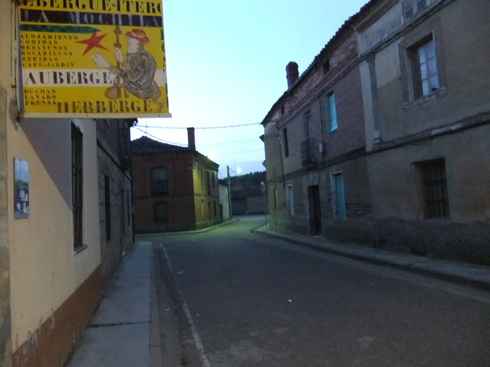
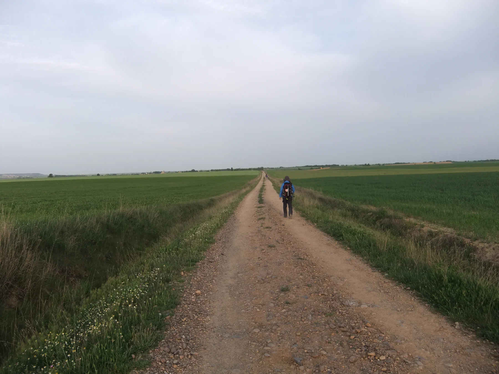
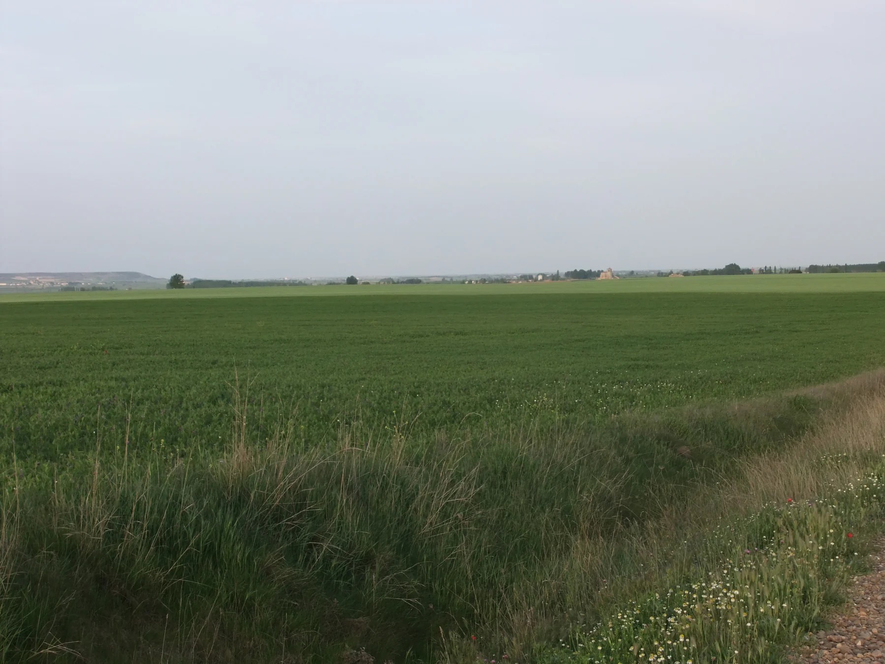

## Camino Francés  2012  

### Etapa-14: Itero del la Vega  →   ( Km)
17 de Mai 2012

🇩🇪 Ich muss versuchen, die Geschichte über das frühere Leben voller harter Arbeit in den weiten Ebenen der Meseta zu rekonstruieren, die mir die älteren spanischen Pilgerinnen erzählt haben, die ich in Tosantos kennengelernt habe.

Ich

🇵🇹 Tenho de tentar reconstruir a história sobre a antiga vida de trabalho árduo nas vastas planícies da Meseta, contada pelas peregrinas espanholas mais velhas que conheci em Tosantos.

🇪🇸 Tengo que intentar reconstruir la historia de la antigua vida de duro trabajo en las vastas llanuras de la Meseta, tal y como me la contaron las peregrinas españolas de más edad que conocí en Tosantos.

🇬🇧 I must try to piece together the story of the hard-working life of yesteryear on the vast plains of the Meseta, as told by the elderly Spanish pilgrims I met in Tosantos.

---

  

🇬🇧
🇪🇸
🇵🇹
🇩🇪

---

**↪** [Etapa-14](Etapa-14.md)

 🔁 [Camino-Frances_Etapas](Camino-Frances_Etapas.md)

 ...→