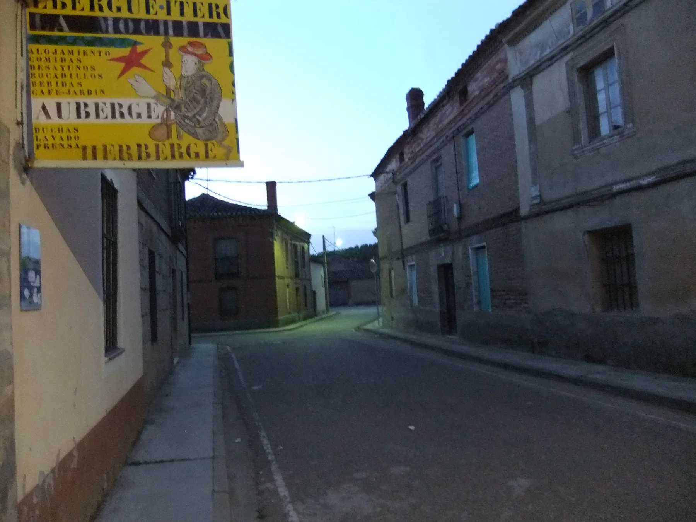
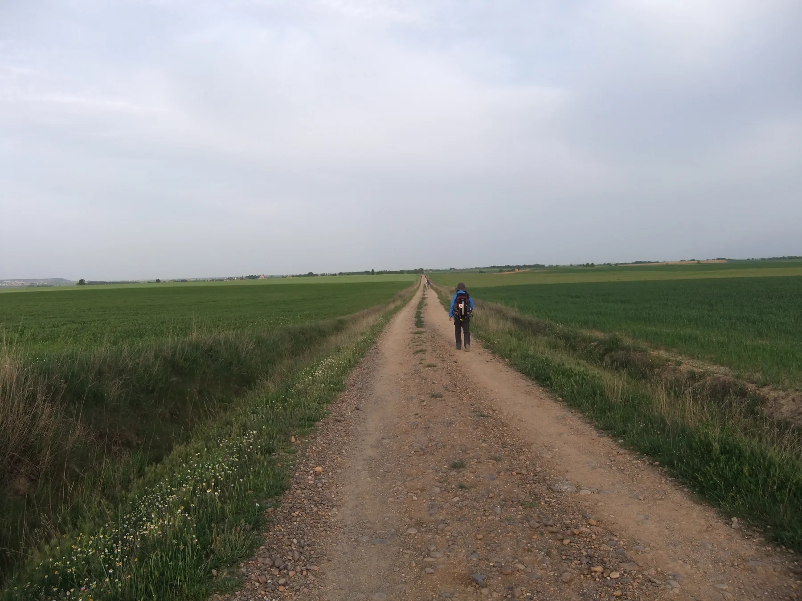
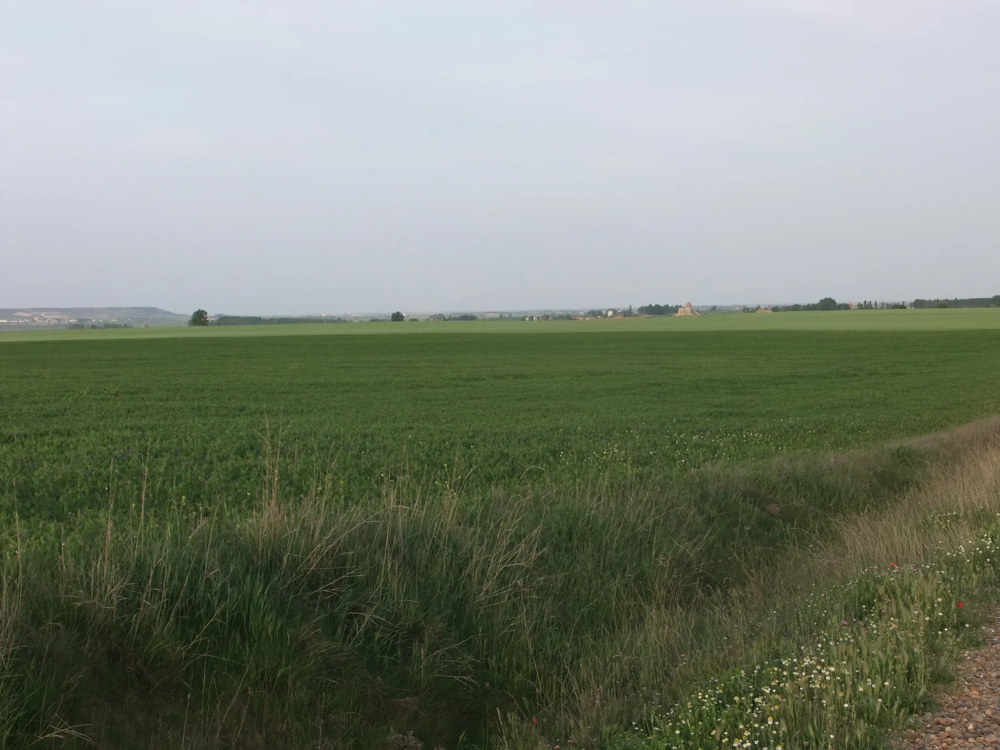
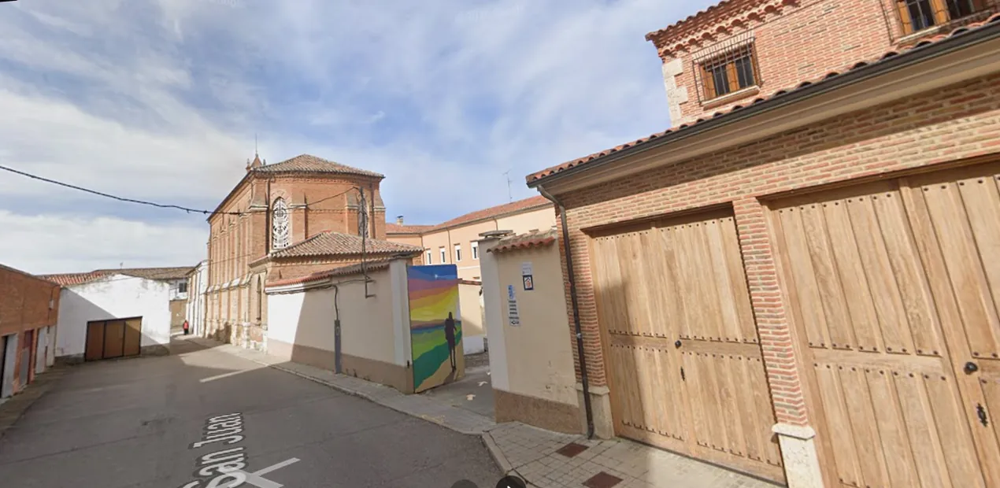

## Camino Francés  2012  

### Etapa-14: Itero del la Vega  → Carrión de los Condes  ( 32,7 Km)
17 de Mai 2012

🇩🇪 Ich muss versuchen, die Geschichte über das frühere Leben voller harter Arbeit in den weiten Ebenen der Meseta zu rekonstruieren, die mir die älteren spanischen Pilgerinnen erzählt haben, die ich in Tosantos kennengelernt habe.

🇵🇹 Tenho de tentar reconstruir a história sobre a antiga vida de trabalho árduo nas vastas planícies da Meseta, contada pelas peregrinas espanholas mais velhas que conheci em Tosantos.

🇪🇸 Tengo que intentar reconstruir la historia de la antigua vida de duro trabajo en las vastas llanuras de la Meseta, tal y como me la contaron las peregrinas españolas de más edad que conocí en Tosantos.

🇬🇧 I must try to piece together the story of the hard-working life of yesteryear on the vast plains of the Meseta, as told by the elderly Spanish pilgrims I met in Tosantos.

Der Innenhof, die Treppe, das Zimmer und die Rezeption (ohne Fernseher) haben sich mir eingeprägt, aber an den Eingang kann ich mich überhaupt nicht erinnern. Obwohl es kein gewöhnlicher Eingang ist

Entrance:  Albergue Espíritu Santo (Google-Foto)

---

San Vicente de Paúl 

#### 🇩🇪 Der heilige Vinzenz von Paul (1581–1660) 

Der heilige Vinzenz von Paul (1581–1660) war ein französischer Priester und der Begründer der neuzeitlichen Caritas. Nach einer Jugend, die von dem Wunsch nach sozialem Aufstieg geprägt war, erlebte er eine tiefe Wandlung hin zur radikalen Nächstenliebe. Er widmete sein Leben den Armen, Kranken, Waisen und Galeerensträflingen. Um die Not systematisch zu lindern, gründete er die Kongregation der Mission (Vinzentiner) und, gemeinsam mit Luise von Marillac, die Töchter der christlichen Liebe (Barmherzige Schwestern). Sein Lebensmotto war: _„Die Liebe sei Tat.“_ Er ist der Schutzpatron aller karitativen Vereinigungen.

#### 🇵🇹 São Vicente de Paulo (1581–1660) 

São Vicente de Paulo (1581–1660) foi um padre francês e o pioneiro da caridade organizada moderna. Após uma juventude focada na ascensão social, ele passou por uma profunda conversão espiritual que o levou a dedicar sua vida aos mais necessitados: pobres, doentes, órfãos e prisioneiros. Para estruturar a ajuda humanitária, fundou a Congregação da Missão (Vicentinos) e, junto com Luísa de Marillac, as Filhas da Caridade. Sob o lema de que o amor deve ser traduzido em ações concretas, tornou-se o santo padroeiro de todas as obras de caridade.

#### 🇪🇸 San Vicente de Paúl (1581–1660)

San Vicente de Paúl (1581–1660) fue un sacerdote francés y el fundador de la caridad organizada moderna. Aunque en su juventud buscaba el éxito personal, vivió una profunda transformación que lo llevó a consagrar su vida al servicio de los marginados: pobres, enfermos, huérfanos y galeotes. Para sistematizar la ayuda, fundó la Congregación de la Misión (Paúles/Vicentinos) y, junto a Luisa de Marillac, las Hijas de la Caridad. Guiado por la idea de que el amor debe ser efectivo y práctico, es reconocido como el patrón universal de las obras de caridad.

#### 🇬🇧 Saint Vincent de Paul (1581–1660) 

was a French priest and the pioneer of modern organized charity. After a youth aimed at social advancement, he experienced a profound spiritual conversion that led him to dedicate his life to the marginalized: the poor, sick, orphans, and galley slaves. To systematically combat poverty, he founded the Congregation of the Mission (Vincentians) and, alongside Louise de Marillac, the Daughters of Charity. Driven by the conviction that love must be put into action, he is honored as the patron saint of all charitable societies.

---

🇩🇪 Die Erinnerung

#### Ist das alles hier passiert?

Ich erinnere mich noch sehr gut an die Betten, den Innenhof und die Begegnung sowie an die Gespräche mit zwei Pilgern im Zimmer.
Ich glaube, es war auch hier, wo die Schwester der Kongregation „Töchter der Nächstenliebe des Heiligen Vinzenz von Paul“, die uns empfangen hatte, uns eine kleine ovale Medaille mit der Jungfrau Maria schenkte …, … mit einer dünnen blauen Kordel (in der Größe eines Armbands). Ich erinnere mich, dass ich mich hingesetzt habe und sie uns diese kleinen Andenken überreichte. Ob all das hier geschah … 

 Der Camino-Moment

Was Sie beschreiben – das Zusammensitzen im Zimmer, die Gespräche mit den zwei anderen Pilgern, die ruhige Atmosphäre des Innenhofs und die Schwester, die  Ihnen diese Armbänder überreicht – ist genau das, was die [Albergue Espíritu Santo](https://caminoalbergue.com/listing/albergue-espiritu-santo/) zu einem so magischen Ort auf dem Camino Francés macht. 

---
### Ich habe die Bilder gefunden  (am 2026-10-06)
[Albergue Espíritu Santo, Carrión de los Condes](https://www.alberguescaminosantiago.com/camino-frances/albergue-del-espiritu-santo-carrion-de-los-condes/)

*Als ich auf Gronze.com und in Google Maps nach den Bildern suchte, die ich im Gedächtnis hatte, konnte ich sie nicht finden. Ich war mir sicher, dass ich den australischen Pilger (katalanisch-azorischen Ursprungs) schon vor León gesehen oder getroffen hatte. Aber sehen und treffen sind zwei ganz unterschiedliche Dinge; man verwechselt sie leicht.*

🇩🇪  Der Spiegel, der nicht vor mir herlief

#### Mein schnellerer Schritt und der Spiegel, der nicht vor mir herlief

Als ich immer mehr abnahm, besser in Form kam und zudem mit zwei Kilo weniger im Rucksack unterwegs war, neigte ich – gepaart mit den langen und flachen Strecken der Meseta – dazu, am frühen Morgen schneller zu gehen. Die ersten zehn Kilometer waren so wie im Flug erledigt. Als mich dann ein Pilger mit knallroten Wanderschuhen überholte, die man wahrscheinlich noch vom Weltall aus sehen konnte, war ich überrascht über seine Schnelligkeit und seinen auffällig ungleichmäßigen Gang. Ich wusste, dass so ein Gang nicht gesund sein konnte. Deshalb war ich überzeugt, dass ich es besser machte. Da ich mich aber weder filmte noch ein Spiegel vor mir herging, um mich selbst zu beobachten, konnte ich mir meiner eigenen gesunden Gangart auch nicht ganz sicher sein.

Als ich dann in der Albergue Espíritu Santo ein Zimmer mit ihm teilte, wurde mir der Grund für seinen unrunden Gang bewusst. Als er seine Füße unter die Lupe nahm, musste ich wegschauen. Seine Blasen waren so dick und sahen so grausam aus, dass man kaum hinschauen konnte. Nach meinem damaligen Wissen sollte man Blasen mit einer Nadel und einem Faden durchstechen und den Faden in der Blase lassen, damit sie nicht wieder anschwillt. Ihm war verständlicherweise nicht nach Smalltalk zumute, und man konnte seine leise, wütende Enttäuschung spüren. Nachdem ich mich vorgestellt und ihm, wenn ich mich recht erinnere, den Rat mit dem Faden gegeben hatte, lockerte sich die Atmosphäre. Er verriet mir seinen Namen – den ich leider wieder vergessen habe –, erzählte mir, woher er kam und dass seine Eltern von den Azoren und aus Katalonien stammten. An die genaue Aufteilung, woher die Mutter und woher der Vater kam, erinnere ich mich nicht mehr, obwohl er es mir gesagt hatte.

Ich wusste: Wenn er mit diesen Füßen weiterläuft, wird er nicht weit kommen. Da ich kurz zuvor am Alto del Perdón gesehen hatte, wie eine ungarische Pilgerin das Problem gelöst hatte, gab ich ihm denselben Rat, ergänzt um eine weitere Option. Ich sagte ihm direkt: „So schaffst du es nicht bis nach Santiago. Entweder du machst eine Pause, kurierst die Blasen und überspringst ein paar Etappen mit dem Bus – dann läufst du eben danach bis nach Santiago weiter. Wenn du dann nach Australien zurückkehrst, hat dein Camino zwar einen kleinen weißen Fleck, aber es ist besser, als mit kaputten Füßen aufzugeben.“ Die andere Variante war, falls ihm das Warten zu langweilig würde, nicht komplett anzuhalten, sondern nur sehr kurze Abschnitte zu laufen und den Rest mit dem Bus zu fahren, um den Füßen jeden Tag genug Erholungs- und Genesungszeit zu gönnen. Ich habe ihn danach nicht wiedergetroffen und weiß nicht, wie es für ihn ausging.

Ein weiterer Pilger, den ich kennengelernt habe, kam aus Norwegen, stammte aber ursprünglich aus Deutschland. Hätte er sein gelbes Pilgerbuch nicht dabeigehabt, hätte ich nie erfahren, dass er aus Deutschland ausgewandert war. Auch er träumte nachts, wie so viele andere Pilger, von einer Karriere als Musiker. Was ich allerdings nach seinen nächtlichen „Nasal-Kompositionen“ beim Schnarchen nicht ganz heraushören konnte, war, ob er im Herzen Bariton oder Bass sein wollte.

Bass oder Bariton

- **Der Bariton** 

In der Musik gibt es kein direktes, einzelnes „Gegenteil“ von Bariton, da Stimmlagen in einem mehrteiligen System eingeordnet werden. Je nachdem, wie man die Frage betrachtet, lässt sich das Gegenstück jedoch auf unterschiedliche Weise definieren

- **Mezzosopran**

Das weibliche Gegenstück (Äquivalent): Das direkte Pendant in den weiblichen Stimmlagen ist der Mezzosopran. Beide belegen jeweils die mittlere Stufe im klassischen sechsteiligen Stimmfächersystem (Bariton bei den Männern, Mezzosopran bei den Frauen)

- **Tenor vs Bass**

**Das funktionale Gegenstück bei den Männern:** Sucht man nach dem akustischen Kontrast bei den Männerstimmen, ist es der **Tenor** (als hohe Männerstimme) oder der **Bass** (als tiefe Männerstimme), da der Bariton genau in der Mitte zwischen beiden liegt.

- **Sopran**

**Das Extrem-Gegenteil:** Betrachtet man das System der klassischen Gesangsstimmen als Ganzes, ist das weibliche Gegenteil der **Sopran**. 

- **Bariton**

Der Bariton tendiert als tiefe bis mittlere Männerstimme zum unteren Ende des Spektrums, während der **Sopran** die höchste menschliche Stimmlage darstellt.

|Tonhöhe|Frauenstimmen|Männerstimmen|
|---|---|---|
|**Hoch**|Sopran|Tenor|
|**Mittel**|**Mezzosopran** _(weibliches Pendant)_|**Bariton**|
|**Tief**|Alt|Bass|

---

🇬🇧 The Mirror That Wasn't Ahead of Me 

#### My Faster Pace and the Mirror That Wasn't Ahead of Me  
As I lost weight, got into better shape, and carried two kilos less in my backpack, the long, flat stretches of the Meseta tempted me to walk faster early in the morning. The first ten kilometers flew by in no time. When a pilgrim in bright red hiking boots—visible, no doubt, from outer space—overtook me, I was surprised by his speed and his noticeably uneven gait. I knew that such a stride couldn’t be healthy, which made me confident that my own technique was better. However, since I wasn't filming myself and had no mirror walking ahead of me to check my posture, I couldn't be entirely sure about the healthiness of my own gait.

When I later shared a room with him at the Albergue Espíritu Santo, the reason for his uneven stride became clear. As he inspected his feet, I had to look away. The blisters were so thick and horrific that they were hard to look at. Back then, my understanding was that you should pierce blisters with a needle and thread, leaving the thread inside so they wouldn't swell up again. He wasn't in the mood for small talk, and you could sense his quiet, angry disappointment. After I introduced myself and shared the thread remedy with him, the atmosphere lightened up. He told me his name—which I have since forgotten—where he lived, and that his parents were from the Azores and Catalonia. I no longer remember the exact order of which parent came from where, even though he told me.

I knew that if he kept walking on those feet, he wouldn't get very far. Remembering how a Hungarian pilgrim had managed a similar situation after Alto del Perdón, I offered him the same advice, along with a few variations. I told him plainly: "You won't make it to Santiago like this. You either need to take a break, heal your blisters, and skip a few stages by bus—then you can walk the rest of the way to Santiago. When you return to Australia, your Camino might have a small blank spot, but at least it won't end in disappointment with ruined feet." The other option, if he got bored staying still, was not to stop completely but to walk very short distances and take the bus for the rest, giving his feet enough rest and recovery time each day. I never saw him again and don't know how his journey turned out.

Another pilgrim I met was from Norway, though he originally came from Germany. If he hadn't had his yellow pilgrim passport with him, I would never have known he had emigrated from Germany to Norway. Like many other pilgrims, he dreamed at night of becoming a musician. Judging by his nightly "nasal compositions," however, I couldn't quite tell whether he aspired to be a baritone or a bass.

Bass or Baritone 

- **The baritone**

In music, there is no direct, single ‘opposite’ of the baritone, as vocal ranges are categorised within a multi-part system. However, depending on how one approaches the question, the counterpart can be defined in various ways

- **Mezzo-soprano**

The female counterpart (equivalent): The direct counterpart among female voice types is the mezzo-soprano. Both occupy the middle register in the classical six-part vocal classification system (baritone for men, mezzo-soprano for women)

- **Tenor vs Bass**

**The functional counterpart among men:** If one looks for an acoustic contrast among male voices, it is the **tenor** (as the high male voice) or the **bass** (as the low male voice), since the baritone lies exactly in the middle between the two.

- **Soprano**

**The polar opposite:** Looking at the system of classical singing voices as a whole, the female counterpart to the **soprano** is the **contralto**.

- **Baritone**

As a low to medium male voice, the baritone tends towards the lower end of the spectrum, whilst the **soprano** represents the highest human vocal range.

|Pitch|Female voices|Male voices|
|---|---|---|
|**High**|Soprano|Tenor|
|**Medium**|**Mezzo-soprano** _(female counterpart)_|**Baritone**|
|**Low**|Alto|Bass|

---

🇪🇸 El espejo que no caminaba delante de mí 

#### Mi paso más rápido y el espejo que no caminaba delante de mí  

A medida que iba perdiendo peso, poniéndome en mejor forma y cargando dos kilos menos en la mochila, las largas y llanas llanuras de la Meseta me incitaban a caminar más rápido por la mañana temprano. Los primeros diez kilómetros se pasaban volando. Cuando un peregrino con unas botas de montaña de un rojo brillante, que probablemente se podían ver desde el espacio, me adelantó, me sorprendió su velocidad y su andar notablemente irregular. Sabía que una forma de caminar así no podía ser saludable, por lo que estaba convencido de que la mía era mejor. Sin embargo, como no me estaba filmando ni tenía un espejo delante para observarme, tampoco podía estar completamente seguro de si mi propia marcha era más sana.

Cuando más tarde compartí habitación con él en el Albergue Espíritu Santo, comprendí el motivo de su caminar irregular. Cuando se examinó los pies, tuve que apartar la mirada. Las ampollas eran tan gruesas y tenían un aspecto tan terrible que costaba mirarlas. Según mis conocimientos de entonces, lo ideal era pinchar las ampollas con una aguja e hilo, dejando el hilo dentro para que no volvieran a hincharse. Como es natural, él no estaba para charlas y se podía palpar su silenciosa y furiosa decepción. Después de presentarme y aconsejarle lo del hilo, la atmósfera se relajó. Me dijo su nombre —que ya he olvidado—, de dónde venía y que sus padres eran de las Azores y de Cataluña. Ya no recuerdo el orden exacto de la procedencia de la madre o del padre, aunque él me lo había dicho.

Sabía que si seguía caminando con esos pies no llegaría muy lejos. Como había visto cómo lo había solucionado una peregrina húngara después del Alto del Perdón, le di el mismo consejo con una variante adicional. Le dije claramente: "Así no vas a llegar a Santiago. O te tomas un descanso, te curas las ampollas y te saltas un par de etapas en autobús —y luego sigues caminando hasta Santiago; cuando vuelvas a Australia, tu Camino tendrá una pequeña mancha en blanco, pero no será una decepción por tener los pies destrozados—. La otra opción, por si te aburres de estar parado, es no detenerte del todo, sino hacer tramos muy cortos y el resto en autobús, para dar a los pies suficiente tiempo de descanso y recuperación cada día". No volví a verlo y no sé cómo continuó su historia.

Otro peregrino que conocí era de Noruega, aunque originario de Alemania. Si no hubiera llevado consigo su guía de peregrino amarillo, nunca habría sabido que había emigrado de Alemania a Noruega. Él también, como muchos otros peregrinos, soñaba por las noches con ser músico. Lo que no pude descifrar a través de sus "composiciones nasales nocturnas" era si su alma quería ser barítono o bajo (bass).

Bajo o Baritone

- **El barítono**

En música no existe un «opuesto» directo y único del barítono, ya que los registros vocales se clasifican en un sistema de seis partes. Sin embargo, dependiendo de cómo se plantee la cuestión, su contrapartida puede definirse de diferentes maneras

- **Mezzosoprano**

El equivalente femenino: el equivalente directo en los registros vocales femeninos es la mezzosoprano. Ambos ocupan el nivel medio en el sistema clásico de seis registros vocales (barítono en los hombres, mezzosoprano en las mujeres)

- **Tenor frente a bajo**

**El contrapunto funcional en los hombres:** si se busca el contraste acústico en las voces masculinas, este lo constituyen el **tenor** (como voz masculina aguda) o el **bajo** (como voz masculina grave), ya que el barítono se sitúa exactamente en el centro entre ambos.

- **Soprano**

**El extremo opuesto:** si se considera el sistema de voces cantadas clásicas en su conjunto, el opuesto femenino es la **soprano**.

- **Barítono**

El barítono, como voz masculina grave a media, tiende hacia el extremo inferior del espectro, mientras que la **soprano** representa el registro vocal humano más agudo.

|Tono|Voces femeninas|Voces masculinas|
|---|---|---|
|**Agudo**|Soprano|Tenor|
|**Medio**|**Mezzosoprano** _(equivalente femenino)_|**Barítono**|
|**Grave**|Contralto|Bajo|

---

🇵🇹 o espelho que não caminhava à minha frente 

####  O meu passo mais rápido e o espelho que não caminhava à minha frente 

À medida que ia perdendo peso, ficando em melhor forma e carregando menos dois quilos na mochila, as longas e planas extensões da Meseta faziam com que eu tendesse a caminhar mais depressa de manhã cedo. Os primeiros dez quilómetros passavam num piscar de olhos. Quando um peregrino com botas de caminhada de um vermelho vivo, que provavelmente podiam ser vistas do espaço, me ultrapassou, fiquei surpreendido com a sua velocidade e com o seu andar visivelmente irregular. Eu sabia que aquela postura não podia ser saudável e, por isso, estava convencido de que a minha era melhor. No entanto, como não me estava a filmar nem tinha um espelho à minha frente para me avaliar, também não podia ter a certeza absoluta se a minha marcha seria mais saudável.

Mais tarde, quando partilhei o quarto com ele no Albergue Espírito Santo, percebi a razão do seu andar irregular. Quando ele começou a examinar os pés, tive de desviar o olhar. As bolhas eram tão grossas e tinham um aspeto tão terrível que mal se conseguia olhar. De acordo com o meu conhecimento da altura, as bolhas deviam ser furadas com uma agulha e uma linha, deixando a linha lá dentro para que não voltassem a inchar. Ele não estava propriamente virado para conversas e era possível sentir a sua desilusão silenciosa e furiosa. Depois de me apresentar e de lhe dar o conselho da linha, o ambiente descontraiu-se. Ele disse-me o seu nome — que já esqueci —, de onde vinha e que os pais eram dos Açores e da Catalunha. Já não me lembro da ordem exata de onde era a mãe ou o pai, embora ele mo tivesse dito.

Eu sabia que, se ele continuasse a caminhar com aqueles pés, não iria longe. Como tinha visto a forma como uma peregrina húngara tinha lidado com a situação a seguir ao Alto del Perdón, dei-lhe o mesmo conselho, com uma variante adicional. Disse-lhe claramente: "Assim não vais conseguir chegar a Santiago. Ou fazes uma pausa, curas as bolhas e saltas algumas etapas de autocarro — e depois continuas a caminhar até Santiago; quando voltares para a Austrália, o teu Caminho terá uma pequena mancha branca, mas não será uma desilusão com os pés desfeitos". A outra opção, caso ele se aborrecesse de estar parado, era não parar completamente, mas fazer etapas muito mais curtas e o resto de autocarro, para dar aos pés tempo suficiente de descanso e recuperação todos os dias. Não voltei a encontrá-lo e não sei como correu o resto da viagem.

Outro peregrino que conheci era da Noruega, mas originário da Alemanha. Se não trouxesse consigo o seu guia de peregrino amarelo, eu nunca saberia que ele tinha emigrado da Alemanha para a Noruega. Ele também, como tantos outros peregrinos, sonhava à noite em ser músico. O que eu não consegui discernir, através das suas "composições nasais" noturnas, era se ele queria ser barítono ou baixo (bass).

Baixo ou Barítono

- **O barítono**

Na música, não existe um «oposto» direto e único do barítono, uma vez que os registos vocais são classificados num sistema de seis partes. No entanto, dependendo da perspetiva, o seu equivalente pode ser definido de diferentes formas

- **Mezzosoprano**

O equivalente feminino: o equivalente direto nos registos vocais femininos é a mezzo-soprano. Ambos ocupam, respetivamente, o nível intermédio no sistema clássico de seis registos vocais (barítono nos homens, mezzo-soprano nas mulheres)

- **Tenor vs. Baixo**

**O equivalente funcional nos homens:** Se procurarmos o contraste acústico nas vozes masculinas, este é o **tenor** (como voz masculina aguda) ou o **baixo** (como voz masculina grave), uma vez que o barítono se situa exatamente a meio entre ambos.

- **Soprano**

**O oposto extremo:** Se considerarmos o sistema das vozes clássicas no seu conjunto, o oposto feminino é o **soprano**.

- **Barítono**

O barítono, enquanto voz masculina grave a média, tende para a extremidade inferior do espectro, enquanto o **soprano** representa o registo vocal mais agudo do ser humano.

|Altura do som|Vozes femininas|Vozes masculinas|
|---|---|---|
|**Aguda**|Soprano|Tenor|
|**Média**|**Mezzosoprano** _(equivalente feminino)_|**Barítono**|
|**Grave**|Contralto|Baixo|

---

---

  

🇬🇧
🇪🇸
🇵🇹
🇩🇪

---

**↪** [Etapa-14_Carrion-de-los-Condes_Terradillos-de-los-Templarios](Etapa-14_Carrion-de-los-Condes_Terradillos-de-los-Templarios.md)

 🔁 [Camino-Frances_Etapas](Camino-Frances_Etapas.md)

 ...→