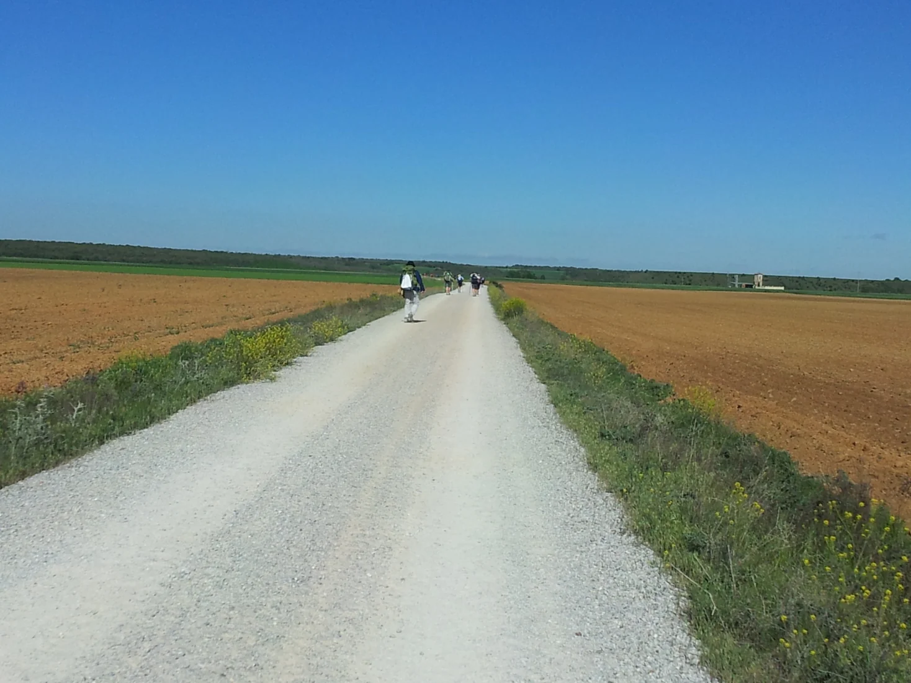
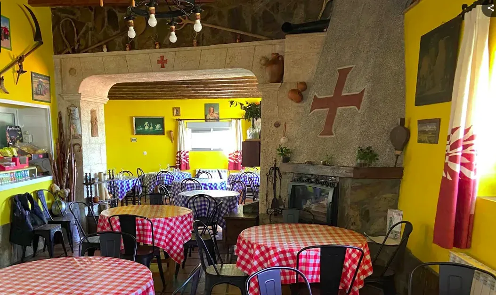
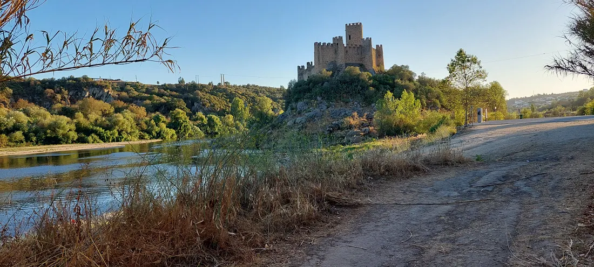

## Camino Francés  2012  

### Etapa-14: Carrión de los Condes → Terradillos de los Templarios   ( 26,3 Km)
18 de Mai 2012

Albergue Jacques de Molay (Googlefoto von Davide Violato) 

---

 🇩🇪 Pilgertagebuch & Historische Reflexion

### Pilgertagebuch & Historische Reflexion

#### 1. Herberge Jacques de Molay

Ich weiß nicht mehr genau, wo und wie ich geschlafen habe, aber die Eindrücke von dem schönen Speisesaal sind mir lebendig im Gedächtnis geblieben. Als ich den Saal betrat, war ich sofort von der Wanddekoration beeindruckt. Allerdings hatte das Abendessen durch die geringere Anzahl von Personen pro Tisch einen gewissen Restaurantcharakter, was die Atmosphäre beeinflusste. Es kam vor, dass Pilger keinen Platz mehr an dem Tisch fanden, an dem die Gefährten saßen, mit denen sie tagsüber gewandert waren. Man hörte dann Sätze wie: „Können Sie sich hier hinsetzen?“.

Zusammenfassend lässt sich sagen: Ich behalte die Herberge in guter Erinnerung, auch wenn ich mir beim gemeinsamen Essen eine etwas entspanntere Atmosphäre gewünscht hätte.

#### 2. Historischer Rückblick: Das Leben von Jacques de Molay (ca. 1244–1314)
Jacques de Molay war der 23. und letzte Großmeister des Templerordens. Er leitete den Orden in einer schweren Krise nach dem Verlust des Heiligen Landes. Im Jahr 1307 wurde er auf Befehl des verschuldeten französischen Königs Philipp IV. unter falschen Anklagen (wie Ketzerei) verhaftet. Nach jahrelanger Folter und einem erzwungenen Geständnis, das er später wieder widerrief, wurde er 1314 in Paris auf dem Scheiterhaufen verbrannt.

#### 3. Mein Urteil über das Urteil

> **Eine Intrige und die Übermacht des Königs haben ihn gerichtet. Die Ohnmacht der Kirche, gepaart mit politischem Kalkül und Angst, hat ihn nicht gerettet – obwohl jeder wusste, dass die gesamte Anklageschrift von vorne bis hinten erlogen war.**

#### 4. Ein kleiner Denkanstoß für den Weg

Oft wandern wir durch historische Orte oder stoßen auf historische Namen, ohne uns dessen wirklich bewusst zu sein – geschweige denn darüber nachzudenken, wie all das unser heutiges Leben beeinflusst hat. Ich frage mich: Wie wäre die Geschichte Europas wohl verlaufen, wenn der mächtige Templerorden damals nicht zerschlagen worden wäre?

- **Ein eigenständiger Templer-Staat:** Die Templer besaßen bereits riesige Ländereien in ganz Europa. Ohne die Zerschlagung hätten sie – ähnlich wie später der Deutsche Orden im Baltikum – ein völlig unabhängiges, reiches Staatsgebiet mitten in Europa oder im Mittelmeerraum gründen können.
- **Die Erfinder des modernen Bankenwesens:** Da die Templer das erste internationale Bankensystem kontrollierten, hätten sie sich zu einer übermächtigen Zentralbank Europas entwickeln können. Könige und Kaiser wären dauerhaft finanziell von ihnen abhängig geblieben, was die absolute Macht der Monarchen stark eingeschränkt hätte.
- **Ein Gegengewicht zum Papst:** Mit ihrer enormen militärischen und finanziellen Macht hätten die Templer die Kirche reformieren oder zu einer unabhängigen religiösen Großmacht werden können. Die Reformation oder die Glaubenskriege in Europa wären dadurch völlig anders verlaufen.

 🇩🇪 Portugal existiert nicht

#### Portugal existiert nicht
**Und Brasilien hat noch nie die Fußball-Weltmeisterschaft gewonnen**.

- **Ohne die Templer gäbe es kein Portugal:** Der Orden war die militärische Eliteeinheit, die dem ersten König, Afonso Henriques, ab 1128 half, das Land gegen die Mauren und Kastilien zu verteidigen. Hätte Dinis I. den Orden 1312 komplett zerschlagen (oder hätten die Templer die Unabhängigkeitskriege nicht unterstützt), wäre das junge Portugal vermutlich kollabiert und von Kastilien (dem heutigen Spanien) geschluckt worden. 
- **Die Entdeckungsgeschichte wäre gescheitert:** Der spätere Christusorden finanzierte und plante die großen Entdeckungsfahrten. Heinrich der Seefahrer war Großmeister dieses Nachfolgeordens. Das gesamte maritime Wissen der Templer floss in den Schiffbau (die Karavellen) und die Kartografie. Ohne dieses Erbe und das Templervermögen wäre die europäische Expansion nach Indien und Brasilien so nie passiert.

> Ich bin mit zwölf Jahren nicht um vier Uhr morgens aufgestanden, um an einem Schulausflug nach Tomar teilzunehmen – nur um dort zu erfahren, dass die Templer beim Messebesuch nicht einmal von ihren Pferden absteigen mussten, um die Kirche zu betreten. Und ich habe auch nicht am Kreuz von Atapuerca einen japanisch-brasilianischen Pilger kennengelernt, der fließenderes brasilianisches Portugiesisch sprach als ich selbst.

---

An einem strahlenden Sonntagmorgen im August machte ich einen Spaziergang am Ufer des Tejo entlang, um die Knoten zu lösen, die meine Gedanken bedrückten, und mich von ihnen zu befreien. Ich rang mit mir selbst: Was sollte ich tun?

- Burg von Almourol
  

**Etwa 718 Jahre zuvor: „39°27'43,7“ N 8°23'03,8“ W“. Als die Templer diese Burg erblickten, wussten sie, dass sie wohlbehalten im Gelobten Land angekommen waren.**

---

**Alles, was Sie hier lesen, stammt aus einem Paralleluniversum, denn auch ich existiere nicht und nichts davon ist jemals geschehen.**

---

🇵🇹  Diario de Peregrinação e uma Refleção Histórica 

### Diario de Peregrinação e uma Refleção Histórica

#### 1. Albergue Jacques de Molay

Já não me lembro exatamente onde ou como dormi, mas as impressões do belo refeitório continuam bem vivas na minha memória. Ao entrar no salão, fiquei logo impressionado com a decoração das paredes. No entanto, devido ao menor número de pessoas por mesa, o jantar acabou por ter um certo ambiente de restaurante, o que afetou a atmosfera. Por vezes, alguns peregrinos já não conseguiam lugar à mesa dos companheiros com quem tinham caminhado durante o dia, ouvindo-se frases como: "Pode sentar-se aqui?".

**Em resumo:** guardo boas recordações do albergue, embora tenha sentido falta de um ambiente mais descontraído durante o jantar comunitário.

#### 2. Contexto Histórico: A Vida de Jacques de Molay (c. 1244–1314)

Jacques de Molay foi o 23.º e último Grão-Mestre da Ordem dos Templários. Liderou a ordem durante uma grave crise após a perda da Terra Santa. Em 1307, foi preso sob falsas acusações (como heresia) por ordem do endividado rei francês Filipe IV. Após anos de tortura e de uma confissão forçada — que mais tarde revogou —, foi executado na fogueira em Paris, em 1314.

#### 3. O meu veredicto sobre a sentença

> **Uma intriga e a prepotência do rei condenaram-no. A impotência da Igreja, combinada com o cálculo político e o medo, não o salvou – apesar de todos saberem que tudo o que constava na acusação era pura mentira.**

#### 4. Um pequeno tema de reflexão para o caminho

Muitas vezes caminhamos por lugares históricos ou deparamo-nos com nomes históricos sem termos verdadeira consciência disso – e muito menos sem debatermos como tudo isso influenciou as nossas vidas de hoje. Pergunto-me: como teria corrido a história da Europa se a poderosa Ordem dos Templários não tivesse sido destruída?

- **Um Estado Templário independente:** Os Templários já possuíam vastas terras por toda a Europa. Se não tivessem sido destruídos, poderiam ter fundado um território totalmente independente e rico no coração da Europa ou na região do Mediterrâneo, tal como a Ordem Teutónica fez mais tarde no Báltico.
- **Os pioneiros da banca moderna:** Como controlavam o primeiro sistema bancário internacional, os Templários poderiam ter-se tornado um banco central europeu todo-poderoso. Reis e imperadores teriam ficado permanentemente dependentes deles a nível financeiro, o que teria limitado o poder absoluto das monarquias.
- **Um contrapeso ao Papa:** Com o seu enorme poder militar e financeiro, os Templários poderiam ter reformado a Igreja ou tornado-se uma superpotência religiosa independente. Como resultado, a Reforma Protestante ou as guerras religiosas na Europa teriam tomado um rumo completamente diferente.

🇵🇹 Portugal não existe 

#### Portugal não existe
**E o Brasil ainda nunca ganhou o Campeonato do Mundo de Futebol**.

- **Sem os Templários, Portugal não existiria:** A Ordem foi a força militar de elite que ajudou o primeiro rei, D. Afonso Henriques, a partir de 1128, a defender o território contra os Mouros e Castela. Se D. Dinis tivesse destruído completamente a Ordem em 1312 (ou se os Templários não tivessem apoiado as guerras de independência), o jovem reino de Portugal teria provavelmente colapsado e sido absorvido por Castela (a atual Espanha).
- **A Era dos Descobrimentos teria fracassado:** A posterior Ordem de Cristo financiou e planeou as grandes viagens ultramarinas. O Infante D. Henrique (Henrique, o Navegador) era o Grão-Mestre desta ordem sucessora. Todo o conhecimento marítimo dos Templários foi canalizado para a construção naval (as caravelas) e a cartografia. Sem este legado e a fortuna templária, a expansão europeia rumo à Índia e ao Brasil nunca teria acontecido desta forma.

> Não acordei às quatro da manhã aos doze anos para ir numa excursão escolar a Tomar – apenas para descobrir que os Templários nem precisavam de desmontar dos seus cavalos para entrar na igreja e assistir à missa. E também não conheci, na Cruz de Atapuerca, aquele peregrino nipo-brasileiro que falava um português do Brasil melhor do que o meu.

---
Numa radiante manhã de domingo de agosto, dei um passeio ao longo da margem do Tejo para desatar os nós que me oprimiam os pensamentos e libertar-me deles. Debatia-me comigo mesmo: o que deveria fazer?

- Castillo de Almourol

  
**Cerca de 718 anos  antes: «39°27'43.7“N 8°23'03.8”W». Quando os Templários avistaram este castelo, souberam que tinham chegado sãos e salvos à Terra Prometida.**

---

**Tudo o que aqui lêem provém de um universo paralelo, pois eu também não existo e nada disto aconteceu.**

---

 🇪🇸 Diario de Peregrinación y Reflexión Histórica 

###  Diario de Peregrinación y Reflexión Histórica

#### 1. Albergue Jacques de Molay

Ya no recuerdo exactamente dónde ni cómo dormí, pero las impresiones del hermoso comedor siguen muy vivas en mi memoria. Al entrar en el salón, me impresionó de inmediato la decoración de las paredes. Sin embargo, debido al menor número de personas por mesa, la cena adquirió un cierto carácter de restaurante, lo que afectó a la atmósfera. A veces ocurría que algunos peregrinos ya no encontraban sitio en la mesa de los compañeros con los que habían caminado durante el día, y se oían frases como: "¿Puede sentarse aquí?".

>**En resumen:** guardo buenos recuerdos del albergue, aunque eché de menos un ambiente más relajado durante la cena comunitaria.

#### 2. Contexto Histórico: La Vida de Jacques de Molay (c. 1244–1314)

Jacques de Molay fue el vigesimotercer y último Gran Maestre de la Orden de los Templarios. Dirigió la orden durante una profunda crisis tras la pérdida de Tierra Santa. En 1307, fue arrestado bajo falsas acusaciones (como heredad) por orden del endeudado rey francés Felipe IV. Tras años de torturas y una confesión forzada que más tarde revocó, fue quemado en la hoguera en París en 1314.

#### 3. Mi veredicto sobre la sentencia

> **Una intriga y la superioridad absoluta del rey lo condenaron. La impotencia de la Iglesia, sumada al cálculo político y al miedo, no lo salvó, a pesar de que todos sabían que cada palabra de la acusación era una completa mentira.**

#### 4. Un pequeño tema de reflexión para el camino

A menudo caminamos por lugares históricos o tropezamos con nombres históricos sin ser realmente conscientes de ello, y mucho menos sin debatir cómo todo eso ha influido en nuestras vidas actuales. Me pregunto: ¿cómo habría transcurrido la historia de Europa si la poderosa Orden de los Templarios no hubiera sido destruida?

- **Un Estado Templario independiente:** Los Templarios ya poseían inmensas tierras en toda Europa. Si no hubieran sido destruidos, podrían haber fundado un territorio soberano, rico e independiente en el corazón de Europa o en la cuenca del... Mediterráneo, de manera similar a lo que hizo más tarde la Orden Teutónica en el Báltico.
- **Los pioneros de la banca moderna:** Al controlar el primer sistema bancario internacional, los Templarios podrían haberse transformado en un banco central europeo todopoderoso. Los reyes y emperadores habrían dependido financieramente de ellos de forma permanente, lo que habría limitado drásticamente el poder absoluto de las monarquías.
- **Un contrapeso al Papa:** Con su enorme fuerza militar y financiera, los Templarios hubieran podido reformar la Iglesia desde dentro o convertirse en una potencia religiosa independiente. Esto habría cambiado por completo el rumbo de la Reforma o de las guerras de religión en Europa.

 🇪🇸 Portugal no existe  

#### Portugal no existe
- **Y Brasil nunca ha ganado el Mundial de fútbol**.

- **Sin los Templarios, Portugal no existiría:** La Orden fue la fuerza militar de élite que ayudó al primer rey, Alfonso Henriques , a partir de 1128, a defender el territorio contra los musulmanes y contra Castilla. Si el rey  Dionisio  hubiera destruido por completo la Orden en 1312 (o si los Templarios no hubieran apoyado las guerras de independencia), el joven reino de Portugal probablemente habría colapsado, siendo absorbido por Castilla (la actual España).
- **La Era de los Descubrimientos habría fracasado:** La posterior Orden de Cristo financió y planificó los grandes viajes transoceánicos. Enrique el Navegante  era el Gran Maestre de esta orden sucesora. Todo el conocimiento marítimo de los Templarios se aplicó a la construcción naval (las carabelas) y a la cartografía. Sin este legado y la fortuna templaria, la expansión europea hacia la India y Brasil jamás habría ocurrido de esta manera. 

> No me levanté a las cuatro de la mañana a los doce años para ir en una excursión escolar a Tomar, solo para descubrir allí que los Templarios ni siquiera tenían que bajarse de sus caballos para entrar a la iglesia y asistir a misa. Y tampoco conocí, en la Cruz de Atapuerca, a aquel peregrino nipón-brasileño que hablaba un portugués brasileño mejor que el mío.

---

Una radiante mañana de domingo de agosto, paseaba por la orilla del Tajo para desatar los nudos que oprimían mis pensamientos y liberarme de ellos. Luchaba conmigo mismo: ¿qué debía hacer?

- Castillo de Almourol
  

**Unas 718  años antes: «39°27'43.7"N 8°23'03.8"O». Cuando los templarios divisaron este castillo, supieron que habían llegado sanos y salvos a la tierra prometida.**

---

**Todo lo que leéis aquí procede de un universo paralelo, pues yo tampoco existo y nada de esto ha sucedido.**

---

 🇬🇧 English: Pilgrimage Journal & Historical Reflection  

### 🇬🇧 English: Pilgrimage Journal & Historical Reflection

#### 1. Jacques de Molay Hostel

I no longer remember exactly where or how I slept, but the impressions of the beautiful dining hall remain vivid in my memory. Upon entering the hall, I was immediately struck by the wall decorations. However, due to the smaller number of people per table, the dinner felt a bit like a commercial restaurant, which affected the atmosphere. Sometimes, pilgrims could no longer find a seat at the table with the companions they had walked with during the day, leading to remarks like, "Can you sit here?".

> **In summary:** I have fond memories of the hostel, although I missed having a more relaxed atmosphere during the communal meal.

#### 2. Historical Background: The Life of Jacques de Molay (c. 1244–1314)

Jacques de Molay was the 23rd and final Grand Master of the Knights Templar. He led the order during a severe crisis following the loss of the Holy Land. In 1307, he was arrested on false charges (such as heresy) by order of the indebted French King Philip IV. After years of torture and a forced confession, which he later retracted, he was burned at the stake in Paris in 1314.

#### 3. My verdict on the judgment

An intrigue and the overwhelming power of the king condemned him. The powerlessness of the Church, coupled with political calculation and fear, failed to save him – even though everyone knew that the entire indictment was nothing but a pack of lies.

#### 4. A little food for thought for the journey

Often we walk through historical places or come across historical names without really being aware of it – let alone discussing how all of this has shaped our lives today. I wonder: how would the history of Europe have unfolded if the powerful Knights Templar had not been destroyed?

- **An Independent Templar State:** The Templars already owned vast tracts of land across Europe. Had they not been destroyed, they might have established a fully independent, wealthy sovereign territory in the heart of Europe or the Mediterranean network—similar to what the Teutonic Order later achieved in the Baltic region.
- **The Pioneers of Modern Banking:** Since the Templars controlled the first international banking system, they could have evolved into an all-powerful central bank for Europe. Kings and emperors would have remained permanently dependent on them financially, severely curbing the rise of absolute monarchies.
- **A Counterweight to the Pope:** With their immense military and financial power, the Templars could have forced a reformation of the Church or established themselves as an independent religious superpower. Consequently, the Protestant Reformation or Europe's religious wars would have unfolded in a completely different way.

---

#### 🇬🇧 Portugal does not exist   

####  Portugal does not exist

**And Brazil has never won the World Cup**.

- **Without the Templars, Portugal would not exist:** The Order was the elite military force that helped the first king,  Afonso Henriques , from 1128 onward, to defend the land against the Moors and Castile. Had King Dinis completely destroyed the order in 1312 (or had the Templars not supported the independence wars), the young country of Portugal would likely have collapsed and been swallowed by Castile (modern-day Spain).
- **The Age of Discovery would have failed:** The subsequent Order of Christ financed and planned the great voyages of exploration. Henry the Navigator was the Grand Master of this successor order. The Templars' entire maritime knowledge was funneled into shipbuilding (the caravels) and cartography. Without this legacy and the Templar fortune, the European expansion to India and Brazil would never have happened in the way it did. 

> I didn't get up at four in the morning when I was twelve years old for a school trip to Tomar—only to find out that the Templars didn't even have to dismount from their horses to enter the church for mass. And I didn't meet that Japanese-Brazilian pilgrim at the Cross of Atapuerca either, who spoke better Brazilian Portuguese than I did.

---

On a glorious Sunday morning in August, I went for a walk along the banks of the Tagus to untangle the knots that were weighing on my thoughts and free myself from them. I was wrestling with myself: what should I do?
- Almourol Castle
  

About 65 hours earlier: ‘39°27'43.7“N 8°23'03.8”W’. When the Templars caught sight of this castle, they knew they had arrived safe and sound in the Promised Land.

---

**Everything you read here comes from a parallel universe, for I do not exist either, and none of this ever happened.**

---

  

🇬🇧
🇪🇸
🇵🇹
🇩🇪

---

**↪** [Etapa-15_Terradillos-de-los-Templarios_Reliegos](Etapa-15_Terradillos-de-los-Templarios_Reliegos.md)

 🔁 [Camino-Frances_Etapas](Camino-Frances_Etapas.md)

 ...→