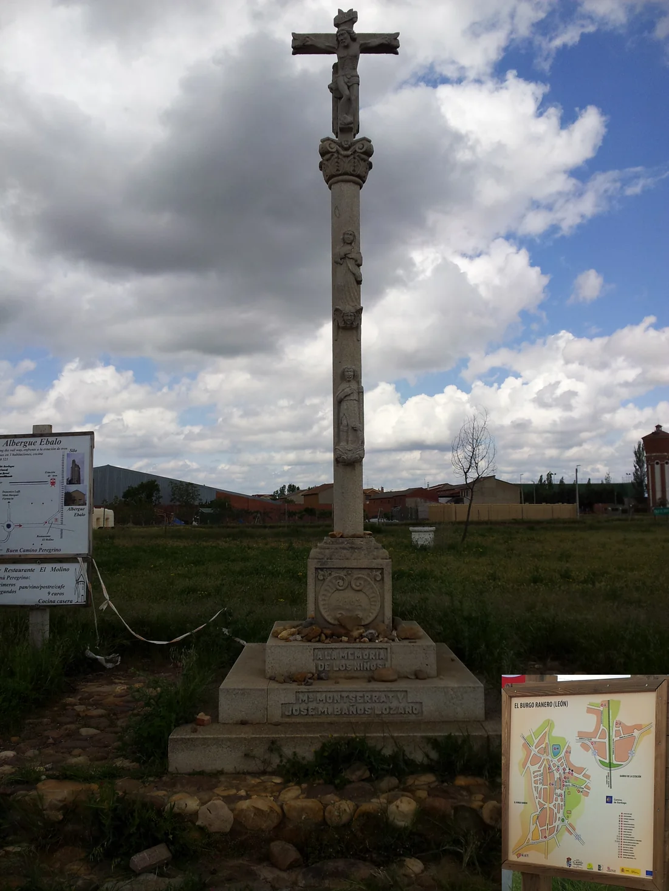
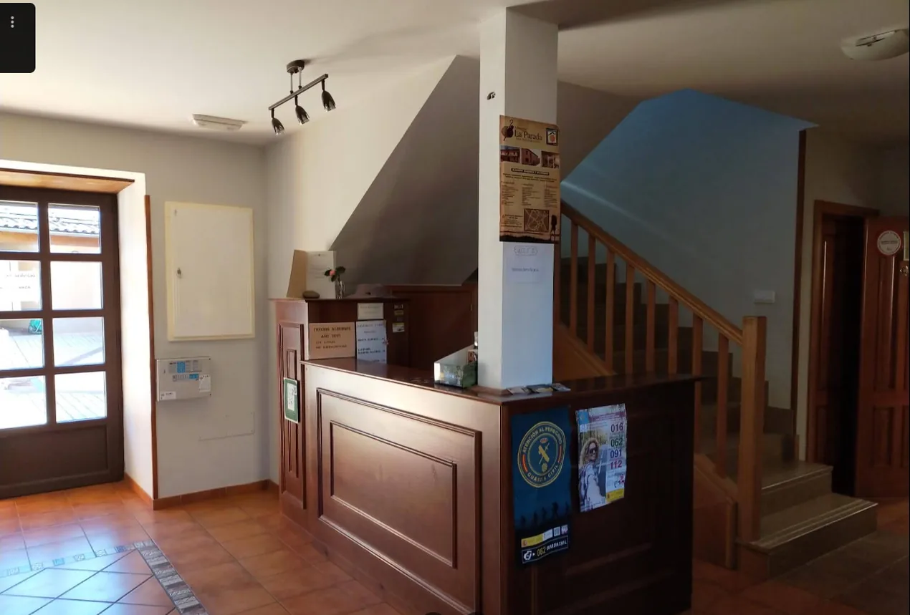
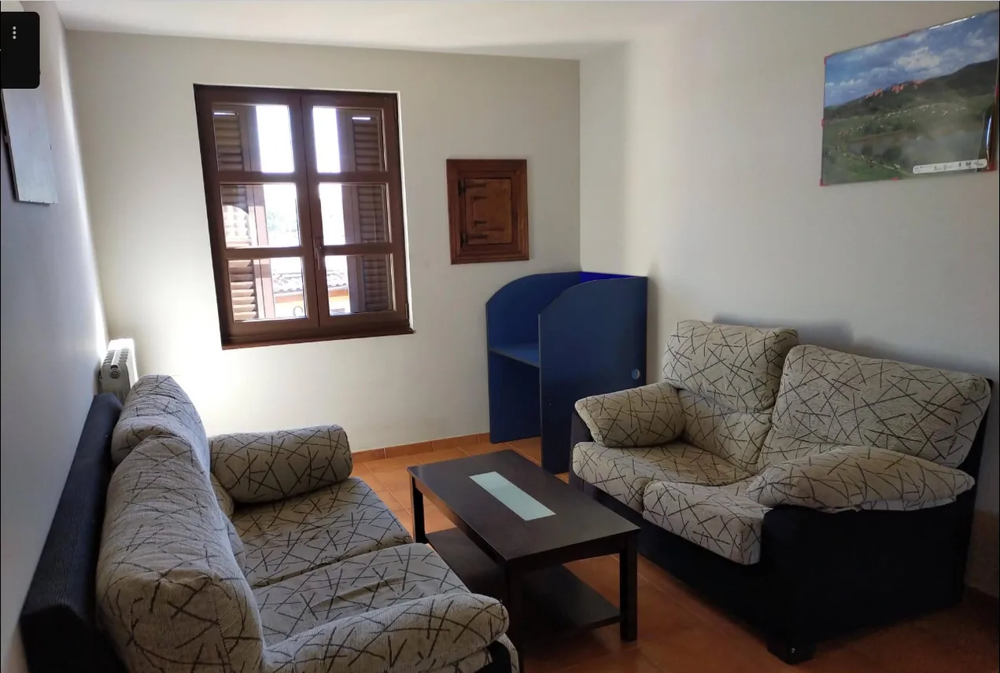
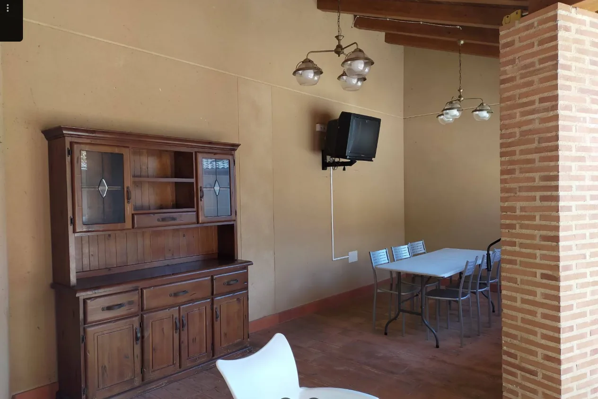
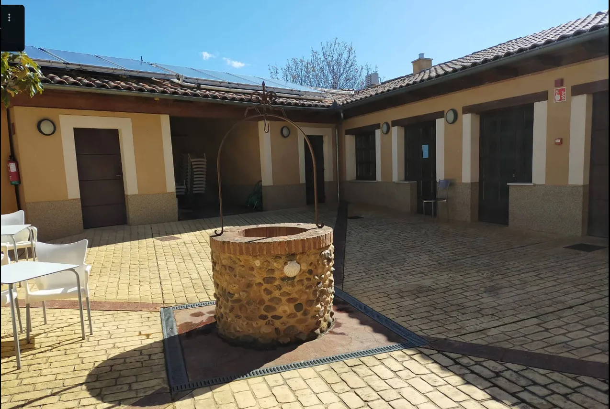

## Camino Francés  2012  

### Etapa-15: Terradillos de los Templarios → Reliegos) ( 43,6  Km)
19 de Mai 2012

**↓** Googlemaps-Foto **↓** 

- 🇪🇸 Cuando aquella voz tan amable nos dijo que aún quedaba un rinconcito libre para dormir, nos alegramos muchísimo, y todavía recuerdo muy bien ese breve momento, justo antes de hacer el último esfuerzo del día para subir las escaleras.

 - 🇬🇧 When the friendly voice told us there was still a little nook available for us to sleep in, we were absolutely delighted, and I still remember that brief moment very clearly – just before we made our final effort of the day to climb the stairs.

- 🇩🇪 Als uns die freundliche Stimme mitteilte, dass noch ein Ecke zum Schlafen für uns frei sei, freuten wir uns riesig, und ich erinnere mich noch sehr gut an diesen kurzen Moment – kurz bevor wir die letzte Anstrengung des Tages auf uns nahmen, um die Treppe hinaufzusteigen.

- 🇵🇹 Quando a voz simpática nos disse que ainda tinha um canto para dormir disponível para nós, ficámos muito felizes, e ainda me lembro muito bem desse breve momento – pouco antes de darmos o último esforço daquele dia para subir as escadas.

**↓** Googlemaps-Foto **↓** 

- 🇩🇪 Einfach noch ein bisschen dasitzen, bevor man schlafen geht, im gelben Pilgerführer blättern und über ein paar mögliche Etappen für den nächsten Tag nachdenken.

- 🇬🇧 Just sit there for a bit before going to bed, flick through the yellow pilgrim’s guide and think about a few possible routes for the next day.

- 🇪🇸 Simplemente sentarse un rato antes de irse a dormir, hojear la guía amarilla del peregrino y pensar en algunas opciones de etapas para el día siguiente.

- 🇵🇹 Simplesmente sentar-se um pouco antes de ir dormir, folhear o guia amarelo do peregrino e pensar em algumas opções de etapas para o dia seguinte.

**↓** Googlemaps-Foto **↓** 

*Ich hätte schwören können, dass der lange Esstisch etwas größer und aus Holz war.*

*Hubiera jurado que la mesa de comedor alargada era un poco más grande y de madera.*

**↓** Googlemaps-Foto **↓** 

---

🇩🇪 The Cena del Peregrino 

####  The Cena del Peregrino

Nachdem ich mehrere tausend Kilometer auf Pilgerwegen zurückgelegt hatte und man mich spontan gefragt hätte, was die zehn schönsten Momente der „Cena del Peregrino“ waren, hätte ich jene unvergessliche Nacht als einen der schönsten Momente beschrieben – ohne mich an den Namen der Herberge oder den Ort zu erinnern. Jetzt weiß ich es wieder, denn trotz der großen Müdigkeit hatte ich an jenem Abend nicht vergessen, meinen Pilgerausweis abstempeln zu lassen.

Nachdem wir uns in unserer kleinen Schlafecke eingerichtet und uns frisch gemacht hatten, stellte sich die Frage: Wo kann man in diesem kleinen Ort etwas zu essen bekommen? Wir waren sehr froh, als die Herbergsleiterin uns einen kleinen Minimarkt zeigte, der alles bot, was man für ein einfaches und köstliches Pilgermenü brauchte. Obwohl wir beschlossen hatten, gemeinsam eine Mahlzeit zuzubereiten, hatten wir – da wir aus verschiedenen Ländern kamen und unterschiedliche kulinarische Gewohnheiten hatten – anfangs Zweifel, was wir kochen sollten. Nachdem wir uns für die berühmte italienische Küche entschieden hatten – deren Zutaten die Herbergsleiterin klugerweise bereits im Minimarkt bereitstellte –, stand einem der schönsten gemeinsamen Pilgermahlzeiten nichts mehr im Wege. Das gemeinsame Zubereiten und Genießen war eine echte Erholung von den Strapazen der Tagesetappe.

Dabei erfuhr ich, dass Gabriel schon vor langer Zeit ein Gelübde abgelegt, aber während seines Berufslebens nie genug Zeit gefunden hatte, den gesamten Jakobsweg zu gehen. Als er in Rente ging, beschloss er, sein Gelübde einzulösen, und seine Frau sagte: „Ich werde dich begleiten.“ So lernte ich die beiden kurz zuvor kennen. Als sie erzählten, dass sie aus Mallorca stammten, waren wir begeistert und beneideten sie darum, auf einer so schönen Insel zu leben. Auch sie waren glücklich dort, doch in manchen Monaten vermissen sie aufgrund der großen Zahl an Touristen die Ruhe des Ortes.

Wir waren sechs Pilger: Gabriel und seine Frau – leider habe ich ihren Namen vergessen –, der Pilger aus Ungarn, den ich am Alto del Pardón kennengelernt hatte, und seine Begleiterin. Sie hatte wegen einer Erkältung einige Etappen ausgelassen, um sich zu erholen, und ging dann langsam weiter, bis er sie wieder eingeholt hatte. Obwohl ich davor  mit ihm ein paar Bier und das Pilgermenü genossen habe, ist mir auch sein Name entfallen. Außerdem Sue aus Südkorea, die nach Australien ausgewandert ist, und ein weiterer koreanischer Pilger. Dieser fiel mir immer wieder auf, weil er beim Wandern stets einen kleinen Rosenkranz in der Hand hielt.

Hätte ich alle Namen der Pilger, die ich auf meinem Weg kennengelernt habe, auf einer Liste notiert – würde ich mich bei dieser unendlichen Zahl überhaupt noch an sie erinnern? Und hätte ich diese Liste heute überhaupt wiedergefunden? Jetzt ist es zu spät. Was bleibt, sind die Gesichter und die Erinnerung an diese schönen Momente.

Und ich … muss zugeben, dass ich nach und nach meinen eigenen Rhythmus gefunden habe. Während ich die Schwierigkeiten überwand, die sich mir in den Weg stellten, spürte ich, wie ein subtiles Gefühl der Leichtigkeit meine Schritte ergriff.

> **Aber ich muss gestehen, dass ich diese Leichtigkeit auch der Post in Nájera zu verdanken habe, die mir einige Kilos voraus nach León geschickt hat.**

---

 

Gibt es in der Herberge „La Parada“ in Reliegos auch einen Minimarkt? 

**Ja, die**Albergue La Parada de Reliegosverfügt über ein kleines Lebensmittelgeschäft ("grocery store") direkt vor Ort**. 
Dort erhalten Sie die wichtigsten Grundnahrungsmittel und Basics für den Pilgerbedarf. Da es im kleinen Ort Reliegos selbst keinen großen Supermarkt gibt, sondern generell nur ein kleines Lädchen im Dorf, ist dieser integrierte Shop der Herberge eine sehr praktische Anlaufstelle.

Zusätzlich bietet die Herberge auch ein eigenes **Bar-Restaurant mit einem Pilgermenü** an, sodass Sie sich dort auch komplett verpflegen lassen können. 

---

🇬🇧 The Cena del Peregrino 

####  The Cena del Peregrino

Having walked several thousand kilometers on pilgrimage routes, if someone had spontaneously asked me about the ten most beautiful moments of the "Cena del Peregrino," I would have described that unforgettable night as one of the finest – without even remembering the name of the hostel or the village. Now I know it, because despite my exhaustion that evening, I did not forget to have my pilgrim credential stamped.

After settling into our small sleeping corner and freshening up, the question arose: Where can one find something to eat in this tiny village? We were delighted when the hospitalera showed us a small minimarket that had everything needed for a simple and delicious pilgrim meal. Although we had decided to cook together, coming from different countries with distinct culinary habits left us with some doubts about what to prepare. Once we agreed on the famous Italian cuisine – the ingredients for which the hospitalera had cleverly stocked in the minimarket – nothing stood in the way of one of the most wonderful shared pilgrim meals. Preparing and enjoying it together was a true relief from the hardships of the day's stage.

It was then I learned that Gabriel had taken a vow long ago but never found enough time during his working life to walk the entire Camino de Santiago. When he retired, he decided to fulfill his vow, and his wife said, "I will accompany you." That is how I had met them shortly before. When they told us they were from Mallorca, we were thrilled and envied them for living on such a beautiful island. They too were happy to live there, though during certain months, they miss the peace of the place due to the vast number of tourists.

There were six of us pilgrims: Gabriel and his wife – unfortunately, I forgot her name –, the pilgrim from Hungary whom I had met at Alto del Pardón, and his companion, who had skipped a few stages due to a cold to recover, then walked on slowly until he caught up with her. Although I shared a few beers and the pilgrim menu with him, I have forgotten his name as well. Then there was Sue from South Korea, who had emigrated to Australia, and another Korean pilgrim. The latter caught my attention time and again because he always held a small rosary in his hand while walking.

If I had written down the names of all the pilgrims I met on a list, would I even remember them now among such endless numbers? And would I have even been able to find that list today? Now it is too late. What remains are the faces and the memory of those beautiful moments.

And I… must admit that little by little, I found my own rhythm.  As I overcame the difficulties that stood in my way, I felt a subtle sense of lightness take hold of my steps.

> **But I must confess, I also owe this lightness to the post office in Nájera, which forwarded a few kilos for me ahead to León.**

---

Is there also a small grocery shop at the ‘La Parada’ hostel in Reliegos? 

**Yes, the** La Parada hostel in Reliegos has a small grocery shop on the premises**.

There you can buy the most important basic foodstuffs and essentials for pilgrims’ needs. As there is no large supermarket in the small town of Reliegos, just a small shop in the village, this shop within the hostel is a very convenient place to go.

In addition, the hostel has its own **bar-restaurant with a pilgrims’ menu**, so you can also have lunch and dinner there.

---

 🇪🇸  La Cena del Peregrino

#### La Cena del Peregrino

Después de haber recorrido varios miles de kilómetros en rutas de peregrinación, si alguien me hubiera preguntado espontáneamente cuáles fueron los diez momentos más bellos de la "Cena del Peregrino", habría descrito aquella noche inolvidable como uno de los mejores, sin recordar siquiera el nombre del albergue ni del pueblo. Ahora lo sé, porque a pesar del gran cansancio de aquella noche, no olvidé sellar mi credencial de peregrino.

Tras instalarnos en nuestro pequeño rincón para dormir y refrescarnos, surgió la pregunta: ¿dónde se puede conseguir algo de comer en este pueblo tan pequeño? Nos alegramos mucho cuando la hospitalera nos mostró un pequeño minimarket que tenía todo lo necesario para una cena de peregrinos sencilla y deliciosa. Aunque habíamos decidido cocinar juntos, al proceder de distintos países y tener costumbres culinarias diferentes, teníamos dudas sobre qué preparar. Tras decidirnos por la famosa cocina italiana —cuyos ingredientes la hospitalera, muy sabiamente, ya había previsto en la tienda—, ya nada impidió una de las cenas compartidas más hermosas del camino. Preparar y disfrutar la comida juntos fue un verdadero alivio tras el esfuerzo de la etapa del día.

Allí me enteré de que Gabriel había hecho una promesa hacía mucho tiempo, pero durante su vida laboral nunca había encontrado tiempo suficiente para recorrer todo el Camino de Santiago. Cuando se jubiló, decidió cumplir su promesa y su esposa le dijo: "Te acompañaré". Así es como los había conocido poco antes. Cuando nos contaron que eran de Mallorca, nos entusiasmamos y los envidiamos por vivir en una isla tan hermosa. Ellos también eran felices viviendo allí, aunque en algunos meses del año, debido a la gran cantidad de turistas, echan de menos la tranquilidad del lugar.

Éramos seis peregrinos: Gabriel y su esposa —lamentablemente he olvidado su nombre—, el peregrino de Hungría que había conocido en el Alto del Pardón, y su compañera, que se había saltado algunas etapas por un resfriado para recuperarse y luego continuó despacio hasta que él la alcanzó. Aunque disfruté de unas cervezas y del menú de peregrino con él, también he olvidado su nombre. También estaba Sue, de Corea del Sur, que había emigrado a Australia, y otro peregrino coreano. Este último me llamaba la atención una y otra vez porque siempre caminaba con un pequeño rosario en la mano.

Si hubiera anotado en una lista los nombres de todos los peregrinos que conocí, ¿me acordaría de ellos entre una cantidad tan infinita? ¿Y habría sido capaz de encontrar esa lista hoy en día? Ahora ya es demasiado tarde. Lo que queda son los rostros y el recuerdo de aquellos bellos momentos.

Y yo... debo admitir que, poco a poco, fui encontrando mi propio ritmo.  A medida que superaba las dificultades que se interponían en mi camino, sentía cómo una sutil sensación de ligereza iba invadiendo mis pasos.

> **Pero debo confesar que también le agradezco esta ligereza al servicio de correos de Nájera, que me envió unos cuantos kilos para León.**

---

 

 ¿Hay también una pequeña tienda de comestibles en el albergue «La Parada» de Reliegos?

**Sí, el** Albergue La Parada de Reliegos cuenta con una pequeña tienda de comestibles («grocery store») en el mismo recinto**.
Allí podrás adquirir los alimentos básicos más importantes y lo imprescindible para las necesidades de los peregrinos. Dado que en la pequeña localidad de Reliegos no hay ningún supermercado grande, sino solo una pequeña tienda en el pueblo, esta tienda integrada en el albergue resulta un lugar muy práctico al que acudir.

Además, el albergue cuenta con su propio **bar-restaurante con un menú para peregrinos**, por lo que allí también podrá comer y cenar.

---

🇵🇹  La Cena del Peregrino

#### La Cena del Peregrino

Depois de ter percorrido vários milhares de quilómetros em caminhos de peregrinação, se alguém me tivesse perguntado espontaneamente quais foram os dez momentos mais bonitos da "Cena del Peregrino", teria descrito aquela noite inesquecível como um dos melhores – sem sequer me lembrar do nome do albergue ou da aldeia. Agora já sei, pois apesar do grande cansaço daquela noite, não me esqueci de carimbar a minha credencial de peregrino.

Depois de nos instalarmos no nosso pequeno canto para dormir e de nos refrescarmos, surgiu a pergunta: onde se pode conseguir algo para comer nesta aldeia tão pequena? Ficámos muito felizes quando a hospitaleira nos mostrou um pequeno minimercado que tinha tudo o que era necessário para uma refeição de peregrino simples e deliciosa. Embora tivéssemos decidido cozinhar juntos, como éramos de países diferentes e tínhamos hábitos culinários distintos, tínhamos algumas dúvidas sobre o que preparar. Depois de optarmos pela famosa cozinha italiana – cujos ingredientes a hospitaleira, sabiamente, já tinha disponibilizado no minimercado –, nada mais impediu uma das refeições partilhadas mais bonitas do caminho. Preparar e desfrutar da comida juntos foi um verdadeiro alívio do cansaço da etapa do dia.

Foi aí que soube que o Gabriel tinha feito uma promessa há muito tempo, mas durante a sua vida profissional nunca tinha encontrado tempo suficiente para fazer todo o Caminho de Santiago. Quando se reformou, decidiu cumprir a promessa e a sua esposa disse: "Eu vou acompanhar-te". Foi assim que os conheci pouco antes. Quando nos contaram que eram de Maiorca, ficámos encantados e invejámo-los por viverem numa ilha tão bonita. Eles também eram felizes por viver lá, embora em alguns meses, devido ao grande número de turistas, sintam falta da tranquilidade do lugar.

Éramos seis peregrinos: o Gabriel e a sua esposa – infelizmente esqueci-me do nome dela –, o peregrino da Hungria que eu tinha conhecido no Alto del Pardón, e a sua companheira, que tinha saltado algumas etapas por causa de uma constipação para recuperar, caminhando depois lentamente até que ele a alcançou. Embora tenha desfrutado de algumas cervejas e do menu de peregrino com ele, também me esqueci do seu nome. Além disso, a Sue, da Coreia do Sul, que emigrou para a Austrália, e outro peregrino coreano. Este último chamava-me a atenção repetidamente porque caminhava sempre com um pequeno terço na mão.

Se tivesse anotado numa lista os nomes de todos os peregrinos que conheci, lembrar-me-ia deles no meio de um número tão infinito? E teria conseguido encontrar essa lista hoje em dia? Agora é demasiado tarde. O que resta são os rostos e a memória daqueles belos momentos.

E eu... devo admitir que, a pouco e pouco, fui encontrando o meu próprio ritmo. À medida que superava as dificuldades que se interpunham no meu caminho, sentia como uma sensação subtil de leveza ia tomando conta dos meus passos.

> **Mas devo confessar que também agradeço esta leveza aos correios de Nájera, que me enviaram uns quilos para León.**

---

Existe também uma minimercado no albergue «La Parada», em Reliegos?

**Sim, o** Albergue La Parada de Reliegos dispõe de uma pequena mercearia («grocery store») no próprio local**.

Aí poderá adquirir os alimentos básicos mais importantes e os artigos essenciais para as necessidades dos peregrinos. Uma vez que na pequena localidade de Reliegos não existe um grande supermercado, mas sim apenas uma pequena loja na aldeia, esta loja integrada no albergue é um local muito prático para fazer as suas compras.

Além disso, o albergue dispõe também de um **bar-restaurante com um menu para peregrinos**, pelo que poderá fazer todas as suas refeições no local.

---

  

🇬🇧
🇪🇸
🇵🇹
🇩🇪

---

**↪** [Etapa-16](Etapa-16.md)

 🔁 [Camino-Frances_Etapas](Camino-Frances_Etapas.md)

 ...→