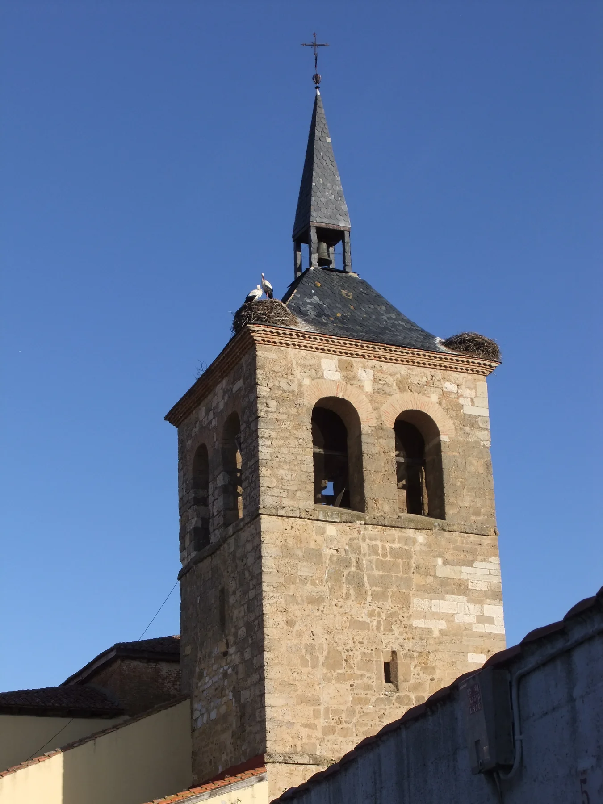

## Camino Francés  2012  

### Etapa-16: →  ( Km)
20 de Mai 2012

---

  

🇬🇧
🇪🇸
🇵🇹
🇩🇪

- **Der Bariton** 

In der Musik gibt es kein direktes, einzelnes „Gegenteil“ von Bariton, da Stimmlagen in einem mehrteiligen System eingeordnet werden. Je nachdem, wie man die Frage betrachtet, lässt sich das Gegenstück jedoch auf unterschiedliche Weise definieren

- **Mezzosopran**

Das weibliche Gegenstück (Äquivalent): Das direkte Pendant in den weiblichen Stimmlagen ist der Mezzosopran. Beide belegen jeweils die mittlere Stufe im klassischen sechsteiligen Stimmfächersystem (Bariton bei den Männern, Mezzosopran bei den Frauen)

- **Tenor vs Bass**

**Das funktionale Gegenstück bei den Männern:** Sucht man nach dem akustischen Kontrast bei den Männerstimmen, ist es der **Tenor** (als hohe Männerstimme) oder der **Bass** (als tiefe Männerstimme), da der Bariton genau in der Mitte zwischen beiden liegt.

- **Sopran vs Bariton**

**Das Extrem-Gegenteil:** Betrachtet man das System der klassischen Gesangsstimmen als Ganzes, ist das weibliche Gegenteil der **Sopran**. Der Bariton tendiert als tiefe bis mittlere Männerstimme zum unteren Ende des Spektrums, während der Sopran die höchste menschliche Stimmlage darstellt.

|Tonhöhe|Frauenstimmen|Männerstimmen|
|---|---|---|
|**Hoch**|Sopran|Tenor|
|**Mittel**|**Mezzosopran** _(weibliches Pendant)_|**Bariton**|
|**Tief**|Alt|Bass|

---

**↪** [Etapa-17](Etapa-17.md)

 🔁 [Camino-Frances_Etapas](Camino-Frances_Etapas.md)

 ...→