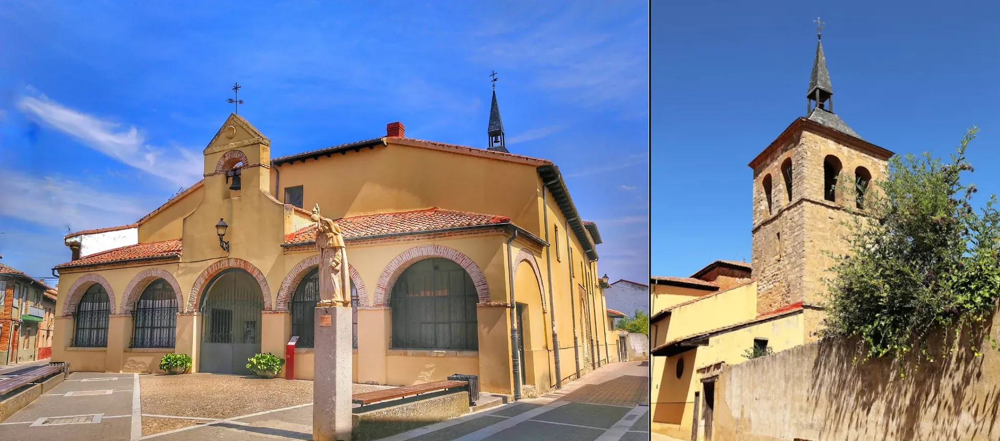

## Camino Francés  2012  

### Etapa-16: Reliegos → Leon ( 24,4Km)
20 de Mai 2012

Ciconia ciconia 

 Iglesia de Santa María 2012 (Mansilla de las Mulas)

Iglesia de Santa María 2021  Googlemapsfoto von "La Tartaruga Tomassa" y "Emmanuel Logros" 

#### Ciconia ciconia 

In Spanien leben derzeit schätzungsweise zwischen 67.000 und 80.000 Weißstörche. Die genaue Anzahl wird bei offiziellen Zählungen der Naturschutzorganisation SEO/BirdLife meist in Brutpaaren angegeben

In Spanien gibt es zwei Storch-Arten, die dort als Brutvögel vorkommen

1. Der Weißstorch (Ciconia ciconia): Er ist die weitaus bekannteste und am häufigsten vorkommende Art. Weißstörche nisten oft in der Nähe des Menschen auf Kirchtürmen, Dächern oder Strommasten. Inzwischen überwintern viele von ihnen aufgrund des milden Klimas und der Nahrung auf Mülldeponien dauerhaft in Spanien, anstatt nach Afrika zu fliegen.
2. Der Schwarzstorch (Ciconia nigra): Er ist deutlich seltener, lebt sehr scheu und heimlich. Im Gegensatz zum Weißstorch meidet er die Nähe von Menschen und brütet bevorzugt in abgelegenen Wäldern und Felsregionen, vor allem im Südwesten der Iberischen Halbinsel (z. B. in der Extremadura oder im Nationalpark Monfragüe)

---

Si hay algo que se haya quedado enterrado en mi memoria, sea lo que sea lo que haya pasado en esta etapa, lo escribiré más adelante. Si no hubiera tenido Google Maps, ni siquiera habría sabido que empecé a caminar sobre las siete de la mañana.

Falls mir irgendetwas im Gedächtnis haften geblieben ist – was auch immer auf dieser Etappe passiert sein mag –, werde ich es später aufschreiben. Hätte ich Google Maps nicht gehabt, hätte ich nicht einmal gewusst, dass ich gegen sieben Uhr morgens losgelaufen bin.

If there’s anything that’s remained buried in my memory – whatever may have happened during this stage – I’ll write about it later. If it hadn’t been for Google Maps, I wouldn’t even have known that I’d set off at around seven in the morning.

---

  

🇬🇧
🇪🇸
🇵🇹
🇩🇪

---

**↪** [Etapa-17_Leon_Hospital-de-Orbigo](Etapa-17_Leon_Hospital-de-Orbigo.md)

 🔁 [Camino-Frances_Etapas](Camino-Frances_Etapas.md)

 ...→