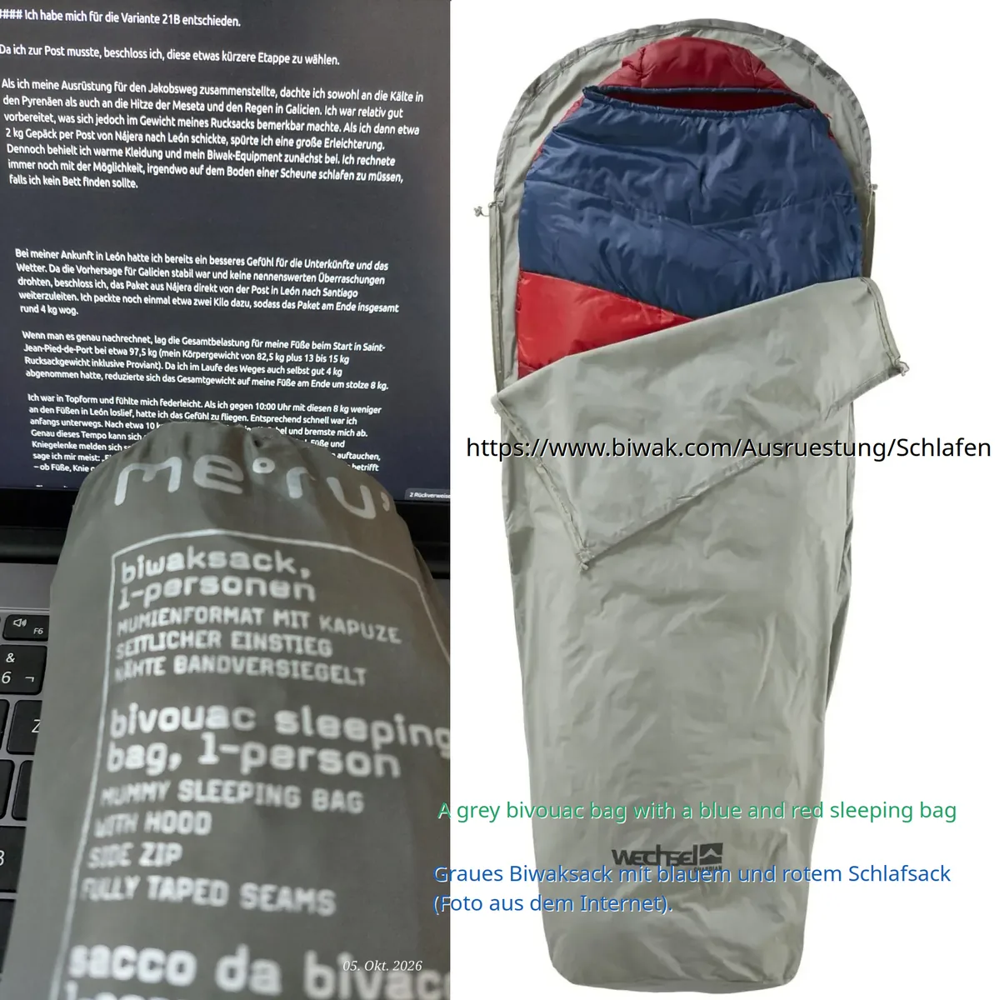

## Camino Francés  2012  

### Etapa-17: León → Hospital de Órbigo (30,9 Km)
21 de Mai 2012

Carga Biomecânica  ⁘ Biomechanische Belastung  ⁘  Biomechanical Load  

#### 🇩🇪  Biomechanische Belastung und Gelenkschutz beim Langstreckenwandern

Die Gesamtbelastung der Fuß- und Kniegelenke setzt sich aus dem Körpergewicht und dem Gewicht der Ausrüstung zusammen. Beim Start in Saint-Jean-Pied-de-Port betrug die Gesamtlast 97,5 kg (Körpergewicht: 82,5 kg; Rucksack inklusive Proviant: 13–15 kg). Durch die postalische Vorausleitung von 4 kg Gepäck und eine körperliche Gewichtsreduktion von ebenfalls 4 kg verringerte sich die Gelenkbelastung im Verlauf um insgesamt 8 kg.

Diese spürbare Gewichtsentlastung führt psychologisch häufig zu einer unbewussten Erhöhung der Gehgeschwindigkeit. Eine zu hohe Schrittfrequenz birgt jedoch orthopädische Risiken: Nach einer Distanz von etwa 10 km können Überlastungssymptome in den Sprunggelenken auftreten. Zu schnelles Gehen führt auf Langstrecken zu kumulativen Mikrotraumata. Während Hautirritationen wie Blasen durch kontinuierliche Belastung temporär desensibilisiert werden können, erfordern Symptome an den Sehnen, Bändern und Gelenken (insbesondere an Knöcheln, Knien und der Wirbelsäule) eine sofortige Reduzierung der Intensität, um chronische Schäden oder Entzündungen zu vermeiden.

Die physische Ermüdungsgrenze variiert täglich und ist stark von den Faktoren Regeneration, Nährstoffzufuhr, Schlafqualität, Mikroklima und Geländeprofil abhängig. Die Belastungsgrenze verschiebt sich dadurch typischerweise zwischen der 20- und 30-Kilometer-Marke. Jedes zusätzliche Kilogramm Marschgepäck (z. B. durch Proviant) antizipiert den Eintritt der Erschöpfung statistisch um etwa 3 bis 4 Kilometer. Zudem verlängert sich die physiologische Akklimatisation – also die Zeit, die der Körper benötigt, um die notwendige Grundlagenausdauer und Sehnenstabilität aufzubauen – mit zunehmendem Alter.

> - Da ich den Text selbst verfasst und die KI gebeten hatte, ihn in eine korrektere Sprache zu übersetzen, habe ich tatsächlich fast alles verstanden; andernfalls hätte ich auf Portugiesisch nur die Hälfte und auf Deutsch etwa 70 bis 90 Prozent verstanden. Auf Englisch und Spanisch hatte ich keine Zeit dafür, da ich immer wieder innehalten musste, um über die Wörter nachzudenken

---

#### 🇵🇹 Carga Biomecânica e Proteção Articular em Caminhadas de Longa Distância

A carga total sobre as articulações dos pés e dos joelhos é composta pelo peso corporal e pelo peso do equipamento. No início, em Saint-Jean-Pied-de-Port, a carga total era de 97,5 kg (peso corporal: 82,5 kg; mochila incluindo provisões: 13–15 kg). Devido ao envio postal de 4 kg de bagagem e a uma redução do peso corporal de também 4 kg, a carga sobre as articulações diminuiu, ao longo do tempo, num total de 8 kg.

Esta redução percetível de peso leva frequentemente, do ponto de vista psicológico, a um aumento inconsciente da velocidade de caminhada. No entanto, uma cadência demasiado elevada acarreta riscos ortopédicos: após uma distância de cerca de 10 km, podem surgir sintomas de sobrecarga nas articulações dos tornozelos. Caminhar demasiado rápido causa microtraumatismos cumulativos em longas distâncias. Enquanto as irritações cutâneas, como as bolhas, podem ser temporariamente dessensibilizadas através da continuidade do esforço, os sintomas nos tendões, ligamentos e articulações (especialmente nos tornozelos, joelhos e coluna vertebral) exigem uma redução imediata da intensidade para evitar lesões crónicas ou inflamações.

O limiar de fadiga física varia diariamente e depende fortemente de fatores como a regeneração, o aporte nutricional, a qualidade do sono, o microclima e o perfil do terreno. Consequentemente, o limite de resistência oscila habitualmente entre a marca dos 20 e dos 30 quilómetros. Cada quilograma adicional de bagagem (por exemplo, provisões) antecipa o início da exaustão em cerca de 3 a 4 quilómetros. Além disso, o período de aclimatação fisiológica — ou seja, o tempo que o corpo necessita para desenvolver a resistência de base e a estabilidade tendinosa necessárias — aumenta com a idade.

> - Como fui eu quem escreveu o texto e pedi à IA para o traduzir para uma linguagem mais correta, na verdade compreendi quase tudo; caso contrário, só teria compreendido metade em português e cerca de 70 a 90 por cento em alemão. Em inglês e espanhol, não tive tempo, porque parava frequentemente para pensar nas palavras.

---

#### 🇪🇸 Carga Biomecánica y Protección Articular en Caminatas de Larga Distancia

La carga total sobre las articulaciones del pie y de la rodilla se compone del peso corporal y del peso del equipo. Al inicio en Saint-Jean-Pied-de-Port, la carga total ascendía a 97,5 kg (peso corporal: 82,5 kg; mochila con provisiones incluidas: 13–15 kg). Debido al envío postal de 4 kg de equipaje y a una reducción del peso corporal de otros 4 kg, la presión sobre las articulaciones disminuyó en un total de 8 kg a lo largo del trayecto.

Esta notable reducción de peso suele provocar, a nivel psicológico, un aumento inconsciente de la velocidad de marcha. Sin embargo, una frecuencia de paso excesiva conlleva riesgos ortopédicos: tras una distancia de unos 10 km, pueden aparecer síntomas de sobrecarga en los tobillos. Caminar demasiado rápido en trayectos largos genera microtraumatismos acumulativos. Mientras que las irritaciones cutáneas como las ampollas pueden desensibilizarse temporalmente al continuar caminando, los síntomas en los tendones, ligamentos y articulaciones (especialmente en tobillos, rodillas y columna vertebral) requieren una reducción inmediata de la intensidad para evitar lesiones crónicas o procesos inflamatorios.

El umbral de fatiga física varía diariamente y depende estrictamente de factores como la recuperación, la ingesta de nutrientes, la calidad del sueño, el microclima y el perfil del terreno. Por lo tanto, el límite de resistencia suele oscilar entre los 20 y los 30 kilómetros. Cada kilogramo adicional de equipaje (por ejemplo, provisiones) anticipa la aparición del agotamiento en aproximadamente 3 o 4 kilómetros. Asimismo, el periodo de aclimatación fisiológica —es decir, el tiempo que requiere el organismo para desarrollar la resistencia de base y la estabilidad tendinosa necesarias— se prolonga con el aumento de la edad.

> - Como fui yo quien escribió el texto y le pedí a la IA que lo tradujera a un lenguaje más correcto, en realidad lo entendí casi todo; de lo contrario, solo habría entendido la mitad en portugués y entre el 70 y el 90 por ciento en alemán. En inglés y español no tuve tiempo, porque me detenía con frecuencia para pensar en las palabras.

---

#### 🇬🇧 Biomechanical Load and Joint Protection in Long-Distance Walking

The total load on the foot and knee joints comprises both body weight and equipment weight. At the start in Saint-Jean-Pied-de-Port, the total load was 97.5 kg (body weight: 82.5 kg; backpack including provisions: 13–15 kg). Due to forwarding 4 kg of luggage by mail and achieving a further 4 kg reduction in body weight, the overall joint load was reduced by 8 kg over time.

Psychologically, this noticeable weight reduction often leads to an unconscious increase in walking speed. However, an excessive stride cadence carries orthopedic risks: after a distance of approximately 10 km, symptoms of strain can manifest in the ankles. Walking too fast over long distances causes cumulative microtrauma. While skin irritations such as blisters can be temporarily desensitized by continuing to walk, symptoms affecting tendons, ligaments, and joints (specifically ankles, knees, and the spine) necessitate an immediate reduction in intensity to prevent chronic injury or inflammation.

The physical fatigue threshold varies daily and is highly dependent on recovery time, nutrient intake, sleep quality, microclimate, and terrain profile. Consequently, the endurance limit typically shifts between the 20 and 30-kilometer mark. Each additional kilogram of luggage (e.g., provisions) statistically accelerates the onset of exhaustion by approximately 3 to 4 kilometers. Furthermore, the timeline for physiological acclimatization—the period required for the body to build necessary baseline endurance and tendon stability—lengthens with advancing age.

> - As I was the one who wrote the text and asked the AI to translate it into more correct language, I actually understood almost everything; otherwise, I would only have understood half of it in Portuguese and around 70 to 90 per cent in German. In English and Spanish, I didn’t have time, because I stopped frequently to think about the words

---

 - **Etapa 21A: León → San Martín del Camino → Hospital-de-Orbigo | 24,6 + 7,2 km = 31, 8 km** 
- **Etapa 21B: León - Villar de Mazarife → Hospital-de-Orbigo → | 21,1 +  9,8 = 30, 9 km**

---

🇩🇪 Ich fühlte mich leichter 

#### Ich habe mich für die Variante 21B entschieden. 

Da ich zur Post musste, beschloss ich, diese etwas kürzere Etappe zu wählen.

Als ich meine Ausrüstung für den Jakobsweg zusammenstellte, dachte ich sowohl an die Kälte in den Pyrenäen als auch an die Hitze der Meseta und den Regen in Galicien. Ich war relativ gut vorbereitet, was sich jedoch im Gewicht meines Rucksacks bemerkbar machte. Als ich dann etwa 2 kg Gepäck per Post von Nájera nach León schickte, spürte ich eine große Erleichterung. Dennoch behielt ich warme Kleidung und mein Biwak-Equipment zunächst bei. Ich rechnete immer noch mit der Möglichkeit, irgendwo auf dem Boden einer Scheune schlafen zu müssen, falls ich kein Bett finden sollte.

Bei meiner Ankunft in León hatte ich bereits ein besseres Gefühl für die Unterkünfte und das Wetter. Da die Vorhersage für Galicien stabil war und keine nennenswerten Überraschungen drohten, beschloss ich, das Paket aus Nájera direkt von der Post in León nach Santiago weiterzuleiten. Ich packte noch einmal etwa zwei Kilo dazu, sodass das Paket am Ende insgesamt rund 4 kg wog.

Wenn man es genau nachrechnet, lag die Gesamtbelastung für meine Füße beim Start in Saint-Jean-Pied-de-Port bei etwa 97,5 kg (mein Körpergewicht von 82,5 kg plus 13 bis 15 kg Rucksackgewicht inklusive Proviant). Da ich im Laufe des Weges auch selbst gut 4 kg abgenommen hatte, reduzierte sich das Gesamtgewicht auf meine Füße am Ende um stolze 8 kg.

Ich war in Topform und fühlte mich federleicht. Als ich gegen 10:00 Uhr mit diesen 8 kg weniger an den Füßen in León loslief, hatte ich das Gefühl zu fliegen. Entsprechend schnell war ich anfangs unterwegs. Nach etwa 10 km spürte ich jedoch meine Knöchel und bremste mich ab. Genau dieses Tempo kann sich auf lange Sicht gegen einen wenden; Knöchel, Füße und Kniegelenke melden sich sofort, wenn man es übertreibt. Wenn ein oder zwei Blasen auftauchen, sage ich mir meist: „Einfach weiterlaufen, bis sie taub werden.“ Wenn es aber die Gelenke betrifft – ob Füße, Knie oder Rücken –, schlagen bei mir die Alarmglocken an.

Eine weitere Beobachtung: Je nach Tagesform – abhängig von Regeneration, Ernährung, Schlaf, Wetter und Gelände – setzt die Müdigkeit mal nach 20 km, mal erst nach 30 km ein. Klar ist: Mit jedem zusätzlichen Kilo Proviant im Gepäck erreicht man diesen Punkt etwa 3 bis 4 km früher. Zudem merke ich: Früher, als ich untrainiert startete, brauchte ich etwa anderthalb Wochen, um in Form zu kommen. Heute dauert dieser Prozess etwas länger.

> - **Erkenntnisse einer griechischen Pilgerin (Hausfrau), erzählt 2019 in der Albergue O Bonito in Rabaçal.**

Ein paar Stunden Wandern oder zweimal die Woche eine Stunde Laufen ist zwar gut, aber man sollte nicht glauben, dass man dadurch besser vorbereitet ist als eine Hausfrau.

Als sie 2018 den Camino Francés meisterte und voller Stolz nach Hause zurückkehrte, meinten ihr Mann (der beim Militär ist) und ihr sehr sportlicher Sohn, das sei doch alles kein Problem und sie würden das locker auch schaffen. 2019 pilgerte sie dann auf dem Camino Português von Lissabon aus. Ihr Sohn, damals zwischen 17 und 19 Jahre alt, begleitete sie – und musste schnell feststellen, dass Pilgern und normales Laufen zwei völlig verschiedene Welten sind. 

Eine Pilgerreise ist eine kontinuierliche Dauerbelastung und absolut nicht zu vergleichen mit einem Wochenendausflug, bei dem man nur einen kleinen Rucksack für die Wasserflasche trägt.

---

🇵🇹 Senti-me mais leve 

#### Optei pela variante 21B. 

Como precisava de ir aos correios, decidi escolher esta etapa ligeiramente mais curta.

Quando preparei o meu equipamento para o Caminho de Santiago, levei em consideração tanto o frio dos Pirenéus como o calor da Meseta e a chuva da Galiza. Estava relativamente bem preparado, o que se refletiu no peso da minha mochila. Quando enviei cerca de 2 kg de bagagem por correio de Nájera para León, senti um enorme alívio. No entanto, mantive a roupa quente e o equipamento de bivaque, pois ainda considerava a possibilidade de ter de dormir no chão de um celeiro caso não encontrasse cama.

Ao chegar a León, já tinha uma ideia mais clara sobre as condições dos alojamentos e do tempo. Sabendo que o clima na Galiza estava estável e sem grandes surpresas previstas, decidi reencaminhar o pacote que tinha enviado de Nájera para León diretamente para Santiago. Adicionei mais uns dois quilos ao pacote, totalizando cerca de 4 kg.

Fazendo as contas com precisão, a carga total sobre os meus pés quando comecei em Saint-Jean-Pied-de-Port era de cerca de 97,5 kg (o meu peso de 82,5 kg mais 13 a 15 kg do peso da mochila, incluindo provisões). Como também perdi cerca de 4 kg de peso corporal ao longo do Caminho, a redução total de peso sobre os meus pés foi de uns impressionantes 8 kg.

Estava em excelente forma e sentia-me incrivelmente leve. Quando saí de León por volta das 10h00 – com menos 8 kg sobre os pés –, parecia que conseguia voar, pelo que comecei a caminhar bastante rápido. Contudo, após uns 10 km, comecei a sentir os tornozelos e abrandei o passo. Este excesso de velocidade pode virar-se contra nós a longo prazo; os tornozelos, os pés e os joelhos avisam logo quando exageramos. Se aparecem uma ou duas bolhas, costumo dizer para mim mesmo: "Continua a pisar até que adormeçam". Mas quando se trata das articulações – seja nos pés, joelhos ou costas –, os alarmes disparam.

Outra observação: dependendo de como nos sentimos – o que varia com o tempo de recuperação, alimentação, sono, clima e terreno –, o cansaço surge nuns dias aos 20 km e noutros apenas aos 30 km. Uma coisa é certa: com um quilo extra de provisões na mochila, o cansaço aparece cerca de 3 a 4 km mais cedo. Além disso, noto que antigamente, quando não me preparava com antecedência, precisava de cerca de uma semana e meia para entrar em forma; hoje em dia, esse processo demora um pouco mais.

> **- Lições de uma peregrina grega (dona de casa), contadas em 2019 no Albergue O Bonito, em Rabaçal**

Caminhar duas horas ou correr duas vezes por semana uma hora é bom, mas ninguém deve pensar que está mais bem preparado do que uma dona de casa.

Quando ela completou o Caminho Francês em 2018 e regressou a casa radiante com a conquista, o marido (que é militar) e o filho (que é muito desportista) disseram-lhe que também o fariam sem qualquer problema. Em 2019, ela fez o Caminho Português a partir de Lisboa e o filho, que na altura tinha entre 17 e 19 anos, acompanhou-a. Ele percebeu rapidamente que peregrinar e correr são dois mundos completamente diferentes. 

Uma peregrinação é um esforço contínuo e não se compara a um passeio de fim de semana com uma mochila pequena apenas para a garrafa de água.

---

Me sentí más ligero 

#### 🇪🇸 Me decanté por la variante 21B. 

Como tenía que ir a la oficina de correos, decidí elegir esta etapa un poco más corta.

Cuando preparé mi equipo para el Camino de Santiago, tuve en cuenta tanto el frío de los Pirineos como el calor de la Meseta y la lluvia de Galicia. Iba relativamente bien preparado, lo que se notaba en el peso de la mochila. Cuando envié unos 2 kg de equipaje por correo desde Nájera a León, sentí un gran alivio. A pesar de ello, conservé la ropa de abrigo y el equipo de vivac por el momento, ya que aún contemplaba la posibilidad de tener que dormir en el suelo de algún granero si no encontraba cama.

Al llegar a León, ya tenía una idea más clara sobre los alojamientos y el clima. Sabiendo que el tiempo en Galicia era estable y no se esperaban sorpresas destacables, decidí reenviar directamente a Santiago el paquete que me había mandado de Nájera a León. Le añadí unos dos kilos más, por lo que al final el paquete pesaba unos 4 kg en total.

Calculando con precisión, la carga total sobre mis pies cuando empecé en Saint-Jean-Pied-de-Port era de unos 97,5 kg (mi peso corporal de 82,5 kg más los 13-15 kg de la mochila, provisiones incluidas). Como a lo largo del Camino también perdí unos 4 kg de peso, la reducción total sobre mis pies fue de unos fantásticos 8 kg.

Estaba en plena forma y me sentía muy ligero. Cuando salí de León sobre las 10:00 de la mañana —con esos 8 kg menos sobre los pies—, tenía la sensación de que podía volar, por lo que al principio caminé bastante rápido. Sin embargo, tras unos 10 km, empecé a sentir los tobillos y disminuí el ritmo. Precisamente esa velocidad puede volverse en tu contra a largo plazo; los tobillos, los pies y las rodillas te avisan en cuanto te excedes. Si salen una o dos ampollas, me digo a mí mismo: "Sigue pisando hasta que se duerman", pero cuando afecta a las articulaciones —ya sea en los pies, las rodillas o la espalda—, se encieden todas las alarmas.

Otra observación: según cómo nos sintamos —dependiendo del descanso, la alimentación, el sueño, el clima y el terreno—, el cansancio aparece unos días a los 20 km y otros a los 30 km. Lo que es seguro es que, con un kilo extra de provisiones en la mochila, el cansancio llega unos 3 o 4 km antes. También noto que antes, cuando no me preparaba con antelación, tardaba una semana y media en ponerme en forma; hoy en día, ese proceso me lleva un poco más de tiempo.

> **- Reflexiones de una peregrina griega (ama de casa), relatadas en 2019 en el Albergue O Bonito en Rabaçal**

Caminar dos horas o salir a correr dos veces por semana durante una hora está bien, pero nadie debería creer que por eso está mejor preparado que una ama de casa.

Cuando ella completó el Camino Francés en 2018 y regresó a casa feliz por haberlo logrado, su marido (que es militar) y su hijo (que es muy deportista) le dijeron que ellos también lo harían sin ningún problema. En 2019, hizo el Camino Portugués desde Lisboa y su hijo, que entonces tenía entre 17 y 19 años, la acompañó. Él descubrió rápidamente que peregrinar y correr son dos mundos totalmente distintos. El Camino es un esfuerzo continuo y no tiene nada que ver con una excursión de fin de semana en la que solo llevas una mochila pequeña para la botella de agua.

---

🇬🇧 I felt lighter 

#### I chose alternative route 21B. 

Since I had to visit the post office, I decided to take this slightly shorter stage.

When I was packing my gear for the Camino, I planned for the cold in the Pyrenees, the heat on the Meseta, and the rain in Galicia. I was relatively well-prepared, though it certainly showed in the weight of my backpack. When I shipped about 2 kg of luggage ahead by mail from Nájera to León, I felt a massive sense of relief. However, I kept my warm clothes and bivouac gear for the time being, as I was still anticipating the possibility of having to sleep on a barn floor if I couldn't find a bed.

By the time I reached León, I had a better understanding of the accommodation options and the weather. Knowing that the weather in Galicia was stable and that no major surprises were expected, I decided to forward the package I had mailed from Nájera directly to Santiago. I added another two kilograms to it, bringing the total weight of the package to around 4 kg.

If you do the math, the total weight on my feet when I started in Saint-Jean-Pied-de-Port was about 97.5 kg (my body weight of 82.5 kg plus 13–15 kg of backpack weight, including provisions). Since I also lost a solid 4 kg along the way, the total weight off my feet was an impressive 8 kg.

I was in peak shape and felt light as a feather. When I started walking from León around 10:00 AM—with 8 kg less weighing down my feet—I felt like I could fly, so I set off at quite a fast pace. After about 10 km, however, I began to feel it in my ankles and slowed down. That exact kind of speed can work against you in the long run; your ankles, feet, and knees will let you know immediately if you are overdoing it. When a blister or two pops up, I usually tell myself to just keep stepping on them until they go numb. But when it comes to the joints—whether in the feet, knees, or back—that's when the alarm bells start ringing.

Another observation: depending on how you feel—which is influenced by recovery time, diet, sleep, weather, and terrain—fatigue sets in after 20 km on some days, and only after 30 km on others. One thing is certain: with an extra kilo of provisions in your pack, fatigue arrives about 3 to 4 km earlier. I also notice that in the past, when I didn't prepare in advance, it took me about a week and a half to get into shape; nowadays, it takes a little longer.

> - **Insights from a Greek pilgrim (homemaker), shared in 2019 at the Albergue O Bonito in Rabaçal**

Going for a two-hour hike or running twice a week for an hour is good, but no one should think that makes them better prepared than a homemaker.

When she completed the Camino Francés in 2018 and returned home overjoyed by her achievement, her husband (who is in the military) and her son (who is very athletic) told her that they could easily do it too, no problem at all. In 2019, she walked the Camino Português from Lisbon, and her son, who was between 17 and 19 at the time, accompanied her. He quickly realized that pilgrim walking and regular running are two completely different worlds. A pilgrimage is a continuous endurance effort and cannot be compared to a weekend trip with a small daypack just for a water bottle.

---

Bolsa de vivac  ⁘  Biwaksack  ⁘  Saco de Vivac   ⁘  Grey Bivouac

Biwak

- Der grauer Biwaksack mit einem blau-roten Schlafsack (Foto aus dem Internet) – das ist nicht mein Biwaksack.
- O saco de bivouac cinzento com um saco-cama azul e vermelho (foto da Internet),  não é o meu saco de bivouac.
- La bolsa de vivac gris con un saco de dormir azul y rojo (foto de Internet), no es mi bolsa de vivac.
- The grey bivouac bag with a blue and red sleeping bag (photo from the internet) – that’s not my bivouac bag.

🇵🇹 Merü – Sinto falta desta marca

- Naquela altura, em 2012, quando comprei o meu primeiro equipamento de peregrinação, grande parte dele era da marca «Merü».

- Comprei o saco de bivouac para o caso de emergência. Combinado com o saco-cama, o lençol em forma de saco-cama (inlet) e roupa quente, já era possível passar noites frias com ele. 

🇩🇪 Merü – Ich vermisse diese Marke 

Damals, im Jahr 2012, als ich meine erste Pilgerausrüstung kaufte, stammte ein Großteil davon von der Marke „Merü“.
Ich habe den Biwaksack für den Notfall gekauft. In Kombination mit dem Schlafsack, dem Schlafsack-Einsatz (Inlet) und warmer Kleidung konnte man damit bereits kalte Nächte überstehen. 

---

🇬🇧 Merü – I miss this brand 

Back then, in 2012, when I bought my first set of pilgrimage kit, most of it was from the ‘Merü’ brand.

I bought the bivouac bag as a backup in case of an emergency. Combined with the sleeping bag, the sleeping bag liner and warm clothing, it was already possible to get through cold nights with it. 

---

🇪🇸 Merü – Echo de menos esta marca

Por aquel entonces, en 2012, cuando compré mi primer equipo de peregrinación, gran parte de él era de la marca «Merü».

Compré el saco de vivac por si surgía alguna emergencia. Combinado con el saco de dormir, la sábana en forma de saco de dormir (inlet) y ropa de abrigo, ya era posible pasar las noches frías con él. 

- Lo que **echo de menos** = Aquilo de que **sinto falta** (Uma "Expressão"  interessante)

*Se não tivesse um tradutor,  interpretava como  **"o que fiz a menos"*** 
*e agora teria que fazer mais, mas não me vale, porque a marca existe, mas  já não  oferece equipamento para caminhante.*

---

  

🇬🇧
🇪🇸
🇵🇹
🇩🇪

---

**↪** [Etapa-18](Etapa-18.md)

 🔁 [Camino-Frances_Etapas](Camino-Frances_Etapas.md)

 ...→
