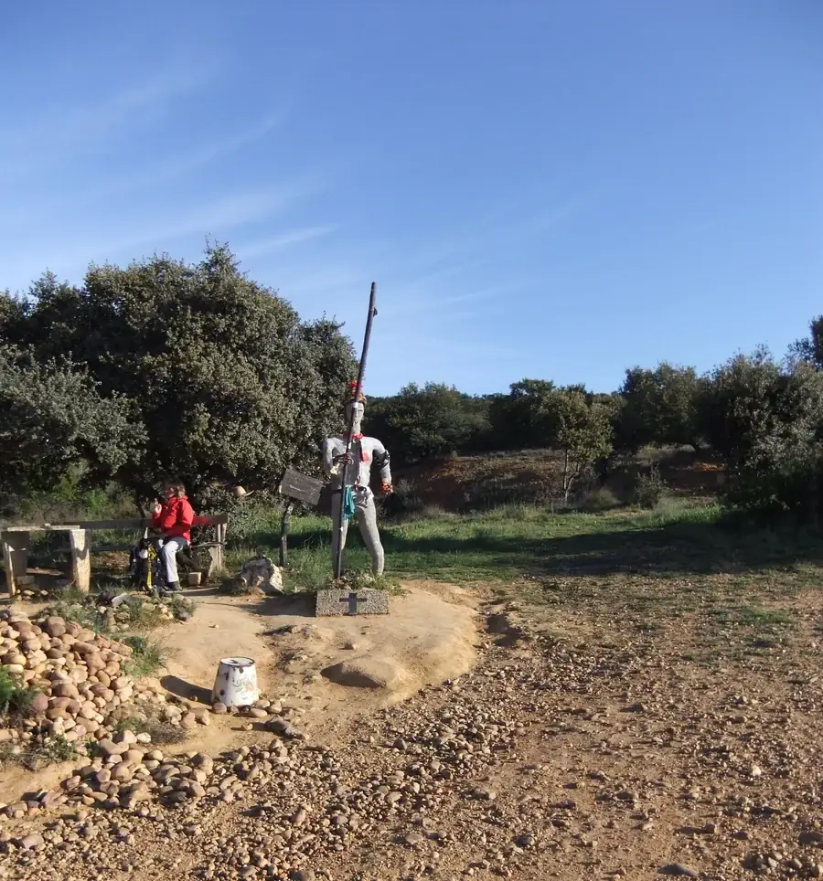
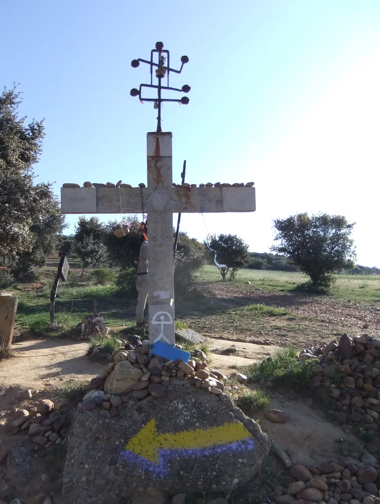
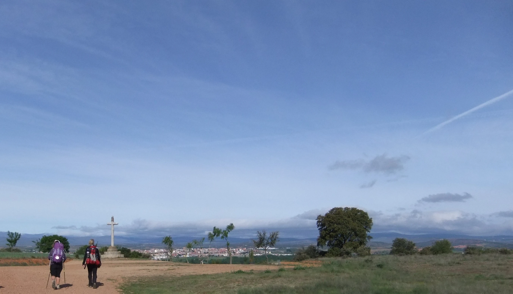

## Camino Francés  2012  

### Etapa-18: Hospital-de-Orbigo → Santa Catalina de Somoza ( 25,7 Km)
22 de Mai 2012

Este día solo he caminado y respirado, ¿y qué más?

An diesem Tag bin ich einfach nur gelaufen und habe geatmet, und was noch?

Nesse dia, eu simplesmente caminhei e respirei… e o que mais?

On that day, I just walked and breathed – and what else?

---

  

🇬🇧
🇪🇸
🇵🇹
🇩🇪

---

**↪** [Etapa-19_Santa-Catalina-de-Somoza_El-Acebo-de-San-Miguel](Etapa-19_Santa-Catalina-de-Somoza_El-Acebo-de-San-Miguel.md)

 🔁 [Camino-Frances_Etapas](Camino-Frances_Etapas.md)

 ...→