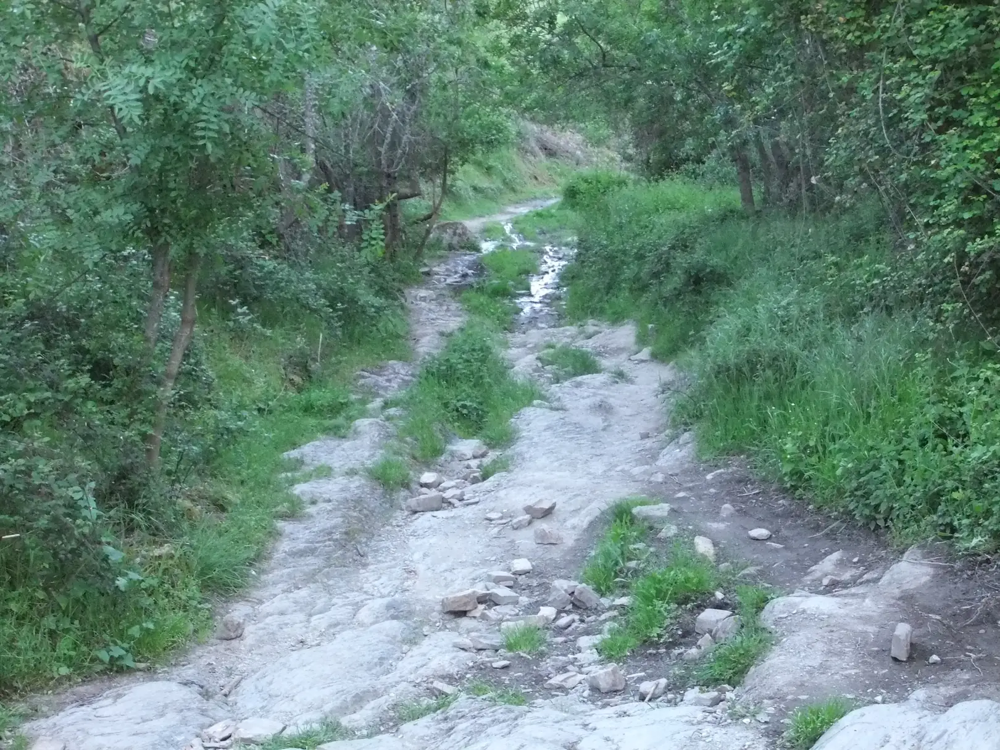
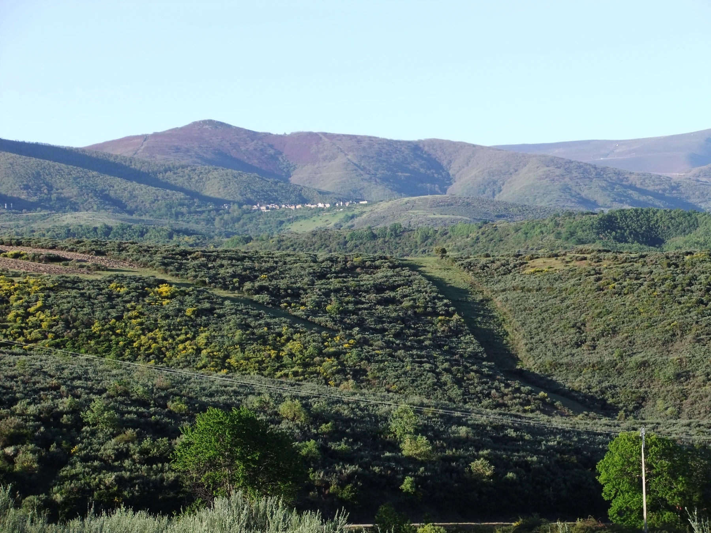
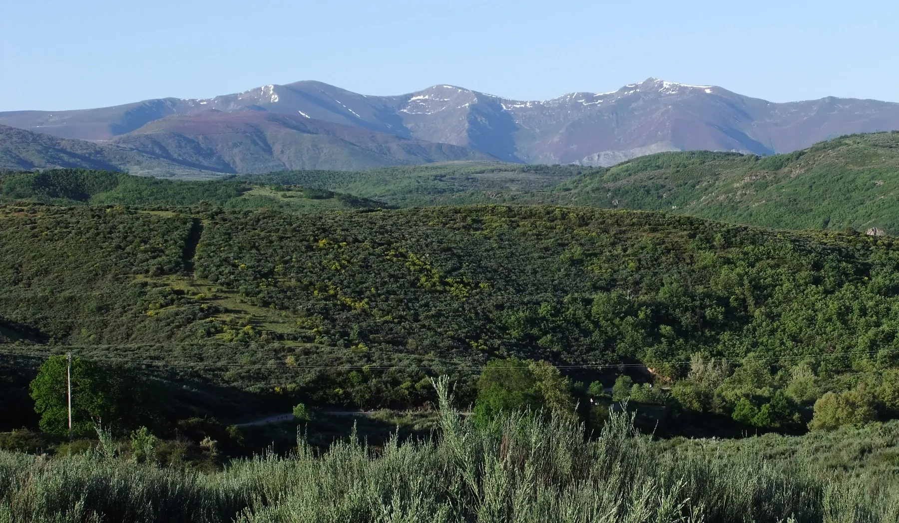
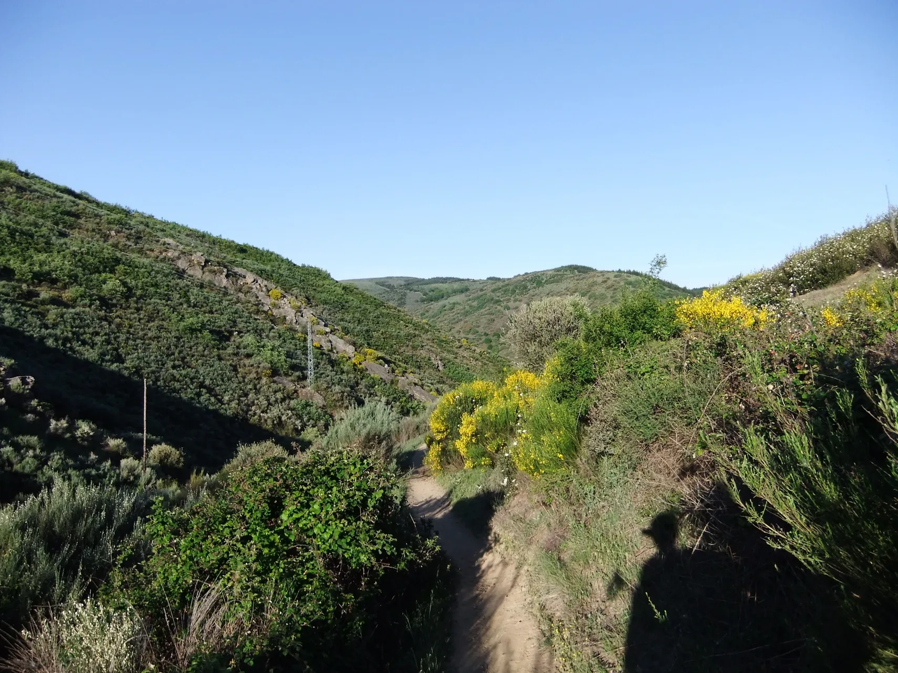
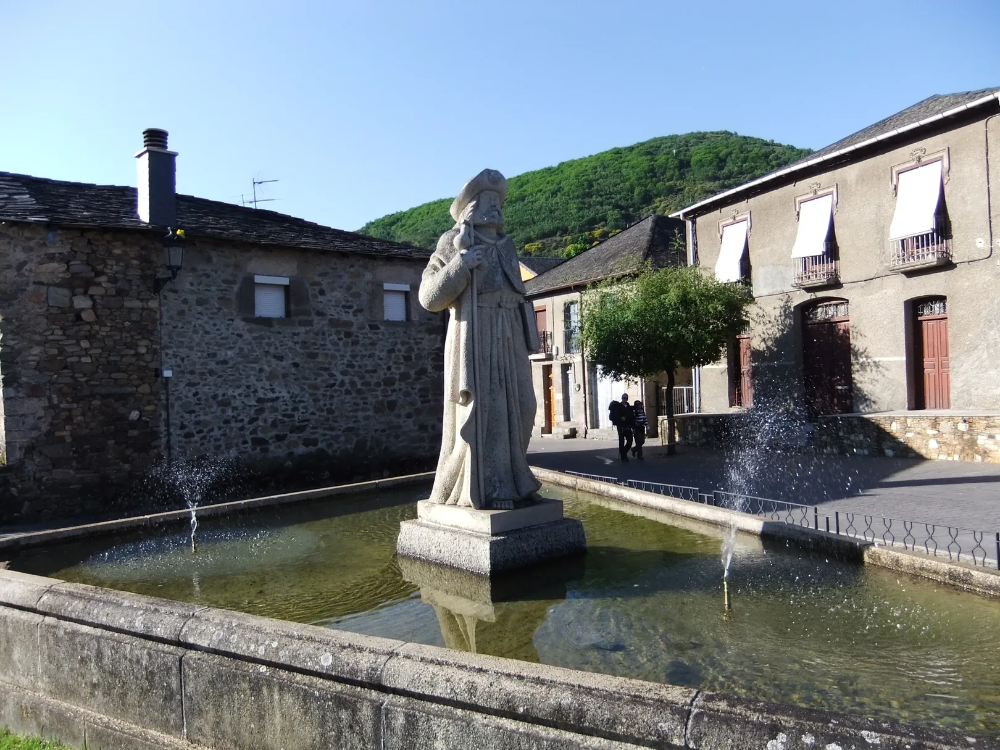
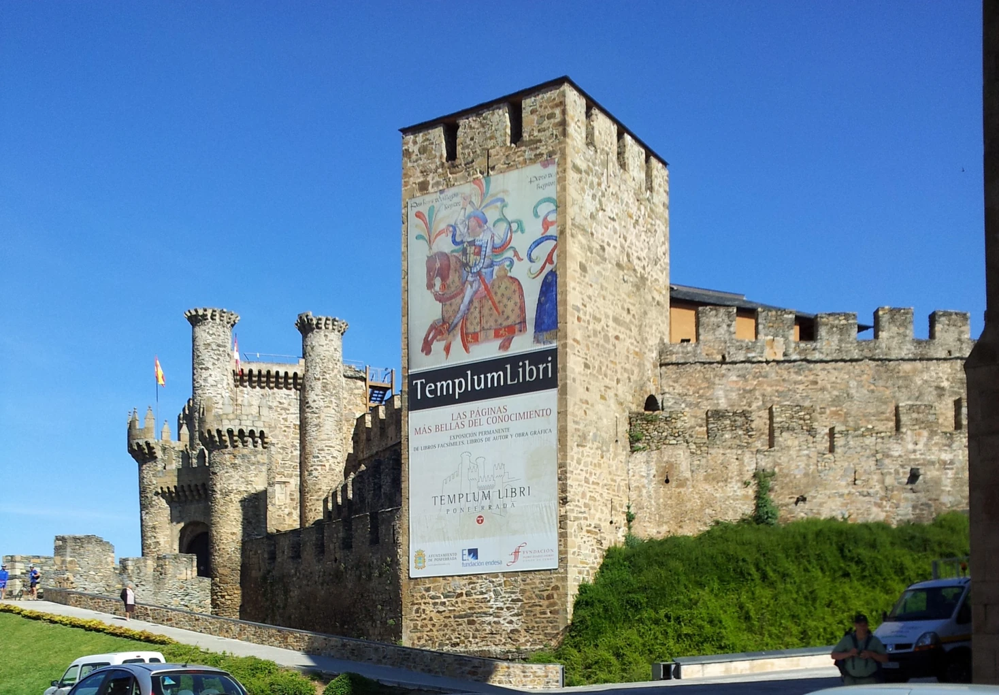
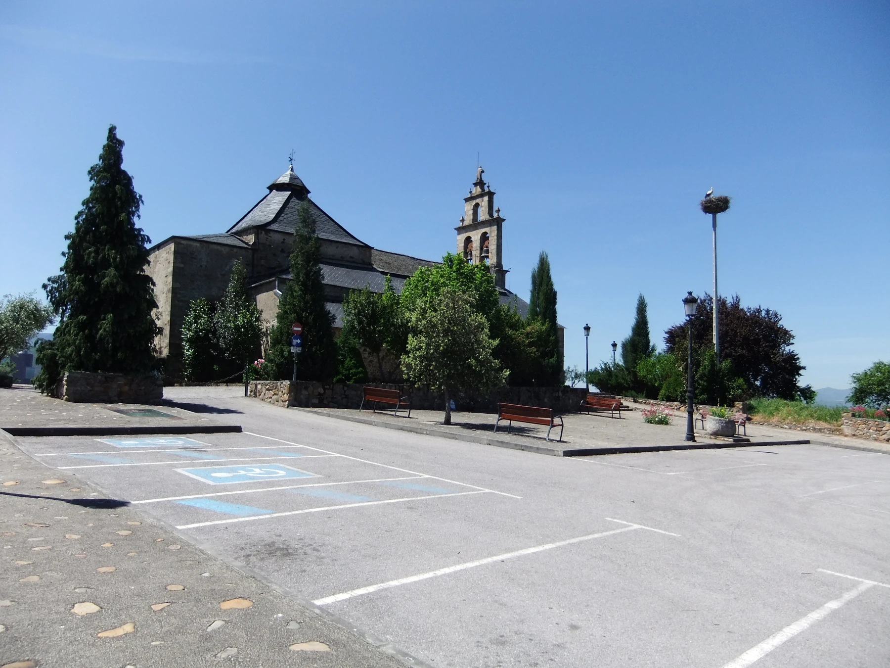
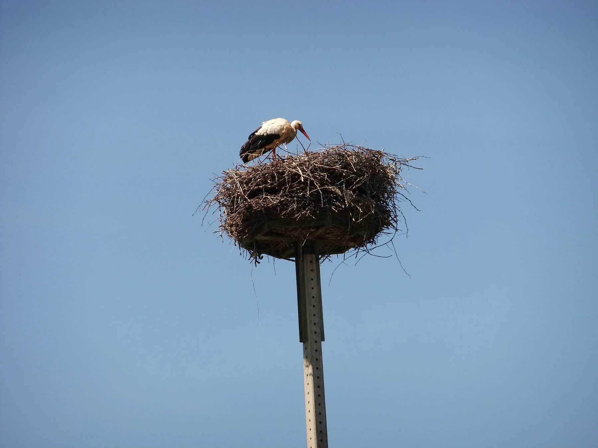
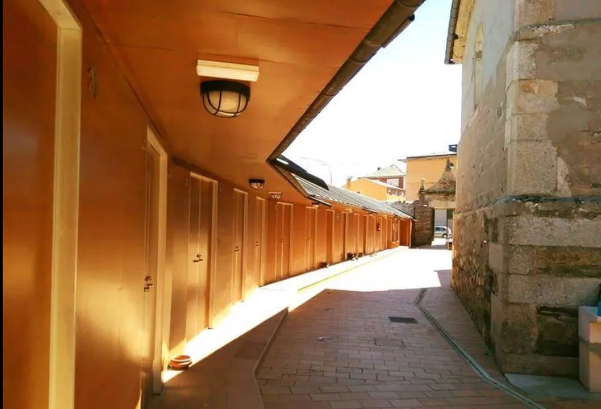
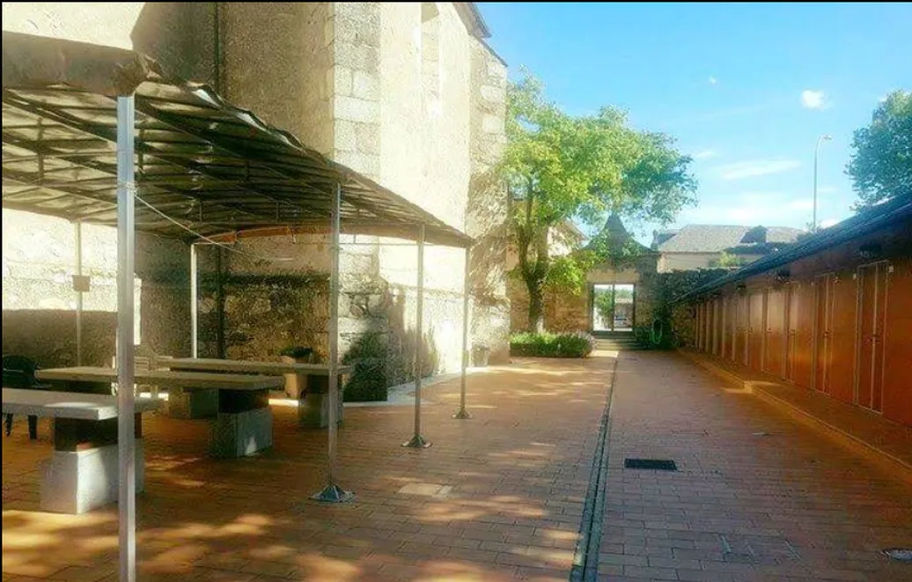

## Camino Francés  2012  

### Etapa-20: El Acebo de San Miguel → Cacabelos ( 31 Km)
24 de Mai 2012

- 🇬🇧 This little trickle marks the visible boundary between the world that came before and the one that follows.
##### The World Before
..., ... .
##### The world afterwards.
..., ... .

---
- 🇩🇪 Dieser kleine Rinnsal markiert die sichtbare Grenze zwischen der vorigen und der danach folgenden Welt.
##### Die Welt davor
..., ... .
##### Die Welt danach.
..., ... .

---
- 🇵🇹 Este pequeno fio de água marca a fronteira visível entre o mundo anterior e o mundo seguinte
##### O mundo anterior
..., ... .
##### O mundo depois
..., ... .

---
- 🇪🇸 Este pequeño hilo de agua marca la frontera visible entre el mundo anterior y el siguiente
##### El mundo de antes
..., ... .
##### El mundo después
..., ... .

- **Albergue de Peregrinos de Cacabelos**

**↓** Googlemaps-Foto **↓** 

**↓** Googlemaps-Foto **↓** 

> 🇩🇪  Ich erinnere mich noch sehr gut an diese Herberge und die Tische, aber was um alles in der Welt habe ich an jenem Tag im Jahr 2012 eigentlich gegessen?
>Ich werde versuchen, diese alles entscheidenden Fragen zu beantworten, sobald ich die Gelegenheit dazu habe. Morgen auf jeden Fall nicht – ich habe Wichtigeres zu tun; ich muss einkaufen gehen.

> 🇵🇹 Ainda me lembro muito bem desse albergue e das mesas, mas o que raio é que eu comi naquele dia de 2012?
> Vou tentar responder a estas questões tão importantes assim que tiver oportunidade. Mas definitivamente não será amanhã – tenho coisas importantes para fazer; preciso de ir às compras.

> 🇪🇸 Todavía recuerdo muy bien ese albergue y aquellas mesas, pero ¿qué demonios comí realmente aquel día de 2012?
> Intentaré responder a estas preguntas tan importantes en cuanto tenga ocasión. Aunque desde luego no será mañana: tengo cosas importantes que hacer; tengo que ir de compras.

> 🇬🇧 I still remember that hostel and the tables very well, but what on earth did I actually eat on that day in 2012?
>I’ll try to answer these all-important questions as soon as I get the chance. Definitely not tomorrow, though – I’ve got important things to do; I need to go shopping.

---

  

🇬🇧
🇪🇸
🇵🇹
🇩🇪

---

**↪** [Etapa-21_Cacabelos_Trabedelo](Etapa-21_Cacabelos_Trabedelo.md)

 🔁 [Camino-Frances_Etapas](Camino-Frances_Etapas.md)

 ...→