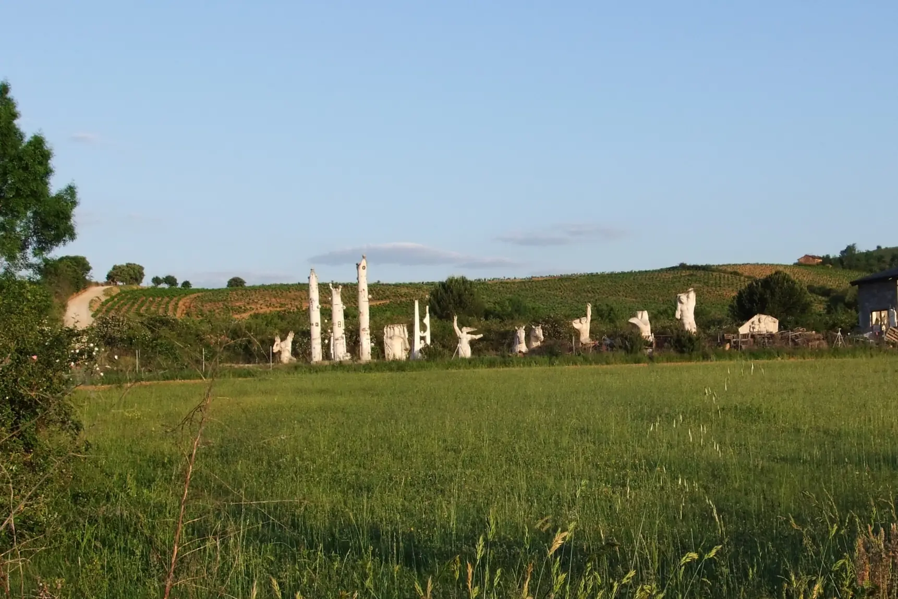
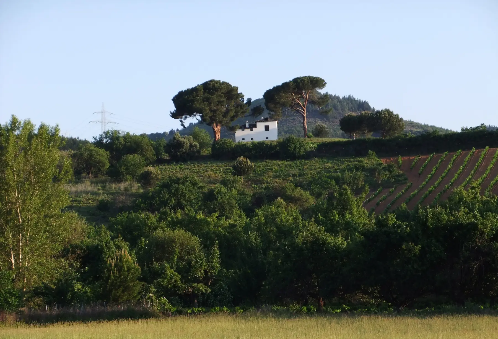
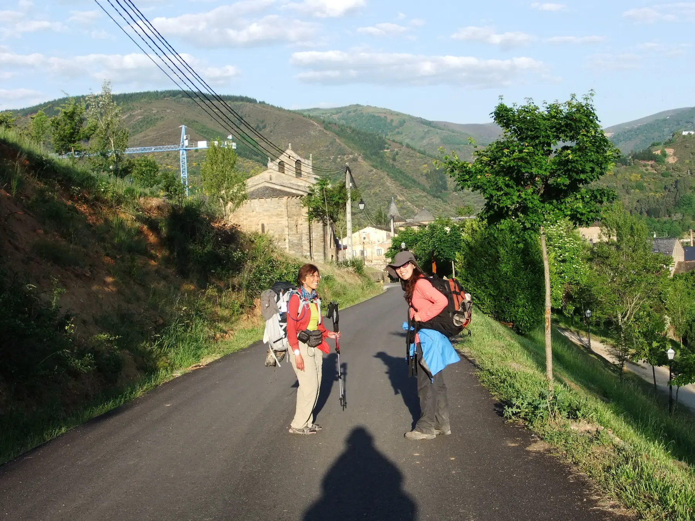
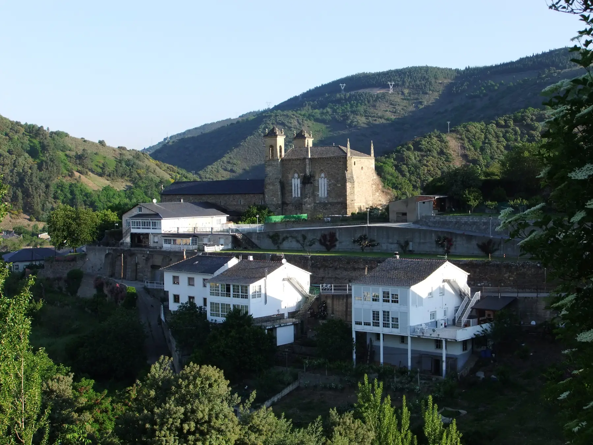
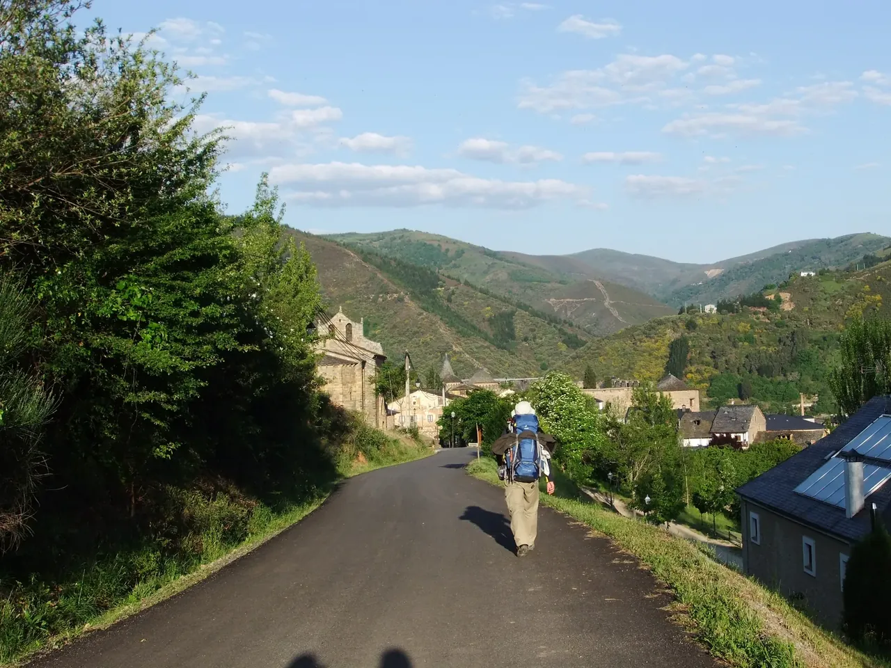
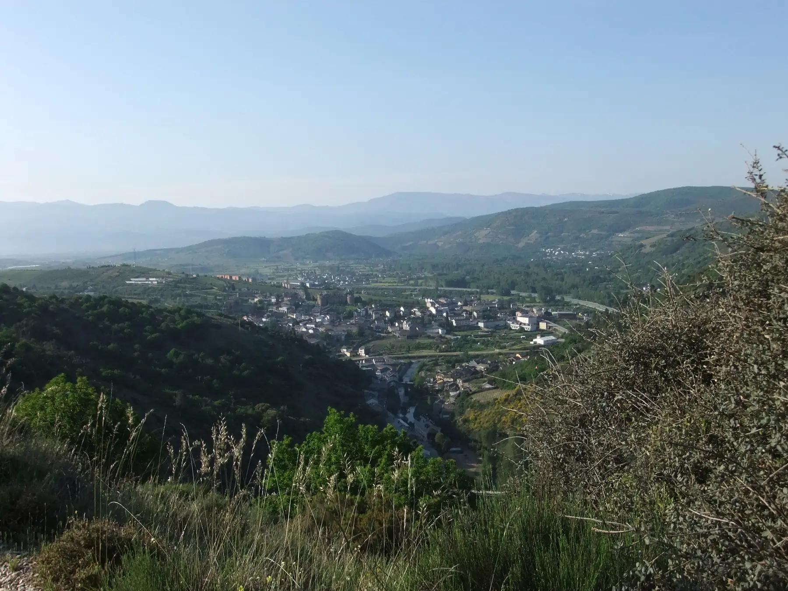

## Camino Francés  2012  

### Etapa-21: →  ( Km)
25 de Mai 2012

Daqui a alguns minutos já não me encontrarão aqui.
Eu não sou o caminho, sou apenas, por um instante, parte do caminho.
Na maioria das vezes, pensamos que somos a paisagem e ocupamos todo o espaço numa fotografia, mas somos apenas viajantes durante uma fração do tempo de uma paisagem.

---

In ein paar Minuten werde ich nicht mehr hier sein.
Ich bin nicht der Weg, ich bin nur für einen Augenblick Teil des Weges.
Meistens glauben wir, wir seien die Landschaft und würden den gesamten Raum auf einem Foto einnehmen, doch wir sind nur Reisende während eines Bruchteils der Zeit einer Landschaft.

---

Dentro de unos minutos ya no estaré aquí.
Yo no soy el camino, solo soy, por un instante, parte del camino.
La mayoría de las veces pensamos que somos el paisaje y que ocupamos todo el espacio en una fotografía, pero solo somos viajeros durante una fracción del tiempo que dura un paisaje.

---
In a few minutes’ time, I won’t be here any more.
I am not the path; I am merely, for a moment, part of the path.
Most of the time, we think we are the landscape and take up the whole frame in a photograph, but we are merely travellers for a fraction of a landscape’s lifetime

---

---

  

🇬🇧
🇪🇸
🇵🇹
🇩🇪

---

**↪** [Etapa-22](Etapa-22.md)

 🔁 [Camino-Frances_Etapas](Camino-Frances_Etapas.md)

 ...→