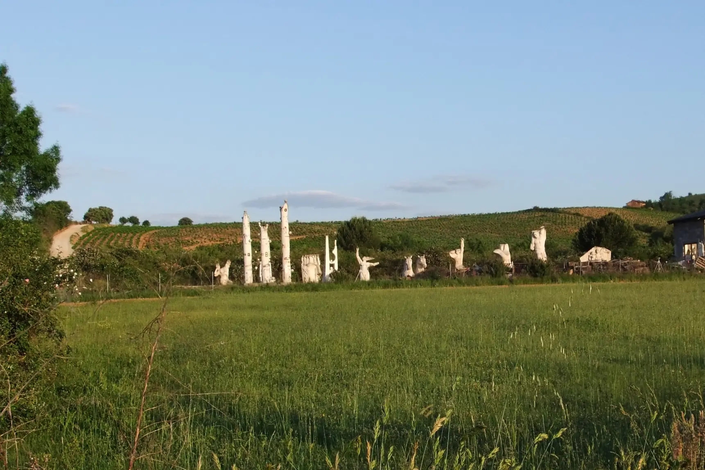
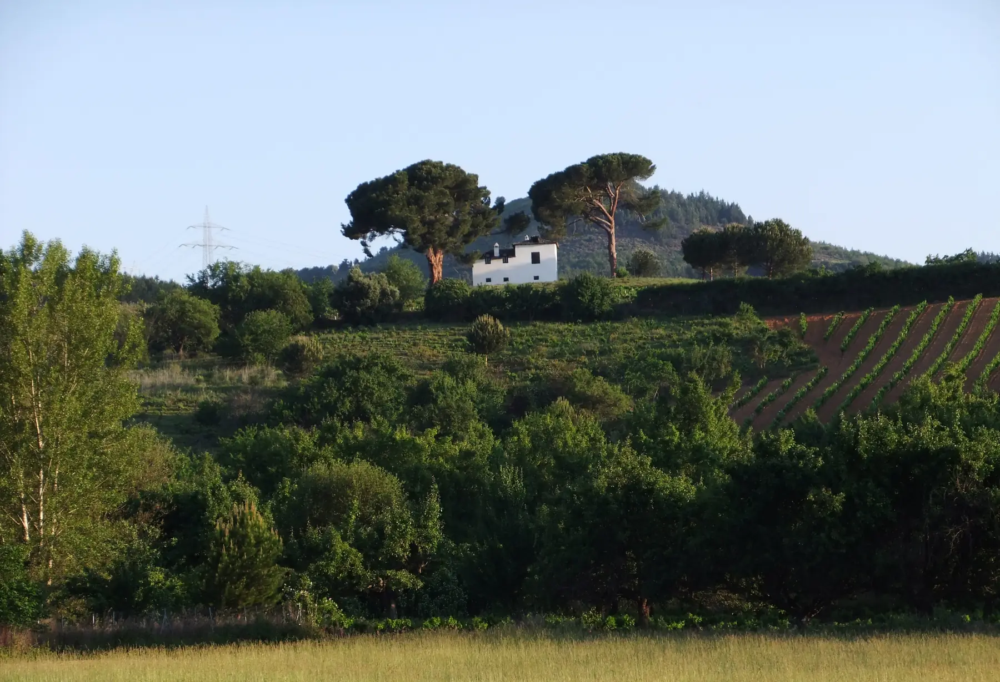
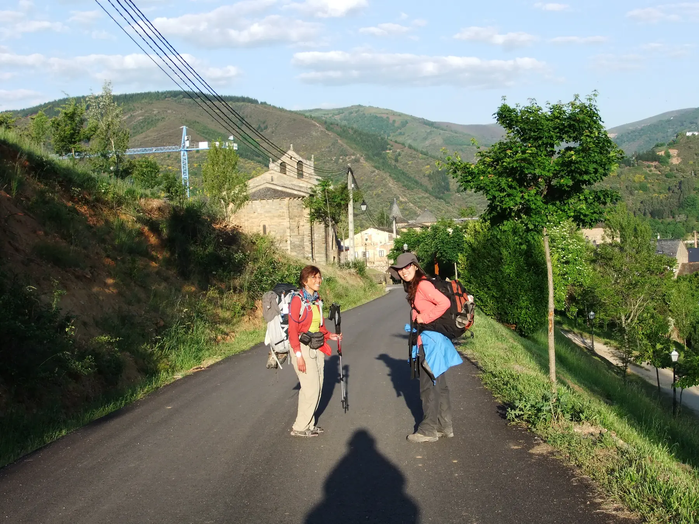
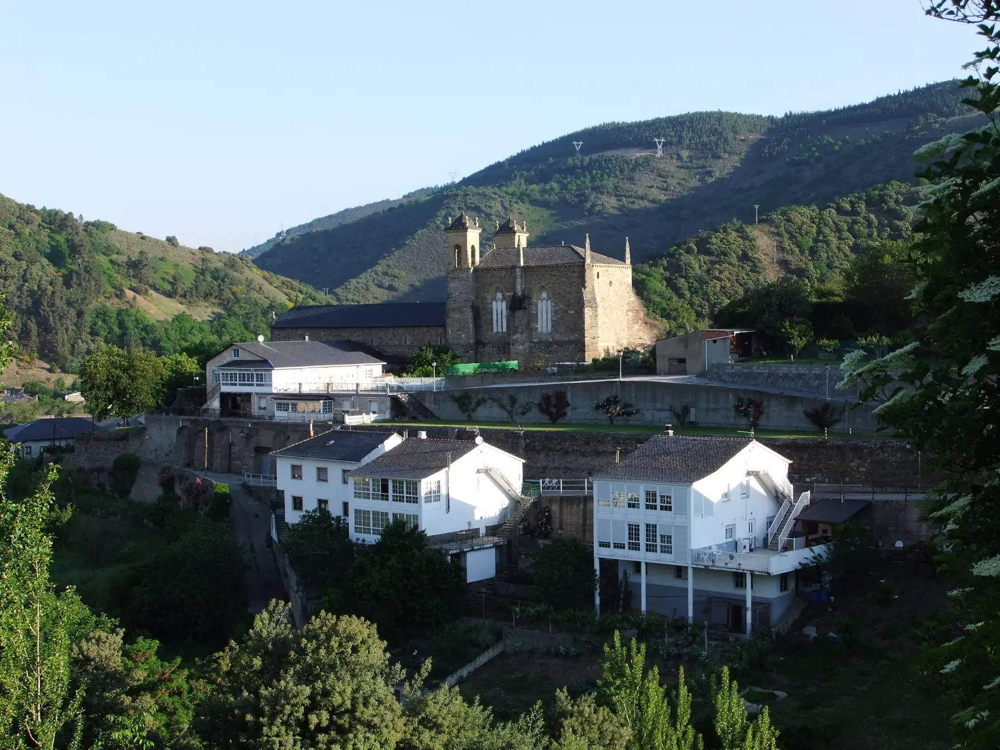
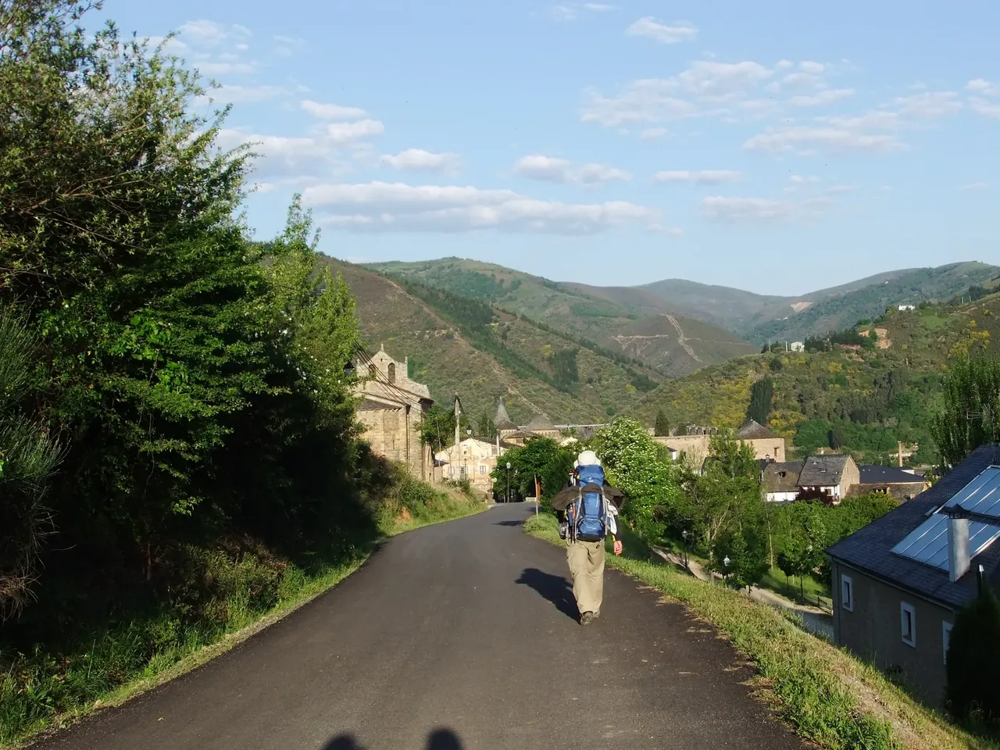
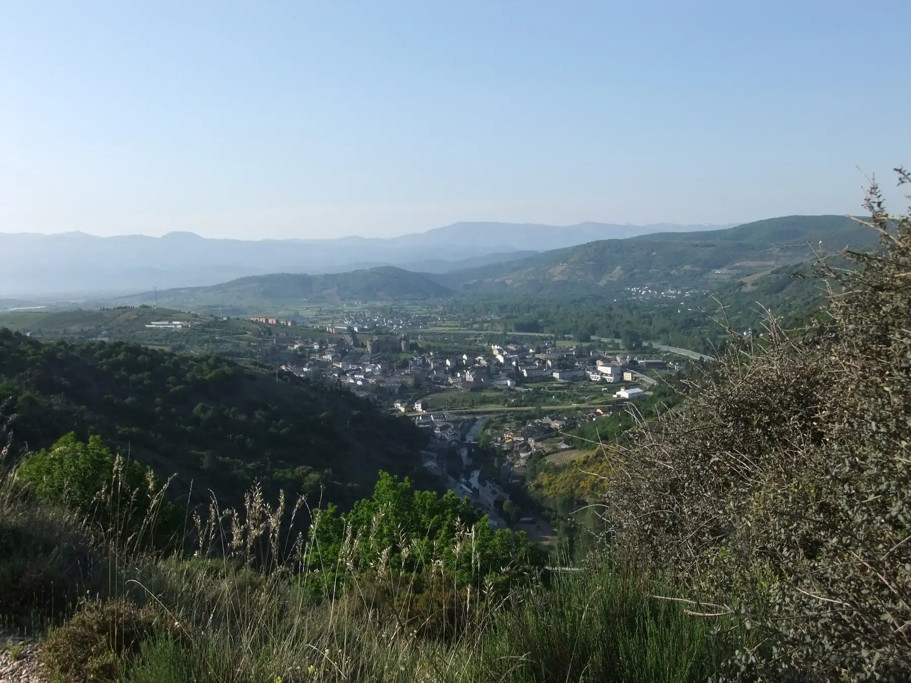
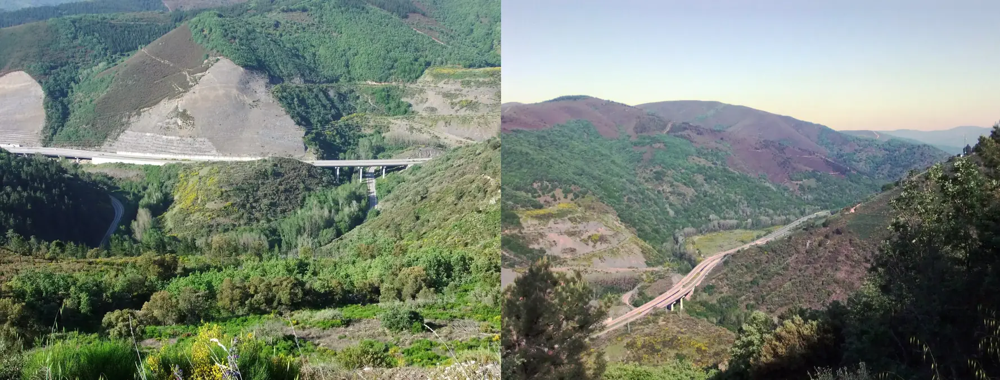

## Camino Francés  2012  

### Etapa-21: Cacabelos → Trabedelo ( 17,4 Km)
25 de Mai 2012

- Eu não sou o caminho

> , sou apenas, por um instante, parte do caminho.

>Daqui a alguns minutos já não me encontrarão aqui.

Na maioria das vezes, pensamos que somos a paisagem e ocupamos todo o espaço numa fotografia, mas somos apenas viajantes durante uma fração do tempo de uma paisagem.

---
- Ich bin nicht der Weg

> , ich bin nur für einen Augenblick Teil des Weges.

>In ein paar Minuten werde ich nicht mehr hier sein.

Meistens glauben wir, wir seien die Landschaft und nehmen  den gesamten Raum auf einem Foto ein, doch wir sind nur Reisende während eines Bruchteils der Zeit einer Landschaft.

---
- Yo no soy el camino

> , solo soy, por un instante, parte del camino.

>Dentro de unos minutos ya no estaré aquí.

La mayoría de las veces pensamos que somos el paisaje y que ocupamos todo el espacio en una fotografía, pero solo somos viajeros durante una fracción del tiempo que dura un paisaje.

---

- I am not the path

>  ; I am merely, for a moment, part of the path.

>In a few minutes’ time, I won’t be here any more.

Most of the time, we think we are the landscape and take up the whole frame in a photograph, but we are merely travellers for a fraction of a landscape’s lifetime

---  

**Bergweg über Pradela**

> Ich habe noch ein paar Fotos von diesem Abschnitt der Strecke gemacht, kann sie aber nicht mehr finden; ich spüre den Anstieg, sehe die Kastanienbäume und erinnere mich, dass ich überlegt habe, ob ich in Pradela vorbeigehen sollte, um ein Bier zu trinken, aber der Aufstieg war anstrengend. Ich bin schließlich zu schnell gelaufen, um ein paar Kilometer zu gewinnen.  Gerade bei den Abwärtspassagen tritt man zu fest auf den Boden, und die Knöchel lassen uns das früher oder später büßen.

Villafranca del Bierzo- Trabadelo  9,6 km + 1,5 km Umweg
 

---

  

🇬🇧
🇪🇸
🇵🇹
🇩🇪

---

**↪** [Etapa-22_Trabedelo_Sarria](Etapa-22_Trabedelo_Sarria.md)

 🔁 [Camino-Frances_Etapas](Camino-Frances_Etapas.md)

 ...→