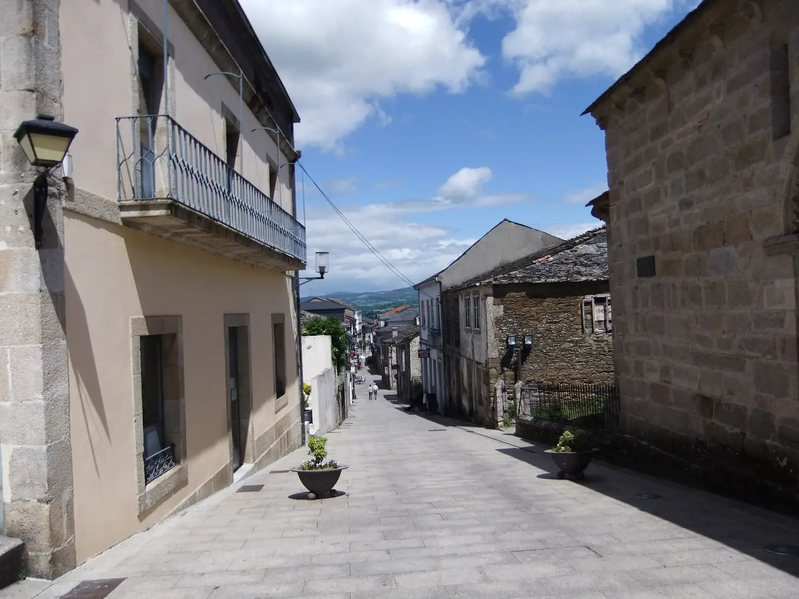
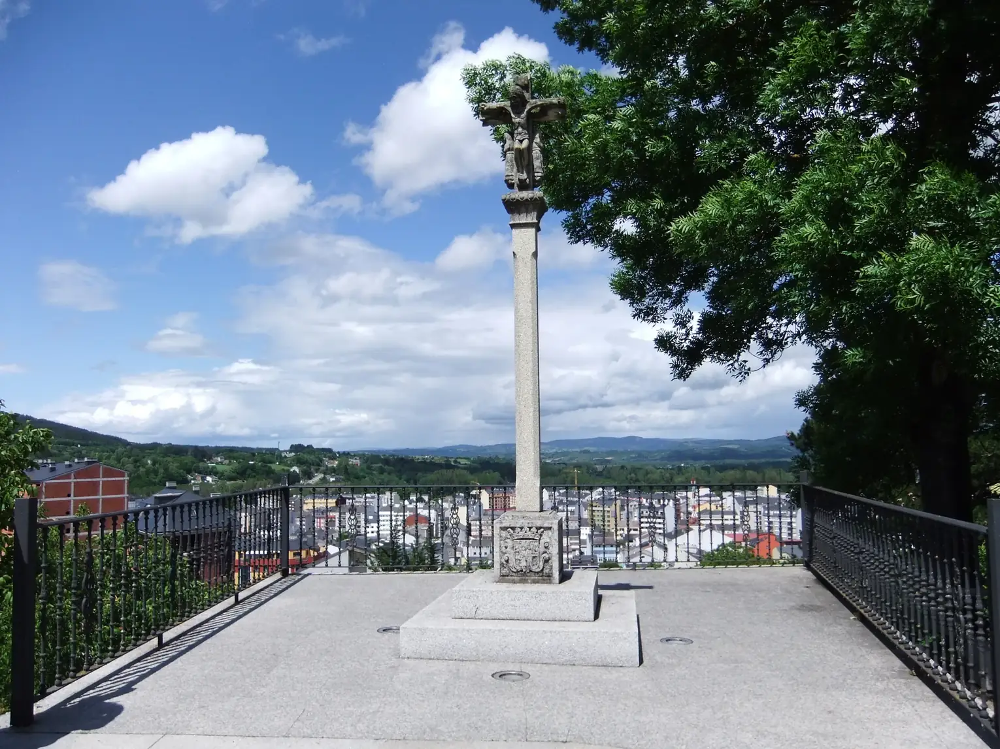
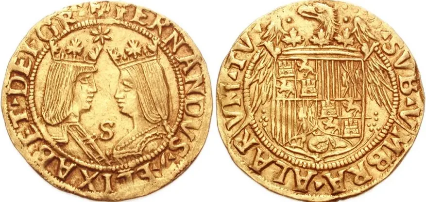

## Camino Francés  2012  

### Etapa-23: Trabadelo🚌 → (Pedrafita do Cebreiro🚌)→   Sarria (56,6 Km)
26 de Mai 2012

Trabadelo - O Cebreiro 18,2 km  ⁘  O Cebreiro - Triacastela 20,6 km  ⁘  Triacastela - Sarria (por San Xil) 17,8 km  **🚌 →   56,6 Km**

---
Trabadelo - O Cebreiro 18,2 km  ⁘  O Cebreiro - Triacastela 20,6 km   ⁘  Triacastela - Sarria (über Samos)   24,7 km **🚌 →   63,5 km**

---

White Spot  ⁘  Mancha Blanca/Branca  ⁘  Weißer Fleck

🇵🇹 Saltei este troço, apanhando o autocarro
Na verdade, só queria saltar o troço até Tricastella, mas depois decidi seguir até Sarria.

Em 2014, como se deve, percorri todo o percurso (com uma noite em Cebreiro... «e Tricastella?»), enquanto caía uma leve garoa (chuva leve mas constante) sobre Samos, e o melhor desse dia foi ter um teto sobre a cabeça e saborear um bom café acompanhado de uma grande sanduíche de ovos mexidos e chouriço.

🇩🇪 Ich habe diesen Abschnitt übersprungen und bin mit dem Bus gefahren.
Eigentlich wollte ich nur den Abschnitt bis Tricastella überspringen, habe mich dann aber entschlossen, bis nach Sarria weiterzufahren.

Im Jahr 2014 bin ich, wie es sich gehört, die gesamte Strecke gelaufen (mit einer Übernachtung in Cebreiro … „und Tricastella?“), während ein leichter Nieselregen über Samos fiel, und das Beste an diesem Tag war, ein Dach über dem Kopf zu haben und einen guten Kaffee zusammen mit einem großen Sandwich mit Rührei und Chouriço zu genießen.

🇪🇸 Me salté este tramo y cogí el autobús.
En realidad, solo quería saltarme el tramo hasta Tricastella, pero luego decidí seguir hasta Sarria.

En 2014, como es debido, recorrí todo el trayecto (con una noche en Cebreiro… «¿y Tricastella?»), mientras caía una ligera llovizna sobre Samos, y lo mejor de ese día fue tener un techo sobre la cabeza y saborear un buen café acompañado de un gran bocadillo de huevos revueltos y chorizo.

🇬🇧 I skipped this section by taking the bus
Actually, I’d only intended to skip the section up to Tricastella, but then I decided to carry on to Sarria.

In 2014, as one should, I walked the whole route (spending a night in Cebreiro… ‘what about Tricastella?’), whilst a light drizzle fell over Samos, and the best thing about that day was having a roof over my head and enjoying a good coffee with a big sandwich of scrambled eggs and chorizo.

🇩🇪 Albergue Dos Oito Marabedís

- Herberge dauerhaft geschlossen
### Albergue Dos Oito Marabedís

In den Jahren 2012 und 2014 habe ich in der „Albergue dos Oito Maravedís“ übernachtet. Diese Herberge gehörte zu den ersten in Sarria. Ihr Name geht auf eine mittelalterliche Tradition zurück: Wenn Adlige und Feudalherren gelobten, nach Santiago zu pilgern, traten sie die Reise oft nicht selbst an. Stattdessen schickten sie ihre Leibeigenen als Stellvertreter. Da die Herren ihren Bediensteten nicht die gesamte Summe für die Reise auf einmal anvertrauen wollten – aus Angst, die Leibeigenen könnten ausgeraubt werden oder mit einer so beträchtlichen Summe fliehen –, hinterlegten sie das Geld bei ausgewählten Klöstern und Institutionen entlang des Weges. Nach dem Erreichen bestimmter Etappen erhielten die Pilger dort jeweils **"8 Maravedís"** für ihren weiteren Weg.

Die Leibeigenschaft 

Die Leibeigenschaft bildete die wirtschaftliche Grundlage des europäischen Feudalismus (etwa vom 8. bis zum 19. Jahrhundert = 1100 Jahre). Die Leibeigenen waren rechtlich an die Ländereien eines Feudalherrn gebunden. Es war ihnen nicht gestattet, diese Ländereien ohne Erlaubnis zu verlassen, zu heiraten oder den Beruf zu wechseln. Während sich die Leibeigenschaft in Westeuropa nach der Pest im 14. Jahrhundert auflöste, festigte sie sich in Osteuropa („Zweite Leibeigenschaft“) und wurde erst dort im 19. Jahrhundert abgeschafft (zum Beispiel 1861 in Russland).

 **Leibeigene:** Menschen mit eingeschränkter Freiheit. Sie waren an das Land gebunden, nicht an die Person des Lehnsherrn. Wurde das Land verkauft, wechselte der Leibeigene zusammen mit dem Land den Eigentümer; außerdem durften sie Eigentum besitzen und (wenn auch oft unter Einschränkungen) eine Familie gründen.
 

Pflichten eines Leibeigenen 

### Pflichten eines Leibeigenen

Die Pflichten eines Leibeigenen im europäischen Feudalismus waren vielschichtig und machten ihn wirtschaftlich und persönlich fast vollständig vom Grundherrn abhängig. Diese Lasten lassen sich in Arbeitspflichten (Frondienste), Abgaben (Geld und Naturalien) und persönliche/rechtliche Beschränkungen unterteilen.

Hier ist eine detaillierte Übersicht über die wichtigsten Pflichten:

#### 1. Die Frondienste (Arbeitspflichten)

Frondienste (im Französischen _corvée_, im Englischen _boon-work_ oder _week-work_) waren unbezahlte Zwangsarbeiten, die der Leibeigene auf dem direkt vom Grundherrn bewirtschafteten Land (dem Fronhof oder Salland) leisten musste.

- Feste Wochendienste (_Week-work_): Der Leibeigene musste eine festgelegte Anzahl von Tagen pro Woche (oft 2 bis 3 Tage) auf den Feldern des Herrn arbeiten – beim Pflügen, Säen, Mähen oder Ernten.
- Saisonaler Baudienst: Neben der Feldarbeit fielen Reparatur- und Bauarbeiten an. Leibeigene mussten Burgen, Herrenhäuser, Straßen, Brücken oder Teiche instand halten oder Holz im herrschaftlichen Wald schlagen.
- Spanndienste: Wer eigene Zugtiere (Ochsen, Pferde) besaß, musste diese samt Wagen für die Transporte des Herrn zur Verfügung stellen. Wer keine Tiere hatte, leistete „Handdienste“.

#### 2. Abgaben und Steuern (Geld und Naturalien)

Ein Leibeigener durfte das ihm zugewiesene Land (die Hufe) zwar für die eigene Familie bewirtschaften, musste dafür aber erhebliche Steuern zahlen:

- Der Zehnt (Dezem): Traditionell musste ein Zehntel der gesamten Ernte (Getreide, Gemüse) sowie des Viehbestands (Kälber, Lämmer, Ferkel) an die Kirche oder den Grundherrn abgegeben werden.
- Reguläre Zinsabgaben: Eine jährliche Abgabe in Geld oder Naturalien (z. B. Eier zu Ostern, Gänse zu Stuhlfeier/Michaelis, Korn nach der Ernte) als „Miete“ für das Land.
- Sonderabgaben im Lebenslauf:
    
    - Besthaupt: **"Das beste Stück"** (Kurmede): Stirbt der männliche Haushaltsvorstand, hatte der Grundherr das Recht auf das beste Stück Vieh (meist das beste Pferd oder die beste Kuh) oder das beste Kleidungsstück des Verstorbenen, bevor die Erben den Hof weiterführen durften.
    - Bannrechte (Mühlen- und Backzwang): Der Leibeigene durfte sein Getreide nur in der Mühle des Herrn mahlen und sein Brot nur im Ofen des Herrn backen. Für die Nutzung dieser Einrichtungen verlangte der Herr eine Gebühr (oft einen Teil des Mehls oder Brotes).

#### 3. Persönliche und rechtliche Abhängigkeiten

Die Pflichten waren nicht nur wirtschaftlicher Natur, sondern betrafen die gesamte Lebensführung:

- Ehegenehmigung (Bedemund): Ein Leibeigener durfte nicht ohne Erlaubnis des Herrn heiraten. Heiratete er jemanden aus einer anderen Grundherrschaft, musste eine „Ablösesumme“ gezahlt werden, da dem Herrn dadurch potenzieller Nachwuchs (zukünftige Arbeitskräfte) verloren ging.
- Wohn- und Berufspflicht (Schollenpflicht): Es war verboten, das Land des Herrn zu verlassen oder ein Handwerk in der Stadt zu erlernen, außer der Herr stimmte ausdrücklich zu.
- Gerichtsbarkeit: Der Grundherr war gleichzeitig der Richter. Bei Vergehen oder Streitigkeiten untereinander mussten die Leibeigenen vor das herrschaftliche Gericht treten, wo der Herr Strafen und Bußgelder verhängen konnte.

Der **Maravedí** (oft fälschlicherweise „Marebedis“ geschrieben) existierte als offizielle spanische Währungseinheit  bis zur Mitte des 19. Jahrhunderts

Die wichtigsten Meilensteine seines Endes waren:

- **Die letzten Münzprägungen:** Als physische Kupfermünze wurde der Maravedí in Spanien letztmals in den Jahren **1854 bis 1855** geprägt.

- **Die offizielle Abschaffung:** Im Zuge der Umstellung auf das Dezimalsystem wurde der Maravedí schließlich im Jahr **1858** als offizielle Währung und Rechnungseinheit endgültig verdrängt und abgeschafft. Ersetzt wurde das alte System schrittweise durch den _Real_ und später im Jahr 1869 durch die _Peseta_.

---

🇪🇸 Albergue Dos Oito Marabedís

- Albergue cerrado permanentemente
### Albergue Dos Oito Marabedís

En los años 2012 y 2014, me alojé en el «Albergue dos Oito Maravedís», uno de los primeros albergues de Sarria. Su nombre proviene de una tradición de la Europa medieval: cuando los nobles y los señores feudales prometían realizar una peregrinación a Santiago, a menudo no hacían el viaje a pie. En su lugar, enviaban a sus siervos como representantes. Como los señores no querían entregar todo el dinero del viaje de una sola vez —por miedo a que los siervos fueran robados o pudieran huir con una suma tan considerable—, depositaban los fondos en determinados monasterios e instituciones de confianza a lo largo del recorrido. Así, al completar ciertas etapas del viaje, los peregrinos recibían **"8 maravedís"** para continuar el camino.

La servidumbre

### La servidumbre
La servidumbre constituía la base económica del feudalismo europeo (aproximadamente desde el siglo VIII hasta el XIX, es decir, 1100 años). Los siervos estaban legalmente vinculados a las tierras de un señor feudal. No se les permitía abandonar esas tierras sin permiso, casarse ni cambiar de profesión. Mientras que la servidumbre se disolvió en Europa occidental tras la peste del siglo XIV, se consolidó en Europa del Este («segunda servidumbre») y no fue abolida allí hasta el siglo XIX (por ejemplo, en 1861 en Rusia).
 Siervos: personas con libertad limitada. Estaban vinculados a la tierra, no a la persona del señor feudal. Si se vendía la tierra, el siervo cambiaba de propietario junto con ella; además, podían poseer bienes y (aunque a menudo con restricciones) formar una familia.
 

Obligaciones de un siervo

### Obligaciones de un siervo

Las obligaciones de un siervo en el feudalismo europeo eran muy variadas y lo hacían depender casi por completo, tanto económica como personalmente, del señor feudal. Estas cargas pueden dividirse en obligaciones laborales (servicios de corvée), tributos (en dinero y en especie) y restricciones personales y jurídicas.

A continuación se ofrece un resumen detallado de las obligaciones más importantes:

#### 1. Los servicios de corvée (obligaciones laborales)

Los servicios de corvée (en francés, _corvée_; en inglés, _boon-work_ o _week-work_) eran trabajos forzados no remunerados que el siervo debía realizar en las tierras explotadas directamente por el señor feudal (la finca señorial o Salland).

- Servicios semanales fijos («_week-work_»): el siervo debía trabajar un número determinado de días a la semana (a menudo de 2 a 3 días) en los campos del señor, arando, sembrando, segando o cosechando.
- Servicios de construcción estacionales: además del trabajo en el campo, había que realizar trabajos de reparación y construcción. Los siervos debían m- Hostel permanently closedantener en buen estado castillos, mansiones señoriales, carreteras, puentes o estanques, o talar madera en el bosque señorial.
- Servicios de tiro: quien poseyera animales de tiro propios (bueyes, caballos) debía ponerlos a disposición del señor, junto con los carros, para sus transportes. Quien no tuviera animales, prestaba «servicios manuales».

#### 2. Impuestos y tributos (dinero y en especie)

Aunque un siervo podía cultivar la tierra que se le había asignado (las parcelas) para su propia familia, a cambio debía pagar impuestos considerables:

- El diezmo (Dezem): tradicionalmente, se debía entregar a la Iglesia o al señor feudal una décima parte de toda la cosecha (cereales, hortalizas), así como del ganado (terneros, corderos, lechones).
- Tributos regulares: un pago anual en dinero o en especie (por ejemplo, huevos en Semana Santa, gansos en la fiesta de San Miguel, cereales tras la cosecha) a modo de «alquiler» de la tierra.
- Tributos especiales a lo largo de la vida:

    - Besthaupt: **La mejor pieza/cabeza** (Kurmede): si fallecía el cabeza de familia masculino, el señor feudal tenía derecho a la mejor pieza de ganado (normalmente el mejor caballo o la mejor vaca) o a la mejor prenda de vestir del difunto, antes de que los herederos pudieran seguir gestionando la granja.
    - Derechos de exclusividad (obligación de moler y hornear): el siervo solo podía moler su cereal en el molino del señor y hornear su pan en el horno del señor. Por el uso de estas instalaciones, el señor exigía una tasa (a menudo una parte de la harina o del pan).

#### 3. Dependencias personales y jurídicas

Las obligaciones no eran solo de carácter económico, sino que afectaban a todos los aspectos de la vida:

- Autorización para contraer matrimonio (Bedemund): un siervo no podía casarse sin el permiso del señor. Si se casaba con alguien de otro señorío, debía pagarse una «suma de rescisión», ya que el señor perdía con ello posibles descendientes (futura mano de obra).
- Obligación de residencia y de ejercicio de un oficio (Schollenpflicht): estaba prohibido abandonar las tierras del señor o aprender un oficio en la ciudad, salvo que el señor lo autorizara expresamente.
- Jurisdicción: el señor feudal era al mismo tiempo el juez. En caso de infracciones o disputas entre ellos, los siervos debían comparecer ante el tribunal señorial, donde el señor podía imponer castigos y multas.

---

🇬🇧 Albergue Dos Oito Marabedís

- Hostel permanently closed
### Albergue Dos Oito Marabedís

In 2012 and 2014, I stayed at the ‘Albergue dos Oito Maravedís’, one of the first hostels in Sarria. Its name derives from a tradition in medieval Europe: when nobles and feudal lords promised to make a pilgrimage to Santiago, they often did not make the journey on foot. Instead, they would send their servants as their representatives. As the lords did not wish to hand over the entire sum for the journey in one go — for fear that the servants might be robbed or might run away with such a considerable sum — they deposited the funds in certain trusted monasteries and institutions along the route. Thus, upon completing certain stages of the journey, the pilgrims would receive  **"8 maravedís"** to continue on their way.

Serfdom 

### Serfdom 
Serfdom formed the economic basis of European feudalism (roughly from the 8th to the 19th century = 1,100 years). Serfs were legally bound to a feudal lord’s lands. They were not permitted to leave these lands without permission, to marry or to change their occupation. Whilst serfdom dissolved in Western Europe following the Black Death in the 14th century, it became entrenched in Eastern Europe (‘Second Serfdom’) and was only abolished there in the 19th century (for example, in Russia in 1861).
 Serfs: people with restricted freedom. They were bound to the land, not to the person of the feudal lord. If the land was sold, the serf changed ownership along with the land; furthermore, they were permitted to own property and (albeit often subject to restrictions) to start a family.
 

The duties of a serf

### The duties of a serf

The duties of a serf under European feudalism were complex and made him almost entirely dependent on the lord of the manor, both economically and personally. These obligations can be divided into labour duties (corvée), levies (money and produce) and personal/legal restrictions.

Here is a detailed overview of the most important duties:

#### 1. Corvée labour (labour obligations)

Corvée labour (known as _corvée_ in French and _boon-work_ or _week-work_ in English) was unpaid compulsory labour that the serf was required to perform on land directly managed by the lord (the manorial estate or salland).

- Fixed weekly duties (_week-work_): The serf had to work a set number of days per week (often 2 to 3 days) on the lord’s fields – ploughing, sowing, mowing or harvesting.
- Seasonal building duties: In addition to field work, repair and construction work was required. Serfs had to maintain castles, manor houses, roads, bridges or ponds, or fell timber in the lord’s forest.
- Transport duties: Anyone who owned draught animals (oxen, horses) had to make them, together with their carts, available for the lord’s transport needs. Those who had no animals performed ‘manual labour’.

#### 2. Levies and taxes (money and produce)

Although a serf was permitted to farm the land allocated to him (the ‘Hufe’) for his own family, he had to pay substantial taxes in return:

- The tithe (Dezem): Traditionally, one-tenth of the total harvest (cereals, vegetables) and of the livestock (calves, lambs, piglets) had to be handed over to the Church or the landlord.
- Regular rent payments: An annual payment in cash or in kind (e.g. eggs at Easter, geese at St Michael’s Day, grain after the harvest) as ‘rent’ for the land.
- Special levies throughout one’s life:

    - **Best**haupt:**The best** head/part (Kurmede): If the male head of the household died, the landlord had the right to the best piece of livestock (usually the best horse or the best cow) or the best item of clothing belonging to the deceased, before the heirs were permitted to continue running the farm.
    - Compulsory use rights (compulsory milling and baking): The serf was only permitted to have his grain milled at the lord’s mill and to bake his bread in the lord’s oven. The lord charged a fee for the use of these facilities (often a portion of the flour or bread).

#### 3. Personal and legal dependencies

These obligations were not merely of an economic nature, but affected every aspect of life:

- Permission to marry (Bedemund): A serf was not permitted to marry without the lord’s consent. If he married someone from another manorial estate, a ‘redemption fee’ had to be paid, as the lord thereby lost potential offspring (future labourers).
- Obligation to reside and work on the lord’s land (Schollenpflicht): It was forbidden to leave the lord’s land or to learn a trade in the town, unless the lord gave his express consent.
- Jurisdiction: The lord was also the judge. In the event of offences or disputes amongst themselves, the serfs had to appear before the lord’s court, where the lord could impose penalties (punishments) and fines.

---

🇵🇹 Albergue Dos Oito Marabedís

- Albergue encerrado definitivamente
### Albergue Dos Oito Marabedís

Nos anos de 2012 e 2014, fiquei hospedado no "Albergue dos Oito Maravedís", um dos primeiros albergues de Sarria. O seu nome deriva de uma tradição da Europa medieval: quando os nobres e senhores feudais prometiam fazer uma peregrinação a Santiago, muitas vezes não faziam a peregrinação. Em vez disso, enviavam os seus servos como representantes. Como os senhores não queriam entregar todo o dinheiro da viagem de uma só vez — por medo de que os servos fossem roubados ou pudessem fugir com uma quantia tão considerável —, depositavam os fundos em determinados mosteiros e instituições de confiança ao longo do percurso. Assim, ao completarem certas etapas da viagem, os peregrinos recebiam **"8 maravedís"** para continuar o caminho.

A servidão 

### A servidão

A servidão constituiu a base económica do feudalismo europeu (aproximadamente do século VIII ao século XIX = 1100 anos). Os camponeses servos estavam legalmente vinculados às terras de um senhor feudal. Não lhes era permitido abandonar essas terras sem autorização, casar-se ou mudar de profissão. Enquanto a servidão se dissolveu na Europa Ocidental após a Peste do século XIV, consolidou-se na Europa Oriental («Segunda Servidão») e só ali foi abolida no século XIX (por exemplo, em 1861 na Rússia).
 Servos: pessoas com liberdade limitada. Estavam vinculados à terra, não à pessoa do senhor. Se a terra fosse vendida, o servo mudava de proprietário juntamente com a terra; além disso, podiam possuir bens e (embora muitas vezes sob restrições) constituir família.

Deveres de um servo

### Deveres de um servo

Os deveres de um servo no feudalismo europeu eram complexos e tornavam-no quase totalmente dependente do senhor feudal, tanto a nível económico como pessoal. Estes encargos podem ser divididos em obrigações de trabalho (serviços forçados), tributos (em dinheiro e em espécie) e restrições pessoais/legais.

Aqui está uma visão geral detalhada dos principais deveres:

#### 1. Os serviços de corvée (obrigações laborais)

Os serviços de corvée (em francês _corvée_, em inglês _boon-work_ ou _week-work_) eram trabalhos forçados não remunerados que o servo tinha de realizar nas terras geridas diretamente pelo senhor feudal (a herdade ou Salland).

- Serviços semanais fixos (_Week-work_): o servo tinha de trabalhar um número fixo de dias por semana (muitas vezes 2 a 3 dias) nos campos do senhor – a arar, a semear, a ceifar ou a colher.
- Serviço de construção sazonal: para além do trabalho no campo, havia trabalhos de reparação e construção. Os servos tinham de manter castelos, mansões, estradas, pontes ou lagoas em bom estado, ou ainda cortar madeira na floresta senhorial.
- Serviços de tração: quem possuísse animais de tração próprios (bois, cavalos) tinha de os disponibilizar, juntamente com as carroças, para os transportes do senhor. Quem não tivesse animais prestava «serviços manuais».

#### 2. Contribuições e impostos (dinheiro e em espécie)

Um servo tinha permissão para cultivar a terra que lhe era atribuída (as parcelas) para sustento da sua própria família, mas, em troca, tinha de pagar impostos consideráveis:

- O dízimo (Dezem): tradicionalmente, um décimo de toda a colheita (cereais, legumes) e do gado (bezerros, cordeiros, leitões) tinha de ser entregue à Igreja ou ao senhor feudal.
- Impostos regulares: uma contribuição anual em dinheiro ou em espécie (por exemplo, ovos na Páscoa, gansos na festa de São Miguel, cereais após a colheita) a título de «renda» pela terra.
- Contribuições especiais ao longo da vida:

    - **Best**haupt: **A melhor** cabeça/peça (Kurmede): Se o chefe de família do sexo masculino falecesse, o senhor feudal tinha direito à melhor peça de gado (na maioria das vezes, o melhor cavalo ou a melhor vaca) ou à melhor peça de vestuário do falecido, antes de os herdeiros poderem continuar a gerir a quinta.
    - Direitos de exclusão (obrigação de moagem e de cozedura): O servo só podia moer os seus cereais no moinho do senhor e cozer o seu pão no forno do senhor. Pela utilização destas instalações, o senhor exigia uma taxa (muitas vezes uma parte da farinha ou do pão).

#### 3. Dependências pessoais e jurídicas

Os deveres não eram apenas de natureza económica, mas abrangiam todo o modo de vida:

- Autorização para casar (Bedemund): Um servo não podia casar sem a autorização do senhor. Se casasse com alguém de outro feudo, tinha de ser paga uma «indemnização», uma vez que o senhor perdia assim potenciais descendentes (futura mão-de-obra).
- Obrigação de residência e de exercício de profissão (Schollenpflicht): era proibido abandonar as terras do senhor ou aprender um ofício na cidade, a menos que o senhor o autorizasse expressamente.
- Jurisdição: o senhor feudal era, simultaneamente, o juiz. Em caso de infrações ou litígios entre si, os servos tinham de comparecer perante o tribunal senhorial, onde o senhor podia impor penas e multas.

---

  

🇬🇧
🇪🇸
🇵🇹
🇩🇪

---

**↪** [Etapa-23_Sarria_Gonzar](Etapa-23_Sarria_Gonzar.md)

 🔁 [Camino-Frances_Etapas](Camino-Frances_Etapas.md)

 ...→