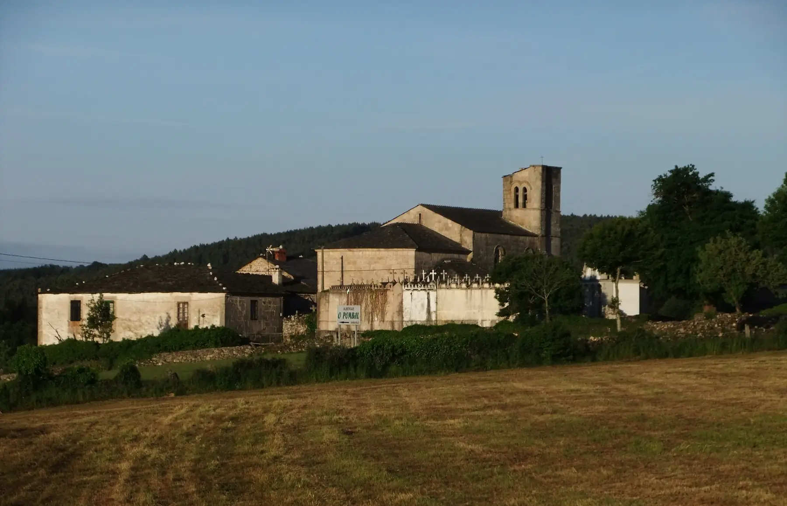
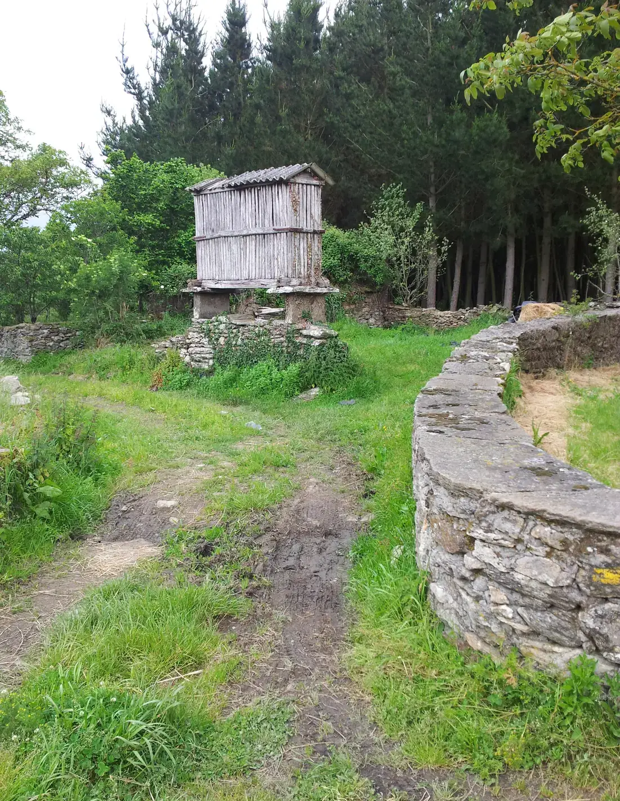
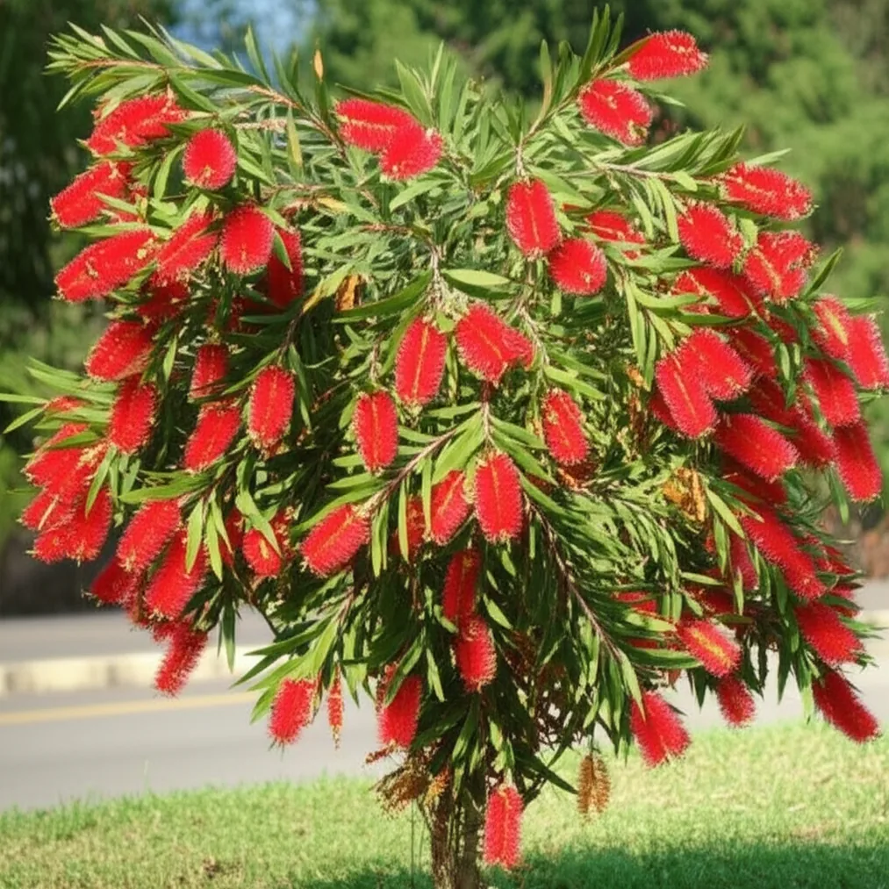

## Camino Francés  2012  

### Etapa-23: Sarria → Gonzar ( 30,1Km)
27 de Mai 2012

 **Calistemo**, **Escova-de-garrafa**, **lava-garrafas, cauda de gato** ou **bottlebrush**

Foto von: **↓** viveirodasarvores.com **↓** 

#### In Portomarín:

🇩🇪 Ich habe diese Pflanze zum ersten Mal 2012 in Portomarín gesehen; 2018 wurde ich auf dem Camino del Norte in Arenillas danach gefragt; und 2023, während ich auf den „Caminhos do Caravaggio“ (Linha Imperial) unterwegs war, erfuhr ich, um welche Pflanze es sich handelte.

🇬🇧  I first saw this plant in Portomarín in 2012; in 2018, I was asked about it on the Camino del Norte in Arenillas; and in 2023, whilst on the ‘Caminhos do Caravaggio’ (Linha Imperial), I learnt what it was.
 
🇵🇹 Vi esta planta pela primeira vez em Portomarín, em 2012; em 2018, perguntaram-me sobre ela no Caminho do Norte, em Arenillas; e em 2023, enquanto percorria os «Caminhos do Caravaggio» (Linha Imperial), descobri o que era.

🇪🇸  Vi esta planta por primera vez en Portomarín en 2012; en 2018, me preguntaron por ella en el Camino del Norte, en Arenillas; y en 2023, mientras recorría los «Caminhos do Caravaggio» (Linha Imperial), descubrí de qué se trataba.

- *04_Camino-del-Norte_2018-X/Etappe-09_Pubeña_Islares-Playa-Arenillas*
- *Caminhos-de-Caravaggio/Etappe-06_Linha-Brasil_Nova-Petropolis*

🇩🇪 Ich weiß, dass ich mich damals gefragt habe, ob ich meinen Job kündigen oder mir eine neue Wohnung suchen sollte. Denn abgesehen von der Pflanze – dem Calistemo – und der Tatsache, dass die Kirche vom Flussufer auf einen Hügel verlegt werden musste, und dass dies alles ist, was mir von Portomarim in Erinnerung geblieben ist, kann ich mich an nichts anderes mehr erinnern.

🇵🇹 Sei que, naquela altura, me perguntei se devia deixar o meu emprego ou procurar um novo apartamento. Pois, além da planta – o calistemo – e do facto de terem tido de transferir a igreja da margem do rio para uma colina, e de isso ser tudo o que restou de Portomarim na minha memória, já não me lembro de mais nada.

🇪🇸 Sé que, en aquel  tiempo , me pregunté si debía dejar mi trabajo o buscar un nuevo piso. Y es que, aparte de la planta —el calistemo— y del hecho de que tuvieran que trasladar la iglesia desde la orilla del río a una colina, y de que eso sea todo lo que me queda de Portomarim en la memoria, ya no recuerdo nada más.

🇬🇧 I know that, at the time, I wondered whether I should quit my job or look for a new flat. Well, apart from the plant – the callistemon – and the fact that they had to move the church from the riverbank to a hill, and that this is all that remains of Portomarim in my memory, I can’t remember anything else.

---

  

🇬🇧 🇪🇸 🇵🇹 🇩🇪
#wohnung

---

**↪** [Etapa-24_Gonzar_Melide](Etapa-24_Gonzar_Melide.md)

 🔁 [Camino-Frances_Etapas](Camino-Frances_Etapas.md)

 ...→