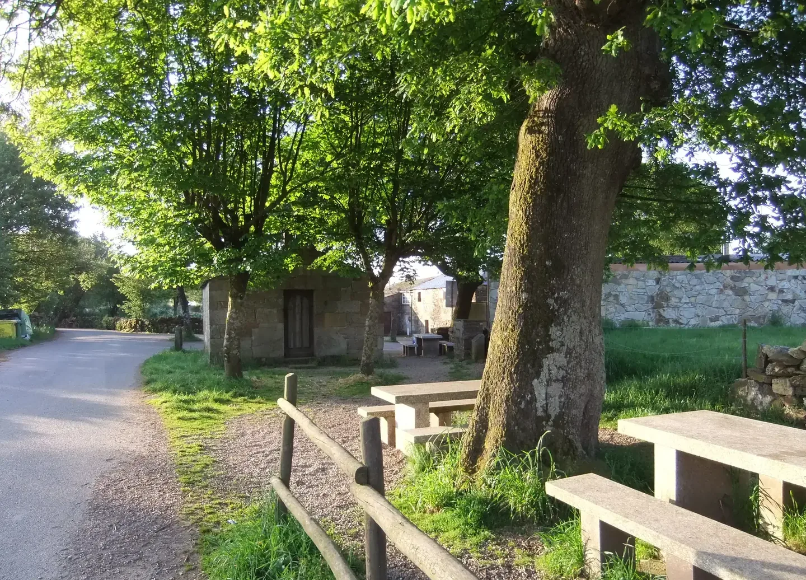
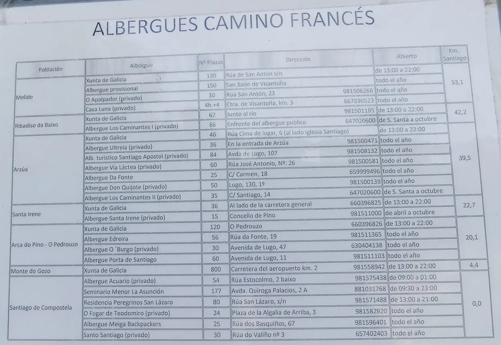
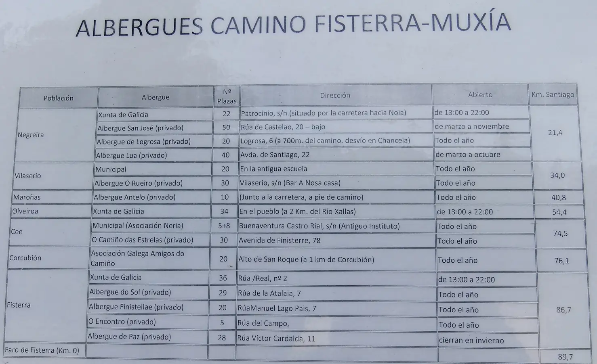

## Camino Francés  2012  

### Etapa-24: Gonzar → Melide ( 31,3 Km)
28 de Mai 2012

- 🇩🇪 Ein Bruchteil eines Augenblicks:   Dieses Foto gibt nicht wirklich wieder, was hier vor sich geht. Wenn wir uns hinsetzen, um darüber nachzudenken, was zuvor geschehen ist und was als Nächstes kommen wird, haben wir keine Zeit dafür. Wir sind ständig damit beschäftigt, den  Pilgern „Buen Camino“ zu wünschen.

- 🇵🇹 Uma fração de um momento:   Esta fotografia não reflete realmente o que se passa aqui. Se nos sentarmos para pensar no que aconteceu antes e no que virá a seguir, não teremos tempo para isso. Estamos constantemente ocupados a desejar «Buen Camino» aos peregrinos.

-  🇪🇸 A fraction of a moment:   This photograph doesn’t really capture what’s going on here. If we were to stop and think about what happened before and what’s to come, we wouldn’t have time for it. We’re constantly busy wishing the pilgrims ‘Buen Camino’.

- 🇬🇧 Una fracción de segundo:   Esta fotografía no refleja realmente lo que ocurre aquí. Si nos paramos a pensar en lo que ha pasado antes y en lo que vendrá después, no tendremos tiempo para ello. Estamos constantemente ocupados deseando «Buen Camino» a los peregrinos.

---

  

🇬🇧
🇪🇸
🇵🇹
🇩🇪

---

**↪** [Etapa-25_Melide_Santiago-de-Compostela](Etapa-25_Melide_Santiago-de-Compostela.md)

 🔁 [Camino-Frances_Etapas](Camino-Frances_Etapas.md)

 ...→