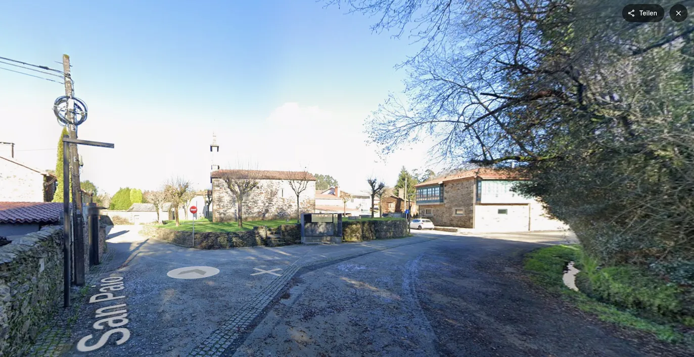

## Camino Francés 2012  

### Etapa-25: Melide → San Lázaro ( 50,6 Km)
29 de Mai 2012

- As sombras que nos acompanham
 ..., ... .

- Die Schatten, die uns begleiten
 ..., ... .

- Las sombras que nos acompañan

 ..., ... .

- The shadows that accompany us

 ..., ... .

**↑**  San Paio,  Capilla de Santa Lucía **↑**   Google-Maps-Foto

**↓**  Santiago de Compostela  **↓** 

🇩🇪 Einmal Stempel

#### San Paio, die Kapelle Santa Lúcia und ein Stempel

- **Ich bin bis hierher gekommen – etwas, das ich bei meinem Aufbruch aus Melide so nicht geplant hatte**

Man setzt sich hin und überlegt, wo man die Nacht verbringen kann.

Ich sah, dass die größte Herberge in Monte do Gozo lag und dass dort die Chancen gut standen, noch ein Bett zu bekommen. Es waren nur knapp 7 km. Zu diesem Zeitpunkt hatte ich bereits 4 kg weniger im Rucksack und sicherlich auch 8 kg weniger Eigengewicht. Meine Füße waren mir dafür dankbar. Sie fühlten sich zwar müde an, aber eigentlich noch ganz gut. Und so stellte sich die Frage: Wie weit geht es noch?

Also wanderte ich zunächst bis nach Monte do Gozo. Als ich dort ankam, sah ich diesen riesigen Komplex mit seinen vielen Herbergen und dachte mir, dass es vermutlich genauso lange dauern würde, mich dort zurechtzufinden, wie einfach bis zur nächsten Herberge weiterzugehen.

Von da an entschuldigte ich mich bei meinen Füßen dafür, dass ich ihnen auf dieser letzten Etappe eine der größten Anstrengungen auf dem Französischen Weg abverlangt hatte, und versprach ihnen, ihnen in den nächsten zwei Tagen die nötige Ruhe zu gönnen.

Und so trugen mich meine Füße, die kurz vor dem Zusammenbruch standen, schließlich noch bis zur Herberge Santo Santiago.

Diese Etappe war eine der drei längsten Etappen auf all meinen bisherigen Pilgerwegen. Was die Erschöpfung betrifft, gehört sie definitiv zum letzten Drittel meiner persönlichen Top 10.

- **Pilgerherberge Monte do Gozo – 6,7 km**
- **Herberge Santo Santiago – 9,1 km**

---

🇵🇹 Um carimbo

#### San Paio, a capela de Santa Lúcia e um carimbo

- **Cheguei até aqui – algo que não tinha planeado quando saí de Melide**

Sentei-me  e começo a pensar onde poderemos passar a noite.

Vi que o maior albergue ficava em Monte do Gozo e que ali havia boas hipóteses de ainda conseguir uma cama. Eram apenas mais 7 km. Naquele momento, já tinha 4 kg a menos na mochila e, certamente, também cerca de 8 kg a menos de peso corporal. Os meus pés agradeciam. Estavam cansados, mas, na verdade, ainda se sentiam relativamente bem. E então surgiu a pergunta: quanto mais?

Continuei, primeiro, até Monte do Gozo. Quando lá cheguei, deparei-me com aquele enorme complexo, com tantos albergues, e pensei que provavelmente demoraria tanto tempo a orientar-me por ali como a continuar simplesmente até ao próximo albergue.

A partir desse momento, pedi desculpa aos meus pés por lhes ter exigido, nesta última etapa, um dos maiores esforços de todo o Caminho Francês. E prometi-lhes que, nos dois dias seguintes, lhes daria o descanso que mereciam.

E assim, os meus pés, já à beira do colapso, levaram-me finalmente até ao albergue Santo Santiago.

Esta etapa foi uma das três mais longas de todos os meus caminhos de peregrinação até hoje. No que diz respeito ao cansaço, pertence sem dúvida ao último terço do meu Top 10 pessoal.

- **Albergue de peregrinos de Monte do Gozo – 6,7 km**
- **Albergue Santo Santiago – 9,1 km**

---

🇪🇸 Un sello

#### San Paio, la capilla de Santa Lúcia y un sello

- **He llegado hasta aquí, algo que no había planeado cuando salí de Melide**

Uno se sienta y empieza a pensar dónde pasar la noche.

Vi que el albergue más grande estaba en Monte do Gozo y que allí había buenas posibilidades de encontrar todavía una cama. Eran apenas unos 7 km más. En ese momento ya llevaba 4 kg menos en la mochila y, seguramente, también unos 8 kg menos de peso corporal. Mis pies me lo agradecían. Estaban cansados, sí, pero todavía se sentían bastante bien. Y entonces surgió la pregunta: ¿cuánto más?

Así que primero continué hasta Monte do Gozo. Cuando llegué, vi aquel enorme complejo, con tantos albergues, y pensé que probablemente tardaría tanto tiempo en orientarme allí como en seguir caminando hasta el siguiente albergue.

A partir de ese momento, pedí disculpas a mis pies por haberles exigido, en esta última etapa, uno de los mayores esfuerzos de todo el Camino Francés. Y les prometí que durante los dos días siguientes les daría el descanso que se merecían.

Y así, mis pies, que ya estaban al borde del colapso, consiguieron llevarme finalmente hasta el albergue Santo Santiago.

Esta etapa fue una de las tres más largas de todos mis caminos de peregrinación hasta ahora. En cuanto al cansancio, pertenece sin duda al último tercio de mi Top 10 personal.

- **Albergue de peregrinos de Monte do Gozo – 6,7 km**
- **Albergue Santo Santiago – 9,1 km**

---

🇬🇧 A Stamp

#### San Paio, the Chapel of Santa Lúcia and a Stamp

- **I made it this far – something I had not planned when I set out from Melide**

You sit down and start thinking about where you can spend the night.

I saw that the largest hostel was in Monte do Gozo and that there was a good chance of still finding a bed there. It was only another 7 km or so. By that point, I was carrying 4 kg less in my backpack and had certainly lost around 8 kg of body weight as well. My feet were grateful for that. They were tired, of course, but still felt surprisingly good. And so the question was: how much farther?

So I continued on to Monte do Gozo. When I arrived, I saw this enormous complex with so many hostels and thought that it would probably take me just as long to find my way around there as it would to simply continue on to the next hostel.

From that moment on, I apologized to my feet for putting them through one of the greatest efforts of the entire Camino Francés on this final stage. And I promised them that I would give them the rest they deserved over the next two days.

And so my feet, already on the verge of collapse, somehow carried me all the way to the Santo Santiago hostel.

This stage was one of the three longest stages of all my pilgrimages so far. When it comes to exhaustion, it definitely belongs in the bottom third of my personal Top 10.

- **Monte do Gozo Pilgrims' Hostel – 6.7 km**
- **Santo Santiago Hostel – 9.1 km**

---

Ich habe ChatGPT ein wenig literarische Freiheit gewährt

### 🇩🇪 San Paio, die Kapelle Santa Lúcia und ein Stempel

**Ich bin bis hierher gekommen – weiter, als ich es beim Aufbruch aus Melide geplant hatte.**

Irgendwann setzt man sich hin. Nicht unbedingt, weil man nicht mehr weiterkann, sondern weil man innehalten muss. Man beginnt zu rechnen: Wie weit ist es noch? Wo könnte ich heute Nacht ein Bett finden? Und vor allem: Was sagen eigentlich die Füße dazu?

Ich sah, dass sich in Monte do Gozo die größte Herberge befand. Die Chancen standen gut, dort noch ein Bett zu bekommen. Knapp sieben Kilometer waren es noch.

Eigentlich nicht viel.

Zu diesem Zeitpunkt trug ich bereits vier Kilogramm weniger auf dem Rücken. Und sicherlich waren auch etwa acht Kilogramm von mir selbst verschwunden. Meine Füße wussten das zu schätzen. Sie waren müde, natürlich, aber noch erstaunlich gut dabei. Also stellte sich die nächste Frage fast von selbst:

**Wie weit noch?**

Ich ging weiter, zunächst bis nach Monte do Gozo.

Als ich dort ankam und diesen riesigen Komplex mit seinen zahlreichen Herbergen vor mir sah, dachte ich mir, dass es wahrscheinlich genauso lange dauern würde, mich dort zurechtzufinden, wie einfach weiterzugehen und die nächste Herberge anzusteuern.

Also ging ich weiter.

Und irgendwann begann ich, mich bei meinen Füßen zu entschuldigen.

Dafür, dass ich ihnen auf dieser letzten Etappe noch einmal eine der größten Anstrengungen des gesamten Französischen Weges zugemutet hatte. Dafür, dass ich ihre Müdigkeit ignoriert und sie einfach weitergetragen hatte. 

Ich versprach ihnen, dass es **bald vorbei sein würde.** Und dass sie in den kommenden zwei Tagen die Ruhe bekommen würden, die sie sich verdient hatten.

**Ob sie mir geglaubt haben?**

konfus

#### Motivierende Analphabeten

> *Sehr geehrte KI, meine Füße spüren alles, was ich sage und denke, und was sie nicht mögen, sind Leute, die sagen, dass es nicht mehr lange dauert, und am Ende umrunden wir doch den halben Planeten. Wenn ich aufbreche und genau weiß, dass es schwierig werden wird, sorge ich dafür, dass meine Füße das von Anfang an wissen.*

- Im Leben gibt es schon motivierende Analphabeten, die glauben, das „k“ in „km“ sei eine Abkürzung für „konfus“, es weglassen und meinen, sie könnten auf diese Weise den Weg verkürzen. 

**Ich weiß es nicht.**

**Aber sie machten weiter.**

Schritt für Schritt. Kilometer für Kilometer. Müde, schwer und längst an der Grenze dessen, was sie noch bereit waren zu leisten.

Und so trugen mich meine Füße, die sich inzwischen dem Zusammenbruch näherten, schließlich doch noch bis zur Herberge Santo Santiago.

Diese Etappe war eine der drei längsten Etappen auf all meinen bisherigen Pilgerwegen.

Und was die Erschöpfung betrifft, gehört sie ganz sicher in das letzte Drittel meiner persönlichen Top 10.

Manchmal ist es eben nicht die Länge eines Weges, die man am Ende in Erinnerung behält.

***Sondern der Moment, in dem man glaubt, keinen einzigen Schritt mehr machen zu können – und dann doch noch einen macht.*** 

***Und noch einen.***

***Und noch einen.***

Danach keinen mehr

#### Danach keinen mehr

>*Diese Etappe, Melide  →  Santiago, war keineswegs die anspruchsvollste von allen, aber die Etappe:**„Puebla de Sanabria → (Lubián, 28,1 km) →  A Gudiña (23,7 km)**, war noch schwieriger; immer wenn ich mitten im Nirgendwo ein Haus sah, dachte ich, ich wäre schon fast am Ziel. Obwohl meine Füße am meisten litten, tat mir alles weh. 
>
>Ich kam gegen 21:xx Uhr an und stand vor einer verschlossenen Tür, aber wie José Luis Antón mir in Tosantos gesagt hatte, würde mir jemand die Tür öffnen*

- Pilgerherberge Monte do Gozo – 6,7 km
- Herberge Santo Santiago – 9,1 km

---

### 🇵🇹 San Paio, a capela de Santa Lúcia e um carimbo

**Cheguei até aqui – mais longe do que tinha planeado quando saí de Melide.**

A certa altura, sentamo-nos. Não necessariamente porque já não conseguimos continuar, mas porque precisamos de parar por um momento. Começamos a fazer contas: Quanto falta? Onde poderei encontrar uma cama esta noite? E, sobretudo: o que dizem os meus pés?

Vi que em Monte do Gozo ficava o maior albergue. Havia boas hipóteses de ainda conseguir uma cama. Faltavam pouco mais de sete quilómetros.

Na verdade, não era muito.

Naquele momento, já levava menos quatro quilos na mochila. E, certamente, também tinha perdido cerca de oito quilos de peso corporal. Os meus pés agradeciam. Estavam cansados, claro, mas ainda surpreendentemente bem. E então surgiu, quase naturalmente, a pergunta:

**Quanto mais?**

Continuei a caminhar, primeiro até Monte do Gozo.

Quando lá cheguei e vi diante de mim aquele enorme complexo, com os seus inúmeros albergues, pensei que provavelmente demoraria tanto tempo a encontrar o meu caminho por ali como a continuar simplesmente até ao próximo albergue.

E continuei.

A certa altura, comecei a pedir desculpa aos meus pés.

Por lhes ter exigido, naquela última etapa, um dos maiores esforços de todo o Caminho Francês. Por ter ignorado o seu cansaço e simplesmente continuado a pedir-lhes que me levassem mais longe.

**Prometi-lhes que em breve terminaria.** 

E que, nos dois dias seguintes, teriam finalmente o descanso que mereciam.

**Se acreditaram em mim?** 

konfuso

#### Os Analfabetos Motivadores

>*Prezada IA, os meus pés sentem tudo o que digo e penso, e o que eles não gostam é de pessoas que dizem que não vai levar muito tempo e, no final, acabamos por dar a volta a metade do planeta. Quando parto e sei exatamente que vai ser difícil, faço com que os meus pés saibam disso desde o início.*

- *Na vida, há mesmo "analfabetos motivadores" que acreditam que o «k» em «km» é uma abreviatura de «konfuso», omitem-no e pensam que, dessa forma, conseguem encurtar o caminho.* 

**Não sei.**

**Mas continuaram.**

Passo a passo. Quilómetro após quilómetro. Cansados, pesados e já muito perto do limite daquilo que ainda estavam dispostos a suportar.

E assim, os meus pés, já à beira do colapso, conseguiram finalmente levar-me até ao albergue Santo Santiago.

Esta foi uma das três etapas mais longas de todos os meus caminhos de peregrinação até hoje.

E, em termos de cansaço, pertence sem dúvida ao último terço do meu Top 10 pessoal.

Às vezes, não é a distância de um caminho que guardamos na memória.

É o momento em que acreditamos que já não conseguimos dar mais um único passo – e, ainda assim, damos mais um.

E depois outro.

E mais outro.

Depois  nem mais um

#### Depois  nem mais um

Esta etapa, Melide  →  Santiago, não foi de forma alguma a mais exigente de todas, mas a etapa:**«Puebla de Sanabria →  (Lubián, 28,1 km) →  A Gudiña (23,7 km)**, foi ainda mais difícil; sempre que via uma casa no meio do nada, pensava que já estava quase a chegar ao destino. Embora fossem os pés que mais sofriam, doía-me tudo. Cheguei por volta das 21:xx e deparei-me com uma porta fechada, mas, como o José Luis Antón me disse em Tosantos, alguém iria abrir-me a porta*

- **Albergue de peregrinos de Monte do Gozo – 6,7 km**
- **Albergue Santo Santiago – 9,1 km**

---

### 🇪🇸 San Paio, la capilla de Santa Lúcia y un sello

**He llegado hasta aquí – más lejos de lo que había planeado cuando salí de Melide.**

En algún momento uno se sienta. No necesariamente porque ya no pueda seguir, sino porque necesita detenerse un instante. Empieza entonces a hacer cuentas: ¿Cuánto falta? ¿Dónde podré encontrar una cama esta noche? Y, sobre todo: ¿qué dicen mis pies?

Vi que en Monte do Gozo estaba el albergue más grande. Había buenas posibilidades de encontrar todavía una cama. Faltaban poco más de siete kilómetros.

En realidad, no era tanto.

Para entonces ya llevaba cuatro kilos menos en la mochila. Y seguramente también había perdido unos ocho kilos de peso corporal. Mis pies lo agradecían. Estaban cansados, por supuesto, pero todavía sorprendentemente bien. Y entonces surgió, casi de forma natural, la pregunta:

**¿Cuánto más?**

Seguí caminando, primero hasta Monte do Gozo.

Cuando llegué y vi delante de mí aquel enorme complejo, con todos aquellos albergues, pensé que probablemente tardaría tanto tiempo en orientarme allí como en seguir caminando hasta el siguiente albergue.

Así que continué.

Y en algún momento empecé a pedirles disculpas a mis pies.

Por haberles exigido, en aquella última etapa, uno de los mayores esfuerzos de todo el Camino Francés. Por haber ignorado su cansancio y haberles pedido simplemente que siguieran llevándome un poco más lejos.

Les prometí que pronto terminaría.

Y que durante los dos días siguientes tendrían por fin el descanso que se habían ganado.

¿Me creyeron?

konfuso

#### Los Analfabetos Motivadores 

> *Estimada IA: mis pies perciben todo lo que digo y pienso, y lo que no les gusta es que la gente diga que ya no queda mucho, y al final acabemos dando la vuelta a medio planeta. Cuando me pongo en marcha y sé perfectamente que va a ser difícil, me aseguro de que mis pies lo sepan desde el principio.*

- *En la vida hay analfabetos motivadores que creen que la «k» de «km» es la abreviatura de «konfuso», la omiten y piensan que así pueden acortar el camino.* 

No lo sé.

Pero continuaron.

Paso a paso. Kilómetro tras kilómetro. Cansados, pesados y ya muy cerca del límite de lo que estaban dispuestos a soportar.

Y así, mis pies, que ya estaban al borde del colapso, consiguieron llevarme finalmente hasta el albergue Santo Santiago.

Esta fue una de las tres etapas más largas de todos mis caminos de peregrinación hasta ahora.

Y, en cuanto al cansancio, pertenece sin duda al último tercio de mi Top 10 personal.

A veces no es la distancia de un camino lo que uno recuerda.

Es el momento en que cree que ya no puede dar un solo paso más y, sin embargo, da otro.

Y después otro.

Y otro más.

Después, ni uno más

#### Después, ni uno más

> *Esta etapa, Melide  →  Santiago, no fue en absoluto la más exigente de todas, pero la etapa:**«Puebla de Sanabria →  (Lubián 28,1 km) →  A Gudiña (23,7 km)**, fue aún más difícil; cada vez que veía una casa en medio de la nada, pensaba que ya estaba a punto de llegar a mi destino. Aunque eran los pies los que más sufrían, me dolía todo. Llegué sobre las 21:xx y me encontré con una puerta cerrada, pero, como me dijo José Luis Antón en Tosantos, alguien me abriría la puerta*

- **Albergue de peregrinos de Monte do Gozo – 6,7 km**
- **Albergue Santo Santiago – 9,1 km**

---

### 🇬🇧 San Paio, the Chapel of Santa Lúcia and a Stamp

**I made it this far – farther than I had planned when I set out from Melide.**

At some point, you sit down. Not necessarily because you can no longer go on, but because you need to stop for a moment. You start doing the math: How much farther? Where might I find a bed tonight? And, above all: what are my feet telling me?

I saw that the largest hostel was in Monte do Gozo. There was a good chance of still finding a bed there. Just over seven kilometres to go.

Really, it wasn't that far.

By then, I was already carrying four kilograms less in my backpack. And surely I had also lost around eight kilograms of body weight. My feet were grateful for that. They were tired, of course, but still surprisingly good. And so the question came almost naturally:

**How much farther?**

I kept walking, first towards Monte do Gozo.

When I arrived and saw that enormous complex with all its hostels spread out before me, I thought it would probably take me just as long to find my way around there as it would to simply continue on to the next hostel.

So I kept going.

And at some point, I began apologizing to my feet.

For asking them, on this final stage, to make one of the greatest efforts of the entire Camino Francés. For ignoring their tiredness and simply asking them to carry me a little farther.

I promised them it would soon be over.

And that over the next two days, they would finally get the rest they had earned.

Did they believe me?

konfused

> *Dear AI, my feet sense everything I say and think, and what they can’t stand are people who say it won’t take long, only for us to end up travelling halfway around the planet after all. When I set off and know full well that it’s going to be difficult, I make sure my feet know that right from the start.*

- *In life, there are some encouraging illiterates who believe that the ‘k’ in ‘km’ stands for ‘konfused’, so they leave it out, thinking that this will shorten the journey.* 

I don't know.

But they carried on.

Step by step. Kilometre after kilometre. Tired, heavy, and already very close to the limit of what they were willing to endure.

And so my feet, already on the verge of collapse, somehow managed to carry me all the way to the Santo Santiago hostel.

This was one of the three longest stages of all my pilgrimages so far.

And when it comes to exhaustion, it certainly belongs in the bottom third of my personal Top 10.

Sometimes, it isn't the distance of a journey that stays with you.

It is the moment when you believe you cannot take another single step – and yet, somehow, you take one more.

And then another.

And one more.

After that, not another one

#### After that, not another one

> *This stage, Melide  →  Santiago, was by no means the most demanding of them all, but the stage:**‘Puebla de Sanabria →  (Lubián, 28.1 km) →  A Gudiña (23.7 km)**, was even harder; every time I saw a house in the middle of nowhere, I thought I was just about to reach my destination. Although it was my feet that suffered the most, everything hurt. I arrived at around 9.xx pm and found the door locked, but, as José Luis Antón had told me in Tosantos, someone would open the door for me*

- **Monte do Gozo Pilgrims' Hostel – 6.7 km**
- **Santo Santiago Hostel – 9.1 km**

-  Dei ao ChatGPT alguma liberdade literária
-  I’ve given ChatGPT some literary freedom
- Le he dado a ChatGPT cierta libertad creativa

---

  

🇬🇧 🇪🇸 🇵🇹 🇩🇪

Die Fälle der „Denkmaschine“ von Michael Koser. 

**Professor Dr. Dr. Dr. Augustus van Dusen** löst jedes noch so unbegreifliche Rätsel mit reiner, messerscharfer Logik – und das Ganze verpackt in diesen herrlichen, leicht arroganten Humor und die wunderbar nostalgische Atmosphäre des frühen 20. Jahrhunderts. Zusammen mit seinem treuen Chronisten Hutchinson Hatch ist das Hörvergnügen auf höchstem Niveau.

Gepaart mit der grandiosen Stimme von **Friedrich W. Bauschulte** (und **Klaus Herm** als Hatch) ist das wirklich das amüsanteste und beruhigendste „Schlafmittel“, das man sich wünschen kann. Da weiß man wenigstens, dass am Ende jede Wendung logisch aufgeklärt wird und die Welt wieder in den Fugen ist.

---

**↪** [Etapa-26_San-Lazaro_Santiago-de-Compostela](Etapa-26_San-Lazaro_Santiago-de-Compostela.md)

 🔁 [Camino-Frances_Etapas](Camino-Frances_Etapas.md)

 ...→