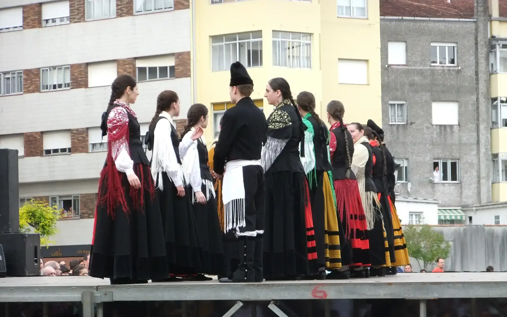

## Camino Francés  2012  

### Etapa-30: Santiago de Compostela → Negreira ( 20,6 Km)
02 de Juni 2012

Conversas sobre o Caminho e outras coisas com Rafael ..., ... .

Als wir ankamen, fand gerade ein Volksfest statt – eine Überraschung und ein Kontrast zu unseren Wandertagen. Wir ließen uns einfach treiben und genossen die Atmosphäre bei einem leckeren Snack und einem Bierchen. 

---

Quando chegámos, estava a decorrer um festival folclórico – uma surpresa e um contraste em relação aos nossos dias de caminhada. Deixámo-nos levar,  aproveitámos simplesmente o ambiente, acompanhados por um petisco delicioso e uma cervejinha.

---

Cuando llegamos, se estaba celebrando un festival folclórico, toda una sorpresa y un contraste con respecto a nuestros días de caminata. Nos dejamos llevar y simplemente disfrutamos del ambiente, acompañados de un delicioso aperitivo y una cervezita.

---

When we arrived, a folk festival was taking place – a surprise and a stark contrast to our days of walking. We went with the flow, simply soaking up the atmosphere, accompanied by a delicious snack and a beer.

---

  

🇬🇧
🇪🇸
🇵🇹
🇩🇪

---

**↪** [Etapa-31_Oliveiroa_Fisterra](Etapa-31_Oliveiroa_Fisterra.md)

 🔁 [Camino-Frances_Etapas](Camino-Frances_Etapas.md)

 ...→