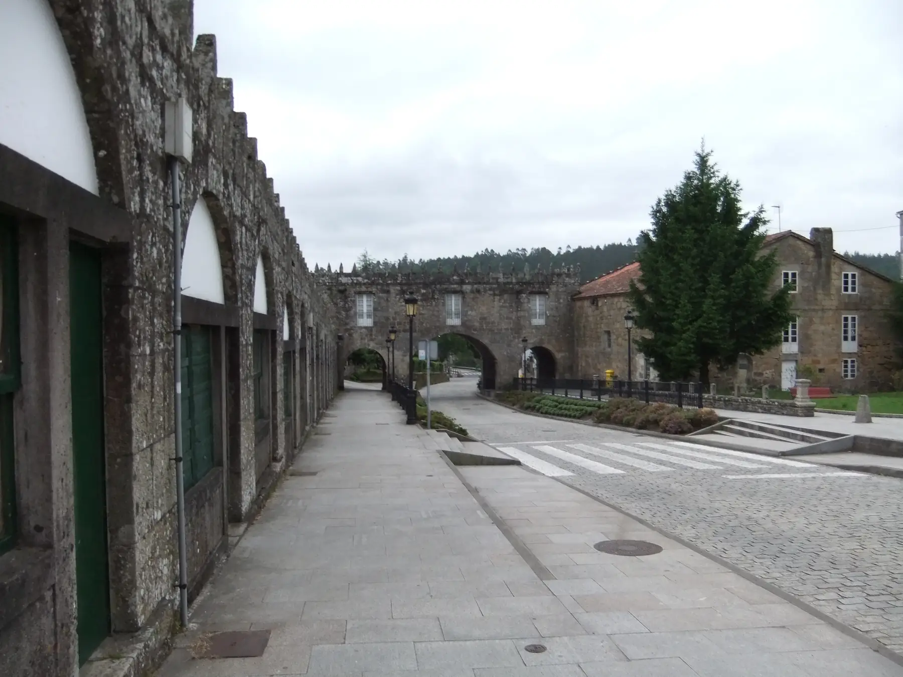
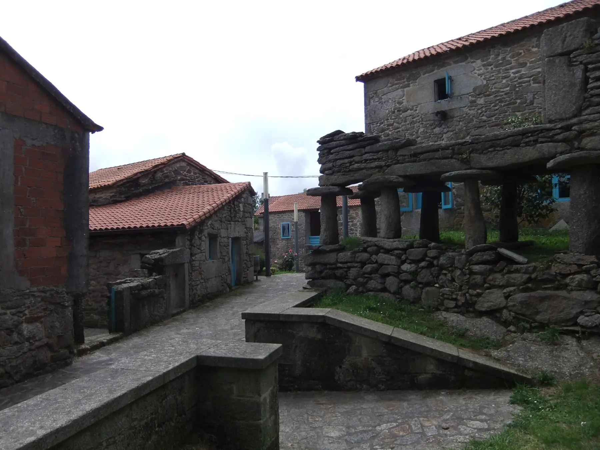
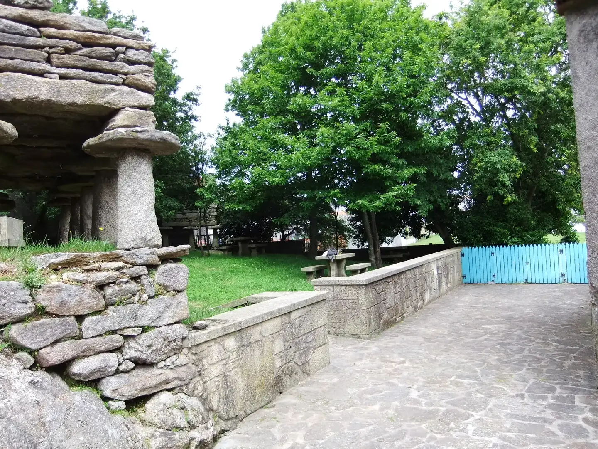
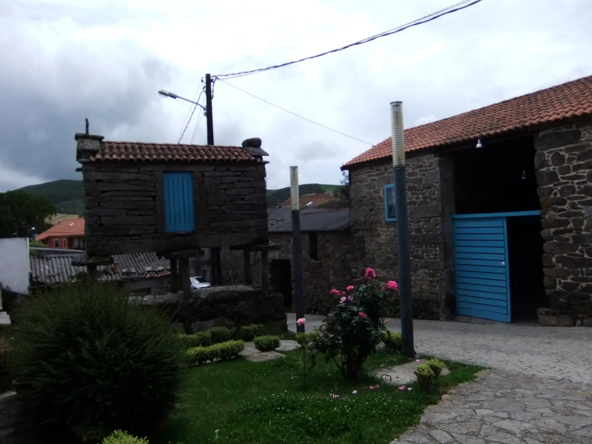
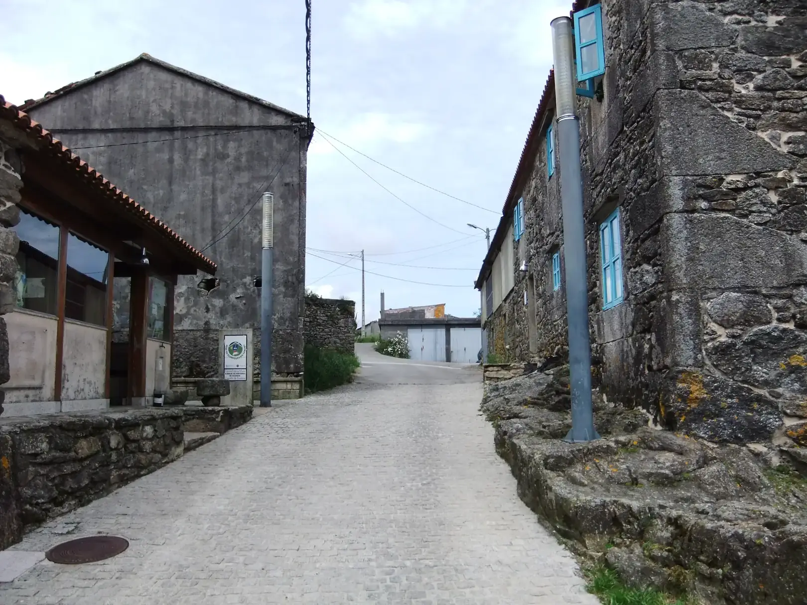
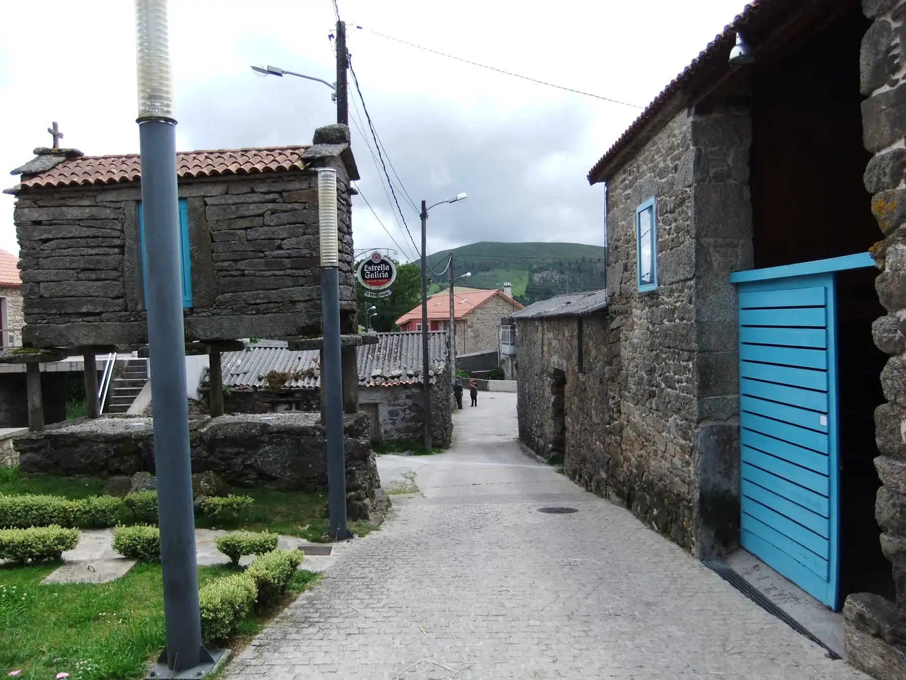
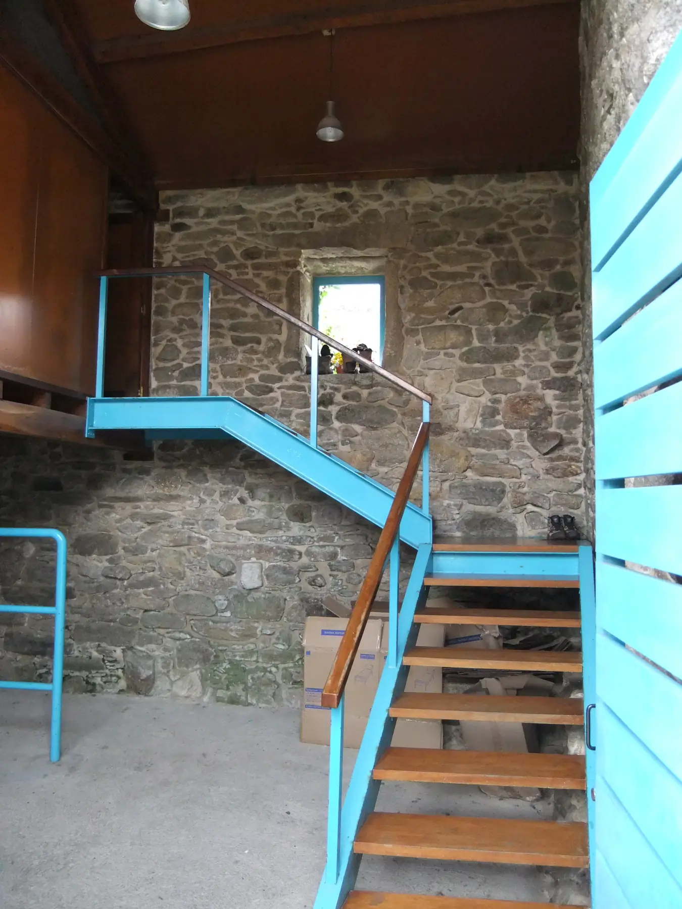
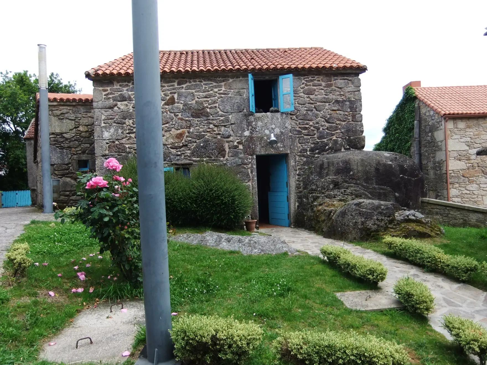

## Camino Francés  2012  

### Etapa-32: Negreira→ Oliveiroa (33,6 Km)
03 de Juni 2012

- **Albergue de Peregrinos de Oliveiroa**

- 🇩🇪 Ich weiß nicht mehr genau, mit wem ich mir das Zimmer geteilt habe, aber ich erinnere mich an die Atmosphäre in der Herberge, an den Granittisch draußen und an das gesellige Beisammensein der Pilger im Gemeinschaftsraum und in der Küche. Ein angenehmer Ort mit vielen Ecken, in denen man sich hinsetzen und wirklich entspannen kann. Deshalb zählte ich diese Herberge zu den angenehmsten. Wir hatten gutes, trockenes Wetter, was zu einem angenehmen Aufenthalt beitrug und es uns ermöglichte, auch den Außenbereich in vollen Zügen zu genießen.  

-  🇵🇹 Já não me lembro com quem partilhei o quarto, mas lembro-me do ambiente no albergue, da mesa de granito lá fora e da convívio entre os peregrinos na sala comum e na cozinha. Um local agradável, com muitos recantos onde nos podemos sentar e relaxar de verdade. Por isso, considerei este albergue um dos mais agradáveis. Tivemos bom tempo seco, o que contribuiu para uma estadia agradável e nos permitiu desfrutar ao máximo também da área exterior.  

- 🇪🇸 Ya no recuerdo  con quién compartí la habitación, pero sí recuerdo el ambiente del albergue, la mesa de granito que había fuera y el ambiente acogedor que se respiraba entre los peregrinos en la sala común y en la cocina. Un lugar agradable con muchos rincones en los que sentarse y relajarse de verdad. Por eso, para mí este albergue fue uno de los más agradables. Hizo buen tiempo sieco, lo que contribuyó a que la estancia fuera muy agradable y nos permitió disfrutar al máximo también de la zona exterior.  

-  I can’t quite remember who I shared the room with, but I do remember the atmosphere in the hostel, the granite table outside and the convivial gatherings of pilgrims in the common room and the kitchen. It was a lovely place with plenty of nooks where you could sit down and really relax. That’s why I counted this hostel amongst the most pleasant ones. We had good dry weather, which added to the enjoyment of our stay and allowed us to make the most of the outdoor area too.  

---

  

🇬🇧
🇪🇸
🇵🇹
🇩🇪

---

**↪** [Etapa-31_Oliveiroa_Fisterra](Etapa-31_Oliveiroa_Fisterra.md)

 🔁 [Camino-Frances_Etapas](Camino-Frances_Etapas.md)

 ...→