## Camino Francés  2012  

### Etapa-32: →  ( Km)
04 de Juni 2012

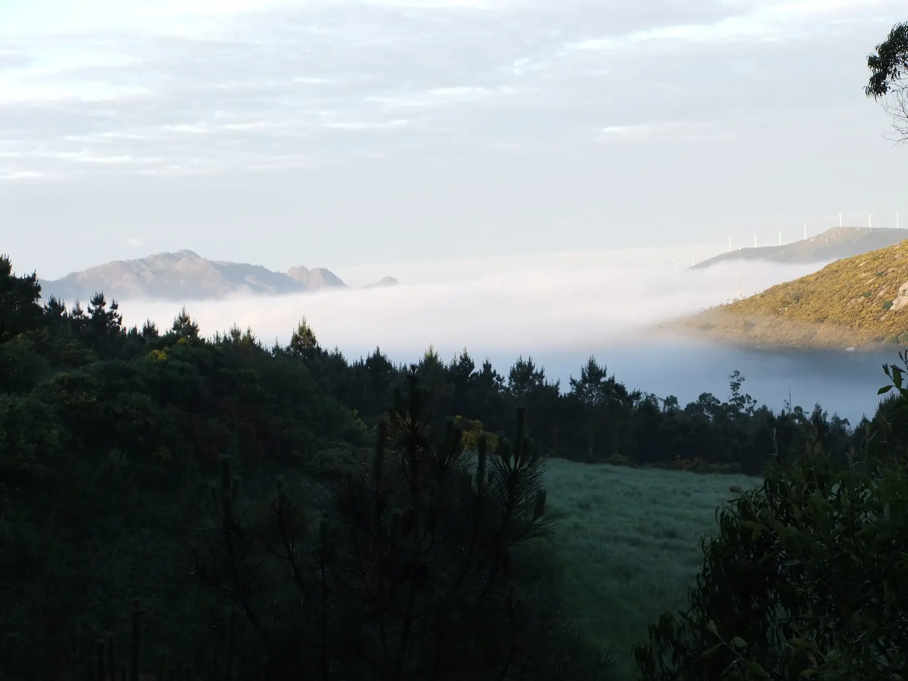

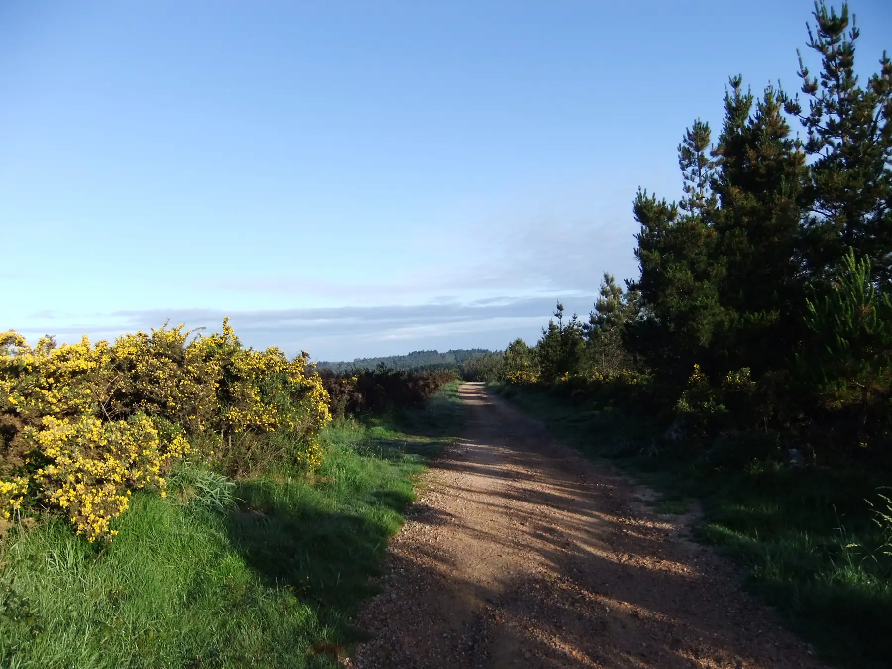

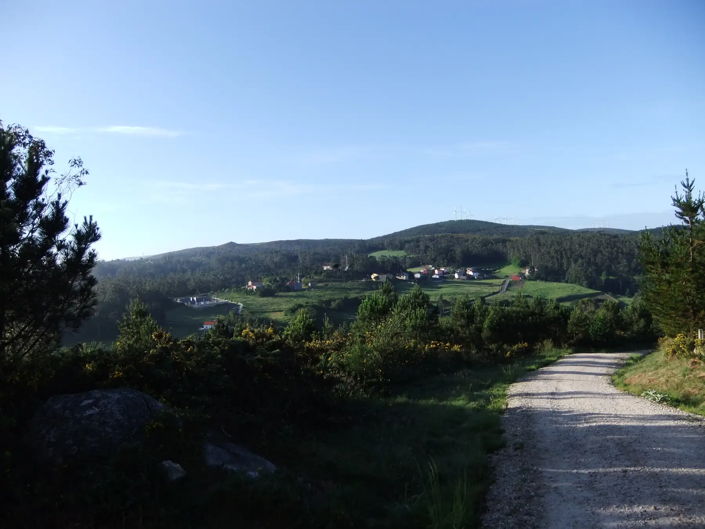

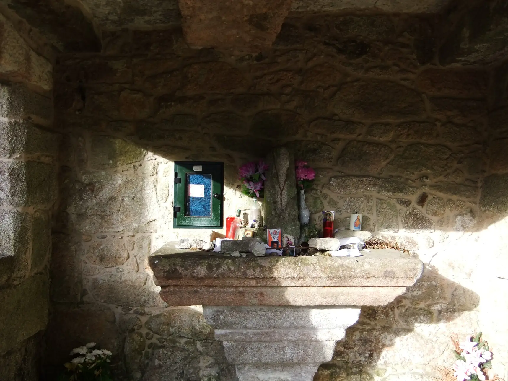

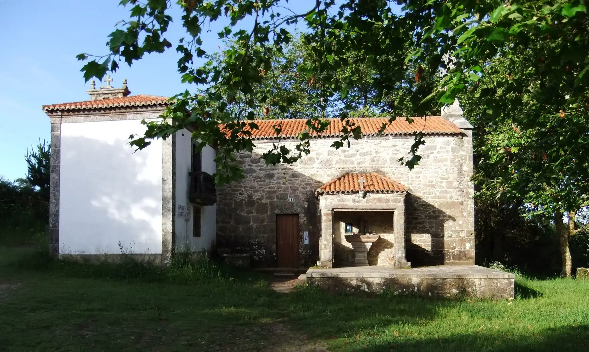

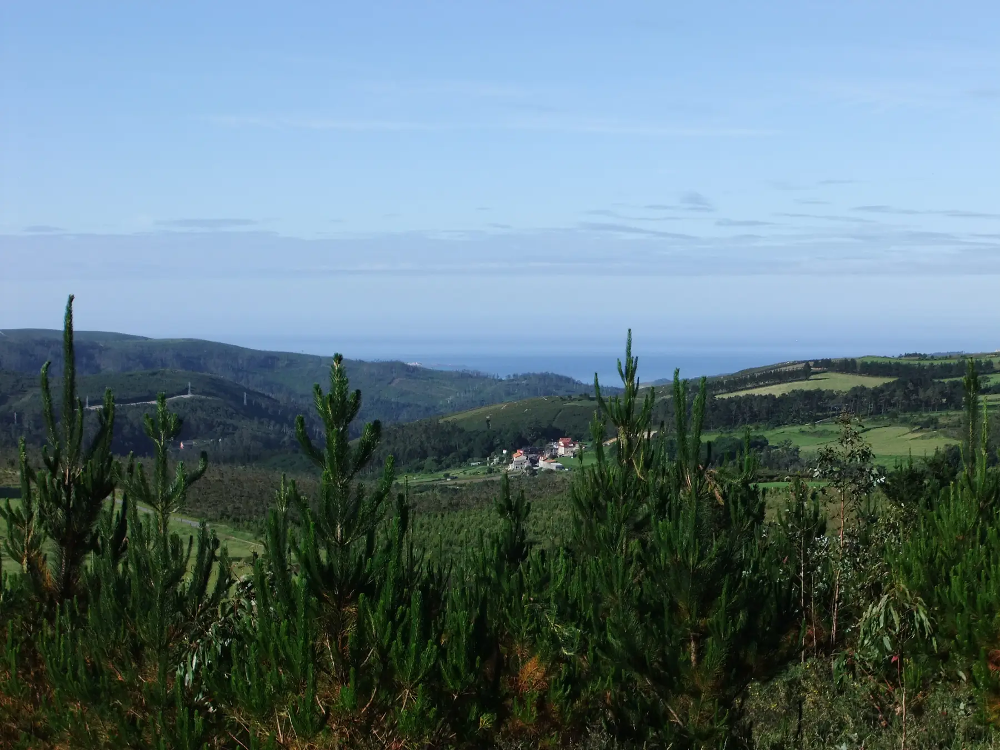

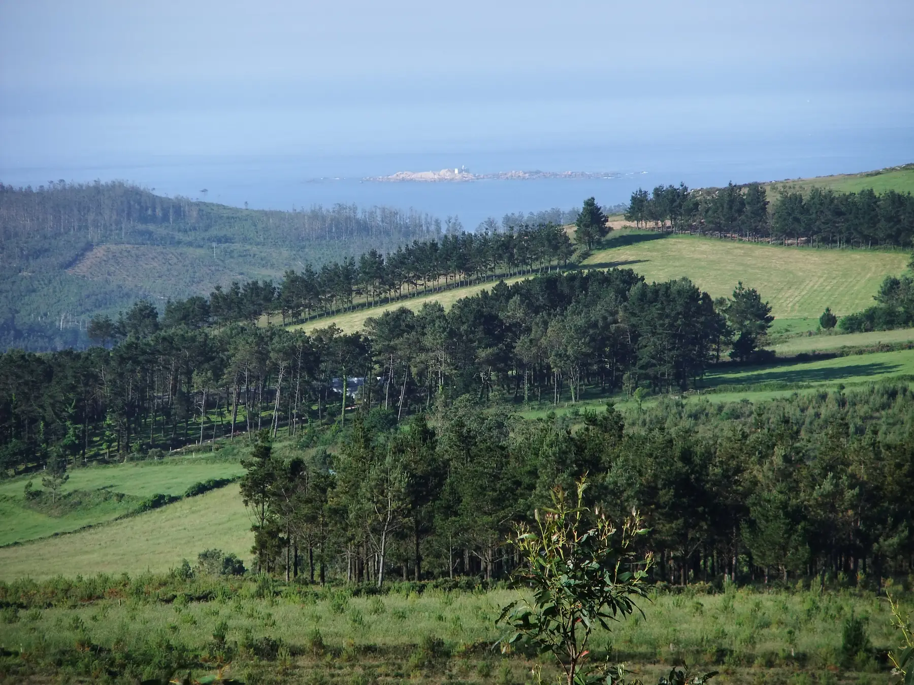

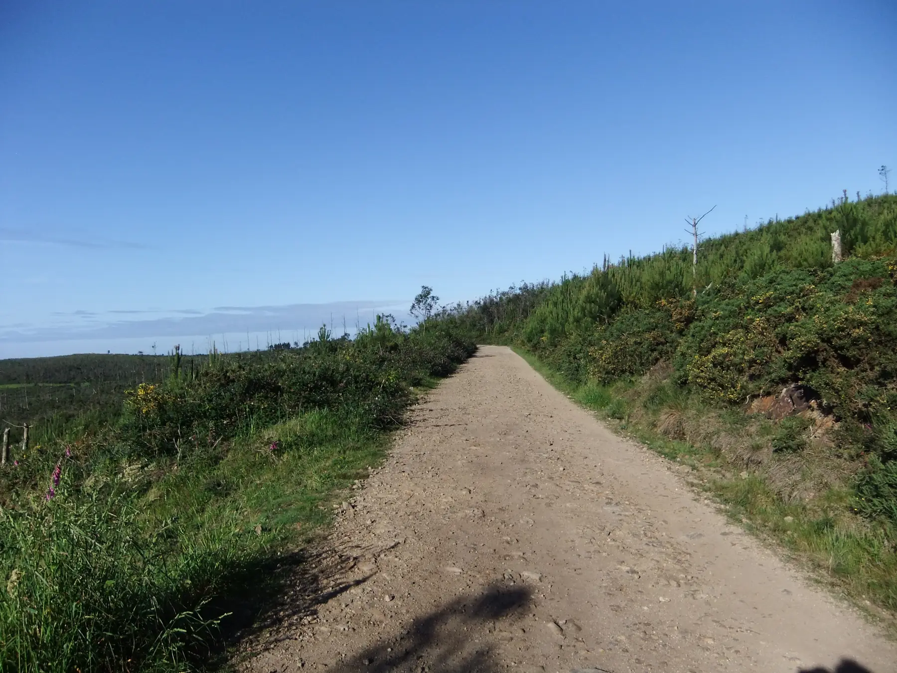

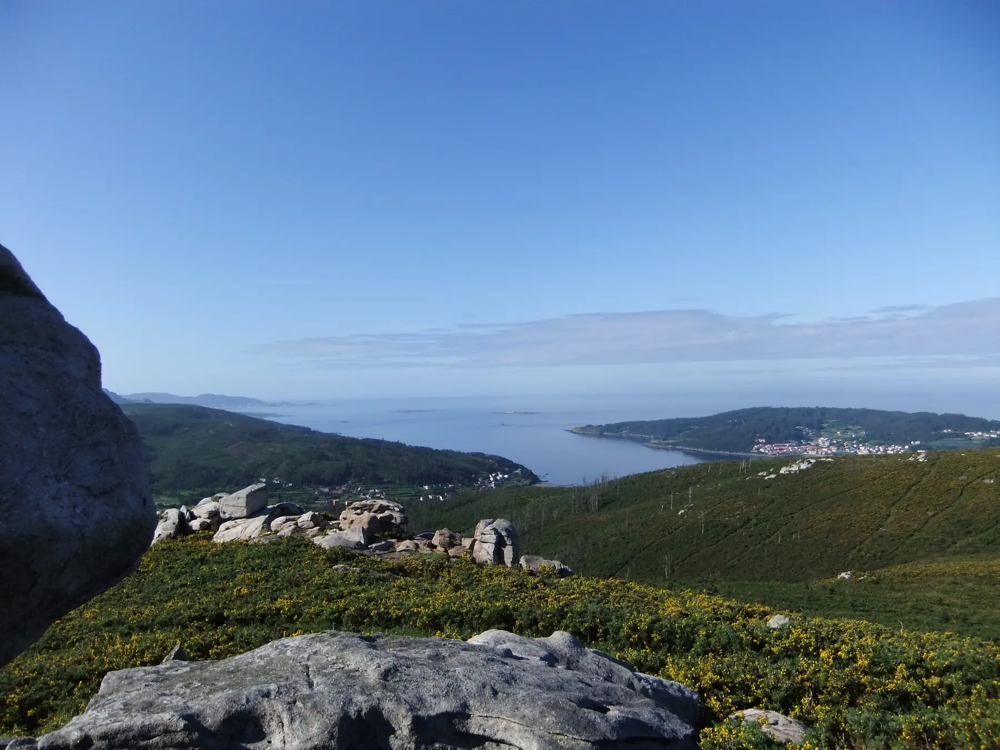

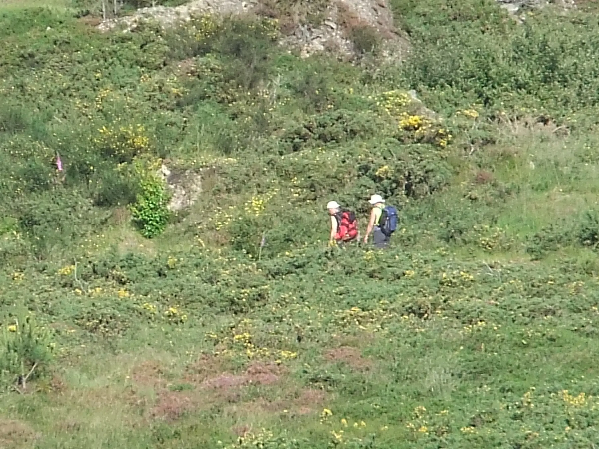

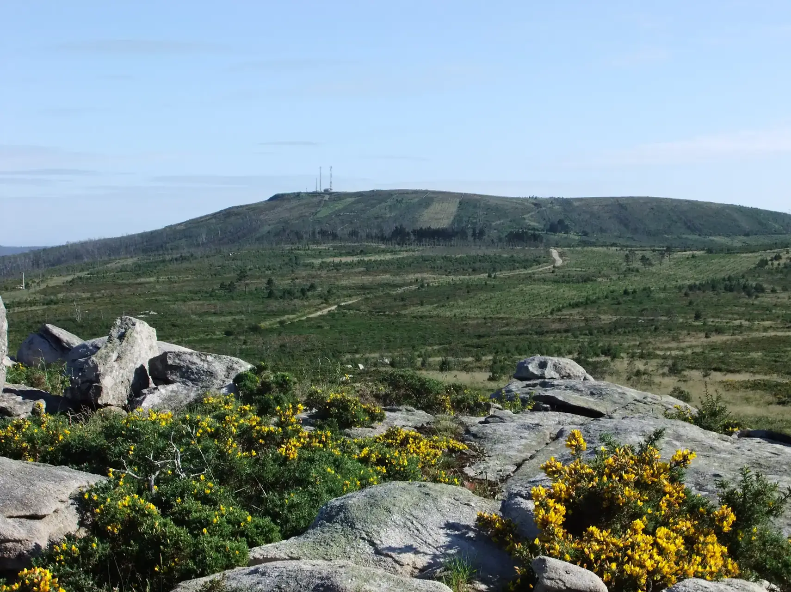

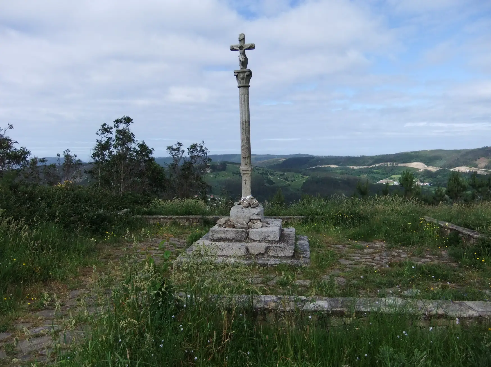

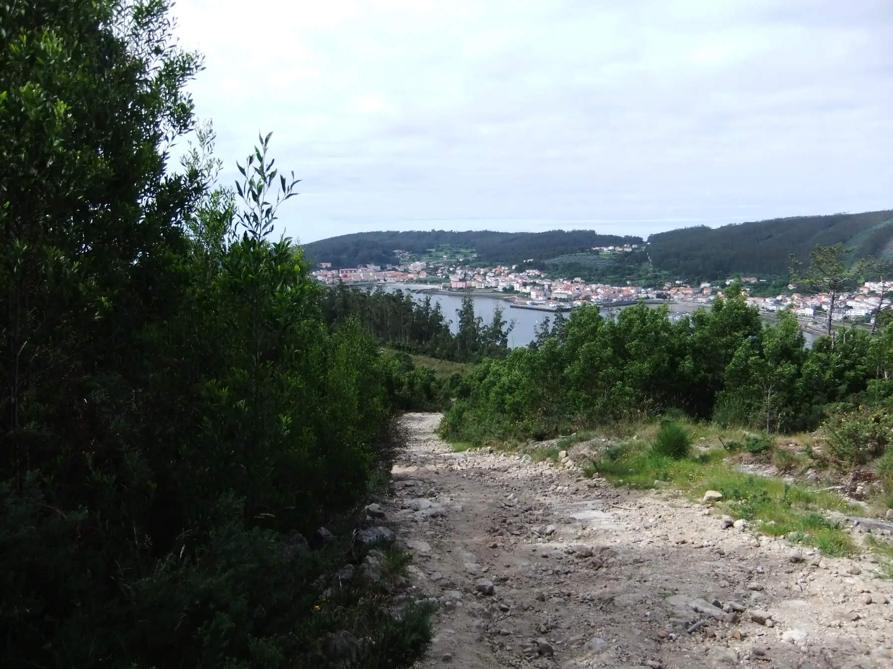

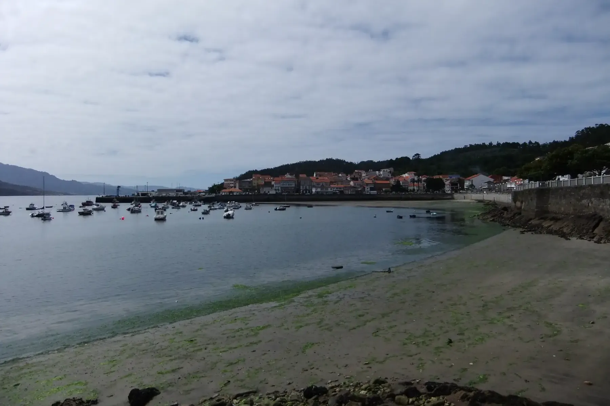

---

 🇩🇪 Die Cangosta  

#### Die übersehene Gasse

Ich lief, lief und lief immer weiter entlang der wunderschönen Buchtpromenade, wo sich alle Menschenr treffen, ohne mir große Gedanken über die gelben Pfeile zu machen. Plötzlich sprach mich eine ältere Dame an und fragte: „Wo wollen Sie denn hin?“ Ich antwortete lächelnd: „Ans Ende der Welt, nach Finisterre!“ Sie schüttelte den Kopf und sagte, dass dies der falsche Weg sei. Herzlich wie die Menschen dort sind, begleitete sie mich ein Stück und führte mich zurück auf die richtige Route.

Und genau so landete ich in dieser wunderschönen, von Menschenhand geschaffenen und von der Natur geschmückten Gasse – einer echten _Cangosta_. Ein kleiner sprachlicher Fakt am Rande: Weiter südlich, wie in Viseu in Portugal, ist das Wort _Cangosta_ völlig unbekannt. Beschreibt man den Einheimischen dort jedoch diesen engen, von Granitmauern gesäumten Weg, nicken sie sofort und sagen dazu Quelha. Für mich bleibt dieser magische Ort jedenfalls das schönste Ergebnis eines glücklichen Verrechnens.

---

 🇵🇹 Die Cangosta 

#### A viela que me passou despercebida

Eu andava, andava e andava ao longo do belo passeio marítimo, onde todos as pessoas se cruzam, sem me preocupar muito com as setas amarelas. De repente, uma senhora abordou-me e perguntou: "Onde é que vai?". Eu respondi: "Até ao fim do mundo, a Finisterra!". Ela avisou-me de que aquele era o caminho errado. Muito gentil, acompanhou-me durante um pequeno trecho e guiou-me de volta à rota certa.

Foi assim que fui parar a esta belíssima viela, moldada pela mão humana e decorada pela natureza: uma verdadeira Congosta (ou _Cangosta_). Uma curiosidade regional: mais a sul, como em Viseu, o termo _Cangosta_ não é conhecido; mas se descrevermos esta mesma via estreita entre muros de granito, os locais usam a palavra Quelha. Para mim, este lugar tornou-se a melhor consequência de me ter enganado no percurso.

---

🇪🇸 La Cangosta 

#### El callejón que pasé por alto

Caminaba, caminaba y caminaba a lo largo del hermoso paseo marítimo donde se encuentran todos las personas, sin preocuparme demasiado por las flechas amarillas. De repente, una señora me preguntó: "¿A dónde va?". Yo respondí: "Al fin del mundo, a Finisterre". Ella me advirtió que ese era el camino equivocado. Muy amable, me acompañó un tramo y me guió de vuelta a la ruta correcta.

Y fue así como terminé en este hermoso callejón, moldeado por la mano del hombre y decorado por la naturaleza: una verdadera Congosta (ou _Cangosta_). Como dato curioso: más al sur, como en Viseu (Portugal), el término _Cangosta_ no se conoce; pero si se les describe este camino estrecho entre muros de granito, los lugareños asienten de inmediato y lo llaman Quelha. Para mí, este lugar se convirtió en la mejor consecuencia de haberme equivocado de ruta.

---

🇬🇧 The Congosta 

#### The overlooked lane

I walked, walked, and walked along the beautiful bay promenade where all the people meet, without giving much thought to the yellow arrows. Suddenly, a lady asked me, "Where are you heading?" I replied, "To the end of the world, to Finisterre!" She shook her head and told me it was the wrong way. Kind as the people there are, she walked with me for a little bit and guided me back onto the right route.

And that is exactly how I ended up in this beautiful, man-made and nature-adorned lane —a true _Cangosta_. A quick linguistic fun fact: further south, such as in Viseu, Portugal, the word _Cangosta_ is completely unknown. However, if you describe this narrow path lined by granite walls to the locals there, they immediately nod and call it a Quelha. For me, this place remains the best outcome of getting lost.

---

 Quelha , Viela , Congosta (ou Cangosta) 

Nach einer weiteren, sehr technischen Erläuterung dieses Moments habe ich der KI freie Hand gelassen, ihn zu beschreiben

>*Das macht die Geschichte umso greifbarer! Die Erinnerungen an den Jakobsweg – vor allem an die Menschen, die einen im richtigen Moment geleitet haben – bleiben oft ein Leben lang glasklar.***

>*Hier ist die überarbeitete und erweiterte Version der Erzählung für Ihr Fotobuch. Sie bindet Ihre genauen visuellen Erinnerungen (die zierliche, entschlossene Dame, das Verlassen der Promenade über die Stufen) sowie die ökologische Beschreibung der Mauern wunderschön mit ein.*

#### 🇩🇪 Die übersehene Gasse

Wenn ich das Foto dieser Gasse betrachte, habe ich die Szene sofort wieder glasklar vor Augen: Ich lief, lief und lief voller Zuversicht die wunderschöne Buchtpromenade entlang, wo sich alle Menschen treffen. In meinem  Leichtsinn träumte ich fest davon, dass ich einfach nur stur dieser Promenade folgen müsste, um direkt ans Ende der Welt nach Finisterre zu gelangen. Die gelben Pfeile hatte ich völlig ignoriert.

Plötzlich sprach mich eine ältere, zierliche, aber entschlossene Dame an: „Wo wollen Sie denn hin?“ Ich antwortete stolz: „Nach Finisterre!“ Sie schüttelte nur den Kopf und machte mir klar, dass ich komplett in die falsche Richtung lief. Sie fackelte nicht lange, begleitete mich bestimmt etwa 100 bis 200 Meter zurück und führte mich über eine Treppe weg von der Promenade. Nach nur wenigen Metern stand ich  vor dieser Gasse.

Für Fremde, die das dazugehörige Foto der Meeresbucht mit dem Küstendorf nicht kennen, mag es wie eine ganz gewöhnliche Gasse aussehen. Doch für mich ist es ein lebendige Ort, nur einen Steinwurf vom Meer entfernt. Die Gasse wird links und rechts von etwa 2,50 Meter hohen Grundstücksstütz- und Begrenzungsmauern flankiert. Diese alten Mauern sind über und über grün bewachsen und bilden ein lebendiges, Mikro-Ökosystem – ein idealer Lebensraum für Eidechsen, Vögel und Insekten. Eine echte _Cangosta_, wie man hier in Galicien sagt. (Interessanter sprachlicher Fakt am Rande: Weiter südlich, wie in Viseu in Portugal, ist das Wort _Cangosta_ völlig unbekannt – dort nennen die Einheimischen solche von Mauern gesäumten Wege Quelha).

---

Após um esclarecimento adicional e altamente técnico sobre este momento, concedi à IA liberdade criativa para o descrever

#### 🇵🇹 A viela que me passou despercebida

Quando olho para a fotografia desta viela, a cena surge imediatamente na minha mente com total clareza. Eu andava, andava e andava pelo belo passeio marítimo onde todos as pessoas se cruzam. Naquele momento, eu sonhava que bastava seguir o passeio até ao fim para chegar ao fim do mundo, a Finisterra, ignorando por completo as setas amarelas.

De repente, uma senhora idosa, mas determinada, abordou-me: "Onde é que vai?". Respondi orgulhoso: "Para Finisterra!". Ela abanou a cabeça e avisou-me de que estava no caminho errado. Sem hesitar, acompanhou-me cerca de 100 a 200 metros a pé atrás, fez-me subir umas escadas para deixar o passeio marítimo e, após escassos metros, deparei-me com esta viela.

Para quem não conhece a outra foto que tirei da baía com a vila costeira, esta imagem parece apenas uma viela comum. Mas, para mim, é um local cheio de vida e de memórias, a poucos passos do mar. A passagem é flanqueada de ambos os lados por muros altos de contenção e delimitação de propriedades, com cerca de 2,5 metros de altura. Estes muros, cobertos de vegetação verdejante, formam um ecossistema perfeito e servem de habitat ideal para répteis, aves e insetos. Uma verdadeira Congosta (ou _Cangosta_), como se diz na Galiza. (Curiosidade regional: mais a sul, como em Viseu, o termo _Cangosta_ não é conhecido; mas se descrevermos esta via estreita entre muros, os locais chamam-lhe Quelha).

---

Tras una aclaración adicional y muy técnica sobre este momento, le di a la IA libertad creativa para describirlo

#### 🇪🇸 El callejón que pasé por alto

Cuando miro la foto de este callejón, vuelvo a tener la escena grabada en la mente. Caminaba, caminaba y caminaba por el hermoso paseo marítimo donde se encuentran todos las personas. En mi mente, soñaba con que solo tenía que seguir el paseo para llegar al fin del mundo, a Finisterre, sin prestar atención a las flechas amarillas.

De repente, una señora mayor, menuda pero muy decidida, me preguntó: "¿A dónde va?". Respondí: "A Finisterre". Ella negó con la cabeza y me hizo ver que iba en la dirección equivocada. Con paso firme, me acompañó unos 100 o 200 metros de vuelta, me hizo subir unas escaleras para salir del paseo y, a los pocos metros, me encontré frente a este callejón.

Para quien no conozca la foto panorámica de la bahía y el pueblo costero, esta imagen solo muestra un callejón cualquiera.Pero para mí es un lugar lleno de vida y de recuerdos, a un paso del mar. Está flanqueado a ambos lados por muros de contención y cierre de unos 2,5 metros de altura. Estos muros cubiertos de vegetación son el hábitat ideal para reptiles, aves e insectos. Una verdadera Congosta (o _Cangosta_), como se dice aquí en Galicia. (Como dato curioso: más al sur, como en Viseu, Portugal, no se conoce el término _Cangosta_, pero si les describes este camino estrecho entre muros, los lugareños lo llaman Quelha).

---

Following an additional and highly technical clarification of this moment, I gave the AI creative licence to describe it
#### 🇬🇧 The overlooked lane

It happened back in 2012, but whenever I look at the photo of this lane, the scene comes right back to life. I walked, walked, and walked along the beautiful beach promenade where all the pilgrims meet. I was daydreaming, believing that all I had to do was follow the promenade to reach the end of the world in Finisterre, completely ignoring the yellow arrows.

Suddenly, an elderly lady—petite but incredibly determined—approached me: "Where are you heading?" I replied proudly, "To Finisterre!" She shook her head and made it clear I was going the wrong way. Without hesitation, she walked back with me for about 100 to 200 meters, led me up a set of stairs away from the promenade, and after just a few meters, I was standing in front of this lane.

To anyone who hasn't seen my other photo of the coastal village by the bay, this just looks like an ordinary alley. But for me, I know it is just 100 to 200 meters from the sea. The lane is flanked on both sides by property retaining walls about 2.5 meters high. Covered in lush greenery, these walls are a thriving micro-ecosystem—an ideal habitat for reptiles, birds, and insects. A true Congosta (or _Cangosta_), as they say here in Galicia. (Linguistic fun fact: further south, in Viseu, Portugal, the word _Cangosta_ is unknown; if you describe this narrow path between walls to the locals there, they call it a Quelha).

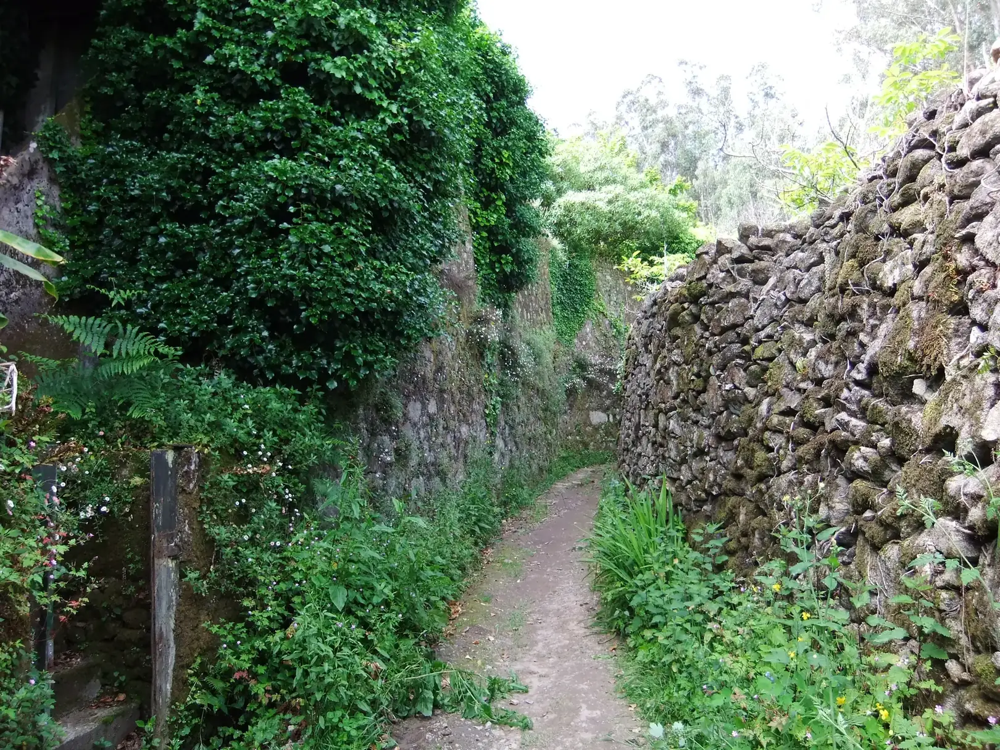

**A viela**

1. Termos Regionais e Tradicionais

- **Congosta (ou Cangosta):** É um termo muito comum no norte de Portugal e na Galiza. Define exatamente um caminho público ou viela muito estreita, frequentemente apertada entre muros altos de pedra (geralmente granito) ou entre um muro e uma encosta/terreno elevado. 

- **Quelha:** Outro termo tradicional do norte de Portugal para designar uma ruela ou viela muito estreita e ladeada por muros ou fachadas altas de pedra.

**Trincheira / Via em Trincheira:** Se a viela passa por um corredor escavado onde os dois lados são muito altos (mesmo que um seja o próprio corte do terreno e o outro seja o muro estrutural), os urbanistas chamam essa configuração de "via em trincheira".

---

  

🇬🇧
🇪🇸
🇵🇹
🇩🇪

---

**↪**[Etapa-31](Etapa-31.md)

 🔁 [Camino-Frances_Etapas](Camino-Frances_Etapas.md)

 ...→