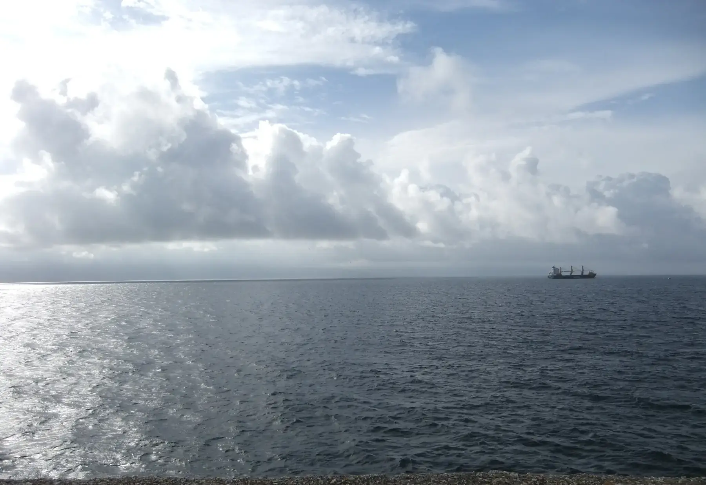

## Camino Francés  2012  

### Etapa-34: →  ( Km)
06 de Juni 2012

---

### 🇩🇪 Das wahre Ende des Jakobswegs – Die vergessene Geschichte von Finisterre

Finisterre (galicisch: _Fisterra_) ist für die meisten Pilger heute nur das Ziel nach dem Ziel. Doch historisch gesehen ist dieses Kap nicht bloß das Ende einer langen Reise, sondern ein Jahrtausende alter Ort der Transformation, des Sterbens und der Wiedergeburt. Wer die rund 90 Kilometer von Santiago an die Küste weiterwandert, tritt in die Fußstapfen uralter Mythen.

#### 🌟 Die historischen Kernrollen für Pilger:

- Das Ende der bekannten Welt (_Finis Terrae_): Vor der Entdeckung Amerikas markierte dieses Kap die absolute Grenze des antiken Europas. Dahinter lag nur das _Mare Tenebrosum_ – das dunkle, unheimliche Meer der Nichtexistenz.
- Der heidnische Sonnenkult (_Ara Solis_): Lange vor dem Christentum pilgerten Kelten und Römer hierher. Sie verehrten das Kap als heiligen Ort, an dem die Sonne – und damit der Sonnengott – jeden Abend im Atlantik starb, um am nächsten Morgen im Osten wiedergeboren zu werden.
- Die Verchristlichung des Weges: Die Kirche nutzte diese tiefe Symbolik. Laut Legende zerstörte der Apostel Jakobus persönlich den heidnischen Altar _Ara Solis_. Im mittelalterlichen Pilgerführer _Codex Calixtinus_ (12. Jahrhundert) wurde der Weg an die Küste fest im christlichen Glauben verankert.
- Das Ritual der spirituellen Transformation: Am Kap Finisterre endete die physische Reise und die spirituelle Wandlung begann. Pilger vollzogen drei zentrale Rituale:
    
    1. Das Bad im Atlantik (am Strand _Praia da Langosteira_) zur symbolischen Reinigung von allen Sünden.
    2. Das Verbrennen der Kleidung am Kap, um das „alte Ich“ und die Lasten der Vergangenheit abzulegen.
    3. Der Blick auf den Sonnenuntergang als Symbol für das Sterben des Egos und die spirituelle Wiedergeburt.
    

Finisterre ist der wahre Kilometer 0,0 des Jakobswegs – kein logistischer Endpunkt, sondern der Ort, an dem der Pilger als neuer Mensch in sein altes Leben zurückkehrt.

---

### 🇬🇧 The True End of the Camino – The Forgotten History of Finisterre

For most modern pilgrims, Finisterre (Galician: _Fisterra_) is just a beautiful epilogue to their long walk. Historically, however, this cape is not merely the end of a road, but a millennia-old site of transformation, death, and rebirth. Walking the extra 90 kilometers from Santiago means stepping into ancient mythology.

#### 🌟 The Core Historical Roles for Pilgrims:

- The End of the Known World (_Finis Terrae_): Before the discovery of the Americas, this cape marked the absolute edge of the known world. Beyond it lay only the _Mare Tenebrosum_—the dark, terrifying ocean of non-existence.
- The Pagan Sun Cult (_Ara Solis_): Long before Christianity, Celts and Romans journeyed to this very cliff. They worshipped it as a holy site where the sun died in the Atlantic every evening, only to be reborn in the east the following morning.
- The Christianization of the Myth: The Catholic Church integrated these deeply rooted pagan rituals into the Camino. Legend says Saint James himself destroyed the pagan altar, the _Ara Solis_. By the 12th century, the _Codex Calixtinus_ firmly established the coastal route within Christian tradition.
- Rituals of Spiritual Transformation: At Cape Finisterre, the physical journey ended, and the spiritual evolution took place through three key rituals:
    
    1. Bathing in the Atlantic (at _Praia da Langosteira_) to symbolically wash away sins and the hardships of the road.
    2. Burning the clothes at the cliff edge, representing the shedding of the "old self" and the burdens of the past.
    3. Watching the sunset as a metaphor for the death of the ego and spiritual rebirth.
    

Finisterre is the authentic Kilometer 0.0—not a mere logistical stop, but the sacred threshold where the pilgrim dies to their past and returns home renewed.

---

### 🇪🇸 El verdadero final del Camino – La historia olvidada de Finisterre

Para la mayoría de los peregrinos actuales, Finisterre (_Fisterra_) es solo el epílogo tras llegar a Santiago. Sin embargo, históricamente este cabo no es un simple punto final, sino un lugar milenario de transformación, muerte y renacimiento. Continuar esos 90 kilómetros hacia la costa significa caminar sobre los pasos de mitos ancestrales.

#### 🌟 Los roles históricos fundamentales para el peregrino:

- El fin del mundo conocido (_Finis Terrae_): Antes del descubrimiento de América, este cabo marcaba el límite absoluto de la tierra. Más allá solo existía el _Mare Tenebrosum_, el mar tenebroso del misterio y la no-existencia.
- El culto pagano al sol (_Ara Solis_): Mucho antes del cristianismo, celtas y romanos ya peregrinaban aquí. Veneraban el cabo como un altar sagrado donde el sol moría cada tarde en el Atlántico, para renacer al día siguiente por el este.
- La cristianización del Camino: La Iglesia aprovechó esta profunda simbología solar. La leyenda cuenta que el propio Apóstol Santiago destruyó el altar pagano del _Ara Solis_. En el siglo XII, el _Codex Calixtinus_ consolidó la ruta hacia la Costa da Morte dentro de la fe cristiana.
- El ritual de la transformación espiritual: En el Cabo Finisterre terminaba el viaje físico y se iniciaba el cambio interior a través de tres ritos tradicionales:
    
    1. El baño en el Atlántico (en la playa de _Langosteira_) para purificarse de los pecados y el cansancio.
    2. Quemar las ropas en el cabo, simbolizando el despojo del "viejo yo" y de las cargas del pasado.
    3. Contemplar el ocaso, representando la muerte simbólica del ego y el renacimiento espiritual.
    

Finisterre alberga el verdadero Kilómetro 0,0 del Camino: no es una parada logística, sino el umbral sagrado donde el peregrino se transforma para regresar renovado a su vida cotidiana.

---

### 🇵🇹 O verdadeiro fim do Caminho – A história esquecida de Finisterra

Para a maioria dos peregrinos modernos, Finisterra (_Fisterra_) é apenas um belo epílogo após Santiago. No entanto, historicamente este cabo não é um mero ponto final, mas sim um lugar milenar de transformação, morte e renascimento. Caminhar os 90 quilómetros adicionais até à costa significa seguir os passos de mitos ancestrais.

#### 🌟 Os papéis históricos fundamentais para o peregrino:

- O fim do mundo conhecido (_Finis Terrae_): Antes da descoberta da América, este cabo marcava o limite absoluto do mundo conhecido. Além dele existia apenas o _Mare Tenebrosum_ – o mar tenebroso do mistério e da não-existência.
- O culto pagão ao sol (_Ara Solis_): Muito antes do cristianismo, celtas e romanos já peregrinavam até aqui. Veneravam o cabo como um altar sagrado onde o sol morria todas as tardes no Atlântico, para renascer no dia seguinte a oriente.
- A cristianização do mito: A Igreja Católica integrou esta forte simbologia solar no Caminho. A lenda conta que o próprio Apóstolo Tiago destruiu o altar pagão da _Ara Solis_. No século XII, o _Codex Calixtinus_ consolidou a rota até à costa dentro da fé cristã.
- Rituais de transformação espiritual: No Cabo Finisterra terminava a viagem física e começava a evolução espiritual através de três ritos tradicionais:
    
    1. O banho no Atlântico (na praia da _Langosteira_) para a purificação simbólica dos pecados e do cansaço do caminho.
    2. Queimar as vestes no cabo, representando o despojamento do "velho eu" e dos fardos do passado.
    3. Contemplar o pôr do sol, funcionando como uma metáfora para a morte do ego e o renascimento espiritual.
    
Finisterra guarda o verdadeiro Quilómetro 0,0 do Caminho: não é uma paragem logística, mas sim o limiar sagrado onde o peregrino morre para o passado e regressa a casa renovado.

---

  

🇬🇧
🇪🇸
🇵🇹
🇩🇪

---

**↪**[Etapa-00_Bayonne_Saint-Jean-Pied-de-Port](Etapa-00_Bayonne_Saint-Jean-Pied-de-Port.md)

 🔁 [Camino-Frances_Etapas](Camino-Frances_Etapas.md)

 ...→