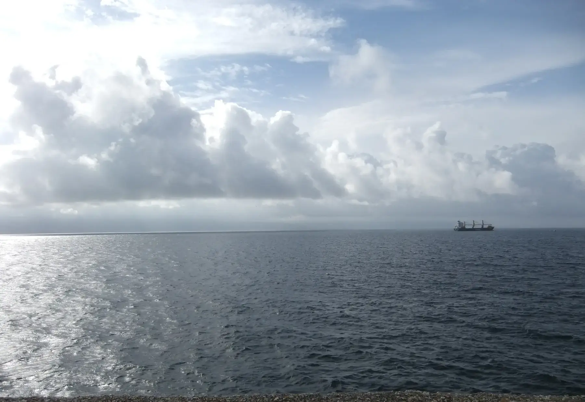

## Camino Francés  2012  

### Etapa-34: → Fisterre → ... 🚌 ...🚆... →   Wuppertal 
06/07/09 de Juni 2012

- Um último olhar para o fim do mundo
- Ein letzter Blick auf das Ende der Welt
- A final glance at the end of the world
- Una última mirada al fin del mundo

---

### 🇩🇪 Das wahre Ende des Jakobswegs – Die vergessene Geschichte von Finisterre

Finisterre (galicisch: _Fisterra_) ist für die meisten Pilger heute nur das Ziel nach dem Ziel. Doch historisch gesehen ist dieses Kap nicht bloß das Ende einer langen Reise, sondern ein Jahrtausende alter Ort der Transformation, des Sterbens und der Wiedergeburt. Wer die rund 90 Kilometer von Santiago an die Küste weiterwandert, tritt in die Fußstapfen uralter Mythen.

#### 🌟 Die historischen Kernrollen für Pilger:

📜

- Das Ende der bekannten Welt (_Finis Terrae_): Vor der Entdeckung Amerikas markierte dieses Kap die absolute Grenze des antiken Europas. Dahinter lag nur das _Mare Tenebrosum_ – das dunkle, unheimliche Meer der Nichtexistenz.
- Der heidnische Sonnenkult (_Ara Solis_): Lange vor dem Christentum pilgerten Kelten und Römer hierher. Sie verehrten das Kap als heiligen Ort, an dem die Sonne – und damit der Sonnengott – jeden Abend im Atlantik starb, um am nächsten Morgen im Osten wiedergeboren zu werden.
- Die Verchristlichung des Weges: Die Kirche nutzte diese tiefe Symbolik. Laut Legende zerstörte der Apostel Jakobus persönlich den heidnischen Altar _Ara Solis_. Im mittelalterlichen Pilgerführer _Codex Calixtinus_ (12. Jahrhundert) wurde der Weg an die Küste fest im christlichen Glauben verankert.
- Das Ritual der spirituellen Transformation: Am Kap Finisterre endete die physische Reise und die spirituelle Wandlung begann. Pilger vollzogen drei zentrale Rituale:
    
    1. Das Bad im Atlantik (am Strand _Praia da Langosteira_) zur symbolischen Reinigung von allen Sünden.
    2. Das Verbrennen der Kleidung am Kap, um das „alte Ich“ und die Lasten der Vergangenheit abzulegen.
    3. Der Blick auf den Sonnenuntergang als Symbol für das Sterben des Egos und die spirituelle Wiedergeburt.
    

Finisterre ist der wahre Kilometer 0,0 des Jakobswegs – kein logistischer Endpunkt, sondern der Ort, an dem der Pilger als neuer Mensch in sein altes Leben zurückkehrt.

---
### 🇬🇧 The True End of the Camino – The Forgotten History of Finisterre

For most modern pilgrims, Finisterre (Galician: _Fisterra_) is just a beautiful epilogue to their long walk. Historically, however, this cape is not merely the end of a road, but a millennia-old site of transformation, death, and rebirth. Walking the extra 90 kilometers from Santiago means stepping into ancient mythology.

#### 🌟 The Core Historical Roles for Pilgrims:

📜

- The End of the Known World (_Finis Terrae_): Before the discovery of the Americas, this cape marked the absolute edge of the known world. Beyond it lay only the _Mare Tenebrosum_—the dark, terrifying ocean of non-existence.
- The Pagan Sun Cult (_Ara Solis_): Long before Christianity, Celts and Romans journeyed to this very cliff. They worshipped it as a holy site where the sun died in the Atlantic every evening, only to be reborn in the east the following morning.
- The Christianization of the Myth: The Catholic Church integrated these deeply rooted pagan rituals into the Camino. Legend says Saint James himself destroyed the pagan altar, the _Ara Solis_. By the 12th century, the _Codex Calixtinus_ firmly established the coastal route within Christian tradition.
- Rituals of Spiritual Transformation: At Cape Finisterre, the physical journey ended, and the spiritual evolution took place through three key rituals:
    
    1. Bathing in the Atlantic (at _Praia da Langosteira_) to symbolically wash away sins and the hardships of the road.
    2. Burning the clothes at the cliff edge, representing the shedding of the "old self" and the burdens of the past.
    3. Watching the sunset as a metaphor for the death of the ego and spiritual rebirth.
    
Finisterre is the authentic Kilometer 0.0—not a mere logistical stop, but the sacred threshold where the pilgrim dies to their past and returns home renewed.

---

### 🇪🇸 El verdadero final del Camino – La historia olvidada de Finisterre

Para la mayoría de los peregrinos actuales, Finisterre (_Fisterra_) es solo el epílogo tras llegar a Santiago. Sin embargo, históricamente este cabo no es un simple punto final, sino un lugar milenario de transformación, muerte y renacimiento. Continuar esos 90 kilómetros hacia la costa significa caminar sobre los pasos de mitos ancestrales.

#### 🌟 Los roles históricos fundamentales para el peregrino:

📜

- El fin del mundo conocido (_Finis Terrae_): Antes del descubrimiento de América, este cabo marcaba el límite absoluto de la tierra. Más allá solo existía el _Mare Tenebrosum_, el mar tenebroso del misterio y la no-existencia.
- El culto pagano al sol (_Ara Solis_): Mucho antes del cristianismo, celtas y romanos ya peregrinaban aquí. Veneraban el cabo como un altar sagrado donde el sol moría cada tarde en el Atlántico, para renacer al día siguiente por el este.
- La cristianización del Camino: La Iglesia aprovechó esta profunda simbología solar. La leyenda cuenta que el propio Apóstol Santiago destruyó el altar pagano del _Ara Solis_. En el siglo XII, el _Codex Calixtinus_ consolidó la ruta hacia la Costa da Morte dentro de la fe cristiana.
- El ritual de la transformación espiritual: En el Cabo Finisterre terminaba el viaje físico y se iniciaba el cambio interior a través de tres ritos tradicionales:
    
    1. El baño en el Atlántico (en la playa de _Langosteira_) para purificarse de los pecados y el cansancio.
    2. Quemar las ropas en el cabo, simbolizando el despojo del "viejo yo" y de las cargas del pasado.
    3. Contemplar el ocaso, representando la muerte simbólica del ego y el renacimiento espiritual.
    

Finisterre alberga el verdadero Kilómetro 0,0 del Camino: no es una parada logística, sino el umbral sagrado donde el peregrino se transforma para regresar renovado a su vida cotidiana.

---

### 🇵🇹 O verdadeiro fim do Caminho – A história esquecida de Finisterra

Para a maioria dos peregrinos modernos, Finisterra (_Fisterra_) é apenas um belo epílogo após Santiago. No entanto, historicamente este cabo não é um mero ponto final, mas sim um lugar milenar de transformação, morte e renascimento. Caminhar os 90 quilómetros adicionais até à costa significa seguir os passos de mitos ancestrais.

#### 🌟 Os papéis históricos fundamentais para o peregrino:

📜

- O fim do mundo conhecido (_Finis Terrae_): Antes da descoberta da América, este cabo marcava o limite absoluto do mundo conhecido. Além dele existia apenas o _Mare Tenebrosum_ – o mar tenebroso do mistério e da não-existência.
- O culto pagão ao sol (_Ara Solis_): Muito antes do cristianismo, celtas e romanos já peregrinavam até aqui. Veneravam o cabo como um altar sagrado onde o sol morria todas as tardes no Atlântico, para renascer no dia seguinte a oriente.
- A cristianização do mito: A Igreja Católica integrou esta forte simbologia solar no Caminho. A lenda conta que o próprio Apóstolo Tiago destruiu o altar pagão da _Ara Solis_. No século XII, o _Codex Calixtinus_ consolidou a rota até à costa dentro da fé cristã.
- Rituais de transformação espiritual: No Cabo Finisterra terminava a viagem física e começava a evolução espiritual através de três ritos tradicionais:
    
    1. O banho no Atlântico (na praia da _Langosteira_) para a purificação simbólica dos pecados e do cansaço do caminho.
    2. Queimar as vestes no cabo, representando o despojamento do "velho eu" e dos fardos do passado.
    3. Contemplar o pôr do sol, funcionando como uma metáfora para a morte do ego e o renascimento espiritual.
    
Finisterra guarda o verdadeiro Quilómetro 0,0 do Caminho: não é uma paragem logística, mas sim o limiar sagrado onde o peregrino morre para o passado e regressa a casa renovado.

---

### Das Wesen des Erscheinungsbildes

🇩🇪 Eloquenz vs. Kompetenz

#### Eine Beobachtung am ehemaligen Busbahnhof

_Ein Moment, der eine Welt im Wandel einfängt – erlebt auf dem Rückweg vom Camino Francés._

Als ich von Fisterra nach Santiago de Compostela fuhr, um von dort den Bus nach Deutschland zu nehmen, drängten sich Reisende und Pilger um den Busfahrer. Sie bombardierten ihn mit Fragen – in fließendem Englisch, aber auch mit starken, teilweise schwer verständlichen Akzenten, wie dem meinen.

Andere versuchten wiederum, ihr Ziel zu erklären, indem sie lediglich den Namen der Stadt in ihrer Muttersprache nannten und dem Fahrer ihre Fahrkarte zeigten.

Irgendwann sagte der Busfahrer: „Bitte sprecht Spanisch, damit ich euch verstehen kann.“

Während er die Rucksäcke im Gepäckraum verstaute, ging ich auf ihn zu und sagte: „Perdón, pero solo hablo Portuñol.“

Er antwortete: „Aber wir verstehen uns doch! Ich verstehe ja auch ein bisschen Englisch. Aber ich kann nicht alle Varianten verstehen, und manche ausländischen Akzente sind einfach zu schwer zu verstehen. Außerdem habe ich nicht die Zeit, allen gleichzeitig Auskunft zu geben.“

Dann fügte er etwas Bemerkenswertes hinzu: Etwas zu verstehen sei eine Sache, es aber in einer Sprache zu erklären, die nicht zu den Kernkompetenzen seines Berufs gehöre, sei etwas völlig anderes. Wer es trotzdem versuche und sich dabei falsch ausdrücke, werde schnell für einen Idioten gehalten.

#### Eloquenz ist nicht Kompetenz

Das Wort _„Idiot“_ mag drastisch klingen, trifft aber einen wesentlichen Punkt: **Wie wir etwas ausdrücken, beeinflusst oft stärker, wie kompetent wir wahrgenommen werden, als das, was wir tatsächlich wissen.**

Das lässt sich besonders gut bei sprachgewandten Verkäufern und Politikern beobachten.

Ein eloquenter Verkäufer kann ein Produkt mit vergleichsweise wenig Fachwissen überzeugend präsentieren und erfolgreich verkaufen. Ein weniger eloquenter Entwickler oder Hersteller hingegen, der das Produkt bis ins kleinste Detail kennt, kann beim Verkauf scheitern.

Nicht unbedingt, weil sein Produkt schlechter ist oder ihm das Wissen fehlt, sondern weil er dieses Wissen nicht überzeugend vermitteln kann.

So entsteht ein folgenschwerer Irrtum: Menschen halten ihn für inkompetent oder misstrauen dem Produkt, nur weil die Erklärung nicht mit überzeugenden Worten geschmückt ist.

**Die Vorurteile gegenüber Menschen, die sich nicht so eloquent ausdrücken können, verurteile ich.** Niemand sollte aufgrund seiner sprachlichen Ausdrucksfähigkeit vorschnell beurteilt werden. Denn hinter unsicheren Worten kann sich ein enormes Wissen verbergen, und hinter einer unbeholfenen Erklärung kann echte Kompetenz stehen.

**Die Fähigkeit, etwas überzeugend zu vermitteln und diese Fähigkeit mit fundiertem Wissen zu verbinden, bewundere ich.** Menschen, die beides vereinen, schaffen Vertrauen, machen komplexe Zusammenhänge verständlich und ermöglichen Fortschritt. 
>**Und die Welt braucht zweifellos auch solche Menschen. Denn wir alle profitieren davon.**

*Die Fähigkeit, etwas zu verstehen, ist nicht dasselbe wie die Fähigkeit, etwas zu erklären. Und die Fähigkeit, sich überzeugend auszudrücken, ist kein verlässlicher Maßstab für tatsächliche Kompetenz.*

***Eloquenz beeinflusst die Wahrnehmung von Kompetenz, ist aber kein Beweis für sie.***

---

🇵🇹 Eloquência vs. Competência

#### Uma observação na antiga estação rodoviária

_Um momento que capta um mundo em transformação — vivido no regresso do Caminho Francês._

Quando viajei de Fisterra para Santiago de Compostela, de onde apanharia o autocarro para a Alemanha, vários viajantes e peregrinos rodeavam o motorista. Faziam-lhe perguntas sem parar, em inglês fluente, mas também com sotaques fortes e, por vezes, difíceis de compreender — como o meu.

Outros tentavam explicar o seu destino dizendo apenas o nome da cidade na sua língua materna e mostrando o bilhete ao motorista.

A certa altura, o motorista disse: «Por favor, falem espanhol para que eu vos possa compreender.»

Enquanto arrumava as mochilas no compartimento de bagagem, aproximei-me dele e disse: «Perdón, pero solo hablo Portuñol.»

Ele respondeu: «Mas nós entendemo-nos! Eu também compreendo um pouco de inglês. O problema é que não consigo perceber todas as variantes, e alguns sotaques estrangeiros são simplesmente demasiado difíceis de entender. Além disso, não tenho tempo para dar informações a todos ao mesmo tempo.»

Depois acrescentou algo digno de reflexão: compreender uma língua é uma coisa; explicar algo numa língua que não faz parte das competências essenciais da sua profissão é outra completamente diferente. E quem tenta fazê-lo, mas se exprime mal, corre o risco de ser rapidamente considerado um idiota.

#### A eloquência não é competência

A palavra _«idiota»_ pode parecer excessiva, mas toca num ponto essencial: **a forma como comunicamos influencia frequentemente mais a perceção que os outros têm da nossa competência do que aquilo que realmente sabemos.**

Isto torna-se particularmente evidente no caso de vendedores eloquentes e políticos.

Um vendedor com facilidade de expressão consegue apresentar e vender um produto com relativamente pouco conhecimento técnico. Já um programador, engenheiro ou fabricante menos eloquente, que conhece o produto até ao mais ínfimo detalhe, pode fracassar na hora de o vender.

Não necessariamente porque o produto seja pior ou porque lhe falte conhecimento, mas porque não consegue transmitir esse conhecimento de forma convincente.

Assim nasce um equívoco com consequências importantes: as pessoas consideram-no incompetente ou desconfiam do produto simplesmente porque a explicação não foi apresentada com palavras persuasivas.

**Condeno os preconceitos contra as pessoas que não conseguem expressar-se com tanta eloquência.** Ninguém deveria ser julgado precipitadamente pela sua capacidade de expressão. Por detrás de palavras hesitantes pode existir um conhecimento profundo, e por detrás de uma explicação pouco hábil pode estar uma verdadeira competência.

**Admiro a capacidade de transmitir ideias de forma convincente, aliada a conhecimentos sólidos.** As pessoas que reúnem estas duas qualidades inspiram confiança, tornam compreensíveis assuntos complexos e contribuem para o progresso. 
>**E o mundo precisa, sem dúvida, também de pessoas assim.** **Pois todos nós beneficiamos com isso.**

*A capacidade de compreender  algo não é o mesmo que a capacidade de o explicar . E a capacidade de falar de forma convincente "eloquente" não é uma medida fiável da verdadeira competência.*

**A eloquência influencia a perceção da competência, mas não é prova dela.**

---

🇬🇧 Eloquence vs. Competence

#### An Observation at the Former Bus Station

_A moment that captures a changing world, experienced on the journey back from the Camino Francés._

When I travelled from Fisterra to Santiago de Compostela to catch the bus to Germany, a crowd of travellers and pilgrims gathered around the bus driver. They bombarded him with questions in fluent English, but also in strong, sometimes difficult-to-understand accents — including my own.

Others tried a different approach: they simply said the name of their destination in their native language and showed the driver their ticket.

At one point, the driver said, “Please speak Spanish so I can understand you.”

While he was loading the backpacks into the luggage compartment, I approached him and said, “Perdón, pero solo hablo Portuñol.”

He replied, “But we understand each other, don't we? I understand a little English myself. The problem is that I can't make sense of every variation, and some foreign accents are simply too difficult to understand. Besides, I don't have time to give everyone information at the same time.”

Then he added something worth thinking about: understanding a language is one thing; explaining something in a language that is not one of the core skills required for his job is quite another. When someone tries and expresses themselves poorly, they can quickly be taken for an idiot.

### Eloquence Is Not Competence

The word _“idiot”_ may sound harsh, but it gets to the heart of the matter: **the way we express ourselves often has a greater influence on how competent others perceive us to be than what we actually know.**

This is particularly evident when we look at articulate salespeople and politicians.

An eloquent salesperson can successfully sell a product with relatively little technical knowledge. By contrast, a less articulate developer or manufacturer who knows the product down to the smallest detail may struggle to sell it.

Not necessarily because the product is inferior or because they lack knowledge, but because they cannot communicate that knowledge convincingly.

This creates a consequential misconception: people assume that the person is incompetent or lose confidence in the product simply because the explanation has not been dressed up in persuasive language.

**I strongly condemn the prejudice directed at people who cannot express themselves as eloquently as others.** No one should be judged too quickly on the basis of their communication skills. Hesitant words can conceal profound knowledge, and an awkward explanation can come from someone with genuine expertise.

**I admire the ability to communicate ideas convincingly when it is combined with solid knowledge.** People who possess both qualities inspire trust, make complex ideas accessible and help drive progress. 
>**And the world undoubtedly needs people like that, too. Because we all benefit from them.**

*The ability to understand something is not the same as the ability to explain it. And the ability to speak convincingly is not a reliable measure of genuine competence.*

***Eloquence shapes the perception of competence, but it does not prove it***.

---

🇪🇸 Elocuencia vs. Competencia

#### Una observación en la antigua estación de autobuses

_Un momento que refleja un mundo en transformación, vivido durante el viaje de regreso del Camino Francés._

Cuando viajé desde Fisterra hasta Santiago de Compostela para tomar allí el autobús hacia Alemania, varios viajeros y peregrinos rodeaban al conductor. Lo bombardeaban con preguntas en un inglés fluido, pero también con acentos marcados y, en ocasiones, difíciles de entender, como el mío.

Otros intentaban explicar su destino de otra manera: simplemente pronunciaban el nombre de la ciudad en su lengua materna y le enseñaban el billete al conductor.

En un momento dado, el conductor dijo: «Por favor, hablad español para que pueda entenderos».

Mientras colocaba las mochilas en el maletero, me acerqué a él y le dije: «Perdón, pero solo hablo Portuñol».

Él respondió: «¡Pero si nos entendemos! Yo también entiendo un poco de inglés. El problema es que no puedo comprender todas las variantes, y algunos acentos extranjeros son sencillamente demasiado difíciles de entender. Además, no tengo tiempo para informar a todo el mundo al mismo tiempo».

Después añadió algo digno de reflexión: entender una lengua es una cosa; explicar algo en una lengua que no forma parte de las competencias fundamentales de su trabajo es algo completamente distinto. Y quien lo intenta, pero se expresa mal, corre el riesgo de que los demás lo tomen rápidamente por un idiota.

### La elocuencia no es competencia

La palabra _«idiota»_ puede parecer demasiado dura, pero señala el núcleo del problema: **la forma en que nos expresamos influye a menudo más en la percepción que los demás tienen de nuestra competencia que lo que realmente sabemos.**

Esto se observa especialmente en los vendedores elocuentes y los políticos.

Un vendedor con facilidad de palabra puede presentar y vender un producto con relativamente pocos conocimientos técnicos. En cambio, un desarrollador o fabricante menos elocuente, que conoce el producto hasta el más mínimo detalle, puede fracasar a la hora de venderlo.

No necesariamente porque el producto sea peor o porque le falten conocimientos, sino porque no consigue transmitirlos de manera convincente.

Así surge un error de juicio con consecuencias importantes: las personas lo consideran incompetente o desconfían del producto simplemente porque la explicación no está adornada con palabras persuasivas.

**Condeno los prejuicios contra las personas que no consiguen expresarse con tanta elocuencia.** Nadie debería ser juzgado precipitadamente por su capacidad de expresión. Detrás de unas palabras vacilantes puede haber un conocimiento profundo, y detrás de una explicación poco hábil puede existir una auténtica competencia.

**Admiro la capacidad de transmitir ideas de forma convincente cuando va acompañada de conocimientos sólidos.** Las personas que reúnen ambas cualidades inspiran confianza, hacen comprensibles los asuntos complejos y contribuyen al progreso. 
>**Y, sin duda, el mundo también necesita a personas así. Porque todos nos beneficiamos de ello.**

*La capacidad de explicar algo no es lo mismo que la capacidad de comprenderlo. Y la capacidad de expresarse de forma convincente no es una medida fiable de la verdadera competencia.*

***La elocuencia influye en la percepción de la competencia, pero no la demuestra.***

---

### Fim de um Caminho e  inicio de outro ?

  

🇬🇧 🇪🇸 🇵🇹 🇩🇪
#Rhetorik, #Camino, #Reflexion

---
**↪** [Etapa-00_Bayonne_Saint-Jean-Pied-de-Port](Etapa-00_Bayonne_Saint-Jean-Pied-de-Port.md)

 🔁 [Camino-Frances_Etapas](Camino-Frances_Etapas.md)

---

🇪🇸 ...→  Buscar un nuevo piso o un trabajo nuevo en algún sitio: esa es la cuestión?

🇩🇪 ...→ Neue Wohnung oder neuen Job irgendwo suchen – das ist hier die Frage?

🇬🇧 ...→  Looking for a new flat or a new job somewhere – that is the question here?

🇵🇹 ...→  Procurar um novo apartamento ou um novo emprego algures – eis a questão?