## Camino del Norte 2015
28 Julho 2015 - 30 de Julho 2018 

### Etappe-01: Irun  - San Sebastian (24,7 km)
28 Juli 2015

Blick auf Hondarribia-(Irún) und Hendaye

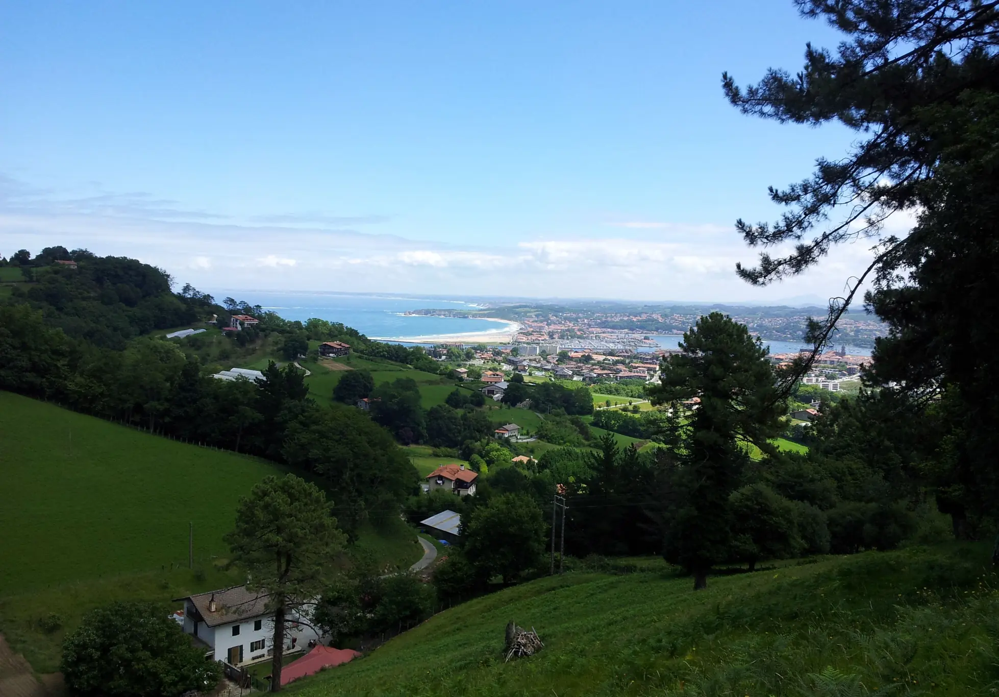

 **Santuario de Guadalupe**
 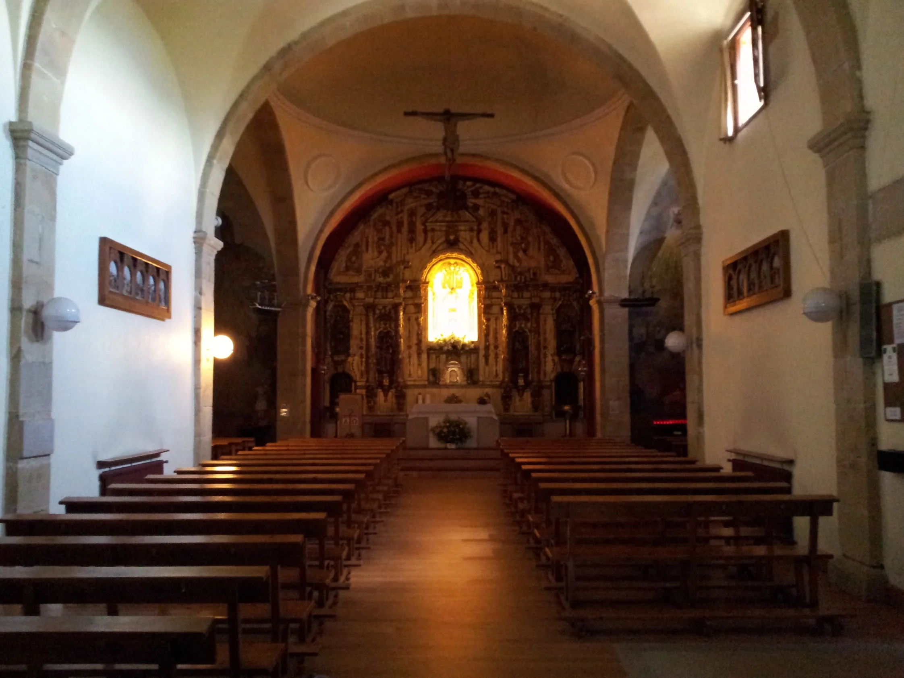

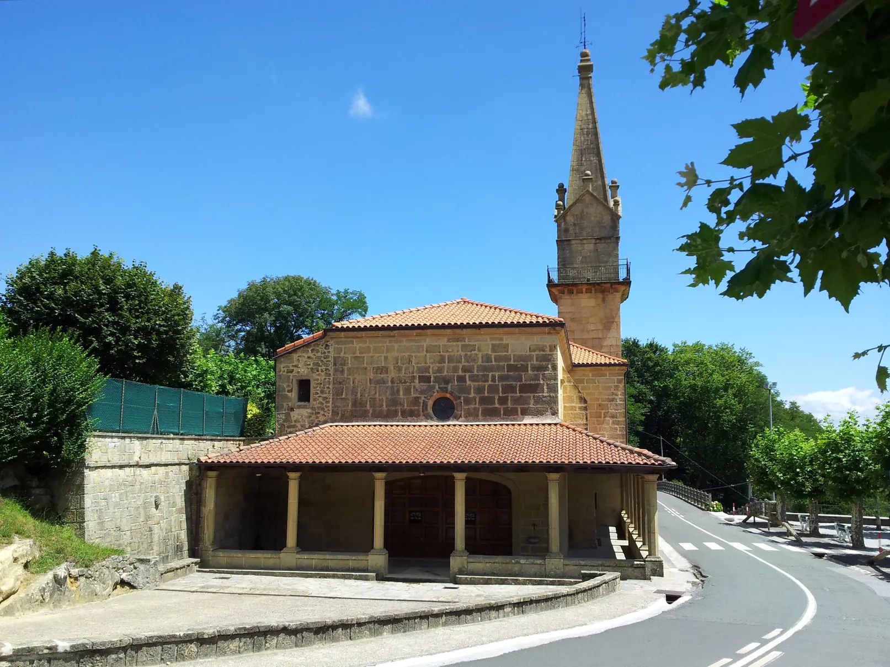

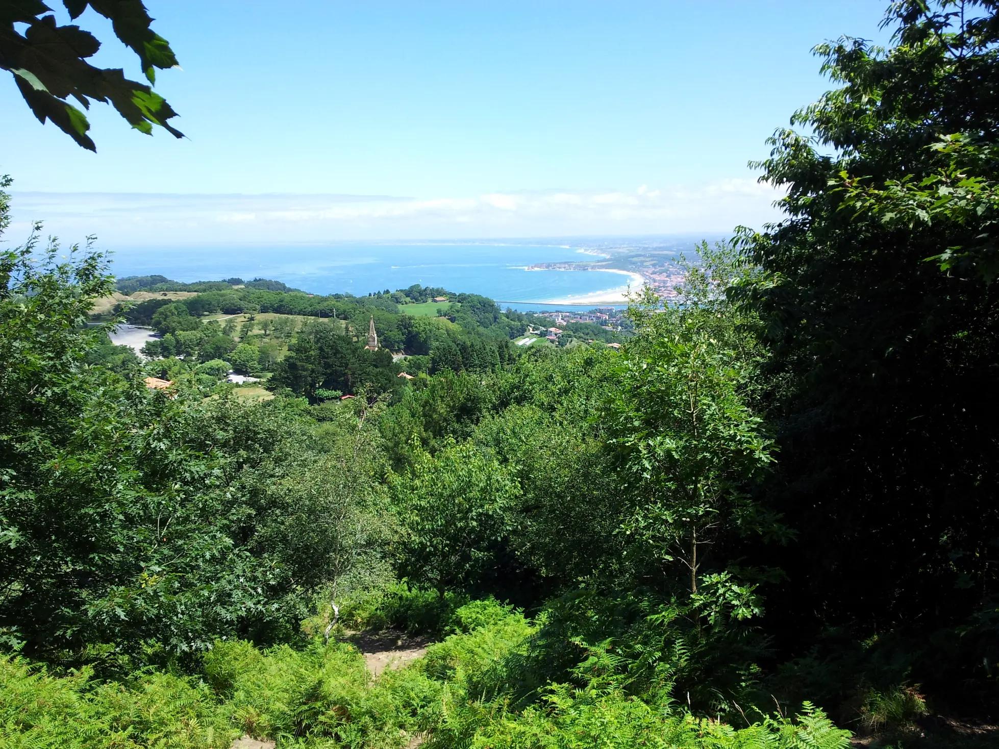

---

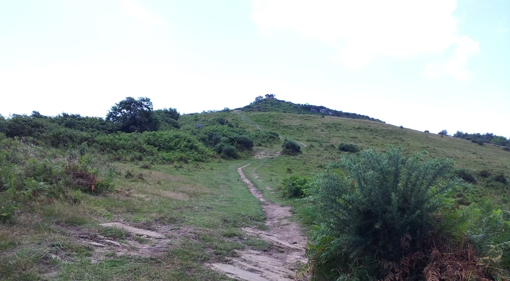

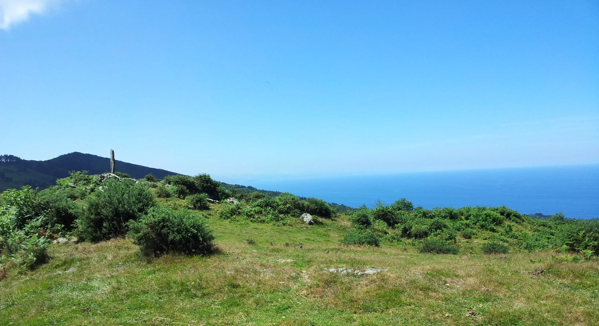

---
Skizze
### Jaizkibel III  
_Trikuarria – Dolmen_  
_Historiaurreko hilobia – Sepultura prehistórica_  
**Dolmen – prähistorisches Grab**

Der Jaizkibel trägt seine Geschichte nicht nur in seinen Wegen und Landschaften, sondern auch in den Spuren der Menschen, die hier bereits vor Tausenden von Jahren lebten.

 Jaizkibel  

#### 🌊 1. Die geheimnisvolle Entdeckung der Madonna von Guadalupe

Das ist wahrscheinlich die schönste und bekannteste Legende vom Jaizkibel.

Der Überlieferung nach hüteten **zwei Hirtenjungen** ihre Tiere an den Hängen des Jaizkibel. Eines Tages bemerkten sie an einem Busch ein **ungewöhnliches, geheimnisvolles Licht**. Als sie sich näherten, entdeckten sie dort eine Marienfigur – die spätere **Jungfrau von Guadalupe**.

An genau dieser Stelle soll später das Heiligtum errichtet worden sein. Die heutige Überlieferung des Heiligtums erzählt ebenfalls von diesem wundersamen Licht und der gefundenen Marienfigur. Euskadi.eus+1

Besonders interessant: Es gibt außerdem die Vermutung, dass die Figur ursprünglich von einem **Schiffsbug bzw. einer Galionsfigur** stammen könnte. Das würde wunderbar zur Lage des Jaizkibel unmittelbar am Meer passen. ingeba.org+1

#### ⚔️ 2. Die Madonna als Beschützerin von Hondarribia

Aus der Legende wurde später eine tief verwurzelte Tradition.

Im Jahr **1638** wurde Hondarribia von französischen Truppen belagert. Die Marienfigur von Guadalupe wurde aus der Kapelle in die geschützte Stadt gebracht, damit sie während der Kämpfe nicht zerstört wurde.

Die Bewohner von Hondarribia schrieben der Jungfrau anschließend einen besonderen **Schutz während der Belagerung und den Sieg am 7. September 1638** zu. Als Dank entstand die Tradition einer Prozession zum Heiligtum am 8. September. Diese Tradition besteht bis heute. Euskadi.eus+1

Das macht den Ort für Pilger besonders interessant: **Der Jaizkibel ist nicht nur ein Berg, sondern auch ein Berg des Schutzes.**

Und damit bekommt auch dein Foto von dem Lied der _Jaizkibel Mendizale Taldea_ eine schöne zusätzliche Bedeutung.

#### 🪨 3. Der Jaizkibel war schon vor Jahrtausenden ein besonderer Ort

Noch älter als die christlichen Legenden sind die Spuren der Menschen, die hier vor Tausenden von Jahren lebten.

Auf dem Jaizkibel gibt es eine **Megalithlandschaft mit Dolmen und Gräbern**. Der baskische Name und die genaue Bedeutung dieser alten Kultstätten gehören zu einer viel älteren Geschichte der Region. Das Baskenland besitzt eine besonders reiche Megalithtradition. Euskadi.eus+1

Wenn man dort wandert, läuft man also buchstäblich durch eine Landschaft, die bereits lange vor dem Jakobsweg, vor den mittelalterlichen Kirchen und sogar vor der heutigen Besiedlung eine besondere Bedeutung für Menschen hatte.

#### 🌲 4. Die baskische Mythologie – und Mari

Hier muss man allerdings zwischen **direkt belegten Jaizkibel-Legenden** und der allgemeineren baskischen Mythologie unterscheiden.

In der baskischen Mythologie spielt **Mari**, eine weibliche Natur- und Berggestalt, eine sehr wichtige Rolle. Sie wird besonders mit Bergen, Höhlen, Wetter und Naturgewalten verbunden. Bekannter Mittelpunkt ihrer Überlieferungen ist der Anboto, nicht der Jaizkibel. Deshalb würde ich **nicht behaupten, dass Mari speziell auf dem Jaizkibel wohnte**, wenn man es historisch sauber darstellen möchte. Visit Biscay

Aber die Vorstellung einer geheimnisvollen, beseelten Bergwelt passt natürlich sehr gut zu der Atmosphäre des Jaizkibel.

#### 🏰 5. Ein Berg voller Festungen und Kriegslegenden

Der Jaizkibel war wegen seiner Lage über dem Meer und der Bucht von Txingudi auch militärisch von großer Bedeutung.

Auf dem Berg finden sich unter anderem die Überreste des **Forts San Enrique** und das **Fort Guadalupe**. Außerdem gibt es entlang des Kamms Überreste von Befestigungsanlagen aus den Karlistenkriegen. Wikipedia+1

Das Spannende für einen Camino-Wanderer ist der Gegensatz:

**Auf der einen Seite:** Pilger, Hirten, Kapellen und Marienlegenden.  
**Auf der anderen Seite:** Festungen, Soldaten, Kanonen und Krieg.

Und dazwischen immer der Blick auf den Atlantik.

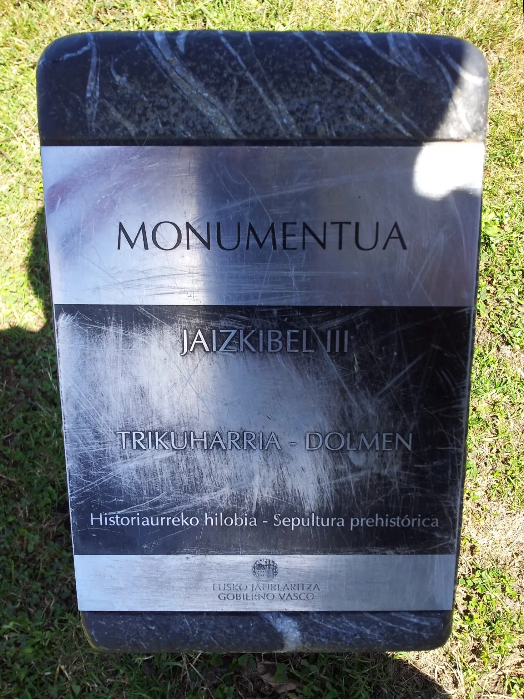

### 🌅 **Der Jaizkibel ist ein Berg voller Geschichten.** 

> **Der Jaizkibel ist ein Berg voller Geschichten.**  
> 
> Einer alten Überlieferung nach entdeckten zwei Hirtenjungen im geheimnisvollen Licht eine Marienfigur – dort, wo heute das Heiligtum von Guadalupe steht. Jahrhunderte später wurde diese Madonna während der Belagerung von Hondarribia als Beschützerin der Stadt verehrt.
> 
> Doch die Geschichte des Jaizkibel reicht noch viel weiter zurück: Dolmen und andere megalithische Spuren erinnern daran, dass Menschen diesen Berg schon vor Tausenden von Jahren aufsuchten. Später kamen Kapellen, Festungen und die Wege der Pilger hinzu.
> 
> **Vielleicht ist es gerade diese Verbindung aus Meer, Berg, Glauben, Geschichte und Legende, die den Jaizkibel zu einem so besonderen Abschnitt des Camino del Norte macht.**
> 
> Und irgendwo auf diesem Weg erinnert ein kleines Metallschild an die Menschen, die diesen Berg bis heute lieben:
> 
> **„Jaizkibel maitea“ – „Geliebter Jaizkibel“.**

---

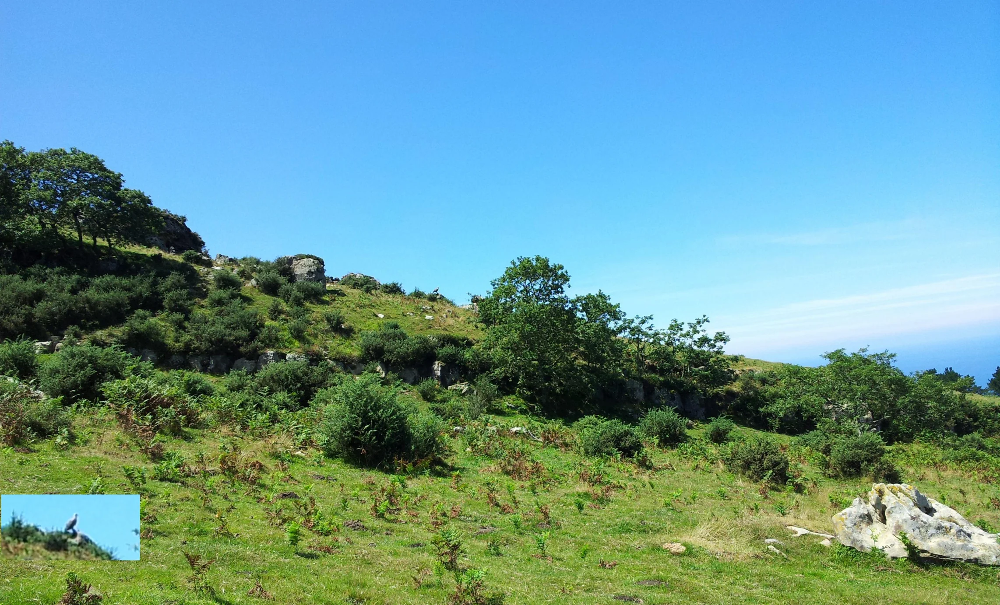

- Tirei três fotografias deste local; então, questiona-se: porquê?

Descobri-o, estão a ver o pássaro ali, naquela rocha no meio?

 Não é um «Halcón peregrino» 

Acho que se chama «Buitre leonado»

Não quero ofender o pássaro que está  lá longe na rocha a olhar para o mar,  mas «Halcón peregrino», pelo nome, encaixava melhor no nosso cenário.

----

- Drei Fotos habe ich von diesem Ort gemacht, dann fragt man sich warum?

Ich hab ihn entdeckt – seht ihr den Vogel da, auf dem Felsen in der Mitte?

Es ist keine  Halcón peregrino 

Ich glaube er heißt Buitre leonado

Ich möchte den Vogel, auf dem Felsen und auf das Meer schaut, nicht zu nah treten, aber Halcón peregrino wurde, von dem Namen her, besser zu uns passen.

---

### Greifvögeln auf dem Jaizkibel

Am Jaizkibel und an der baskischen Steilküste zwischen Irun und San Sebastián gibt es tatsächlich eine Reihe von großen Greifvögeln. Deine Vermutung mit einem Adler ist gar nicht so unwahrscheinlich, allerdings gibt es zwei noch viel häufigere „Giganten“ am Himmel, die Pilger dort regelmäßig auf den Felsen sichten. 

Diese Greifvögel und Geier kommen dort am häufigsten vor:

#### 1. Gänsegeier (Gorgor / Buitre leonado) – _Die wahrscheinlichste Sichtung_

- Aussehen auf dem Fels: Wenn er sitzt, wirkt er riesig, oft etwas buckelig und hat einen hellen, fast weißen Halskragen. Er ist sandfarben bis dunkelbraun. 
- 
- Hintergrund: Das Baskenland beheimatet eine der größten Gänsegeier-Populationen Europas. Sie nutzen die Aufwinde der Klippen am Jaizkibel, um kraftschonend zu segeln. Wenn du einen extrem großen Vogel auf einem Felsen in der Ferne siehst, ist es meistens ein Gänsegeier. 

#### 2. Schmutzgeier (Alimoche)

- Aussehen: Deutlich kleiner als der Gänsegeier. Erwachsene Vögel sind auffällig schmutzig-weiß mit gelbem Gesicht und schwarzen Flügelspitzen.
- Hintergrund: Sie sind Sommergäste im Baskenland und brüten gerne in den zerklüfteten Sandsteinfelsen direkt über dem Meer. 

#### 3. Adlerarten (Aquila / Hieraaetus)

Es kommen tatsächlich mehrere Adlerarten in der Region vor: 

- Zwergadler (Águila calzada): Der häufigste Adler im Sommer. Er ist etwa so groß wie ein Bussard, hat aber sehr markante, adlertypische Flugbilder und existiert in einer sehr hellen (fast weißen) und einer dunklen Farbform.
- Schlangenadler (Águila culebrera): Ein großer Adler mit auffällig hellen, fast weißen Unterseiten und großen, eulenartigen Augen, der im Sommer Jagd auf Reptilien macht. [7]
- Steinadler (Águila real): Der König der Lüfte lebt zwar in den baskischen Bergen, hält sich an der direkt bewohnten Küste aber eher selten und sehr diskret auf. [1]

#### 4. Wanderfalke (Halcón peregrino)

- Aussehen: Viel kleiner als ein Adler, aber extrem kompakt und schnittig mit dunklem „Bartstreifen“ im Gesicht.
- Hintergrund: Die Steilküste des Jaizkibel ist ein perfektes Revier für den Wanderfalken, der dort auf den Klippen brütet und im Sturzflug Jagd auf Seevögel macht. [2, 8]

---

#### Tipp zur Bestimmung:

Schau dir deine Fotos noch einmal genau an. Sitzt der Vogel sehr aufrecht und wirkt majestätisch, geht es Richtung Adler oder Falke. Wirkt er eher wuchtig, klobig und hat einen im Verhältnis kleinen Kopf, hast du mit hoher Wahrscheinlichkeit einen Gänsegeier fotografiert.

---
### Camino del Norte – Jaizkibel

 Begegnungen, Landschaften, Stille und kleine Dinge am Wegesrand

Eines dieser besonderen Dinge war dieses Metallschild am **Jaizkibel**. Darauf steht ein baskischer Text über die **Jaizkibel Mendizale Taldea**, die Jaizkibel-Bergsteigergruppe.

Hier  den Text nicht nur im baskischen, sondern auch in fünf Sprachen als singbare Übertragung.

**Originaltext auf dem Metallschild:**

_Jaizkibel Mendizale Taldea_  
_Itsas alde begira zaude …_  
_Jaizkibel maitea._

### 🇪🇺  **„Singbare Übertragung in 5 Sprachen – erstellt mit ChatGPT“**
Baskisch · Deutsch · Spanisch · Englisch · Portugiesisch

🇧🇸 Jaizkibel maitea.

#### 🇧🇸 Jaizkibel Mendizale Taldea

Itsas alde begira zaude,  
beste alde ikusten da,  
orain dela berrogei hamar  
urte behar zen izena.  
Zure babesean gaude,  
talde txiki ta jatorra,  
pausoz pauso ba gabiltza,  
Jaizkibel maitea.

#### 🇩🇪 Bergsteigergruppe Jaizkibel

Du schaust hinaus zum Meere,  
zur andern Seite hin,  
schon vor fünfzig Jahren
trugst du diesen Namen.  
Unter deinem Schutze  
sind wir klein und treu,  
Schritt für Schritt wir wandern,  
Jaizkibel, geliebter Berg.

### 🇪🇸 Grupo Montañero Jaizkibel

Miras hacia el mar,  
al otro lado se ve,  
hace ya cincuenta años  
ese nombre llevabas.  
Bajo tu protección  
somos un grupo fiel,  
paso a paso caminamos,  
Jaizkibel, querido monte.

### 🇬🇧 Jaizkibel Mountaineering Group**

You look out towards the sea,  
to the far side we can see,  
fifty years have now gone by  
since you bore this name.  
Under your protection,  
we are a faithful band,  
step by step we keep on walking,  
Jaizkibel, our beloved mountain.

### 🇵🇹 Grupo de Montanhistas Jaizkibel**

Olhas para o mar,  
para o outro lado além,  
há cinquenta anos já  
tinhas este nome.  
Sob a tua proteção,  
somos um grupo fiel,  
passo a passo caminhamos,  
Jaizkibel, querido monte.

---
- **Jaizkibel Mendizale Taldea** 

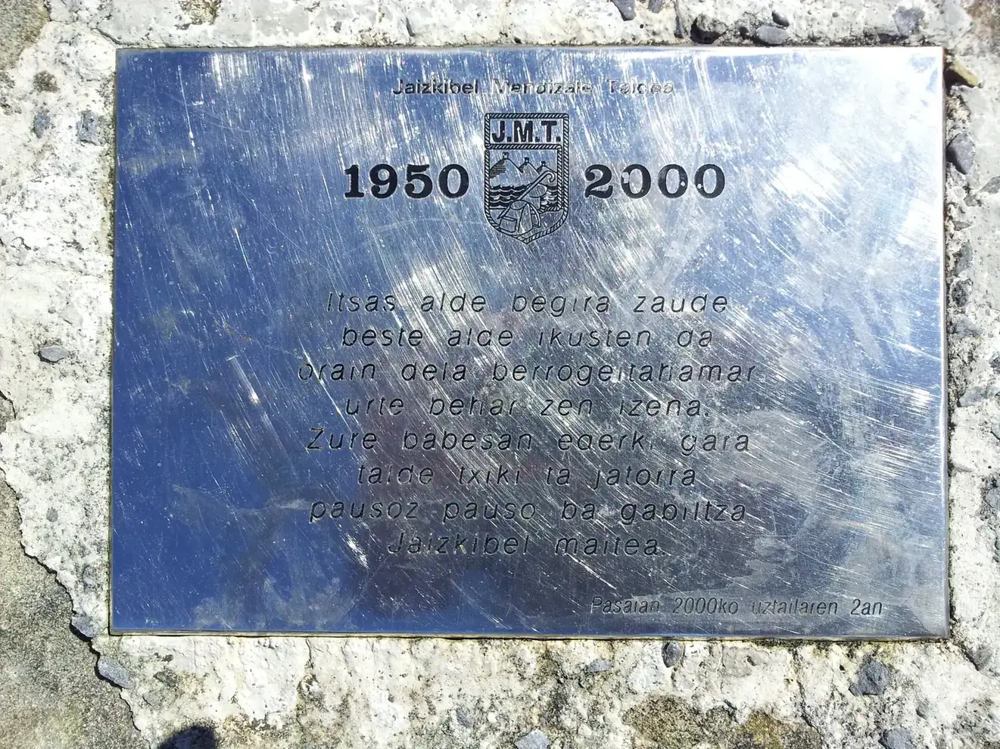

Jaizkibel Mendizale Taldea

#### 🇪🇸  **Grupo de Montañeros Jaizkibel**

Mirando hacia el mar estás,  
al otro lado se puede ver.  
Hace ya cincuenta años  
ese era el nombre que tenía.  
Bajo tu protección estamos,  
un grupo pequeño y noble.  
Paso a paso seguimos caminando,  
querido Jaizkibel.

#### 🇩🇪 Bergsteigergruppe Jaizkibel

Du blickst hinaus zum Meer,  
auf der anderen Seite kann man es sehen.  
Vor fünfzig Jahren schon  
war dies der Name.  
Unter deinem Schutz stehen wir,  
eine kleine und herzliche Gruppe.  
Schritt für Schritt gehen wir weiter,  
geliebter Jaizkibel.

#### 🇬🇧 Jaizkibel Mountaineering Group

You are looking towards the sea,  
on the other side it can be seen.  
fifty years ago,  
that was the name it bore.  
Under your protection we stand,  
a small and kind-hearted group.  
Step by step we keep walking,  
beloved Jaizkibel.

#### 🇵🇹 Grupo de Montanhistas Jaizkibel

Olhas em direção ao mar,  
do outro lado pode-se ver.  
Há cincuenta anos,  
esse era o nome.  
Sob a tua proteção estamos,  
um grupo pequeno e unido.  
Passo a passo seguimos caminhando,  
querido Jaizkibel.

---

🇨🇭 Ein schattiges Plätzli, ein ruhiger Ort, eine Pause, um etwas zu essen  

..., ... 

Erst wenn wir anhalten, wird uns bewusst, wie viele Menschen an uns vorbeigehen
..., ...

#### Die Franzosen und der Überfall auf San Sebastián.

Das dachte ich zumindest zuerst, aber als ich die Kinder sah, die in Begleitung ihrer Eltern fröhlich durch die Berge hüpften, wurde mir klar, dass sie das schöne Wetter nutzten, um diesen herrlichen Wanderweg bis auf die andere Seite der Berge zu gehen und dort ihre Verwandten zu besuchen.

  🇵🇹 Uma sombra, um local tranquilo, uma pausa para comer qualquer coisa. 

..., ... .

Só quando paramos é que nos apercebemos de quantas pessoas passam por nós

..., ... .
#### Os franceses e o assalto a San Sebastián.
Pelo menos foi isso que pensei inicialmente, mas quando vi as crianças, acompanhadas pelos pais, a saltitar alegremente pelas montanhas, percebi que estavam a aproveitar o bom tempo para percorrer este magnífico trilho até ao outro lado das montanhas e visitar lá os seus familiares.

 🇪🇸 Una sombra, un lugar tranquilo, un descanso para comer algo. 

#### Los franceses y la toma de San Sebastián.

Al menos eso fue lo que pensé al principio, pero cuando vi a los niños, acompañados por sus padres, saltando alegremente por las montañas, me di cuenta de que estaban aprovechando el buen tiempo para recorrer esta magnífica ruta hasta el otro lado de las montañas y visitar allí a sus familiares.

 🇬🇧 Some shade, a quiet spot, a break to have a bite to eat. 

#### The French and the storming of San Sebastián.

At least, that’s what I thought at first, but when I saw the children, accompanied by their parents, skipping happily through the mountains, I realised they were making the most of the fine weather to walk along this magnificent trail to the other side of the mountains and visit their relatives there.

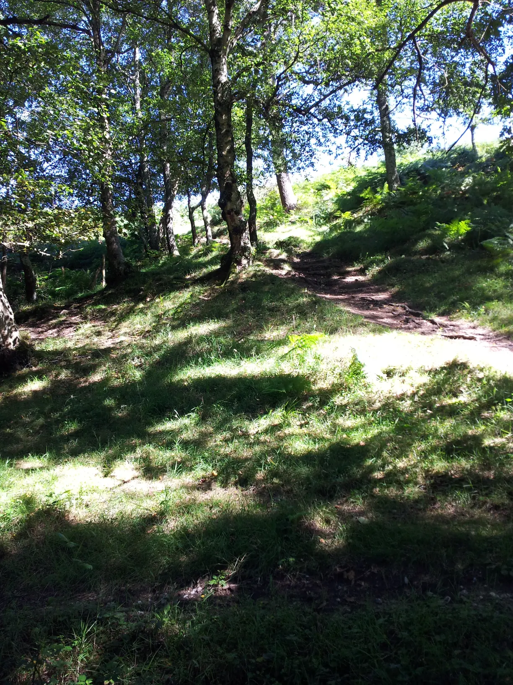

 🇵🇹 Uma fotografia sem interferências

«Uma imagem vale mais do que mil palavras»: um dos ditados mais populares do mundo.

Esta fotografia é uma das minhas favoritas e, ao contemplá-la, sinto-me bem, mas trata-se de um instante de um microsegundo e muitas das coisas que passam por este lugar ficam ocultas no espaço-tempo.

 🇪🇸 Una fotografía sin interferencias

«Una imagen vale más que mil palabras»: uno de los refranes más populares del mundo.

Esta fotografía es una de mis favoritas y, al contemplarla, me siento bien, pero se trata de un instante de un microsegundo y muchas de las cosas que pasan por este lugar quedan ocultas en el espacio-tiempo.

 🇨🇭 Ein Foto ohne Störungen

«Ein Bild sagt mehr als tausend Worte»: eines der bekanntesten Sprichwörter der Welt.

Dieses Foto gehört zu meinen Lieblingsbildern, und wenn ich es betrachte, fühle ich mich wohl, doch es handelt sich um einen Augenblick von einer Mikrosekunde, und vieles, was an diesem Ort vor sich geht, bleibt in Raum und Zeit verborgen.

 

 🇬🇧 A place in the shade, a quiet spot, a break to have a bite to eat

"A picture is worth a thousand words": one of the world’s best-known proverbs.

This photograph is one of my favourites, and when I look at it, I feel at ease; yet it captures a mere microsecond, and much of what is happening in this place remains hidden in space and time.

---
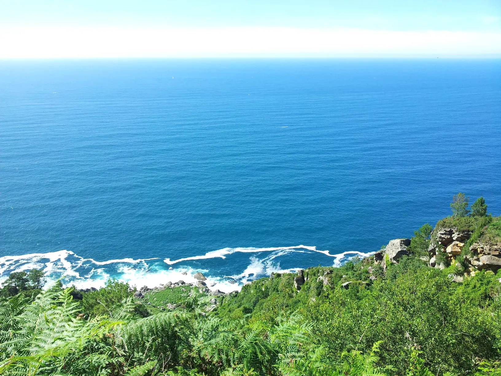

Es waren 17:30 als dieses Foto gemacht worden ist und  ich wurde sagen San Juan ist nicht mehr weit.

---
### Etappe-02: San Sebastian  → Zarautz (21,0 km)
**29 Juli 2015** (?)

🇩🇪 Ich habe noch mehr Fotos von diesen Wanderwegen. Leider kann ich die Fotos nicht mehr so einfach den Wanderwegen zuordnen, da sich beim Austausch des Akkus und der SD-Karte sowohl die Uhrzeit als auch die Nummerierung geändert haben.

Aber ich erinnere mich noch genau an diese Fotos. Als ich in Zarautz ankam, setzte ich mich hin und genoss einfach dieses Spektakel.

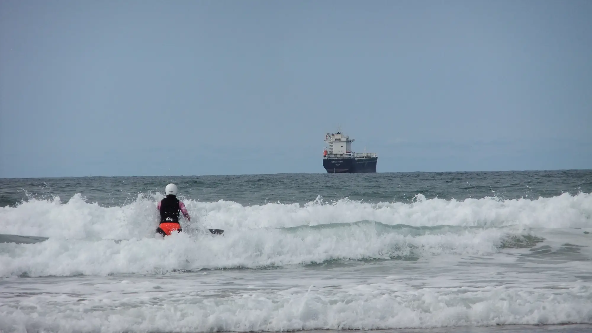

🇪🇸 Tengo más fotos de estas rutas de senderismo. Por desgracia, ya no puedo relacionar las fotos con las rutas tan fácilmente, ya que al cambiar la batería y la tarjeta SD se modificaron tanto la hora como la numeración.

Pero aún recuerdo perfectamente esas fotos. Cuando llegué a Zarautz, me senté y simplemente disfruté de aquel espectáculo.

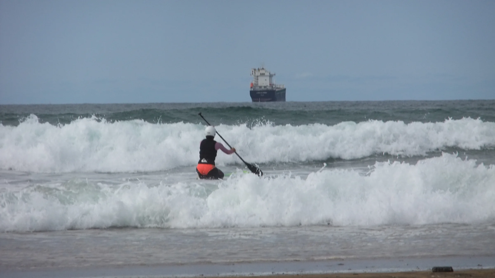

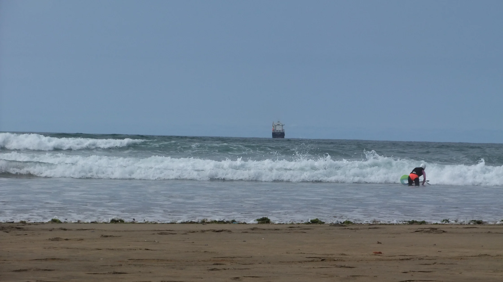

 🇵🇹  Tenho mais fotos destes percursos de caminhada. Infelizmente, já não consigo associar as fotos aos percursos com tanta facilidade, pois, ao trocar a bateria e o cartão SD, tanto a hora como a numeração mudaram.

Mas ainda me lembro perfeitamente destas fotos. Quando cheguei a Zarautz, sentei-me e limitei-me a apreciar aquele espetáculo.
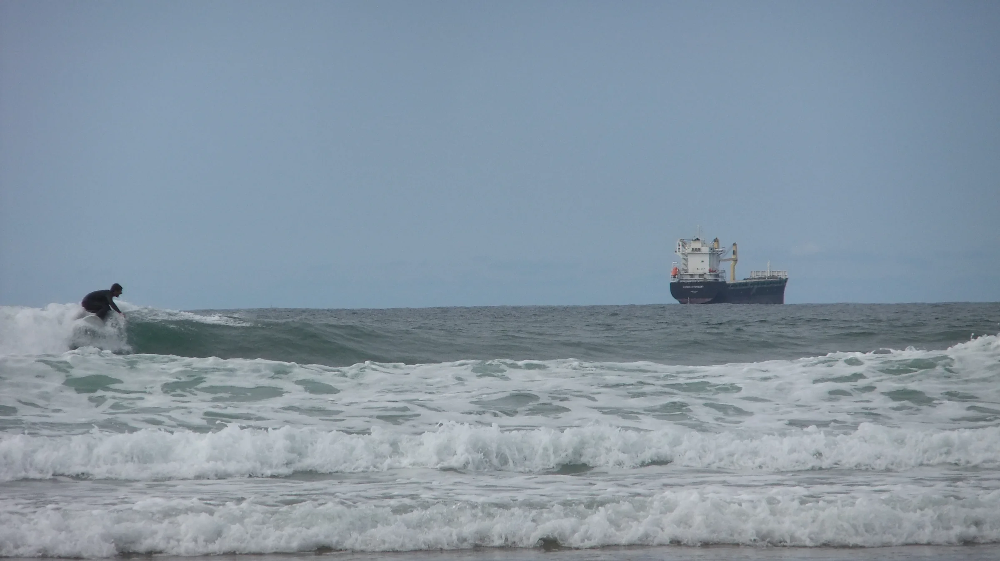

🇬🇧 I’ve got some more photos of these walking trails. Unfortunately, I can’t easily match the photos to the trails anymore, as both the time and the numbering changed when I swapped the battery and the SD card.

But I still remember these photos very clearly. When I arrived in Zarautz, I sat down and simply took in the spectacular view.

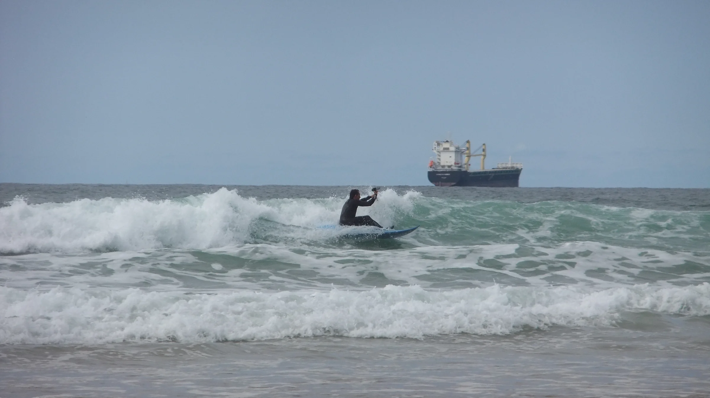

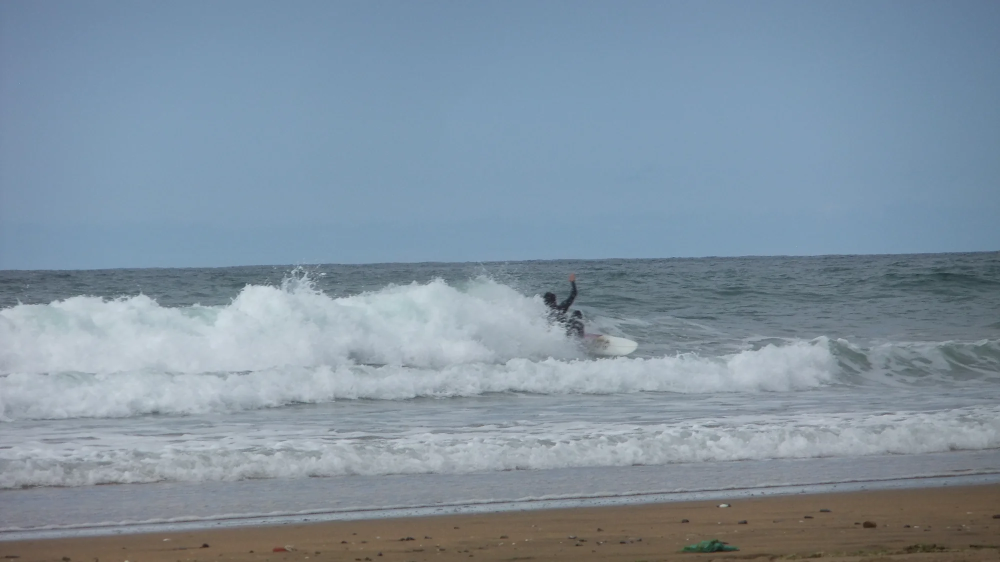

---
### Etappe-03: Zarautz → Deba (21,0 km)
**30 Juli 2015**

Ein Baum volle Leben  

 A tree full of life

 Un árbol lleno de vida

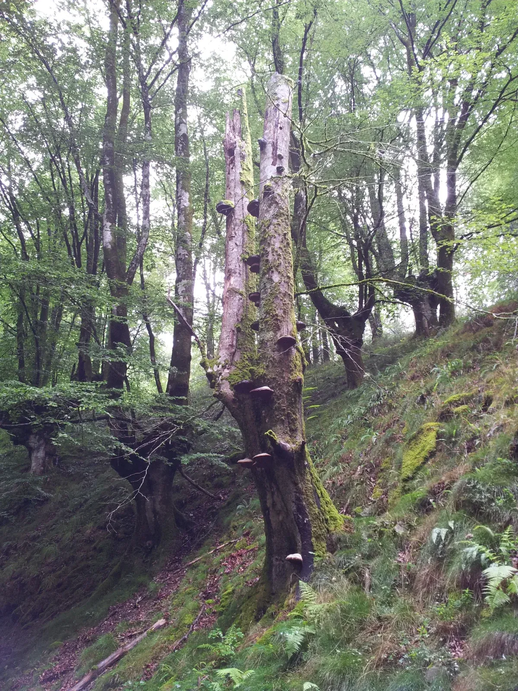

Die erste Etappe des **Camino del Norte von Irun nach San Sebastián** über den Berg **Jaizkibel** gehört landschaftlich zu den spektakulärsten Abschnitten überhaupt. Fast jeder Pilger, ich auch,  fotografiert dort das endlose Blau des Atlantiks oder die Steilküste.

Ich möchte diesem toten Baum – der dennoch vor Leben nur so strotzt – einen **Ehrenplatz** einräumen, weshalb ich die KI gebeten habe, mir eine Beschreibung dieses lebendigen Baumes zu liefern.

 Ein Baum volle Leben  

### Ein bereits toter Baum

in der Ökologie als Totholz bezeichnet – ist in Wahrheit einer der lebendigsten Orte im ganzen Wald. Sobald die Abwehrkräfte des Baumes schwinden und Pilze wie deine Austernseitlinge das Holz besiedeln und weich machen, wird das Baumskelett zu einem riesigen „Wohnheim“ für tausende Lebewesen.

Man schätzt, dass etwa ein Viertel aller Waldbewohner auf Totholz angewiesen ist. Hier ist eine Übersicht der wichtigsten Wesen, die dieses Ökosystem beheimatet:

#### 1. Insekten und „Holz-Spezialisten“ (Saproxylophage)

Diese Tiere sind die Pioniere. Sie nutzen das Holz als Nahrung oder bauen Gänge hinein:

- Käfer: Prachtkäfer, Bockkäfer (wie der seltene Alpenbock) und Hirschkäfer legen ihre Eier in oder unter die Rinde. Ihre Larven ernähren sich jahrelang von dem durch die Pilze vorverdauten Holz.
- Ameisen: Rossameisen gründen oft riesige Kolonien im Inneren von morschen Stämmen und legen dort ihre Nestgalerien an.
- Wildbienen und Wespen: Viele solitäre Wildbienenarten nutzen verlassene Käferbohrlöcher als Brutröhren für ihren Nachwuchs.

#### 2. Vögel und Höhlenbrüter

Sobald das Holz weicher wird, kommen die Baumeister des Waldes:

- Spechte: Spechte (wie der Buntspecht oder Schwarzspecht) nutzen solche Stämme intensiv. Zum einen hacken sie die Rinde ab, um an die fetten Käferlarven darunter zu kommen. Zum anderen zimmern sie ihre Bruthöhlen in das morsche Holz.
- Nachmieter: In den Folgejahren nutzen Meisen, Kleiber, Eulen oder der Gartenrotschwanz die verlassenen Spechthöhlen als geschützte Nistplätze.

#### 3. Säugetiere und Amphibien

Das dichte Geflecht aus Rissen, Höhlen und Pilzkonsolen bietet perfekten Schutz:

- Fledermäuse: Arten wie die Mopsfledermaus oder das Braune Langohr nutzen spaltenförmige Quartiere hinter abstehender Rinde oder alte Spechthöhlen als Tagesversteck oder Wochenstube.
- Siebenschläfer und Haselmäuse: Sie verschlafen den Winter oft in den tiefen, geschützten Höhlen im Stamm oder im Wurzelbereich.
- Molche und Kröten: Im feuchten, modernden Holz am Boden oder am Stammgrund finden Amphibien an heißen Tagen Schutz vor Austrocknung.

#### 4. Pilze, Moose und Flechten

Neben den Austernseitlingen siedeln sich unzählige andere Organismen an:

- Moose und Flechten: Sie überziehen die Rinde wie ein grüner Teppich, speichern Feuchtigkeit und bieten wiederum winzigen Springschwänzen und Milben einen Lebensraum.
- Folgepilze: Wenn der Austernseitling das Holz weiter zersetzt hat, folgen andere Pilzarten, die sich auf das noch weichere Substrat spezialisiert haben.

---
- 2018

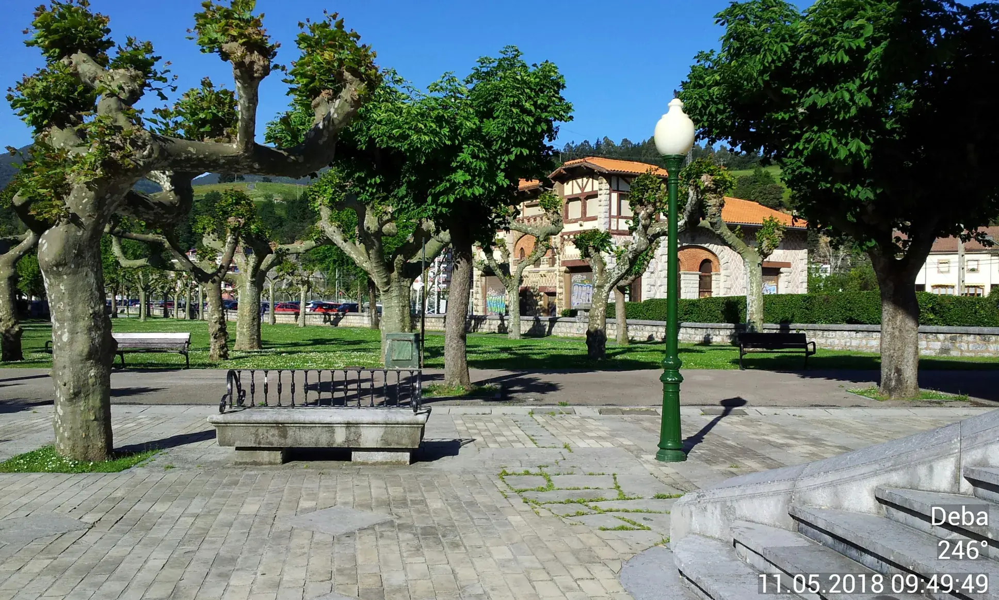

---

  

🇬🇧
🇪🇸
🇵🇹
🇩🇪

---

**↪** [Etappe-04_Ankunft-in-Deba](Etappe-04_Ankunft-in-Deba.md)

 🔁 [Camino-del-Norte_Etapas](Camino-del-Norte_Etapas.md)
 
 ...→