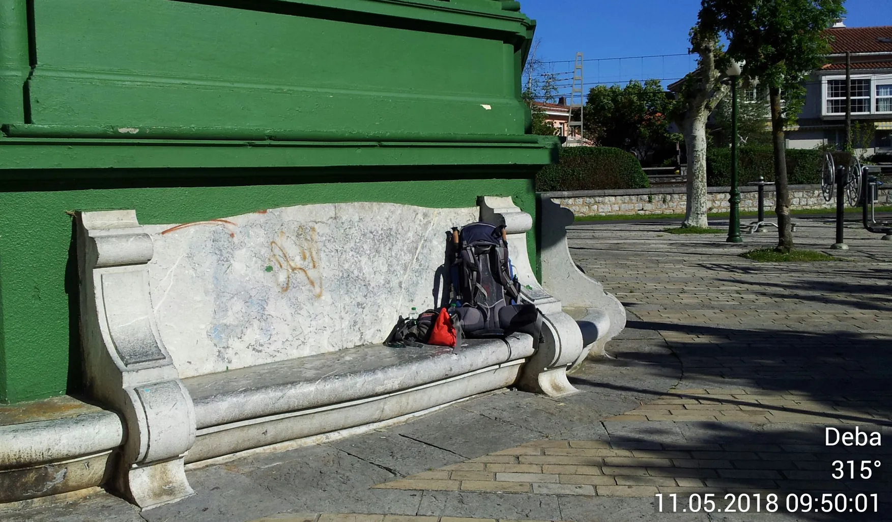
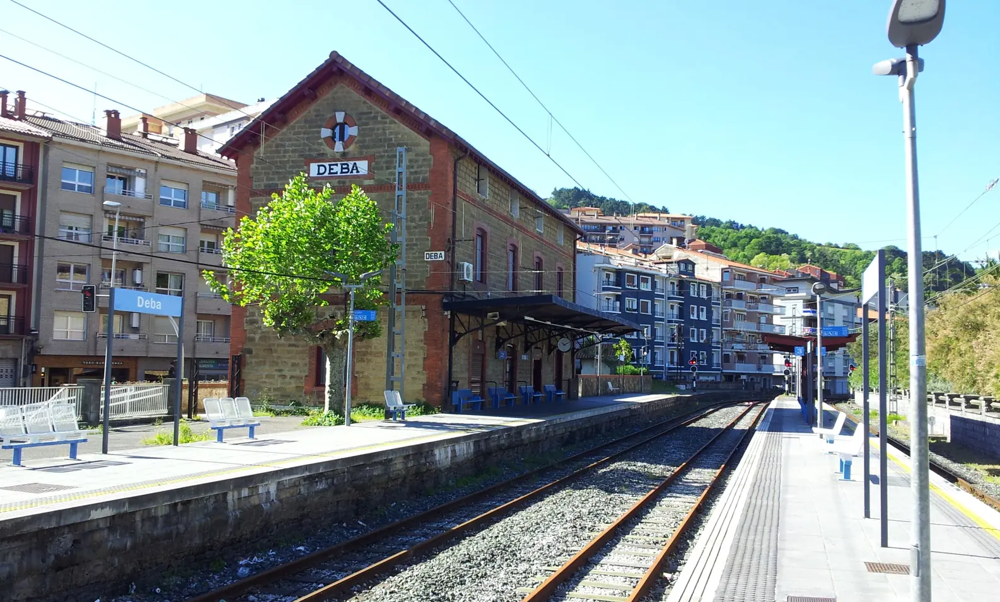
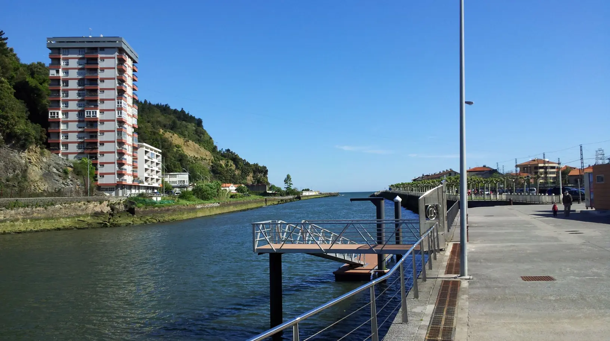
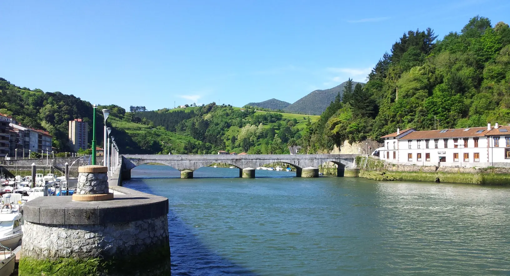
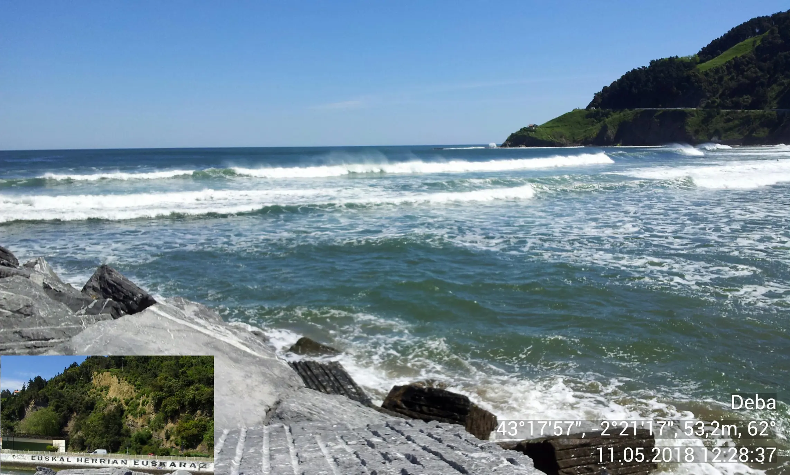
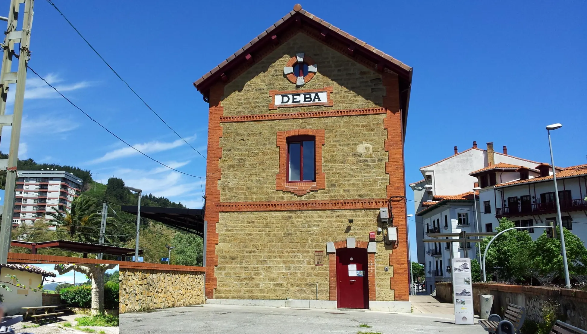

## Camino del Norte  2018

### Ankunft: Park → Albergue  (etwa 100 m)
11  Mai 2018

**🇪🇸 Unos 100 m:** A lo largo de este tramo, me dediqué intensamente a la siguiente etapa. Aunque esta distancia recorrida no supone ninguna hazaña especial, no hay que subestimar esta maratón mental que se ha recorrido en estos 100 m para alcanzar el siguiente objetivo.

Fueron más de 10 segundos, pero me permití ese tiempo

---
**🇬🇧 About 100 m:** Throughout this stretch, I focused intensely on the next stage. Although covering this distance is no great feat, one mustn’t underestimate the mental marathon I ran over these 100 m to reach the next goal.

It took more than 10 seconds, but I allowed myself that time

---
**🇵🇹 Cerca de 100 m:** Ao longo deste percurso, dediquei-me intensamente à próxima etapa. Embora esta distância percorrida não represente um feito especial, não se deve subestimar esta maratona mental que se percorreu nestes 100 m para alcançar o próximo objetivo.

Foram mais de 10 segundos, mas permiti-me este tempo.

---
**🇩🇪 Etwa 100 m:** Auf dieser Strecke habe ich mich intensiv auf die nächste Etappe konzentriert. Auch wenn diese zurückgelegte Strecke keine besondere Leistung darstellt, sollte man diesen mentalen Marathon, den ich auf diesen 100 m zurückgelegt habe, um das nächste Ziel zu erreichen, nicht unterschätzen.

Es waren mehr als 10 Sekunden, aber ich habe mir diese Zeit gegönnt

---

#### **„Egun on! Ongi etorri Euskal Herrira“**

 Ongi etorri 

- **Egun on!**: Guten Morgen! _(wörtlich: „Guten Tag!“)_
- **Ongi etorri**: Willkommen
- **Euskal Herrira**: Im Baskenland / Ins Baskenland _(die Endung „-ra“ bedeutet „nach“ oder „zu“, was im Baskischen bei einer Begrüßung an einem Ort genutzt wird)_

Die **Aussprache-Hilfe** für das Deutsche:

- **Egun on!** → _Eh-gun on!_ (Das „g“ wie im Deutschen; die Betonung liegt auf der jeweils letzten Silbe: eh-**GUN** **ON**)
- **Ongi etorri** → _On-gi eh-tor-ri_ (Das „g“ wie in „Garten“, kein „dsch“-Laut. Das „r“ wird leicht gerollt)
- **Euskal Herrira** → _E-us-kal-ia Heh-ri-ra_ (Das „H“ wird im Baskischen meistens **nicht** gesprochen, es klingt also wie _Eh-ri-ra_. Das doppelte „rr“ wird kräftig gerollt)

Nützliche Begrüßungen und Redewendungen für unterwegs im Baskenland, inklusive einer einfachen Aussprachehilfe:

##### Wichtige Alltagsworte

- **Kaixo!** → _Kai-scho!_ (**Hallo!**)
- **Mesedez** → _Meh-seh-deth_ (**Bitte** – das „z“ klingt wie ein englisches, weiches „th“ oder ein lispelndes „s“)
- **Eskerrik asko!** → _Es-ker-rik as-ko!_ (**Vielen Dank!**)
- **Ez horregatik** → _Eth hor-reh-ga-tik_ (**Gern geschehen / Keine Ursache**)

##### Begrüßungen nach Tageszeit

- **Arratsalde on!** → _Ar-rat-sal-deh on!_ (**Guten Tag / Guten Nachmittag** – ab ca. 14 Uhr)
- **Gabon!** → _Ga-bon!_ (**Guten Abend / Gute Nacht!**)

##### Abschied und Wünsche

- **Agur!** → _Ah-gur!_ (**Tschüss! / Auf Wiedersehen!**)
- **Gero arte!** → _Geh-ro ar-teh!_ (**Bis später!**)
- **Egun ona izan!** → _Eh-gun o-na i-than!_ (Schönen Tag noch!)

#### 2018 vs 2024

 🇪🇸  2018 vs 2024 

Ese 11 de mayo de 2018, desde mi llegada hasta la apertura del albergue, disfruté de los momentos tranquilos y soleados en el parque y, a continuación, me recibió un «hospitalero» voluntario.

En 2024 fuimos directamente al albergue, pero ese año los trámites de registro habían cambiado, sobre todo debido a la ausencia de «hospitaleros» voluntarios. Los sellos, las fundas de almohada y las fundas de cojín se recogen en la oficina de turismo. 

Cansados de la larga etapa, nos volvimos a poner las botas de senderismo, fuimos a la oficina de turismo y regresamos por el mismo camino. 

La distancia puede parecer ridícula, pero cuando llegas al albergue, te sientas en los acogedores bancos, te quitas las botas de senderismo y los pies se niegan a seguir caminando, entonces, subjetivamente, cada metro de esta etapa adicional parece más agotador que el tramo anterior de ese mismo día.

–Sentir– 

Para mí, personalmente, es más agotador correr 3 km por la ciudad que caminar 30 km por una ruta de montaña, subiendo y bajando.

Aunque el esfuerzo de recorrer 30 km por la montaña se nota claramente  y se sienten las fibras musculares agotadas en el cuerpo, se trata de un esfuerzo revitalizante que nos permite dormir profundamente.

El esfuerzo de los 3 km por la ciudad es agotador y  nos deja, de alguna manera, exhausto, lo que se traduce en una noche de sueño agitado.

##### No te preocupes

Deba es una pequeña y bonita ciudad cuyo centro se puede recorrer cómodamente a pie; casi todo el mundo se conoce, y si te pierdes de camino a la oficina de turismo, no dudes en preguntar a la gente, que estará encantada de ayudarte. 

Al amanecer 

>_En el año 2024, estábamos buscando el camino correcto hacia Markina-Xemein cuando, aquella oscura mañana, una amable señora de Deba interrumpió su camino al trabajo para acompañarnos un trecho y indicarnos la senda correcta._

---

 🇵🇹   2018 vs 2024 

Neste dia 11 de maio de 2018, desde a minha chegada até à abertura do albergue, aproveitei os momentos tranquilos e ensolarados no parque e fui depois recebido por um «hospitalero» voluntário.

Em 2024, também fomos diretamente para o albergue, mas as formalidades de registo tinham mudado este ano, sobretudo devido à ausência de «hospitaleros» voluntários. Os carimbos, as fronhas e as capas de almofada são entregues no posto de informação turística. 

Cansados da longa etapa, voltámos a calçar as botas de caminhada, fomos até ao posto de informação turística e regressámos pelo mesmo caminho.

A distância pode parecer ridícula, mas quando se chega ao albergue, senta-se nos bancos convidativos, tira-se as botas de caminhada e os pés se recusam a continuar a caminhar — então, subjetivamente, cada metro desta etapa adicional parece mais cansativo do que o percurso anterior daquele dia.

–Sentir– 

Para mim, pessoalmente, é mais cansativo correr 3 km pela cidade do que caminhar 30 km por um trilho de montanha, subindo e descendo.

O esforço dos 30 km nas montanhas faz-se sentir claramente e notamos as fibras musculares exaustas no corpo, mas é um esforço revigorante que nos permite dormir profundamente.

O esforço dos 3 km na cidade é cansativo e  deixa-nos de alguma forma exaustos, o que se traduz numa noite de sono agitada.

##### Não te preocupes

Deba é uma pequena e bonita cidade, cujo centro pode ser facilmente visitado a pé; quase toda a gente se conhece e, se te perderes a caminho do posto de informação turística, basta perguntar às pessoas simpáticas, que terão todo o gosto em ajudar-te.

**Ao raiar do dia**

>_No ano de 2024, estávamos à procura do caminho certo para Markina-Xemein, quando, naquela manhã escura, uma senhora simpática de Deba interrompeu o seu caminho para o trabalho para nos acompanhar um pouco e indicar-nos o trilho certo._

---

 🇬🇧  2018 vs 2024 

On 11 May 2018, from the moment I arrived until the hostel opened, I made the most of the peaceful, sunny moments in the park and was then welcomed by a volunteer ‘hospitalero’.

In 2024, we went straight to the hostel, but the registration procedures had changed this year, mainly due to the absence of volunteer ‘hospitaleros’. The stamps, pillowcases and cushion covers are handed out at the tourist information centre. 

Tired from the long stage, we put our walking boots back on, went to the tourist information centre and returned by the same route. 

The distance may seem ridiculous, but when you arrive at the hostel, sit down on the inviting benches, take off your walking boots and your feet refuse to carry on – then, subjectively, every metre of this extra stretch seems more exhausting than the previous section of the day’s walk.

 –Feeling– 

–Feeling– Personally, I find running 3 km through the city more tiring than walking 30 km along a mountain trail, going up and down.

Although the exertion of the 30 km hike in the mountains is certainly noticeable, and you can feel the exhausted muscle fibres in your body, it is an invigorating exertion that helps us sleep soundly.

The effort of the 3 km in the city is tiring and  leaves us feeling somewhat exhausted, which results in a restless night’s sleep.

##### Don't worry

Deba is a small, pretty town whose centre is within easy walking distance; almost everyone knows everyone else, and if you get lost on your way to the tourist information centre, just ask the friendly locals – they’ll be happy to help you. 

 **At Dawn** 

> _"In 2024, we were trying to find the way to Markina-Xemein when a friendly lady from Deba stopped on her way to work. She walked with us for a while to show us the right path."_

---

 🇩🇪 2018 vs 2024 

An diesem 11. Mai 2018 genoss ich von meiner Ankunft bis zur Öffnung der Herberge die ruhigen und sonnigen Momente im Park und wurde dann von einem ehrenamtlichen „Hospitalero“ empfangen.

Im Jahr 2024 gingen wir auch direkt zur Herberge, doch die Anmeldeformalitäten hatten sich in diesem Jahr geändert, vor allem aufgrund des fehlenden ehrenamtlichen „Hospitaleros“. Die Stempel, Kissenbezüge und Kissenhüllen werden an der Touristeninformation ausgehändigt. 

Müde von der langen Etappe zogen wir unsere Wanderstiefel wieder an, gingen zur Touristeninformation und kehrten auf demselben Weg zurück. 

Die Entfernung mag lächerlich erscheinen, aber wenn man in der Herberge ankommt, sich auf die einladenden Bänke setzt, die Wanderstiefel auszieht und die Füße sich weigern, weiterzulaufen – dann erscheint subjektiv jeder Meter dieser zusätzlichen Etappe anstrengender als die vorherige Strecke an diesem Tag.

 –Das Empfinden– 

Für mich persönlich ist es anstrengender, 3 km durch die Stadt zu laufen, als 30 km auf einem Bergpfad zu wandern, mit allen Auf- und Abstiegen.

Die Anstrengung der 30 km in den Bergen macht sich zwar deutlich bemerkbar  und man spürt die erschöpften Muskelfasern im Körper, ist aber eine belebende Anstrengung, die uns tief schlafen lässt.

Die Anstrengung der 3 km in der Stadt ist ermüdend und  lässt mich (uns) irgendwie erschöpft zurück, was zu einem unruhigen Schlaf führt.

##### Mach dir keine Sorgen

Deba ist eine kleine, schöne Stadt, deren Zentrum bequem zu Fuß zu erreichen ist; fast jeder kennt jeden, und wenn du dich auf dem Weg zur Touristeninformation verirrst, frag einfach die freundlichen Menschen, die dir gerne weiterhelfen werden. 

**Im Morgengrauen**

> _Im Jahr 2024 waren wir auf der Suche nach dem richtigen Weg nach Markina-Xemein, als an jenem dunklen Morgen eine freundliche Dame aus Deba ihren Weg zur Arbeit unterbrach, um uns ein Stück zu begleiten und uns den richtigen Pfad zu zeigen._

---
- **Non dago turistentzako informazio-zentroa?**
- **Non dago turismo bulegoa?**

#### Ez kezkatu

Deba herri txiki eta ederra da, eta bere erdigunea oinez erraz iristeko modukoa da; ia denek elkar ezagutzen dute, eta turismo bulegora bidean galduta bazaude, galdetu bertako atseginei – pozik lagunduko zaituzte. 

deepl.com erabiliz itzulita

---

Euskal Herrian Euskaraz  ⁘ „Baskisch im Baskenland“

---

🇩🇪 Fotos mit GPS – das ist die Frage 

Während ich diese ruhig Zeit genossen habe, habe ich auch die Zeit genutzt um  mich mit  der Handy-Camera auseinander zu setzen. 

Ich habe daran gedacht die Fotos mit Zeit und GPS Daten aufzunehmen , aber ich fände diese Informationen auf dem Bild störend und man soll daran denken, dass jeder eingeschaltete Handy-Zusatzfunktion Energie verbraucht, und wenn man in die Natur zieht ohne Möglichkeit das Handy aufzuladen, dann sollte man sich überlegen ob diese Zusatzinformationen auf dem Foto sinnvoll sind. 

 🇵🇹 Fotografias com GPS – essa é a questão 

Enquanto desfrutava deste momento de tranquilidade, aproveitei também para me familiarizar com a câmara do telemóvel. 

Pensei em tirar as fotos com a data e a hora e os dados de localização, mas acho que essas informações na imagem seriam perturbadoras; além disso, é preciso ter em conta que qualquer função adicional do telemóvel, quando ativada, consome energia, e quando se vai para a natureza sem possibilidade de carregar o telemóvel, deve-se ponderar se essas informações adicionais na foto fazem sentido

 🇪🇸 Fotos con GPS: esa es la cuestión 

Mientras disfrutaba de este momento de tranquilidad, aproveché también para familiarizarme con la cámara del móvil. 

Pensé en hacer las fotos con la fecha, la hora y los datos de localización, pero creo que esa información en la imagen resultaría molesta; además, hay que tener en cuenta que cualquier función adicional del móvil, cuando está activada, consume energía, y cuando uno se adentra en la naturaleza sin posibilidad de recargar el móvil, hay que plantearse si esa información adicional en la foto tiene sentido.

 🇬🇧  Photos with GPS – that is the question  

Whilst enjoying this moment of tranquillity, I also took the opportunity to familiarise myself with the mobile phone’s camera. 

I thought about taking photos with the date, time and location data, but I felt that having that information in the image would be distracting; moreover, it’s important to bear in mind that any additional mobile phone function, when activated, uses up battery power, and when you’re out in nature with no way of charging your mobile, you need to consider whether including that extra information in the photo is really necessary.

---

- **Albergue de Peregrinos de Deba**

  

🇬🇧
🇪🇸
🇵🇹
🇩🇪

---

↪ 

 🔁 [Camino-del-Norte_Etapas](Camino-del-Norte_Etapas.md)
  
 ...→