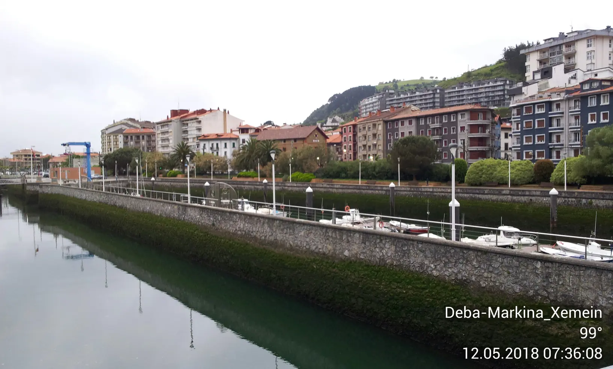
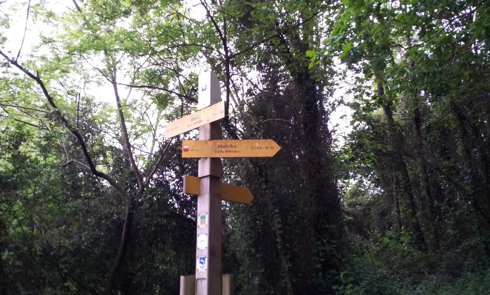
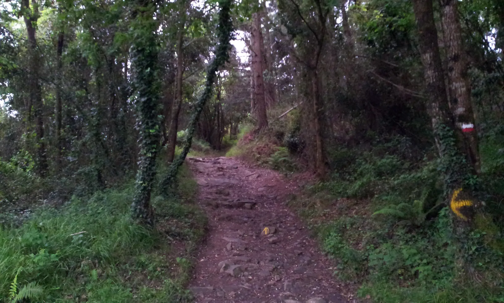
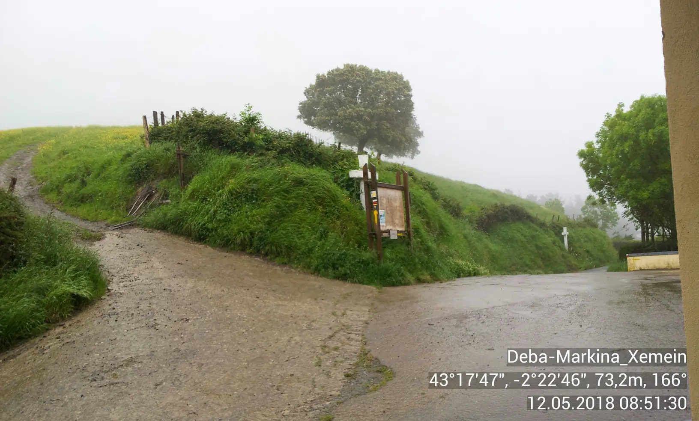
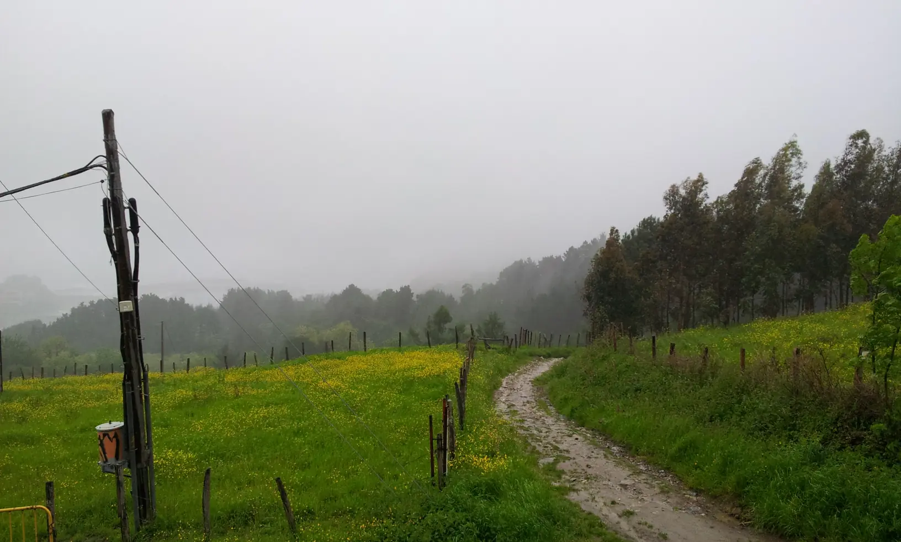
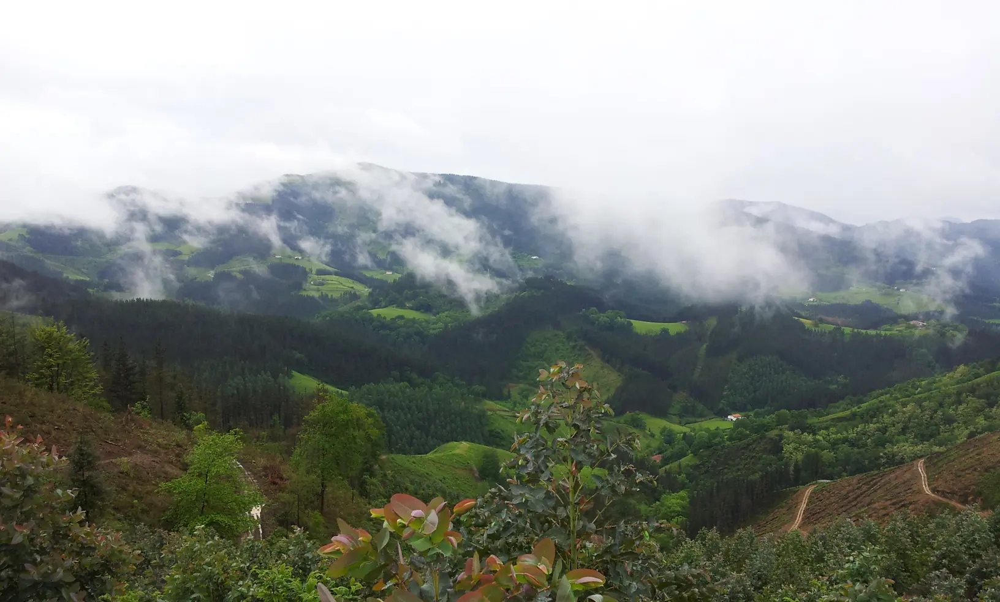
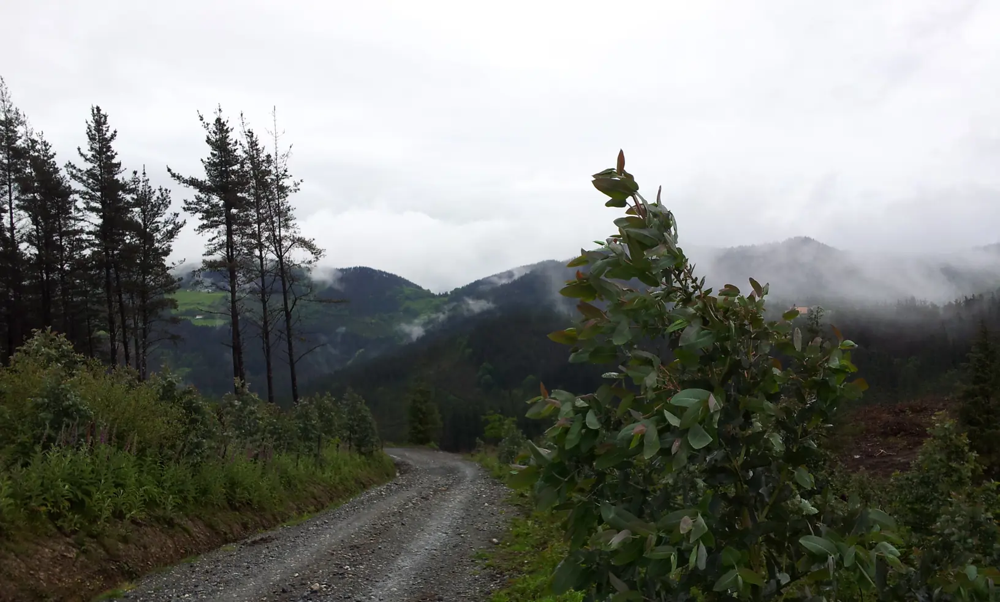

## Camino del Norte  2018

### Etappe-04:  Deba → Markina-Xemein (23,3 Km)
12  Mai 2018

---

- Ayer hacía un tiempo estupendo, pero hoy no pensar en ello. Es el «Camino del Norte». Solo el poncho, que nos tapa un poco la vista, le quita algo de encanto a este camino, que con este tiempo es sencillamente mágico.

- Ontem o tempo estava maravilhoso, mas hoje nem pensar nisso. É o «Camino del Norte». Só o poncho, que nos obstrui um pouco a visão, tira um pouco do encanto deste percurso, que, com este tempo, é realmente mágico.

- Gestern war das Wetter herrlich, aber heute möchte ich  nicht daran denken. Es ist der „Camino del Norte“. Nur der Poncho, der uns ein wenig die Sicht versperrt, nimmt diesem Weg, der bei diesem Wetter einfach zauberhaft ist, etwas von seinem Charme.

- The weather was lovely yesterday, but today I don’t want to think about that. It’s the ‘Camino del Norte’. Only the poncho, which blocks our view a little, takes away some of the charm of this route, which is simply enchanting in this weather.

- Bei diesem Wetter: Das habe ich mir gewünscht 

Hier eine Holzhütte, dort eine andere entlang des Weges – das wäre toll, um sich ab und zu auszuruhen.

- Com este tempo: era isto que eu desejava

Aqui uma cabana de madeira, ali outra ao longo do caminho – seria ótimo para descansar de vez em quando.

- Con este tiempo: eso es lo que me había deseado

Una cabaña de madera por aquí, otra por allá a lo largo del camino… Sería estupendo para descansar de vez en cuando.

- In this sort of weather: that’s exactly what I’d hoped for

A wooden hut here, another one there along the path – that would be lovely for taking a break now and then.

---

  

🇬🇧
🇪🇸
🇵🇹
🇩🇪

---
Link-Einfügung wurde von "git status" nicht als  Änderung wahrgenommen.

**↪** [Etappe-05_Markina-Xemein_Elexalde-Mendata](Etappe-05_Markina-Xemein_Elexalde-Mendata.md)

 🔁 [Camino-del-Norte_Etapas](Camino-del-Norte_Etapas.md)
 

 ...→