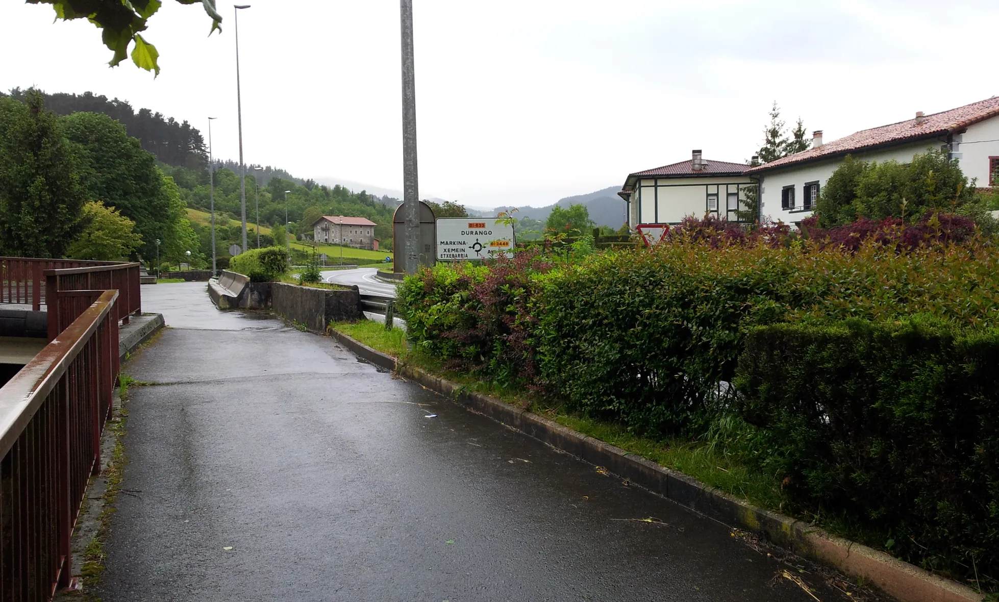
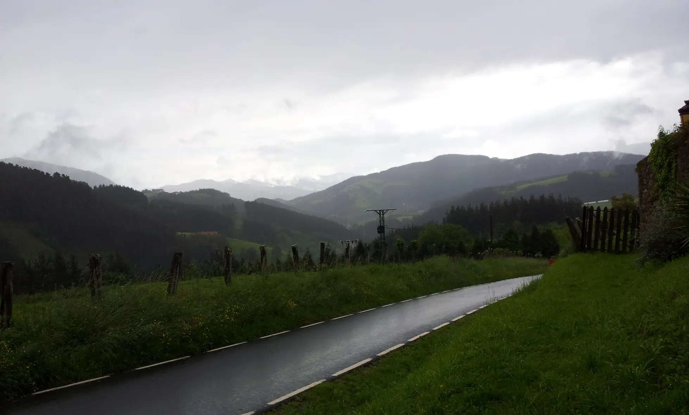
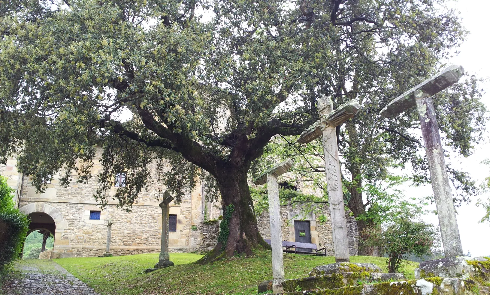
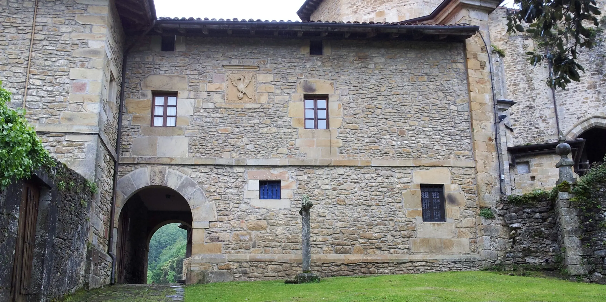
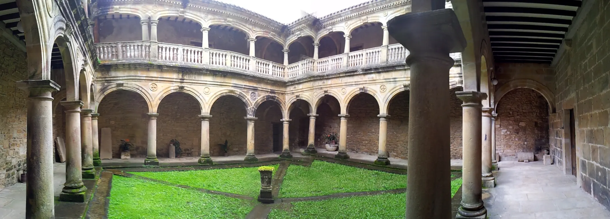
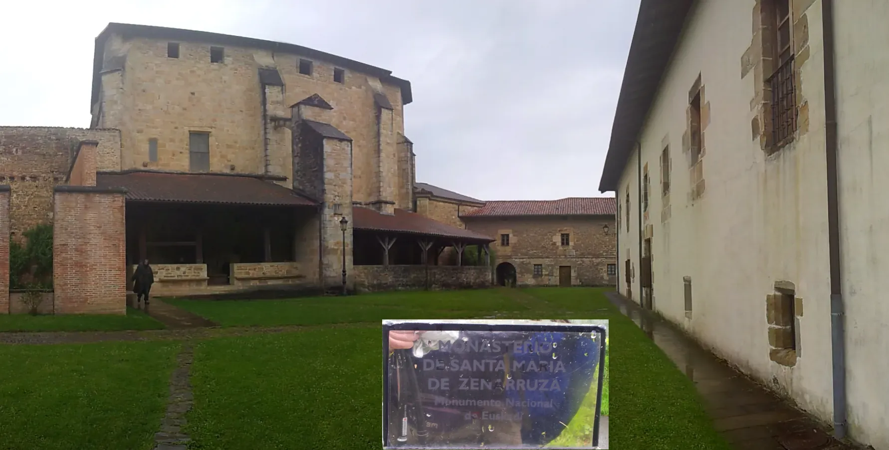
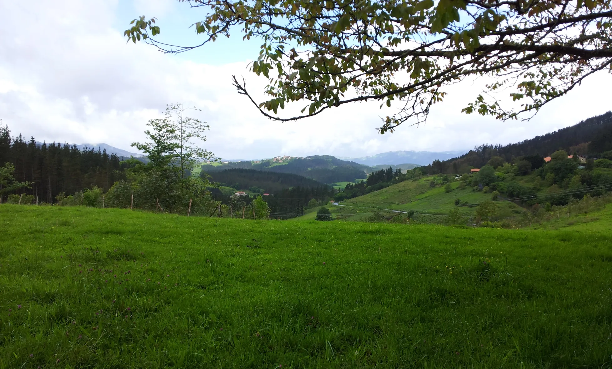
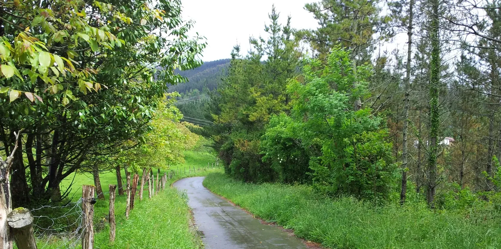
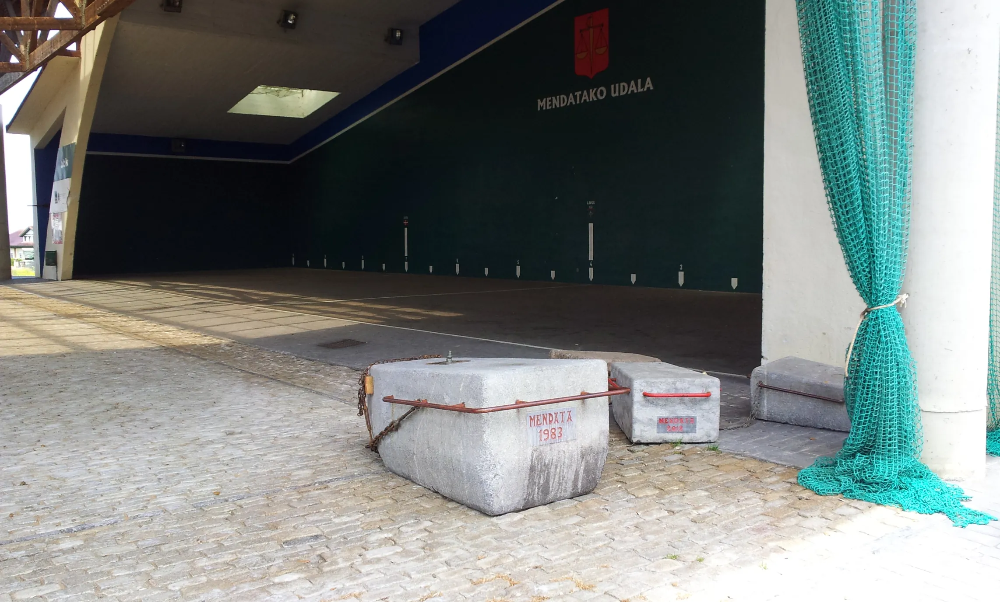
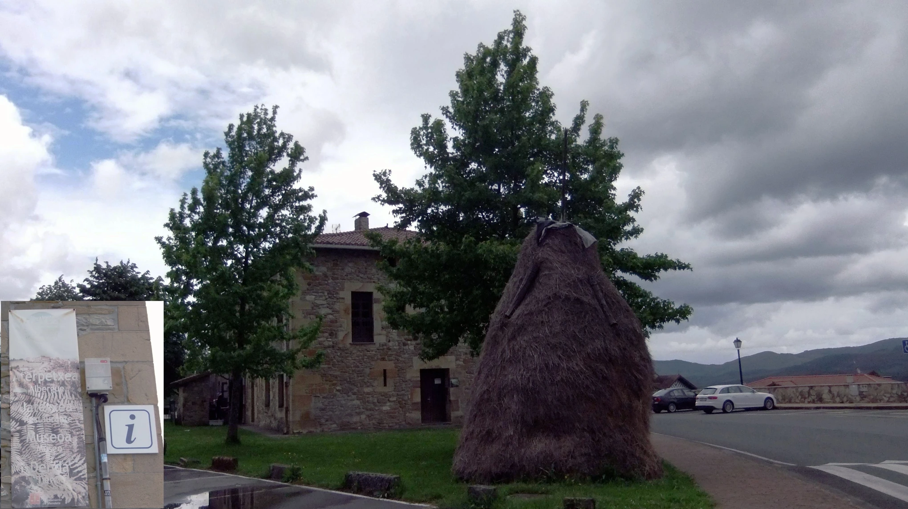

## Camino del Norte  2018

### Etappe-05:  Markina-Xemein → Elexalde Mendata (17,6 + 2,4 Km)
13  Mai 2018

### Elexalde Mendata

- Als ich morgens losfuhr, war mein Ziel Gernika, aber letztendlich blieb ich in Elexalde Mendata
- When I set off in the morning, my destination was Gernika, but in the end I stayed in Elexalde Mendata
- Quando parti de manhã, o meu destino era Gernika, mas no final, fiquei em Elexalde Mendata
- Cuando salí por la mañana, mi destino era Gernika, pero al final me quedé en Elexalde Mendata

---

---

- Udal Probalekua →  Elexalde Mendata (1,6Km)

 🇩🇪 Markina-Xemein – Elexalde Mendata: Ein Tag, der in Erinnerung bleibt  

#### - Markina-Xemein – Elexalde Mendata: Erinnerungen an einen Wandertag

Die Strecke von Markina-Xemein nach Elexalde Mendata bin ich bereits zweimal gelaufen. Im Jahr 2018 habe ich in der Aterpetxea Elejalde in Elexalde Mendata übernachtet.

Dieser Tag ist besonders fest in meinem Gedächtnis gespeichert: der Ort, die Menschen, die Gespräche, die besonderen Themen und unser Schlafplatz im Dachgeschoss mit der sichtbaren Dachholzkonstruktion.

##### Die Ochsen-Wettbewerbe

Eines der Gesprächsthemen waren die früheren Ochsen-Wettbewerbe, bei denen die Tiere schwere Zementblöcke ziehen mussten. Anhand der Datierungen auf den Zementblöcken lässt sich erkennen, dass die letzten Wettbewerbe im Jahr 2012 stattfanden.

An der Größe der Blöcke kann man außerdem erkennen, dass die Ochsen bei den Wettbewerben Anfang der 1980er-Jahre teilweise fast doppelt so große Blöcke zogen wie die Ochsen im Jahr 2012.

##### Erinnerungen an mein Dorf

Die Ursache für diesen Unterschied kenne ich noch aus meinem eigenen Dorf.

Bis Ende der 1970er-Jahre gab es dort nur zwei oder drei Traktoren. Die meisten Bauern bewirtschafteten ihr Land noch mit Arbeitstieren – allerdings vor allem mit Kühen und nicht mit Ochsen.

Kühe waren leichter zu domestizieren und zu kontrollieren, gaben Milch und brachten Kälber zur Welt. Diese konnten später entweder verkauft, domestiziert und als Arbeitstiere eingesetzt oder ebenfalls als domestizierte Tiere verkauft werden.

Die Bauern in meinem Dorf waren stolz darauf, wenn ihre Kühe – paarweise vor einen Karren gespannt – einen Wagen voller Holzstämme mühelos eine Steigung hinaufziehen konnten. Besonders beeindruckend war auch, wenn die Tiere selbstständig den Weg nach Hause fanden, ohne dass man sie führen musste.

Diese Fähigkeiten waren zugleich gute Argumente, wenn es darum ging, für die Tiere einen möglichst guten Preis zu erzielen.

##### Der Wandel durch die Traktoren

Als die Bauern in den 1980er-Jahren immer mehr Arbeiten mit den kleinen Traktoren erledigten, wurden die Tiere körperlich nicht mehr in gleichem Maße gefordert.

Mit der Zeit gingen dadurch Fähigkeiten verloren, die früher selbstverständlich waren und auf die man besonders stolz gewesen war.

Genau diese Entwicklung hat meiner Meinung nach auch in Elexalde Mendata stattgefunden. Die kleineren Zementblöcke der späteren Wettbewerbe sind ein sichtbares Zeichen dieses Wandels.

##### Eine ganz andere Erinnerung: Markina-Xemein

Ganz anders ist meine Erinnerung an die Übernachtung in Markina-Xemein.

Von dem Abend zuvor ist in meinem Gedächtnis nichts geblieben: kein Bild, kein Wort, kein Mensch.

Während der Tag in Elexalde Mendata mit seinen Menschen, Gesprächen und besonderen Eindrücken bis heute lebendig geblieben ist, scheint der Abend in Markina-Xemein vollständig aus meinem Gedächtnis verschwunden zu sein.

##### Mögliche Ursache für diese Erinnerungslücke

Es gibt Tage, an denen man einfach müde ist oder sich um die Kleidung oder die Ausrüstung kümmern muss, und so vergeht ein Nachmittag auf einer Pilgerreise.

Es gab Tage, an denen ich die Nacht allein in einer Herberge verbracht habe, ohne dass diese Orte nach menschlichen Maßstäben etwas Besonderes waren oder etwas Besonderes passiert ist, und dennoch sind sie mir lebhaft in Erinnerung geblieben.

**So ist es mit unserem Gedächtnis: Manche Eindrücke sind immer griffbereit; andere brauchen einen Anstoß, wie ein Wort, einen Geruch, einen Zettel oder ein anderes Element und einen Kontext, damit sie aus ihrem verborgenen Zustand hervortreten und wieder in unser Gedächtnis zurückkehren können.**  

---

🇩🇪 Erinnerungen und kleine Beobachtungen 

#### Weitere Themen dieses Abends

##### 1. Die verschiedenen  Esskulturen

Vieles hat sich inzwischen vereinheitlicht. Doch ein Jahr später, in Coimbra, in der Nähe von Santa Clara, habe ich diesen Unterschied sehr intensiv gespürt, als ich die Pilgerreise von Santiago de Compostela nach Fátima zurücklegte.

Auch an diesen Tag erinnere ich mich noch sehr gut. Ich werde diese Pilgerreise später noch ausführlicher beschreiben.

##### 2. Der Wettstreit um Familiengeschenke und deren Bedeutung

Ein weiteres Thema war der Wettstreit um Familiengeschenke und deren Bedeutung sowie die Frage, wo die Grenze eines angemessenen Preises liegt, den sich alle leisten können.

##### 3. Berufstätige Hausfrauen auf Pilgerreise

Berufstätige Hausfrauen brechen zu einer Pilgerreise auf und lassen ihre Männer und Teenager-Kinder orientierungslos zu Hause zurück – unfähig, das GPS ihres Handys zu benutzen, um herauszufinden, wo sich die Töpfe in der Küche befinden.

##### 4. „Wann wollt ihr losfahren, damit ich den Wecker stellen kann?“

Und schließlich der Satz:

> „Wann wollt ihr losfahren, damit ich den Wecker stellen kann?“

Meine Antwort darauf:

> „Auf dem Jakobsweg braucht man keinen Wecker, man wird geweckt.“

Das Gegenargument lautete:

> „Ja, aber jeder hat seinen eigenen Rhythmus, um sich fertig zu machen. Indem ich den Wecker stelle, übertrage ich ihm die Verantwortung, mich zu wecken, wenn es soweit ist, ohne ständig auf die Uhr schauen zu müssen.“

Die Technik hilft uns zwar, bestimmt aber gleichzeitig auch unseren Rhythmus. Und der Schlaf lässt sich nicht so einfach mit einem Wecker programmieren.

Dennoch habe ich mir diesen Satz gemerkt und versucht, mich daran zu orientieren.

---

 🇩🇪 Erinnerungen und kleine Beobachtungen –ChatGPT-Version–  

#### Weitere Themen dieses Abends

Im Laufe des Abends kamen noch einige andere Themen zur Sprache – scheinbar ganz unterschiedliche Dinge, die bei näherer Betrachtung doch etwas miteinander zu tun haben: unterschiedliche Lebensweisen, Erwartungen, Familienrituale und nicht zuletzt die Frage, wie sehr wir unseren Alltag von der Technik bestimmen lassen.

##### 1. Von der Vereinheitlichung der Essenskultur  und den Unterschieden, die bleiben

Wir sprachen über die verschiedenen gastronomischen Kulturen. Vieles hat sich inzwischen vereinheitlicht. Die gleichen Produkte, ähnliche Restaurants, vergleichbare Essgewohnheiten – die Welt scheint auch kulinarisch immer kleiner zu werden.

Und doch gibt es Unterschiede, die man erst wirklich wahrnimmt, wenn man selbst unterwegs ist.

Ein Jahr später habe ich das in Coimbra, in der Nähe von Santa Clara, erlebt. Damals war ich auf dem Weg von Santiago de Compostela nach Fátima unterwegs. Diese Erfahrung ist mir besonders in Erinnerung geblieben, weil sie mir gezeigt hat, dass kulturelle Unterschiede nicht unbedingt in großen Dingen liegen müssen. Manchmal entdeckt man sie in einer Mahlzeit, in einer Geste oder in einer Selbstverständlichkeit, die für die einen ganz normal und für die anderen völlig ungewohnt ist.

Auch an diesen Tag erinnere ich mich noch sehr gut. Aber diese Pilgerreise verdient eine eigene Geschichte. Ich werde sie später ausführlicher erzählen.

##### 2. Geschenke, Erwartungen und die unsichtbare Grenze des Preises

Dann ging es um Familiengeschenke – und um die merkwürdige Dynamik, die sich daraus entwickeln kann.

Geschenke sollen eigentlich Freude bereiten. Trotzdem können sie innerhalb einer Familie beinahe zu einem kleinen Wettstreit werden: Wer schenkt wem was? Wie großzügig darf, soll oder muss man sein? Und ab welchem Preis wird aus einem schönen Geschenk eine Erwartung, der vielleicht nicht mehr jeder folgen kann?

Damit verbunden ist eine Frage, die sich wahrscheinlich viele Familien irgendwann stellen: Wo liegt die Grenze eines angemessenen Preises – eines Preises, den sich alle leisten können, ohne dass aus dem Schenken ein Wettbewerb wird?

Vielleicht liegt der eigentliche Wert eines Geschenks ohnehin weniger auf dem Preisschild als in der Aufmerksamkeit, die darin steckt.

##### 3. Wenn die Hausfrau auf Pilgerreise geht

Besonders amüsant wurde es bei dem Thema der berufstätigen Hausfrauen, die sich zu einer Pilgerreise aufmachen.

Sie verlassen für einige Tage das Haus, um einen Weg zu gehen, der körperlich und geistig durchaus anspruchsvoll sein kann. Zurück bleiben der Ehemann und die Teenager-Kinder – und plötzlich scheint die häusliche Welt vor völlig neue Herausforderungen gestellt zu sein.

Denn wer weiß schon, wo die Töpfe stehen?

Natürlich könnte man das GPS des Handys benutzen. Aber selbst das scheint in diesem Fall keine ausreichende Hilfe zu sein. Die moderne Technik findet jeden Ort auf der Welt – nur die Küchenutensilien im eigenen Haushalt offenbar nicht immer.

Vielleicht ist das die eigentliche Bewährungsprobe einer Pilgerreise: Nicht den Weg nach Santiago de Compostela zu finden, sondern zu Hause ohne diejenige zurechtzukommen, die normalerweise weiß, wo alles ist.

##### 4. „Wann wollt ihr losfahren, damit ich den Wecker stellen kann?“

Und schließlich blieb mir noch ein Satz besonders im Gedächtnis:

> „Wann wollt ihr losfahren, damit ich den Wecker stellen kann?“

Meine spontane Antwort darauf war:

> „Auf dem Jakobsweg braucht man keinen Wecker. Man wird geweckt.“

Das klingt zunächst vielleicht etwas romantisch. Aber genau das gehört für mich zum Geist des Weges: Man folgt nicht nur einem Zeitplan. Man folgt einem Rhythmus.

Natürlich kam sofort das Gegenargument:

Jeder Mensch braucht unterschiedlich lange, um sich morgens fertig zu machen. Wenn ich den Wecker stelle, übertrage ich die Verantwortung auf ihn, mich rechtzeitig zu wecken. So muss ich nicht ständig auf die Uhr schauen und überlegen, ob es schon Zeit ist.

Auch das ist einleuchtend.

Und genau darin liegt vielleicht der kleine Konflikt zwischen unserem modernen Alltag und dem Leben auf einem Pilgerweg. Die Technik hilft uns, organisiert unseren Tag und gibt uns Sicherheit. Gleichzeitig bestimmt sie aber auch unseren Rhythmus.

Wir stellen den Wecker, damit wir zu einer bestimmten Zeit aufstehen. Wir stellen Erinnerungen ein, damit wir nichts vergessen. Wir planen, messen und kontrollieren.

Doch Schlaf funktioniert nicht ganz so zuverlässig wie ein Kalendertermin.

Vielleicht ist das einer der Gründe, warum mir dieser Satz im Gedächtnis geblieben ist. „Wann wollt ihr loslaufen, damit ich den Wecker stellen kann?“

Ich habe ihn mir gemerkt – und versucht, mich daran zu orientieren.

Denn manchmal ist es vielleicht gar nicht schlecht, nicht alles selbst bestimmen zu wollen. Manchmal reicht es, aufzustehen, wenn man geweckt wird, die Schuhe anzuziehen und loszugehen.

**So wie auf dem Jakobsweg.**

---

  🇪🇸 Markina-Xemein – Elexalde Mendata: Un día que permanece en la memoria 

#### - **Markina-Xemein – Elexalde Mendata: Recuerdos de un día de camino**

Ya he recorrido dos veces el tramo de Markina-Xemein a Elexalde Mendata. En 2018 pasé la noche en el albergue Aterpetxea Elejalde, en Elexalde Mendata.

Ese día ha quedado profundamente grabado en mi memoria: el lugar, las personas, las conversaciones, los temas tan especiales que tratamos y nuestro lugar para dormir en el desván, con la estructura de madera del tejado a la vista.

##### Las competiciones de bueyes

Uno de los temas de conversación fueron las antiguas competiciones de bueyes, en las que los animales tenían que arrastrar pesados bloques de cemento. Por las fechas que aparecen en los bloques de cemento se puede comprobar que las últimas competiciones se celebraron en 2012.

Además, el tamaño de los bloques permite apreciar que, a comienzos de los años ochenta, los bueyes llegaban a arrastrar bloques casi el doble de grandes que los que arrastraban los animales en 2012.

##### Recuerdos de mi pueblo

La causa de esta diferencia todavía la recuerdo de mi propio pueblo.

Hasta finales de los años setenta solo había dos o tres tractores en el pueblo. La mayoría de los agricultores todavía trabajaba la tierra con animales de tiro, aunque principalmente con vacas y no con bueyes.

Las vacas eran más fáciles de domesticar y controlar, daban leche y además tenían terneros. Estos podían venderse, domesticarse y utilizarse posteriormente como animales de trabajo, o también venderse.

Los agricultores de mi pueblo estaban orgullosos cuando sus vacas, enganchadas por parejas a un carro, podían subir sin dificultad una pendiente con un carro cargado de troncos de madera.

También era motivo de orgullo que los animales fueran capaces de encontrar por sí solos el camino de regreso a casa, sin necesidad de que nadie los guiara.

Estas cualidades eran, además, buenos argumentos para conseguir un precio elevado por los animales cuando se vendían.

##### El cambio provocado por los tractores

Cuando durante los años ochenta los agricultores empezaron a realizar cada vez más trabajos con pequeños tractores, los animales dejaron de ser sometidos al mismo esfuerzo físico.

Con el tiempo, fueron perdiendo capacidades que antes se consideraban normales y que eran motivo de orgullo.

En mi opinión, exactamente lo mismo ocurrió en Elexalde Mendata. Los bloques de cemento más pequeños utilizados en las competiciones posteriores son una señal visible de ese cambio.

##### Un recuerdo completamente diferente: Markina-Xemein

Muy diferente es mi recuerdo de la noche que pasé en Markina-Xemein.

De la noche anterior no ha quedado nada en mi memoria: ni una imagen, ni una palabra, ni una persona.

Mientras que el día de Elexalde Mendata, con sus personas, sus conversaciones y sus experiencias tan especiales, sigue vivo en mi memoria hasta hoy, la noche en Markina-Xemein parece haber desaparecido por completo de mis recuerdos.

##### Posible causa de este vacío en la memoria

Hay días en los que uno simplemente está cansado o tiene que ocuparse de la ropa o del equipo, y así se pasa una tarde en un peregrinaje.

Hubo días en los que pasé la noche solo en un albergue, sin que esos lugares tuvieran nada de especial según los criterios humanos ni hubiera ocurrido nada extraordinario, y, sin embargo, los recuerdo perfectamente.

Así es nuestra memoria: algunas impresiones están siempre a mano; otras necesitan un estímulo, como una palabra, un olor, una nota u otro elemento, y un contexto para que puedan salir de su estado oculto y volver a nuestra memoria.  

---

 🇪🇸 Recuerdos y pequeñas observaciones 

#### Otros temas de aquella noche

##### 1. Las diferentes culturas gastronómicas

Muchas cosas se han ido homogeneizando. Sin embargo, un año después, en Coimbra, cerca de Santa Clara, sentí esta diferencia con mucha intensidad  cuando realicé la ruta de peregrinación de Santiago de Compostela a Fátima.

Todavía recuerdo muy bien aquel día. Más adelante describiré esta peregrinación con mayor detalle.

### 2. La competición por los regalos familiares y su significado

Otro tema fue la competición por los regalos familiares y el significado que les damos, así como la cuestión de dónde se encuentra el límite de un precio razonable que todos puedan permitirse.

##### 3. Las amas de casa que trabajan y se van de peregrinación

Las amas de casa que además trabajan se marchan de peregrinación y dejan en casa a sus maridos y a sus hijos adolescentes completamente desorientados, incapaces de utilizar el GPS de su teléfono para averiguar dónde están las ollas en la cocina.

##### 4. «¿A qué hora queréis salir para que pueda poner el despertador?»

Y, finalmente, aquella frase:

> «¿A qué hora queréis salir para que pueda poner el despertador?»

Mi respuesta fue:

> «En el Camino de Santiago no hace falta despertador; uno se despierta.»

El argumento en contra fue:

> «Sí, pero cada persona tiene su propio ritmo para prepararse. Al poner el despertador, le transfiero la responsabilidad de despertarme cuando llegue el momento, sin tener que estar mirando constantemente el reloj.»

La tecnología nos ayuda, pero al mismo tiempo también determina nuestro ritmo. Y el sueño no se puede programar tan fácilmente con un despertador.

Aun así, me quedé con aquella frase en la memoria e intenté orientarme por ella.

---

🇪🇸 Recuerdos y pequeñas observaciones –ChatGPT-Version–  

#### Otros temas de aquella noche

A lo largo de la velada surgieron también otros temas, aparentemente muy distintos entre sí, pero que, al mirarlos con un poco más de atención, tenían algo en común: diferentes formas de vivir, expectativas, costumbres familiares y, no por último, la cuestión de hasta qué punto dejamos que la tecnología determine nuestro día a día.

##### 1. De la uniformidad de la cocina y de las diferencias que permanecen

Hablamos de las diferentes culturas gastronómicas. Muchas cosas se han ido uniformizando. Los mismos productos, restaurantes parecidos, hábitos alimentarios cada vez más similares: también desde el punto de vista culinario, el mundo parece hacerse cada vez más pequeño.

Y, sin embargo, hay diferencias que solo percibimos realmente cuando viajamos.

Un año más tarde lo experimenté con mucha intensidad en Coimbra, cerca de Santa Clara. En aquel momento estaba recorriendo el camino desde Santiago de Compostela hasta Fátima. Aquella experiencia se me quedó especialmente grabada, porque me mostró que las diferencias culturales no tienen por qué manifestarse necesariamente en grandes cosas. A veces se descubren en una comida, en un gesto o en algo que para unos es completamente normal y para otros resulta totalmente desconocido.

También recuerdo muy bien aquel día. Pero aquella peregrinación merece una historia propia. Más adelante la contaré con mayor detalle.

##### 2. Regalos, expectativas y ese límite invisible del precio

Después hablamos de los regalos familiares y de la curiosa dinámica que puede surgir alrededor de ellos.

En principio, un regalo debería servir para hacer feliz a alguien. Y, sin embargo, dentro de una familia puede convertirse casi en una pequeña competición: ¿quién regala qué a quién? ¿Hasta dónde es razonable ser generoso? ¿A partir de qué precio un bonito regalo se convierte en una expectativa que quizá no todos pueden o quieren asumir?

Y con ello aparece una pregunta que probablemente muchas familias se han hecho alguna vez: ¿dónde está el límite de un precio razonable, un precio que todos puedan permitirse sin que regalar se convierta en una competición?

Quizá el verdadero valor de un regalo no esté tanto en su precio como en la atención y el cariño que contiene.

##### 3. Cuando la ama de casa se va de peregrinación

El tema se volvió especialmente divertido cuando hablamos de las mujeres que, además de trabajar, se ocupan habitualmente de la casa y que un buen día deciden marcharse de peregrinación.

Durante unos días abandonan el hogar para recorrer un camino que puede ser exigente tanto física como mentalmente. En casa quedan el marido y los hijos adolescentes, y de repente el mundo doméstico parece enfrentarse a desafíos completamente nuevos.

Porque, al fin y al cabo, ¿quién sabe dónde están las ollas?

Naturalmente, siempre se podría utilizar el GPS del teléfono. Pero incluso la tecnología moderna parece tener sus límites en este caso. Puede encontrar cualquier lugar del mundo, pero localizar los utensilios de cocina dentro de la propia casa no siempre resulta tan sencillo.

Quizá esa sea la verdadera prueba de una peregrinación: no encontrar el camino hacia Fátima, sino arreglárselas en casa sin la persona que normalmente sabe dónde está cada cosa.

##### 4. «¿A qué hora queréis salir para que pueda poner el despertador?»

Y, finalmente, hubo una frase que se me quedó especialmente grabada:

> «¿A qué hora queréis salir para que pueda poner el despertador?»

Mi respuesta espontánea fue:

> «En el Camino de Santiago no hace falta despertador. Uno se despierta.»

Puede sonar un poco romántico. Pero para mí forma parte del espíritu del Camino: no se sigue únicamente un horario. Se sigue también un ritmo.

Por supuesto, llegó inmediatamente el contraargumento:

Cada persona necesita un tiempo diferente para prepararse por la mañana. Si pongo el despertador, le transfiero a él la responsabilidad de despertarme a tiempo. Así no tengo que estar mirando constantemente el reloj para decidir si ya es hora.

Y también es un argumento perfectamente razonable.

Quizá ahí se encuentre precisamente el pequeño conflicto entre nuestra vida moderna y la vida en un camino de peregrinación. La tecnología nos ayuda, organiza nuestro día y nos proporciona seguridad. Pero, al mismo tiempo, también determina nuestro ritmo.

Ponemos el despertador para levantarnos a una hora determinada. Programamos recordatorios para no olvidar nada. Planificamos, medimos y controlamos.

Pero el sueño no funciona con la misma precisión que una cita en el calendario.

Tal vez por eso aquella frase se me quedó en la memoria:

«¿A qué hora queréis salir para que pueda poner el despertador?»

La guardé en mi memoria y traté de orientarme por ella.

Porque quizá no sea tan malo dejar de querer controlarlo todo. A veces basta con levantarse cuando uno se despierta, ponerse los zapatos y echar a andar.

Como en el Camino de Santiago.

---

 🇬🇧 Markina-Xemein – Elexalde Mendata: A Day That Stayed With Me 

#### - **Markina-Xemein – Elexalde Mendata: Memories of a day on the trail**

I have already walked the route from Markina-Xemein to Elexalde Mendata twice. In 2018, I spent the night at Aterpetxea Elejalde in Elexalde Mendata.

That day is firmly preserved in my memory: the place, the people, the conversations, the special topics we discussed, and our sleeping place in the attic, with the wooden roof structure visible above us.

##### The Ox-Driving Competitions

One of the topics we talked about was the old ox-driving competitions, in which the animals had to pull heavy blocks of cement. Judging from the dates marked on the cement blocks, the last competitions took place in 2012.

The size of the blocks also shows that, in the early 1980s, the oxen sometimes pulled blocks that were almost twice as large as those used by the animals in 2012.
##### Memories from My Village

I still know the reason for this difference from my own village.

Until the end of the 1970s, there were only two or three tractors in the village. Most farmers still worked the land with draft animals – mainly cows rather than oxen.

Cows were easier to domesticate and control, they produced milk, and they gave birth to calves. The calves could later be sold, domesticated and used as working animals, or sold as well.

The farmers in my village were proud when their cows, harnessed in pairs, could pull a cart loaded with logs up a steep hill without difficulty.

It was also a source of pride when the animals could find their own way home without anyone having to lead them.

These abilities were also good arguments when negotiating a good price for the animals.

##### The Change Brought by Tractors

During the 1980s, farmers increasingly began doing their work with small tractors. As a result, the animals were no longer required to perform the same demanding physical work.

Over time, they lost abilities that had once been taken for granted and had been a source of considerable pride.

In my opinion, exactly the same development took place in Elexalde Mendata. The smaller cement blocks used in the later competitions are a visible sign of this change.

##### A Completely Different Memory: Markina-Xemein

My memory of the overnight stay in Markina-Xemein is completely different.

Nothing remains in my memory from the previous evening: no image, no word, no person.

While the day in Elexalde Mendata – with its people, conversations and special experiences – has remained vivid in my memory to this day, the evening in Markina-Xemein seems to have disappeared completely.

##### Possible reasons for this gap in my memory

There are days when you’re simply tired or have to sort out your clothes or kit, and that’s how an afternoon on a pilgrimage slips by.

There were days when I spent the night alone in a hostel; by human standards, these places weren’t anything special, nor did anything out of the ordinary happen, and yet they have remained vivid in my memory.

That is how our memory works: some impressions are always close at hand; others need a trigger – such as a word, a smell, a note or some other element – and a context, so that they can emerge from their hidden state and return to our memory.  

---

🇬🇧 Memories and Small Observations  

#### Other Topics Discussed That Evening

##### 1. Different gastronomic cultures

Many things have become increasingly standardized. Yet a year later, in Coimbra, near Santa Clara, I experienced this difference  when I undertook the pilgrimage from Santiago de Compostela to Fátima.

I still remember that day very clearly. I will describe this pilgrimage in greater detail later.

##### 2. The competition over family gifts and their meaning

Another topic was the competition over family gifts and the meaning attached to them, as well as the question of where the limit lies for a reasonable price that everyone can afford.

##### 3. Working housewives setting off on a pilgrimage

Working housewives set off on a pilgrimage and leave their husbands and teenage children at home completely disoriented – unable to use the GPS on their phones to figure out where the pots are in the kitchen.

##### 4. “When do you want to leave so I can set the alarm?”

And finally, the sentence:

> “When do you want to leave so I can set the alarm?”

My response was:

> “On the Camino de Santiago, you don't need an alarm clock; you get woken up.”

The counterargument was:

> “Yes, but everyone has their own rhythm when getting ready. By setting the alarm, I transfer the responsibility to him to wake me when the time comes, without having to keep looking at the clock.”

Technology certainly helps us, but at the same time it also determines our rhythm. And sleep cannot be programmed so easily with an alarm clock.

Nevertheless, I remembered that sentence and tried to use it as a guide.

---

 🇬🇧 Memories and Small Observations –ChatGPT-Version  

#### Other Topics That Evening

As the evening went on, a few other topics came up – seemingly unrelated things that, on closer inspection, actually had something in common: different ways of living, expectations, family traditions and, not least, the question of how much we allow technology to determine the rhythm of our everyday lives.

##### 1. From the standardization of food to the differences that remain

We talked about different gastronomic cultures. So many things have become standardized. The same products, similar restaurants, increasingly similar eating habits – even in culinary terms, the world seems to be getting smaller.

And yet there are differences that we only truly notice when we travel.

A year later, I experienced this very intensely in Coimbra, near Santa Clara. At the time, I was walking from Santiago de Compostela to Fátima. That experience stayed with me because it showed me that cultural differences do not necessarily reveal themselves in big things. Sometimes they are found in a meal, a gesture or in something that seems completely natural to one person and entirely unfamiliar to another.

I still remember that day very clearly. But that pilgrimage deserves a story of its own. I will describe it in greater detail later.

##### 2. Gifts, expectations and the invisible limit of price

We also talked about family gifts and the curious dynamics that can develop around them.

A gift is supposed to make someone happy. And yet, within a family, it can almost turn into a small competition: Who gives what to whom? How generous should one be? And at what price does a nice gift become an expectation that not everyone can – or wants to – meet?

This leads to a question that many families probably ask themselves at some point: Where is the limit of a reasonable price – a price that everyone can afford without gift-giving turning into a competition?

Perhaps the real value of a gift lies less in its price tag than in the thought and attention behind it.

##### 3. When the working homemaker goes on pilgrimage

Things became particularly amusing when we talked about women who work and, at the same time, usually take care of the household – and then decide to leave for a pilgrimage.

For a few days, they leave home behind to walk a route that can be demanding both physically and mentally. Left at home are the husband and the teenage children, and suddenly the domestic world seems to present them with entirely new challenges.

Because, after all, who knows where the pots are?

Of course, one could always use the GPS on the phone. But even modern technology seems to have its limits here. It can find almost any place in the world, yet locating the kitchen utensils in one's own home does not always seem quite so easy.

Perhaps that is the real test of a pilgrimage: not finding the way to Fátima, but managing at home without the person who normally knows where everything is.

##### 4. “When do you want to leave so I can set the alarm?”

And finally, there was one sentence that stayed particularly clearly in my mind:

> “When do you want to leave so I can set the alarm?”

My spontaneous response was:

> “On the Camino de Santiago, you don't need an alarm clock. You get woken up.”

It may sound a little romantic. But for me, that is part of the spirit of the Camino: you don't simply follow a timetable. You also follow a rhythm.

Naturally, the counterargument came immediately:

Everyone needs a different amount of time to get ready in the morning. If I set the alarm, I transfer the responsibility to him to wake me when the time comes. That way, I don't have to keep looking at the clock to work out whether it is time to get up.

And that is a perfectly reasonable argument.

Perhaps this is precisely where the small conflict lies between modern life and life on a pilgrimage route. Technology helps us, organizes our day and gives us a sense of security. But at the same time, it also determines our rhythm.

We set alarms so that we get up at a certain time. We set reminders so that we don't forget anything. We plan, measure and control.

But sleep does not work quite as reliably as a calendar appointment.

Perhaps that is why that sentence stayed with me:

“When do you want to leave so I can set the alarm?”

I remembered it and tried to let it guide me.

Because perhaps it is not such a bad thing to stop trying to control everything. Sometimes it is enough to get up when you wake, put on your shoes and start walking.

Just as you do on the Camino de Santiago.

---

 🇵🇹 Markina-Xemein – Elexalde Mendata: Um dia que permaneceu na memória  

#### - **Markina-Xemein – Elexalde Mendata: Memórias de um dia no caminho**

Já percorri duas vezes o trajeto de Markina-Xemein até Elexalde Mendata. Em 2018, passei a noite no albergue Aterpetxea Elejalde, em Elexalde Mendata.

Esse dia ficou profundamente gravado na minha memória: o lugar, as pessoas, as conversas, os temas especiais que discutimos e o nosso lugar para dormir no sótão, com a estrutura de madeira do telhado visível.

##### As competições de bois

Um dos temas das nossas conversas foram as antigas competições de bois, nas quais os animais tinham de puxar pesados blocos de cimento. Pelas datas inscritas nos blocos de cimento, pode-se verificar que as últimas competições ocorreram em 2012.

O tamanho dos blocos também permite perceber que, no início dos anos 1980, os bois chegavam a puxar blocos quase duas vezes maiores do que aqueles utilizados pelos animais em 2012.

##### Memórias da minha aldeia

A razão para essa diferença ainda a conheço da minha própria aldeia.

Até ao final dos anos 1970, havia apenas dois ou três tratores na aldeia. A maioria dos agricultores ainda trabalhava a terra com animais de tração – principalmente vacas e não bois.

As vacas eram mais fáceis de domesticar e controlar, davam leite e tinham bezerros. Estes podiam mais tarde ser vendidos, domesticados e utilizados como animais de trabalho, ou também vendidos.

Os agricultores da minha aldeia tinham orgulho quando as suas vacas, atreladas em pares, conseguiam puxar sem dificuldade uma carroça carregada de troncos de madeira por uma subida.

Também era motivo de orgulho quando os animais conseguiam encontrar sozinhos o caminho de volta para casa, sem que fosse necessário conduzi-los.

Essas capacidades eram também bons argumentos para conseguir um preço melhor pelos animais quando eram vendidos.

##### A mudança provocada pelos tratores

Durante os anos 1980, os agricultores começaram a realizar cada vez mais trabalhos com pequenos tratores. Como consequência, os animais deixaram de ser submetidos ao mesmo esforço físico.

Com o passar do tempo, foram perdendo capacidades que anteriormente eram consideradas naturais e que constituíam motivo de orgulho.

Na minha opinião, foi exatamente isso que também aconteceu em Elexalde Mendata. Os blocos de cimento menores utilizados nas competições posteriores são um sinal visível dessa mudança.

##### Uma memória completamente diferente: Markina-Xemein

A minha memória da noite que passei em Markina-Xemein é completamente diferente.

Da noite anterior não ficou nada na minha memória: nenhuma imagem, nenhuma palavra, nenhuma pessoa.

Enquanto o dia em Elexalde Mendata – com as suas pessoas, conversas e experiências especiais – continua vivo na minha memória até hoje, a noite em Markina-Xemein parece ter desaparecido completamente das minhas lembranças.

##### Possível causa desta lacuna na memória

Há dias em que simplesmente se está cansado ou em que é preciso tratar da roupa ou do equipamento, e assim passa uma tarde numa peregrinação.

Houve dias em que passei a noite sozinho num albergue, sem que esses locais fossem, segundo os padrões humanos, algo de especial ou que tivesse acontecido algo de especial, e, no entanto, ficaram gravados na minha memória de forma bem viva.

É assim que funciona a nossa memória: algumas impressões estão sempre à mão; outras precisam de um estímulo, como uma palavra, um cheiro, um bilhete ou outro elemento, e de um contexto, para que possam emergir do seu estado oculto e regressar à nossa memória.  

---

 🇵🇹 Memórias e pequenas observações 

#### Outros temas daquela noite

#### 1. As diferentes culturas gastronómicas

Muitas coisas foram-se uniformizando. No entanto, um ano mais tarde, em Coimbra, perto de Santa Clara, senti essa diferença,  quando fiz a peregrinação de Santiago de Compostela a Fátima.

Ainda me lembro muito bem daquele dia. Mais tarde, descreverei esta peregrinação com mais pormenor.

##### 2. A competição pelos presentes familiares e o seu significado

Outro tema foi a competição pelos presentes familiares e o significado que lhes atribuímos, bem como a questão de onde se situa o limite de um preço razoável que todos possam pagar.

##### 3. Donas de casa que trabalham e partem em peregrinação

Donas de casa que também trabalham partem em peregrinação e deixam os maridos e os filhos adolescentes em casa completamente desorientados – incapazes de utilizar o GPS do telemóvel para descobrir onde estão as panelas na cozinha.

##### 4. «A que horas querem sair para eu poder pôr o despertador?»

E, finalmente, a frase:

> «A que horas querem sair para eu poder pôr o despertador?»

A minha resposta foi:

> «No Caminho de Santiago não é preciso despertador; somos acordados.»

O contra-argumento foi:

> «Sim, mas cada pessoa tem o seu próprio ritmo para se preparar. Ao pôr o despertador, transfiro para ele a responsabilidade de me acordar quando chegar a hora, sem ter de estar constantemente a olhar para o relógio.»

A tecnologia ajuda-nos, mas, ao mesmo tempo, também determina o nosso ritmo. E o sono não pode ser programado assim tão facilmente com um despertador.

Ainda assim, guardei aquela frase na memória e tentei orientar-me por ela.

---

🇵🇹 Memórias e pequenas observações  –Versão-ChatGPT– 

#### Outros temas daquela noite

Ao longo da noite surgiram ainda outros temas – coisas aparentemente muito diferentes entre si, mas que, olhando com mais atenção, tinham algo em comum: diferentes formas de viver, expectativas, costumes familiares e, não menos importante, a questão de até que ponto deixamos que a tecnologia determine o ritmo da nossa vida quotidiana.

##### 1. Da uniformização da gastronomia às diferenças que permanecem

Falámos sobre as diferentes culturas gastronómicas. Muitas coisas foram-se uniformizando. Os mesmos produtos, restaurantes semelhantes, hábitos alimentares cada vez mais parecidos – também do ponto de vista culinário, o mundo parece estar a tornar-se cada vez mais pequeno.

E, no entanto, há diferenças que só percebemos verdadeiramente quando viajamos.

Um ano mais tarde, senti isso de forma muito intensa em Coimbra, perto de Santa Clara. Naquela altura, estava a percorrer o caminho de Santiago de Compostela até Fátima. Essa experiência ficou particularmente marcada na minha memória, porque me mostrou que as diferenças culturais não têm necessariamente de se revelar em grandes coisas. Às vezes descobrimo-las numa refeição, num gesto ou numa coisa que para uns é perfeitamente normal e para outros é completamente desconhecida.

Ainda me lembro muito bem daquele dia. Mas essa peregrinação merece uma história própria. Mais tarde, hei de descrevê-la com mais pormenor.

##### 2. Presentes, expectativas e o limite invisível do preço

Falámos também sobre os presentes familiares e sobre a curiosa dinâmica que pode surgir à volta deles.

Um presente deveria, em princípio, servir para dar alegria. No entanto, dentro de uma família, pode transformar-se quase numa pequena competição: quem oferece o quê a quem? Até onde é razoável ser generoso? E a partir de que preço um presente bonito passa a ser uma expectativa que nem todos podem – ou querem – acompanhar?

Daqui surge uma pergunta que provavelmente muitas famílias já fizeram alguma vez: onde fica o limite de um preço razoável – um preço que todos possam suportar sem que oferecer presentes se transforme numa competição?

Talvez o verdadeiro valor de um presente esteja menos no preço e mais na atenção e no carinho que ele representa.

##### 3. Quando a dona de casa que trabalha parte em peregrinação

O tema tornou-se particularmente divertido quando falámos das mulheres que trabalham e que, ao mesmo tempo, normalmente cuidam da casa – e que um belo dia decidem partir em peregrinação.

Durante alguns dias, deixam a casa para trás e partem para um caminho que pode ser exigente tanto física como mentalmente. Em casa ficam o marido e os filhos adolescentes e, de repente, o mundo doméstico parece apresentar-lhes desafios completamente novos.

Porque, afinal, quem sabe onde estão as panelas?

Claro que poderiam sempre utilizar o GPS do telemóvel. Mas até a tecnologia moderna parece ter aqui os seus limites. Consegue encontrar praticamente qualquer lugar do mundo, mas localizar os utensílios da cozinha dentro da própria casa nem sempre parece ser assim tão fácil.

Talvez essa seja a verdadeira prova de uma peregrinação: não encontrar o caminho para Fátima, mas conseguir orientar-se em casa sem a pessoa que normalmente sabe onde está tudo.

##### 4. «A que horas querem sair para eu pôr o despertador?»

E, finalmente, houve uma frase que ficou particularmente gravada na minha memória:

> «A que horas querem sair para eu pôr o despertador?»

A minha resposta espontânea foi:

> «No Caminho de Santiago não é preciso despertador. Somos acordados.»

Pode parecer um pouco romântico. Mas, para mim, isso faz parte do espírito do Caminho: não se segue apenas um horário. Segue-se também um ritmo.

Naturalmente, surgiu de imediato o contra-argumento:

Cada pessoa precisa de um tempo diferente para se preparar de manhã. Se eu ponho o despertador, transfiro para ele a responsabilidade de me acordar quando chegar a hora. Assim, não tenho de estar constantemente a olhar para o relógio para decidir se já está na altura de me levantar.

E é um argumento perfeitamente razoável.

Talvez seja precisamente aí que esteja o pequeno conflito entre a nossa vida moderna e a vida num caminho de peregrinação. A tecnologia ajuda-nos, organiza o nosso dia e dá-nos segurança. Mas, ao mesmo tempo, também determina o nosso ritmo.

Pomos o despertador para nos levantarmos a uma determinada hora. Programamos lembretes para não nos esquecermos de nada. Planeamos, medimos e controlamos.

Mas o sono não funciona com a mesma precisão de um compromisso marcado no calendário.

Talvez seja por isso que aquela frase ficou comigo:

«A que horas querem sair para eu pôr o despertador?»

Guardei-a na memória e tentei orientar-me por ela.

Porque talvez não seja assim tão mau deixar de querer controlar tudo. Às vezes basta levantarmo-nos quando acordamos, calçarmos os sapatos e começarmos a caminhar.

Tal como no Caminho de Santiago.

---
🇩🇪 Noch unterwegs war das erste Thema die Hilfsbereitschaft der Menschen auf dem Weg, aber zu diesem Thema würde ich gerne ein ganzes Buch schreiben. Wer weiß, vielleicht habe ich ja noch genug Energie und Zeit, um damit anzufangen.

**Auf den Satz „Ich hatte mich verlaufen, und ein älterer Herr nahm mich in seinem Auto mit und brachte mich auf den richtigen Weg“ folgte eine kleine philosophische Betrachtung.**

---
🇵🇹 Ainda durante a caminhada, o primeiro tema foi a boa vontade das pessoas  ajudar ao longo do caminho, mas sobre este tema gostaria de escrever um livro inteiro. Quem sabe, talvez ainda tenha energia e tempo suficientes para começar.

**À frase «Perdi-me e um senhor idoso deu-me boleia no seu carro e levou-me ao caminho certo» seguiu-se uma pequena reflexão filosófica.**

---
🇪🇸 Mientras aún estaba de camino, el primer tema fue la buena disposición de la gente a ayudar, pero sobre este tema me gustaría escribir un libro entero. Quién sabe, quizá aún me quede suficiente energía y tiempo para ponerme con ello.

**A la frase «Me había perdido y un señor mayor me llevó en su coche y me indicó el camino correcto» le siguió una pequeña reflexión filosófica.**

---
🇬🇧 Whilst I was still on the road, the first topic was how helpful people were along the way, but I’d love to write a whole book on that subject. Who knows, perhaps I’ll still have enough energy and time to get started on it.

**The sentence ‘I’d got lost, and an elderly gentleman gave me a lift in his car and put me back on the right track’ was followed by a brief philosophical reflection.**

---

Elexalde = „Kirchendorf“

- San Isidoro –**Jaia**– Maiatzak 15 , Meza ostean
- „San Isidro – Fest am 15. Mai, nach der Messe“
- San Isidoro –  **A Festa** –  15 de maio, após a missa

**Artape Aterpetxea:** In dem Jahr 2018 haben wir, die Pilger, hier übernachtet.
Ich habe keine aktuellen oder genaueren Informationen, aber die Albergue "Artape Aterpetxea, Elejalde, 7, 48382, Biscay, Spanien" existiert nicht mehr. Jetzt wird nur der Restaurant "Artape Jatetxea" betrieben.

---

  

🇬🇧
🇪🇸
🇵🇹
🇩🇪

---

**↪** [Etappe-06_Elexalde-Mendata_Larrabetzu](Etappe-06_Elexalde-Mendata_Larrabetzu.md)

 🔁 [Camino-del-Norte_Etapas](Camino-del-Norte_Etapas.md)
 

 ...→