## Camino del Norte  2018

### Etappe-06: Elexalde Mendata → Larrabetzu (8 + 1 + 16  Km)
14  Mai 2018

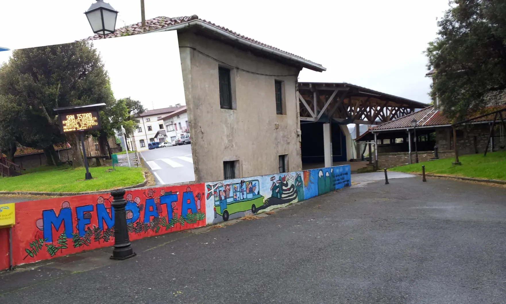

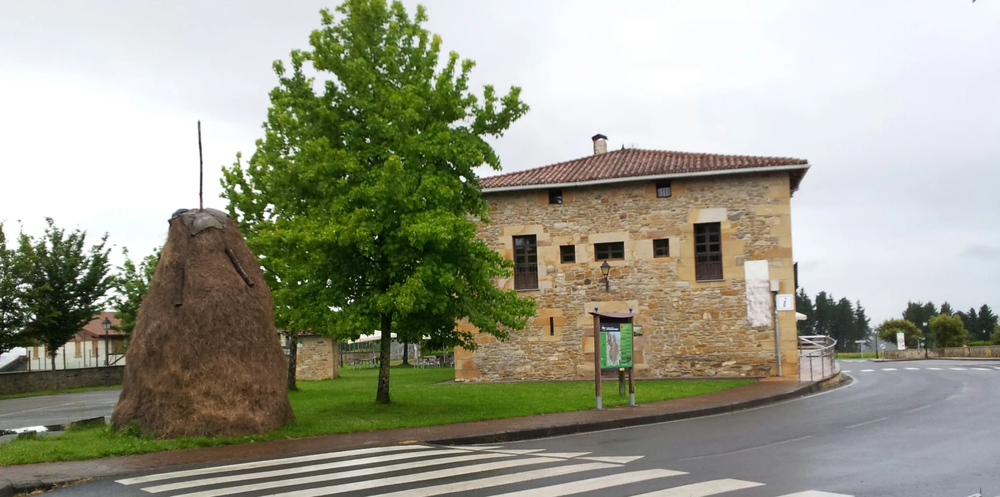

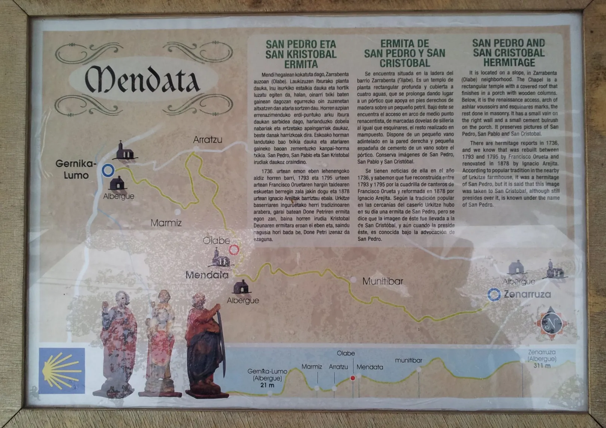

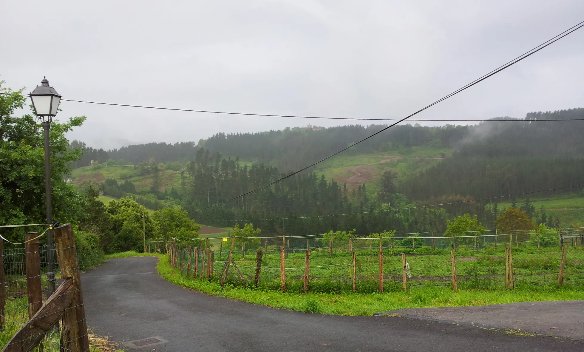

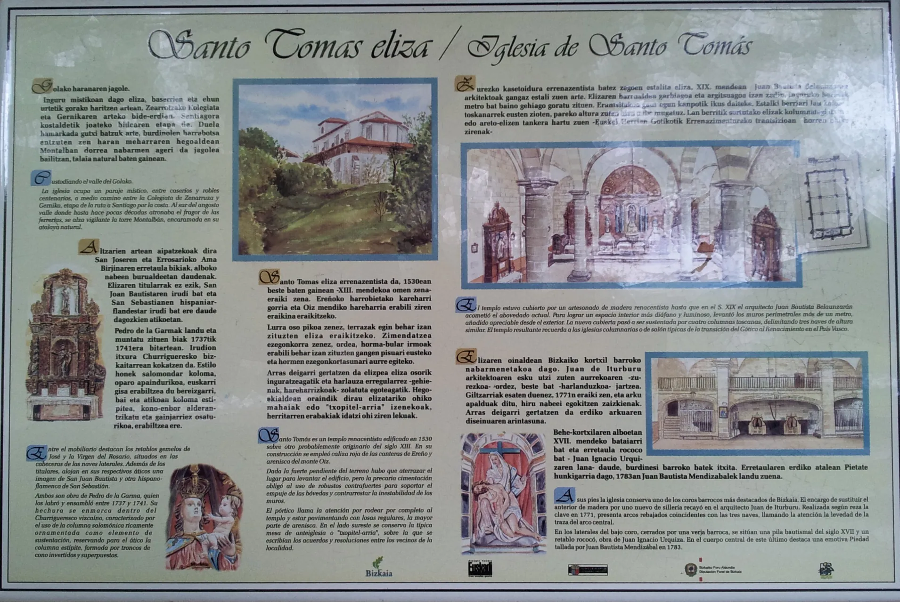

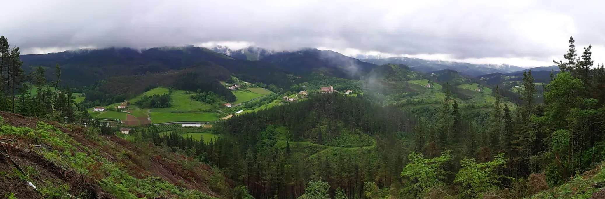

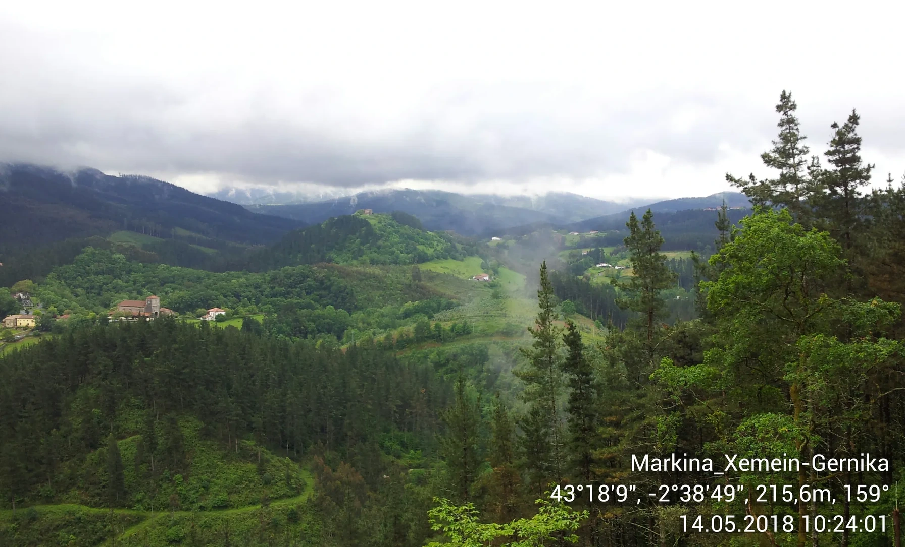

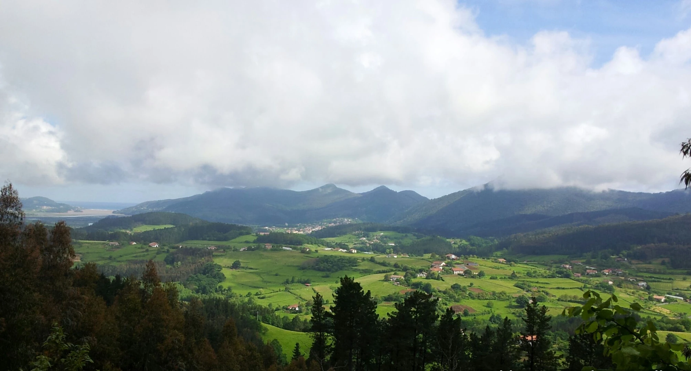

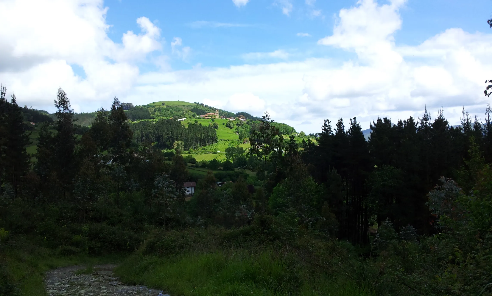

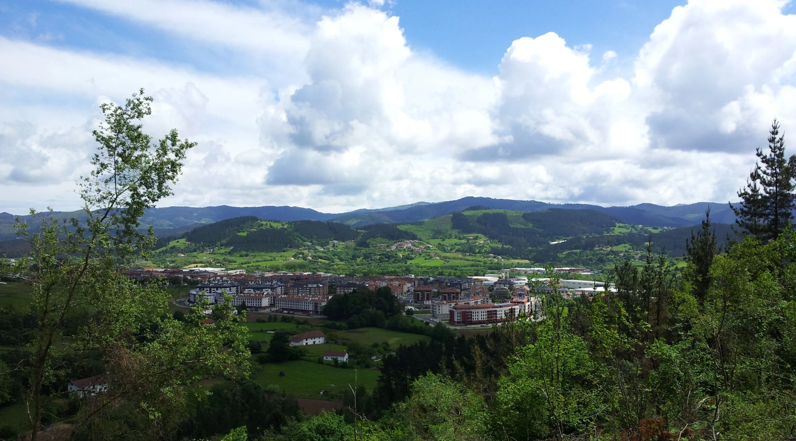

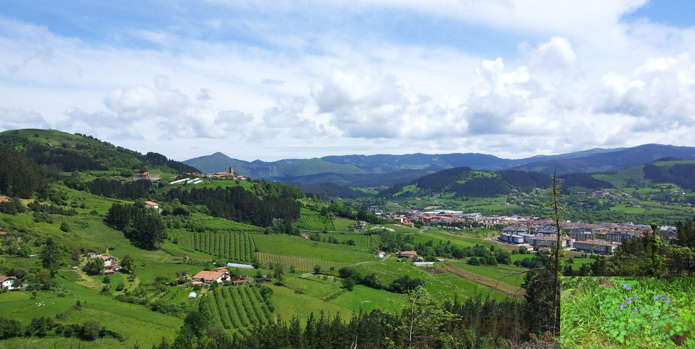

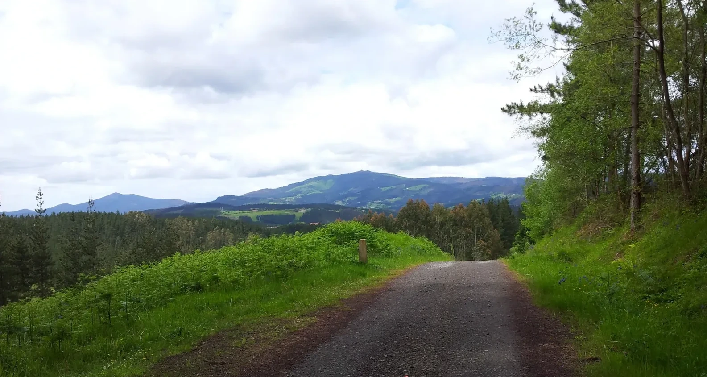
Ein Blick zurück

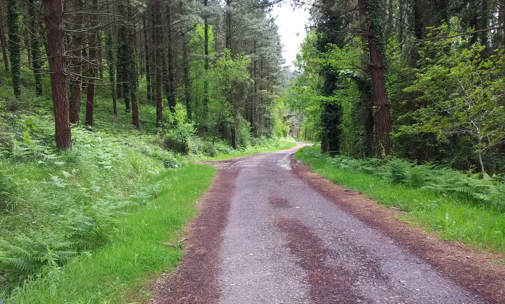

>Als ich diese gerade Strecke sah, dachte ich, dass der Weg fortan ohne Anstiege und Abstiege verlaufen würde, und freute mich darüber. Ich hatte mich geirrt. Etwas weiter vorne muss man nach links abbiegen, und der Weg war so rutschig, dass ich gezwungen war, meine Wanderstöcke voll einzusetzen, um nicht auszurutschen.

>Cuando vi ese tramo recto, pensé que a partir de ahí el camino discurriría sin subidas ni bajadas y me alegré. Me equivoqué. En algún punto más adelante hay que girar a la izquierda y el sendero estaba tan resbaladizo que me vi obligado a sacar el máximo partido a los bastones de senderismo para no resbalar.

>Quando vi este troço reto, pensei que, a partir daqui, o caminho decorreria sem subidas nem descidas e fiquei contente. Enganei-me. Um pouco mais à frente, é preciso virar à esquerda e o trilho estava tão escorregadio que me vi obrigado a tirar o máximo partido dos bastões de caminhada para não escorregar.

>When I saw this straight stretch, I thought that from here on the path would be flat, with no uphill or downhill sections, and I was pleased. I was wrong. A little further on, you have to turn left, and the path was so slippery that I had to make the most of my walking poles to avoid slipping.

---

In der Herberge Larrabetzu habe ich mich sehr wohl gefühlt; es ist nicht viel passiert.
Was mir besonders gefallen hat, war die Erinnerung an meinen Schlafplatz mit Blick nach draußen.

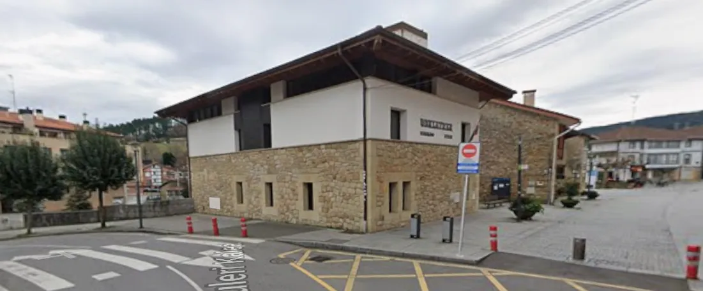
Googlemaps-Foto

No albergue Larrabetzu senti-me muito bem; não aconteceu grande coisa.
O que mais gostei foi a recordação do meu lugar para dormir, com vista para o exterior.

---

  

🇬🇧
🇪🇸
🇵🇹
🇩🇪

---
Nur die Link-Einfügung wurde von "git status" nicht als  Änderung wahrgenommen.

**↪** [Etappe-07_Larrabetzu_Portugalete](Etappe-07_Larrabetzu_Portugalete.md)

 🔁 [Camino-del-Norte_Etapas](Camino-del-Norte_Etapas.md)
 

 ...→