## Camino del Norte  2018

### Etappe-06: Larrabetzu → Portugalete (13 + 11 + ?  Km)
15  Mai 2018

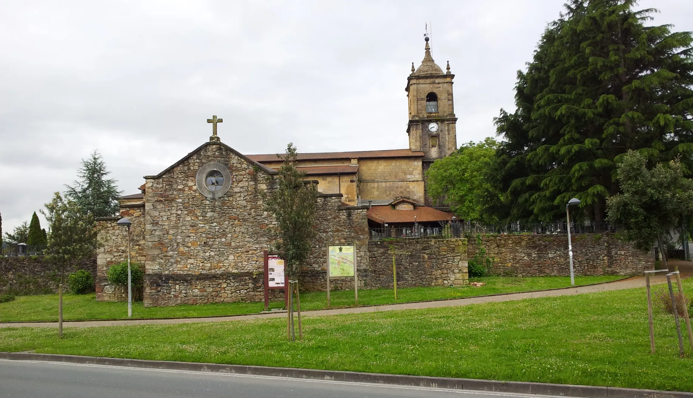

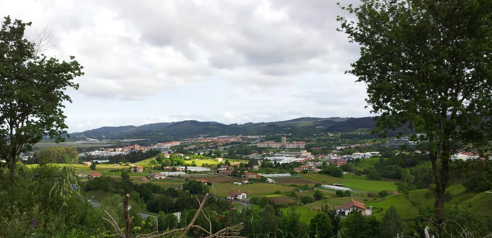

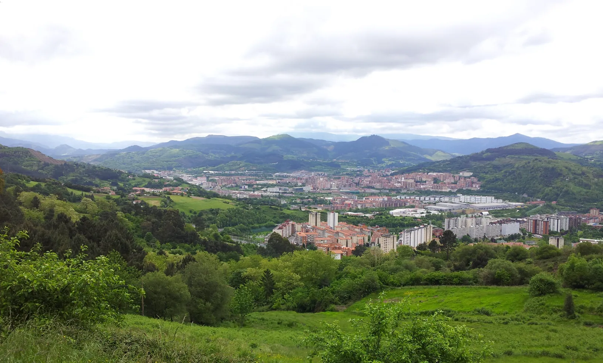

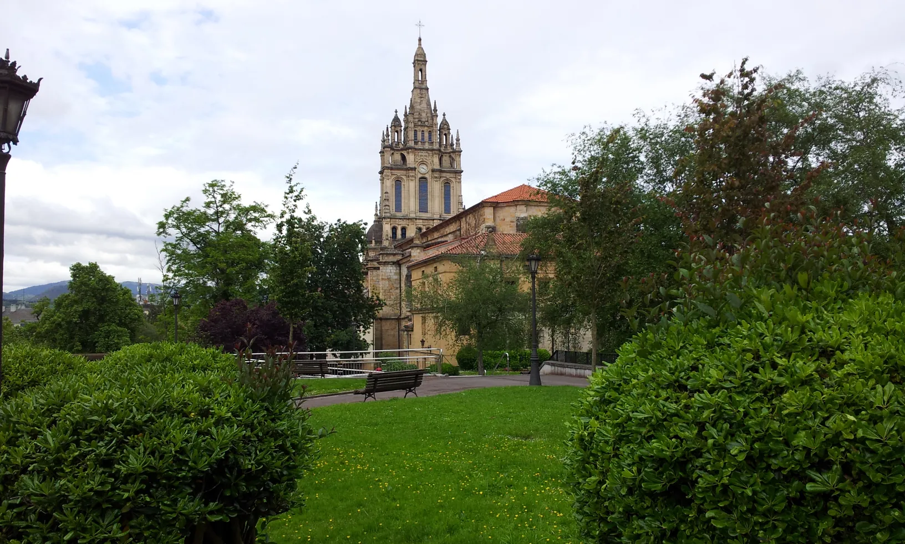

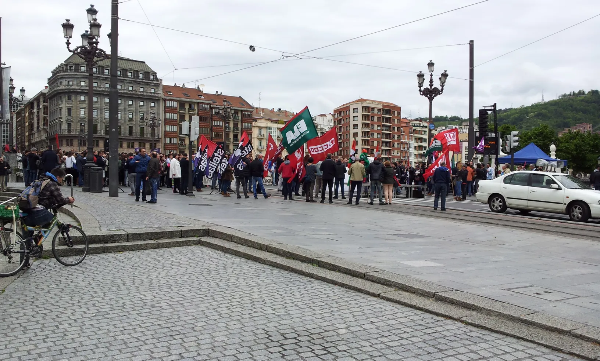

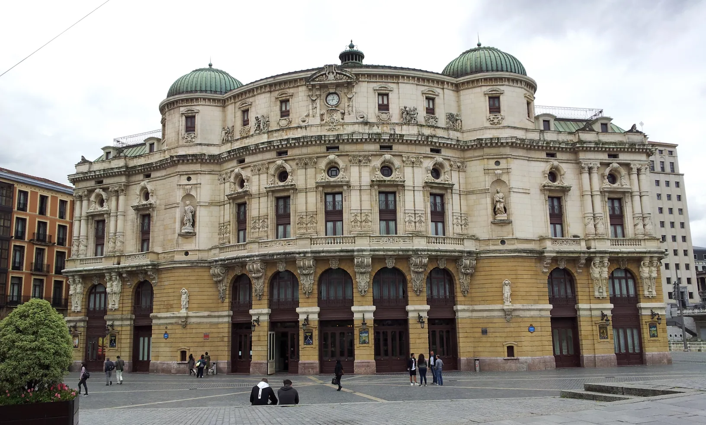

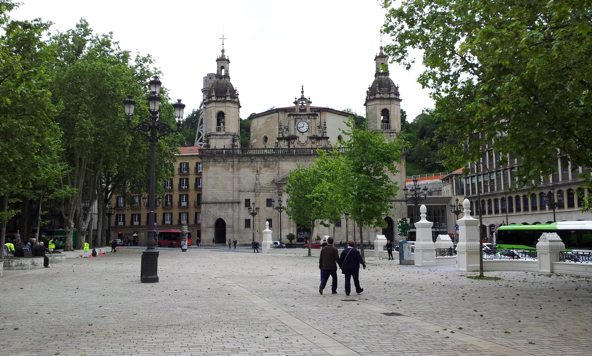

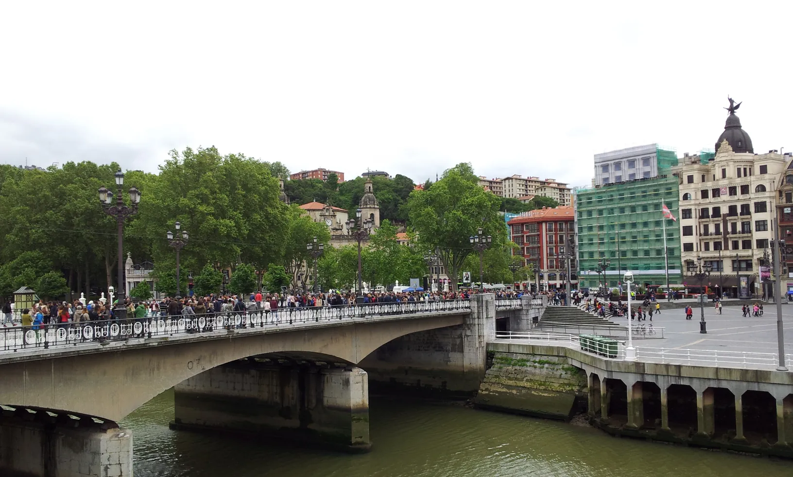

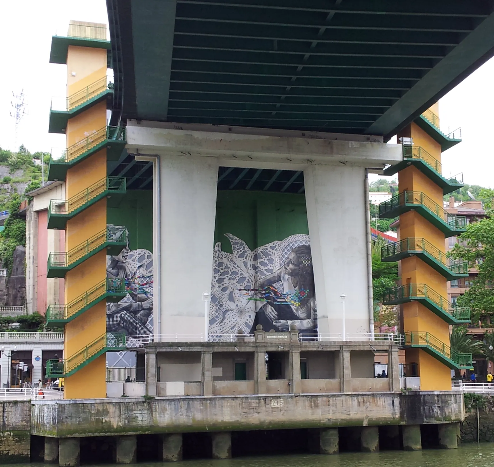

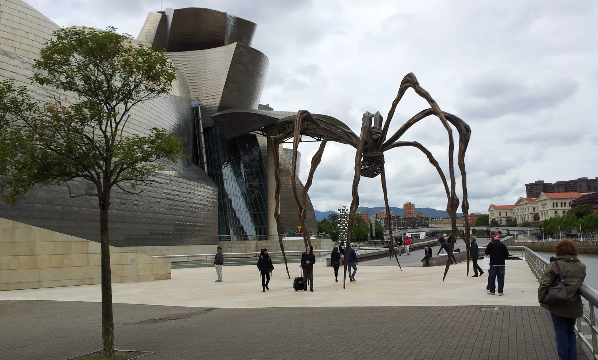

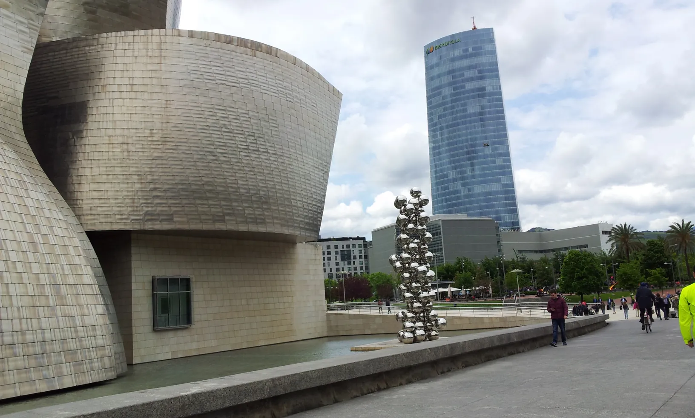

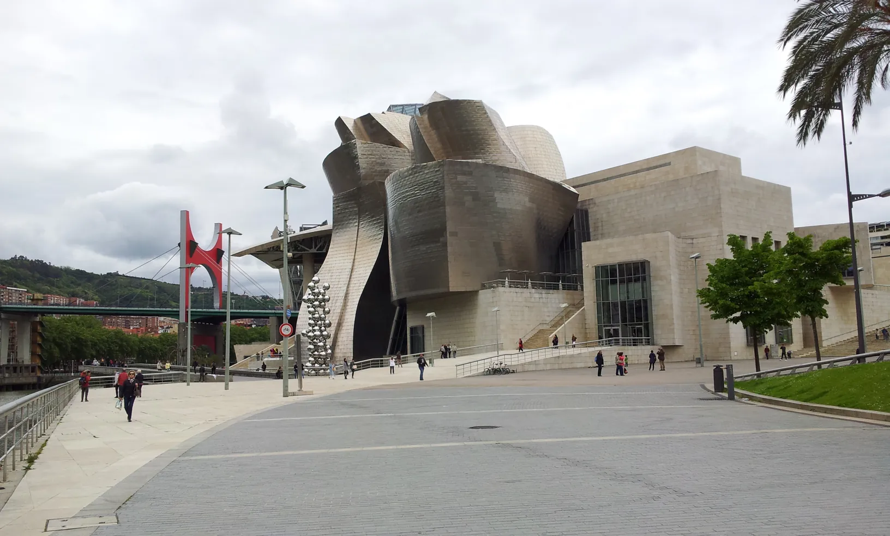

---
#### "Ramón de la Sota Kaia"

Etwa ab hier soll man überlegen zu Albergue de Peregrinos de Bilbao  abzubiegen, danach ist es zu spät. Ich glaube die Albergue liegt da oben auf dem Hügel.

Mais ou menos a partir daqui, deve-se pensar em virar para o Albergue de Peregrinos de Bilbao; depois, será tarde demais. Acho que o albergue fica ali em cima, na colina.

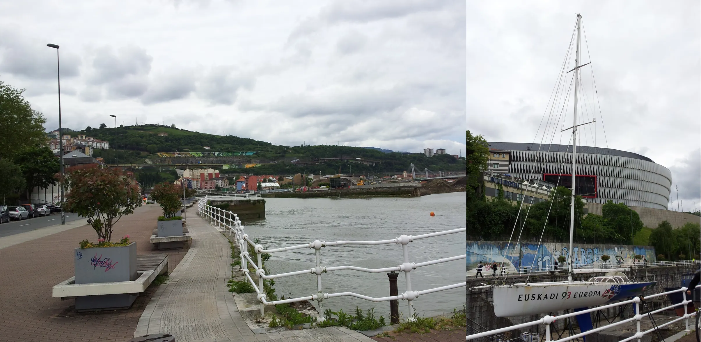

From about here, you should start thinking about turning off towards the Albergue de Peregrinos de Bilbao; after that, it’ll be too late. I think the albergue is up there on the hill.

Más o menos a partir de aquí hay que pensar en desviarse hacia el Albergue de Peregrinos de Bilbao; después ya es demasiado tarde. Creo que el albergue está ahí arriba, en la colina.

---
### ⚓ "BBK Euskadi Europa 1992/1993" & José Luis Ugarte

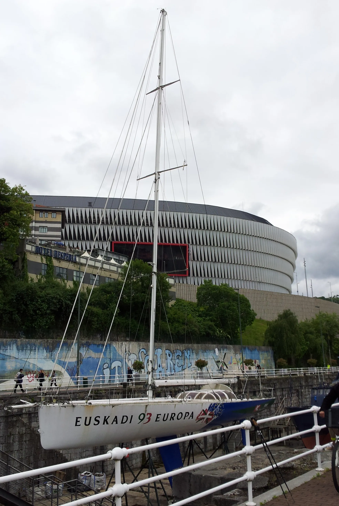

🇩🇪 Im Jahr 2018, während meiner Wanderung auf dem Jakobsweg, dem „Caminho do Norte“, fotografierte ich am „Ramón de la Sota Kaia“ ein Segelboot mit der Aufschrift „Euskadi 93 Europa“. Es handelt sich um das Segelboot, das 1992/1993 an der Regatta teilgenommen hatte. Wie mir ein vorbeifahrender Herr erklärte, hatte ein über sechzigjähriger baskischer Seemann das Segelboot, das vor mir lag, in Frankreich erworben und anschließend allein und unter extremen Bedingungen die Welt umsegelt, obwohl er zuvor nur ein einfacher Seemann gewesen war.

- **Welche Informationen gibt es zu diesem Thema?**

> Der Text auf Spanisch, Englisch, Deutsch, Portugiesisch und auch auf Baskisch, um diese Leistung in der Sprache des Seemanns zu würdigen.

**José Luis Ugarte, eine Legende**

#### Die Legende der Vendée Globe 1992/1993

Am Kai Ramón de la Sota Kaia in Bilbao liegt ein geschichtsträchtiges Denkmal der Segelgeschichte: die BBK Euskadi Europa  Mit dieser 60-Fuß-Aluminiumjacht bestritt der baskische Seemann José Luis Ugarte (1928–2008) im Alter von 64 Jahren die _Vendée Globe 1992/1993_ – die härteste Einhand-Regatta der Welt: nonstop, allein und ohne fremde Hilfe um den Globus "Itsasmuseum Bilbao". Obwohl er das Rennen nicht gewann, wurde sein 6. Platz wie ein historischer Sieg gefeiert . Von 14 gestarteten Booten erreichten damals sturmbedingt nur 7 das Ziel Foro Sony Alpha.

> #### Extremsituationen auf See
> 
> - Lebensgefahr durch Leckagen: Im eisigen Südpolarmeer (50° Süd) erlitt das Boot einen schweren Wassereinbruch, der Ugarte am Überleben zweifeln ließ Foro Sony Alpha.
> - Menschliche Tragödien: Zwei seiner Mitstreiter kamen während der Regatta in den Stürmen ums Leben Foro Sony Alpha.
> - Hunger & psychischer Kollaps: Wegen Nahrungsmangels entging er nur knapp dem Verhungern. Eine siebentägige, absolute Flaute am Äquator brachte ihn psychisch an den Rand des Wahnsinns Foro Sony Alpha.
> - Zerstörtes Material: Nach 134 Tagen erreichte er den Zielhafen mit einer komplett in Fetzen gerissenen Großsegel-Konstruktion RCMA-RSC. Seine Worte nach der Ankunft: _"Ich war nicht so stark, wie ich dachte. Es ist eine inhumane Prüfung."_ Foro Sony Alpha

---
---

🇪🇸 En 2018, durante mi peregrinación por el Camino de Santiago, el «Caminho do Norte», fotografié en el «Ramón de la Sota Kaia» un velero con la inscripción «Euskadi 93 Europa». Se trata del velero que participó en la regata de 1992/1993. Según me explicó un señor que pasaba por allí, un marinero vasco de más de sesenta años había comprado en Francia el velero que tenía delante y, a continuación, había dado la vuelta al mundo en solitario y en condiciones extremas, a pesar de que antes no había sido más que un simple marinero.

- **¿Qué información hay al respecto?**

>El texto en español, inglés, alemán, portugués y también en euskera, para rendir homenaje a esta hazaña en la lengua del marinero.

José Luis Ugarte, una leyenda

#### La leyenda de la Vendée Globe 1992/1993

En el muelle Ramón de la Sota Kaia de Bilbao descansa un auténtico monumento de la navegación transoceánica: el BBK Euskadi Europa Itsasmuseum Bilbao. A bordo de este velero de aluminio de 60 pies, el marino vasco José Luis Ugarte (1928–2008) afrontó con 64 años la _Vendée Globe 1992/1993_ RCMA-RSC, la regata en solitario, sin escalas ni asistencia más dura del planeta Itsasmuseum Bilbao. Aunque no ganó la competición, su 6º puesto fue una gesta heroica 24h-en-Piste: de 14 barcos que zarparon, las tormentas brutales obligaron a retirarse a la mitad, logrando terminar solo 7 Foro Sony Alpha.

> #### Situaciones extremas en el mar
> 
> - Vía de agua bajo los 50° Sur: En las hostiles aguas antárticas, el barco sufrió una grave inundación que hizo a Ugarte confrontar directamente la posibilidad de la muerte Foro Sony Alpha.
> - Tragedia entre compañeros: Dos regatistas perdieron la vida en el océano durante esa misma edición Foro Sony Alpha.
> - Hambre y tortura psicológica: La escasez de víveres lo llevó al límite físico, mientras que una calma total de viento durante siete días en el Ecuador estuvo a punto de romperlo psicológicamente Foro Sony Alpha.
> - Llegada al límite: Tras 134 días en el mar, entró a Les Sables-d'Olonne con la vela mayor hecha jirones RCMA-RSC. Al abrazar a su esposa, pronunció su famosa frase: _"No era tan fuerte como creía. Es una prueba inhumana."_ Foro Sony Alpha

---
---
🇬🇧 In 2018, whilst walking the Way of St James, the ‘Caminho do Norte’, I took a photograph at the ‘Ramón de la Sota Kaia’ of a sailing boat bearing the inscription ‘Euskadi 93 Europa’. This is the sailing boat that took part in the regatta in 1992/1993. As a gentleman passing by explained to me, a Basque sailor in his sixties had bought the sailing boat lying before me in France and subsequently sailed round the world alone and under extreme conditions, even though he had previously been nothing more than an ordinary sailor. 

- **What information is available on this subject?**

>The text in Spanish, English, German, Portuguese and also in Basque, to pay tribute to this achievement in the sailor’s own language.

José Luis Ugarte, a legend

#### The Legend of the 1992/1993 Vendée Globe

Moored at the Ramón de la Sota Kaia in Bilbao is a legendary vessel of modern maritime history: the BBK Euskadi Europa Itsasmuseum Bilbao. In this 60-foot aluminum racing yacht, the Basque sailor José Luis Ugarte (1928–2008), at the age of 64, took part in the _1992/1993 Vendée Globe_ RCMA-RSC – the ultimate single-handed, non-stop round-the-world race without assistance "Itsasmuseum Bilbao". While he did not win, his 6th-place finish was celebrated as an incredible triumph 24h-en-Piste. Due to extreme weather, only 7 out of 14 competing boats managed to reach the finish line Foro Sony Alpha.

>#### Extreme Situations at Sea
> 
> - Near Sinking at 50° South: In the freezing Southern Ocean, a severe hull leak caused major flooding, leaving Ugarte staring death in the face Foro Sony Alpha.
> - Loss of Competitors: Two fellow sailors tragically lost their lives during the violent storms of this edition Foro Sony Alpha.
> - Starvation & Mental Toll: Suffering from severe food shortages, he faced starvation. Later, being trapped for seven days in absolute windlessness at the Equator pushed him to a psychological breaking point Foro Sony Alpha.
> - Battered Ship: After 134 days at sea, he crossed the finish line with his mainsail completely torn to shreds RCMA-RSC. Upon arrival, he stated: _"I wasn't as strong as I thought. It is an inhuman test."_ Foro Sony Alpha

---
---
🇵🇹  Em 2018, durante a minha caminhada pelo Caminho de Santiago, o «Caminho do Norte», fotografei no «Ramón de la Sota Kaia» um veleiro com a inscrição «Euskadi 93 Europa». Trata-se do veleiro que participou na regata em 1992/1993. Como me explicou um senhor que passava por ali, um marinheiro basco com mais de sessenta anos tinha adquirido na França o veleiro que se encontrava à minha frente e, posteriormente, deu a volta ao mundo sozinho e em condições extremas, apesar de, anteriormente, ter sido apenas um simples marinheiro. 

- **Que informações existem sobre este assunto?**

>O texto em espanhol, inglês, alemão, português e também em basco, para homenagear este feito na língua do marinheiro.

José Luis Ugarte, uma lenda 

#### A Lenda da Vendée Globe 1992/1993

No cais Ramón de la Sota Kaia, em Bilbau, encontra-se um verdadeiro monumento da história da navegação: o BBK Euskadi Europa Itsasmuseum Bilbao. A bordo deste iate de alumínio de 60 pés, o marinheiro basco José Luis Ugarte (1928–2008), com 64 anos de idade, enfrentou a _Vendée Globe 1992/1993_ RCMA-RSC – a regata à volta do mundo em solitário, sem escalas e sem assistência mais dura do planeta Itsasmuseum Bilbao. Embora não tenha vencido a competição, o seu 6.º lugar foi uma conquista histórica 24h-en-Piste: dos 14 barcos que partiram, apenas 7 sobreviveram às tempestades e chegaram ao fim Foro Sony Alpha.

>#### Situações Extremas no Mar
> 
> - Risco de Naufrágio aos 50° Sul: Nas águas congelantes do oceano Antártico, o barco sofreu uma grave entrada de água que fez Ugarte temer seriamente pela vida Foro Sony Alpha.
> - Tragédia Humana: Dois dos seus companheiros de regata morreram no mar devido às violentas tempestades daquela edição Foro Sony Alpha.
> - Fome e Esgotamento Mental: A escassez de alimentos quase o levou à inanição. Além disso, uma calmaria total de sete dias no Equador deixou-o à beira do colapso psicológico Foro Sony Alpha.
> - Barco Destroçado: Após 134 dias no mar, alcançou a meta com a vela grande completamente rasgada em farrapos RCMA-RSC. As suas palavras ao chegar foram: _"Eu não era tão forte quanto pensava. É uma prova desumana."_ Foro Sony Alpha

---
---
🇪🇭  2018an, Santiago Bidea, 'Caminho do Norte' ibiliz, 'Ramón de la Sota Kaia' kaian itsasontzi bat argazkian harrapatu nuen, 'Euskadi 93 Europa' inskripzioa zuena. Hau da 1992/1993ko regatatan parte hartu zuen itsasontzia. Pasatzen ari zen jaun batek azaldu zidanenez, 60 urte inguruko euskal itsasontzi batek erosi zuen Frantzian zegoen itsasontzia eta ondoren bakarrik eta baldintza gogorretan munduari buelta eman zion, nahiz eta aurretik arrunt itsasontzi bat baino ez izan. 

- **Zein informazio dago gai honi buruz?**

Nire Obsidian/GitHub-i buruzko mezuko testua gaztelaniaz, ingelesez, alemanez, portugesez eta baita euskaraz ere, itsasgizonaren hizkuntzan lorpen honi omenaldi gisa.

José Luis Ugarte, legenda bat

####  1992/1993ko Vendée Globe-ko kondaira

Bilboko Ramón de la Sota Kaian itsas historiaren monumentu bikain bat dago ikusgai: BBK Euskadi Europa izeneko belaontzia Itsasmuseum Bilbao. 60 oineko aluminiozko ontzi honetan, Jose Luis Ugarte (1928–2008) getxoztar itsasgizonak, 64 urte zituela, _1992/1993ko Vendée Globe_ lasterketa mitikoan parte hartu zuen RCMA-RSC. Munduko bakarkako estropada gogorrena da hau: eskalarik gabe eta kanpoko laguntzarik gabe munduari bira ematea Itsasmuseum Bilbao. Lasterketa irabazi ez zuen arren, lortutako 6. postua garaipen historiko gisa ospatu zen Euskal Herrian 24h-en-Piste. Irteera hartu zuten 14 ontzietatik, ekaitz ikaragarrien ondorioz, 7 besterik ez ziren iritsi helmugara Foro Sony Alpha.

>#### Muturreko egoerak itsasoan
> 
> - Ur-sarrera eta itotzeko arriskua Hegoaldeko 50 gradutan: Antartikako ur hotzetan ontziak ur-sarrera larria jasan zuen; Ugartek heriotza oso gertu ikusi zuen une hartan Foro Sony Alpha.
> - Kideen tragedia: Lasterketa kide zituen bi marinel itsasoan hil ziren edizio hartako ekaitz ankerretan Foro Sony Alpha.
> - Gosea eta kolapso psikologikoa: Janari faltagatik goseak hiltzeko zorian egon zen. Geroago, Ekuatorean haizerik gabe zazpi egunez harrapatuta egoteak psikologikoki mugara eraman zuen Foro Sony Alpha.
> - Ontzia txikituta: Itsasoan 134 egun eman ondoren iritsi zen helmugara, bela nagusia zeharo zintzilik eta pildatuta zuela RCMA-RSC. Lurreratzean, emaztea besarkatu eta hitz hauek esan zituen: _"Ez nintzen uste bezain indartsua. Gizagabeko proba da hau."_ Foro Sony Alpha

---

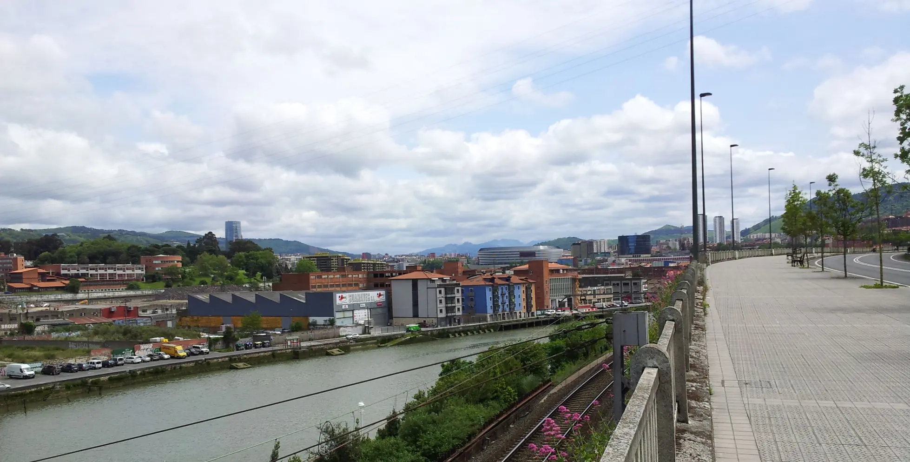

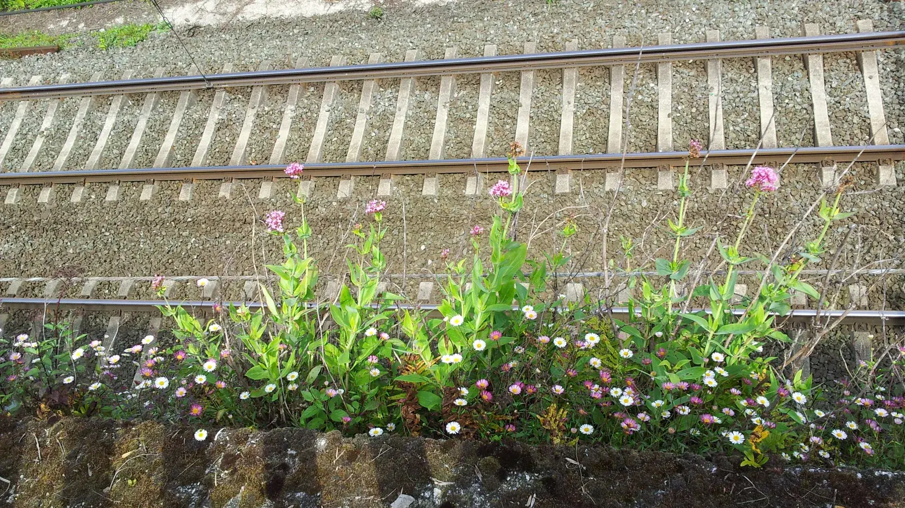

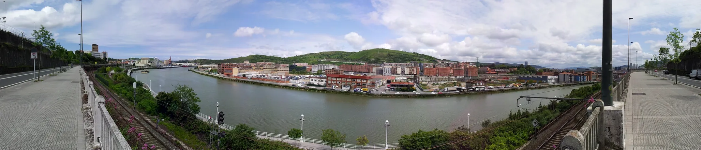

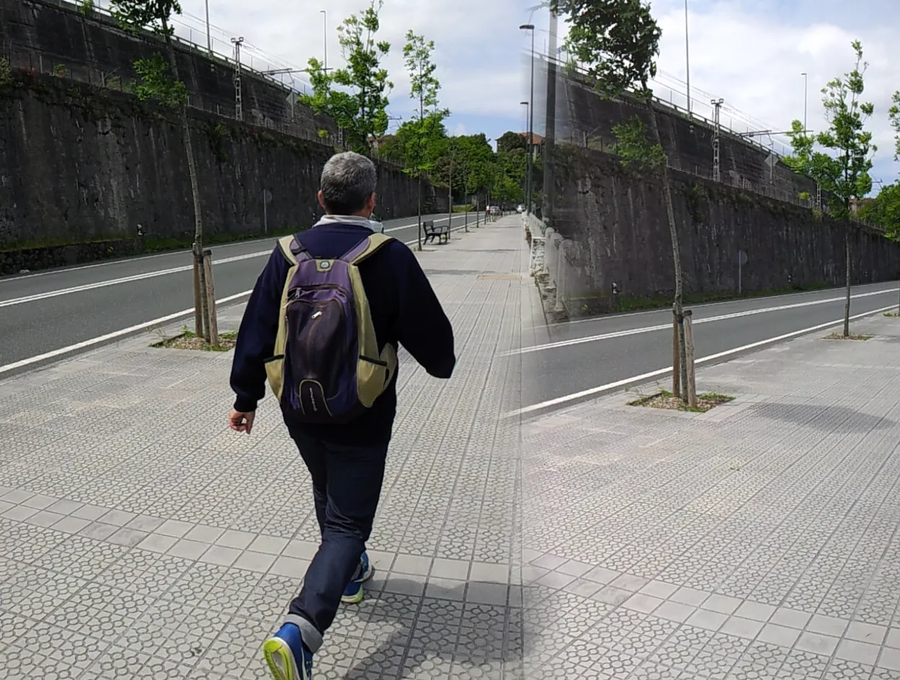

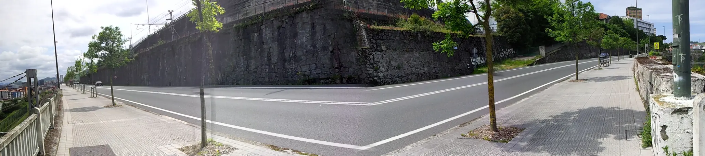

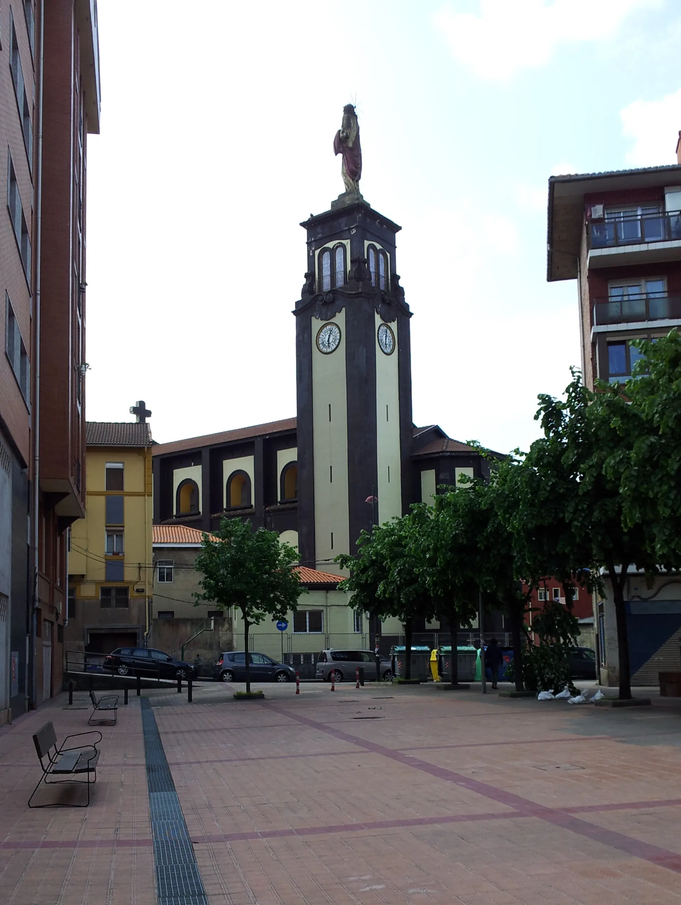

---

 🇩🇪  Bilbao war mein Ziel 

#### So war es nicht geplant 

Als ich morgens losgelaufen bin, hatte ich einen ganz anderen Plan. Doch die interessanten Dinge entlang der Flusspromenade lenkten mich ab, und so lief ich einfach immer weiter.

Als ich schließlich merkte, dass es keine 90°-Wendemöglichkeit zur Albergue von Bilbao gab, beschloss ich, bis nach Portugalete weiterzulaufen. 

Da ich auf dem Weg von Bilbao nach Portugalete nicht den gelben Pfeilen gefolgt war, lief ich in Portugalete über die Fußgängerbrücke einfach weiter.

Als ich dann merkte, dass ich von der Zeit her eigentlich schon ganz in der Nähe der Albergue sein musste, schaltete ich das GPS meines Handys ein – und musste feststellen, dass ich wieder zu weit gelaufen war. Zum Glück bemerkte ich es noch rechtzeitig. Sonst hätte ich wohl die Taschenlampe aus meinem Rucksack holen müssen, um im Dunkeln den Weg zur Albergue zu finden.

Mein Glück war, dass noch ein Bett frei war. Außerdem hatte ich mir bereits vor Portugalete ein Menü des Tages gegönnt. Das war eine gute Entscheidung, denn ich war inzwischen so müde, dass ich keine Lust mehr hatte, irgendwo nach einer Möglichkeit zum Essen zu suchen.

Ich habe nur noch geduscht und mich hingelegt.

Diese Strecke von etwa 28 km (?) war zwar nicht die längste meines Lebens, aber dieser Moment der völligen Erschöpfung, als ich in der Albergue ankam und mich darüber freute, dass noch ein Platz frei war, ist mir so lebendig in Erinnerung geblieben, dass ich ihn noch heute vor Augen habe.

---

🇵🇹 Bilbao era o meu destino 

####  Não era esse o plano 

Quando saí de manhã, tinha um plano completamente diferente. Mas as coisas interessantes ao longo do passeio junto ao rio foram-me distraindo, e acabei simplesmente por continuar a caminhar.

Quando percebi que não havia uma possibilidade de dar uma volta de 90° para chegar ao albergue de Bilbao, decidi continuar até Portugalete. Como, no caminho de Bilbao para Portugalete, não tinha seguido as setas amarelas, ao chegar a Portugalete atravessei a ponte pedonal e continuei a caminhar.

Quando percebi que, pelo tempo que já tinha caminhado, o albergue deveria estar muito perto, liguei o GPS do telemóvel – e descobri que tinha caminhado demasiado longe outra vez. Felizmente, percebi isso a tempo. Caso contrário, teria tido de tirar a lanterna da mochila para encontrar o caminho até ao albergue no escuro.

Tive a sorte de ainda haver uma cama livre. Além disso, já tinha comido um menu do dia antes de chegar a Portugalete. Foi uma boa decisão, porque estava tão cansado que já não tinha vontade de procurar um lugar onde pudesse comer.

Só tomei um duche e deitei-me.

Este percurso de cerca de 28 km não foi o mais longo da minha vida, mas aquele momento de total cansaço, quando cheguei ao albergue e fiquei feliz por ainda haver um lugar disponível, ficou tão vivo na minha memória que ainda hoje consigo vê-lo diante dos meus olhos.

---

 🇪🇸 Bilbao era mi destino 

#### No era así como estaba planeado 

Cuando salí a caminar por la mañana, tenía un plan completamente diferente. Pero las cosas interesantes que iba encontrando a lo largo del paseo junto al río me fueron distrayendo y, casi sin darme cuenta, seguí caminando.

Cuando me di cuenta de que no había ninguna posibilidad de dar un giro de 90° para llegar al albergue, decidí continuar hasta Portugalete. Como en el camino de Bilbao a Portugalete no había seguido las flechas amarillas, una vez en Portugalete crucé el puente peatonal y seguí caminando.

Cuando pensé que, por el tiempo que llevaba caminando, el albergue ya debía de estar muy cerca, encendí el GPS del teléfono. Entonces descubrí que, una vez más, me había pasado de largo. Por suerte, me di cuenta a tiempo. De lo contrario, habría tenido que sacar la linterna de la mochila para encontrar el camino al albergue en la oscuridad.

Tuve la suerte de que todavía quedara una cama libre. Además, antes de llegar a Portugalete me había permitido disfrutar de un menú del día. Fue una buena decisión, porque estaba tan cansado que ya no tenía ganas de buscar algún sitio donde comer.

Solo me duché y me acosté.

Este recorrido de unos 28 km no fue el más largo de mi vida, pero aquel momento de absoluto agotamiento, cuando llegué al albergue y me alegré de que todavía hubiera un sitio libre, ha quedado tan vivo en mi memoria que todavía hoy lo tengo delante de los ojos.

---

 🇬🇧  Bilbao Was My Destination 

####That Wasn't the Plan 

When I set off in the morning, I had a completely different plan. But the interesting things along the riverside promenade kept distracting me, and I simply carried on walking.

When I realized that there was no way to make a 90° turn toward the albergue, I decided to continue on to Portugalete. Since I had not followed the yellow arrows on the way from Bilbao to Portugalete, once I reached Portugalete I crossed the pedestrian bridge and simply kept walking.

When I realized that, judging by the time I had been walking, the albergue should already be very close, I switched on the GPS on my phone – only to discover that I had walked too far again. Luckily, I noticed it in time. Otherwise, I would have had to take the flashlight out of my backpack to find my way to the albergue in the dark.

I was lucky that there was still a bed available. I had also treated myself to a menú del día before reaching Portugalete. That turned out to be a good decision, because by then I was so tired that I had no desire to go looking for somewhere to eat.

I simply took a shower and went to bed.

This 28-kilometre (?) stretch was not the longest walk of my life, but that moment of complete exhaustion, when I arrived at the albergue and was so relieved that there was still a place available, has stayed so vivid in my memory that I can still picture it clearly today.

---

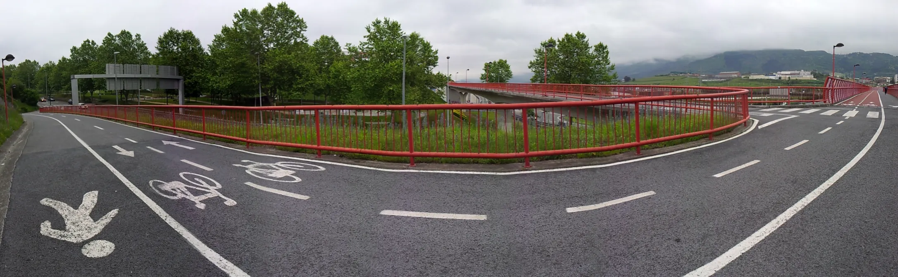

 ### ChatGPT-Version 
 

 🇪🇸  Bilbao era mi destino

#### 🇪🇸  No era así como estaba planeado

Cuando salí aquella mañana, tenía un plan completamente diferente. Pero poco a poco, las muchas cosas interesantes que encontraba a lo largo del paseo junto al río iban llamando mi atención. Lo que debía ser solo un pequeño desvío terminó convirtiéndose en un camino cada vez más largo. Y, en algún momento, simplemente seguí caminando, sin pensarlo demasiado.

Cuando finalmente me di cuenta de que ya no había ninguna posibilidad de girar 90° y volver hacia el albergue, decidí continuar hasta Portugalete.

En el camino de Bilbao a Portugalete no había seguido las flechas amarillas. Una vez en Portugalete, crucé el puente peatonal y seguí caminando. En algún momento pensé: ya no puede faltar mucho. Por el tiempo que llevaba caminando, el albergue tenía que estar muy cerca.

Entonces encendí el GPS del teléfono y descubrí que, una vez más, me había pasado de largo.

Por suerte, me di cuenta a tiempo. De lo contrario, probablemente habría tenido que sacar la linterna de la mochila para encontrar el camino al albergue en la oscuridad.

Finalmente llegó una buena noticia: todavía quedaba una cama libre.

Antes de llegar a Portugalete ya me había dado el gusto de disfrutar de un menú del día. Menos mal que lo hice, porque para entonces estaba tan cansado que no tenía ninguna gana de salir a buscar un lugar donde comer. Solo quería ducharme y acostarme.

Y eso fue exactamente lo que hice.

Los aproximadamente 28 kilómetros no fueron, desde luego, la distancia más larga que he recorrido en mi vida. Pero el cansancio que sentí en aquel momento, cuando finalmente llegué al albergue, fue algo especial. Y el alivio de descubrir que todavía había una cama libre quedó profundamente grabado en mi memoria.

Todavía hoy puedo recordar aquel momento con toda claridad, como si hubiera sucedido ayer. Todavía me veo llegando allí: cansado, agotado y simplemente feliz por haber encontrado un lugar donde dormir.

---
#### 🇵🇹 Não era este o plano – Bilbao era o meu destino

Quando saí naquela manhã, tinha um plano completamente diferente. Mas, pouco a pouco, os muitos detalhes interessantes ao longo do passeio junto ao rio foram-me prendendo a atenção. O que deveria ser apenas um pequeno desvio acabou por se transformar num caminho cada vez mais longo. E, a certa altura, simplesmente continuei a caminhar, sem pensar demasiado nisso.

Quando finalmente percebi que já não havia maneira de virar 90° e voltar para o albergue, decidi simplesmente continuar até Portugalete.

No caminho de Bilbao para Portugalete, não tinha seguido as setas amarelas. Ao chegar a Portugalete, atravessei a ponte pedonal e continuei a caminhar. A certa altura pensei: afinal, não deve faltar muito. Pelo tempo que já levava a caminhar, o albergue tinha de estar muito perto.

Liguei então o GPS do telemóvel – e descobri que, mais uma vez, tinha passado do lugar.

Felizmente, percebi isso a tempo. Caso contrário, teria provavelmente de tirar a lanterna da mochila para conseguir encontrar o caminho até ao albergue no escuro.

Finalmente, chegou uma boa notícia: ainda havia uma cama livre.

Antes de chegar a Portugalete, já me tinha oferecido um menu do dia. Ainda bem que o fiz, porque nessa altura estava tão cansado que já não tinha a mínima vontade de procurar um lugar para comer. Só queria tomar um duche e deitar-me.

E foi exatamente isso que fiz.

Os cerca de 28 quilómetros não foram, certamente, a distância mais longa que percorri na vida. Mas o cansaço que senti naquele momento, quando finalmente cheguei ao albergue, foi algo especial. E o alívio de saber que ainda havia uma cama livre ficou profundamente gravado na minha memória.

Ainda hoje consigo recordar aquele momento com toda a clareza, como se tivesse acontecido ontem. Vejo-me a chegar ali – cansado, exausto e simplesmente feliz por ter encontrado um lugar onde pudesse dormir.

---
 #### 🇩🇪 So war es nicht geplant – Bilbao war mein Ziel

Als ich an diesem Morgen losging, hatte ich einen ganz anderen Plan. Doch schon bald ließen mich die vielen interessanten Eindrücke entlang der Flusspromenade immer wieder innehalten. Aus einem kurzen Abstecher wurde ein längerer Weg – und irgendwann lief ich einfach weiter, ohne noch groß darüber nachzudenken.

Als mir schließlich klar wurde, dass es keine Möglichkeit mehr gab, um 90° abzubiegen und zur Albergue zurückzukehren, beschloss ich, einfach bis nach Portugalete weiterzulaufen.

Auf dem Weg von Bilbao nach Portugalete hatte ich mich nicht an die gelben Pfeile gehalten. In Portugalete angekommen, überquerte ich die Fußgängerbrücke und ging weiter. Irgendwann dachte ich: So weit kann es doch eigentlich nicht mehr sein. Nach der Zeit, die ich inzwischen unterwegs war, musste die Albergue ganz in der Nähe sein.

Also schaltete ich das GPS meines Handys ein – und stellte fest, dass ich schon wieder zu weit gelaufen war.

Zum Glück bemerkte ich es noch rechtzeitig. Sonst hätte ich wohl im Dunkeln die Taschenlampe aus meinem Rucksack holen müssen, um überhaupt noch den Weg zur Albergue zu finden.

Dann endlich die nächste gute Nachricht: Es gab noch ein freies Bett.

Schon vor Portugalete hatte ich mir ein Menü des Tages gegönnt. Zum Glück, denn inzwischen war ich so müde, dass ich keinerlei Lust mehr hatte, noch irgendwo nach einer Möglichkeit zum Essen zu suchen. Ich wollte nur noch duschen und mich hinlegen.

Und genau das tat ich auch.

Die etwa 28 Kilometer (?) waren sicherlich nicht die längste Strecke, die ich in meinem Leben gelaufen bin. Aber die Müdigkeit, die mich in diesem Moment überkam, als ich endlich die Albergue erreichte, war etwas Besonderes. Und die Erleichterung darüber, dass tatsächlich noch ein Bett frei war, hat sich tief in meine Erinnerung eingeprägt.

Dieser Augenblick ist bis heute so lebendig geblieben, als wäre es erst gestern gewesen. Ich sehe mich noch dort ankommen – müde, erschöpft und einfach nur glücklich, einen Platz zum Schlafen gefunden zu haben.

---
#### 🇬🇧 That Wasn't the Plan – Bilbao Was My Destination

When I set off that morning, I had a completely different plan. But little by little, all the interesting things along the riverside promenade kept catching my attention. What was supposed to be just a short detour gradually turned into a much longer walk. And at some point, I simply kept going, without thinking too much about it.

When I finally realized that there was no longer any way to make a 90° turn and head back toward the albergue, I decided to continue all the way to Portugalete.

On the way from Bilbao to Portugalete, I had not followed the yellow arrows. Once I reached Portugalete, I crossed the pedestrian bridge and continued walking. At some point I thought: It can't be much farther now. Judging by how long I had already been walking, the albergue had to be very close.

So I switched on the GPS on my phone – only to discover that, once again, I had walked too far.

Luckily, I noticed it in time. Otherwise, I would probably have had to take the flashlight out of my backpack to find my way to the albergue in the dark.

Finally, some good news: there was still a bed available.

Before reaching Portugalete, I had already treated myself to a menú del día. Thank goodness I had, because by then I was so tired that I had absolutely no desire to go looking for somewhere to eat. All I wanted was to take a shower and lie down.

And that is exactly what I did.

The roughly 28 kilometres were certainly not the longest distance I have ever walked. But the exhaustion I felt at that moment, when I finally reached the albergue, was something special. And the relief of discovering that there was still a bed available has stayed deeply etched in my memory.

Even today, I can remember that moment with complete clarity, as if it had happened only yesterday. I can still see myself arriving there – tired, exhausted, and simply happy to have found a place to sleep.

- **Albergue Bide Ona em Portugalete**

---

  

🇬🇧
🇪🇸
🇵🇹
🇩🇪

---

**↪** [Etappe-08_Portugalete_Pubeña](Etappe-08_Portugalete_Pubeña.md)

 🔁 [Camino-del-Norte_Etapas](Camino-del-Norte_Etapas.md)
 

 ...→