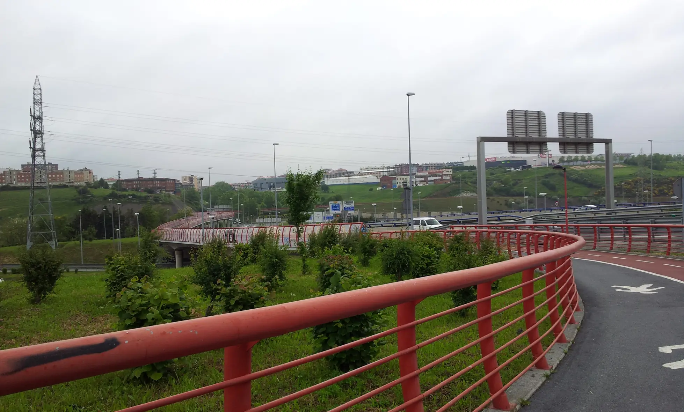
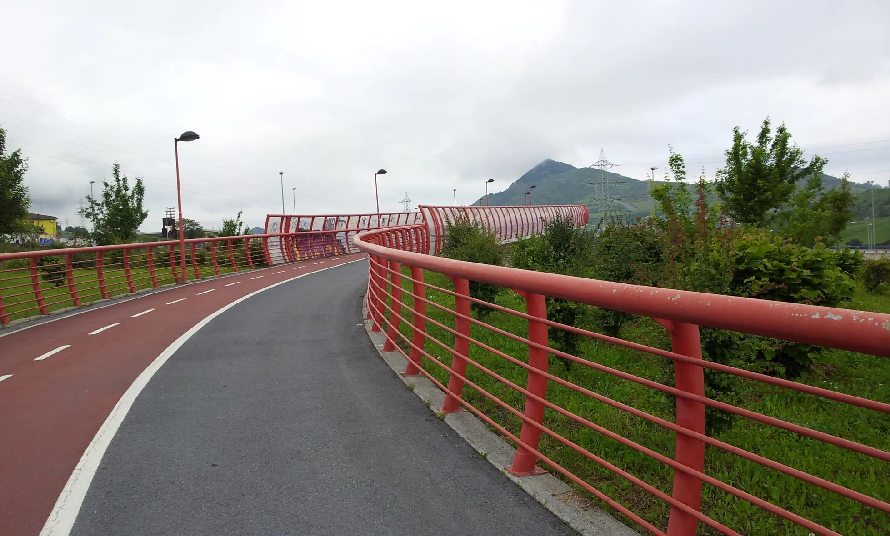
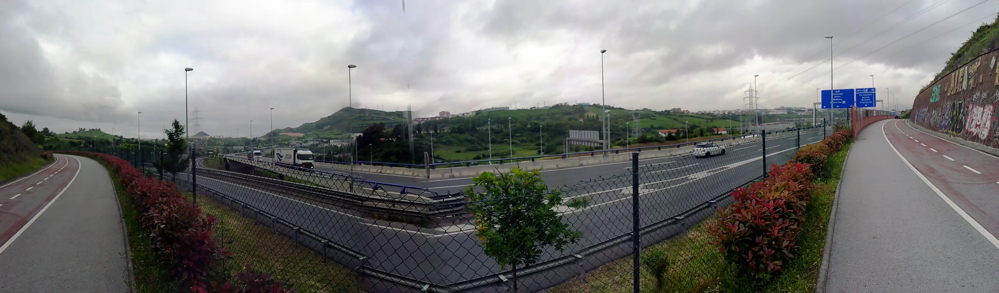
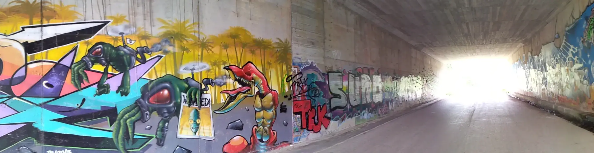
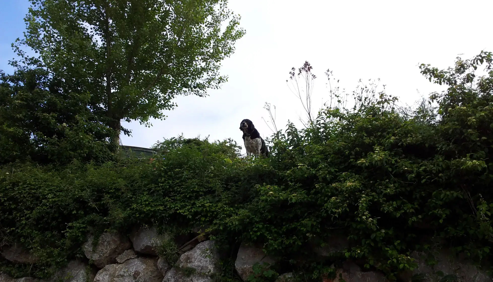
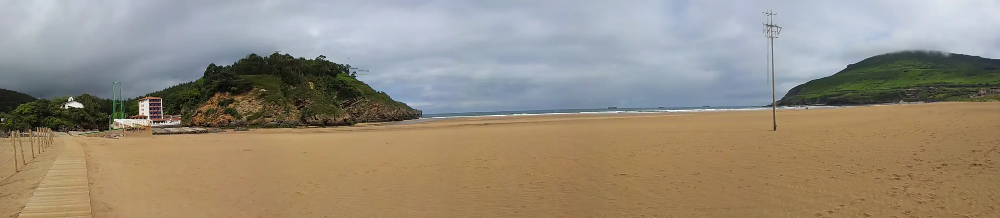
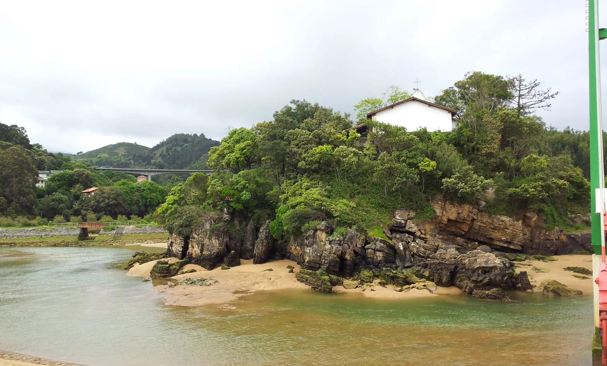
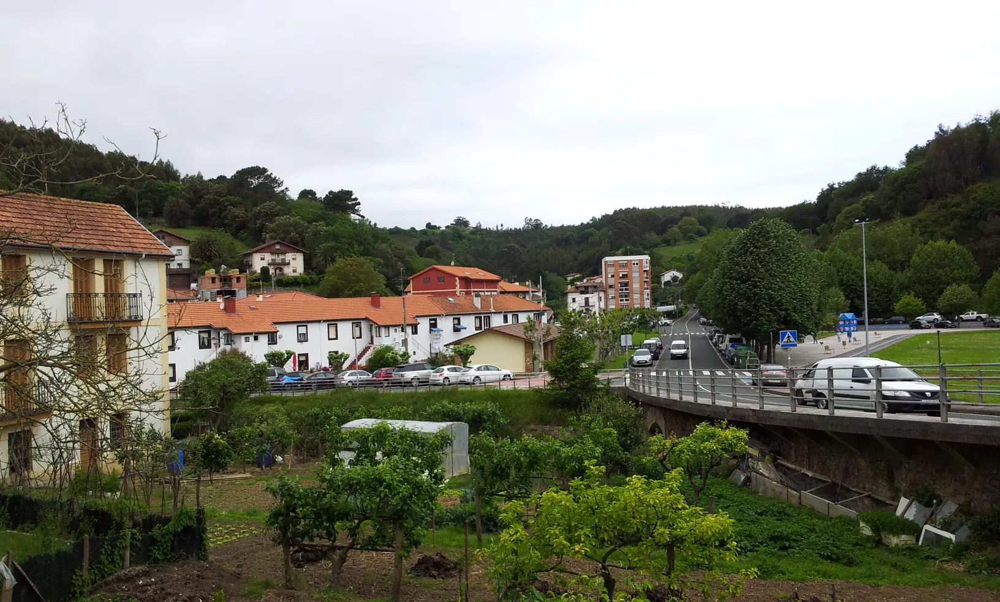

## Camino del Norte  2018

### Etappe-08: Portugalete →  Pubeña (  Km)
16  Mai 2018

**↑** A look back ⁘ Una vista atrás  ⁘ Ein Blick zurück ⁘ Uma olhar para trás **↑**

---
**↓**  Hier entlang, bitte ⁘ Por aqui, por favor ⁘ This way, please  ⁘  Por aquí, por favor **↓** 

---

- No hay nada más interesante que ver pasar a los peregrinos. Seguro que le encantaría dejar atrás el mundo de su jardín y simplemente ponerse a caminar.

- Não há nada mais interessante do que ver os peregrinos a passar. De certeza que adoraria deixar para trás o mundo do seu jardim e simplesmente pôr-se a caminhar.

- Es gibt nichts Faszinierenderes, als den Pilgern zuzusehen, wie sie vorbeiziehen. Ich bin mir sicher, dass er am liebsten die Welt seines Gartens hinter sich lassen und sich einfach auf Wanderschaft begeben würde.

- There’s nothing more fascinating than watching the pilgrims go by. I’m sure he’d love to leave the world of his garden behind and just set off on a walk.

---

---

 

- **The single-storey hous:** View of the Albergue in Pubeña
- **Das Einzelgeschosshaus:**  Blick auf die Herberge in Pubeña
- **La casa de una sola planta** : Vista del albergue de Pubeña
- **A casa térrea:** Vista do albergue em Pubeña

---

  

🇬🇧
🇪🇸
🇵🇹
🇩🇪

---

**↪** [Etappe-09](Etappe-09.md)

 🔁 [Camino-del-Norte_Etapas](Camino-del-Norte_Etapas.md)
 

 ...→