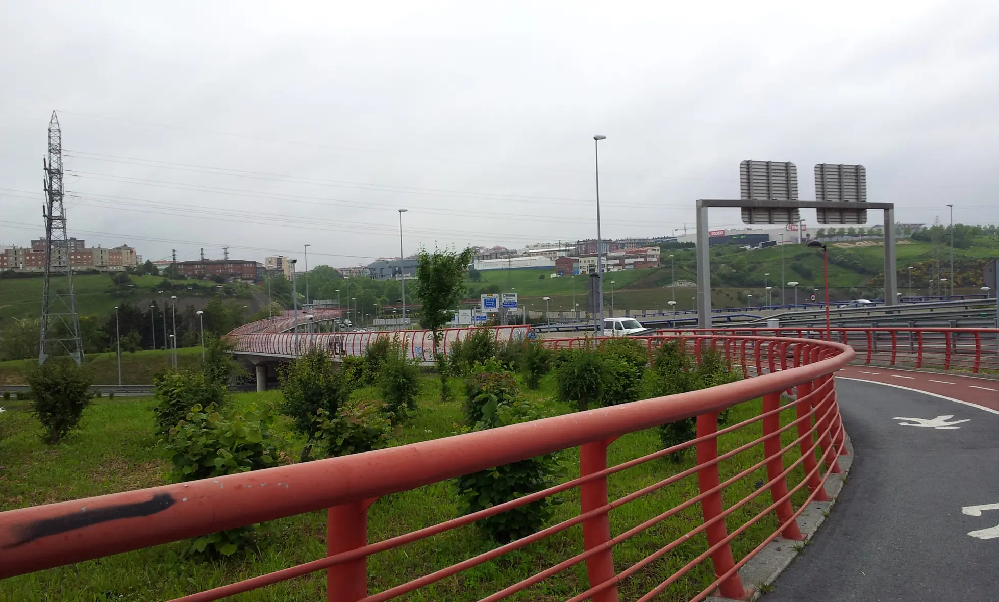
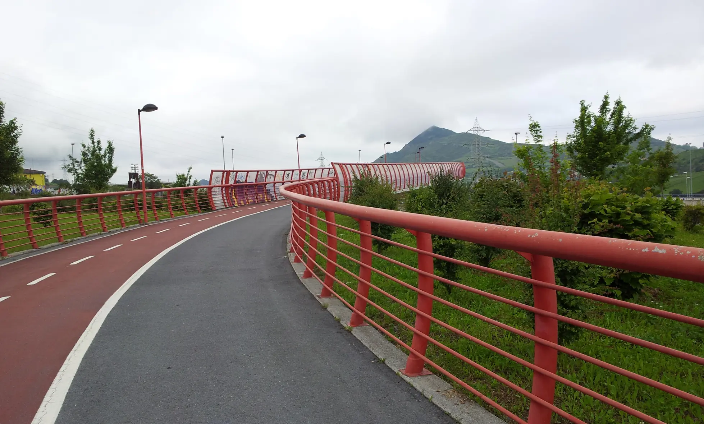
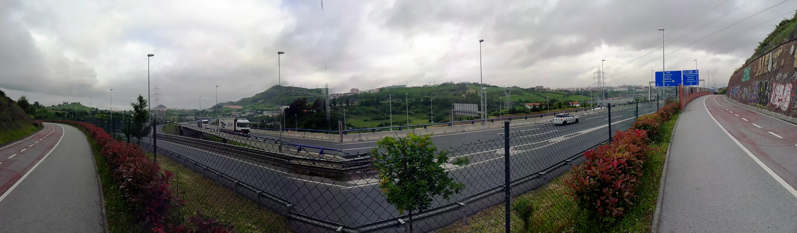
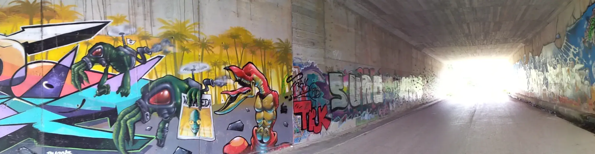
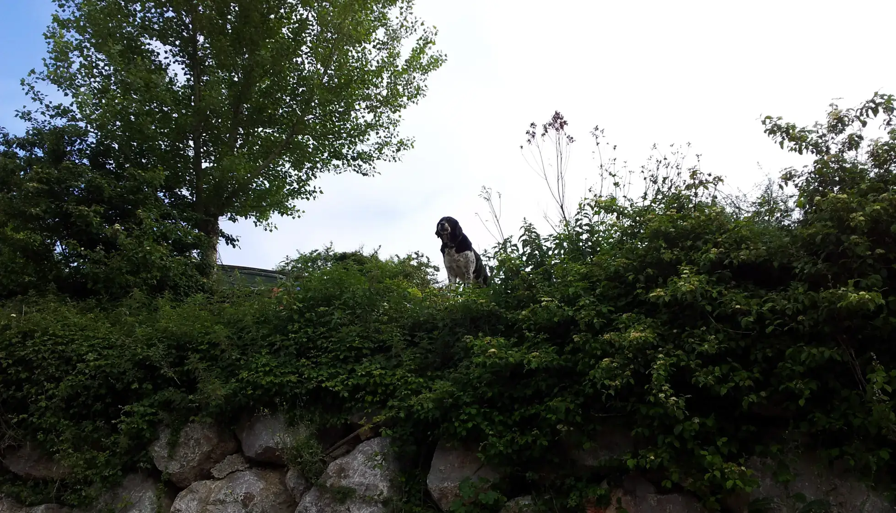
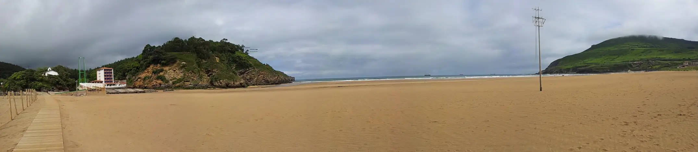
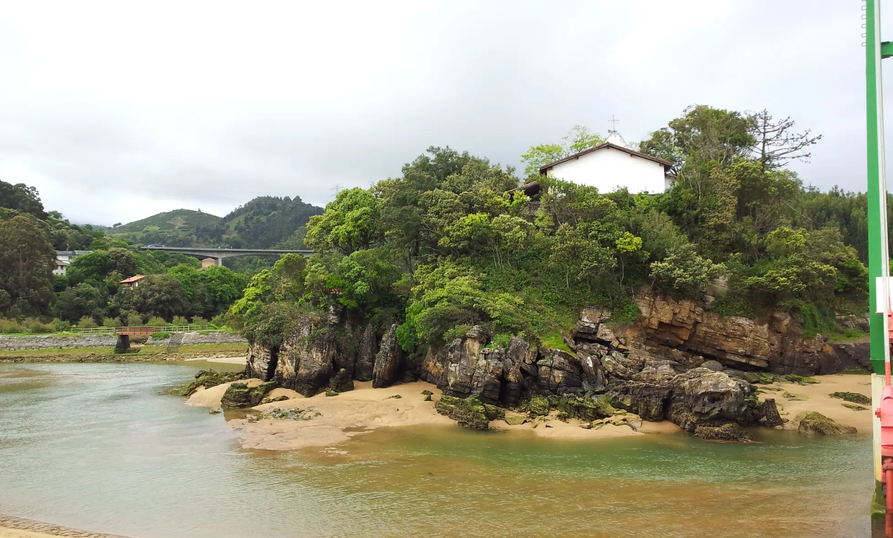
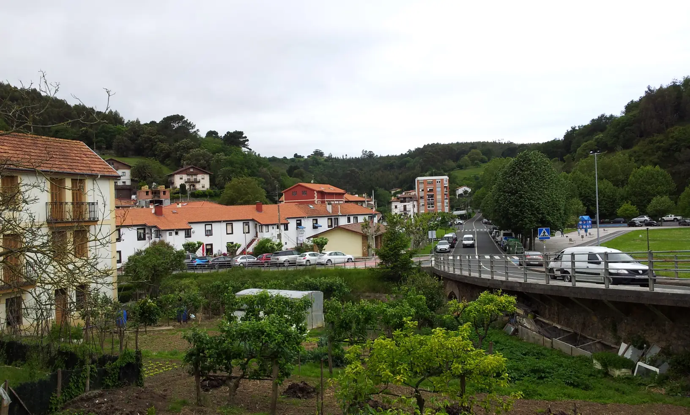

## Camino del Norte  2018

### Etappe-08: Portugalete →  Pubeña ( 11,7 Km)
16  Mai 2018

**↑** A look back ⁘ Una vista atrás  ⁘ Ein Blick zurück ⁘ Uma olhar para trás **↑**

---
**↓**  Hier entlang, bitte ⁘ Por aqui, por favor ⁘ This way, please  ⁘  Por aquí, por favor **↓** 

---

- No hay nada más interesante que ver pasar a los peregrinos. Seguro que le encantaría dejar atrás el mundo de su jardín y simplemente ponerse a caminar.

- Não há nada mais interessante do que ver os peregrinos a passar. De certeza que adoraria deixar para trás o mundo do seu jardim e simplesmente pôr-se a caminhar.

- Es gibt nichts Faszinierenderes, als den Pilgern zuzusehen, wie sie vorbeiziehen. Ich bin mir sicher, dass er am liebsten die Welt seines Gartens hinter sich lassen und sich einfach auf Wanderschaft begeben würde.

- There’s nothing more fascinating than watching the pilgrims go by. I’m sure he’d love to leave the world of his garden behind and just set off on a walk.

---
#### 🇬🇧 The refreshing and beautiful ‘walk’
- **The stage**
- - **Difficulty:** Easy (a real treat)
- - **Arrival in Pobeña:** A tiny, charming coastal village right on the river delta.
- **The highlights of the day:**
- - **The sea is back!** The absolute highlight is arriving at the vast sandy beach, _Playa de la Arena_. After days in the city, here you can finally breathe in the freedom of the Atlantic once more.

#### 🇪🇸 El refrescante y precioso «paseo»
- **La etapa**
- - **Dificultad:** Fácil (un auténtico placer)
- - **Llegada a Pobeña:** Un pueblecito costero con mucho encanto situado justo en el delta del río.
- **Lo más destacado del día:**
- - **¡El mar ha vuelto!** Lo más destacado, sin duda, es la llegada a la gigantesca playa de arena, la _Playa de la Arena_. Tras varios días en la ciudad, aquí por fin se vuelve a respirar la libertad del Atlántico.

#### 🇩🇪  Der erfrischende und wunderschöne „Spaziergang“
- **Die Etappe** 
- - **Schwierigkeit:** Leicht (ein wahrer Genuss)
- - **Ankunft in Pobeña:** Ein winziges, charmantes Küstendorf direkt am Flussdelta.

- **Die Highlights des Tages:**

 -   - **Das Meer ist zurück!** Das absolute Highlight ist die Ankunft am gigantischen Sandstrand _Playa de la Arena_. Nach Tagen in der Stadt atmet man hier endlich wieder die Freiheit des Atlantiks ein.
#### 🇵🇹 O refrescante e maravilhoso «passeio»
- **A etapa**
- - **Dificuldade:** Fácil (um verdadeiro prazer)
- - **Chegada a Pobeña:** Uma pequena e encantadora aldeia costeira situada mesmo no delta do rio.
- **Os pontos altos do dia:**
- - **O mar está de volta!** O ponto alto absoluto é a chegada à gigantesca praia de areia _Playa de la Arena_. Depois de dias na cidade, aqui respira-se finalmente de novo a liberdade do Atlântico.
 

Albergue de Peregrinos  →..........................**↑**  ...... **↑** ...... **↑**

- **The single-storey hous:** View of the Albergue in Pubeña
- **Das Einzelgeschosshaus:**  Blick auf die Herberge in Pubeña
- **La casa de una sola planta** : Vista del albergue de Pubeña
- **A casa térrea:** Vista do albergue em Pubeña

---

  

🇬🇧
🇪🇸
🇵🇹
🇩🇪

---

**↪** [Etappe-09_Pubeña_Islares-Playa-Arenillas](Etappe-09_Pubeña_Islares-Playa-Arenillas.md)

 🔁 [Camino-del-Norte_Etapas](Camino-del-Norte_Etapas.md)
 
 ...→