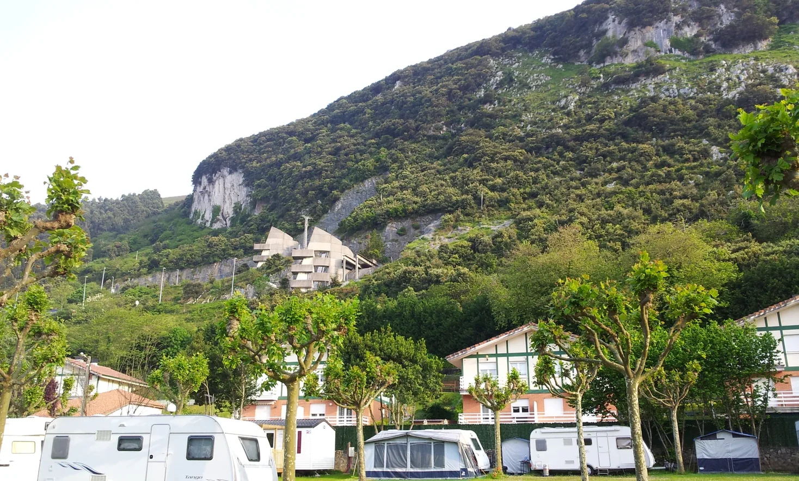

## Camino del Norte  2018

### Etappe-06: →  (Km)
17  Mai 2018

 →	.............................................................**↑** **↑** **↑**

Die Tankstelle dort drüben ist nur noch ein Schatten ihrer selbst. 

That petrol station over there is now just a shadow of its former self. 

O posto de abastecimento ali já não passa de uma sombra do que era. 

La gasolinera de allí ya no es más que una sombra de lo que fue. 

**Ein Kaffee wäre toll ⁘ Um café seria ótimo ⁘ Un café estaría genial ⁘ A coffee would be lovely** 

- Auch wenn Wanderstiefel nicht mit Benzin betrieben werden, sind Tankstellen oft früh am Morgen die einzigen Orte, an denen man neue Energie tanken kann, und währenddessen sucht man sich ein Plätzchen auf ein Bordsteinkante, bis man fertig ist. 

- Embora as botas de caminhada não funcionem a gasolina, os postos de abastecimento são, muitas vezes, de manhã cedo, os únicos locais onde se pode recarregar energias e, enquanto isso, procura-se um cantinho no passeio até terminarmos.

- Even though hiking boots don’t run on petrol, petrol stations are often the only places early in the morning where you can top up your energy, and whilst you’re there, you find a spot on the kerb to sit until you’re done.

- Aunque las botas de montaña no funcionan con gasolina, las gasolineras suelen ser, a primera hora de la mañana, los únicos lugares donde recargar energías, y mientras tanto uno busca un rinconcito en el bordillo hasta que termina.

---

- Ab hier legt man eine Zickzackstrecke zurück, und für 100 m iLuftlinie benötigt man mehr als 10 Sekunden.
- A partir daqui, percorre-se um trajeto em ziguezague e são necessários mais de 10 segundos para percorrer 100 m em linha reta.

- A partir de aquí se recorre un trayecto en zigzag, y se tarda más de 10 segundos en recorrer 100 m en línea recta.
- From here on, you follow a zigzag route, and it takes more than 10 seconds to cover 100 metres as the crow flies.
---

---

  

🇬🇧
🇪🇸
🇵🇹
🇩🇪

---

**↪** [Etappe-10](Etappe-10.md)

 🔁 [Camino-del-Norte_Etapas](Camino-del-Norte_Etapas.md)
 

 ...→