## Camino del Norte  2018

### Etappe-10:  →  (Km)
18  Mai 2018

Auf dem Weg nach Laredo 

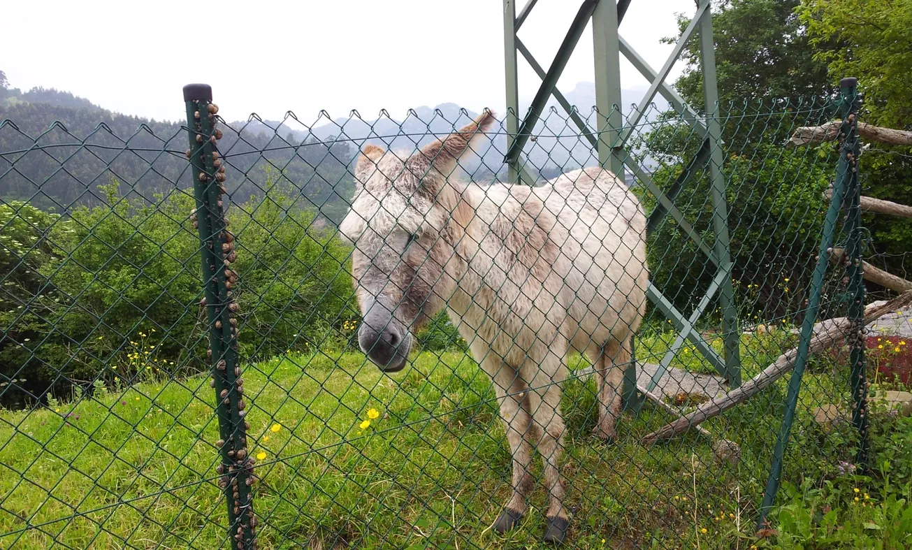

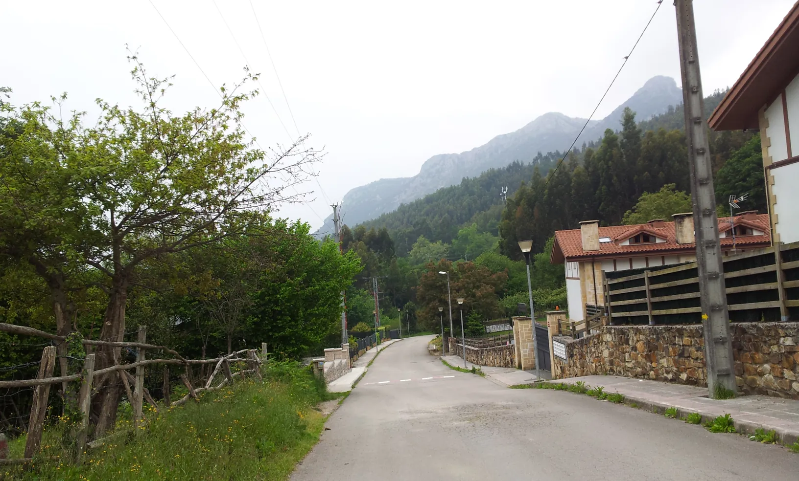

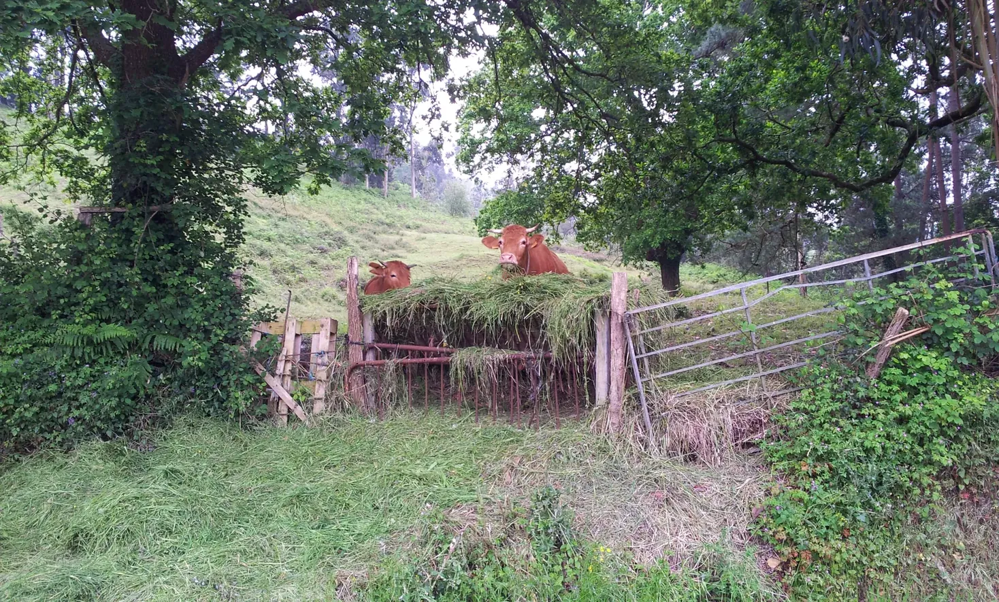

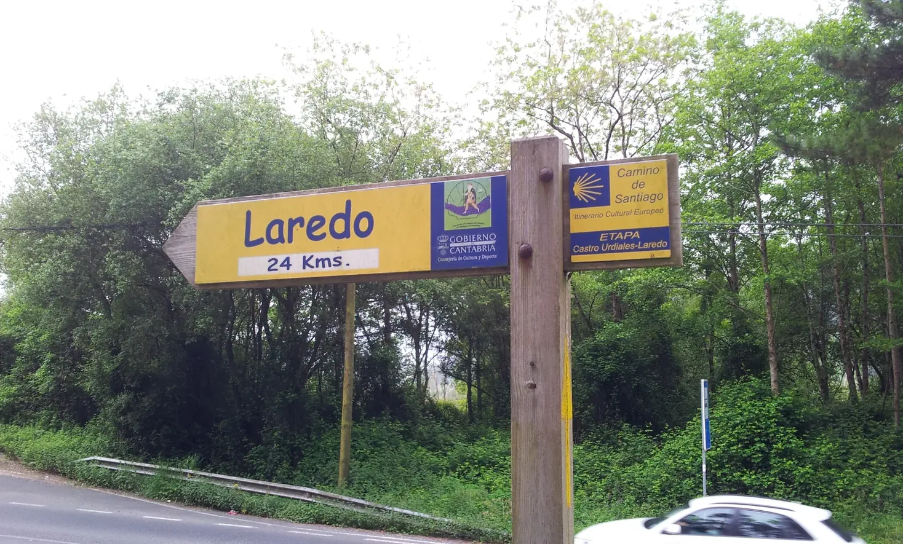

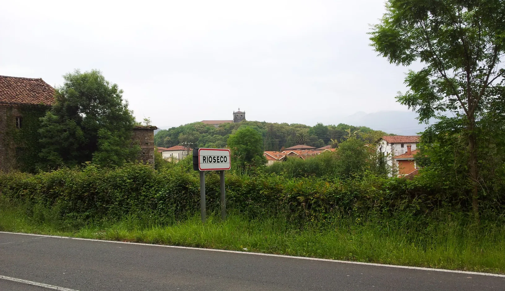

- Parroquia de San Vicente de la Maza

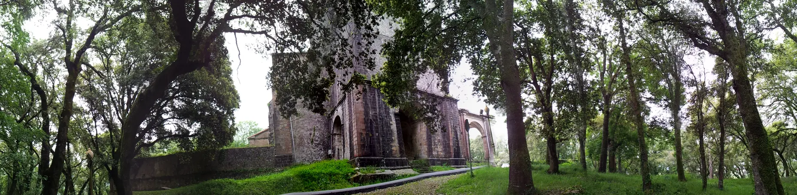

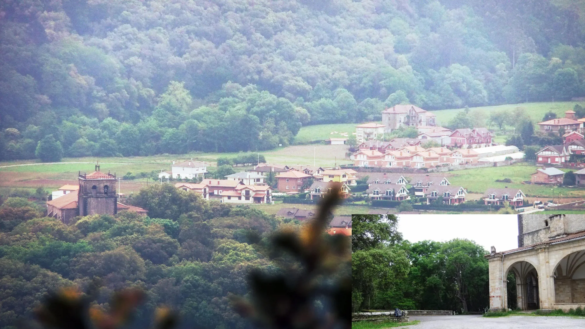

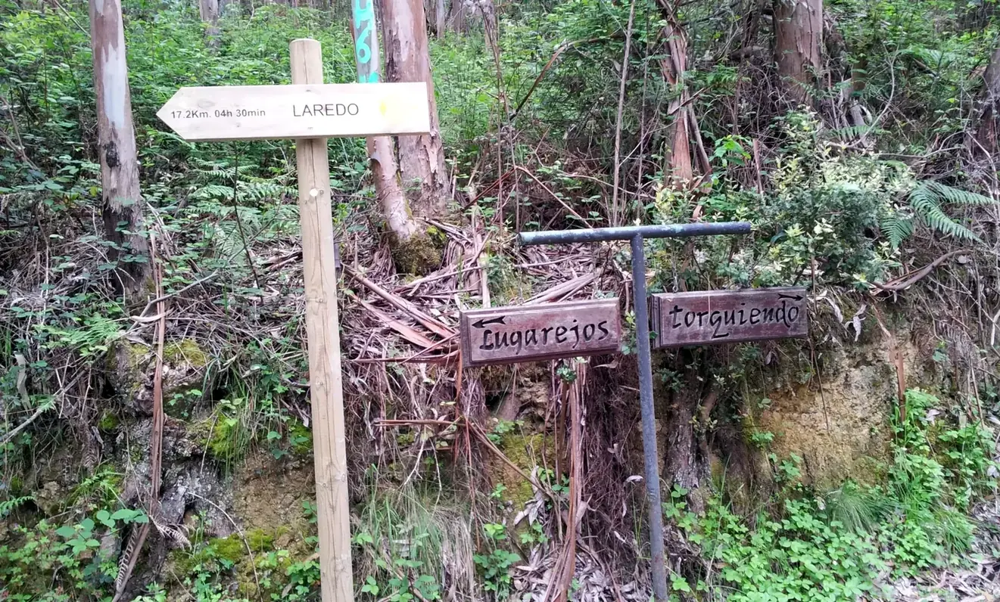

Meiner Schulter eine Pause gönnen.   ⁘  Dar um descanso ao meu ombro.   ⁘  Descansar el hombro.   ⁘   To give my shoulder a rest.

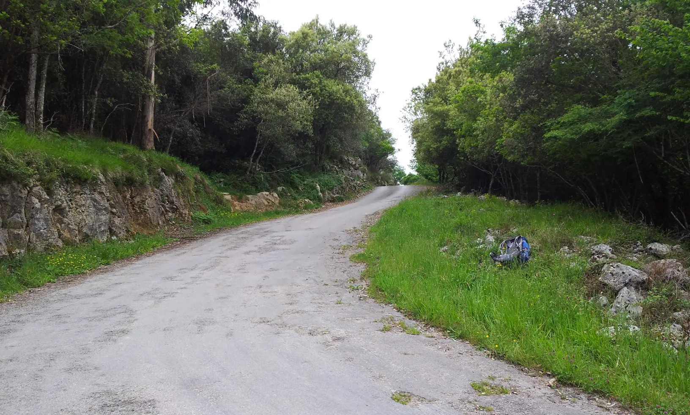

---
Was für ein sorgenfreies Leben.   ⁘  Que vida despreocupada. 
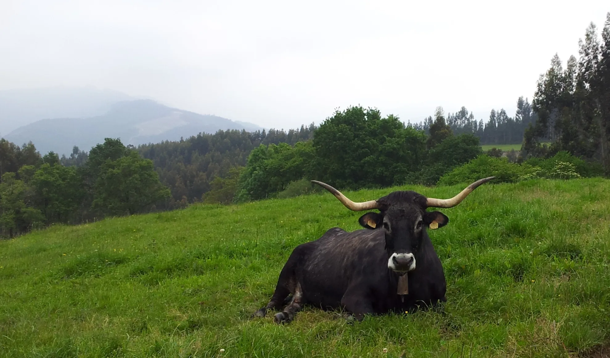
 Qué vida tan tranquila.  ⁘   What a carefree life.
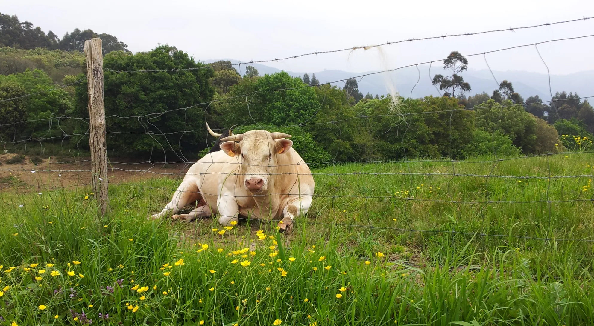

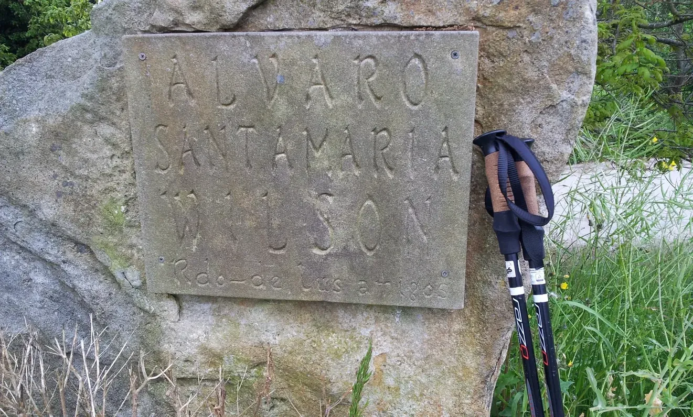

#### „Auf dem Weg nach Laredo – mit Álvaro Santamaría Wilson, 1805“

Dieser Weg führt von **Guriezo über Lugarejos in Richtung Liendo und Laredo**.

>Wie mag die Pilgerreise wohl gewesen sein, als Álvaro Santamaría Wilson aufbrach?

>Hat man ihm vielleicht einen letzten Schluck Wasser aus jener heute ausgetrockneten Quelle gegeben, aus der damals noch Wasser sprudelte und an der Menschen und Tiere ihren Durst stillten?

- Wo begann seine Reise?
- Wo verbrachte er die letzte Nacht?
- Aus welchem Grund machte er sich 1805 auf den Weg nach Laredo?
- Wie sah der Pilgerweg damals aus?
- Welche Dörfer, Gasthäuser, Kirchen und Quellen lagen auf seinem Weg?
- Welchen Menschen ist er unterwegs begegnet ?
- Wo könnte er gegessen und übernachtet haben?

>Was hätte er erzählt, wenn er es geschafft hätte, nach Hause zurückzukehren?

---
#### «A caminho de Laredo – com Álvaro Santamaría Wilson, 1805»

Este caminho vai de **Guriezo, passando por Lugarejos, em direção a Liendo e Laredo**.

>Como teria sido a peregrinação quando Álvaro Santamaría Wilson partiu?  

>Será que lhe deram um último gole de água daquela fonte hoje seca, da qual na altura ainda jorrava água e onde as pessoas e os animais saciavam a sua sede?
- Onde começou a sua viagem?
- Onde passou a última noite?
- Por que razão partiu para Laredo em 1805?
- Como era a rota de peregrinação naquela época?
- Que aldeias, estalagens, igrejas e nascentes se encontravam ao longo do seu caminho?
- Que pessoas encontrou pelo caminho?
- Onde poderia ele ter comido e dormido?
>O que teria ele contado, se tivesse conseguido regressar a casa?

#### «De camino a Laredo – con Álvaro Santamaría Wilson, 1805»

Este camino va desde **Guriezo, pasando por Lugarejos, en dirección a Liendo y Laredo**.

¿Cómo habría sido el peregrinaje cuando Álvaro Santamaría Wilson emprendió el camino?
¿Le habrán dado quizá un último sorbo de agua de aquel fuente hoy seca, de la que entonces aún brotaba agua y en la que personas y animales saciaban su sed?
- ¿Dónde comenzó su viaje?
- ¿Dónde pasó la última noche?
- ¿Por qué motivo se puso en camino hacia Laredo en 1805?
- ¿Cómo era el camino de peregrinación en aquella época?
- ¿Qué pueblos, posadas, iglesias y manantiales se encontraban en su ruta?
- ¿A qué personas se habrá encontrado por el camino?
- ¿Dónde podría haber comido y pasado la noche?
¿Qué habría contado si hubiera conseguido volver a casa?

---

**„Fuente de Álvaro Santamaría Wilson“**.  **Quelle bei San Mamés.**

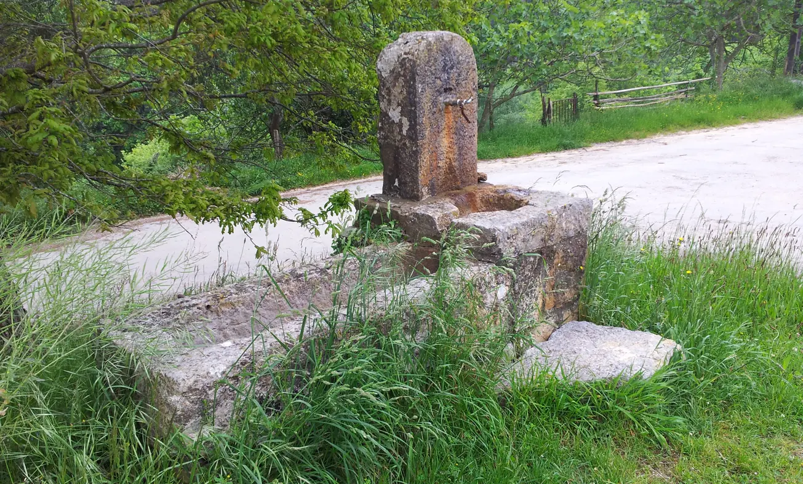

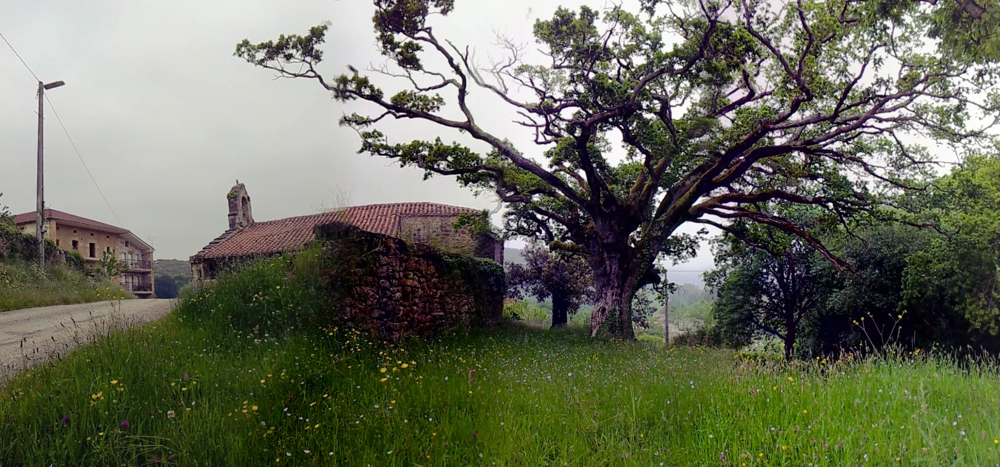

Auf diesem aktuellen Foto, das ich mir gerade ansehe, wurden aus Sicherheitsgründen alle Äste des Baumes abgeschnitten, das Gelände geräumt und vor der „Ermita de San Mames“ hat jemand ein Zelt aufgestellt, um dort vorübergehend die Nacht zu verbringen. 
Ich nehme an, dass hier eine Herberge eröffnet wird und die „Ermita de San Mames“ so vor dem Verfall bewahrt wird und wieder zu neuem Leben erwacht.

Nesta foto recente que estou a ver, por razões de segurança, cortaram todos os ramos da árvore, limparam o terreno e, em frente à «Ermita de San Mames», alguém montou uma tenda para passar a noite provisoriamente. 
Suponho que aqui venha a ser aberto um albergue e, assim, a «Ermita de San Mames» será salva da ruína e voltará a ganhar nova vida.

- **Ermita de San Mamés**

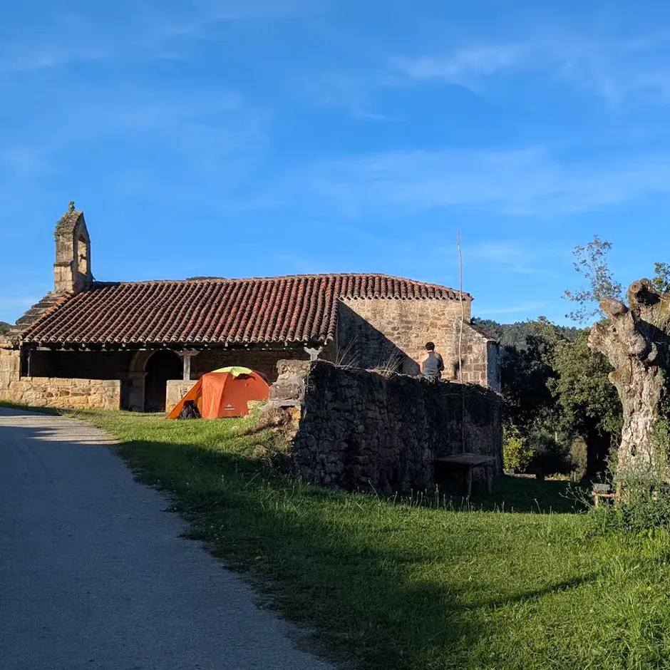

> _Vielleicht stand dieser Baum schon dort, als Álvaro Santamaría Wilson im Jahr 1805 den Weg nach Laredo ging._

---

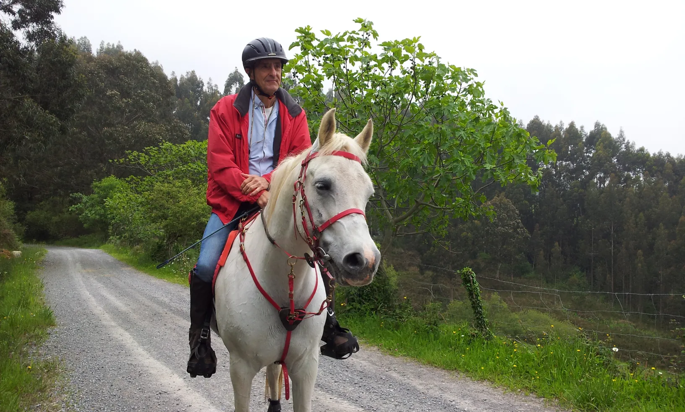

- **Gespräche während der Pilgerreise**
Es klingt alles so romantisch und einfach, aber es ist ganz und gar nicht so, wie man es sich vorstellt. Man kann ein Pferd nicht einfach „abstellen“ und irgendwo „parken“. Es erfordert Pflege und Hingabe. 
..., ... .

Wie oft habe ich mir gewünscht, dass ein solcher Gefährte meinen Rucksack tragen würde

---
- **Conversas durante a Peregrinação**

Parece tudo tão romântico e simples, mas não é nada como se quer ver. Não se pode simplesmente «desligar» um cavalo e «estacioná-lo» em qualquer lado. Exige cuidados e dedicação. 
..., ... .

Quantas vezes desejei que um companheiro assim me carregasse a mochila

---
- **Conversaciones durante la peregrinación**

Todo suena tan romántico y sencillo, pero no es en absoluto como uno se lo imagina. No se puede simplemente «dejar» un caballo y «aparcarlo» en cualquier sitio. Requiere cuidados y dedicación.
..., ... .

Cuántas veces he deseado que un compañero así me llevara la mochila

---
-  **Conversations during the pilgrimage**

It all seems so romantic and simple, but it’s not at all what you might imagine. You can’t just ‘leave’ a horse and ‘park’ it anywhere. It requires care and dedication.
..., ... .

How many times have I wished that a companion like that would carry my backpack

---
- Porträt eines modernen Pilgers   ⁘   Peregrinos modernos   ⁘   Portrait of a modern pilgrim     ⁘   Retrato de um peregrino moderno   ⁘   Retrato de un peregrino moderno

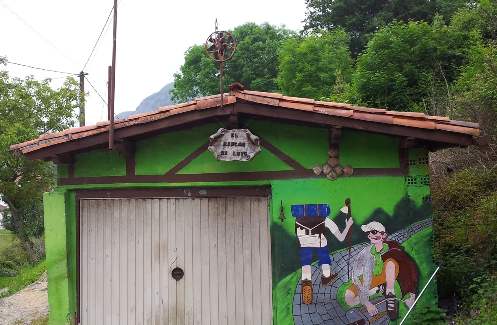

- **Buen Camino Peregrinos**

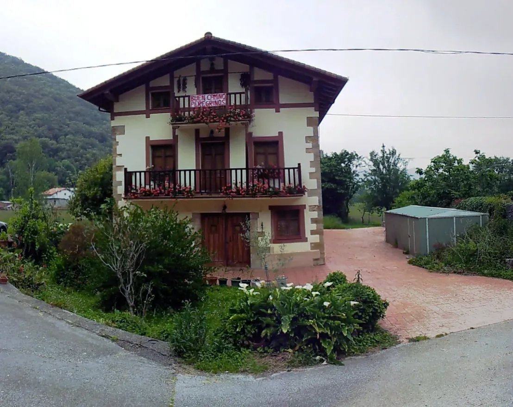

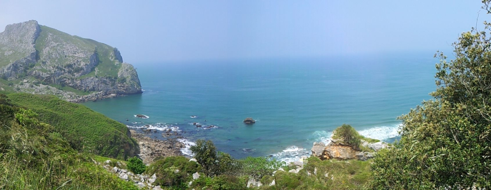

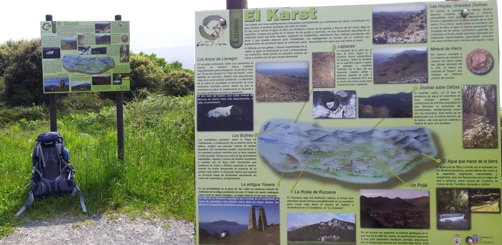

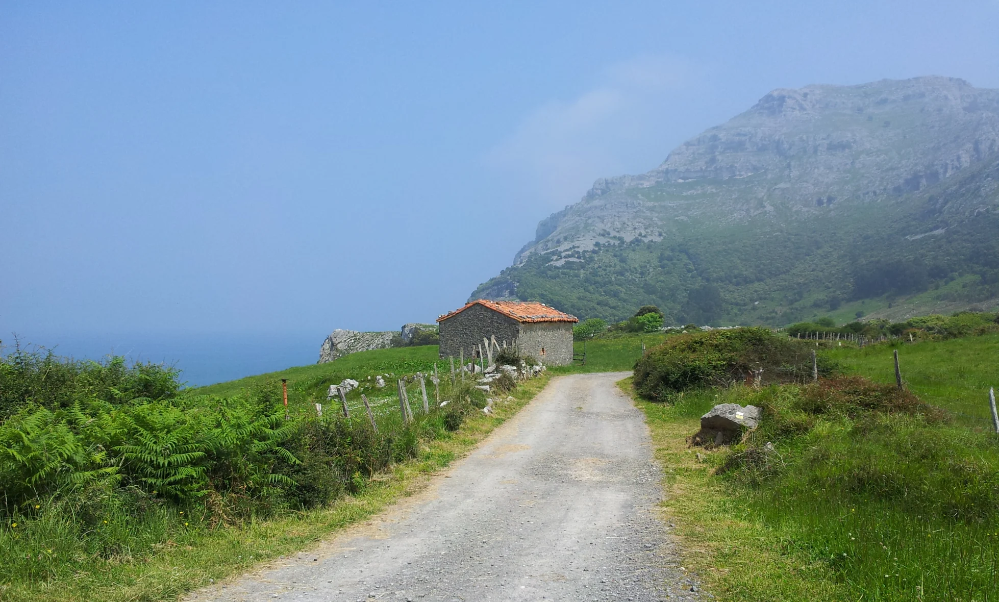

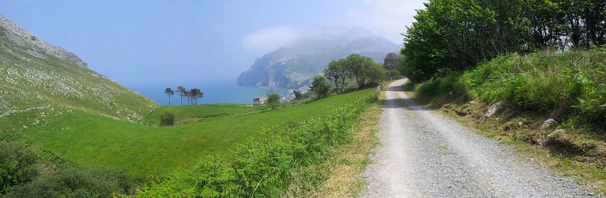

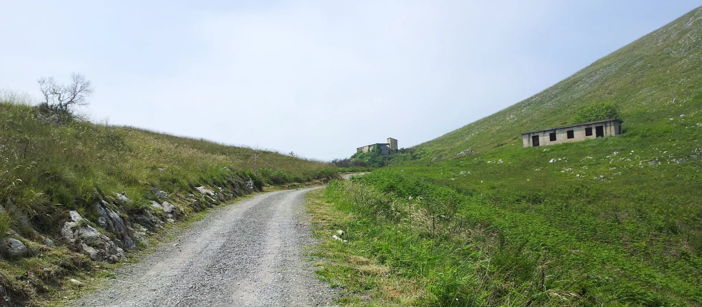

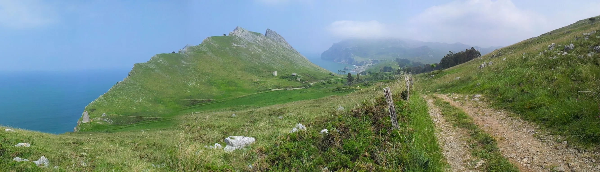

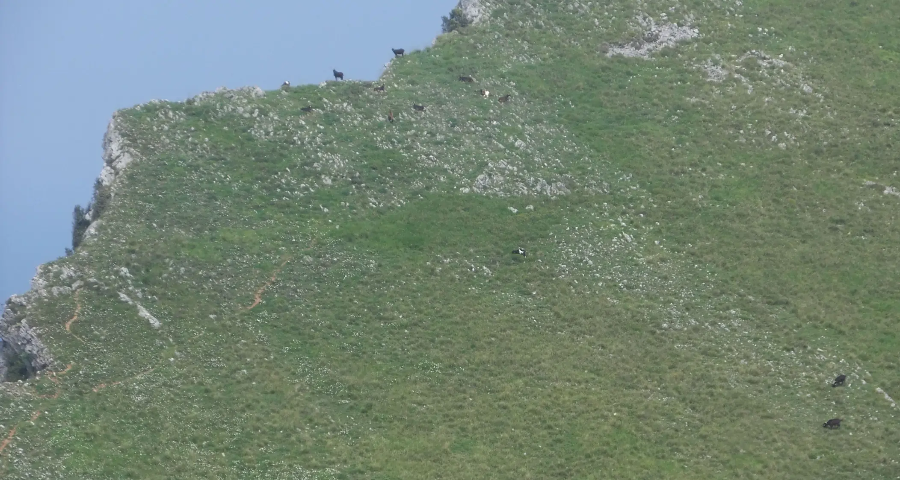

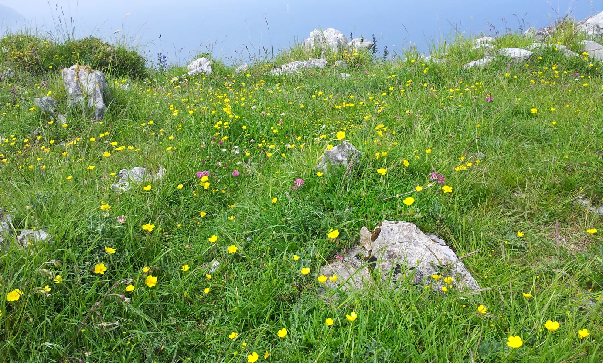

- The Last Primeval Forest
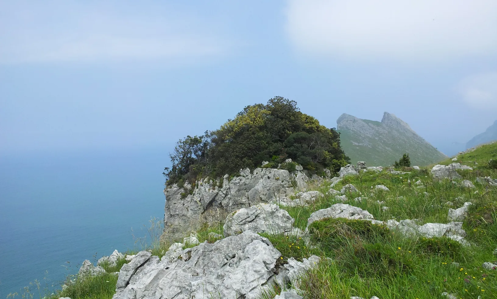

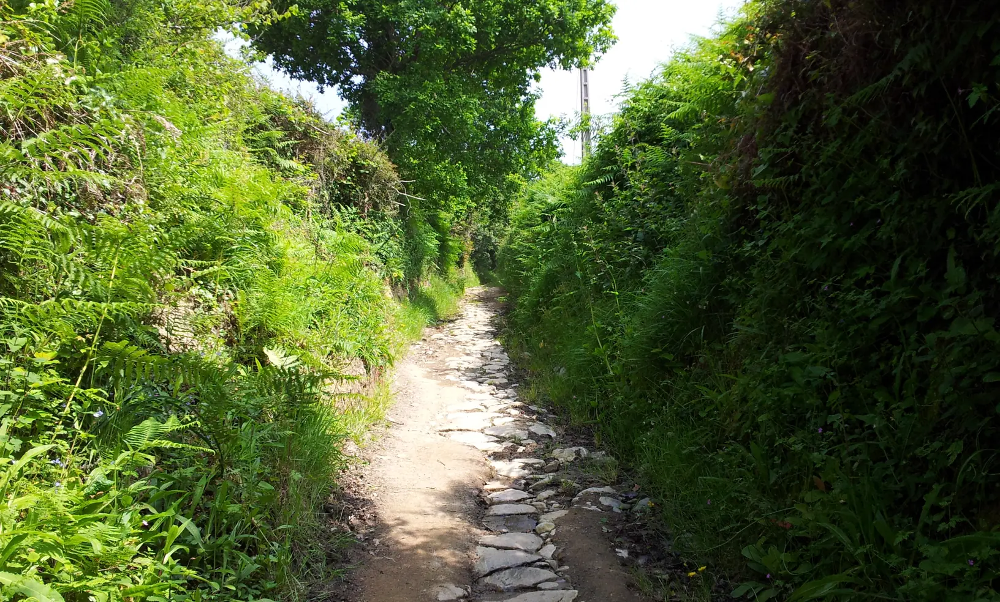

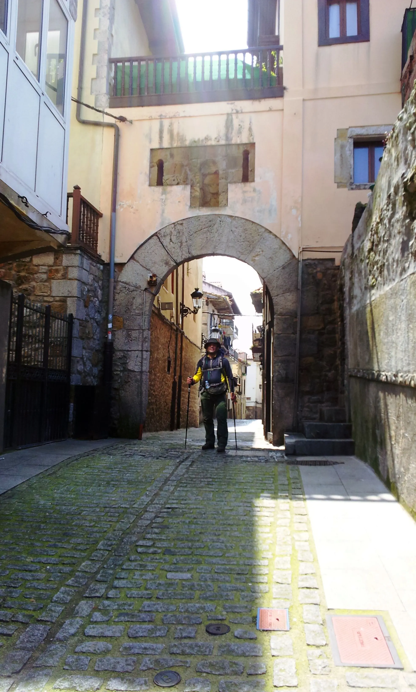

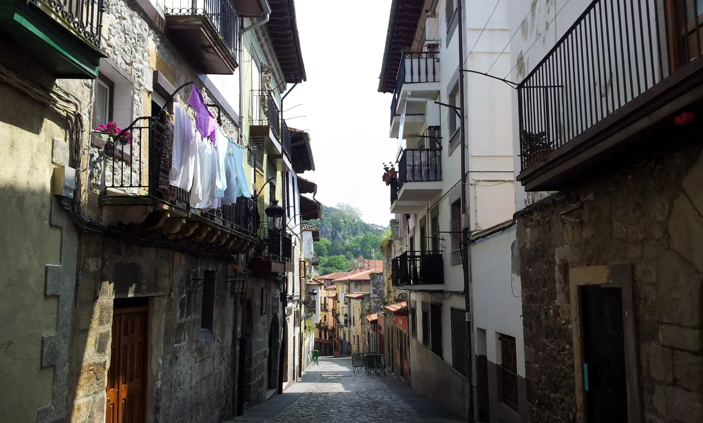

---

  

🇬🇧
🇪🇸
🇵🇹
🇩🇪

---

**↪** [Etappe-11](Etappe-11.md)

 🔁 [Camino-del-Norte_Etapas](Camino-del-Norte_Etapas.md)
 

 ...→