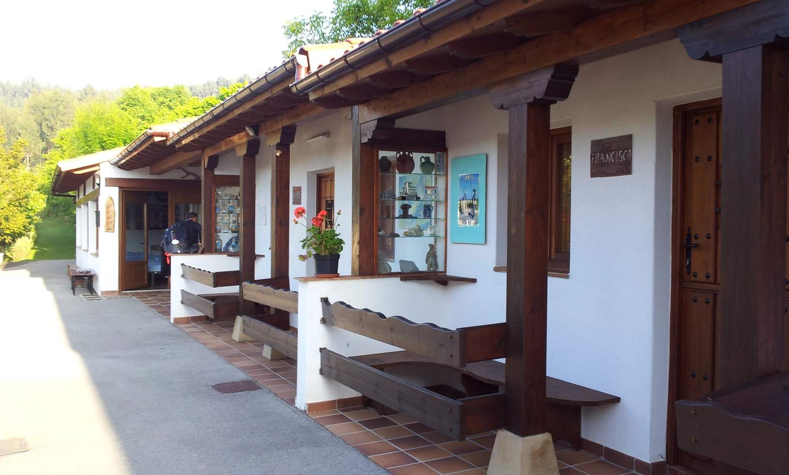
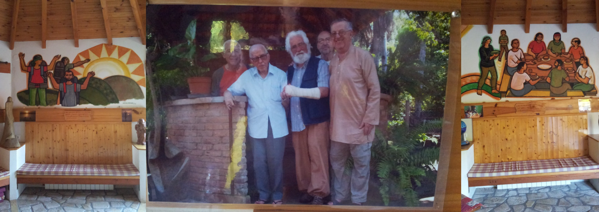
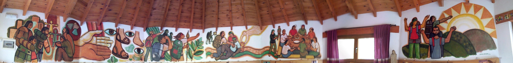
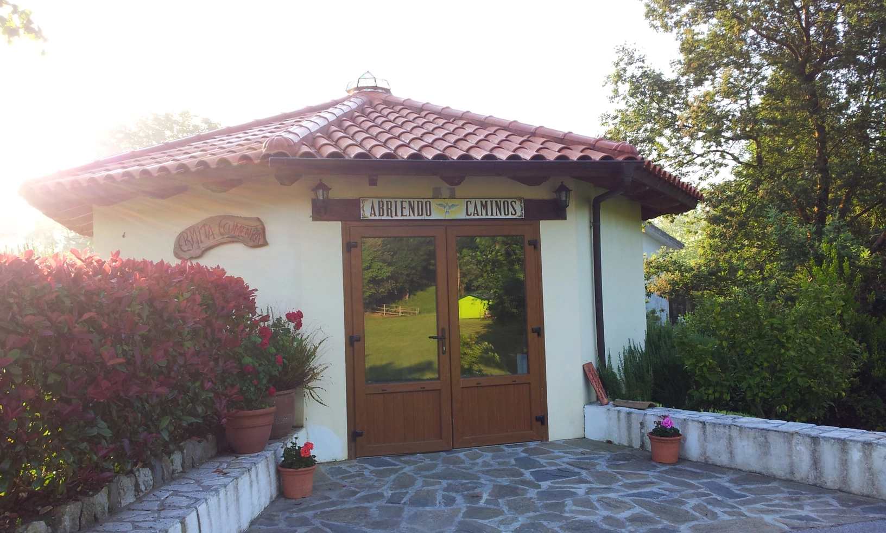
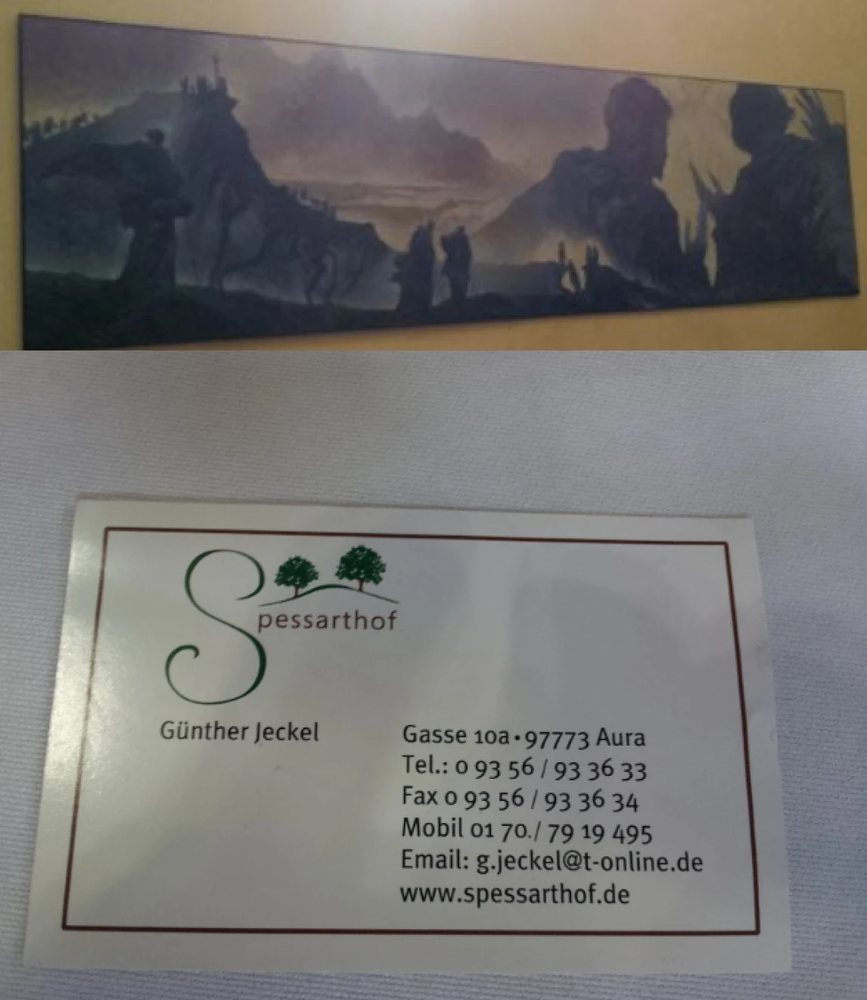
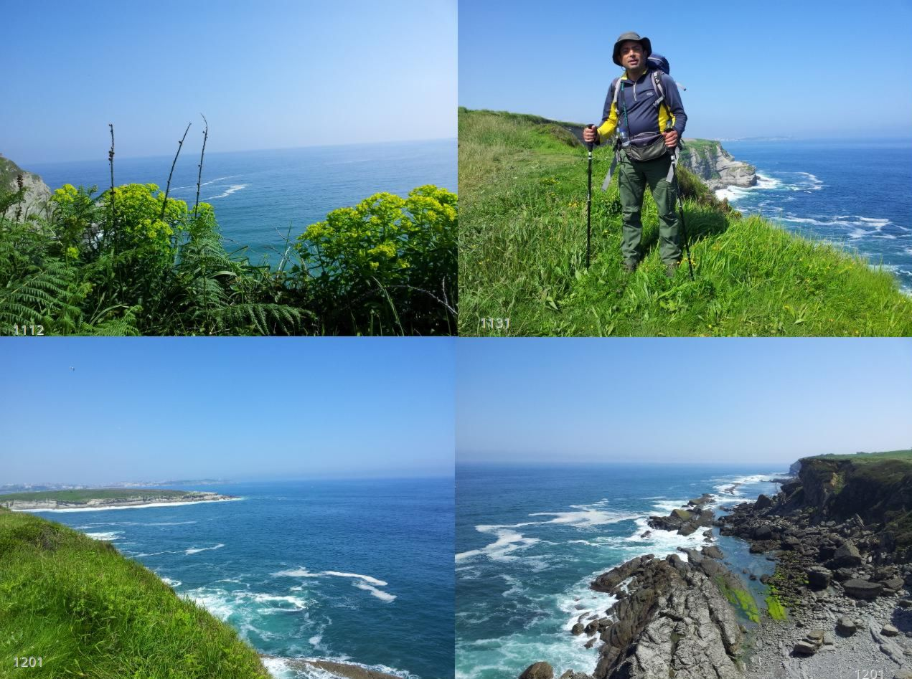

## Camino del Norte  2018

### Etappe-12:  →  (Km)
20  Mai 2018

- **Pater Ernesto**

**Os amigos e o arquiteto deste lugar maravilhoso**

- Porque é que os outros colaboradores não aparecem na fotografia?

Acho que tinham muito que fazer para que os peregrinos se sentissem bem.

- Warum sind die anderen Mitwirkenden nicht auf dem Foto zu sehen?

Ich glaube, sie hatten noch viel zu tun, damit sich die Pilger wohlfühlen konnten.

- ¿Por qué no aparecen los demás colaboradores en la foto?

Creo que aún tenían mucho que hacer para que los peregrinos se sienten a gusto.

- Why aren’t the other people involved in the photo?

I think they were still busy making sure the pilgrims were comfortable.

- Reisebegleiter

Die Reisebegleiter 

### Eine Visitenkarte mit fünf Geschichten

 Fotos aus dem .thumbnails-Ordner

Ich glaube, ich habe diese Visitenkarte nicht auf dieser Etappe fotografiert. Sollte ich die anderen Fotos finden, werde ich das korrigieren.

Aber wenn ich diese Karte sehe, verbinde ich damit fünf Geschichten.

In diesen kurzen Erinnerungen geht es um Menschen, die beschlossen haben, den Jakobsweg zu gehen, und die es schließlich unter ganz unterschiedlichen Umständen geschafft haben – oft mit der Unterstützung ihrer Töchter, Väter oder Söhne.

Da ich mich an die Menschen und, noch besser, an die Gespräche erinnere, aber nie an die Namen, werde ich die Geschichten hier zunächst nur stichpunktartig festhalten.

#### 1.) 2012 – Camino Francés, Larrasoaña

**Die 81-jährige Pilgerin mit ihrer Tochter aus Philadelphia**

Sie war die älteste Pilgerin, die ich auf meinen Wegen kennengelernt habe.

Beim Abendessen in einer kleinen Bar, die gleichzeitig wie ein Tante-Emma-Laden wirkte, beklagten wir 30- und 40-Jährigen uns über unsere Erschöpfung und die Blasen an den Füßen. Nur sie nicht. Sie lächelte voller Freude und genoss diesen Moment.

Als wir das bemerkten, verblassten unsere eigenen Klagen, und wir ließen uns von ihrer Lebensfreude anstecken.

Ich habe diese ältere Dame für ihre Leistung bewundert und dabei zunächst die Leistung ihrer Tochter vergessen – ihrer Begleiterin, die dafür sorgte, dass sie es auch in der etwas kälteren Herberge warm hatte.

Die Tochter war bereits über fünfundfünfzig Jahre alt. Sie hatte den Flug von Philadelphia nach Europa organisiert – einem Kontinent, aus dem ihre Mutter in den 1930er Jahren geflohen war.

An diesem für mich noch immer lebendigen Tag und bei diesem Abendessen trat die Tochter ganz in den Hintergrund. Sie war einfach glücklich über die Freude ihrer Mutter.

#### 2.) 2012 – Camino Francés

**Tochter und Vater aus Deutschland**

Die Tochter beschloss, den Jakobsweg allein zu gehen. Der Vater machte sich Sorgen und beschloss kurzerhand, sie zu begleiten, um zu sehen, ob alles sicher war.

Nachdem er einige Etappen mit ihr gelaufen war, entschied er kurz vor Burgos, mit dem Bus nach Burgos zu fahren und von dort seinen Flug nach Deutschland zu organisieren. Er wusste inzwischen, dass seine Tochter sicher war und sich in guten Händen befand.

Ich beherrsche weder den bayerischen noch den schwäbischen Dialekt. Aber ihrem Akzent nach würde ich gefühlsmäßig sagen, dass sie aus Baden-Württemberg kamen.

#### 3.) 2018 – Camino del Norte, Santillana del Mar

**Zwei spanische Pilger – Vater und Sohn**

Ich hatte die beiden ein oder zwei Tage zuvor bei einer Rast getroffen und sah sie später in Santillana del Mar wieder. Dort beschloss ich, mich in einer Pension einzuquartieren, anstatt darauf zu warten, dass die Pilgerherberge ihre Türen öffnete.

Ich erklärte den beiden, dass ich meine Pilgerreise für diesen Tag hier beenden würde, um die Grotten von Altamira zu besuchen. Das war eines der Dinge, die ich unbedingt von meiner Pilgerreise mitnehmen wollte.

Auch ich bin ein bisschen wie die Japaner, die in einer Woche alle Hauptstädte Europas in ihre Reisetasche packen wollen.

Die beiden gingen weiter, und ein Satz zum Abschied brachte mich zum Nachdenken.

Der Vater sagte sinngemäß:

Wir leben eigentlich gar nicht weit von hier. Aber ich war noch nie dort, weil es eben so nah ist. Irgendwann, an einem nächsten Wochenende, haben wir bestimmt Zeit – und schließlich machen wir es doch nicht. Wenn wir aber weit reisen, versuchen wir, alles zu sehen, weil wir glauben, dass dies vielleicht die letzte Möglichkeit ist, die uns bleibt.

Ich hatte den Eindruck, dass der Vater gesundheitlich etwas angeschlagen war. Sein Sohn tat alles, damit sich sein Vater wohlfühlte und die Reise genießen konnte.

#### 4.) 2018 – Camino del Norte

**Mutter und Tochter(n) aus WWW.Spessarthot.de**

Die Mutter hatte immer davon gesprochen, einmal den Jakobsweg zu gehen, und hatte es doch immer wieder verschoben.

Eines Tages kam ihre Tochter zu ihr und sagte: „Ich habe ein Geschenk für dich. Wir machen gemeinsam den Jakobsweg.“

So habe ich die beiden getroffen.

Mit großer Freude gingen sie gemeinsam den Jakobsweg und sammelten dabei auch kulinarische Inspirationen aus Spanien, die sie später auf ihrem Hof anbieten wollten.

#### 5.) 2019 – Camino de Levante (ab Ávila), Camino Sanabrés, Oseira

**Vater und Sohn aus Portugal, vermutlich aus der Nähe von Espinho**

Der Vater hatte mit Knieschmerzen zu kämpfen, und sein Sohn begleitete ihn auf der Pilgerreise, um ihn zu unterstützen.

Wie der Sohn sagte, bestand eine der Schwierigkeiten darin, zu unterscheiden: Welche Schmerzen kamen einfach von fehlender Kondition und großer körperlicher Anstrengung – und welche Schmerzen standen mit der früheren Knieoperation des Vaters in Zusammenhang?

Diese kleinen Geschichten werde ich später in die entsprechenden Etappen einfügen und dort noch ergänzen.

Aber als ich diese Visitenkarte sah, beschloss ich, sie alle zusammen aufzuschreiben – obwohl die Erlebnisse zeitlich weit voneinander entfernt liegen.

---

Companheiros de viagem 

#### Um cartão de visita com cinco histórias

Fotos da pasta .thumbnails

Acredito que não fotografei este cartão de visita nesta etapa. Se encontrar as outras fotografias, vou corrigir isso.

Mas, quando vejo este cartão, associo-o a cinco histórias.

Estas breves recordações são sobre pessoas que decidiram fazer o Caminho de Santiago e que, em circunstâncias muito diferentes, acabaram por realizar esse projeto – muitas vezes com o apoio das suas filhas, pais ou filhos.

Como me lembro das pessoas e, ainda melhor, das conversas, mas nunca dos nomes, vou deixar aqui, por enquanto, apenas um breve registo de cada história.

#### 1.) 2012 – Camino Francés, Larrasoaña

**A peregrina de 81 anos e a sua filha, de Filadélfia**

Ela era a peregrina mais velha que conheci nos meus caminhos.

Durante o jantar, num pequeno bar que também funcionava como uma espécie de mercearia de bairro, nós, peregrinos de 30 e 40 anos, queixávamo-nos do cansaço e das bolhas nos pés. Ela, não. Sorria cheia de alegria e desfrutava daquele momento.

Quando percebemos isso, as nossas próprias queixas perderam importância e deixámo-nos contagiar pela sua alegria de viver.

Admirei aquela senhora pela sua caminhada e, inicialmente, esqueci-me do esforço da filha – a sua companheira de viagem, que também cuidava para que ela se mantivesse quente na albergaria, que era um pouco  fria.

A filha também já tinha mais de sessenta anos. Tinha organizado o voo de Filadélfia para a Europa, para um Continente de onde a mãe tinha fugido nos anos 1930.

Naquele dia, que ainda hoje permanece muito vivo na minha memória, e durante aquele jantar, a filha ficou completamente em segundo plano. Estava simplesmente feliz por ver a alegria da mãe.

#### 2.) 2012 – Camino Francés

**Filha e pai, da Alemanha**

A filha decidiu fazer o Caminho de Santiago sozinha. O pai ficou preocupado e, sem hesitar, decidiu acompanhá-la para se certificar de que tudo estava bem e de que ela estava segura.

Depois de caminhar algumas etapas com ela, pouco antes de Burgos, decidiu seguir de autocarro até Burgos e, de lá, organizar o seu voo de regresso à Alemanha. Entretanto, já sabia que a filha estava segura e em boas mãos.

Não domino nem o dialeto bávaro nem o suábio. Mas, pelo sotaque, diria intuitivamente que eram da região de Baden-Württemberg.

#### 3.) 2018 – Camino del Norte, Santillana del Mar

**Dois peregrinos espanhóis – pai e filho**

Tinha encontrado os dois um ou dois dias antes, durante uma pausa, e voltei a vê-los em Santillana del Mar. Ali decidi ficar numa pensão, em vez de esperar pela abertura da albergaria de peregrinos.

Expliquei-lhes que, naquele dia, terminaria ali a minha peregrinação para visitar as grutas de Altamira. Era uma das coisas que eu queria absolutamente levar comigo desta viagem.

Também sou um pouco como os japoneses que, numa semana, querem colocar todas as capitais da Europa na sua mala de viagem.

Os dois continuaram o caminho, e uma frase de despedida do pai fez-me pensar.

Ele disse, mais ou menos:

Na realidade, vivemos relativamente perto daqui. Mas nunca vim cá, porque é tão perto. Pensamos sempre que num próximo fim de semana vamos ter tempo e, no fim, nunca vamos. Quando viajamos para longe, tentamos ver tudo, porque pensamos que talvez seja a última oportunidade que temos.

Tive a impressão de que o pai estava um pouco debilitado fisicamente. O filho fazia tudo o que podia para que o pai se sentisse bem e pudesse aproveitar a viagem.

#### 4.) 2018 – Camino del Norte

**Mãe e filha, de WWW.Spessarthot.de**

A mãe falava há muito tempo em fazer o Caminho de Santiago, mas foi sempre adiando.

Um dia, a filha chegou junto dela e disse: «Tenho um presente para ti. Vamos fazer juntas o Caminho de Santiago.»

Foi assim que as conheci.

Com muita alegria, percorreram juntas o Caminho e foram recolhendo também inspirações culinárias em Espanha, que mais tarde queriam levar para a sua propriedade.

#### 5.) 2019 – Camino de Levante (a partir de Ávila), Camino Sanabrés, Oseira

**Pai e filho, de Portugal, provavelmente da região de Espinho**

O pai sofria com dores no joelho, e o filho acompanhou-o na peregrinação para o apoiar.

Como o filho explicou, uma das dificuldades era distinguir quais eram as dores provocadas simplesmente pela falta de preparação física e pelo grande esforço e quais estavam relacionadas com a operação ao joelho que o pai tinha realizado anteriormente.

Mais tarde, vou inserir estas pequenas histórias nas etapas correspondentes e acrescentar alguns detalhes.

Mas, quando vi este cartão de visita, decidi escrever todas juntas – apesar de as experiências estarem separadas por vários anos.

---

Compañeros de viaje

### Una tarjeta de visita con cinco historias

Fotos de la carpeta .thumbnails

Creo que no fotografié esta tarjeta de visita durante esta etapa. Si encuentro las otras fotografías, lo corregiré.

Pero cuando veo esta tarjeta, la relaciono con cinco historias.

Estas breves historias de mis recuerdos hablan de personas que decidieron hacer el Camino de Santiago y que, en circunstancias muy diferentes, finalmente lo consiguieron – muchas veces con el apoyo de sus hijas, padres o hijos.

Como recuerdo a las personas y, aún mejor, las conversaciones, pero nunca los nombres, por ahora voy a dejar aquí solamente un breve resumen de cada historia.

#### 1.) 2012 – Camino Francés, Larrasoaña

**La peregrina de 81 años y su hija, de Filadelfia**

Era la peregrina de mayor edad que había conocido en mis caminos.

Durante la cena, en un pequeño bar que también hacía las veces de tienda de barrio, los peregrinos de 30 y 40 años nos quejábamos del cansancio y de las ampollas en los pies. Ella, en cambio, no se quejaba. Sonreía llena de alegría y disfrutaba de aquel momento.

Cuando nos dimos cuenta, nuestras propias quejas perdieron importancia y nos dejamos contagiar por su alegría de vivir.

Admiré a aquella mujer mayor por su esfuerzo y, al principio, olvidé el esfuerzo de su hija – su compañera de viaje, que también se preocupaba de que su madre estuviera abrigada en el albergue, que era algo más frío.

La hija también tenía ya más de cincuenta y cinco años. Había organizado el viaje desde Filadelfia hasta Europa, al continente del que su madre había huido en la década de 1930.

En aquel día, que todavía permanece muy vivo en mi memoria, y durante aquella cena, la hija quedó completamente en segundo plano. Simplemente estaba feliz de ver la alegría de su madre.

#### 2.) 2012 – Camino Francés

**Hija y padre, de Alemania**

La hija decidió hacer sola el Camino de Santiago. El padre estaba preocupado y, sin dudarlo, decidió acompañarla para comprobar que todo estuviera bien y que ella estuviera segura.

Después de caminar con ella durante algunas etapas, poco antes de Burgos decidió tomar el autobús hasta Burgos y desde allí organizar su vuelo de regreso a Alemania. Para entonces sabía que su hija estaba segura y en buenas manos.

No domino ni el dialecto bávaro ni el suabo. Pero, por el acento, diría intuitivamente que eran de Baden-Württemberg.

#### 3.) 2018 – Camino del Norte, Santillana del Mar

**Dos peregrinos españoles – padre e hijo**

Había conocido a los dos uno o dos días antes, durante una parada, y volví a encontrarlos en Santillana del Mar. Allí decidí alojarme en una pensión en lugar de esperar a que abriera el albergue de peregrinos.

Les expliqué que ese día terminaría allí mi peregrinación para visitar las cuevas de Altamira. Era una de las cosas que quería llevarme sí o sí de este viaje.

Yo también soy un poco como los japoneses que quieren meter en una semana todas las capitales de Europa en su maleta.

Ellos continuaron su camino y una frase del padre al despedirnos me hizo pensar.

Dijo, más o menos:

En realidad vivimos bastante cerca de aquí. Pero nunca he venido, porque está tan cerca. Siempre pensamos que algún fin de semana tendremos tiempo y, al final, nunca lo hacemos. Cuando viajamos lejos, intentamos verlo todo porque pensamos que quizá sea la última oportunidad que nos queda.

Tuve la impresión de que el padre estaba algo delicado de salud. Su hijo hacía todo lo posible para que se sintiera bien y pudiera disfrutar del viaje.

#### 4.) 2018 – Camino del Norte

**Madre e hija(s), de WWW.Spessarthot.de**

La madre llevaba mucho tiempo hablando de hacer el Camino de Santiago, pero siempre lo iba posponiendo.

Un día, su hija se acercó a ella y le dijo: «Tengo un regalo para ti. Vamos a hacer juntas el Camino de Santiago.»

Así fue como las conocí.

Con mucha alegría recorrieron juntas el Camino y también fueron recogiendo inspiración culinaria de España, que después querían incorporar a su propia finca.

#### 5.) 2019 – Camino de Levante (desde Ávila), Camino Sanabrés, Oseira

**Padre e hijo, de Portugal, probablemente de la zona de Espinho**

El padre tenía problemas de rodilla y su hijo lo acompañó durante la peregrinación para apoyarlo.

Como explicaba el hijo, una de las dificultades consistía en distinguir qué dolores se debían simplemente a la falta de preparación física y al gran esfuerzo, y cuáles estaban relacionados con la operación de rodilla que había tenido su padre.

Más adelante incorporaré estas pequeñas historias a las etapas correspondientes y añadiré algunos detalles.

Pero cuando vi esta tarjeta de visita, decidí escribirlas todas juntas, aunque los recuerdos estén separados por varios años.

---

 🇬🇧 Companions of the Journey 

### A Business Card with Five Stories

Photos from the .thumbnails folder

I believe I did not photograph this business card on this particular stage. If I find the other photographs, I will correct this.

But whenever I see this card, it brings five stories to mind.

These short memories are about people who decided to walk the Camino de Santiago and who, under very different circumstances, eventually made it – often with the support of their daughters, fathers, or sons.

I remember the people and, even better, the conversations, but I never remember their names. So for now, I will simply record the stories here in brief.

#### 1.) 2012 – Camino Francés, Larrasoaña

**The 81-year-old pilgrim and her daughter from Philadelphia**

She was the oldest pilgrim I had ever met on my journeys.

During dinner in a small bar that also served as a kind of village shop, we pilgrims in our 30s and 40s were complaining about exhaustion and blisters on our feet. She was not. She was smiling with great joy and simply enjoying the moment.

When we noticed this, our own complaints suddenly seemed much less important, and we allowed ourselves to be infected by her joy of life.

I admired this elderly lady for what she was accomplishing, but at first I forgot about the achievement of her daughter – her companion, who also made sure that her mother stayed warm in the somewhat colder hostel.

The daughter herself was already over fifty-five years. She had organized the flight from Philadelphia to Europe, to the continent her mother had fled from in the 1930s.

On that day, which is still very vivid in my memory, and during that dinner, the daughter remained completely in the background. She was simply happy to see her mother happy.

#### 2.) 2012 – Camino Francés

**Daughter and father from Germany**

The daughter decided to walk the Camino de Santiago on her own. Her father was worried and, without hesitation, decided to accompany her to make sure that everything was safe.

After walking several stages with her, shortly before Burgos he decided to take the bus to Burgos and arrange his flight back to Germany from there. By then, he knew that his daughter was safe and in good hands.

I speak neither Bavarian nor Swabian dialect. But judging by their accent, my feeling is that they came from Baden-Württemberg.

#### 3.) 2018 – Camino del Norte, Santillana del Mar

**Two Spanish pilgrims – father and son**

I had met the two of them at a rest stop a day or two earlier and then saw them again in Santillana del Mar. There, I decided to stay in a guesthouse rather than wait for the pilgrims' hostel to open.

I explained to them that I would end my pilgrimage there for the day in order to visit the caves of Altamira. It was one of the things I absolutely wanted to take away from this journey.

I am also a little like the Japanese tourists who try to fit all the major European capitals into one week and into one suitcase.

The two continued on their way, and something the father said when we said goodbye made me think.

He said, more or less:

We actually live quite close to here. But I have never been there because it is so close. We always think that one weekend we will have time, and in the end we never do it. But when we travel far away, we try to see everything because we believe it may be the last opportunity we have.

I had the impression that the father was somewhat frail. His son did everything he could to make sure that his father felt comfortable and could enjoy the journey.

#### 4.) 2018 – Camino del Norte

**Mother and daughter(s) from WWW.Spessarthot.de**

The mother had always talked about walking the Camino de Santiago, but she kept putting it off.

One day, her daughter came to her and said: “I have a gift for you. We are going to walk the Camino de Santiago together.”

That is how I met them.

They walked the Camino together with great joy and also gathered culinary inspiration from Spain, which they later wanted to bring back to their own farm.

#### 5.) 2019 – Camino de Levante (from Ávila), Camino Sanabrés, Oseira

**Father and son from Portugal, probably from the Espinho area**

The father was struggling with knee pain, and his son accompanied him on the pilgrimage to support him.

As the son explained, one of the difficulties was distinguishing which pains were simply the result of being out of condition and making a great physical effort, and which pains were related to his father's previous knee surgery.

I will later insert these little stories into the corresponding stages and add more details.

But when I saw this business card, I decided to write them all down together – even though the experiences are separated by several years.

Wenn du möchtest, kann ich im nächsten Schritt auch noch **alle vier Fassungen stilistisch stärker vereinheitlichen**, sodass sie sich wie ein zusammenhängendes Kapitel eines Reisebuchs lesen – mit etwas weniger wörtlicher Übersetzung und mehr erzählerischem Charakter.

Die Fotos und Erinnerungen
Fotos aus dem Ordner „.thumbnails“ 
Ich glaube, diese Foto vom 20. Mai wurde in der Kirche von Santander aufgenommen.

---

 ChatGPT-Version: 

Gerne. Ich habe den Text jetzt stärker als **persönliches Reisebuch-Kapitel** gestaltet: fließender, atmosphärischer und mit etwas mehr Raum für die Begegnungen. Die fünf Geschichten bleiben dabei klar voneinander getrennt.

### Eine Visitenkarte mit fünf Geschichten

Fotos aus dem .thumbnails-Ordner

Ich glaube, dass ich diese Visitenkarte nicht auf dieser Etappe fotografiert habe. Sollte ich die anderen Fotos noch finden, werde ich das korrigieren.

Doch sobald ich diese Karte sehe, kommen mir fünf Geschichten in den Sinn.

Fünf Begegnungen, die zeitlich weit auseinanderliegen und doch etwas miteinander verbindet: Menschen, die irgendwann beschlossen haben, den Jakobsweg zu gehen – und es schließlich auch getan haben. Manchmal allein, manchmal gemeinsam mit einem Elternteil oder einem Kind. Und immer war da jemand, der den anderen ein Stück weit getragen, begleitet oder einfach ermutigt hat.

Ich erinnere mich an die Menschen und vor allem an unsere Gespräche. Ihre Namen hingegen sind längst verschwunden. Vielleicht ist das auch gar nicht so wichtig. Was geblieben ist, sind die Begegnungen und das, was sie mir erzählt haben.

Deshalb möchte ich diese fünf kleinen Geschichten hier festhalten.

#### 1. 2012 – Camino Francés, Larrasoaña

**Die 81-jährige Pilgerin und ihre Tochter aus Philadelphia**

Sie war die älteste Pilgerin, die ich auf meinen Caminos kennengelernt habe.

Wir saßen beim Abendessen in einer kleinen Bar in Larrasoaña, die gleichzeitig ein bisschen wie ein Tante-Emma-Laden wirkte. Wir, die 30- und 40-Jährigen, klagten über unsere Erschöpfung, über schmerzende Füße und Blasen.

Nur sie nicht.

Sie saß da, lächelte voller Freude und genoss diesen Moment.

Als wir das bemerkten, wurden unsere eigenen Klagen plötzlich kleiner. Wir ließen uns von ihrer Lebensfreude anstecken.

Ich bewunderte diese alte Dame für ihre Leistung. Dabei übersah ich zunächst die mindestens ebenso bemerkenswerte Leistung ihrer Tochter.

Die Tochter war selbst schon über sechzig. Sie hatte die Reise von Philadelphia nach Europa organisiert – in ein Kontinent, aus dem ihre Mutter in den 1930er-Jahren geflohen war. Sie begleitete ihre Mutter auf dem Camino und kümmerte sich darum, dass sie auch in der etwas kälteren Herberge warm blieb.

Und doch stand sie an diesem Abend völlig im Hintergrund.

Sie war einfach glücklich darüber, ihre Mutter so glücklich zu sehen.

#### 2. 2012 – Camino Francés

**Eine Tochter und ihr Vater aus Deutschland**

Die Tochter hatte beschlossen, den Jakobsweg allein zu gehen.

Ihr Vater machte sich Sorgen. Also beschloss er kurzerhand, sie zu begleiten – nicht unbedingt, um selbst den Camino zu gehen, sondern um sich davon zu überzeugen, dass seine Tochter sicher war.

Einige Etappen liefen sie gemeinsam.

Kurz vor Burgos entschied der Vater, mit dem Bus nach Burgos weiterzufahren und von dort seinen Flug zurück nach Deutschland zu organisieren. Er hatte inzwischen gesehen, dass seine Tochter sicher war und sich auf dem Camino in guten Händen befand.

Ich kann weder Bayerisch noch Schwäbisch. Aber ihrem Akzent nach würde ich vermuten, dass sie aus Baden-Württemberg kamen.

Was mir von dieser Begegnung geblieben ist, ist weniger der Camino selbst als diese stille Form der Fürsorge: Ein Vater begleitet seine erwachsene Tochter ein Stück ihres Weges, bis er weiß, dass sie allein weitergehen kann.

#### 3. 2018 – Camino del Norte, Santillana del Mar

**Zwei spanische Pilger – Vater und Sohn**

Ich hatte die beiden ein oder zwei Tage zuvor bei einer Rast kennengelernt und traf sie später in Santillana del Mar wieder.

Ich hatte beschlossen, dort in einer Pension zu übernachten, anstatt auf die Öffnung der Pilgerherberge zu warten. Ich erzählte den beiden, dass ich meine Pilgerreise für diesen Tag hier beenden wollte, um die Grotten von Altamira zu besuchen.

Das war eines der Dinge, die ich unbedingt von meiner Reise mitnehmen wollte.

Auch ich bin ein bisschen wie die Japaner, die versuchen, in einer Woche alle großen europäischen Hauptstädte zu sehen und sie anschließend in ihrer Reisetasche mit nach Hause zu nehmen.

Die beiden gingen weiter.

Doch ein Satz des Vaters beim Abschied ist mir geblieben.

Er sagte sinngemäß:

„Wir wohnen eigentlich gar nicht weit von hier. Aber ich war noch nie dort. Es ist eben so nah. Irgendwann, an einem nächsten Wochenende, haben wir bestimmt Zeit – und dann machen wir es doch nicht. Wenn wir aber weit weg reisen, versuchen wir, alles zu sehen. Weil wir glauben, dass es vielleicht die letzte Gelegenheit ist, die uns bleibt.“

Ich hatte den Eindruck, dass der Vater gesundheitlich etwas angeschlagen war. Sein Sohn kümmerte sich aufmerksam um ihn und tat alles dafür, dass sein Vater sich wohlfühlte.

Vielleicht war genau das der eigentliche Sinn dieser gemeinsamen Reise.

#### 4. 2018 – Camino del Norte

**Mutter und Tochter(n) – WWW.Spessarthot.de**

Die Mutter hatte schon lange davon gesprochen, einmal den Jakobsweg zu gehen.

Doch wie so vieles im Leben wurde es immer wieder verschoben.

Bis eines Tages ihre Tochter zu ihr kam und sagte:

„Ich habe ein Geschenk für dich. Wir machen gemeinsam den Jakobsweg.“

So habe ich die beiden kennengelernt.

Sie gingen mit großer Freude gemeinsam ihren Weg. Und neben den Erinnerungen vom Camino nahmen sie auch kulinarische Inspirationen aus Spanien mit nach Hause – Ideen, die sie später auf ihrem eigenen Hof anbieten wollten.

Manchmal braucht es eben nicht mehr als einen Menschen, der sagt: „Jetzt machen wir es.“

#### 5. 2019 – Camino de Levante ab Ávila / Camino Sanabrés, Oseira

**Vater und Sohn aus Portugal – vermutlich aus der Gegend von Espinho**

Der Vater hatte mit Knieschmerzen zu kämpfen.

Sein Sohn begleitete ihn auf dem Camino, um ihn zu unterstützen und ihm die Reise zu ermöglichen.

Der Sohn erzählte mir, dass eine der Schwierigkeiten darin bestand, die verschiedenen Arten von Schmerzen auseinanderzuhalten: Was waren Schmerzen, die einfach von fehlender Kondition und der ungewohnten körperlichen Anstrengung kamen? Und was waren Schmerzen, die mit der früheren Knieoperation des Vaters zusammenhingen?

Auch hier war es wieder der Sohn, der aufmerksam beobachtete, half und seinen Vater begleitete.

Vielleicht ist das eine der stillen Seiten des Jakobsweges, die man erst bemerkt, wenn man genauer hinschaut: Nicht nur derjenige, der den Weg geht, macht eine Reise. Manchmal geht auch jemand mit, damit ein anderer seinen Weg überhaupt gehen kann.

Diese kleinen Geschichten werde ich später in die entsprechenden Etappen einfügen und dort vielleicht noch ergänzen.

Aber als ich diese Visitenkarte wieder sah, hatte ich das Bedürfnis, sie alle zusammen aufzuschreiben.

Fünf Begegnungen. Fünf Geschichten. Zeitlich Jahre voneinander entfernt.

Und doch erzählen sie für mich alle ein wenig von demselben: **vom Aufbruch, vom Begleiten und davon, dass man einen Weg manchmal erst gehen kann, weil jemand anderes ein Stück mitgeht.**

---
### Um cartão de visita com cinco histórias

Fotografias da pasta .thumbnails

Acredito que não fotografei este cartão de visita nesta etapa. Se encontrar as outras fotografias, corrigirei isso.

Mas, sempre que vejo este cartão, lembro-me de cinco histórias.

Cinco encontros separados por vários anos, mas unidos por algo em comum: pessoas que, em determinado momento, decidiram fazer o Caminho de Santiago – e que, finalmente, o fizeram. Algumas sozinhas, outras acompanhadas por um pai, uma mãe, uma filha ou um filho. E, em todas elas, havia alguém que acompanhava, apoiava ou simplesmente dava coragem ao outro para continuar.

Lembro-me das pessoas e, sobretudo, das nossas conversas. Os nomes, porém, desapareceram da memória. Talvez isso nem seja o mais importante. O que ficou foram os encontros e aquilo que essas pessoas me transmitiram.

Por isso, quero deixar aqui registadas estas cinco pequenas histórias.

#### 1. 2012 – Camino Francés, Larrasoaña

**A peregrina de 81 anos e a filha, de Filadélfia**

Ela era a peregrina mais velha que conheci nos meus Caminhos.

Estávamos a jantar num pequeno bar em Larrasoaña, que também fazia um pouco as vezes de mercearia de aldeia. Nós, peregrinos de 30 e 40 anos, queixávamo-nos do cansaço, dos pés doridos e das bolhas.

Ela, não.

Sentada ali, sorria cheia de alegria e desfrutava daquele momento.

Quando percebemos isso, as nossas próprias queixas tornaram-se subitamente menores. Deixámo-nos contagiar pela sua alegria de viver.

Admirei aquela senhora pela sua força e pelo que estava a fazer. Mas, naquele primeiro momento, não reparei no esforço, talvez ainda maior, da sua filha.

A filha também já tinha mais de cinquenta e cinco anos. Tinha organizado a viagem de Filadélfia para a Europa, para um Continente de onde a mãe tinha fugido nos anos 1930. Acompanhava-a no Caminho e cuidava para que a mãe se mantivesse quente, mesmo na albergaria, que era um pouco mais fria.

E, no entanto, naquela noite, ela permaneceu completamente em segundo plano.

Estava simplesmente feliz por ver a mãe feliz.

#### 2. 2012 – Camino Francés

**Uma filha e o pai, da Alemanha**

A filha tinha decidido fazer sozinha o Caminho de Santiago.

O pai estava preocupado. Por isso, decidiu acompanhá-la durante algum tempo – não necessariamente para fazer o Caminho por si próprio, mas para ter a certeza de que a filha estava segura.

Caminharam juntos durante algumas etapas.

Pouco antes de Burgos, o pai decidiu seguir de autocarro até Burgos e organizar de lá o seu voo de regresso à Alemanha. Já tinha visto que a filha estava segura e que estava em boas mãos.

Não falo nem bávaro nem suábio. Mas, pelo sotaque, diria que eram provavelmente de Baden-Württemberg.

O que ficou comigo desta pequena história não foi tanto o Caminho, mas aquela forma silenciosa de cuidar: um pai acompanha a filha adulta durante uma parte do percurso, até ter a certeza de que ela pode continuar sozinha.

#### 3. 2018 – Camino del Norte, Santillana del Mar

**Dois peregrinos espanhóis – pai e filho**

Tinha conhecido os dois um ou dois dias antes, durante uma pausa, e voltei a encontrá-los em Santillana del Mar.

Eu tinha decidido ficar numa pensão, em vez de esperar pela abertura da albergaria de peregrinos. Expliquei-lhes que terminaria ali a minha caminhada naquele dia, para visitar as grutas de Altamira.

Era uma das coisas que eu queria absolutamente levar comigo desta viagem.

Também sou um pouco como os japoneses que tentam visitar todas as grandes capitais europeias numa semana e depois levá-las todas na mala de viagem.

Os dois continuaram o caminho.

Mas uma frase do pai, no momento da despedida, ficou comigo.

Disse, mais ou menos:

«Na realidade, vivemos relativamente perto daqui. Mas nunca vim cá. É tão perto... Pensamos sempre que num próximo fim de semana teremos tempo e, no fim, nunca vamos. Quando viajamos para longe, tentamos ver tudo, porque pensamos que talvez seja a última oportunidade que temos.»

Tive a impressão de que o pai estava fisicamente um pouco debilitado. O filho acompanhava-o com atenção e fazia tudo para que ele se sentisse bem.

Talvez esse fosse o verdadeiro sentido daquela viagem juntos.

#### 4. 2018 – Camino del Norte

**Mãe e filha(s) – WWW.Spessarthot.de**

A mãe falava há muito tempo em fazer o Caminho de Santiago.

Mas, como tantas coisas na vida, foi sempre adiando.

Até que um dia a filha chegou junto dela e disse:

«Tenho um presente para ti. Vamos fazer juntas o Caminho de Santiago.»

Foi assim que as conheci.

Percorreram juntas o Caminho com grande alegria. E, para além das recordações da peregrinação, levaram também consigo inspiração culinária de Espanha – ideias que mais tarde queriam adaptar e oferecer na sua própria quinta.

Às vezes, basta uma pessoa dizer: «Agora vamos fazê-lo.»

#### 5. 2019 – Camino de Levante, a partir de Ávila / Camino Sanabrés, Oseira

**Pai e filho de Portugal – provavelmente da região de Espinho**

O pai sofria com dores no joelho.

O filho acompanhou-o no Caminho para o apoiar e tornar possível aquela viagem.

Como o filho me explicou, uma das dificuldades era distinguir os diferentes tipos de dor: quais eram simplesmente consequência da falta de preparação física e do esforço a que o corpo não estava habituado, e quais estavam relacionadas com a operação ao joelho que o pai tinha feito anteriormente.

Mais uma vez, era o filho quem observava, ajudava e acompanhava atentamente o pai.

Talvez esta seja uma das faces silenciosas do Caminho de Santiago que só percebemos quando olhamos com mais atenção: nem sempre é apenas aquele que caminha que faz a viagem. Às vezes, alguém caminha ao seu lado para que o outro possa fazer o seu próprio caminho.

Mais tarde, vou inserir estas pequenas histórias nas etapas correspondentes e talvez acrescentar alguns detalhes.

Mas, quando voltei a ver este cartão de visita, senti necessidade de escrever todas juntas.

Cinco encontros. Cinco histórias. Separadas por vários anos.

E, no entanto, para mim, todas falam um pouco da mesma coisa: **partir, acompanhar e descobrir que, por vezes, só conseguimos percorrer um caminho porque alguém decidiu caminhar connosco durante uma parte dele.**

---
### Una tarjeta de visita con cinco historias

Una tarjeta de visita con cinco historias

Fotos de la carpeta .thumbnails

Creo que no fotografié esta tarjeta de visita durante esta etapa. Si encuentro las otras fotografías, lo corregiré.

Pero cada vez que veo esta tarjeta, me vienen a la memoria cinco historias.

Cinco encuentros separados por varios años, pero unidos por algo en común: personas que, en algún momento, decidieron hacer el Camino de Santiago y que finalmente lo hicieron. Algunas solas, otras acompañadas por un padre, una madre, una hija o un hijo. Y en todas había alguien dispuesto a acompañar, apoyar o simplemente dar fuerzas al otro para seguir adelante.

Recuerdo a las personas y, sobre todo, nuestras conversaciones. Los nombres, sin embargo, se han perdido en mi memoria. Quizá eso tampoco sea lo más importante. Lo que permanece son los encuentros y aquello que esas personas me dejaron.

Por eso quiero dejar aquí estas cinco pequeñas historias.

#### 1. 2012 – Camino Francés, Larrasoaña

**La peregrina de 81 años y su hija, de Filadelfia**

Era la peregrina de mayor edad que había conocido en mis Caminos.

Estábamos cenando en un pequeño bar de Larrasoaña que también hacía un poco las veces de tienda de pueblo. Nosotros, peregrinos de 30 y 40 años, nos quejábamos del cansancio, de los pies doloridos y de las ampollas.

Ella, no.

Estaba allí sentada, sonriendo con enorme alegría y disfrutando del momento.

Cuando nos dimos cuenta, nuestras propias quejas nos parecieron de repente mucho menos importantes. Nos dejamos contagiar por su alegría de vivir.

Admiré a aquella mujer por su fortaleza y por lo que estaba consiguiendo. Pero al principio no reparé en el esfuerzo, quizá aún mayor, de su hija.

La hija también tenía ya más de sesenta años. Había organizado el viaje desde Filadelfia hasta Europa, al Continente del que su madre había huido en los años treinta. La acompañaba en el Camino y se preocupaba de que su madre estuviera abrigada, incluso en aquel albergue que era algo más frío.

Y, sin embargo, aquella noche ella permaneció completamente en segundo plano.

Simplemente era feliz viendo feliz a su madre.

#### 2. 2012 – Camino Francés

**Una hija y su padre, de Alemania**

La hija había decidido hacer sola el Camino de Santiago.

Su padre estaba preocupado. Así que decidió acompañarla durante un tiempo – no necesariamente para hacer él mismo el Camino, sino para asegurarse de que su hija estaba bien y segura.

Caminaron juntos durante varias etapas.

Poco antes de Burgos, el padre decidió tomar el autobús hasta Burgos y organizar desde allí su vuelo de regreso a Alemania. Ya había comprobado que su hija estaba segura y en buenas manos.

No hablo ni bávaro ni suabo. Pero, por el acento, diría que probablemente eran de Baden-Württemberg.

Lo que me quedó de aquel encuentro no fue tanto el Camino como aquella forma silenciosa de cuidar: un padre acompaña a su hija adulta durante una parte de su recorrido, hasta saber que puede continuar sola.

#### 3. 2018 – Camino del Norte, Santillana del Mar

**Dos peregrinos españoles – padre e hijo**

Había conocido a los dos uno o dos días antes, durante una parada, y volví a encontrarlos en Santillana del Mar.

Yo había decidido alojarme en una pensión en lugar de esperar a que abriera el albergue de peregrinos. Les expliqué que ese día terminaría allí mi camino para visitar las cuevas de Altamira.

Era una de las cosas que quería llevarme sí o sí de aquel viaje.

Yo también soy un poco como los japoneses que intentan visitar todas las grandes capitales europeas en una semana y después meterlas todas en la maleta.

Ellos continuaron su camino.

Pero una frase del padre al despedirnos se quedó conmigo.

Dijo, más o menos:

«En realidad vivimos bastante cerca de aquí. Pero nunca he venido. Está tan cerca... Siempre pensamos que algún fin de semana tendremos tiempo y, al final, nunca vamos. Cuando viajamos lejos, intentamos verlo todo porque pensamos que quizá sea la última oportunidad que tenemos.»

Tuve la impresión de que el padre estaba algo delicado físicamente. Su hijo lo acompañaba con atención y hacía todo lo posible para que se sintiera bien.

Quizá ese era precisamente el verdadero sentido de aquel viaje juntos.

#### 4. 2018 – Camino del Norte

**Madre e hija(s) – WWW.Spessarthot.de**

La madre llevaba mucho tiempo hablando de hacer el Camino de Santiago.

Pero, como tantas cosas en la vida, siempre lo iba posponiendo.

Hasta que un día su hija se acercó a ella y le dijo:

«Tengo un regalo para ti. Vamos a hacer juntas el Camino de Santiago.»

Así fue como las conocí.

Recorrieron juntas el Camino con mucha alegría. Y, además de los recuerdos de la peregrinación, se llevaron también inspiración gastronómica de España – ideas que más tarde querían incorporar y ofrecer en su propia finca.

A veces basta con que una persona diga: «Ahora lo hacemos.»

#### 5. 2019 – Camino de Levante, desde Ávila / Camino Sanabrés, Oseira

**Padre e hijo de Portugal – probablemente de la zona de Espinho**

El padre tenía problemas en la rodilla.

Su hijo lo acompañó durante el Camino para apoyarlo y hacer posible aquella peregrinación.

Como me explicó el hijo, una de las dificultades consistía en distinguir los diferentes tipos de dolor: cuáles eran simplemente consecuencia de la falta de preparación física y del esfuerzo al que el cuerpo no estaba acostumbrado, y cuáles estaban relacionados con la operación de rodilla que había tenido su padre.

Una vez más, era el hijo quien observaba, ayudaba y acompañaba atentamente a su padre.

Quizá esta sea una de las caras silenciosas del Camino de Santiago que solo percibimos cuando miramos con un poco más de atención: no siempre es solamente quien camina quien hace el viaje. A veces alguien camina a su lado para que el otro pueda hacer su propio camino.

Más adelante incorporaré estas pequeñas historias a las etapas correspondientes y quizá añadiré algunos detalles.

Pero cuando volví a ver esta tarjeta de visita, sentí la necesidad de escribirlas todas juntas.

Cinco encuentros. Cinco historias. Separadas por varios años.

Y, sin embargo, para mí todas hablan un poco de lo mismo: **partir, acompañar y descubrir que, a veces, solo podemos recorrer un camino porque alguien decidió caminar con nosotros durante una parte del trayecto.**

---
### A Business Card with Five Stories

Photos from the .thumbnails folder

I believe I did not photograph this business card on this particular stage. If I find the other photographs, I will correct that.

But whenever I see this card, it brings five stories back to mind.

Five encounters separated by several years, yet connected by something they all have in common: people who, at some point, decided to walk the Camino de Santiago – and eventually did it. Some on their own, others accompanied by a parent or a child. And in each story, there was someone who supported the other, walked alongside them, or simply gave them the courage to continue.

I remember the people and, even more clearly, our conversations. Their names, however, have long since disappeared from my memory. Perhaps that is not what matters most. What remains are the encounters and what these people shared with me.

So I want to preserve these five little stories here.

#### 1. 2012 – Camino Francés, Larrasoaña

**The 81-year-old pilgrim and her daughter from Philadelphia**

She was the oldest pilgrim I had ever met on my Caminos.

We were having dinner in a small bar in Larrasoaña that also felt a little like an old-fashioned village shop. We pilgrims in our 30s and 40s were complaining about exhaustion, sore feet and blisters.

She wasn't.

She sat there smiling with genuine joy, simply enjoying the moment.

When we noticed this, our own complaints suddenly seemed much less important. We allowed ourselves to be infected by her joy of life.

I admired this elderly woman for her strength and for what she was accomplishing. But at first, I failed to notice the perhaps even greater effort of her daughter.

The daughter herself was already over sixty. She had organized the journey from Philadelphia to Europe, to the Continent country her mother had fled from in the 1930s. She accompanied her mother along the Camino and made sure she stayed warm, even in the somewhat colder hostel.

And yet, that evening, the daughter remained completely in the background.

She was simply happy to see her mother happy.

#### 2. 2012 – Camino Francés

**A daughter and her father from Germany**

The daughter had decided to walk the Camino de Santiago on her own.

Her father was worried. So he decided to accompany her for a while – not necessarily to walk the Camino himself, but to make sure that his daughter was safe.

They walked together for several stages.

Shortly before Burgos, the father decided to take the bus to Burgos and arrange his flight back to Germany from there. By then, he had seen that his daughter was safe and in good hands.

I speak neither Bavarian nor Swabian. But judging from their accent, I would guess they came from Baden-Württemberg.

What stayed with me from this encounter was not so much the Camino itself, but this quiet form of caring: a father accompanies his grown-up daughter for part of her journey, until he knows she can continue on her own.

#### 3. 2018 – Camino del Norte, Santillana del Mar

**Two Spanish pilgrims – father and son**

I had met the two of them at a rest stop a day or two earlier and encountered them again in Santillana del Mar.

I had decided to stay in a guesthouse rather than wait for the pilgrims' hostel to open. I explained to them that I would end my walk there for the day in order to visit the caves of Altamira.

It was one of the things I absolutely wanted to take home from this journey.

I am also a little like the Japanese tourists who try to see all the major European capitals in one week and then somehow fit them all into their suitcase.

The two continued on their way.

But something the father said when we said goodbye stayed with me.

He said, more or less:

“We actually live quite close to here. But I have never been. It is simply so close... We always think that one weekend we'll have time, and in the end we never go. When we travel far away, we try to see everything because we believe it might be the last opportunity we have.”

I had the impression that the father was somewhat physically frail. His son watched over him attentively and did everything he could to make sure his father felt comfortable.

Perhaps that was the real meaning of their journey together.

#### 4. 2018 – Camino del Norte

**Mother and daughter(s) – WWW.Spessarthot.de**

The mother had been talking for a long time about walking the Camino de Santiago.

But, like so many things in life, she kept putting it off.

Until one day her daughter came to her and said:

“I have a gift for you. We are going to walk the Camino de Santiago together.”

That is how I met them.

They walked the Camino together with great joy. And alongside the memories of the pilgrimage, they also brought home culinary inspiration from Spain – ideas they later wanted to adapt and offer on their own farm.

Sometimes all it takes is one person saying: “Now we're going to do it.”

#### 5. 2019 – Camino de Levante from Ávila / Camino Sanabrés, Oseira

**Father and son from Portugal – probably from the Espinho area**

The father was struggling with knee problems.

His son accompanied him on the Camino to support him and make the pilgrimage possible.

As the son explained to me, one of the difficulties was telling the different kinds of pain apart: Which pains were simply caused by being out of condition and by physical exertion the body was not used to? And which pains were connected to his father's previous knee surgery?

Once again, it was the son who watched carefully, helped and accompanied his father.

Perhaps this is one of the quieter sides of the Camino de Santiago that we only notice when we look a little more closely: it is not always only the person who walks who makes the journey. Sometimes someone walks beside them so that the other person can make their own journey.

Later, I will add these little stories to the corresponding stages and perhaps fill in some more details.

But when I saw this business card again, I felt the need to write them all down together.

Five encounters. Five stories. Separated by several years.

And yet, to me, they all speak of something similar: **setting out, accompanying one another, and discovering that sometimes we can only walk our own path because someone else decided to walk part of it with us.**

---

  

🇬🇧
🇪🇸
🇵🇹
🇩🇪

---

**↪** [Etappe-13_Santander_Requejada](Etappe-13_Santander_Requejada.md)

 🔁 [Camino-del-Norte_Etapas](Camino-del-Norte_Etapas.md)
 

 ...→