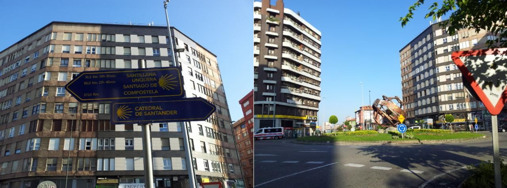
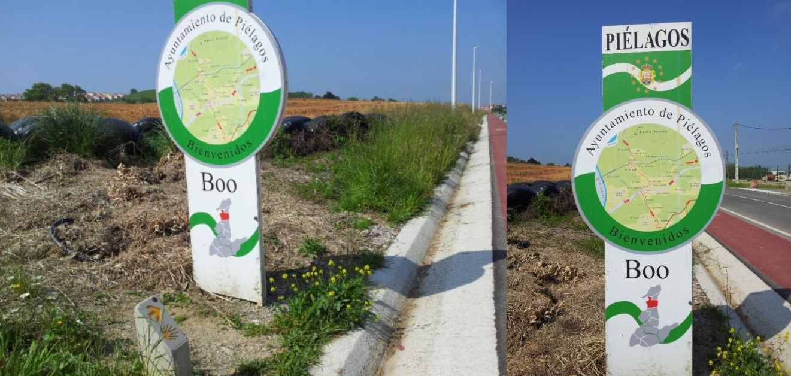
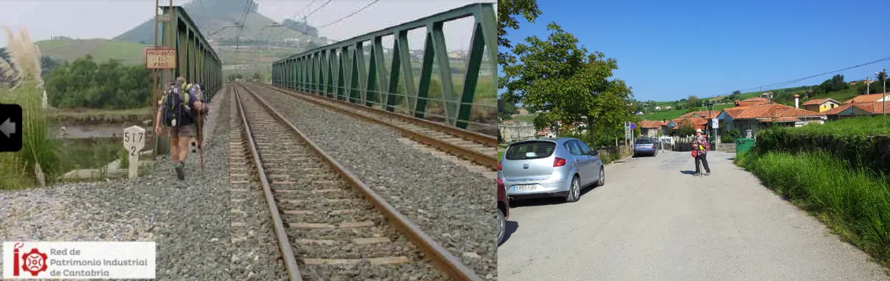
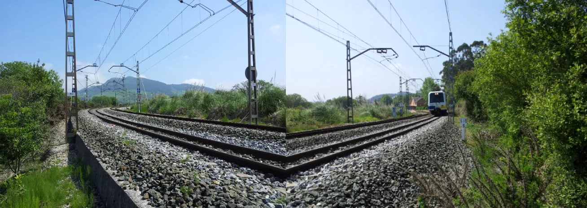

## Camino del Norte  2018

### Etappe-13:  →  ( Km)
21  Mai 2018

[Foto links](https://redpatrimonioindustrialcantabria.org/portfolio-item/puente-de-feve-sobre-el-rio-pas/)

🇩🇪  Dinge, die man nicht tun sollte, die ich aber getan habe. 

Die Dame aus Bosnien-Herzegowina weigerte sich und machte einen Umweg, der, wenn ich mich recht erinnere, etwa 10 km betrug.

Während meiner Ausbildung im Jahr 1990, im Rahmen eines ***innerbetriebliches Außendienstpraktikums*** in Münster, habe ich gelernt, welche Gefahren es birgt, neben einem fahrenden Zug herzugehen.

Ich habe die Abstände zwischen den Zügen aus der Ferne abgeschätzt und dann gewartet, bis ich die Brücke sicher überqueren konnte.

***Im Jahr 2024 haben wir den Zug genommen***

🇵🇹 Coisas que não se devem fazer, mas que eu fiz

A senhora da Bósnia-Herzegovina recusou-se e fez um desvio que, se bem me lembro, foi de cerca de 10 km.

Durante a minha formação em 1990, no âmbito de um ***estágio interno de serviço externo*** em Münster, aprendi quais são os perigos de caminhar ao lado de um comboio em movimento.

Calculei a distância entre os comboios à distância e depois esperei até poder atravessar a ponte em segurança.

***Em 2024, apanhámos o comboio***

🇪🇸 Cosas que no se deben hacer, pero que yo he hecho

La señora de Bosnia-Herzegovina se negó y dio un rodeo que, si no recuerdo mal, fue de unos 10 km.

Durante mi formación en 1990, en el marco de unas prácticas internas de servicio exterior en Münster, aprendí los peligros que conlleva caminar junto a un tren en marcha.

Calculé a ojo las distancias entre los trenes desde lejos y luego esperé hasta que pude cruzar el puente con seguridad.

***En 2024 cogimos el tren***

🇬🇧 Things you shouldn’t do, but which I did

The lady from Bosnia and Herzegovina refused and took a detour which, if I remember correctly, was about 10 km.

During my training in 1990, as part of an in-house fieldwork placement in Münster, I learnt about the dangers of walking alongside a moving train.

I estimated the distances between the trains from a distance and then waited until I could cross the bridge safely.

***In 2024, we took the train***

#### 🇪🇸 Las alternativas seguras y legales

- El viaje en tren de 2 minutos (Recomendado): Diríjase a la estación de tren de Boo de Piélagos y tome el tren regional FEVE hasta la siguiente parada, Mogro. El trayecto sobre el puente dura solo dos minutos, es muy económico y cruzará el río de forma totalmente segura. Podrá continuar su caminata desde la estación de Mogro.
- La alternativa a pie (Por Puente Arce): Siga las flechas amarillas oficiales hacia el interior, bordeando el río. Cruzará el río de manera segura a través del puente de la carretera en Puente Arce. Tenga en cuenta que esta opción añade unos 9,4 kilómetros adicionales a su etapa.
- Nota importante: La histórica barca de peregrinos (_Barca de Mogro_), que antiguamente cruzaba el río, ya no funciona de manera regular o fiable, por lo que no debe considerarse como una opción viable.

---
#### 🇬🇧 The Safe and Legal Alternatives

- The 2-Minute Train Ride (Recommended): Go to the train station in Boo de Piélagos and take the FEVE regional train to the next stop, Mogro. The ride across the bridge takes just two minutes, is very cheap, and keeps you completely safe. You can resume your walk immediately from Mogro station.
- The Walking Alternative (Via Puente Arce): Follow the official yellow arrows inland along the riverbank. You will cross the river safely via the road bridge in Puente Arce. Please note that this option adds about 9.4 kilometers (approx. 6 miles) to your daily walk.
- Important Note: The historical pilgrim boat (_Barca de Mogro_), which used to ferry people across, no longer operates reliably and should not be relied upon.

---
#### 🇩🇪  Die sicheren und legalen Alternativen

- Die 2-Minuten-Zugfahrt (Empfehlung): Gehen Sie zum Bahnhof in Boo de Piélagos und nehmen Sie den FEVE-Regionalzug zur nächsten Station Mogro. Die Fahrt über die Brücke dauert nur zwei Minuten, kostet sehr wenig und Sie überqueren den Fluss absolut sicher. Danach können Sie die Wanderung normal fortsetzen.
- Die Wander-Alternative (Über Puente Arce): Folgen Sie den offiziellen gelben Pfeilen landeinwärts entlang des Flusses. Sie überqueren den Fluss sicher über die Straßenbrücke in Puente Arce. Dies bedeutet jedoch einen zusätzlichen Fußweg von etwa 9,4 Kilometern.
- Wichtiger Hinweis: Das historische Pilgerboot (_Barca de Mogro_), das früher Pilger übersetzte, verkehrt seit langer Zeit nicht mehr verlässlich und sollte nicht eingeplant werden.

---
#### 🇵🇹 As alternativas seguras e legais

- A viagem de comboio de 2 minutos (Recomendado): Vá até à estação de comboios (trens) em Boo de Piélagos e apanhe o comboio regional FEVE até à paragem seguinte, Mogro. A viagem sobre a ponte dura apenas dois minutos, é muito barata e cruzará o rio em total segurança. Depois, poderá continuar a sua caminhada normalmente a partir da estação de Mogro.
- A alternativa a pé (Por Puente Arce): Siga as setas amarelas oficiais em direção ao interior, ao longo do rio. Cruzará o rio em segurança através da ponte rodoviária em Puente Arce. Tenha em atenção que esta opção acrescenta cerca de 9,4 quilómetros à sua caminhada.
- Nota importante: O histórico barco de peregrinos (_Barca de Mogro_), que antigamente fazia a travessia, já não funciona de forma regular ou fiável, pelo que não deve contar com ele.
---

🇩🇪 🇬🇧 🇪🇸🇵🇹

 The Bernoulli effect 

#### 🇩🇪 Bernoulli-Effekt 

- Bezeichnung des Effekts: Bernoulli-Effekt / Aerodynamischer Sog (Druck- und Sogwellen).
- Beschreibung: Ein schnell fahrender Zug verdrängt die Luft an der Spitze (Überdruck) und zieht die Luft an den Seiten mit sich. Durch die hohe Strömungsgeschwindigkeit der Luft direkt am Zug sinkt dort der Luftdruck (Bernoulli-Effekt). Da der Druck hinter einer Person normal bleibt, entsteht ein starker Sog in Richtung des Zuges.
- Gefahr beim Laufen an Schienen: Wer zu nah an den Schienen läuft, wird durch die Druckwelle der Zugfront zuerst weggestoßen und verliert das Gleichgewicht. Direkt danach reißt der extreme Unterdruck (Sog) die Person unter oder gegen den fahrenden Zug. Zudem können durch den Fahrtwind Schottersteine aufgewirbelt werden, die wie Geschosse wirken.

### 🇬🇧 English

- Name of the effect: Bernoulli's principle / Aerodynamic suction (Pressure and suction waves).
- Description: A fast-moving train displaces air at the front (positive pressure) and drags air along its sides. According to Bernoulli's principle, the high speed of the airflow next to the train causes the air pressure to drop, creating a low-pressure zone (suction). Since the atmospheric pressure behind a person remains normal, they are pushed toward the train.
- Danger when walking along tracks: Walking too close to the tracks is extremely dangerous. The initial pressure wave from the nose of the train can knock you off balance. Immediately after, the powerful suction can pull you under or into the moving train. Additionally, the turbulent airflow can kick up ballast stones (gravel), which can cause severe injuries.

#### 🇪🇸 Español

- Nombre del efecto: Principio de Bernoulli / Succión aerodinámica (Ondas de presión y succión).
- Descripción: Un tren a alta velocidad desplaza el aire en la parte delantera (presión positiva) y arrastra el aire a sus lados. Según el principio de Bernoulli, la gran velocidad del aire junto al tren hace que la presión caiga, creando una zona de baja presión (efecto de succión). Como la presión detrás de una persona es normal, esta es empujada hacia el tren.
- Peligro al caminar junto a las vías: Si alguien camina demasiado cerca, la onda de presión inicial del frente del tren puede hacerle perder el equilibrio. Justo después, la intensa fuerza de succión puede atraer a la persona debajo o contra el tren en movimiento. Además, el flujo de aire puede levantar piedras del balasto (grava) que actúan como proyectiles.

#### 🇵🇹 Português

- Nome do efeito: Princípio de Bernoulli / Sucção aerodinâmica (Ondas de pressão e sucção).
- Descrição: Um comboio (trem) em alta velocidade desloca o ar na parte frontal (pressão positiva) e arrasta o ar pelas laterais. De acordo com o princípio de Bernoulli, a alta velocidade do fluxo de ar junto ao veículo faz com que a pressão caia, gerando uma zona de baixa pressão (sucção). Como a pressão atrás de uma pessoa permanece normal, ela é empurrada em direção ao comboio.
- Perigo ao caminhar ao longo dos carris (trilhos): Caminhar perto dos carris é extremamente perigoso. A onda de pressão inicial da frente do comboio pode desequilibrar a pessoa. Em seguida, a forte força de sucção pode puxar a pessoa para debaixo ou contra o comboio em movimento. Além disso, o vento forte pode arremessar pedras do balastro (britas), causando ferimentos graves.

---

  

🇬🇧
🇪🇸
🇵🇹
🇩🇪

---

**↪** [Etappe-14](Etappe-14.md)

 🔁 [Camino-del-Norte_Etapas](Camino-del-Norte_Etapas.md)
 

 ...→